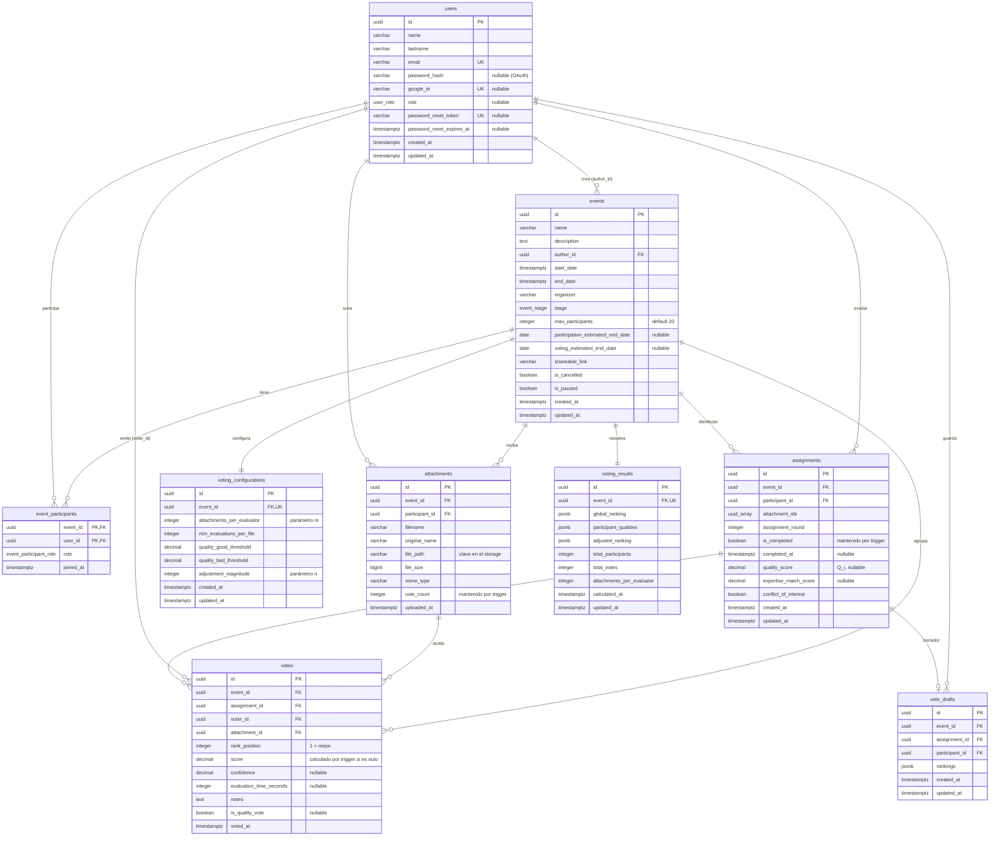

# Database Schema: `telescopio_db`

| | |
|---|---|
| **Motor** | PostgreSQL |
| **Extensiones** | `uuid-ossp` |
| **Acceso** | GORM 1.30.2 (`gorm.io/driver/postgres`) |
| **Servicio propietario** | [`api`](../architectures/api/index.md) |
| **Migraciones** | 20, versionadas en Go (`internal/storage/migrations/`) |

Todo el estado del producto vive acá. Las claves primarias son UUID generadas por
`uuid_generate_v4()` o por la aplicación en el hook `BeforeCreate`.

> **Esta base no es un almacén pasivo.** Una parte importante de las reglas de negocio está
> implementada en funciones plpgsql y triggers. Ver [Triggers y reglas](#triggers-y-reglas-de-negocio)
> antes de escribir en estas tablas.

---

## Diagrama de entidades



---

## Tipos enumerados

| Tipo | Valores | Notas |
|---|---|---|
| `event_stage` | `creation`, `participation`, `voting`, `results` | La migración 012 unificó `registration` y `attachment_upload` en `participation` |
| `user_role` | `admin`, `participant`, `organizer` | Rol **global**. Nullable desde la migración 010 |
| `event_participant_role` | `creator`, `participant` | Rol **dentro de un evento** |

El modelo de roles tiene dos niveles: `users.role` para capacidades del sistema y
`event_participants.role` para quién manda en cada evento. Un usuario puede ser `creator`
de un evento y `participant` de otro.

---

## Entidades

### `users`

| Columna | Tipo | Restricciones |
|---|---|---|
| `id` | `uuid` | PK, `uuid_generate_v4()` |
| `name` | `varchar` | NOT NULL |
| `lastname` | `varchar` | |
| `email` | `varchar` | NOT NULL, UNIQUE, CHECK de formato |
| `password_hash` | `varchar(255)` | **Nullable** — los usuarios de Google OAuth y los creados al registrarse a un evento no tienen |
| `google_id` | `varchar` | UNIQUE, nullable. Índice parcial `WHERE google_id IS NOT NULL` |
| `role` | `user_role` | Nullable desde la migración 010 |
| `password_reset_token` | `varchar(64)` | UNIQUE, nullable. Hex de 32 bytes |
| `password_reset_expires_at` | `timestamptz` | Nullable. Vigencia de 1 hora |
| `created_at` / `updated_at` | `timestamptz` | |

Password con bcrypt (`DefaultCost`), mínimo 8 caracteres, validado en el dominio.

### `events`

| Columna | Tipo | Restricciones |
|---|---|---|
| `id` | `uuid` | PK |
| `name` | `varchar` | NOT NULL |
| `description` | `text` | NOT NULL |
| `author_id` | `uuid` | NOT NULL, FK → `users.id` |
| `start_date` / `end_date` | `timestamptz` | NOT NULL, CHECK `end_date >= start_date` |
| `organizer` | `varchar(200)` | Default `''` |
| `stage` | `event_stage` | NOT NULL, default `creation` |
| `max_participants` | `integer` | NOT NULL, default 20 |
| `participation_estimated_end_date` | `date` | Nullable |
| `voting_estimated_end_date` | `date` | Nullable |
| `shareable_link` | `varchar(255)` | `/events/{id}` |
| `is_cancelled` | `boolean` | NOT NULL, default `false` |
| `is_paused` | `boolean` | NOT NULL, default `false` |

CHECK `future_start_date` (`start_date >= now() - 1 día`) declarado `NOT VALID`: solo
aplica a filas nuevas o modificadas, no a las existentes.

`is_cancelled` e `is_paused` son independientes de `stage`: un evento puede estar pausado
en cualquier etapa.

### `event_participants`

PK compuesta `(event_id, user_id)`. Tabla de relación con rol.

| Columna | Tipo | Restricciones |
|---|---|---|
| `event_id` | `uuid` | PK, FK → `events.id` |
| `user_id` | `uuid` | PK, FK → `users.id` |
| `role` | `event_participant_role` | NOT NULL, default `participant` |
| `joined_at` | `timestamptz` | |

### `attachments`

Las propuestas (conjunto `F` del modelo matemático). **Una por participante por evento**,
restricción impuesta por la aplicación.

| Columna | Tipo | Restricciones |
|---|---|---|
| `id` | `uuid` | PK |
| `event_id` | `uuid` | NOT NULL, FK |
| `participant_id` | `uuid` | NOT NULL, FK → `users.id` |
| `filename` | `varchar` | NOT NULL, CHECK longitud > 0. Nombre generado |
| `original_name` | `varchar` | NOT NULL. Nombre que subió el usuario |
| `file_path` | `varchar` | NOT NULL. **Clave en el storage**, no una ruta del filesystem |
| `file_size` | `bigint` | NOT NULL, CHECK entre 1 y 104857600 (100MB) |
| `mime_type` | `varchar(100)` | NOT NULL |
| `vote_count` | `integer` | Default 0. **Lo mantiene un trigger** |
| `uploaded_at` | `timestamptz` | |

### `voting_configurations`

Parámetros del algoritmo, uno por evento (`event_id` UNIQUE).

| Columna | Tipo | Restricciones |
|---|---|---|
| `attachments_per_evaluator` | `integer` | NOT NULL, CHECK entre 1 y 50. Parámetro `m` |
| `min_evaluations_per_file` | `integer` | NOT NULL, default 3, CHECK > 0 |
| `quality_good_threshold` | `decimal(3,2)` | Q_good |
| `quality_bad_threshold` | `decimal(3,2)` | Q_bad |
| `adjustment_magnitude` | `integer` | CHECK entre 0 y 20. Parámetro `n` |

CHECK `valid_quality_thresholds`: `quality_good_threshold > quality_bad_threshold` **y** la
diferencia debe ser ≥ 0.1.

> **Divergencia entre el modelo de migración y el dominio.** El modelo que crea la tabla
> (`migrations/models.go`) declara además `use_expertise_matching`, `enable_co_idetection`,
> `randomization_seed`, `assignment_algorithm` y `scoring_algorithm`, con defaults de
> umbrales `0.65`/`0.35`. La entidad de dominio (`internal/domain/vote/vote.go`) **no conoce
> esas columnas** y usa defaults `0.6`/`0.3`. Las columnas existen en la base pero la
> aplicación no las lee ni las escribe: quedan con su valor por defecto. Es deuda a
> resolver, no una funcionalidad disponible.

### `assignments`

La función de asignación `A: P → 2^F`.

| Columna | Tipo | Restricciones |
|---|---|---|
| `id` | `uuid` | PK |
| `event_id` | `uuid` | NOT NULL, FK |
| `participant_id` | `uuid` | NOT NULL, FK → `users.id` |
| `attachment_ids` | `uuid[]` | Array de UUIDs. Mapeado con `pq.StringArray` |
| `assignment_round` | `integer` | Default 1 |
| `is_completed` | `boolean` | Default `false`. **Lo mantiene un trigger** |
| `completed_at` | `timestamptz` | Nullable. Lo setea el trigger |
| `quality_score` | `decimal(5,4)` | Nullable, CHECK en `[0,1]`. Es `Q_i` |
| `expertise_match_score` | `decimal(3,2)` | Nullable. No se usa |
| `conflict_of_interest` | `boolean` | Default `false` |

### `votes`

Los rankings individuales `R_i: A(p_i) → {1..m}`.

| Columna | Tipo | Restricciones |
|---|---|---|
| `id` | `uuid` | PK |
| `event_id` | `uuid` | NOT NULL, FK |
| `assignment_id` | `uuid` | NOT NULL, FK |
| `voter_id` | `uuid` | NOT NULL, FK → `users.id` |
| `attachment_id` | `uuid` | NOT NULL, FK |
| `rank_position` | `integer` | NOT NULL, CHECK > 0. **1 = mejor** |
| `score` | `decimal(10,4)` | Nullable. **Lo calcula un trigger si viene nulo** |
| `confidence` | `decimal(3,2)` | Nullable, CHECK en `[0,1]`. No se usa |
| `evaluation_time_seconds` | `integer` | Nullable, CHECK > 0. No se usa |
| `notes` | `text` | No se usa |
| `is_quality_vote` | `boolean` | Nullable. No se usa |

### `vote_drafts`

Borradores de ranking, para no perder el progreso antes del envío definitivo.
Creada en la migración 016 con SQL explícito (no por AutoMigrate).

| Columna | Tipo | Restricciones |
|---|---|---|
| `id` | `uuid` | PK |
| `event_id` | `uuid` | NOT NULL, FK → `events.id` ON DELETE CASCADE |
| `assignment_id` | `uuid` | NOT NULL, FK → `assignments.id` ON DELETE CASCADE |
| `participant_id` | `uuid` | NOT NULL, FK → `users.id` ON DELETE CASCADE |
| `rankings` | `jsonb` | NOT NULL, default `'[]'`. Array de `{attachment_id, rank}` |

UNIQUE `(assignment_id, participant_id)`: un borrador por asignación y participante. El
guardado es un upsert sobre esa clave.

Es la única tabla con `ON DELETE CASCADE` explícito.

### `voting_results`

Resultados calculados, uno por evento (`event_id` UNIQUE).

| Columna | Tipo | Contenido |
|---|---|---|
| `global_ranking` | `jsonb` | Array de `AttachmentResult` ordenado por MBC |
| `participant_qualities` | `jsonb` | Objeto `{uuid_participante: Q_i}` |
| `adjusted_ranking` | `jsonb` | Array tras aplicar los incentivos |
| `total_participants` | `integer` | CHECK > 0 |
| `total_votes` | `integer` | CHECK `>= total_participants` |
| `attachments_per_evaluator` | `integer` | El `m` usado en el cálculo |

Forma de cada elemento de los rankings:

```json
{
  "attachment_id": "uuid", "filename": "...", "participant_id": "uuid",
  "participant_name": "...", "mbc_score": 0.0, "global_rank": 1,
  "adjusted_rank": 1, "vote_count": 0, "average_rank": 0.0
}
```

> **Misma divergencia que en `voting_configurations`.** La tabla se crea con columnas
> adicionales (`statistical_metrics`, `algorithm_used`, `quality_adjustments_applied`,
> `overall_quality_score`, `good_evaluator_count`, `bad_evaluator_count`,
> `consensus_strength`) que la entidad de dominio no conoce. Notablemente, el CHECK
> `valid_evaluator_counts` referencia `good_evaluator_count` y `bad_evaluator_count`:
> esas columnas quedan en 0 y el CHECK pasa trivialmente.

---

## Triggers y reglas de negocio

**Esto es lo más importante del esquema.** Definidas en
`internal/storage/migrations/004_constraints_and_triggers.go`.

### `validate_assignment_constraints` — BEFORE INSERT OR UPDATE ON `assignments`

Si el evento tiene configuración de votación:

1. La cantidad de `attachment_ids` debe ser **exactamente** `attachments_per_evaluator`.
2. Todos los attachments deben existir y pertenecer al evento.
3. **Ninguno puede ser del propio participante** — el conflicto de interés, garantizado
   a nivel de base.

### `validate_vote_constraints` — BEFORE INSERT OR UPDATE ON `votes`

1. El votante debe tener una asignación en ese evento.
2. El attachment votado debe estar en su asignación.
3. `rank_position` no puede superar `attachments_per_evaluator`.
4. Si `score` viene nulo, lo calcula:
   `(m − rank_position + 1) × 100 / m`.

### `update_assignment_completion` — AFTER INSERT OR DELETE ON `votes`

Cuenta los votos del participante en el evento y marca o desmarca `is_completed` y
`completed_at` según coincida con la cantidad de attachments asignados. **La aplicación no
setea este campo.**

### `update_attachment_vote_count` — AFTER INSERT OR DELETE ON `votes`

Incrementa o decrementa `attachments.vote_count`.

### `check_coverage_constraints(event_id)` — función auxiliar

Verifica que `participantes × m ≥ attachments × min_evaluations_per_file`. La usa la vista
`system_validation`.

### Implicancias

- **El conflicto de interés se valida dos veces**: en Go (`VotingService.hasConflictOfInterest`)
  y en el trigger. Cambiar una sola deja el sistema inconsistente.
- **Una violación de trigger llega como `RAISE EXCEPTION` de plpgsql**, sin la forma de
  error de la API. Se convierte en un `500` genérico.
- **Los tests de integración que insertan directo van a chocar con estas reglas**: los datos
  tienen que ser coherentes con la `voting_configuration` del evento.
- **Insertar votos manualmente altera `vote_count` e `is_completed`** sin intervención de la
  aplicación.

---

## Vistas

Definidas en la migración 005 (`system_validation` fue recreada en la 012):

| Vista | Para qué |
|---|---|
| `assignment_statistics` | Estadísticas de asignaciones por evento |
| `voting_progress` | Avance de la votación |
| `system_validation` | Valida la configuración matemática: clasifica `m` como `OPTIMAL` / `ACCEPTABLE` / `INSUFFICIENT` según `m ≥ 2·log₂(k)`, y calcula el ratio de cobertura |
| `quality_assessment` | Evaluación de calidad de los evaluadores |

Ninguna se consulta desde la aplicación: son herramientas de inspección manual.

---

## Índices

Creados en la migración 003. Además de las PK y los UNIQUE:

**`users`** — `email`, `role`, `google_id` (parcial, `WHERE google_id IS NOT NULL`)
**`events`** — `author_id`, `stage`, `(start_date, end_date)`, `created_at DESC`
**`event_participants`** — `event_id`, `user_id`
**`attachments`** — `event_id`, `participant_id`, `vote_count DESC`, `uploaded_at DESC`
**`voting_configurations`** — `event_id`
**`assignments`** — `event_id`, `participant_id`, `is_completed`, `quality_score DESC`, `assignment_round`
**`votes`** — `event_id`, `assignment_id`, `voter_id`, `attachment_id`, `rank_position`, `score DESC`, `is_quality_vote`, `(event_id, voter_id)`
**`voting_results`** — `event_id`, `calculated_at DESC`
**`vote_drafts`** — `assignment_id`, `participant_id`

---

## Estrategia de migraciones

Migraciones en Go, no en SQL, con `Up` y `Down` registradas en orden en
`migrations.GetMigrations()`. Se ejecutan automáticamente al arrancar el servicio
(`postgres.AutoMigrate`).

| # | Nombre | Qué hace |
|---|---|---|
| 001 | `create_extensions_and_types` | `uuid-ossp`, enums `event_stage` y `user_role` |
| 002 | `create_core_tables` | Crea las 8 tablas base vía `AutoMigrate` sobre los modelos |
| 003 | `create_indexes` | Índices de performance |
| 004 | `create_constraints_and_triggers` | Funciones plpgsql, triggers y CHECK constraints |
| 005 | `create_views_and_functions` | Las 4 vistas |
| 006 | `insert_sample_data` | Datos de ejemplo |
| 007 | `add_organizer_to_events` | Columna `organizer` |
| 008 | `fix_assignment_constraints` | Corrección de constraints |
| 009 | `fix_attachment_ids_type` | Tipo del array de attachments |
| 010 | `event_participant_roles_and_shareable_links` | Rol por evento; `users.role` pasa a nullable; `shareable_link` |
| 011 | `shareable_link_constraints` | `shareable_link` NOT NULL |
| 012 | `unify_participation_stages` | **Unifica `registration` + `attachment_upload` en `participation`**, recreando el enum |
| 013 | `add_max_participants_to_events` | Cupo, default 20 |
| 014 | `add_estimated_end_dates_to_events` | Fechas estimadas por etapa |
| 015 | `add_password_hash_to_users` | Password local |
| 016 | `add_vote_drafts` | Tabla `vote_drafts` |
| 017 | `add_google_oauth_support` | `google_id`; `password_hash` pasa a nullable |
| 018 | `add_is_cancelled_to_events` | Cancelación |
| 019 | `add_password_reset_to_users` | Token de recuperación |
| 020 | `add_is_paused_to_events` | Pausa |

Notas:

- La migración 002 delega en `AutoMigrate` de GORM. **Agregar un campo a una entidad no
  alcanza** para una base ya existente: hay que sumar la migración con el ALTER.
- La 012 es la más delicada: recrea el tipo enum, con eliminación y recreación de la vista
  `system_validation` y desactivación temporal del CHECK `future_start_date`.
- El `Down` de la 017 **no restaura** `password_hash NOT NULL`, deliberadamente, para no
  romper los usuarios OAuth ya creados.
- Existe un `migrations/003_add_password_hash.sql` suelto en la raíz del repo, fuera del
  sistema de migraciones de Go. No se ejecuta.
