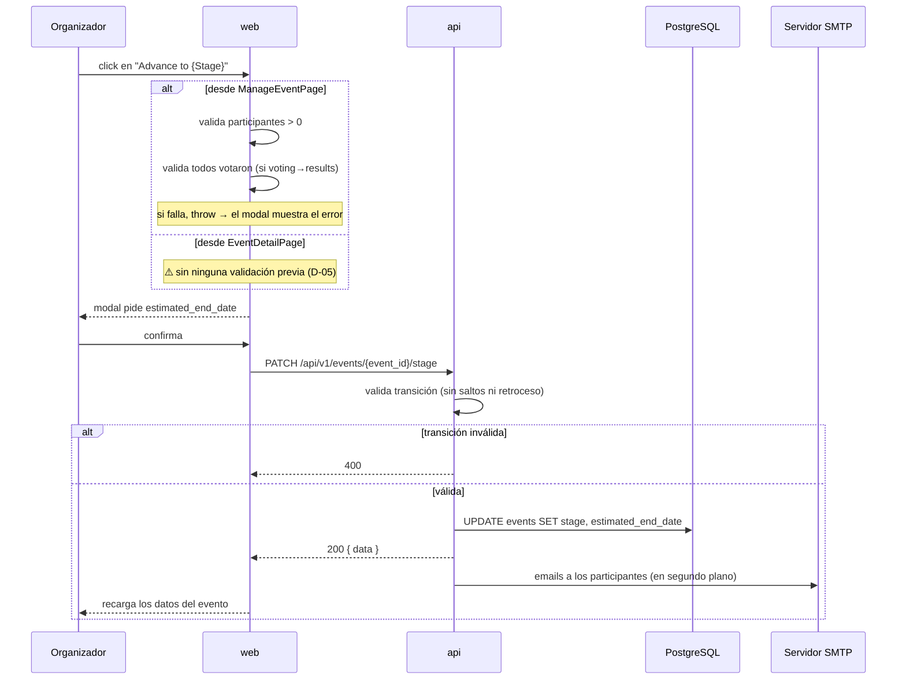

# Avance de etapa del evento

**Tipo:** Evento
**Status:** Active (implementado en el código existente)
**Creado:** 2026-09-18
**Última actualización:** 2026-09-18
**Stories:** — (documentado retroactivamente desde el código)

## Descripción

La transición del evento por sus cuatro etapas: `creation → participation → voting → results`.
Es la acción de control del organizador y el disparador de las notificaciones por email.

**Sin retroceso ni saltos.** Cada avance es irreversible desde la interfaz.

⚠️ **Este flujo tiene una inconsistencia conocida (D-05): la misma acción se comporta distinto
según desde qué pantalla se ejecute.** Está documentada en el Paso 1.

## Servicios Involucrados

| Servicio | Rol | Tipo de Participación |
|----------|-----|-----------------------|
| `web` | Presenta el modal de avance y — según la pantalla — valida precondiciones | Iniciador |
| `api` | Valida la transición, actualiza la etapa, dispara los emails | Procesador |
| PostgreSQL | Persiste `events.stage` y los deadlines estimados | Almacenamiento |
| SMTP | Entrega la notificación a los participantes | Notificador |

## Pasos del Flujo



---

### Paso 1: Validaciones previas en el cliente

**Origen:** `web` · **Destino:** `web` · **Tipo:** Interno

⚠️ **Acá está la inconsistencia D-05.** Las validaciones dependen de la pantalla:

**Desde `ManageEventPage`** (`:232-252`) — valida antes de llamar a la API:

| Validación | Regla |
|---|---|
| Sin participantes | Bloquea si se avanza desde `participation` con `participants.length === 0` → `Cannot advance: No participants registered yet.` |
| Votación incompleta | Bloquea si se avanza de `voting` a `results` con `votedCount < totalParticipants` → `Cannot advance: Only {x} of {y} participants have voted.` |

El error se lanza con `throw` y lo captura `StageAdvanceModal`, que lo muestra en su propio bloque.

**Desde `EventDetailPage`** (`:284-420`) — **ninguna validación**. El mismo avance se ejecuta sin
chequeos.

**Consecuencia real:** un organizador que avance desde la pantalla de detalle puede cerrar la
votación con evaluaciones pendientes. Quien no completó recibe `Q_i = 0` y **su propia propuesta
baja `n` posiciones**: un cierre prematuro penaliza a gente que todavía tenía plazo.

> Un comentario en `ManageEventPage.tsx:238-239` indica que se **eliminó deliberadamente** la
> validación de que todos hubieran subido archivo antes de votar.

**Ref:** `web/src/pages/manage-event/ManageEventPage.tsx:232-252`;
`web/src/pages/event-detail/EventDetailPage.tsx:284-420`

---

### Paso 2: Confirmar la etapa destino y el deadline

**Origen:** `web` (modal) · **Destino:** `web` · **Tipo:** Interno

`StageAdvanceModal` pide la fecha estimada de fin de la etapa destino. El campo tiene `min` = hoy.

---

### Paso 3: Avanzar la etapa

**Origen:** `web` · **Destino:** `api` · **Tipo:** REST

- **Método:** PATCH
- **Endpoint:** `/api/v1/events/{event_id}/stage`
- **Auth:** JWT Bearer — **solo el autor del evento o un admin**
- **Body:**
  ```json
  {
    "stage":              "enum — req: creation | participation | voting | results",
    "estimated_end_date": "string (date, YYYY-MM-DD) — obligatoria si stage es participation o voting"
  }
  ```

**Response (éxito) — 200:** envelope `data` con el evento actualizado.

**Validaciones del backend:**
- Transiciones válidas: `creation → participation → voting → results`. **Sin retroceso ni saltos.**
- `estimated_end_date` es **obligatoria** cuando la etapa destino es `participation` o `voting`.
- **Pasar a `voting` exige al menos 2 propuestas cargadas.**

**Operación de BD:** `UPDATE` sobre `events` — `stage` y, según la etapa destino,
`participation_estimated_end_date` o `voting_estimated_end_date`.

**Ref:** `docs/apis/api.yaml` → `/api/v1/events/{event_id}/stage`;
`api/internal/domain/event/events.go:69-92`

---

### Paso 4: Notificación por email

**Origen:** `api` · **Destino:** SMTP · **Tipo:** Interno (asincrónico)

Se disparan **en segundo plano**, sin bloquear la respuesta HTTP: el avance de etapa se confirma
al organizador aunque el envío falle.

**Destinatarios:** los participantes registrados del evento.

⚠️ **Sin reintentos ni cola.** Si el envío falla, el email se pierde y nadie se entera — ni el
organizador ni el participante. Es relevante porque el email es el mecanismo por el que un
participante se entera de que se abrió la votación.

**Ref:** `api/internal/email/`

---

## Transiciones y sus Efectos

| Transición | Precondición | Qué habilita |
|---|---|---|
| `creation → participation` | `estimated_end_date` requerida | Registro de participantes y carga de propuestas |
| `participation → voting` | `estimated_end_date` requerida · **≥ 2 propuestas** · (desde Manage: ≥ 1 participante) | Configuración de votación y generación de asignaciones |
| `voting → results` | (desde Manage: todos votaron) | Panel de resultados |

## Acciones Independientes de la Etapa

`is_paused` e `is_cancelled` son **independientes de `stage`**: un evento puede pausarse o
cancelarse en cualquier etapa.

| Acción | Endpoint | Efecto |
|---|---|---|
| Pausar / reanudar | `PATCH /api/v1/events/{event_id}/pause` | Con el evento pausado no se puede registrar ni subir propuestas |
| Cancelar | `PATCH /api/v1/events/{event_id}/cancel` | Dispara email de cancelación |
| Posponer deadline | `PATCH /api/v1/events/{event_id}/estimated-end-date` | **Solo posponer, no adelantar** — regla activa en el backend. ⚠️ El cliente no la valida (D-06) |

> La confirmación de pausa usa **`window.confirm` nativo** (`ManageEventPage.tsx:258`), el único
> diálogo no-React de la aplicación.

## Manejo de Errores

| Paso | Condición | Respuesta | Qué ve el organizador |
|---|---|---|---|
| 1 | Sin participantes (solo desde Manage) | — | `Cannot advance: No participants registered yet.` |
| 1 | Votación incompleta (solo desde Manage) | — | `Cannot advance: Only {x} of {y} participants have voted.` |
| 3 | Salto de etapa o retroceso | 400 | Mensaje del backend |
| 3 | Falta `estimated_end_date` | 400 | Idem |
| 3 | Menos de 2 propuestas al pasar a `voting` | 400 | Idem |
| 3 | No es el autor del evento | 403 | — |
| 4 | Falla el envío de email | — | ⚠️ **Nada.** Falla en silencio |

⚠️ **`ManageEventPage` no muestra ningún mensaje de éxito** tras avanzar de etapa: el único
feedback es que los datos se recargan. `EventDetailPage` sí muestra `Stage updated to: {etapa}`.

## Estado Resultante

- `events.stage` — la nueva etapa.
- `events.participation_estimated_end_date` o `voting_estimated_end_date` — el deadline fijado.
- Los participantes reciben (o no, si SMTP falla) el email de cambio de etapa.
- Las acciones habilitadas en la interfaz cambian según la etapa, para todos los roles.
