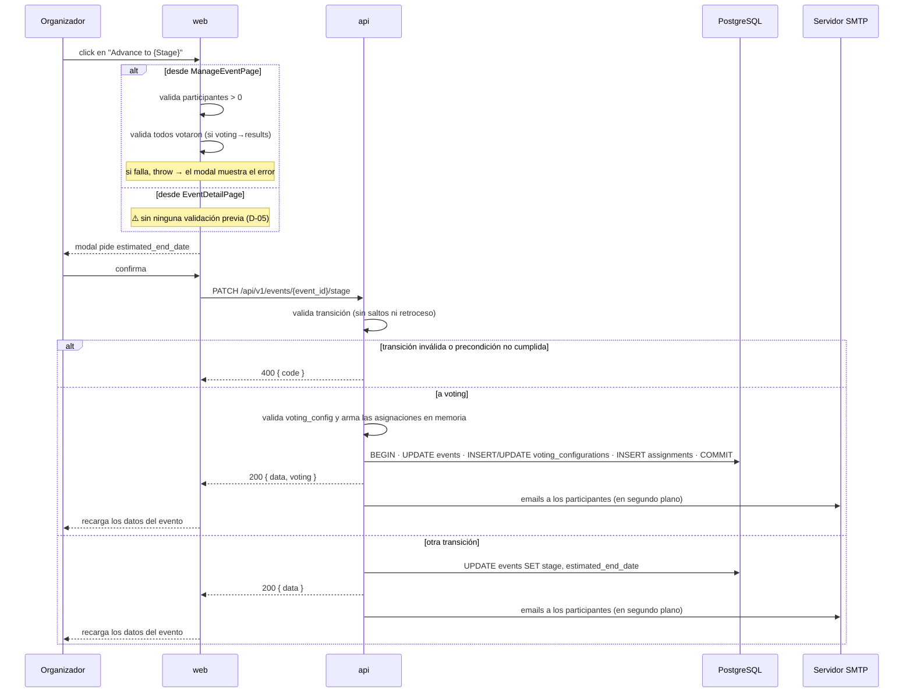

# Avance de etapa del evento

**Tipo:** Evento
**Status:** Active (implementado en el código existente)
**Creado:** 2026-09-18
**Última actualización:** 2026-10-04
**Stories:** S-006, S-009, S-015, S-016 (cambios planificados por REQ-003)

## Descripción

La transición del evento por sus cuatro etapas: `creation → participation → voting → results`.
Es la acción de control del organizador y el disparador de las notificaciones por email.

**Sin retroceso ni saltos.** Cada avance es irreversible desde la interfaz.

⚠️ **Este flujo tiene una inconsistencia conocida (D-05): la misma acción se comporta distinto
según desde qué pantalla se ejecute.** Está documentada en el Paso 1.

## Cambios planificados (REQ-003)

> Diseño aprobado, **pendiente de implementar**. Lo de arriba describe el código actual; al
> implementar cada story, incorporar estos cambios al paso correspondiente y quitarlos de acá.

| Paso | Cambio | Story |
|---|---|---|
| 1 | Se reemplaza la doble validación de `ManageEventPage`/`EventDetailPage` por un único módulo `web/src/domain/stages.ts`, usado **solo desde la gestión**. Se elimina "todos votaron". `EventDetailPage` deja de avanzar etapas. Cierra D-05 | S-015, S-016 |
| 2 | El modal pasa a `Dialog` + `DateQuickPicker` (atajos 3 días / 1 semana / 2 semanas). Para `voting` el diálogo incluye la configuración (`GET /api/v1/events/{event_id}/voting-config/preview`) | S-016 |
| Acciones | "Posponer deadline" también se valida en el cliente (cierra D-06) | S-016 |

**Tabla de transiciones resultante:**

| Transición | Precondición |
|---|---|
| `creation → participation` | `estimated_end_date` requerida. El evento pasa a ser visible (hasta ahí, 404 para quien no es el autor — S-008) |
| `participation → voting` | `estimated_end_date` + `voting_config` · **≥ 3 participantes con propuesta** |
| `voting → results` | Confirmación explícita en el diálogo, aun con rankings faltantes |

## Servicios Involucrados

| Servicio | Rol | Tipo de Participación |
|----------|-----|-----------------------|
| `web` | Presenta el modal de avance y — según la pantalla — valida precondiciones | Iniciador |
| `api` | Valida la transición, actualiza la etapa, dispara los emails | Procesador |
| PostgreSQL | Persiste `events.stage` y los deadlines estimados | Almacenamiento |
| SMTP | Entrega la notificación a los participantes | Notificador |

## Pasos del Flujo


```mermaid
sequenceDiagram
    participant O as Organizador
    participant WEB as web
    participant API as api
    participant DB as PostgreSQL
    participant SMTP as Servidor SMTP

    O->>WEB: click en "Advance to {Stage}"

    alt desde ManageEventPage
        WEB->>WEB: valida participantes > 0
        WEB->>WEB: valida todos votaron (si voting→results)
        Note over WEB: si falla, throw → el modal muestra el error
    else desde EventDetailPage
        Note over WEB: ⚠️ sin ninguna validación previa (D-05)
    end

    WEB-->>O: modal pide estimated_end_date
    O->>WEB: confirma
    WEB->>API: PATCH /api/v1/events/{event_id}/stage
    API->>API: valida transición (sin saltos ni retroceso)
    alt transición inválida o precondición no cumplida
        API-->>WEB: 400 { code }
    else a voting
        API->>API: valida voting_config y arma las asignaciones en memoria
        API->>DB: BEGIN · UPDATE events · INSERT/UPDATE voting_configurations · INSERT assignments · COMMIT
        API-->>WEB: 200 { data, voting }
        API->>SMTP: emails a los participantes (en segundo plano)
        WEB-->>O: recarga los datos del evento
    else otra transición
        API->>DB: UPDATE events SET stage, estimated_end_date
        API-->>WEB: 200 { data }
        API->>SMTP: emails a los participantes (en segundo plano)
        WEB-->>O: recarga los datos del evento
    end
```

---

### Paso 1: Validaciones previas en el cliente

**Origen:** `web` · **Destino:** `web` · **Tipo:** Interno

⚠️ **D-05 (parcialmente resuelta).** Las validaciones de `participation` → `voting` ahora están en
ambas pantallas y coinciden con el backend; el resto de las transiciones todavía depende de la pantalla.

**Desde `ManageEventPage`** (`:232-252`) — valida antes de llamar a la API:

| Validación | Regla |
|---|---|
| Sin participantes | Bloquea si se avanza desde `participation` con `participants.length === 0` → `Cannot advance: No participants registered yet.` |
| Participantes insuficientes | Bloquea si se avanza de `participation` a `voting` con 1 o 2 participantes → `Cannot advance to voting: only {n} participant(s) registered. At least 3 participants are required.` |
| Votación incompleta | Bloquea si se avanza de `voting` a `results` con `votedCount < totalParticipants` → `Cannot advance: Only {x} of {y} participants have voted.` |

El error se lanza con `throw` y lo captura `StageAdvanceModal`, que lo muestra en su propio bloque.

**Desde `EventDetailPage`** — valida el mínimo de 3 para `participation` → `voting` (contra
`event.participant_ids`) y también re-lanza el error para que lo muestre `StageAdvanceModal`.
Con 0 participantes el mensaje es `Cannot advance to voting: no participants registered yet.`;
con 1 o 2, el mismo que en `ManageEventPage`.
Para el resto de las transiciones sigue sin chequeos previos: el backend responde con 400 y el
mensaje se propaga al modal.

**Consecuencia real:** un organizador que avance desde la pantalla de detalle puede cerrar la
votación con evaluaciones pendientes. Quien no completó recibe `Q_i = 0` y **su propia propuesta
baja `n` posiciones**: un cierre prematuro penaliza a gente que todavía tenía plazo.

> Un comentario en `ManageEventPage.tsx:238-239` indica que se **eliminó deliberadamente** la
> validación de que todos hubieran subido archivo antes de votar.

**Ref:** `web/src/pages/manage-event/ManageEventPage.tsx:232-252`;
`web/src/pages/event-detail/EventDetailPage.tsx:284-420`

---

### Paso 2: Confirmar la etapa destino y el deadline

**Origen:** `web` (modal) · **Destino:** `web` · **Tipo:** Interno

`StageAdvanceModal` pide la fecha estimada de fin de la etapa destino. El campo tiene `min` = hoy.

---

### Paso 3: Avanzar la etapa

**Origen:** `web` · **Destino:** `api` · **Tipo:** REST

- **Método:** PATCH
- **Endpoint:** `/api/v1/events/{event_id}/stage`
- **Auth:** JWT Bearer — **solo el autor del evento o un admin**
- **Body:**
  ```json
  {
    "stage":              "enum — req: creation | participation | voting | results",
    "estimated_end_date": "string (date, YYYY-MM-DD) — obligatoria si stage es participation o voting",
    "voting_config": {
      "attachments_per_evaluator": "integer — req, 1..50",
      "quality_good_threshold":    "number — opt, 0..1, default 0.6",
      "quality_bad_threshold":     "number — opt, 0..1, default 0.3",
      "adjustment_magnitude":      "integer — opt, 1..10, default 3",
      "min_evaluations_per_file":  "integer — opt, 1..20, default min(3, attachments_per_evaluator)"
    }
  }
  ```
  `voting_config` es obligatorio cuando `stage = voting` y se ignora en el resto de las transiciones.

**Response (éxito) — 200:** envelope `data` con el evento actualizado, `message`, `code:
STAGE_UPDATED` y `transition: { from, to }`. Cuando `stage = voting` suma
`voting: { configuration, assignments_count, total_attachments }`.

**Validaciones del backend:**
- Transiciones válidas: `creation → participation → voting → results`. **Sin retroceso ni saltos.**
- `estimated_end_date` es **obligatoria** cuando la etapa destino es `participation` o `voting`.
- **Pasar a `voting`** se valida completo antes de escribir, en este orden:
  1. **Al menos 3 participantes con propuesta** → `400 INSUFFICIENT_ATTACHMENTS` con
     `current_count` y `required_minimum: 3`. Ya no se exige un mínimo de inscriptos ni existen
     `INSUFFICIENT_PARTICIPANTS` ni `NO_ATTACHMENTS` en esta transición.
  2. `voting_config` presente → `400 MISSING_VOTING_CONFIG`.
  3. Reglas de la configuración (las mismas que usa la vista previa, ver
     [configuración y generación de asignaciones](configuracion-y-generacion-de-asignaciones.md)):
     `400 INVALID_THRESHOLDS`, `400 M_EXCEEDS_EVALUABLE` o `400 MATH_CONSTRAINT_VIOLATION`, con el
     detalle en `details`. Un cuerpo mal formado o con `attachments_per_evaluator` fuera de 1..50
     responde `400 INVALID_PAYLOAD`.
- **Escritura atómica.** Etapa, configuración y asignaciones se guardan en una única transacción
  (`UPDATE events` → `INSERT voting_configurations` → `INSERT assignments`). Si el evento ya tenía
  una configuración creada con el endpoint deprecado, se reemplaza en la misma transacción. Si algo
  falla, rollback completo, `500 VOTING_SETUP_ERROR` y el evento sigue en `participation`.
- Pasar a `results` calcula y guarda el ranking (`CalculateAndPersistResults`), también cuando
  faltan rankings (el CHECK `valid_participant_counts` se relajó con la migración 023). Si el
  cálculo falla, la etapa cambia igual y el error solo se loguea (ver
  [cálculo y publicación de resultados](calculo-y-publicacion-de-resultados.md)).

**Operación de BD:** `UPDATE` sobre `events` — `stage` y, según la etapa destino,
`participation_estimated_end_date` o `voting_estimated_end_date`. Para `voting`, además
`voting_configurations` y `assignments` dentro de la misma transacción.

**Ref:** `docs/apis/api.yaml` → `/api/v1/events/{event_id}/stage`;
`api/internal/domain/event/events.go:69-92`

---

### Paso 4: Notificación por email

**Origen:** `api` · **Destino:** SMTP · **Tipo:** Interno (asincrónico)

Se disparan **en segundo plano**, sin bloquear la respuesta HTTP: el avance de etapa se confirma
al organizador aunque el envío falle.

**Destinatarios:** los participantes registrados del evento.

**Notificaciones in-app (S-009).** Además del email, y antes de lanzar la goroutine de email, el handler inserta una notificación `stage_changed` por inscripto (el autor queda excluido), con `data` según la etapa destino: `{ stage, deadline }` en `participation` y `voting` (`deadline` = `estimated_end_date`), más `can_vote` y `assigned_count` en `voting` (según la asignación recién creada de cada destinatario), y `result_position` y `result_total` en `results` cuando el destinatario figura en el ranking ajustado. Es best effort: si falla, se registra un `Warn` y la respuesta no cambia. Del mismo modo, `CancelEvent`, `PauseEvent` (solo al pausar) y `UpdateEstimatedEndDate` emiten `event_cancelled`, `event_paused` y `deadline_changed { stage, new_date }`. Ver [notificaciones-in-app](notificaciones-in-app.md).

⚠️ **Sin reintentos ni cola.** Si el envío falla, el email se pierde y nadie se entera — ni el
organizador ni el participante. Es relevante porque el email es el mecanismo por el que un
participante se entera de que se abrió la votación.

**Ref:** `api/internal/email/`

---

## Transiciones y sus Efectos

| Transición | Precondición | Qué habilita |
|---|---|---|
| `creation → participation` | `estimated_end_date` requerida | Registro de participantes y carga de propuestas |
| `participation → voting` | `estimated_end_date` + `voting_config` · **≥ 3 participantes con propuesta** · (desde Manage: ≥ 1 participante) | La votación: configuración y asignaciones ya quedan creadas por la propia transición |
| `voting → results` | (desde Manage: todos votaron) | Panel de resultados |

## Acciones Independientes de la Etapa

`is_paused` e `is_cancelled` son **independientes de `stage`**: un evento puede pausarse o
cancelarse en cualquier etapa.

| Acción | Endpoint | Efecto |
|---|---|---|
| Pausar / reanudar | `PATCH /api/v1/events/{event_id}/pause` | Con el evento pausado no se puede registrar ni subir propuestas |
| Cancelar | `PATCH /api/v1/events/{event_id}/cancel` | Dispara email de cancelación |
| Posponer deadline | `PATCH /api/v1/events/{event_id}/estimated-end-date` | **Solo posponer, no adelantar** — regla activa en el backend. ⚠️ El cliente no la valida (D-06) |

> La confirmación de pausa usa **`window.confirm` nativo** (`ManageEventPage.tsx:258`), el único
> diálogo no-React de la aplicación.

## Manejo de Errores

| Paso | Condición | Respuesta | Qué ve el organizador |
|---|---|---|---|
| 1 | Participantes insuficientes para `voting` | — | `Cannot advance to voting: ... At least 3 participants are required.` |
| 1 | Votación incompleta (solo desde Manage) | — | `Cannot advance: Only {x} of {y} participants have voted.` |
| 3 | Salto de etapa o retroceso | 400 | Mensaje del backend |
| 3 | Falta `estimated_end_date` | 400 | Idem |
| 3 | Menos de 3 participantes con propuesta al pasar a `voting` | 400 | `INSUFFICIENT_ATTACHMENTS` con `current_count` y `required_minimum: 3` |
| 3 | Falta `voting_config` al pasar a `voting` | 400 | `MISSING_VOTING_CONFIG` |
| 3 | Umbrales inválidos, `m` fuera de rango o cobertura insuficiente | 400 | `INVALID_THRESHOLDS`, `M_EXCEEDS_EVALUABLE` o `MATH_CONSTRAINT_VIOLATION` |
| 3 | Falla la escritura de la apertura | 500 | `VOTING_SETUP_ERROR`; el evento sigue en `participation` |
| 3 | No es el autor del evento | 403 | — |
| 4 | Falla el envío de email | — | ⚠️ **Nada.** Falla en silencio |

⚠️ **`ManageEventPage` no muestra ningún mensaje de éxito** tras avanzar de etapa: el único
feedback es que los datos se recargan. `EventDetailPage` sí muestra `Stage updated to: {etapa}`.

## Estado Resultante

- `events.stage` — la nueva etapa.
- Al pasar a `voting`: una fila en `voting_configurations` y una asignación por cada participante con propuesta.
- `events.participation_estimated_end_date` o `voting_estimated_end_date` — el deadline fijado.
- Los participantes reciben (o no, si SMTP falla) el email de cambio de etapa.
- Las acciones habilitadas en la interfaz cambian según la etapa, para todos los roles.
