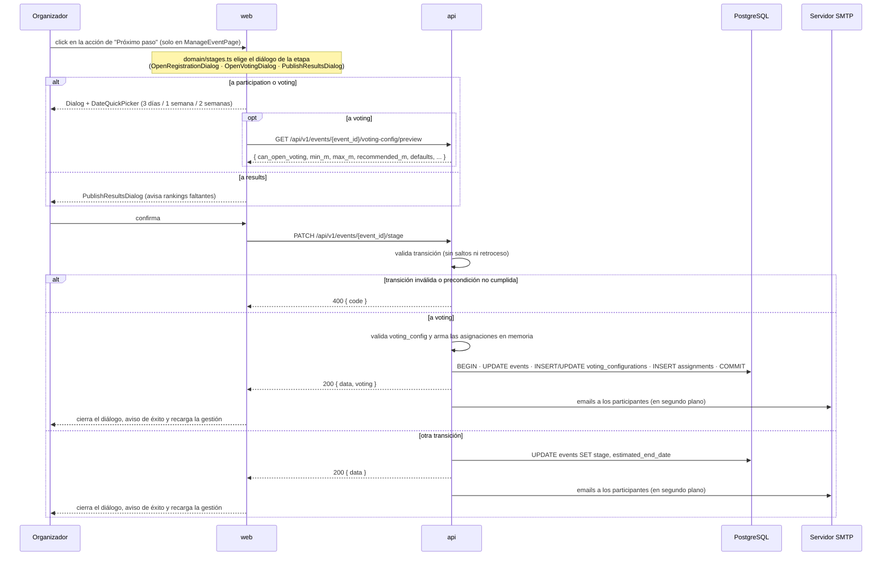

# Avance de etapa del evento

**Tipo:** Evento
**Status:** Active (implementado en el código existente)
**Creado:** 2026-09-18
**Última actualización:** 2026-10-09
**Stories:** S-006, S-009, S-015, S-016 (S-015 y S-016 implementadas)

## Descripción

La transición del evento por sus cuatro etapas: `creation → participation → voting → results`.
Es la acción de control del organizador y el disparador de las notificaciones por email.

**Sin retroceso ni saltos.** Cada avance es irreversible desde la interfaz.

La inconsistencia D-05 (la misma acción validada distinto según la pantalla) quedó **resuelta en
S-016**: solo `ManageEventPage` avanza etapas y las reglas del cliente viven en un único lugar
(`web/src/domain/stages.ts` + `web/src/domain/manage.ts`). Ver Paso 1.

## Servicios Involucrados

| Servicio | Rol | Tipo de Participación |
|----------|-----|-----------------------|
| `web` | Presenta el diálogo de avance de cada etapa (solo en la gestión) y valida fechas y precondiciones | Iniciador |
| `api` | Valida la transición, actualiza la etapa, dispara los emails | Procesador |
| PostgreSQL | Persiste `events.stage` y los deadlines estimados | Almacenamiento |
| SMTP | Entrega la notificación a los participantes | Notificador |

## Pasos del Flujo


```mermaid
sequenceDiagram
    participant O as Organizador
    participant WEB as web
    participant API as api
    participant DB as PostgreSQL
    participant SMTP as Servidor SMTP

    O->>WEB: click en la acción de "Próximo paso" (solo en ManageEventPage)
    Note over WEB: domain/stages.ts elige el diálogo de la etapa<br/>(OpenRegistrationDialog · OpenVotingDialog · PublishResultsDialog)

    alt a participation o voting
        WEB-->>O: Dialog + DateQuickPicker (3 días / 1 semana / 2 semanas)
        opt a voting
            WEB->>API: GET /api/v1/events/{event_id}/voting-config/preview
            API-->>WEB: { can_open_voting, min_m, max_m, recommended_m, defaults, ... }
        end
    else a results
        WEB-->>O: PublishResultsDialog (avisa rankings faltantes)
    end
    O->>WEB: confirma
    WEB->>API: PATCH /api/v1/events/{event_id}/stage
    API->>API: valida transición (sin saltos ni retroceso)
    alt transición inválida o precondición no cumplida
        API-->>WEB: 400 { code }
    else a voting
        API->>API: valida voting_config y arma las asignaciones en memoria
        API->>DB: BEGIN · UPDATE events · INSERT/UPDATE voting_configurations · INSERT assignments · COMMIT
        API-->>WEB: 200 { data, voting }
        API->>SMTP: emails a los participantes (en segundo plano)
        WEB-->>O: cierra el diálogo, aviso de éxito y recarga la gestión
    else otra transición
        API->>DB: UPDATE events SET stage, estimated_end_date
        API-->>WEB: 200 { data }
        API->>SMTP: emails a los participantes (en segundo plano)
        WEB-->>O: cierra el diálogo, aviso de éxito y recarga la gestión
    end
```

---

### Paso 1: Elegir la transición y validar en el cliente

**Origen:** `web` · **Destino:** `web` · **Tipo:** Interno

**D-05 resuelta en S-016.** Solo `ManageEventPage` avanza etapas (`EventDetailPage` dejó de hacerlo
en S-015) y las reglas del cliente viven en un único módulo de dominio: `web/src/domain/stages.ts`
(`getNextStage`, `transitionDialog`, `MIN_PROPOSALS_TO_VOTE = 3`) más `web/src/domain/manage.ts`
(`pendingFiles`, `votingProgress`). Se borraron `validateStageAdvance`, `StageAdvanceModal` y la regla
"todos votaron".

| Etapa actual | Diálogo | Qué informa la tarjeta "Próximo paso" |
|---|---|---|
| `creation` | `OpenRegistrationDialog` | Checklist del evento (datos, cupo, fecha) |
| `participation` | `OpenVotingDialog` | Consecuencia: menos de 3 propuestas, o inscriptos sin propuesta (`pendingFiles`) |
| `voting` | `PublishResultsDialog` | Consecuencia: rankings faltantes (`votingProgress`) |

El botón del próximo paso queda deshabilitado con el evento pausado o mientras falle/cargue un bloque
de datos de la gestión. Las reglas de negocio de la transición (≥ 3 participantes con propuesta,
configuración válida) las decide el backend; el cliente las anticipa con la vista previa (Paso 2).

**Cerrar la votación con evaluaciones pendientes está permitido y es explícito.**
`PublishResultsDialog` muestra cuántos rankings faltan y pide confirmar ("publicar igual"). Quien no
completó recibe `Q_i = 0` y **su propia propuesta baja `n` posiciones**.

**Ref:** `web/src/domain/stages.ts`; `web/src/domain/manage.ts`;
`web/src/pages/manage-event/ManageEventPage.tsx`

---

### Paso 2: Confirmar la etapa destino y el deadline

**Origen:** `web` (diálogo) · **Destino:** `web` · **Tipo:** Interno

Los diálogos usan `Dialog` + `DateQuickPicker` con atajos **3 días / 1 semana / 2 semanas** sobre hoy
(valor inicial: hoy + 7). La fecha se valida en el cliente con `validateNewDeadline` (debe ser
posterior a hoy) y se muestra como fin del día con fecha larga.

- **`OpenRegistrationDialog`** (`creation → participation`): solo la fecha.
- **`OpenVotingDialog`** (`participation → voting`): fecha + configuración de la votación. Pide
  `GET /api/v1/events/{event_id}/voting-config/preview`, precarga `m` con `recommended_m` y los
  defaults, y no permite confirmar si `can_open_voting` es `false`. Ajustes avanzados con
  `NumberStepper`. Ver
  [configuración y generación de asignaciones](configuracion-y-generacion-de-asignaciones.md).
- **`PublishResultsDialog`** (`voting → results`): sin fecha; avisa los rankings faltantes y pide
  confirmación explícita. En la etapa `results`, la gestión muestra `EventResults`, que recalcula con
  `POST /api/v1/events/{event_id}/distributed-results/recalculate` si todavía no hay resultados.

---

### Paso 3: Avanzar la etapa

**Origen:** `web` · **Destino:** `api` · **Tipo:** REST

- **Método:** PATCH
- **Endpoint:** `/api/v1/events/{event_id}/stage`
- **Auth:** JWT Bearer — **solo el autor del evento o un admin**
- **Body:**
  ```json
  {
    "stage":              "enum — req: creation | participation | voting | results",
    "estimated_end_date": "string (date, YYYY-MM-DD) — obligatoria si stage es participation o voting",
    "voting_config": {
      "attachments_per_evaluator": "integer — req, 1..50",
      "quality_good_threshold":    "number — opt, 0..1, default 0.6",
      "quality_bad_threshold":     "number — opt, 0..1, default 0.3",
      "adjustment_magnitude":      "integer — opt, 1..10, default 3",
      "min_evaluations_per_file":  "integer — opt, 1..20, default min(3, attachments_per_evaluator)"
    }
  }
  ```
  `voting_config` es obligatorio cuando `stage = voting` y se ignora en el resto de las transiciones.
  Desde la web, `OpenVotingDialog` abre la votación con **una sola llamada** a este endpoint con
  `voting_config` (ya no usa `POST /voting-config` ni `POST /generate-assignments`).

**Response (éxito) — 200:** envelope `data` con el evento actualizado, `message`, `code:
STAGE_UPDATED` y `transition: { from, to }`. Cuando `stage = voting` suma
`voting: { configuration, assignments_count, total_attachments }`.

**Validaciones del backend:**
- Transiciones válidas: `creation → participation → voting → results`. **Sin retroceso ni saltos.**
- `estimated_end_date` es **obligatoria** cuando la etapa destino es `participation` o `voting`.
- **Pasar a `voting`** se valida completo antes de escribir, en este orden:
  1. **Al menos 3 participantes con propuesta** → `400 INSUFFICIENT_ATTACHMENTS` con
     `current_count` y `required_minimum: 3`. Ya no se exige un mínimo de inscriptos ni existen
     `INSUFFICIENT_PARTICIPANTS` ni `NO_ATTACHMENTS` en esta transición.
  2. `voting_config` presente → `400 MISSING_VOTING_CONFIG`.
  3. Reglas de la configuración (las mismas que usa la vista previa, ver
     [configuración y generación de asignaciones](configuracion-y-generacion-de-asignaciones.md)):
     `400 INVALID_THRESHOLDS`, `400 M_EXCEEDS_EVALUABLE` o `400 MATH_CONSTRAINT_VIOLATION`, con el
     detalle en `details`. Un cuerpo mal formado o con `attachments_per_evaluator` fuera de 1..50
     responde `400 INVALID_PAYLOAD`.
- **Escritura atómica.** Etapa, configuración y asignaciones se guardan en una única transacción
  (`UPDATE events` → `INSERT voting_configurations` → `INSERT assignments`). Si el evento ya tenía
  una configuración creada con el endpoint deprecado, se reemplaza en la misma transacción. Si algo
  falla, rollback completo, `500 VOTING_SETUP_ERROR` y el evento sigue en `participation`.
- Pasar a `results` calcula y guarda el ranking (`CalculateAndPersistResults`), también cuando
  faltan rankings (el CHECK `valid_participant_counts` se relajó con la migración 023). Si el
  cálculo falla, la etapa cambia igual y el error solo se loguea (ver
  [cálculo y publicación de resultados](calculo-y-publicacion-de-resultados.md)).

**Operación de BD:** `UPDATE` sobre `events` — `stage` y, según la etapa destino,
`participation_estimated_end_date` o `voting_estimated_end_date`. Para `voting`, además
`voting_configurations` y `assignments` dentro de la misma transacción.

**Ref:** `docs/apis/api.yaml` → `/api/v1/events/{event_id}/stage`;
`api/internal/domain/event/events.go:69-92`

---

### Paso 4: Notificación por email

**Origen:** `api` · **Destino:** SMTP · **Tipo:** Interno (asincrónico)

Se disparan **en segundo plano**, sin bloquear la respuesta HTTP: el avance de etapa se confirma
al organizador aunque el envío falle.

**Destinatarios:** los participantes registrados del evento.

**Notificaciones in-app (S-009).** Además del email, y antes de lanzar la goroutine de email, el handler inserta una notificación `stage_changed` por inscripto (el autor queda excluido), con `data` según la etapa destino: `{ stage, deadline }` en `participation` y `voting` (`deadline` = `estimated_end_date`), más `can_vote` y `assigned_count` en `voting` (según la asignación recién creada de cada destinatario), y `result_position` y `result_total` en `results` cuando el destinatario figura en el ranking ajustado. Es best effort: si falla, se registra un `Warn` y la respuesta no cambia. Del mismo modo, `CancelEvent`, `PauseEvent` (solo al pausar) y `UpdateEstimatedEndDate` emiten `event_cancelled`, `event_paused` y `deadline_changed { stage, new_date }`. Ver [notificaciones-in-app](notificaciones-in-app.md).

⚠️ **Sin reintentos ni cola.** Si el envío falla, el email se pierde y nadie se entera — ni el
organizador ni el participante. Es relevante porque el email es el mecanismo por el que un
participante se entera de que se abrió la votación.

**Ref:** `api/internal/email/`

---

## Transiciones y sus Efectos

| Transición | Precondición | Qué habilita |
|---|---|---|
| `creation → participation` | `estimated_end_date` requerida | Registro de participantes y carga de propuestas |
| `participation → voting` | `estimated_end_date` + `voting_config` · **≥ 3 participantes con propuesta** | La votación: configuración y asignaciones ya quedan creadas por la propia transición |
| `voting → results` | Confirmación explícita en `PublishResultsDialog`, aun con rankings faltantes | Panel de resultados |

`creation → participation` además hace visible el evento (hasta ahí, 404 para quien no es el autor — S-008).

## Acciones Independientes de la Etapa

`is_paused` e `is_cancelled` son **independientes de `stage`**: un evento puede pausarse o
cancelarse en cualquier etapa.

| Acción | Endpoint | Efecto |
|---|---|---|
| Pausar / reanudar | `PATCH /api/v1/events/{event_id}/pause` | Con el evento pausado no se puede registrar ni subir propuestas |
| Cancelar | `PATCH /api/v1/events/{event_id}/cancel` | Dispara email de cancelación |
| Posponer deadline | `PATCH /api/v1/events/{event_id}/estimated-end-date` | **Solo posponer, no adelantar** — regla del backend, validada también en el cliente con `validatePostpone` desde `EditDeadlineDialog` (D-06 resuelta en S-016) |

> Pausar abre un `Dialog variant="alert"` de confirmación; reanudar llama directo a `PATCH /pause`.
> `EditDeadlineDialog` usa `DateQuickPicker` con atajos sobre el cierre actual.

## Manejo de Errores

| Paso | Condición | Respuesta | Qué ve el organizador |
|---|---|---|---|
| 2 | Fecha no posterior a hoy | — | Error de validación en el diálogo; no se llama a la API |
| 2 | Menos de 3 propuestas (`can_open_voting = false`) | — | `OpenVotingDialog` lo explica y no permite confirmar |
| 3 | Salto de etapa o retroceso | 400 | Mensaje traducido en el diálogo |
| 3 | Falta `estimated_end_date` | 400 | Idem |
| 3 | Menos de 3 participantes con propuesta al pasar a `voting` | 400 | `INSUFFICIENT_ATTACHMENTS` con `current_count` y `required_minimum: 3` |
| 3 | Falta `voting_config` al pasar a `voting` | 400 | `MISSING_VOTING_CONFIG` |
| 3 | Umbrales inválidos, `m` fuera de rango o cobertura insuficiente | 400 | `INVALID_THRESHOLDS`, `M_EXCEEDS_EVALUABLE` o `MATH_CONSTRAINT_VIOLATION` |
| 3 | Falla la escritura de la apertura | 500 | `VOTING_SETUP_ERROR`; el evento sigue en `participation` |
| 3 | No es el autor del evento | 403 | — |
| 4 | Falla el envío de email | — | ⚠️ **Nada.** Falla en silencio |

Tras cada transición exitosa, `ManageEventPage` cierra el diálogo, muestra un aviso de éxito
(`Callout tone="success"` en una región `role="status"`, 5 s), recarga la gestión y mueve el foco al
título del próximo paso.

## Estado Resultante

- `events.stage` — la nueva etapa.
- Al pasar a `voting`: una fila en `voting_configurations` y una asignación por cada participante con propuesta.
- `events.participation_estimated_end_date` o `voting_estimated_end_date` — el deadline fijado.
- Los participantes reciben (o no, si SMTP falla) el email de cambio de etapa.
- Las acciones habilitadas en la interfaz cambian según la etapa, para todos los roles.
