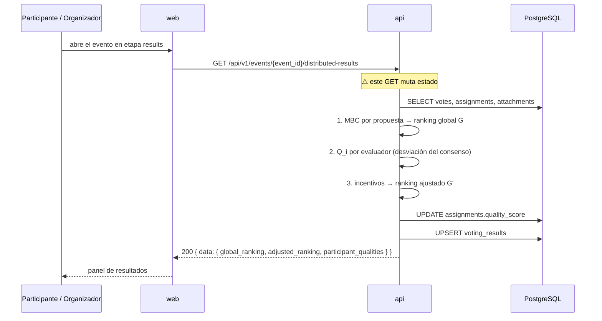

# Cálculo y publicación de resultados

**Tipo:** Feature
**Status:** Active (implementado en el código existente)
**Creado:** 2026-09-18
**Última actualización:** 2026-09-18
**Stories:** — (documentado retroactivamente desde el código)

## Descripción

El cálculo del Modified Borda Count sobre todos los votos del evento, la medición de la calidad de
cada evaluador y la aplicación del sistema de incentivos. Produce los dos rankings: el global `G`
y el ajustado `G'`.

⚠️ **No está definido cuál de los dos es el ranking oficial del producto.** Ver Feature Group 5 y
la pregunta abierta #1 del PRD.

## Servicios Involucrados

| Servicio | Rol | Tipo de Participación |
|----------|-----|-----------------------|
| `web` | Panel de resultados, usado en tres pantallas | Consumidor |
| `api` | Ejecuta el cálculo completo y persiste los resultados | Procesador |
| PostgreSQL | Provee los votos; persiste `voting_results` y `assignments.quality_score` | Almacenamiento |

## Pasos del Flujo



---

### Paso 1: Solicitar los resultados

**Origen:** `web` · **Destino:** `api` · **Tipo:** REST

- **Método:** GET
- **Endpoint:** `/api/v1/events/{event_id}/distributed-results`
- **Auth:** JWT Bearer — cualquier usuario autenticado
- **Query opcional:** `include_metrics=true` agrega `data.configuration`
- **Disponible en:** etapas `voting` y `results`

⚠️ **Este GET no es idempotente: recalcula el MBC en cada llamada y hace upsert en
`voting_results`.** Es el defecto D-11. Consecuencia práctica: abrir la pantalla de resultados
tres veces ejecuta el cálculo completo tres veces y reescribe la fila.

**Ref:** `docs/apis/api.yaml` → `/api/v1/events/{event_id}/distributed-results`

---

### Paso 2: Cálculo del Modified Borda Count (interno)

**Origen:** `api` · **Destino:** `api` · **Tipo:** Interno

Para cada propuesta `f_j`:

```
MBC(f_j) = (1 / (m(m−1))) · Σ (m − R_i(f_j))
```

donde `R_i(f_j)` es la posición que el evaluador `i` le asignó (**1 = mejor**). La normalización
por `m(m−1)` deja el resultado en `[0,1]`.

El orden resultante es el **ranking global `G`**. Los empates se rompen **por cantidad de votos** y,
si persisten, **por UUID** — para que el orden sea determinístico y dos cálculos den lo mismo.

**Operación de BD:** `SELECT` sobre `votes` (todos los del evento), `assignments` y `attachments`.

**Ref:** `api/internal/domain/vote/voting_service.go:140-222`

---

### Paso 3: Cálculo de la calidad de cada evaluador (interno)

**Origen:** `api` · **Destino:** `api` · **Tipo:** Interno

```
Q_i = 1 − (2 / (m(m−1))) · Σ |R_i(f_j) − RelativeRank_G(f_j, A(p_i))|
```

Mide cuánto se aparta el ranking del evaluador `i` del ranking global **restringido al subconjunto
que le tocó evaluar** (`A(p_i)`). Un evaluador que coincide con el consenso tiene `Q_i` cercano a
1. El resultado se recorta a `[0,1]`.

**Regla explícita:** quien **no completó su asignación recibe `Q_i = 0`**
(`voting_service.go:278-281`).

**Operación de BD:** `UPDATE` sobre `assignments.quality_score` (decimal(5,4), CHECK en `[0,1]`).

**Ref:** `api/internal/domain/vote/voting_service.go:calculateParticipantQualities`

---

### Paso 4: Aplicación del sistema de incentivos (interno)

**Origen:** `api` · **Destino:** `api` · **Tipo:** Interno

El ranking global `G` se ajusta a `G'`:

| Condición | Efecto sobre **la propuesta propia del evaluador** |
|---|---|
| `Q_i ≥ quality_good_threshold` (default 0.6) | **Sube `n` posiciones** |
| `Q_i ≤ quality_bad_threshold` (default 0.3) | **Baja `n` posiciones** |

donde `n` = `adjustment_magnitude` (default 3).

**Este es el mecanismo que hace que convenga evaluar en serio**: evaluar bien mejora la posición
de la propuesta propia.

**Ref:** `api/internal/domain/vote/voting_service.go:applyIncentiveSystem`

---

### Paso 5: Persistir y devolver

**Origen:** `api` · **Destino:** PostgreSQL + `web` · **Tipo:** Interno + REST

**Operación de BD:** **UPSERT** sobre `voting_results` (`event_id` es UNIQUE: una fila por evento).

| Columna | Contenido |
|---|---|
| `global_ranking` | jsonb — array de `AttachmentResult` ordenado por MBC (el ranking `G`) |
| `participant_qualities` | jsonb — `{uuid_participante: Q_i}` |
| `adjusted_ranking` | jsonb — array tras aplicar los incentivos (el ranking `G'`) |
| `total_participants` | integer, CHECK > 0 |
| `total_votes` | integer, CHECK ≥ `total_participants` |
| `attachments_per_evaluator` | El `m` usado en el cálculo |

**Forma de cada elemento de los rankings:**
```json
{
  "attachment_id":    "uuid",
  "filename":         "string",
  "participant_id":   "uuid",
  "participant_name": "string",
  "mbc_score":        "number",
  "global_rank":      "integer",
  "adjusted_rank":    "integer",
  "vote_count":       "integer",
  "average_rank":     "number"
}
```

**Response (éxito) — 200:** envelope `data` con `global_ranking`, `adjusted_ranking` y
`participant_qualities`.

⚠️ **Columnas huérfanas:** `voting_results` tiene además `statistical_metrics`, `algorithm_used`,
`quality_adjustments_applied`, `overall_quality_score`, `good_evaluator_count`,
`bad_evaluator_count` y `consensus_strength`, que **el dominio no escribe**. El CHECK
`valid_evaluator_counts` referencia dos de ellas, que quedan en 0 y hacen que el CHECK pase
trivialmente.

**Ref:** `docs/db-schemas/telescopio_db.md` → `voting_results`

---

## Manejo de Errores

| Paso | Condición | Respuesta | Qué ve el usuario |
|---|---|---|---|
| 1 | Etapa distinta de `voting` o `results` | 400 | La UI no muestra el panel |
| 1 | Sin configuración de votación | 400 | — |
| 2 | Sin votos registrados | 400/500 | `total_votes` violaría el CHECK ≥ `total_participants` |
| 5 | Violación de CHECK | **500** | ⚠️ Error genérico de Postgres |

## Estado Resultante

- `voting_results` — una fila con ambos rankings y las calidades.
- `assignments.quality_score` — el `Q_i` de cada evaluador.
- El panel de resultados muestra el ranking en las tres pantallas que lo usan.

## Decisión Pendiente

⚠️ **El sistema calcula y persiste `G` y `G'`, y no declara cuál es el oficial.** La interfaz
muestra ambos (`global_rank` y `adjusted_rank` en cada fila) sin indicar cuál manda.

Si el oficial es `G`, los pasos 3 y 4 de este flujo **no tienen ningún efecto sobre el resultado**:
se calculan y se persisten para nada. Ver Feature Group 5.
