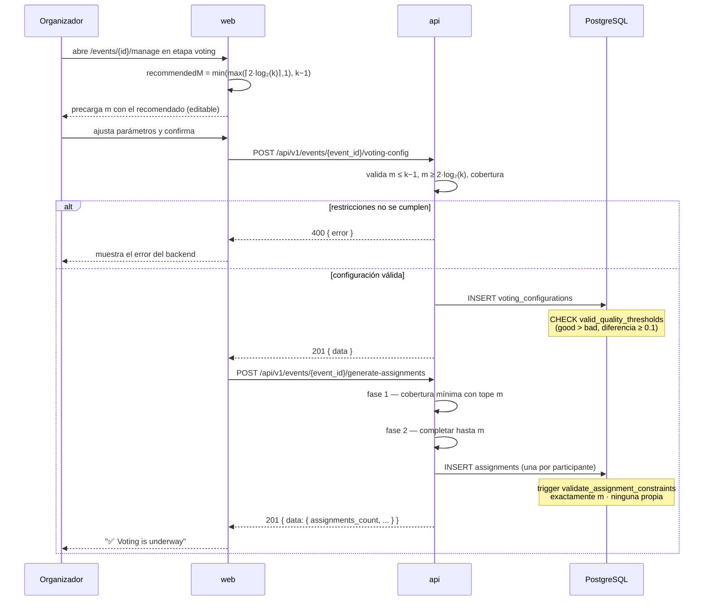

# Configuración de la votación y generación de asignaciones

**Tipo:** Feature
**Status:** Active (implementado en el código existente)
**Creado:** 2026-09-18
**Última actualización:** 2026-09-18
**Stories:** — (documentado retroactivamente desde el código)

## Descripción

El momento en que el organizador define los parámetros matemáticos del evento y el sistema
reparte las propuestas entre los evaluadores. **Es el paso más delicado del producto**: una vez
generadas las asignaciones, el conjunto de quién evalúa qué queda fijo, y las restricciones del
modelo no admiten corrección posterior.

Ocurre durante la etapa `voting`, después de que el organizador la abrió.

## Servicios Involucrados

| Servicio | Rol | Tipo de Participación |
|----------|-----|-----------------------|
| `web` | Calcula y sugiere `m`, presenta el panel de configuración | Iniciador |
| `api` | Valida las restricciones matemáticas y ejecuta el algoritmo de asignación | Procesador |
| PostgreSQL | Persiste la configuración y las asignaciones; **valida las invariantes vía triggers** | Almacenamiento + Validador |

## Pasos del Flujo



---

### Paso 1: Cálculo del `m` recomendado (cliente)

**Origen:** `web` · **Destino:** `web` · **Tipo:** Interno

```
recommendedM = min( max( ⌈2 · log₂(max(k, 2))⌉, 1 ), k − 1 )
```

donde `k` = total de propuestas del evento. Se usa como **valor inicial editable** del campo, y se
muestra al organizador como `Recommended: {n} (max: {m})`.

⚠️ **Esta fórmula está implementada dos veces**: acá en TypeScript para sugerir, y en Go para
validar y rechazar (`voting_service.go:48-68`). Si divergen, el organizador ve un recomendado que
el backend rechaza. Ver D-09 en `docs/prd/requirements.md`.

**Ref:** `web/src/components/voting-configuration-panel/VotingConfigurationPanel.tsx:25-31`

---

### Paso 2: Guardar la configuración de votación

**Origen:** `web` · **Destino:** `api` · **Tipo:** REST

- **Método:** POST
- **Endpoint:** `/api/v1/events/{event_id}/voting-config`
- **Auth:** JWT Bearer — solo el autor del evento, un organizador o un admin
- **Body:**
  ```json
  {
    "attachments_per_evaluator": "integer — req, min 1, max 50. El parámetro m",
    "quality_good_threshold":    "number — opt, 0..1, default 0.6",
    "quality_bad_threshold":     "number — opt, 0..1, default 0.3",
    "adjustment_magnitude":      "integer — opt, 1..10, default 3. El parámetro n",
    "min_evaluations_per_file":  "integer — opt, default 3"
  }
  ```

**Response (éxito) — 201:** envelope `data` con la configuración persistida.

**Validaciones del backend, antes de escribir:**

| Restricción | Significado |
|---|---|
| `m ≤ k − 1` | Nadie puede evaluar su propia propuesta |
| `m ≥ 2·log₂(k)` | Condición de convergencia del modelo, relajada al 60% del máximo para `k ≤ 10` |
| `n · m ≥ k · min_evaluations_per_file` | Cobertura suficiente: hay capacidad de evaluación para el mínimo pedido |

**Operación de BD:** `INSERT` sobre `voting_configurations` (`event_id` es UNIQUE: **una sola
configuración por evento**).

**CHECK de base:** `valid_quality_thresholds` exige `quality_good_threshold >
quality_bad_threshold` **y** que la diferencia sea ≥ 0.1.

⚠️ **Nota sobre rangos divergentes:** el OpenAPI declara `adjustment_magnitude` entre 1 y 10,
mientras que el CHECK de la base admite 0 a 20. El contrato efectivo es el más restrictivo de los
dos que se aplique primero.

**Ref:** `docs/apis/api.yaml` → `/api/v1/events/{event_id}/voting-config`

---

### Paso 3: Generar las asignaciones

**Origen:** `web` · **Destino:** `api` · **Tipo:** REST

- **Método:** POST
- **Endpoint:** `/api/v1/events/{event_id}/generate-assignments`
- **Auth:** JWT Bearer
- **Body:** ninguno

**Response (éxito) — 201:**
```json
{
  "data": {
    "assignments_count":         "integer",
    "total_participants":        "integer",
    "total_attachments":         "integer",
    "total_evaluations":         "integer",
    "attachments_per_evaluator": "integer"
  },
  "message": "string",
  "code":    "ASSIGNMENTS_GENERATED",
  "config":  { "id": "uuid", "attachments_per_evaluator": "integer", "min_evaluations_per_file": "integer" }
}
```

**El algoritmo, en dos fases** (`voting_service.go:GenerateAssignments`):

1. **Cobertura mínima con tope por participante.** Se recorre buscando que cada propuesta alcance
   `min_evaluations_per_file` evaluaciones. Se lleva un contador `assignmentsPerParticipant` y
   **se saltea a quien ya llegó a `m`**.
2. **Completar hasta `m`.** A cada participante que no llegó a `m` se le asignan propuestas
   restantes, excluyendo siempre la propia.

⚠️ **Consecuencia deliberada (D-10):** una propuesta puede quedar **por debajo de
`min_evaluations_per_file`** si no hay evaluadores elegibles bajo el tope. Es un trade-off:
exceder `m` haría fallar el trigger. **El sistema no avisa cuando esto ocurre.**

**Operación de BD:** `INSERT` sobre `assignments`, una fila por participante, con
`attachment_ids` (uuid[]).

**Triggers que validan cada INSERT** (`validate_assignment_constraints`, BEFORE INSERT/UPDATE):
1. La cantidad de `attachment_ids` debe ser **exactamente** `attachments_per_evaluator`.
2. Todos los attachments deben existir y pertenecer al evento.
3. **Ninguno puede ser del propio participante** — el conflicto de interés, garantizado en base
   además de en Go.

**Ref:** `docs/apis/api.yaml` → `/api/v1/events/{event_id}/generate-assignments`;
`api/internal/storage/migrations/004_constraints_and_triggers.go`

---

## Manejo de Errores

| Paso | Condición | Respuesta | Qué ve el organizador |
|---|---|---|---|
| 2 | `m > k − 1` | 400 | Mensaje del backend, crudo |
| 2 | `m < 2·log₂(k)` | 400 | `recommended minimum attachments per evaluator is {n} for {k} total attachments (max possible: {m})` |
| 2 | Cobertura insuficiente | 400 | Mensaje del backend |
| 2 | `good ≤ bad` o diferencia < 0.1 | 500 (CHECK de base) | ⚠️ Error genérico: el `RAISE`/CHECK de Postgres no tiene la forma de error de la API |
| 2 | Ya existe configuración | 400/409 | El panel no se muestra si `votingConfigured` |
| 3 | Etapa distinta de `voting` | 400 | — |
| 3 | Ya se generaron las asignaciones | 400 | Una sola vez por evento |
| 3 | Violación de trigger | **500 genérico** | ⚠️ `RAISE EXCEPTION` de plpgsql sin contexto de dominio |

## Estado Resultante

- `voting_configurations` — una fila para el evento, con los parámetros definitivos.
- `assignments` — una fila por participante, con exactamente `m` propuestas, ninguna propia,
  `is_completed = false` y `quality_score` NULL.
- Los participantes pueden consultar su asignación y empezar a rankear.

**Este estado es efectivamente irreversible desde la interfaz**: no hay endpoint para regenerar
asignaciones ni para modificar la configuración una vez creada.
