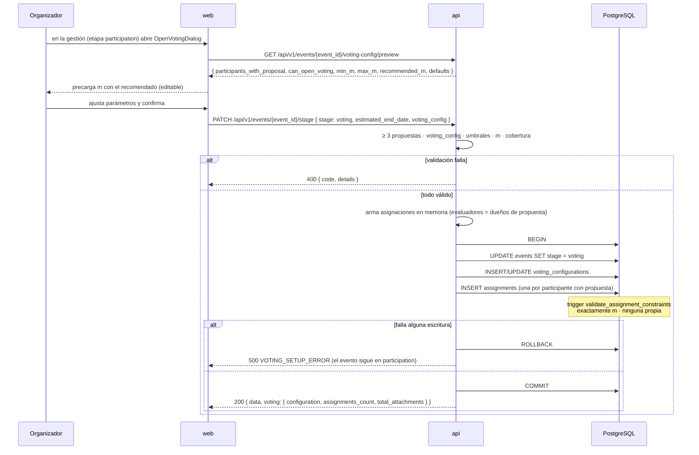

# Configuración de la votación y generación de asignaciones

**Tipo:** Feature
**Status:** Active (implementado en el código existente)
**Creado:** 2026-09-18
**Última actualización:** 2026-10-09
**Stories:** S-006, S-016 (S-016 implementada en `api` y `web`)

## Descripción

El momento en que el organizador define los parámetros matemáticos del evento y el sistema
reparte las propuestas entre los evaluadores. **Es el paso más delicado del producto**: una vez
generadas las asignaciones, el conjunto de quién evalúa qué queda fijo, y las restricciones del
modelo no admiten corrección posterior.

Ocurre **dentro de la propia apertura de la votación**: `PATCH /api/v1/events/{event_id}/stage` con
`stage: "voting"` y `voting_config` avanza la etapa, guarda la configuración y genera las
asignaciones en una única transacción. Solo evalúan (y solo son evaluados) los participantes que
subieron una propuesta. En la `web`, `OpenVotingDialog` (gestión del evento) hace esa única llamada:
ya no usa `POST /voting-config` ni `POST /generate-assignments`.

## Servicios Involucrados

| Servicio | Rol | Tipo de Participación |
|----------|-----|-----------------------|
| `web` | Pide la vista previa, presenta la configuración en `OpenVotingDialog` y, desde la gestión, muestra la configuración aplicada (Paso 4) | Iniciador |
| `api` | Calcula los límites de `m`, valida las restricciones matemáticas, ejecuta el algoritmo de asignación y escribe todo en una transacción | Procesador |
| PostgreSQL | Persiste la configuración y las asignaciones; **valida las invariantes vía triggers** | Almacenamiento + Validador |

## Pasos del Flujo


```mermaid
sequenceDiagram
    participant O as Organizador
    participant WEB as web
    participant API as api
    participant DB as PostgreSQL

    O->>WEB: en la gestión (etapa participation) abre OpenVotingDialog
    WEB->>API: GET /api/v1/events/{event_id}/voting-config/preview
    API-->>WEB: { participants_with_proposal, can_open_voting, min_m, max_m, recommended_m, defaults }
    WEB-->>O: precarga m con el recomendado (editable)

    O->>WEB: ajusta parámetros y confirma
    WEB->>API: PATCH /api/v1/events/{event_id}/stage { stage: voting, estimated_end_date, voting_config }
    API->>API: ≥ 3 propuestas · voting_config · umbrales · m · cobertura
    alt validación falla
        API-->>WEB: 400 { code, details }
    else todo válido
        API->>API: arma asignaciones en memoria (evaluadores = dueños de propuesta)
        API->>DB: BEGIN
        API->>DB: UPDATE events SET stage = voting
        API->>DB: INSERT/UPDATE voting_configurations
        API->>DB: INSERT assignments (una por participante con propuesta)
        Note over DB: trigger validate_assignment_constraints<br/>exactamente m · ninguna propia
        alt falla alguna escritura
            API->>DB: ROLLBACK
            API-->>WEB: 500 VOTING_SETUP_ERROR (el evento sigue en participation)
        else
            API->>DB: COMMIT
            API-->>WEB: 200 { data, voting: { configuration, assignments_count, total_attachments } }
        end
    end
```

---

### Paso 1: Límites y `m` recomendado

**Origen:** `web` · **Destino:** `api` · **Tipo:** REST

- **Método:** GET
- **Endpoint:** `/api/v1/events/{event_id}/voting-config/preview`
- **Auth:** JWT Bearer — solo el autor del evento o un admin

**Response — 200:**
```json
{
  "data": {
    "participants_count":         "integer — inscriptos",
    "participants_with_proposal": "integer — k",
    "can_open_voting":            "boolean — k >= 3",
    "min_m":                      "integer",
    "max_m":                      "integer — max(k − 1, 0)",
    "recommended_m":              "integer",
    "defaults": { "quality_good_threshold": 0.6, "quality_bad_threshold": 0.3, "adjustment_magnitude": 3 }
  }
}
```

Los tres valores salen de una única función, `vote.VotingBounds(k)`, que también usa la
apertura: lo que la vista previa recomienda es lo que la apertura acepta.

```
max_m         = max(k − 1, 0)
recommended_m = min( ⌈2 · log₂(k)⌉, max_m )
min_m         = recommended_m, relajado a ⌈0,6 · max_m⌉ cuando k ≤ 10
```

Para `k < 2` los tres valen 0. El `min_evaluations_per_file` recomendado es `min(3, m)` y lo
recalcula el cliente (`recommendedMinEvaluations`). La respuesta no depende de la etapa del evento.

**Uso en la `web` (D-09 resuelta en S-016).** El front ya no calcula `m`: `OpenVotingDialog` pide
este endpoint al abrirse, precarga `m` con `recommended_m` (editable entre `min_m` y `max_m`) y los
umbrales y el peso del ajuste con `defaults`. Si `can_open_voting` es `false` explica que faltan
propuestas y no permite confirmar. Los "Ajustes avanzados" (evaluaciones mínimas, peso del ajuste,
umbrales) usan `NumberStepper`; los umbrales se validan en el cliente con `validateThresholds`
(mismas reglas que `INVALID_THRESHOLDS`). Se borró `VotingConfigurationPanel` con su fórmula propia.

**Ref:** `docs/apis/api.yaml` → `/api/v1/events/{event_id}/voting-config/preview`;
`api/internal/domain/vote/configuration.go`;
`web/src/components/events/open-voting-dialog/OpenVotingDialog.tsx`; `web/src/domain/voting.ts`

---

### Paso 2: Validar y construir la configuración

**Origen:** `api` · **Destino:** `api` · **Tipo:** Interno (dentro de `PATCH /stage`)

El cuerpo `voting_config` (ver [avance de etapa](avance-de-etapa-del-evento.md), Paso 3) se
completa con los valores por defecto para lo que no se envió (`nil` toma el default; un `0`
explícito se respeta): `quality_good_threshold` 0,6, `quality_bad_threshold` 0,3,
`adjustment_magnitude` 3 y **`min_evaluations_per_file` = `min(3, m)`**.

**Validaciones, en este orden** (`vote.BuildVotingConfiguration`):

| Restricción | Código |
|---|---|
| `good > bad` y diferencia ≥ 0,1, comparado en centésimas (la columna es `decimal(3,2)`) | `400 INVALID_THRESHOLDS` |
| `m ≤ max_m` (= `k − 1`: nadie evalúa su propia propuesta) | `400 M_EXCEEDS_EVALUABLE` |
| `m ≥ min_m` (convergencia del modelo) | `400 MATH_CONSTRAINT_VIOLATION` |
| `k · m ≥ k · min_evaluations_per_file`, es decir `m ≥ min_evaluations_per_file` (cobertura, con `n = k` evaluadores) | `400 MATH_CONSTRAINT_VIOLATION` |

Los umbrales inválidos ya no llegan al CHECK `valid_quality_thresholds` (que antes respondía
500): el CHECK sigue en la base como garantía, pero Go valida antes.

---

### Paso 3: Generar las asignaciones y escribir

**Origen:** `api` · **Destino:** PostgreSQL · **Tipo:** Interno (transacción)

**Evaluadores = participantes con propuesta** (`n = k`): un inscripto sin propuesta no evalúa ni
es evaluado, y no tiene fila en `assignments`.

**El algoritmo, en dos fases** (`voting_service.go:GenerateAssignments`):

1. **Cobertura mínima con tope por participante.** Se recorre buscando que cada propuesta alcance
   `min_evaluations_per_file` evaluaciones. Se lleva un contador `assignmentsPerParticipant` y
   **se saltea a quien ya llegó a `m`**.
2. **Completar hasta `m`.** A cada participante que no llegó a `m` se le asignan propuestas
   restantes, excluyendo siempre la propia.

⚠️ **Consecuencia deliberada (D-10):** una propuesta puede quedar **por debajo de
`min_evaluations_per_file`** si no hay evaluadores elegibles bajo el tope. Es un trade-off:
exceder `m` haría fallar el trigger. **El sistema no avisa cuando esto ocurre.**

**Transacción** (`VotingSetupRepository.OpenVoting`), en este orden:
1. `UPDATE events` — `stage = voting` y `voting_estimated_end_date`.
2. `voting_configurations` — `INSERT`, o `UPDATE` reutilizando el `id` si el evento ya tenía una
   configuración (creada con el endpoint deprecado durante `participation`). `event_id` es UNIQUE:
   una sola configuración por evento.
3. `INSERT` sobre `assignments`, una fila por participante con propuesta, con `attachment_ids`
   (uuid[]). La configuración va antes porque el trigger la lee.

**Triggers que validan cada INSERT** (`validate_assignment_constraints`, BEFORE INSERT/UPDATE):
1. La cantidad de `attachment_ids` debe ser **exactamente** `attachments_per_evaluator`.
2. Todos los attachments deben existir y pertenecer al evento.
3. **Ninguno puede ser del propio participante** — el conflicto de interés, garantizado en base
   además de en Go.

Si cualquier paso falla, rollback completo y `500 VOTING_SETUP_ERROR`.

**Ref:** `docs/apis/api.yaml` → `/api/v1/events/{event_id}/stage`;
`api/internal/storage/postgres/voting_setup_repository.go`;
`api/internal/storage/migrations/004_constraints_and_triggers.go`

---

### Paso 4: Consultar la configuración aplicada desde la gestión

**Origen:** `web` · **Destino:** `api` · **Tipo:** REST

Una vez abierta la votación, la gestión del organizador muestra la "Configuración aplicada" en
las etapas Votación y Resultados leyendo lo que guardó el Paso 3. Es la única fuente en Votación:
`GET /distributed-results?include_metrics=true` solo trae `configuration` cuando el ranking ya
está calculado.

- **Método:** GET
- **Endpoint:** `/api/v1/events/{event_id}/voting-config`
- **Auth:** JWT Bearer — solo el autor del evento o un admin (`RequireEventOwner`, como el preview)

**Response — 200:**
```json
{
  "data": {
    "id":                        "uuid",
    "event_id":                  "uuid",
    "attachments_per_evaluator": "integer — m",
    "quality_good_threshold":    "number",
    "quality_bad_threshold":     "number",
    "adjustment_magnitude":      "integer — n",
    "min_evaluations_per_file":  "integer",
    "created_at":                "date-time"
  }
}
```

No incluye `updated_at`. Es solo lectura: la configuración sigue sin poder modificarse.

| Condición | Respuesta |
|---|---|
| `event_id` no es un UUID | 400 `INVALID_EVENT_ID` |
| Sin token / no es el autor ni admin | 401 / 403 del middleware |
| El evento todavía no abrió la votación | 404 `CONFIG_NOT_FOUND` |
| Falla la lectura de la base | 500 `CONFIG_LOOKUP_ERROR` |

**En la `web`:** `ManageEventPage` lo pide en Votación y Resultados
(`DistributedVotingService.getVotingConfig`). `404 CONFIG_NOT_FOUND` → el bloque no se muestra.
Muestra "recomendados" si los valores coinciden con los defaults y con `min(3, m)`
(`isRecommendedConfig`); si no, "personalizados". Otro error → `Callout` de error con "Reintentar"
solo en ese bloque (no deshabilita acciones).

**Ref:** `docs/apis/api.yaml` → `get /api/v1/events/{event_id}/voting-config`;
`api/internal/handlers/distributed_vote_handler.go` (`GetVotingConfiguration`);
`web/src/pages/manage-event/ManageEventPage.tsx`

---

### Endpoints deprecados

`POST /api/v1/events/{event_id}/voting-config` y `POST /api/v1/events/{event_id}/generate-assignments`
siguen disponibles (`deprecated: true`) para destrabar eventos que ya estaban en `voting` sin
asignaciones. La `web` ya no los usa. Aplican la misma regla que la apertura:

- Evaluadores = participantes con propuesta; mínimo de 3 propuestas
  (`400 INSUFFICIENT_ATTACHMENTS` con `current_count` y `required_minimum: 3`).
- `voting-config` usa `vote.BuildVotingConfiguration` (mismos defaults y códigos de error) y solo
  se acepta en `participation` o `voting`; `409 CONFIG_EXISTS` si ya hay una.
- `generate-assignments` solo en `voting` y una vez por evento (`409 ASSIGNMENTS_EXIST`); en la
  respuesta, `total_participants` es la cantidad de evaluadores (`k`).

---

## Manejo de Errores

| Paso | Condición | Respuesta | Qué ve el organizador |
|---|---|---|---|
| 2 | Menos de 3 participantes con propuesta | 400 `INSUFFICIENT_ATTACHMENTS` | `current_count` y `required_minimum: 3` |
| 2 | Falta `voting_config` | 400 `MISSING_VOTING_CONFIG` | — |
| 2 | `m` fuera de 1..50 u otro campo mal formado | 400 `INVALID_PAYLOAD` | `details` con el detalle del binding |
| 2 | `good ≤ bad` o diferencia < 0,1 | 400 `INVALID_THRESHOLDS` | `details` con los valores recibidos |
| 2 | `m > k − 1` | 400 `M_EXCEEDS_EVALUABLE` | `details` con `m` y el máximo |
| 2 | `m < min_m` o cobertura insuficiente | 400 `MATH_CONSTRAINT_VIOLATION` | `details` con el mínimo o la cobertura |
| 3 | Falla la transacción (incluye una violación de trigger) | 500 `VOTING_SETUP_ERROR` | Mensaje genérico; el error real queda en el log y el evento sigue en `participation` |
| — | `generate-assignments` fuera de `voting` | 400 `INVALID_EVENT_STAGE` | — |
| — | `generate-assignments` ya ejecutado | 409 `ASSIGNMENTS_EXIST` | Una sola vez por evento |

## Estado Resultante

- `events.stage = voting` y `voting_estimated_end_date`.
- `voting_configurations` — una fila para el evento, con los parámetros definitivos.
- `assignments` — una fila por participante **con propuesta**, con exactamente `m` propuestas, ninguna propia,
  `is_completed = false` y `quality_score` NULL.
- Los participantes pueden consultar su asignación y empezar a rankear.
- El organizador puede leer la configuración aplicada (Paso 4), pero no modificarla.

**Este estado es efectivamente irreversible desde la interfaz**: no hay endpoint para regenerar
asignaciones ni para modificar la configuración una vez creada.
