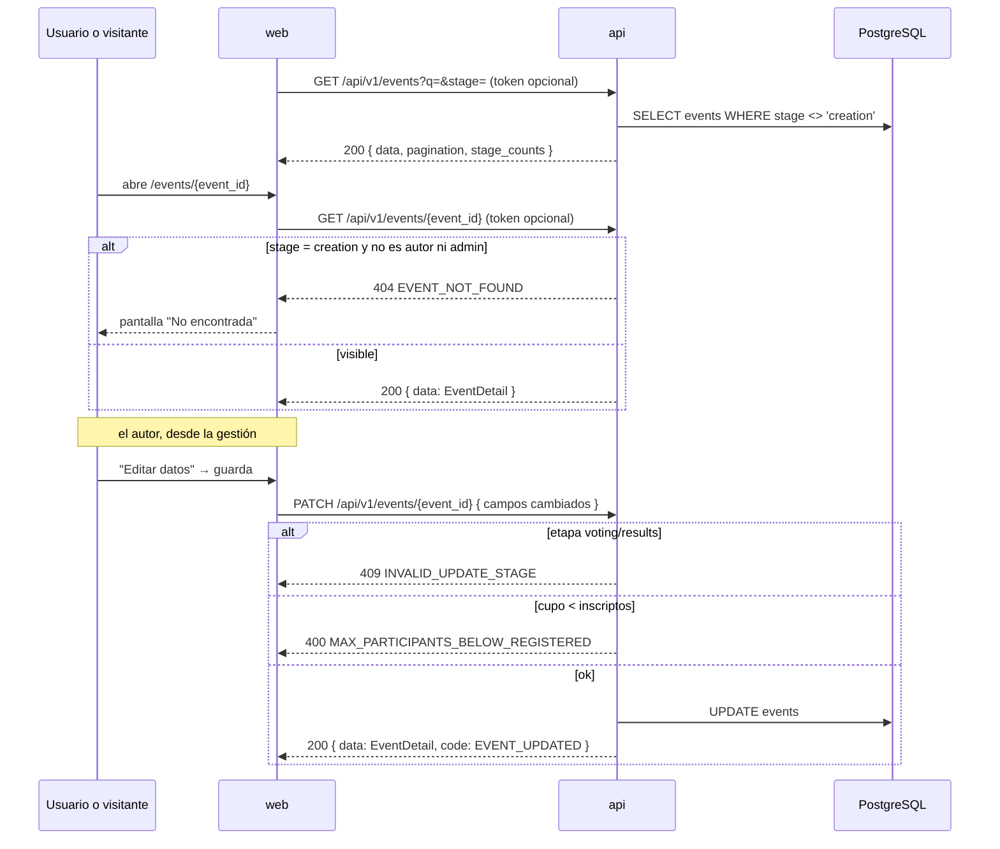

# Edición y visibilidad del evento

**Tipo:** Feature
**Status:** Draft (diseñado en REQ-003, pendiente de implementar)
**Creado:** 2026-10-02
**Última actualización:** 2026-10-02
**Stories:** S-008, S-014

## Descripción

Dos reglas sobre el evento: (1) mientras está en `creation` no es visible ni accesible para
nadie salvo su autor (o un admin); (2) el autor puede editar nombre, descripción, organizador y
cupo en `creation` y `participation`. Se dispara con cualquier lectura pública de eventos y con
"Editar datos" en la gestión.

## Servicios Involucrados

| Servicio | Rol | Tipo de Participación |
|----------|-----|-----------------------|
| `web` | Lista, abre y edita eventos | Iniciador |
| `api` | Identifica al usuario (auth opcional), oculta `creation`, valida y guarda la edición | Procesador |
| PostgreSQL | Persiste `events` | Almacenamiento |

## Pasos del Flujo



---

### Paso 1: Autenticación opcional

**Origen:** `web` · **Destino:** `api` (middleware) · **Tipo:** Interno

`auth.OptionalJWTAuthMiddleware()` en el grupo `eventsPublic`: con `Authorization` válido deja
`user_id` y `user_role` en el contexto; si falta o es inválido sigue como anónimo y **nunca**
responde 401 ni acepta un token inválido como identidad.

---

### Paso 2: Ocultar eventos en `creation`

**Origen:** `api` · **Destino:** PostgreSQL · **Tipo:** Interno

- `GET /api/v1/events` nunca incluye `creation`; `stage=creation` → `data: []`.
- `GET /events/{event_id}`, `/share`, `/participants`, `/attachments`, `/voting-statistics` y
  `POST /register` responden `404 EVENT_NOT_FOUND` si el evento está en `creation` y quien
  consulta no es su autor ni admin.
- El autor ve sus eventos en `creation` con `GET /api/v1/users/{user_id}/events?scope=all`
  (solo el propio usuario).
- Al abrir la inscripción (`creation → participation`) el evento pasa a ser público.

---

### Paso 3: Editar datos

**Origen:** `web` (`EditEventDialog`) · **Destino:** `api` · **Tipo:** REST

- **Método:** PATCH
- **Endpoint:** `/api/v1/events/{event_id}`
- **Auth:** JWT Bearer — solo el autor (`RequireEventOwner`)
- **Body** (al menos uno):
  ```json
  {
    "name": "string — 3..200",
    "description": "string — 10..2000",
    "organizer": "string — 0..200",
    "max_participants": "integer — 1..100, >= inscriptos"
  }
  ```
- **Response 200:** `{ "data": "EventDetail", "message": "string", "code": "EVENT_UPDATED" }`

**Operación de BD:** `UPDATE events` vía `EventRepository.Update`. Las fechas no se editan acá.

---

## Manejo de Errores

| Paso | Condición | Respuesta | Qué ve el usuario |
|---|---|---|---|
| 2 | Evento en `creation` ajeno | `404 EVENT_NOT_FOUND` | Pantalla "No encontrada" |
| 3 | Payload vacío o fuera de rango | `400 INVALID_PAYLOAD` | Motivo junto al campo |
| 3 | Cupo menor a inscriptos | `400 MAX_PARTICIPANTS_BELOW_REGISTERED` (+ `current_count`) | "El cupo no puede ser menor a los inscriptos" |
| 3 | Etapa `voting` o `results` | `409 INVALID_UPDATE_STAGE` (+ `current_stage`) | La acción no se ofrece; si llega, mensaje traducido |
| 3 | Nombre repetido | `409 DUPLICATE_EVENT_NAME` | Mensaje traducido |
| 3 | No es el autor | 403 | — |

## Estado Resultante

- Eventos en `creation` invisibles para todos salvo autor y admin.
- `events.name`, `description`, `organizer`, `max_participants` actualizados; se reflejan en
  detalle, listado y notificaciones (que muestran el nombre vigente).
