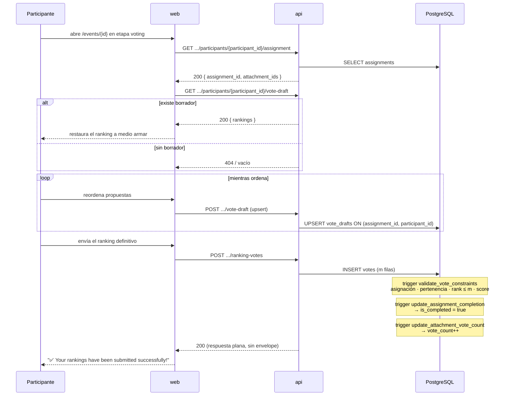

# Evaluación por pares y envío del ranking

**Tipo:** Feature
**Status:** Active (implementado en el código existente)
**Creado:** 2026-09-18
**Última actualización:** 2026-09-18
**Stories:** — (documentado retroactivamente desde el código)

## Descripción

El recorrido del participante como evaluador: consulta las `m` propuestas que le tocaron, las
ordena, guarda borradores mientras trabaja y finalmente envía el ranking definitivo. **El envío
es irreversible**: una vez enviado, la asignación queda completa y no admite reenvío.

Ocurre durante la etapa `voting`, después de que se generaron las asignaciones.

## Servicios Involucrados

| Servicio | Rol | Tipo de Participación |
|----------|-----|-----------------------|
| `web` | Panel de ranking, guardado de borrador, envío | Iniciador |
| `api` | Devuelve la asignación, persiste borradores y votos | Procesador |
| PostgreSQL | Persiste `vote_drafts` y `votes`; **valida y deriva estado vía triggers** | Almacenamiento + Validador |

## Pasos del Flujo



---

### Paso 1: Consultar la asignación propia

**Origen:** `web` · **Destino:** `api` · **Tipo:** REST

- **Método:** GET
- **Endpoint:** `/api/v1/events/{event_id}/participants/{participant_id}/assignment`
- **Auth:** JWT Bearer

**Response (éxito) — 200:** la asignación con `assignment_id` y las `m` propuestas asignadas
(`attachment_ids`, con sus datos para mostrar).

**Operación de BD:** `SELECT` sobre `assignments` filtrando por `event_id` y `participant_id`.

**Garantía del modelo:** las `m` propuestas **nunca incluyen la del propio participante** — el
trigger `validate_assignment_constraints` lo impidió al crearlas.

**Ref:** `docs/apis/api.yaml` → `.../participants/{participant_id}/assignment`

---

### Paso 2: Recuperar el borrador, si existe

**Origen:** `web` · **Destino:** `api` · **Tipo:** REST

- **Método:** GET
- **Endpoint:** `/api/v1/events/{event_id}/participants/{participant_id}/vote-draft`
- **Auth:** JWT Bearer

**Response (éxito) — 200:** `rankings` (jsonb) — array de `{attachment_id, rank}`.

**Operación de BD:** `SELECT` sobre `vote_drafts` por (`assignment_id`, `participant_id`).

**Propósito:** permite abandonar la pantalla a mitad del trabajo sin perder el progreso. Es la
funcionalidad que sostiene el objetivo G-04 (fricción mínima para participar).

**Ref:** `docs/apis/api.yaml` → `.../vote-draft`

---

### Paso 3: Guardar el borrador

**Origen:** `web` · **Destino:** `api` · **Tipo:** REST

- **Método:** POST
- **Endpoint:** `/api/v1/events/{event_id}/participants/{participant_id}/vote-draft`
- **Auth:** JWT Bearer
- **Body:**
  ```json
  {
    "assignment_id": "uuid — req",
    "rankings": [
      { "attachment_id": "uuid", "rank": "integer — 1 = mejor" }
    ]
  }
  ```

**Operación de BD:** **UPSERT** sobre `vote_drafts`, con la clave UNIQUE
(`assignment_id`, `participant_id`) — **un solo borrador por asignación y participante**.

**Diferencia clave con el Paso 5:** el borrador **no valida consecutividad ni completitud**. Puede
guardar un ranking parcial o inconsistente: es un guardado de progreso, no una entrega.

`vote_drafts` es la única tabla con `ON DELETE CASCADE` explícito sobre las tres FK.

**Ref:** `docs/apis/api.yaml` → `.../vote-draft`

---

### Paso 4: Enviar el ranking definitivo

**Origen:** `web` · **Destino:** `api` · **Tipo:** REST

- **Método:** POST
- **Endpoint:** `/api/v1/events/{event_id}/participants/{participant_id}/ranking-votes`
- **Auth:** JWT Bearer
- **Body:**
  ```json
  {
    "assignment_id": "uuid — req",
    "rankings": [
      { "attachment_id": "uuid — req", "rank": "integer — req, min 1. 1 = mejor" }
    ]
  }
  ```

**Validaciones del backend, más estrictas que en el borrador:**
- Los rangos deben ser enteros **consecutivos desde 1**, sin duplicados.
- Cada `attachment_id` debe pertenecer a la asignación del participante.
- **Una vez enviados, la asignación queda completa y no admite reenvío.**

**Response (éxito) — 200:** ⚠️ **respuesta plana, sin envelope `data` ni `code`** — a diferencia
del resto de la API. Es una de las cuatro formas de respuesta que el cliente tiene que normalizar.

**Operación de BD:** `INSERT` sobre `votes` — **`m` filas**, una por propuesta evaluada, con
`event_id`, `assignment_id`, `voter_id`, `attachment_id` y `rank_position`.

**Tres triggers se disparan en cadena:**

| Trigger | Momento | Efecto |
|---|---|---|
| `validate_vote_constraints` | BEFORE INSERT | Verifica que el votante tenga asignación en el evento, que la propuesta esté en su asignación y que `rank_position ≤ m`. **Si `score` viene nulo lo calcula**: `(m − rank_position + 1) × 100 / m` |
| `update_assignment_completion` | AFTER INSERT | Cuenta los votos del participante y, si coinciden con la cantidad asignada, marca `is_completed = true` y setea `completed_at`. **La aplicación no escribe estos campos** |
| `update_attachment_vote_count` | AFTER INSERT | Incrementa `attachments.vote_count` de cada propuesta votada |

**Ref:** `docs/apis/api.yaml` → `.../ranking-votes`;
`api/internal/storage/migrations/004_constraints_and_triggers.go`

---

## Manejo de Errores

| Paso | Condición | Respuesta | Qué ve el participante |
|---|---|---|---|
| 1 | Sin asignación (no participó, o no se generaron) | 404 | La UI no muestra el panel de ranking |
| 3 | Falla el guardado de borrador | 4xx/5xx | Depende del panel; el progreso local se mantiene |
| 4 | Rangos no consecutivos o duplicados | 400 | Mensaje del backend, crudo |
| 4 | Propuesta fuera de la asignación | 400 (o trigger) | Idem |
| 4 | `rank_position > m` | **500** (trigger) | ⚠️ `RAISE EXCEPTION` sin forma de error de la API |
| 4 | Ya votó | 400/409 | No admite reenvío |

## Estado Resultante

- `votes` — `m` filas del participante, con `score` calculado.
- `assignments` — `is_completed = true` y `completed_at` seteados **por trigger**.
- `attachments.vote_count` — incrementado en cada propuesta evaluada.
- `vote_drafts` — el borrador queda (no se borra al enviar).

**Consecuencia para quien no envía:** al calcular los resultados, quien no completó su asignación
recibe `Q_i = 0`, y su propia propuesta **baja `n` posiciones** en el ranking ajustado. No enviar
tiene costo.
