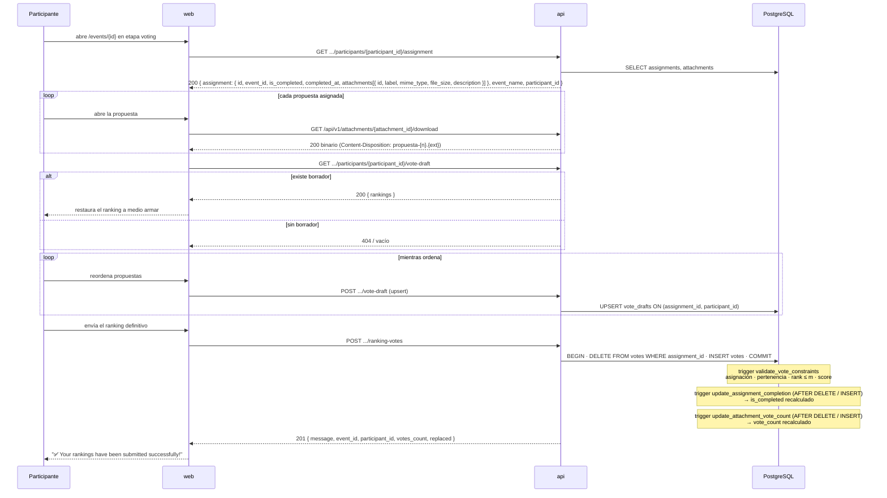

# Evaluación por pares y envío del ranking

**Tipo:** Feature
**Status:** Active (implementado en el código existente)
**Creado:** 2026-09-18
**Última actualización:** 2026-10-04
**Stories:** S-007, S-009, S-017 (S-007 implementada en `api`; el resto, planificado por REQ-003)

## Descripción

El recorrido del participante como evaluador: consulta las `m` propuestas que le tocaron, las
ordena, guarda borradores mientras trabaja y envía el ranking. **El envío es reemplazable
mientras dure `voting`**: un nuevo envío sustituye al anterior de forma transaccional.
**La evaluación es anónima**: el evaluador nunca ve el autor ni el nombre original de una
propuesta.

Ocurre durante la etapa `voting`, después de que se generaron las asignaciones.

## Cambios planificados (REQ-003)

> Diseño aprobado, **pendiente de implementar** (lo de S-007 ya está incorporado en los pasos).
> Al implementar, incorporar al paso correspondiente y quitar de acá.

| Paso | Cambio | Story |
|---|---|---|
| 3 | La web guarda el borrador con debounce desde `SortableRankList` | S-017 |
| 4 | Emite `ranking_submitted` con `{replaced}` | S-009 |
| Web | Lista ordenable ↑↓ (posición siempre única) en lugar de selects; solo lectura en `results`; copy del mecanismo real (la propia propuesta sube o baja) | S-017 |

## Servicios Involucrados

| Servicio | Rol | Tipo de Participación |
|----------|-----|-----------------------|
| `web` | Panel de ranking, guardado de borrador, envío | Iniciador |
| `api` | Devuelve la asignación, persiste borradores y votos | Procesador |
| PostgreSQL | Persiste `vote_drafts` y `votes`; **valida y deriva estado vía triggers** | Almacenamiento + Validador |

## Pasos del Flujo


```mermaid
sequenceDiagram
    participant P as Participante
    participant WEB as web
    participant API as api
    participant DB as PostgreSQL

    P->>WEB: abre /events/{id} en etapa voting
    WEB->>API: GET .../participants/{participant_id}/assignment
    API->>DB: SELECT assignments, attachments
    API-->>WEB: 200 { assignment: { id, event_id, is_completed, completed_at, attachments[{ id, label, mime_type, file_size, description }] }, event_name, participant_id }

    loop cada propuesta asignada
        P->>WEB: abre la propuesta
        WEB->>API: GET /api/v1/attachments/{attachment_id}/download
        API-->>WEB: 200 binario (Content-Disposition: propuesta-{n}.{ext})
    end

    WEB->>API: GET .../participants/{participant_id}/vote-draft
    alt existe borrador
        API-->>WEB: 200 { rankings }
        WEB-->>P: restaura el ranking a medio armar
    else sin borrador
        API-->>WEB: 404 / vacío
    end

    loop mientras ordena
        P->>WEB: reordena propuestas
        WEB->>API: POST .../vote-draft (upsert)
        API->>DB: UPSERT vote_drafts ON (assignment_id, participant_id)
    end

    P->>WEB: envía el ranking definitivo
    WEB->>API: POST .../ranking-votes
    API->>DB: BEGIN · DELETE FROM votes WHERE assignment_id · INSERT votes · COMMIT
    Note over DB: trigger validate_vote_constraints<br/>asignación · pertenencia · rank ≤ m · score
    Note over DB: trigger update_assignment_completion (AFTER DELETE / INSERT)<br/>→ is_completed recalculado
    Note over DB: trigger update_attachment_vote_count (AFTER DELETE / INSERT)<br/>→ vote_count recalculado
    API-->>WEB: 201 { message, event_id, participant_id, votes_count, replaced }
    WEB-->>P: "✅ Your rankings have been submitted successfully!"
```

---

### Paso 1: Consultar la asignación propia

**Origen:** `web` · **Destino:** `api` · **Tipo:** REST

- **Método:** GET
- **Endpoint:** `/api/v1/events/{event_id}/participants/{participant_id}/assignment`
- **Auth:** JWT Bearer
- **Etapas:** `voting` y `results` (otra etapa → 400)

**Response (éxito) — 200:** `AnonymousAssignment`: `assignment { id, event_id, is_completed,
completed_at, attachments[{ id, label: "Propuesta N", mime_type, file_size, description }] }`,
`event_name` y `participant_id`. Sin autoría, sin `original_name`, sin `attachment_ids` ni
campos internos (`quality_score`, etc.). `N` es la posición en `attachment_ids` (1-based).

**Response (sin asignación) — 404:** `{ error, code: "NO_ASSIGNMENT" }`.

**Operación de BD:** `SELECT` sobre `assignments` filtrando por `event_id` y `participant_id`, y
sobre `attachments` del evento para armar los datos de cada propuesta.

**Garantía del modelo:** las `m` propuestas **nunca incluyen la del propio participante** — el
trigger `validate_assignment_constraints` lo impidió al crearlas.

**Ref:** `docs/apis/api.yaml` → `.../participants/{participant_id}/assignment`

---

### Paso 1b: Abrir cada propuesta asignada

**Origen:** `web` · **Destino:** `api` · **Tipo:** REST

- **Método:** GET
- **Endpoint:** `/api/v1/attachments/{attachment_id}/download`
- **Auth:** JWT Bearer

El evaluador puede descargar una propuesta si la tiene en su asignación del mismo evento y el
evento está en `voting` o `results`. El archivo se sirve con un nombre neutro
`propuesta-{n}.{ext}` (`n` = posición en `attachment_ids`; la extensión sale del `mime_type`,
`bin` si no está en el mapa), nunca con `original_name`. El dueño, el autor del evento y un
`admin` reciben `original_name`. Cualquier otro caso → `403 FORBIDDEN`.

`GET /api/v1/events/{event_id}/attachments` devuelve todas las propuestas solo al autor del
evento y a un `admin`; cualquier otro usuario recibe únicamente la propia.

**Ref:** `docs/apis/api.yaml` → `/attachments/{attachment_id}/download`

---

### Paso 2: Recuperar el borrador, si existe

**Origen:** `web` · **Destino:** `api` · **Tipo:** REST

- **Método:** GET
- **Endpoint:** `/api/v1/events/{event_id}/participants/{participant_id}/vote-draft`
- **Auth:** JWT Bearer

**Response (éxito) — 200:** `rankings` (jsonb) — array de `{attachment_id, rank}`.

**Operación de BD:** `SELECT` sobre `vote_drafts` por (`assignment_id`, `participant_id`).

**Propósito:** permite abandonar la pantalla a mitad del trabajo sin perder el progreso. Es la
funcionalidad que sostiene el objetivo G-04 (fricción mínima para participar).

**Ref:** `docs/apis/api.yaml` → `.../vote-draft`

---

### Paso 3: Guardar el borrador

**Origen:** `web` · **Destino:** `api` · **Tipo:** REST

- **Método:** POST
- **Endpoint:** `/api/v1/events/{event_id}/participants/{participant_id}/vote-draft`
- **Auth:** JWT Bearer
- **Body:**
  ```json
  {
    "assignment_id": "uuid — req",
    "rankings": [
      { "attachment_id": "uuid", "rank": "integer — 1 = mejor" }
    ]
  }
  ```

**Operación de BD:** **UPSERT** sobre `vote_drafts`, con la clave UNIQUE
(`assignment_id`, `participant_id`) — **un solo borrador por asignación y participante**.

El borrador se guarda también con la asignación ya completa (no hay `409
ASSIGNMENT_ALREADY_COMPLETED`), para poder editar un ranking enviado.

**Diferencia clave con el Paso 4:** el borrador **no valida consecutividad ni completitud**. Puede
guardar un ranking parcial o inconsistente: es un guardado de progreso, no una entrega.

`vote_drafts` es la única tabla con `ON DELETE CASCADE` explícito sobre las tres FK.

**Ref:** `docs/apis/api.yaml` → `.../vote-draft`

---

### Paso 4: Enviar el ranking definitivo

**Origen:** `web` · **Destino:** `api` · **Tipo:** REST

- **Método:** POST
- **Endpoint:** `/api/v1/events/{event_id}/participants/{participant_id}/ranking-votes`
- **Auth:** JWT Bearer
- **Body:**
  ```json
  {
    "assignment_id": "uuid — req",
    "rankings": [
      { "attachment_id": "uuid — req", "rank": "integer — req, min 1. 1 = mejor" }
    ]
  }
  ```

**Validaciones del backend, más estrictas que en el borrador:**
- Los rangos deben ser enteros **consecutivos desde 1**, sin duplicados.
- Cada `attachment_id` debe pertenecer a la asignación del participante.
- **Reenvío:** mientras el evento esté en `voting`, el ranking nuevo reemplaza al anterior. Fuera
  de `voting` → 400.

**Response (éxito) — 201:** `{ message, event_id, participant_id, votes_count, replaced }`.
`replaced` es `true` si se borraron votos previos. ⚠️ **respuesta plana, sin envelope `data` ni
`code`** — a diferencia del resto de la API. Es una de las cuatro formas de respuesta que el
cliente tiene que normalizar.

**Operación de BD:** en una sola transacción, `DELETE FROM votes WHERE assignment_id = ?` y luego
`INSERT` sobre `votes` — **`m` filas**, una por propuesta evaluada, con `event_id`,
`assignment_id`, `voter_id`, `attachment_id` y `rank_position`. Si un trigger rechaza algún voto,
se hace rollback y se conservan los votos anteriores. La aplicación no escribe `is_completed` ni
`completed_at`.

**Tres triggers se disparan en cadena:**

| Trigger | Momento | Efecto |
|---|---|---|
| `validate_vote_constraints` | BEFORE INSERT | Verifica que el votante tenga asignación en el evento, que la propuesta esté en su asignación y que `rank_position ≤ m`. **Si `score` viene nulo lo calcula**: `(m − rank_position + 1) × 100 / m` |
| `update_assignment_completion` | AFTER INSERT / DELETE | Cuenta los votos del participante: si coinciden con la cantidad asignada marca `is_completed = true` y setea `completed_at`; si quedan menos, lo desmarca. **La aplicación no escribe estos campos** |
| `update_attachment_vote_count` | AFTER INSERT / DELETE | Incrementa o decrementa `attachments.vote_count` de cada propuesta votada |

**Ref:** `docs/apis/api.yaml` → `.../ranking-votes`;
`api/internal/storage/migrations/004_constraints_and_triggers.go`

---

## Manejo de Errores

| Paso | Condición | Respuesta | Qué ve el participante |
|---|---|---|---|
| 1 | Sin asignación (no participó, o no se generaron) | 404 `NO_ASSIGNMENT` | La UI no muestra el panel de ranking |
| 1b | Propuesta que no está en la asignación del evaluador, o evento fuera de `voting`/`results` | 403 `FORBIDDEN` | No puede abrirla |
| 3 | Falla el guardado de borrador | 4xx/5xx | Depende del panel; el progreso local se mantiene |
| 4 | Rangos no consecutivos o duplicados | 400 | Mensaje del backend, crudo |
| 4 | Propuesta fuera de la asignación | 400 (o trigger) | Idem |
| 4 | `rank_position > m` | **500** (trigger) | ⚠️ `RAISE EXCEPTION` sin forma de error de la API |
| 4 | Evento fuera de `voting` | 400 | No se puede enviar ni reemplazar el ranking |
| 4 | Falla al guardar los votos | 500 | Nada cambia: se conservan los votos anteriores |

## Estado Resultante

- `votes` — `m` filas del participante, con `score` calculado (las de un envío anterior se reemplazan).
- `assignments` — `is_completed = true` y `completed_at` seteados **por trigger**.
- `attachments.vote_count` — refleja solo el ranking vigente.
- `vote_drafts` — el borrador queda (no se borra al enviar).

**Consecuencia para quien no envía:** al calcular los resultados, quien no completó su asignación
recibe `Q_i = 0`, y su propia propuesta **baja `n` posiciones** en el ranking ajustado. No enviar
tiene costo.
