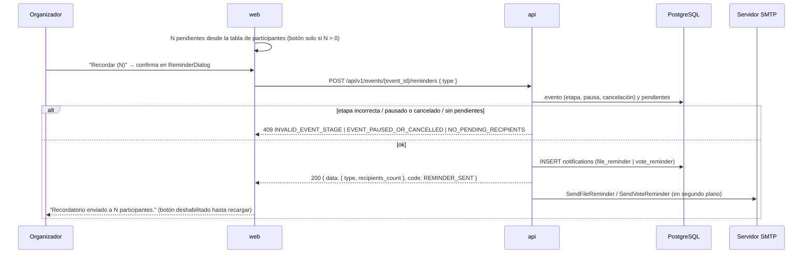

# Recordatorio manual del organizador

**Tipo:** Feature
**Status:** Active en `api` (S-009) y en `web` (S-016)
**Creado:** 2026-10-02
**Última actualización:** 2026-10-09
**Stories:** S-009, S-016 (ambas implementadas)

## Descripción

El organizador recuerda a los pendientes que falta su archivo (en `participation`) o su ranking
(en `voting`). Cada destinatario recibe un email y una notificación in-app. Se dispara desde
"Recordar (N)" / "Enviar recordatorio a N pendientes" en la gestión.

## Servicios Involucrados

| Servicio | Rol | Tipo de Participación |
|----------|-----|-----------------------|
| `web` | Calcula N, confirma con un diálogo y envía el pedido | Iniciador |
| `api` | Valida etapa y pendientes, emite notificaciones y emails | Procesador |
| PostgreSQL | Fuente de pendientes; persiste `notifications` | Almacenamiento |
| SMTP | Entrega los emails | Notificador |

## Pasos del Flujo



---

### Paso 1: Calcular pendientes en la web

**Origen:** `web` · **Destino:** `web` · **Tipo:** Interno

`web/src/domain/manage.ts`: en `participation`, `pendingFiles` (inscriptos sin propuesta); en
`voting`, `pendingVotes` (participantes con `participant_voting_status = false` de
`GET …/voting-statistics`; quien no figura no participa de la votación). `reminderType` elige
`file` o `vote` según la etapa.

El botón no se muestra con N = 0 ni mientras haya un error de carga visible en la gestión, y queda
deshabilitado con el evento pausado.

**Ref:** `web/src/domain/manage.ts`; `web/src/pages/manage-event/ManageEventPage.tsx`

---

### Paso 2: Enviar el recordatorio

**Origen:** `web` · **Destino:** `api` · **Tipo:** REST

`ReminderDialog` lista los destinatarios (los primeros 5 y "y {n} más") y, al confirmar, envía el
pedido. Tras el éxito, la gestión cierra el diálogo, muestra "Recordatorio enviado a {count}
participante(s)." con `recipients_count` de la respuesta y deja el botón deshabilitado con
"Recordatorio enviado" hasta recargar la página (estado local, no se persiste).

- **Método:** POST
- **Endpoint:** `/api/v1/events/{event_id}/reminders`
- **Auth:** JWT Bearer — solo el autor (`RequireEventOwner`)
- **Body:**
  ```json
  { "type": "enum — req: file | vote" }
  ```
- **Response 200:**
  ```json
  {
    "data": { "type": "file | vote", "recipients_count": "integer" },
    "message": "string",
    "code": "REMINDER_SENT"
  }
  ```

**Reglas:**
- `file` solo en `participation` → destinatarios = inscriptos sin propuesta.
- `vote` solo en `voting` → destinatarios = asignaciones con `is_completed = false`.
- Evento pausado o cancelado → `409 EVENT_PAUSED_OR_CANCELLED`.
- Orden de validaciones en la api: `event_id` (`400 INVALID_EVENT_ID`) → body (`400 INVALID_PAYLOAD`) → evento (`404 EVENT_NOT_FOUND`) → pausado o cancelado (`409`) → etapa (`409 INVALID_EVENT_STAGE` con `current_stage`) → pendientes (`409 NO_PENDING_RECIPIENTS`). Pausa y cancelación van antes que la etapa porque bloquean cualquier acción.
- Una falla al leer los pendientes devuelve `500 RETRIEVAL_ERROR` y no se emite nada.
- `recipients_count` es la cantidad de pendientes calculados; no depende de que la inserción de notificaciones funcione.

**Ref:** `web/src/components/events/reminder-dialog/ReminderDialog.tsx`;
`docs/apis/api.yaml` → `/api/v1/events/{event_id}/reminders`

---

### Paso 3: Notificaciones y emails

**Origen:** `api` · **Destino:** PostgreSQL / SMTP · **Tipo:** Interno

- Notificación `file_reminder` / `vote_reminder` con `data: { deadline }` por destinatario (ver
  [notificaciones-in-app](notificaciones-in-app.md)).
- Email `SendFileReminder` / `SendVoteReminder` en `email_service.go`, en segundo plano, mismo
  patrón que `SendStageChangeNotification`.

---

## Manejo de Errores

| Paso | Condición | Respuesta | Qué ve el organizador |
|---|---|---|---|
| 2 | `type` inválido | `400 INVALID_PAYLOAD` | Mensaje traducido en el diálogo |
| 2 | Etapa no corresponde al tipo | `409 INVALID_EVENT_STAGE` | Idem |
| 2 | Sin pendientes | `409 NO_PENDING_RECIPIENTS` | Idem |
| 2 | Pausado o cancelado | `409 EVENT_PAUSED_OR_CANCELLED` | Idem (el botón ya está deshabilitado si está pausado) |
| 2 | No es el autor | 403 | — |
| 3 | Falla email o notificación | — (log) | Nada; el aviso de éxito ya se mostró (best effort) |

## Estado Resultante

- Una notificación por destinatario en `notifications`.
- Emails enviados (o perdidos si SMTP falla, sin reintento).
- Sin registro del último envío: no hay límite de frecuencia más allá del botón deshabilitado en
  la web (fuera de alcance).
