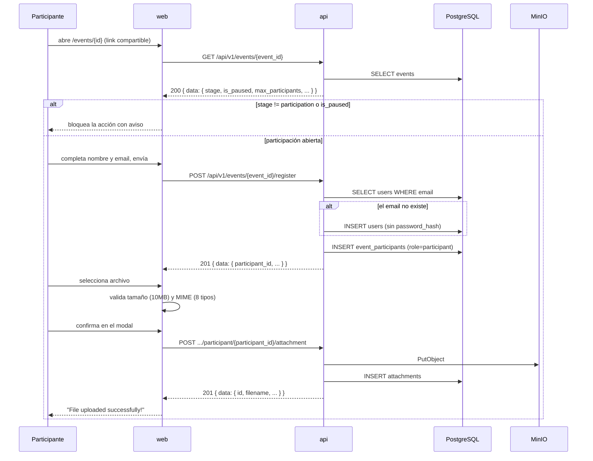

# Registro a un evento y carga de propuesta

**Tipo:** Feature
**Status:** Active (implementado en el código existente)
**Creado:** 2026-09-18
**Última actualización:** 2026-09-18
**Stories:** — (documentado retroactivamente desde el código)

## Descripción

Recorrido completo del participante desde que abre el link compartible de un evento hasta que su
propuesta queda cargada. Es el mecanismo principal de incorporación de participantes: el registro
es **público** y **crea el usuario en el acto** si el email no existe.

Solo ocurre durante la etapa `participation` y con el evento no pausado.

## Servicios Involucrados

| Servicio | Rol | Tipo de Participación |
|----------|-----|-----------------------|
| `web` | Presenta el detalle del evento, el registro y el formulario de carga | Iniciador |
| `api` | Valida etapa, cupo y unicidad; crea usuario y participación; persiste el archivo | Procesador |
| PostgreSQL | Persiste `users`, `event_participants`, `attachments` | Almacenamiento |
| MinIO | Guarda el binario de la propuesta | Almacenamiento |

## Pasos del Flujo



---

### Paso 1: Cargar el detalle del evento

**Origen:** `web` · **Destino:** `api` · **Tipo:** REST

- **Método:** GET
- **Endpoint:** `/api/v1/events/{event_id}`
- **Auth:** pública

**Response (éxito) — 200:** envelope `data` con el evento, incluyendo `stage`, `is_paused`,
`is_cancelled`, `max_participants` y `participant_ids`.

**Operación de BD:** `SELECT` sobre `events`.

**Nota de comportamiento:** si el usuario autenticado es el creador (`creator_id === user.id`),
`EventDetailPageWrapper` redirige a `/events/{id}/manage` y este flujo no continúa: el creador
**no puede registrarse ni subir propuesta** a su propio evento.

**Ref:** `docs/apis/api.yaml` → `/api/v1/events/{event_id}`

---

### Paso 2: Registrarse al evento

**Origen:** `web` · **Destino:** `api` · **Tipo:** REST

- **Método:** POST
- **Endpoint:** `/api/v1/events/{event_id}/register`
- **Auth:** **pública** (`security: []`) — pensado para el link compartible
- **Body:**
  ```json
  {
    "participant_name":  "string — req, minLength 2, maxLength 100",
    "participant_email": "string — req, format email"
  }
  ```

**Response (éxito) — 201:**
```json
{
  "data": {
    "participant_id":    "uuid",
    "participant_name":  "string",
    "participant_email": "string (email)",
    "event_id":          "uuid",
    "event_name":        "string",
    "registered_at":     "date-time"
  },
  "message": "string"
}
```

**Operaciones de BD:**
- `SELECT` sobre `users` por `email`.
- **`INSERT` sobre `users` si el email no existe** — con `password_hash` NULL. El usuario queda
  creado sin poder iniciar sesión hasta que use el flujo de recuperación de contraseña.
- `INSERT` sobre `event_participants` — PK compuesta (`event_id`, `user_id`), `role = 'participant'`.

**Reglas validadas:**
- Solo durante la etapa `participation`.
- El creador del evento no puede registrarse.
- Cupo: se rechaza si se alcanzó `max_participants` (default 20).

**Ref:** `docs/apis/api.yaml` → `/api/v1/events/{event_id}/register`

---

### Paso 3: Validación del archivo en el cliente

**Origen:** `web` · **Destino:** `web` · **Tipo:** Interno

| Regla | Umbral | Mensaje |
|---|---|---|
| Tamaño | `10 * 1024 * 1024` (10 MiB) | `File cannot exceed 10MB` |
| Tipo MIME | Whitelist de 8 tipos | `File type not allowed. Use: JPEG, PNG, GIF, WebP, PDF, TXT, DOC, DOCX` |

Reforzado en el input con `accept=".jpg,.jpeg,.png,.gif,.webp,.pdf,.txt,.doc,.docx"`.

⚠️ **Esta validación es solo del cliente.** El backend no valida tamaño, y la base admite hasta
100 MB (`CHECK file_size BETWEEN 1 AND 104857600`). Una llamada directa a la API saltea el límite.
Ver pregunta abierta #3 en `docs/prd/requirements.md`.

**Ref:** `web/src/pages/event-detail/EventDetailPage.tsx:133-141`

---

### Paso 4: Subir la propuesta

**Origen:** `web` · **Destino:** `api` · **Tipo:** REST

- **Método:** POST
- **Endpoint:** `/api/v1/events/{event_id}/participant/{participant_id}/attachment`
- **Auth:** JWT Bearer — solo el propio participante o el autor del evento
- **Body:** `multipart/form-data` con el campo `file` (binary)

**Response (éxito) — 201:** envelope `data` con `id` (uuid) y `filename`.

**Operaciones:**
- **MinIO:** `PutObject`. La clave resultante se guarda en `attachments.file_path` (**es la clave
  del storage, no una ruta de filesystem**).
- **`INSERT` sobre `attachments`:** `event_id`, `participant_id`, `filename` (generado),
  `original_name` (el que subió el usuario), `file_path`, `file_size`, `mime_type`.

**Reglas validadas:** solo en etapa `participation`; **una sola propuesta por participante por
evento**; el creador no puede subir.

**Ref:** `docs/apis/api.yaml` → `.../participant/{participant_id}/attachment`

---

## Manejo de Errores

| Paso | Condición | Respuesta | Qué ve el usuario |
|---|---|---|---|
| 2 | Etapa distinta de `participation` | 400 | La UI no ofrece el botón de participar |
| 2 | Evento pausado | 400 | `⏸ Registration and file submissions are not available while the event is paused.` |
| 2 | Cupo completo | 400 | Mensaje de error de la API, crudo |
| 2 | Falla de red | — | `Failed to register for the event. Please try again.` |
| 3 | Archivo > 10 MB | — (client-side) | `File cannot exceed 10MB` |
| 3 | Tipo no permitido | — (client-side) | `File type not allowed. Use: ...` |
| 4 | Ya subió una propuesta | 400/409 | La UI ya no ofrece subir: muestra `Submission received` |
| 4 | Falla de subida | 500 | `Upload failed: {msg}` |

## Estado Resultante

- `users` — el usuario existe (creado en este flujo o preexistente).
- `event_participants` — hay una fila (`event_id`, `user_id`) con `role = 'participant'`.
- `attachments` — hay exactamente una propuesta de ese participante en ese evento.
- MinIO — el binario está persistido bajo la clave de `file_path`.

El participante queda listo para recibir su asignación cuando el organizador avance a `voting`.
