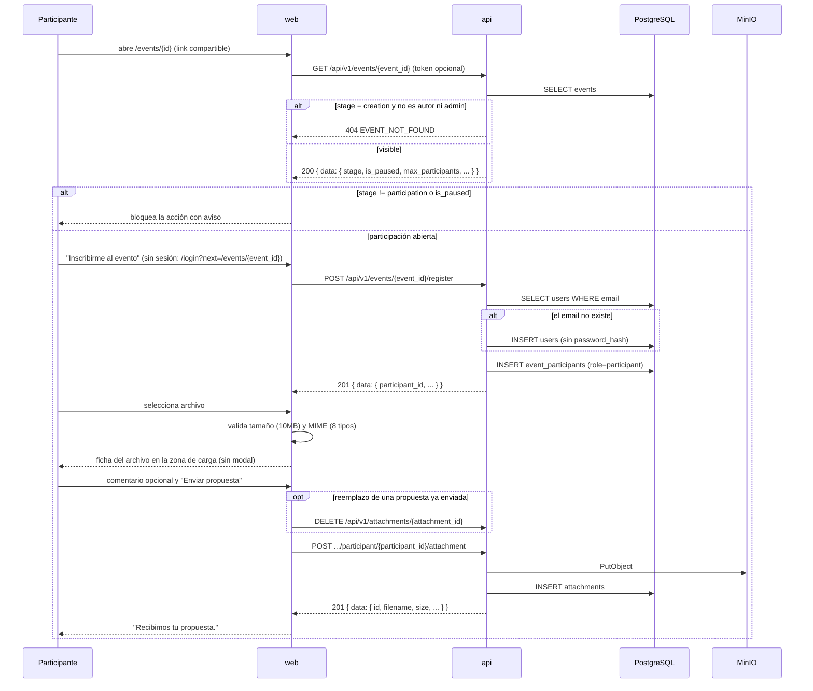

# Registro a un evento y carga de propuesta

**Tipo:** Feature
**Status:** Active (implementado en el código existente)
**Creado:** 2026-09-18
**Última actualización:** 2026-10-05
**Stories:** S-006, S-007, S-008, S-009, S-015 (S-015 implementada; S-008 ya implementado)

## Descripción

Recorrido completo del participante desde que abre el link compartible de un evento hasta que su
propuesta queda cargada. Es el mecanismo principal de incorporación de participantes: el registro
es **público** y **crea el usuario en el acto** si el email no existe.

Solo ocurre durante la etapa `participation` y con el evento no pausado.

## Cambios planificados (REQ-003)

> Diseño aprobado, **pendiente de implementar**. Al implementar, incorporar al paso
> correspondiente y quitar de acá.

| Paso | Cambio | Story |
|---|---|---|
| 3 | La validación del cliente pasa a vivir en `web/src/domain/files.ts` | S-010 |

## Listado de propuestas del evento

`GET /api/v1/events/{event_id}/attachments` (JWT Bearer) devuelve todas las propuestas solo al
autor del evento y a un `admin`; cualquier otro usuario recibe únicamente la propia (anonimato de
la evaluación, S-007). `count` es la cantidad devuelta después de filtrar. Un evento inexistente
responde `200` con `data: []`.

## Servicios Involucrados

| Servicio | Rol | Tipo de Participación |
|----------|-----|-----------------------|
| `web` | Presenta el detalle del evento, el registro y el formulario de carga | Iniciador |
| `api` | Valida etapa, cupo y unicidad; crea usuario y participación; persiste el archivo | Procesador |
| PostgreSQL | Persiste `users`, `event_participants`, `attachments` | Almacenamiento |
| MinIO | Guarda el binario de la propuesta | Almacenamiento |

## Pasos del Flujo


```mermaid
sequenceDiagram
    participant U as Participante
    participant WEB as web
    participant API as api
    participant DB as PostgreSQL
    participant S3 as MinIO

    U->>WEB: abre /events/{id} (link compartible)
    WEB->>API: GET /api/v1/events/{event_id} (token opcional)
    API->>DB: SELECT events
    alt stage = creation y no es autor ni admin
        API-->>WEB: 404 EVENT_NOT_FOUND
    else visible
        API-->>WEB: 200 { data: { stage, is_paused, max_participants, ... } }
    end

    alt stage != participation o is_paused
        WEB-->>U: bloquea la acción con aviso
    else participación abierta
        U->>WEB: "Inscribirme al evento" (sin sesión: /login?next=/events/{event_id})
        WEB->>API: POST /api/v1/events/{event_id}/register
        API->>DB: SELECT users WHERE email
        alt el email no existe
            API->>DB: INSERT users (sin password_hash)
        end
        API->>DB: INSERT event_participants (role=participant)
        API-->>WEB: 201 { data: { participant_id, ... } }

        U->>WEB: selecciona archivo
        WEB->>WEB: valida tamaño (10MB) y MIME (8 tipos)
        WEB-->>U: ficha del archivo en la zona de carga (sin modal)
        U->>WEB: comentario opcional y "Enviar propuesta"
        opt reemplazo de una propuesta ya enviada
            WEB->>API: DELETE /api/v1/attachments/{attachment_id}
        end
        WEB->>API: POST .../participant/{participant_id}/attachment
        API->>S3: PutObject
        API->>DB: INSERT attachments
        API-->>WEB: 201 { data: { id, filename, size, ... } }
        WEB-->>U: "Recibimos tu propuesta."
    end
```

---

### Paso 1: Cargar el detalle del evento

**Origen:** `web` · **Destino:** `api` · **Tipo:** REST

- **Método:** GET
- **Endpoint:** `/api/v1/events/{event_id}`
- **Auth:** pública, con autenticación opcional (`OptionalJWTAuthMiddleware`)

**Response (éxito) — 200:** envelope `data` con el evento, incluyendo `stage`, `is_paused`,
`is_cancelled`, `max_participants`, `participant_ids` y `participants_count`.

**Response — 404 `EVENT_NOT_FOUND`:** también cuando el evento está en `creation` y quien consulta
no es su autor ni `admin` (S-008). El registro (Paso 2) hace el mismo chequeo antes de validar la
etapa, así que un evento oculto nunca responde `INVALID_REGISTRATION_STAGE`.

**Operación de BD:** `SELECT` sobre `events`.

**Nota de comportamiento:** si el usuario autenticado es el creador (`creator_id === user.id`),
`EventDetailPage` lo redirige a `/events/{id}/manage` (con `replace`) y este flujo no continúa: el
creador **no puede registrarse ni subir propuesta** a su propio evento. La página espera a que la
sesión termine de cargar antes de pedir el evento y lo pide una sola vez.

**Ref:** `docs/apis/api.yaml` → `/api/v1/events/{event_id}`

---

### Paso 2: Registrarse al evento

**Origen:** `web` · **Destino:** `api` · **Tipo:** REST

- **Método:** POST
- **Endpoint:** `/api/v1/events/{event_id}/register`
- **Auth:** **pública** (`security: []`) — pensado para el link compartible. La web exige sesión:
  sin sesión, "Inscribirme al evento" lleva a `/login?next=/events/{event_id}` y vuelve al mismo
  evento; con sesión envía `user.name` y `user.email`.
- **Body:**
  ```json
  {
    "participant_name":  "string — req, minLength 2, maxLength 100",
    "participant_email": "string — req, format email"
  }
  ```

**Response (éxito) — 201:**
```json
{
  "data": {
    "participant_id":    "uuid",
    "participant_name":  "string",
    "participant_email": "string (email)",
    "event_id":          "uuid",
    "event_name":        "string",
    "registered_at":     "date-time"
  },
  "message": "string"
}
```

**Operaciones de BD:**
- `SELECT` sobre `users` por `email`.
- **`INSERT` sobre `users` si el email no existe** — con `password_hash` NULL. El usuario queda
  creado sin poder iniciar sesión hasta que use el flujo de recuperación de contraseña.
- `INSERT` sobre `event_participants` — PK compuesta (`event_id`, `user_id`), `role = 'participant'`.

**Reglas validadas:**
- Solo durante la etapa `participation`.
- El creador del evento no puede registrarse.
- Cupo: se rechaza si se alcanzó `max_participants` (default 20).

**Notificaciones in-app (S-009).** Después del `INSERT` en `event_participants`, y sin cambiar la respuesta, el handler emite `registration_confirmed` (`data: {}`) al inscripto y suma una inscripción a la notificación `participant_registered` no leída del autor para ese evento (`data: { count }`, agregada con `INSERT … ON CONFLICT`). Si la inserción falla se registra un `Warn`. Ver [notificaciones-in-app](notificaciones-in-app.md).

**Ref:** `docs/apis/api.yaml` → `/api/v1/events/{event_id}/register`

---

### Paso 3: Validación del archivo en el cliente

**Origen:** `web` · **Destino:** `web` · **Tipo:** Interno

| Regla | Umbral | Mensaje |
|---|---|---|
| Tamaño | `10 * 1024 * 1024` (10 MiB) | `El archivo supera los 10 MB.` |
| Tipo MIME | Whitelist de 8 tipos (sin MIME decide la extensión) | `Ese formato no está permitido. Usa JPG, PNG, GIF, WebP, PDF, TXT, DOC o DOCX.` |

Se evalúa en `web/src/domain/files.ts` (`validateFile`: el tipo antes que el tamaño) desde
`FileDropzone`, y el motivo se muestra dentro de la zona de carga. Reforzado en el input con
`accept=".jpg,.jpeg,.png,.gif,.webp,.pdf,.txt,.doc,.docx"`.

El backend vuelve a validar las dos cosas: el tamaño contra `MAX_FILE_SIZE` (10 MB por defecto,
`FILE_TOO_LARGE`) y el tipo contra su propia lista blanca (`INVALID_FILE_TYPE`), que incluye
`image/webp` y coincide con la del cliente. La base admite
hasta 100 MB (`CHECK file_size BETWEEN 1 AND 104857600`), pero no es el límite efectivo.

**Ref:** `web/src/domain/files.ts`; `web/src/components/ui/file-dropzone/FileDropzone.tsx`

---

### Paso 4: Subir la propuesta

**Origen:** `web` · **Destino:** `api` · **Tipo:** REST

- **Método:** POST
- **Endpoint:** `/api/v1/events/{event_id}/participant/{participant_id}/attachment`
- **Auth:** JWT Bearer — solo el propio participante o el autor del evento
- **Body:** `multipart/form-data` con el campo `file` (binary) y `description` (opcional,
  hasta 1000 caracteres; `DESCRIPTION_TOO_LONG` si se excede)

**Response (éxito) — 201:** envelope `data` con `id` (uuid), `filename`, `size`, `mime_type`,
`description`, `participant` y `uploaded_at`. La web lo mapea a `Attachment` (`original_name` =
`filename`, `file_size` = `size`): el listado trae `original_name` y `file_size`, no estos nombres.

**Confirmación sin modal.** El archivo elegido se muestra en la propia zona de carga (tipo,
nombre, tamaño, "Cambiar") con el campo de comentario (hasta 1000 caracteres) y el botón "Enviar
propuesta"; al terminar, "Recibimos tu propuesta." (5 s) y la ficha pasa a "Enviada el {fecha}".

**Operaciones:**
- **MinIO:** `PutObject`. La clave resultante se guarda en `attachments.file_path` (**es la clave
  del storage, no una ruta de filesystem**).
- **`INSERT` sobre `attachments`:** `event_id`, `participant_id`, `filename` (generado),
  `original_name` (el que subió el usuario), `file_path`, `file_size`, `mime_type` y
  `description`.

**Reglas validadas:** solo en etapa `participation`; **una sola propuesta por participante por
evento**; el creador no puede subir.

**Reemplazo:** durante `participation`, el dueño puede eliminar su propuesta
(`DELETE /api/v1/attachments/{attachment_id}`) y subir otra. Ni el autor del evento ni un
`admin` pueden eliminar la de otro. Como la api rechaza una segunda propuesta
(`409 DUPLICATE_ATTACHMENT`), la web reemplaza con **`DELETE` y después `POST`**, sin modal aparte
("Reemplazar archivo" → zona de carga con el comentario anterior → "Enviar nueva versión"). Si el
`DELETE` funciona y el `POST` falla, el participante queda sin propuesta: la página vuelve a
"Sube tu propuesta" con el archivo y el comentario conservados y reintentar es solo el `POST`.

**Ref:** `docs/apis/api.yaml` → `.../participant/{participant_id}/attachment`

---

## Manejo de Errores

| Paso | Condición | Respuesta | Qué ve el usuario |
|---|---|---|---|
| 1 | Evento inexistente o en `creation` ajeno | 404 `EVENT_NOT_FOUND` | Pantalla "No encontrada" |
| 1 | Falla de red / 5xx | — | "No pudimos cargar el evento." + Reintentar + Ir a Eventos |
| 2 | Sin sesión | — | "Inscribirme al evento" → `/login?next=%2Fevents%2F{id}` |
| 2 | Cupo completo | 400 `MAX_PARTICIPANTS_REACHED` | "El cupo está completo. No quedan lugares en este evento." y se recarga el evento |
| 2 | Pausado | 403 `EVENT_PAUSED` | Mensaje traducido por `code` |
| 2 | Otro / red | — | "No pudimos inscribirte. Intenta de nuevo." / mensaje de red |
| 3 | > 10 MB / tipo no permitido | — (cliente) | En la zona de carga: "El archivo supera los 10 MB." / "Ese formato no está permitido. …" |
| 4 | Falla de subida | 4xx/5xx | Mensaje por `code` o "No pudimos enviar tu propuesta. Intenta de nuevo."; el archivo se conserva |
| 4 | Reemplazo: falla el `DELETE` | 4xx/5xx | "No pudimos reemplazar tu propuesta. Intenta de nuevo."; nada cambió |

## Estado Resultante

- `users` — el usuario existe (creado en este flujo o preexistente).
- `event_participants` — hay una fila (`event_id`, `user_id`) con `role = 'participant'`.
- `attachments` — hay exactamente una propuesta de ese participante en ese evento.
- MinIO — el binario está persistido bajo la clave de `file_path`.

El participante queda listo para recibir su asignación cuando el organizador avance a `voting`.
