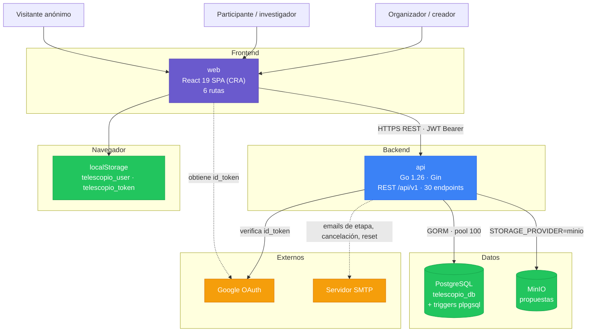

# Arquitectura del Sistema

> **Documento generado por `/product-consolidate-services` a partir del código existente.**
> Describe la arquitectura **implementada y desplegada**, no una propuesta. El diagrama fue
> validado con el responsable del producto el 2026-09-18.
>
> Para el detalle por servicio, ver [`docs/architectures/`](../architectures/). Para el contrato
> de la API, [`docs/apis/api.yaml`](../apis/api.yaml). Para el esquema de
> datos, [`docs/db-schemas/telescopio_db.md`](../db-schemas/telescopio_db.md).

---

## Visión General

Telescopio es un **backend monolítico con una SPA que lo consume**. No es una arquitectura de
microservicios y no conviene describirla como tal: hay exactamente dos servicios desplegables, la
comunicación entre ellos es siempre en el mismo sentido (del frontend al backend, HTTP REST), y
**no existe comunicación backend-a-backend, bus de eventos ni mensajería asincrónica**.

Todo el estado y toda la lógica de negocio viven en `api`. El frontend no tiene lógica
de dominio propia: refleja lo que la API responde. Esa separación es nítida y vale la pena
sostenerla — es lo que permite que el algoritmo de votación, que es el producto, tenga un único
lugar donde vivir y una única suite de tests que lo cubra.

### Por qué esta arquitectura

No hay ADR original ni registro de la decisión, así que esto es lectura del código, no historia
documentada. Lo que el código sugiere:

- **El dominio no lo pedía más complejo.** Un evento con decenas de participantes, un cálculo de
  resultados síncrono y sin integraciones entrantes de terceros no justifica separar servicios.
  Partir esto en microservicios agregaría coordinación distribuida sin resolver ningún problema
  que el producto tenga.
- **El algoritmo tiene que ser una unidad.** El MBC, la calidad del evaluador y los incentivos son
  un solo cálculo que lee toda la tabla de votos del evento. Distribuirlo entre servicios
  introduciría consistencia eventual en el único lugar donde el producto necesita ser exacto.

### La particularidad que hay que conocer antes de tocar nada

**Una porción sustancial de las reglas de negocio no está en Go: está en triggers de PostgreSQL.**
Es la decisión arquitectónica más importante del sistema y la menos visible — quien lea solo el
código Go no ve la mitad de las reglas. Ver [Arquitectura de Datos](#arquitectura-de-datos).

---

## Diagrama de Componentes

Línea sólida = sincrónico. Línea punteada = fuera del camino crítico de la request.

---

## Servicios

| Servicio | Tipo | Responsabilidad | Tech Stack | Estado |
|----------|------|-----------------|------------|--------|
| **api** | Backend (REST) | Único servicio con estado: ciclo de vida de eventos, identidad, propuestas y el algoritmo de votación distribuida | Go 1.26.6 · Gin 1.10.1 · GORM 1.30.2 · PostgreSQL · MinIO · JWT HS256 | Desplegado |
| **web** | Frontend (SPA) | Única interfaz. Recorrido del participante y del organizador. Sin lógica de negocio propia | React 19.1.1 · react-router-dom 7.9.4 · CRA 5.0.1 · TypeScript 4.9.5 · CSS plano | Desplegado |

### api

Organizado por capacidad de dominio en `internal/domain/{módulo}`, con los handlers HTTP
agrupados aparte en `internal/handlers/`.

| Módulo | Responsabilidad |
|---|---|
| `event` | Evento, máquina de estados de etapas, rol dentro del evento |
| `participant` | Usuario, roles, password (bcrypt), token de recuperación |
| `attachment` | Propuesta subida por un participante |
| `vote` | Asignación, voto, borrador, configuración y resultados. **Contiene `VotingService`, el núcleo del producto** |
| `email` | Notificaciones SMTP |

El wiring de dependencias es **manual y explícito** en `cmd/api/main.go`, sin framework de
inyección.

### web

| Módulo | Responsabilidad |
|---|---|
| `auth` | Login, registro, Google OAuth, recuperación de contraseña |
| `events` | Listado, creación y detalle de eventos |
| `event-management` | Pantalla del organizador: etapas, configuración, participantes |
| `voting` | Panel de ranking, borradores, resultados |

**Una URL, dos pantallas según el rol:** `/events/:eventId` hace un fetch del evento al montar y,
si `event.creator_id === user.id`, redirige a `/manage`. La distinción de rol se resuelve en el
cliente después de una llamada a la API — lo que produce un parpadeo de carga antes del contenido.

---

## Patrones de Comunicación

### Frontend ↔ Backend

**HTTP REST sincrónico, JWT Bearer.** Es la única integración de datos del frontend.

- Base URL configurable al arrancar el contenedor (`API_URL`, escrita en `config.js`), o
  `REACT_APP_API_URL` fuera de Docker. Default `http://localhost:8080`. La imagen publicada no
  lleva ninguna URL adentro.
- El JWT se lee de `localStorage` en cada request y viaja en `Authorization: Bearer`.
- **Manejo global de expiración**: ante un `401`, el cliente HTTP limpia la sesión y emite un
  `CustomEvent` `auth:logout` que `AuthContext` escucha para desloguear **sin recargar la
  página**. Es un patrón bien resuelto: el usuario mantiene su contexto de navegación.
- **Los servicios por dominio absorben la inconsistencia de envelopes del backend.**
  `src/services/api.ts` normaliza las cuatro formas de respuesta (`data`, `event`, `user`, payload
  plano) y devuelve tipos limpios. Los componentes no saben de eso.

⚠️ **Deuda conocida:** el cliente normaliza los errores a
`new Error(errorData.error || errorData.message || ...)` y **descarta el `code`**. La UI no puede
distinguir casos por código, solo tiene el texto. Sumado a que el backend tiene **cuatro formatos
de error distintos** (handlers, middlewares, endpoints de votación, health), el manejo de errores
es el punto más débil del contrato entre los dos servicios.

### Backend ↔ Backend

**No existe.** No hay llamadas HTTP entre servicios propios, ni publicación ni consumo de eventos,
ni colas. Cualquier documento o diseño que asuma comunicación asincrónica entre servicios de este
producto está describiendo algo que no está acá.

### Acceso a Datos

Un solo servicio accede a la base: `api`, vía GORM con un pool de hasta 100 conexiones.
No hay acceso directo a la base desde el frontend ni desde ningún otro componente.

**Las entidades de dominio llevan los tags de GORM directamente**: las mismas structs son modelo
de persistencia y contrato JSON de la API (tags `json` y `gorm` en el mismo campo). Eso acopla el
esquema de base con la forma de la respuesta HTTP —cambiar una columna cambia la API— pero
mantiene el código compacto y sin capa de mapeo.

---

## Arquitectura de Datos

### PostgreSQL `telescopio_db`

9 tablas, 3 tipos enumerados, 21 migraciones versionadas en Go con `Up`/`Down`, ejecutadas al
arrancar. Hay un CLI (`cmd/migrate`) con flag `-rollback`.

| Tabla | Contenido |
|---|---|
| `users` | Identidad. `password_hash` nullable (OAuth) |
| `events` | Eventos y su etapa |
| `event_participants` | Relación con rol (`creator` / `participant`) — **el modelo de roles vigente** |
| `attachments` | Las propuestas (conjunto `F` del modelo matemático) |
| `voting_configurations` | Parámetros del algoritmo, uno por evento |
| `assignments` | La función de asignación `A: P → 2^F` |
| `votes` | Los rankings individuales `R_i` |
| `vote_drafts` | Borradores de ranking |
| `voting_results` | `G`, `G'` y las calidades `Q_i` |

### Las reglas de negocio en la base — leer antes de escribir

**Esto es lo más importante de la arquitectura de datos.** Cuatro triggers y un conjunto de CHECK
constraints implementan invariantes que **no están en Go**:

| Regla | Mecanismo |
|---|---|
| La asignación debe tener exactamente `m` attachments | `validate_assignment_constraints` |
| **Nadie puede evaluar su propia propuesta** | `validate_assignment_constraints` |
| Solo se vota lo que fue asignado | `validate_vote_constraints` |
| `rank_position` no puede exceder `m` | `validate_vote_constraints` |
| Cálculo del score Borda si viene nulo | `validate_vote_constraints` |
| Marcado automático de asignación completa | `update_assignment_completion` |
| Mantenimiento de `attachments.vote_count` | `update_attachment_vote_count` |

**Consecuencias prácticas, todas verificadas:**

1. **El conflicto de interés se valida dos veces**, en Go (`hasConflictOfInterest`) y en el
   trigger. Es defensa en profundidad deliberada — pero cambiar una sola deja el sistema
   inconsistente.
2. **Una violación de trigger llega como `RAISE EXCEPTION` de plpgsql**, sin la forma de error de
   la API: se convierte en un 500 genérico que el frontend no puede interpretar.
3. **Los tests de integración y los seeds tienen que construir datos coherentes** con la
   `voting_configuration` del evento, o chocan contra los triggers.
4. **Insertar votos manualmente altera `vote_count` e `is_completed`** sin que la aplicación
   intervenga.

⚠️ **Columnas huérfanas:** `voting_configurations` y `voting_results` tienen columnas creadas por
`migrations/models.go` que las entidades de dominio **no leen ni escriben**
(`use_expertise_matching`, `enable_co_idetection`, `statistical_metrics`, `good_evaluator_count`,
entre otras). El CHECK `valid_evaluator_counts` referencia dos de ellas, que quedan en 0 y hacen
que el CHECK pase trivialmente. Es deuda, no funcionalidad disponible.

### Storage de archivos

Las propuestas se guardan tras la interfaz `FileStorage`, con dos implementaciones elegidas por
`STORAGE_PROVIDER`: **MinIO** (S3-compatible) en despliegue, filesystem local en desarrollo. Los
handlers no saben cuál está activa.

`attachments.file_path` es la **clave en el storage**, no una ruta del filesystem.

⚠️ El default del código Go es `local`: correr la api sin el compose ni el `Makefile` da
filesystem local sin aviso.

### Persistencia en el cliente

`localStorage` guarda `telescopio_user` y `telescopio_token`. Es toda la persistencia del
frontend: **no hay caché de datos de servidor**, ni deduplicación de requests. Cada pantalla pide
sus datos al montar, y navegar y volver reejecuta todo.

---

## Dependencias Externas

| Dependencia | Consumidor | Propósito | Criticidad |
|---|---|---|---|
| **Google OAuth** | `web` + `api` | El front obtiene el `id_token` con `@react-oauth/google`; el back lo verifica contra Google | Media — el login con email/password funciona sin él |
| **SMTP** | `api` | Cambio de etapa, cancelación de evento, reset de contraseña | Media — pero el flujo de recuperación de contraseña depende por completo |
| **MinIO** | `api` | Storage de las propuestas | **Alta** — sin él no hay carga ni descarga |

Google OAuth es el único externo que tocan ambos servicios, pero en roles distintos: el frontend
obtiene el token, el backend lo verifica. No es una dependencia compartida en el sentido de estado
común.

---

## Arquitectura de Seguridad

### Autenticación

**JWT HS256 con vigencia de 24 horas.** El token lleva `user_id`, `email` y `role`. Dos vías de
obtención: email/password (bcrypt DefaultCost, mínimo 8 caracteres) y Google OAuth.

⚠️ **`JWT_SECRET` tiene un default hardcodeado.** Si falta la variable de entorno el servicio
arranca con un secreto conocido y solo emite un warning. Es un defecto crítico (D-12), no un
patrón.

### Autorización

**Composición de middlewares declarados en la ruta**, no un sistema de permisos centralizado:

- `RequireEventOwner` — solo el creador del evento
- `RequireEventOwnerOrOrganizer`
- `RequireParticipantOrOwner`

El modelo de roles vigente es el **por evento** (`event_participants.role`: `creator` /
`participant`). El rol global (`users.role`) es deuda a eliminar: hoy `admin` **saltea todas las
verificaciones sobre cualquier evento** y solo es alcanzable escribiendo en la base.

### Seguridad de la API

- Los endpoints protegidos van dentro del grupo que aplica `JWTAuthMiddleware`.
- La descarga de propuestas (`GET /api/v1/attachments/{id}/download`) está en su propio grupo
  con JWT, y el handler solo la permite al dueño, al autor del evento o a un `admin`. Hasta el
  commit `625b6f4` estaba fuera del grupo y era pública (D-02, resuelto).
- ⚠️ **Los evaluadores no están entre quienes pueden descargar**, así que no pueden abrir las
  propuestas que tienen asignadas (D-15).
- ⚠️ **`GET /api/v1/users/{user_id}` no verifica ownership**: cualquier autenticado lee cualquier
  usuario (D-03).
- **No hay rate limiting** ni protección contra fuerza bruta.
- **No hay cifrado en reposo** de las propuestas: se guardan tal cual en MinIO.

### Defensa en profundidad

El único lugar donde el sistema aplica defensa en profundidad deliberada es el **conflicto de
interés**, validado en Go y en el trigger. Es la invariante que el producto no puede permitirse
violar: si alguien evalúa su propia propuesta, el resultado pierde toda legitimidad.

---

## Requerimientos de Infraestructura

### Despliegue

Imágenes publicadas en Docker Hub (`gravadigital/telescope-api` y `gravadigital/telescope-web`)
por el CI. El compose de servidor vive en el repositorio de deploy; en este repo,
`deploy/docker-compose.yml` es solo el stack local, con `STORAGE_PROVIDER=minio`.

Componentes a desplegar:

| Componente | Notas |
|---|---|
| `api` | Go compilado. Corre migraciones al arrancar |
| `web` | Build estático de CRA, servido como archivos |
| PostgreSQL | Con extensión `uuid-ossp` |
| MinIO | Bucket para las propuestas |
| SMTP | Servidor configurable |

### Escalabilidad

- **El backend es stateless** (la sesión vive en el JWT): admite múltiples instancias detrás de un
  balanceador. **Por diseño, no verificado en despliegue.**
- **El frontend es estático**: escala con un CDN sin ninguna consideración.
- **PostgreSQL es el único cuello de botella real.** Pool de 100 conexiones, sin réplicas de
  lectura, sin caché de aplicación.
- **El cálculo de resultados es síncrono** y se ejecuta bajo demanda sobre todos los votos del
  evento. Con el tope actual de 100 participantes por evento no es un problema; si ese tope
  subiera, es lo primero que habría que mover a background.

### Observabilidad

⚠️ **Prácticamente ausente.** Hay un `GET /health` que verifica conectividad con la base, y nada
más: sin métricas, sin trazas, sin alertas, sin agregación de logs. El frontend además loguea
estado de sesión y un preview del token en cada request, con `console.log` de diagnóstico que
quedaron en producción.

Esto es consistente con que **ninguna de las métricas de éxito del PRD esté instrumentada**: hoy
no hay forma de saber si el producto cumple sus objetivos.

---

## Divergencias con el Catálogo de Convenciones

Ambos servicios divergen del catálogo del workflow, y conviene tenerlo presente al escribir
stories:

| Servicio | Catálogo recomienda | El servicio usa | Convenciones custom |
|---|---|---|---|
| `api` | chi + sqlc/pgx (SQL-first, sin ORM) | Gin + GORM | 9 de 10 |
| `web` | Next.js (única disponible) | CRA + React Router | 9 de 9 |

El catálogo frontend disponible es de Next.js y **no aplica en absoluto** a una SPA de Create
React App: sin SSR, sin file-based routing, sin Server Components. Por eso las nueve convenciones
del frontend son custom.

Esto no es un defecto a corregir — migrar cualquiera de los dos stacks es un proyecto en sí. Es
información para que las stories no asuman patrones del catálogo que acá no existen.
