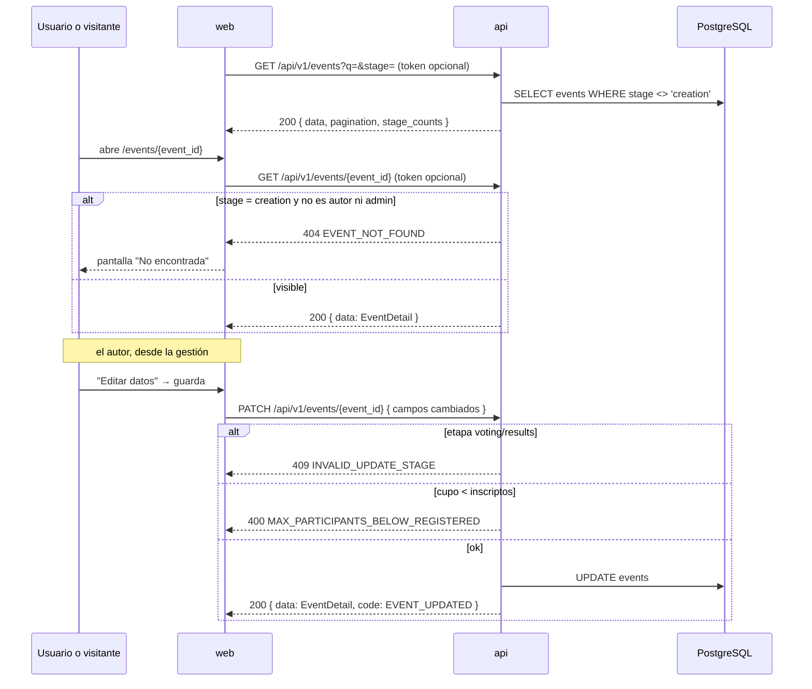

# Story Plan: S-008 (api) - Visibilidad, edición y listados de eventos

## Status

**Status:** Completed

## Story Reference

- **Story:** [S-008](../stories/S-008.visibilidad-edicion-y-listados-de-eventos.md)
- **Service:** api
- **Summary:** Que los eventos en `creation` sean invisibles para todos salvo su autor y un `admin`
  (listado, detalle, share, participantes, propuestas, estadísticas y registro), con autenticación
  opcional en los endpoints públicos; que el autor pueda editar nombre, descripción, organizador y
  cupo en `creation` y `participation` (`PATCH /events/{event_id}`); y que los listados traigan
  búsqueda `q`, `stage_counts`, `participants_count` y, en los eventos del usuario con `scope=all`,
  los eventos organizados con `role` y `my_status`.

> **Story puramente backend** (`affects_ui: false`): no hay contexto UX ni Design System en este
> plan. Habilita S-013 (Inicio, Eventos y Mis eventos) y S-014 (Crear y editar evento) en `web`.

### Decisiones tomadas al planificar (modo automático)

| # | Tema | Decisión |
|---|---|---|
| D1 | Qué cuenta `participants_count` y contra qué se compara el cupo | Los inscriptos **sin el autor**: la misma semántica que `UserRepository.GetEventParticipants` (que excluye `users.id = events.author_id`) y que la regla `MAX_PARTICIPANTS_REACHED` del registro. `current_count` de `MAX_PARTICIPANTS_BELOW_REGISTERED` es ese mismo número |
| D2 | Helper de visibilidad único | Una función `eventVisibleTo(c *gin.Context, evt *event.Event) bool` en `internal/handlers/event_visibility.go`, usada por `EventHandler`, `AttachmentHandler` y `DistributedVoteHandler` (mismo paquete). Un evento fuera de `creation` es siempre visible; en `creation` solo si el rol del contexto es `admin` o el `user_id` del contexto es `AuthorID`. Sin `user_id`/`user_role` en el contexto → no visible |
| D3 | Forma del 404 por ocultamiento | Forma A: `{ "error": "Event not found", "code": "EVENT_NOT_FOUND" }`, idéntica a la que ya devuelven `GetEvent`, `GetShareableEventInfo`, `RegisterParticipant` y `GetEventParticipants` para un id inexistente |
| D4 | `attachments` y `voting-statistics` con evento inexistente | **No cambia**: hoy responden `200` (`data: []` / estadísticas en cero) para un id inexistente y el spec lo documenta. S-008 solo agrega el `404 EVENT_NOT_FOUND` cuando el evento **existe**, está en `creation` y quien consulta no es autor ni admin. Si la búsqueda del evento falla, se sigue como hoy |
| D5 | Orden de chequeos en `POST /register` | El chequeo de visibilidad va inmediatamente después de `GetByID` y **antes** del de etapa: si no, un evento en `creation` respondería `400 INVALID_REGISTRATION_STAGE` y revelaría que existe |
| D6 | Validación del body de `PATCH` | `UpdateEventRequest` con campos **puntero** (`*string`, `*int`) y validación **manual** de rangos (en runas, como el `min`/`max` del binding). No se confía en `binding:"omitempty,min=3"`: con un puntero a `""` o a `0` el validador saltea `min` (trampa documentada en la convención `validation`). Todos `nil` → `400 INVALID_PAYLOAD` |
| D7 | Orden de validaciones en `UpdateEvent` | path param → body (`400 INVALID_PAYLOAD`) → `GetByID` (`404 EVENT_NOT_FOUND`) → etapa (`409 INVALID_UPDATE_STAGE` + `current_stage`) → cupo (`400 MAX_PARTICIPANTS_BELOW_REGISTERED` + `current_count`) → nombre único (`409 DUPLICATE_EVENT_NAME`) → `EventRepository.Update`. Sigue el orden del flujo `edicion-y-visibilidad-del-evento` |
| D8 | Nombre duplicado | Igualdad exacta (case-sensitive) contra `GetAll()`, como `CreateEvent`, **excluyendo el propio evento**: reenviar el mismo nombre no es conflicto |
| D9 | Códigos de error 500 de `PATCH` | Se reutilizan códigos existentes: falla al contar inscriptos → `500 PARTICIPANT_CHECK_ERROR`; falla de `Update` → `500 DB_UPDATE_ERROR`; falla de `GetAll` en el chequeo de duplicado → `500 RETRIEVAL_ERROR`. No se inventan códigos (regla 2 de `error-handling`) |
| D10 | Campos desconocidos en `PATCH` (`start_date`, `end_date`, `stage`…) | Se ignoran: el struct no los declara. Un body con solo campos ignorados equivale a `{}` → `400 INVALID_PAYLOAD` |
| D11 | Respuesta de `PATCH` | `EventDetail` armado por el mismo helper que `GetEvent` (`buildEventDetail`), así detalle y edición devuelven exactamente los mismos campos (incluido `participants_count` y el fallback de `organizer` al nombre del autor si queda vacío) |
| D12 | Búsqueda `q` | `strings.TrimSpace(q)`; vacío → sin filtro. Coincidencia `strings.Contains(strings.ToLower(campo), strings.ToLower(q))` sobre `events.name` **o** `events.organizer` (el valor guardado; no el fallback al nombre del autor). Sin normalización de acentos |
| D13 | `stage_counts` | Siempre presente en la respuesta de `GET /events`, con las tres claves (`participation`, `voting`, `results`) aunque valgan 0. Se calcula sobre los eventos visibles (sin `creation`) filtrados por `q`, antes de filtrar por `stage` y de paginar |
| D14 | `scope` inválido en `GET /users/{user_id}/events` | `400 INVALID_PAYLOAD` con `details: "scope must be one of: participating, all"`. **No está en el spec** (lo agrega la Task 7). `scope=participating` explícito equivale a omitirlo |
| D15 | `scope=all` sobre otro usuario | Forma A `403 { "error": "...", "code": "FORBIDDEN" }`, como documenta el spec. Un `admin` puede pedir `scope=all` de otro usuario. **Sin `scope`** el chequeo de hoy no cambia (`401 UNAUTHORIZED_ACCESS`, sin excepción de admin) por CA-15 |
| D16 | Campos nuevos solo con `scope=all` | Con `scope` omitido o `participating` la respuesta es **byte a byte la de hoy** (mismos eventos, mismos campos, sin consultas por lote nuevas). `role`, `max_participants`, `participants_count`, fechas estimadas, `is_paused`, `is_cancelled` y `my_status` solo con `scope=all` |
| D17 | Armado de `scope=all` | `GetByAuthor(user_id)` → `role: "creator"`, `my_status: null`; `GetUserParticipatingEvents(user_id)` → `role: "participant"`. Unión ordenada por `created_at DESC` (no hay solapamiento: el segundo excluye los eventos del autor). Incluye cancelados y pausados (con sus flags) |
| D18 | Consultas por lote (sin N+1) | Cuatro métodos nuevos, uno por tabla, con `WHERE event_id IN (…)`: `EventRepository.CountParticipantsByEventIDs`, `AttachmentRepository.GetByParticipantAndEventIDs`, `VoteRepository.GetAssignmentsByParticipantAndEventIDs`, `VotingResultsRepository.GetByEventIDs` (este último solo con los ids en `results`). Con lista vacía devuelven vacío sin consultar |
| D19 | `ranking_submitted` y posición | `ranking_submitted = assignment != nil && assignment.IsCompleted` (lo mantiene el trigger `update_assignment_completion`). `result_position` = `adjusted_rank` del elemento de `adjusted_ranking` cuyo `participant_id` es el usuario (tras el ordenamiento, `AdjustedRank == índice + 1`); `result_total = len(adjusted_ranking)`. Ambos `null` si la etapa no es `results`, si no hay fila en `voting_results` o si el usuario no figura en el ranking |
| D20 | Riesgo: CHECK `future_start_date` en `UPDATE` | **NOT DOCUMENTED - needs verification.** El esquema documenta que el CHECK `start_date >= now() - 1 día` es `NOT VALID` y "aplica a filas nuevas **o modificadas**". En PostgreSQL un CHECK se reevalúa en **todo** `UPDATE` de la fila, toque o no `start_date`; y la web genera `start_date = hoy + 1 día`. Si se confirma, editar un evento creado hace más de ~2 días falla con `500` (y ya afecta a `UpdateStage`, `PauseEvent` y `CancelEvent`). La story declara "Cambios de Base de Datos: Ninguno", así que **este plan no agrega migración**: la Task 5 incluye un test de integración que lo verifica, y si se confirma se reporta como hallazgo bloqueante para decidir en producto (ver Task 5) |

## Architectural Context

### Tech Stack

```
go 1.26.6
github.com/gin-gonic/gin v1.10.1        # router + binding (go-playground/validator)
gorm.io/gorm v1.30.2                    # ORM
gorm.io/driver/postgres v1.6.0
github.com/lib/pq v1.10.9               # pq.StringArray para uuid[]
github.com/google/uuid v1.6.0
github.com/golang-jwt/jwt/v5 v5.3.0     # JWT HS256
github.com/charmbracelet/log v0.4.2     # logging clave-valor
github.com/stretchr/testify v1.11.1     # assert / require
```

PostgreSQL con reglas de negocio en triggers (ADR-002). Monolito backend + SPA (ADR-003). Gin y
GORM en lugar del catálogo chi/sqlc (ADR-004).

### Service Architecture

```
api/
├── cmd/api/main.go                       # wiring + registro de TODAS las rutas
├── internal/
│   ├── domain/
│   │   ├── event/events.go               # Event, Stage (StageCreation/Participation/Voting/Result), Validate()
│   │   ├── participant/                  # User, Role (RoleAdmin/RoleOrganizer/RoleParticipant), UserWithEventRole
│   │   ├── attachment/                   # Attachment
│   │   └── vote/vote.go                  # Assignment (IsCompleted), VotingResults (AdjustedRanking), AttachmentResult
│   ├── handlers/
│   │   ├── event_handler.go              # RegisterParticipant (l.777), GetEventParticipants (l.969),
│   │   │                                 # GetAllEvents (l.1046), GetEvent (l.1161), UpdateEvent (l.1264, hoy 501),
│   │   │                                 # GetShareableEventInfo (l.1522), formatDatePtr (l.1758)
│   │   ├── user_handler.go               # GetUserEvents (l.228)
│   │   ├── attachment_handler.go         # GetEventAttachments (l.375)
│   │   ├── distributed_vote_handler.go   # GetVotingStatistics (l.942)
│   │   ├── mocks_repository_test.go      # mocks a mano de todos los repositorios
│   │   └── *_test.go
│   ├── middleware/auth/
│   │   ├── jwt.go                        # ValidateToken, JWTAuthMiddleware, Get*FromContext
│   │   └── permissions.go                # RequireEventOwner, ...
│   └── storage/postgres/
│       ├── repository.go                 # interfaces de todos los repositorios
│       ├── event_repository.go           # GetByAuthor, GetUserParticipatingEvents (l.111), Update (l.305)
│       ├── user_repository.go            # GetEventParticipants (excluye al autor)
│       ├── attachment_repository.go
│       ├── vote_repository.go
│       ├── voting_results_repository.go
│       └── *_integration_test.go         # //go:build integration (migratedTx, seed helpers)
```

**Handlers (convención `http-server`):**

- Un handler es un método sobre un struct que recibe sus dependencias por constructor. Orden
  interno: 1. path params 2. body 3. reglas de negocio 4. respuesta.
- El handler no contiene el algoritmo de negocio: parsea, delega y responde.
- Nunca `panic`. Nunca `uuid.MustParse` sobre entrada del usuario: `uuid.Parse` y `400` si falla.
- **Todas las rutas se registran en `cmd/api/main.go`**, en el grupo que corresponda. Un endpoint
  fuera del grupo con `JWTAuthMiddleware()` queda **público**: verificar el grupo.
- Éxito con envelope `data` en todo endpoint nuevo:
  ```go
  c.JSON(http.StatusOK, gin.H{"data": payload, "message": "Event updated successfully", "code": "EVENT_UPDATED"})
  ```
- **Nunca serializar una entidad de dominio directo**: construir el payload con `gin.H`.
- No agregar logging de entrada/salida de requests (`events.CreateEvent()` ya lo hace).

**Grupos de rutas actuales (`cmd/api/main.go`, l.99-224):**

```go
eventsPublic := api.Group("/events")          // HOY sin middleware
{
    eventsPublic.GET("", eventHandler.GetAllEvents)
    eventsPublic.GET("/:event_id", eventHandler.GetEvent)
    eventsPublic.GET("/:event_id/share", eventHandler.GetShareableEventInfo)
    eventsPublic.POST("/:event_id/register", eventHandler.RegisterParticipant)
    eventsPublic.GET("/:event_id/distributed-results", distributedVoteHandler.GetStoredResults)
    eventsPublic.GET("/:event_id/voting-statistics", distributedVoteHandler.GetVotingStatistics)
}

events := api.Group("/events")
events.Use(auth.JWTAuthMiddleware())
{
    events.PATCH("/:event_id/stage", auth.RequireEventOwner(eventRepo), eventHandler.UpdateEventStage)
    events.GET("/:event_id/participants", eventHandler.GetEventParticipants)   // ya autenticado
    events.GET("/:event_id/attachments", attachmentHandler.GetEventAttachments) // ya autenticado
    // ...
}

usersProtected := api.Group("/users")
usersProtected.Use(auth.JWTAuthMiddleware())
{
    usersProtected.GET("/:user_id/events", userHandler.GetUserEvents)
}
```

`participants` y `attachments` ya están en el grupo con JWT obligatorio: ahí la identidad siempre
existe. El resto de los endpoints de CA-2 está en `eventsPublic`, que recibe
`OptionalJWTAuthMiddleware()`.

**Validación (convención `validation`), siempre en este orden:**

1. Path params — manual:
   ```go
   eventID, err := uuid.Parse(eventIDStr)
   if err != nil {
       c.JSON(http.StatusBadRequest, gin.H{"error": "Invalid event_id format", "code": "INVALID_EVENT_ID"})
       return
   }
   ```
2. Body — binding tags (`c.ShouldBindJSON`), error → `400 { error: "Invalid request payload", code: "INVALID_PAYLOAD", details: err.Error() }`.
3. Reglas de negocio — manual, siempre (etapa, unicidad, límites).

Trampa documentada: **`min`/`max` sin `required` sobre tipos valor no funcionan como se espera**
(un valor cero el validador lo saltea). Para campos opcionales, validar a mano.

**Manejo de errores (convención `error-handling`):**

- Forma A (objetivo), siempre con `code`: `{ "error": "mensaje legible", "code": "SCREAMING_SNAKE", "details": "string opcional" }`.
- Forma B (middlewares): `{ "error": "UNAUTHORIZED"|"FORBIDDEN"|"NOT_FOUND"|"BAD_REQUEST", "message": "..." }` — la emiten `JWTAuthMiddleware` y `RequireEventOwner` antes de entrar al handler.
- Reglas: no inventar `code` si ya existe uno equivalente; `details` es string; status coherente
  (`401` credenciales ausentes/inválidas, `403` sin permiso, `404` inexistente, `409` conflicto de
  estado, `400` entrada inválida); no exponer errores internos crudos.
- Entre capas: `fmt.Errorf("...: %w", err)`; inspección con `errors.Is` / `errors.As`.
- Un trigger o CHECK que falla llega como error crudo de Postgres → `500`. Si un caso es alcanzable
  por el usuario, validarlo en Go antes.

**Logging (convención `logging`):** pares clave-valor (`h.log.Warn("...", "event_id", id)`),
logger por componente obtenido en el constructor (`logger.Handler("event")`,
`logger.Repository("event")`). No loguear tokens JWT ni el header `Authorization`.

**Base (`_base`):** `gofumpt`; sin estado global mutable; constantes `MixedCaps`; errores
centinela `Err...`; comentarios solo para el "por qué"; doc comment en identificadores exportados.

### Relevant ADRs

- **ADR-003: Backend monolítico con SPA, sin microservicios ni bus de eventos**
  - Decision: dos servicios desplegables (`api` con todo el estado, `web` SPA sin lógica de
    negocio); comunicación única `web → api` por HTTP REST con JWT Bearer. No hay comunicación
    backend-a-backend, ni bus, ni colas.
  - Implementation Rules (implicancia registrada en el ADR): *"Cualquier documento o diseño que
    asuma comunicación asincrónica entre servicios de este producto está describiendo algo que no
    existe."*
- **ADR-004: Gin y GORM en el backend, divergiendo del catálogo de convenciones**
  - Decision: Gin 1.10.1 como framework HTTP y GORM 1.30.2 como ORM; wiring manual en
    `cmd/api/main.go`; repositorios en `internal/storage/postgres/`; entidades con tags de GORM.
  - Implementation Rules: escribir handlers sobre `*gin.Context` (no `http.HandlerFunc`) y queries
    con GORM (no sqlc). El SQL queda implícito: revisar a mano que las consultas por lote no
    generen N+1.
- **ADR-005: Las entidades de dominio son a la vez modelo de persistencia y contrato JSON**
  - Decision: las structs de dominio llevan tags de GORM y JSON en el mismo campo; no hay capa de
    DTOs.
  - Implementation Rules: cambiar una columna cambia la respuesta HTTP; lo que no se quiere
    exponer se excluye explícitamente. En handlers nuevos, construir el payload de respuesta aparte
    (`gin.H`) en vez de serializar la entidad.

### API Context

Fuente: `docs/apis/api.yaml` (v1.1.0), que **ya describe S-008**. Prefijo `/api/v1`.

**Autenticación opcional (descripción general del spec):**

> Los endpoints públicos de eventos usan `OptionalJWTAuthMiddleware`: si llega un `Authorization`
> válido identifican al usuario; si falta o es inválido siguen como anónimo (nunca responden 401
> por esto). Un evento en `creation` responde `404 EVENT_NOT_FOUND` a quien no sea su autor ni
> `admin`.

**JWT (convención `auth-jwt`):** HS256, secreto `JWT_SECRET`, vigencia 24 h. Claims `user_id`,
`email`, `role`. `JWTAuthMiddleware` espera `Authorization: Bearer <token>` y deja en el contexto
`user_id` (string), `user_email` (string) y `user_role` (`participant.Role`). Helpers:
`auth.GetUserIDFromContext(c) (uuid.UUID, error)`, `auth.GetUserRoleFromContext(c) (participant.Role, error)`.
`admin` saltea todas las verificaciones. Regla 3: la verificación de permisos va en el middleware,
salvo que dependa del estado del recurso (acá depende de la etapa del evento → handler).

#### `GET /api/v1/events` (público, `security: []`)

Query: `page` (int, default 1, se ignora si ≤0), `limit` (int, default 10, 1..100), `stage`
(`creation|participation|voting|results`), **`q`** (string, búsqueda case-insensitive por `name` u
`organizer`).

```yaml
200:
  data: [EventListItem]
  pagination: { page: integer, limit: integer, total: integer, total_pages: integer }
  filters: { stage: string }
  stage_counts: { participation: integer, voting: integer, results: integer }   # S-008
400: INVALID_STAGE_FILTER (+ valid_stages)
500: RETRIEVAL_ERROR
```

Nunca devuelve eventos en `creation`; `stage=creation` → `data: []`. `stage_counts` se calcula
sobre el conjunto filtrado por `q`, antes de filtrar por `stage` y de paginar.

```yaml
EventListItem:
  id: uuid
  name: string
  description: string
  start_date: date            # "2006-01-02"
  end_date: date
  stage: Stage
  author_id: uuid
  max_participants: integer|null
  participation_estimated_end_date: date|null
  voting_estimated_end_date: date|null
  participant_ids: [uuid]
  participants_count: integer   # S-008
  is_cancelled: boolean
  is_paused: boolean
  created_at: date-time
  updated_at: date-time

EventDetail: EventListItem + { organizer: string (fallback al nombre del autor si está vacío), attachment_count: integer }
```

#### `GET /api/v1/events/{event_id}` (público, auth opcional)

Query `include_stats=true` agrega `statistics: { participants_count, duration_days }` en la raíz.
`200 { data: EventDetail }`; `400 MISSING_EVENT_ID | INVALID_EVENT_ID`; `404 EVENT_NOT_FOUND`
(también para un evento en `creation` ajeno).

#### `PATCH /api/v1/events/{event_id}` (nuevo; JWT + `RequireEventOwner`)

```yaml
requestBody:            # minProperties: 1
  name: string              # 3..200
  description: string       # 10..2000
  organizer: string         # 0..200
  max_participants: integer # 1..100, no menor a los inscriptos
200: { data: EventDetail, message: string, code: EVENT_UPDATED }
400: INVALID_PAYLOAD, MAX_PARTICIPANTS_BELOW_REGISTERED (+ current_count)
401: MiddlewareUnauthorized   # forma B
403: MiddlewareForbidden      # forma B, RequireEventOwner
404: EVENT_NOT_FOUND
409: INVALID_UPDATE_STAGE (+ current_stage), DUPLICATE_EVENT_NAME
```

Solo en `creation` o `participation`. Las fechas no se editan acá.

> **Nota de comportamiento real:** `RequireEventOwner` corre antes del handler. Para un no-admin y
> un evento inexistente responde **forma B** `404 { "error": "NOT_FOUND", "message": "Event not found" }`,
> no `EVENT_NOT_FOUND`; un `admin` saltea el middleware y llega al `404 EVENT_NOT_FOUND` del handler.
> Un no-autor recibe `403 { "error": "FORBIDDEN", ... }` también si el evento está en `creation`
> (CA-12 pide 403).

#### `GET /api/v1/events/{event_id}/share` (público, auth opcional)

`200 { data: { title, description, share_url, shareable_link, image_url, stage, start_date, end_date, organizer }, statistics: { participants_count, attachments_count }, social_meta: {...} }`;
`400 INVALID_EVENT_ID`; `404 EVENT_NOT_FOUND` (también `creation` ajeno).

#### `POST /api/v1/events/{event_id}/register` (público, auth opcional)

Body `{ participant_name: string 2..100, participant_email: email }`.
`201 { data: { participant_id, participant_name, participant_email, event_id, event_name, registered_at }, message, code: PARTICIPANT_REGISTERED }`;
`400 MISSING_EVENT_ID | INVALID_EVENT_ID | INVALID_PAYLOAD | INVALID_REGISTRATION_STAGE (+ current_stage) | CREATOR_CANNOT_REGISTER | MAX_PARTICIPANTS_REACHED (+ current_count, max_participants)`;
`403 EVENT_PAUSED`; `404 EVENT_NOT_FOUND` (también `creation` ajeno); `409 ALREADY_REGISTERED`.

#### `GET /api/v1/events/{event_id}/participants` (JWT)

`200 { data: { event: { id, name, stage }, participants: [{ id, name, email, role, created_at }] }, count }`;
`400 MISSING_EVENT_ID | INVALID_EVENT_ID`; `401` forma B; `404 EVENT_NOT_FOUND` (también `creation` ajeno).

#### `GET /api/v1/events/{event_id}/attachments` (JWT)

`200 { data: [{ id, event_id, participant_id, original_name, file_size, mime_type, description, uploaded_at, url }], count }`.
El autor y un `admin` reciben todas; cualquier otro, solo las propias (S-007). Un evento inexistente
responde `200 data: []`. **S-008:** un evento en `creation` ajeno responde `404`.

#### `GET /api/v1/events/{event_id}/voting-statistics` (público, auth opcional)

`200 { data: { event_id, total_votes, total_assignments, completed_assignments, completion_rate, attachments_with_votes, unique_voters, average_quality_score, participants_with_good_quality, participants_with_bad_quality, participant_voting_status } }`;
`400`/`500` en forma `LegacyError` (`{ error }`). No valida el UUID ni la existencia del evento.
**S-008:** un evento en `creation` ajeno responde `404`.

#### `GET /api/v1/users/{user_id}/events` (JWT)

Query **`scope`**: `participating` (default, comportamiento histórico) | `all` (agrega los eventos
organizados).

```yaml
200:
  data:
    - id: uuid
      name: string
      title: string                 # duplicado de name
      description: string
      stage: Stage
      start_date: date-time         # RFC3339 completo en este endpoint
      date: date-time               # duplicado de start_date
      end_date: date-time
      organizer: string
      author_id: uuid
      creator_id: uuid              # duplicado de author_id
      created_at: date-time
      updated_at: date-time
      role: creator | participant                    # S-008
      max_participants: integer|null
      participants_count: integer
      participation_estimated_end_date: date|null
      voting_estimated_end_date: date|null
      is_paused: boolean
      is_cancelled: boolean
      my_status:                                     # nullable; solo si role = participant
        has_attachment: boolean
        has_assignment: boolean
        ranking_submitted: boolean
        result_position: integer|null   # posición en adjusted_ranking; null fuera de results
        result_total: integer|null
401: NO_AUTH_TOKEN, UNAUTHORIZED_ACCESS (eventos ajenos sin scope)
403: FORBIDDEN — scope=all sobre otro usuario (S-008)
500: RETRIEVAL_ERROR
```

**Códigos existentes reutilizados por esta story:** `EVENT_NOT_FOUND`, `INVALID_EVENT_ID`,
`MISSING_EVENT_ID`, `INVALID_PAYLOAD`, `DUPLICATE_EVENT_NAME`, `PARTICIPANT_CHECK_ERROR`,
`DB_UPDATE_ERROR`, `RETRIEVAL_ERROR`, `FORBIDDEN`. **Nuevos (ya en el spec):** `EVENT_UPDATED`,
`MAX_PARTICIPANTS_BELOW_REGISTERED`. `INVALID_UPDATE_STAGE` ya existía en el handler `501` (como
`400`); pasa a `409`.

### Database Context

Sin cambios de esquema. Tablas leídas/escritas (`docs/db-schemas/telescopio_db.md`):

**`events`**

| Columna | Tipo | Restricciones |
|---|---|---|
| `id` | `uuid` | PK |
| `name` | `varchar` | NOT NULL |
| `description` | `text` | NOT NULL |
| `author_id` | `uuid` | NOT NULL, FK → `users.id` |
| `start_date` / `end_date` | `timestamptz` | NOT NULL, CHECK `end_date >= start_date` |
| `organizer` | `varchar(200)` | Default `''` |
| `stage` | `event_stage` | NOT NULL, default `creation` |
| `max_participants` | `integer` | NOT NULL, default 20 |
| `participation_estimated_end_date` | `date` | Nullable |
| `voting_estimated_end_date` | `date` | Nullable |
| `shareable_link` | `varchar(255)` | `/events/{id}` |
| `is_cancelled` | `boolean` | NOT NULL, default `false` |
| `is_paused` | `boolean` | NOT NULL, default `false` |

CHECK `future_start_date` (`start_date >= now() - 1 día`) declarado `NOT VALID`: solo aplica a
filas nuevas o modificadas, no a las existentes. **Ver D20.**

**`event_participants`** — PK `(event_id, user_id)`; `role` `event_participant_role`
(`creator` | `participant`); `joined_at`. El autor tiene su fila con `role = creator`.

**`attachments`** — `id`, `event_id` (FK), `participant_id` (FK → `users.id`), `filename`,
`original_name`, `file_path`, `file_size`, `mime_type`, `description`, `vote_count` (trigger),
`uploaded_at`. Una por participante por evento (regla de aplicación).

**`assignments`** — `id`, `event_id`, `participant_id`, `attachment_ids uuid[]`,
`is_completed` (**lo mantiene el trigger** `update_assignment_completion`), `completed_at`,
`quality_score`, ...

**`voting_results`** — uno por evento (`event_id` UNIQUE); `adjusted_ranking jsonb` = array de
`AttachmentResult` tras los incentivos:

```json
{ "attachment_id": "uuid", "filename": "...", "participant_id": "uuid",
  "participant_name": "...", "mbc_score": 0.0, "global_rank": 1,
  "adjusted_rank": 1, "vote_count": 0, "average_rank": 0.0 }
```

**Índices relevantes:** `events(author_id)`, `events(stage)`, `event_participants(event_id)`,
`event_participants(user_id)`, `attachments(event_id)`, `attachments(participant_id)`,
`assignments(event_id)`, `assignments(participant_id)`, `voting_results(event_id)`. Las consultas
por lote de D18 los usan.

**Entidades Go:**

```go
// internal/domain/event/events.go
type Event struct {
    ID                            uuid.UUID  `json:"id" gorm:"type:uuid;primaryKey;default:uuid_generate_v4()"`
    Name                          string     `json:"name" gorm:"not null"`
    Description                   string     `json:"description" gorm:"not null"`
    AuthorID                      uuid.UUID  `json:"author_id" gorm:"type:uuid;not null"`
    StartDate                     time.Time  `json:"start_date" gorm:"not null"`
    EndDate                       time.Time  `json:"end_date" gorm:"not null"`
    Organizer                     string     `json:"organizer" gorm:"default:''"`
    Stage                         Stage      `json:"stage" gorm:"type:event_stage;not null;default:'creation'"`
    MaxParticipants               *int       `json:"max_participants,omitempty" gorm:"default:null"`
    ParticipationEstimatedEndDate *time.Time `json:"participation_estimated_end_date,omitempty" gorm:"type:date"`
    VotingEstimatedEndDate        *time.Time `json:"voting_estimated_end_date,omitempty" gorm:"type:date"`
    ShareableLink                 string     `json:"shareable_link,omitempty" gorm:"default:''"`
    IsCancelled                   bool       `json:"is_cancelled" gorm:"default:false"`
    IsPaused                      bool       `json:"is_paused" gorm:"default:false"`
    CreatedAt                     time.Time  `json:"created_at" gorm:"autoCreateTime"`
    UpdatedAt                     time.Time  `json:"updated_at" gorm:"autoUpdateTime"`
}
// Stage: StageCreation="creation", StageParticipation="participation", StageVoting="voting", StageResult="results"
// StageFromString(s string) (Stage, bool)
// (e *Event) Validate() error  // name, description, author_id requeridos; end_date >= start_date

// internal/domain/vote/vote.go
type Assignment struct {
    ID            uuid.UUID
    EventID       uuid.UUID
    ParticipantID uuid.UUID
    AttachmentIDs pq.StringArray
    IsCompleted   bool       // trigger
    CompletedAt   *time.Time // trigger
    // ...
}
type VotingResults struct {
    ID              uuid.UUID
    EventID         uuid.UUID
    AdjustedRanking AttachmentResultSlice // []AttachmentResult
    // ...
}
type AttachmentResult struct {
    AttachmentID  uuid.UUID `json:"attachment_id"`
    ParticipantID uuid.UUID `json:"participant_id"`
    AdjustedRank  int       `json:"adjusted_rank"` // reasignado a índice+1 tras ordenar (voting_service.go:392)
    // ...
}
```

**Repositorio — convenciones (`database`):** interfaz en `internal/storage/postgres/repository.go`,
implementación en `{entidad}_repository.go`; IDs como `string`; firmas **sin** `context.Context`;
`EventRepository.Update(event)` llama `event.Validate()` y hace `db.Save(event)` (todas las
columnas). Variable global `postgres.DB`: no usarla.

### Flow Context

**`edicion-y-visibilidad-del-evento`** (Draft → esta story lo implementa; copiado del flujo):



- **Paso 1 — Autenticación opcional:** `auth.OptionalJWTAuthMiddleware()` en el grupo
  `eventsPublic`: con `Authorization` válido deja `user_id` y `user_role` en el contexto; si falta
  o es inválido sigue como anónimo y **nunca** responde 401 ni acepta un token inválido como
  identidad.
- **Paso 2 — Ocultar eventos en `creation`:** `GET /api/v1/events` nunca incluye `creation`;
  `stage=creation` → `data: []`. `GET /events/{event_id}`, `/share`, `/participants`,
  `/attachments`, `/voting-statistics` y `POST /register` responden `404 EVENT_NOT_FOUND` si el
  evento está en `creation` y quien consulta no es su autor ni admin. El autor ve sus eventos en
  `creation` con `GET /api/v1/users/{user_id}/events?scope=all` (solo el propio usuario). Al abrir
  la inscripción (`creation → participation`) el evento pasa a ser público.
- **Paso 3 — Editar datos:** `PATCH /api/v1/events/{event_id}`, JWT, solo el autor
  (`RequireEventOwner`). Body (al menos uno): `name` 3..200, `description` 10..2000, `organizer`
  0..200, `max_participants` 1..100 y ≥ inscriptos. `200 { data: EventDetail, message, code: EVENT_UPDATED }`.
  Operación de BD: `UPDATE events` vía `EventRepository.Update`. Las fechas no se editan acá.

| Paso | Condición | Respuesta |
|---|---|---|
| 2 | Evento en `creation` ajeno | `404 EVENT_NOT_FOUND` |
| 3 | Payload vacío o fuera de rango | `400 INVALID_PAYLOAD` |
| 3 | Cupo menor a inscriptos | `400 MAX_PARTICIPANTS_BELOW_REGISTERED` (+ `current_count`) |
| 3 | Etapa `voting` o `results` | `409 INVALID_UPDATE_STAGE` (+ `current_stage`) |
| 3 | Nombre repetido | `409 DUPLICATE_EVENT_NAME` |
| 3 | No es el autor | 403 |

**`registro-y-carga-de-propuesta`** — Paso 1 (`GET /api/v1/events/{event_id}` desde el link
compartible) y el registro (`POST /api/v1/events/{event_id}/register`): cambio planificado para
S-008 en la tabla "Cambios planificados (REQ-003)": *"Un evento en `creation` responde
`404 EVENT_NOT_FOUND` a quien no es su autor ni admin (autenticación opcional en los endpoints
públicos)"*. Al implementar, incorporarlo al paso y quitar la fila de la tabla.

### Integration Points

- **Sin servicios externos** ni mensajería (ADR-003).
- **Consumidor `web`:** `AuthContext.syncUserEvents` llama `GET /users/{user_id}/events` sin
  `scope` en cada login: por eso la respuesta por defecto no cambia (CA-15, D16). La web actual
  pide `GET /events` sin token y no muestra eventos en `creation` del autor en el listado: tras
  esta story deja de verlos ahí, y los verá con `scope=all` cuando S-013 adapte "Mis eventos".
  `PATCH /events/{event_id}` lo consume S-014. Esta story no rompe contratos existentes: solo
  agrega campos y oculta eventos en `creation`.

### Code Conventions

- Archivos en minúscula, una responsabilidad por archivo (`event_visibility.go`, `jwt_test.go`).
- Exportados `MixedCaps` con doc comment (`// OptionalJWTAuthMiddleware ...`); no exportados
  `mixedCaps` (`eventVisibleTo`, `buildMyStatus`).
- Tests table-driven con `t.Run`; `require` cuando el resto no tiene sentido; **verificar el
  `code`** del error, no solo el status.
- Mocks a mano en `internal/handlers/mocks_repository_test.go`: **al agregar un método a una
  interfaz de repositorio, agregarlo al mock** o el paquete de tests no compila.
- Tests unitarios sin base ni red (`go test ./...`); integración detrás de `//go:build integration`
  (`make test-integration`, base `telescope_test`).

### Reusable Code

- **`auth.ValidateToken(tokenString string) (*Claims, error)`** (`internal/middleware/auth/jwt.go`) —
  valida firma HMAC y vigencia; devuelve `Claims{UserID, Email, Role}`. Base de
  `OptionalJWTAuthMiddleware`.
- **`auth.GenerateToken(userID uuid.UUID, email string, role participant.Role) (string, error)`** —
  para generar tokens válidos en tests.
- **`auth.GetUserIDFromContext` / `auth.GetUserRoleFromContext`** — leen la identidad; devuelven
  error si no está (anónimo).
- **`auth.RequireEventOwner(eventRepo)`** (`permissions.go`) — autor o `admin`; forma B.
- **`formatDatePtr(t *time.Time) interface{}`** (`event_handler.go:1758`) — `YYYY-MM-DD` o `nil`;
  usar para las fechas estimadas.
- **`UserRepository.GetEventParticipants(eventID)`** — inscriptos sin el autor (D1).
- **`EventRepository.GetByAuthor(authorID)`** / **`GetUserParticipatingEvents(userID)`** — base de
  `scope=all`.
- **`EventRepository.Update(event)`** (`event_repository.go:305`) — valida y guarda.
- **Test helpers** (`internal/handlers`): `newTestEventHandlerSet()`, `performRequest(t, method,
  handler, params, query, body)`, `performAuthedRequest(t, method, handler, params, userID, body)`
  (setea solo `user_id`, no `user_role`), `jsonBody(t, w)`, `setEventParticipantCount(s, eventID, n)`,
  `attachmentFor(eventID, participantID)`, mocks `addEvent`, `addUser`, `setEventParticipants`,
  `addAttachment`; integración: `migratedTx` y helpers de seed en `vote_triggers_integration_test.go`.

## Acceptance Criteria Coverage

| AC# | Description | Task(s) |
|-----|-------------|---------|
| CA-1 | Eventos en `creation` fuera del listado; `stage=creation` → `data: []` | Task 3 |
| CA-2 | Evento en `creation` ajeno → `404 EVENT_NOT_FOUND` en detalle, share, participants, attachments, voting-statistics y register | Task 2 |
| CA-3 | El autor ve su evento en `creation` | Task 2 |
| CA-4 | Autenticación opcional en endpoints públicos | Task 1, Task 2 |
| CA-5 | Búsqueda `q` por nombre u organizador | Task 3 |
| CA-6 | `stage_counts` sobre el conjunto filtrado por `q` | Task 3 |
| CA-7 | `participants_count` en cada ítem | Task 3 |
| CA-8 | Editar datos del evento → `EVENT_UPDATED` | Task 4 |
| CA-9 | Cupo no menor a inscriptos | Task 4 |
| CA-10 | No se edita en `voting` ni `results` | Task 4 |
| CA-11 | Validaciones de la edición | Task 4 |
| CA-12 | Solo el autor edita (403) | Task 4 |
| CA-13 | Mis eventos con `scope=all` incluye los organizados | Task 5, Task 6 |
| CA-14 | `my_status` del participante | Task 5, Task 6 |
| CA-15 | Sin `scope` el comportamiento no cambia | Task 6 |
| CA-16 | `scope=all` solo para el propio usuario (403) | Task 6 |

## Test Scenarios

Convenciones de los escenarios: `AUTHOR` = usuario autor del evento (rol global `organizer`),
`OTHER` = otro usuario autenticado (rol `participant`), `ADMIN` = usuario con rol `admin`, `anon`
= sin header `Authorization`. "Con token de X" en endpoints públicos = `Authorization: Bearer
<auth.GenerateToken(X.ID, X.Email, X.Role)>` pasando por `OptionalJWTAuthMiddleware` (o, en tests
de handler directos, `c.Set("user_id", X.ID.String())` + `c.Set("user_role", X.Role)`).

### Autenticación opcional (middleware)

| ID | Escenario | Input | Output Esperado | AC |
|----|-----------|-------|-----------------|-----|
| TS-1 | Sin header sigue como anónimo | Router de test: `GET /probe` con `OptionalJWTAuthMiddleware()` y un handler que responde `200 { has_user: c.Get("user_id") existe }`; sin `Authorization` | `200 { "has_user": false }` | CA-4 |
| TS-2 | Token válido identifica | `GET /probe`, `Authorization: Bearer <GenerateToken(u.ID, "ana@example.com", participant.RoleOrganizer)>` | `200`; en el contexto `user_id == u.ID.String()`, `user_email == "ana@example.com"`, `user_role == participant.RoleOrganizer` | CA-4 |
| TS-3 | Firma inválida → anónimo, nunca 401 | `Authorization: Bearer <token firmado con "otro-secreto">` | `200 { "has_user": false }`; no hay `user_id` ni `user_role` en el contexto | CA-4 |
| TS-4 | Token vencido → anónimo | `Authorization: Bearer <token con ExpiresAt = now - 1h, firmado con jwtSecret>` | `200 { "has_user": false }` | CA-4 |
| TS-5 | Header mal formado → anónimo | Tabla: `"Token abc"`, `"Bearer "`, `"Bearer not-a-jwt"`, `"bearer <token válido>"` | `200 { "has_user": false }` en los cuatro casos | CA-4 |
| TS-6 | Algoritmo distinto de HMAC → anónimo | `Authorization: Bearer <token con alg "none">` | `200 { "has_user": false }` | CA-4 |

### Visibilidad de eventos en `creation`

| ID | Escenario | Input | Output Esperado | AC |
|----|-----------|-------|-----------------|-----|
| TS-7 | Detalle de evento en `creation`, anónimo | Evento `E1 { name: "Borrador Andes", stage: "creation", author_id: AUTHOR.ID }`; `GET /api/v1/events/{E1.id}` anon | `404 { "error": "Event not found", "code": "EVENT_NOT_FOUND" }` | CA-2 |
| TS-8 | Detalle en `creation`, otro usuario | Igual a TS-7 con token de `OTHER` | `404 { "code": "EVENT_NOT_FOUND" }` | CA-2 |
| TS-9 | Detalle en `creation`, autor | Igual a TS-7 con token de `AUTHOR` | `200 { "data": { "id": E1.id, "name": "Borrador Andes", "stage": "creation", "author_id": AUTHOR.ID, "participants_count": 0, ... } }` | CA-3 |
| TS-10 | Detalle en `creation`, admin | Igual a TS-7 con token de `ADMIN` | `200`, `data.stage == "creation"` | CA-3 |
| TS-11 | Detalle fuera de `creation` sigue público | `E2 { stage: "participation" }`; `GET /api/v1/events/{E2.id}` anon | `200`, `data.id == E2.id` | CA-2 |
| TS-12 | Share en `creation` | `GET /api/v1/events/{E1.id}/share` anon / con token de `AUTHOR` | anon: `404 { "code": "EVENT_NOT_FOUND" }`; autor: `200`, `data.title == "Borrador Andes"` | CA-2, CA-3 |
| TS-13 | Participantes en `creation` | `GET /api/v1/events/{E1.id}/participants` con token de `OTHER` / de `AUTHOR` | `OTHER`: `404 { "code": "EVENT_NOT_FOUND" }`; autor: `200 { "data": { "event": { "id": E1.id, "stage": "creation" }, "participants": [] }, "count": 0 }` | CA-2, CA-3 |
| TS-14 | Propuestas en `creation` | `GET /api/v1/events/{E1.id}/attachments` con token de `OTHER` / de `AUTHOR` | `OTHER`: `404 { "code": "EVENT_NOT_FOUND" }`; autor: `200 { "data": [], "count": 0 }` | CA-2, CA-3 |
| TS-15 | Propuestas de evento inexistente (sin cambio, D4) | `GET /api/v1/events/{uuid.New()}/attachments` con token de `OTHER` | `200 { "data": [], "count": 0 }` | CA-2 |
| TS-16 | Estadísticas en `creation` | `GET /api/v1/events/{E1.id}/voting-statistics` anon / `GET .../{E2.id}/voting-statistics` anon | `E1`: `404 { "error": "Event not found", "code": "EVENT_NOT_FOUND" }`; `E2`: `200`, `data.event_id == E2.id` | CA-2 |
| TS-17 | Registro en `creation` no revela la etapa | `POST /api/v1/events/{E1.id}/register` anon, body `{ "participant_name": "Luz Pérez", "participant_email": "luz@example.com" }` | `404 { "code": "EVENT_NOT_FOUND" }` (no `400 INVALID_REGISTRATION_STAGE`); no se crea el usuario `luz@example.com` | CA-2 |
| TS-18 | Registro en `participation` sigue funcionando | `POST /api/v1/events/{E2.id}/register` anon, mismo body | `201 { "code": "PARTICIPANT_REGISTERED", "data": { "participant_email": "luz@example.com", "event_id": E2.id } }` | CA-2 |
| TS-19 | Ruta real: token vencido en endpoint público no da 401 | Router con el grupo `eventsPublic` real (`OptionalJWTAuthMiddleware`); `GET /api/v1/events/{E2.id}` con `Authorization: Bearer not-a-jwt` | `200`, `data.id == E2.id` | CA-4 |
| TS-20 | Ruta real: token inválido no se acepta como identidad | Mismo router; `GET /api/v1/events/{E1.id}` (`creation` de `AUTHOR`) con `Authorization: Bearer not-a-jwt` | `404 { "code": "EVENT_NOT_FOUND" }` | CA-4, CA-2 |

### Listado `GET /events`

Datos comunes (TS-21 a TS-27): 8 eventos — `creation`: "Borrador Uno" (org "Club Ciencia Sur"),
"Borrador Dos"; `participation`: "Semana de la Ciencia" (org "Astro Club"), "Noche de Galaxias"
(org "Club CIENCIA Norte"), "Taller Lunar" (org "Astro Club"); `voting`: "Ciencia Ciudadana"
(org ""), "Cometas 2026" (org "Astro Club"); `results`: "Eclipse Total" (org "Astro Club").

| ID | Escenario | Input | Output Esperado | AC |
|----|-----------|-------|-----------------|-----|
| TS-21 | Nunca lista `creation` | `GET /api/v1/events?limit=100` (anon o con token de `AUTHOR` de "Borrador Uno") | `200`; `pagination.total == 6`; ningún ítem con `stage == "creation"`; "Borrador Uno" ausente también para su autor | CA-1 |
| TS-22 | `stage=creation` → vacío | `GET /api/v1/events?stage=creation` | `200 { "data": [], "pagination": { "total": 0, "total_pages": 0 }, "filters": { "stage": "creation" } }` | CA-1 |
| TS-23 | Búsqueda case-insensitive por nombre u organizador | `GET /api/v1/events?q=ciencia&limit=100` | `200`; `data` contiene exactamente "Semana de la Ciencia", "Noche de Galaxias" (por organizador) y "Ciencia Ciudadana"; no contiene "Borrador Uno" (en `creation`, aunque su organizador coincide) | CA-5, CA-1 |
| TS-24 | `stage_counts` antes de `stage` | `GET /api/v1/events?q=ciencia&stage=participation` | `200`; `data` = ["Semana de la Ciencia", "Noche de Galaxias"]; `stage_counts == { "participation": 2, "voting": 1, "results": 0 }` | CA-6 |
| TS-25 | `stage_counts` antes de paginar y sin `q` | `GET /api/v1/events?limit=1&page=2` | `200`; `len(data) == 1`; `pagination.total == 6`; `stage_counts == { "participation": 3, "voting": 2, "results": 1 }` | CA-6 |
| TS-26 | `q` en blanco no filtra | `GET /api/v1/events?q=%20%20&limit=100` | `200`; `pagination.total == 6` | CA-5 |
| TS-27 | `stage` inválido (sin cambio) | `GET /api/v1/events?stage=draft` | `400 { "code": "INVALID_STAGE_FILTER", "valid_stages": ["creation","participation","voting","results"] }` | CA-1 |
| TS-28 | `participants_count` por ítem | Evento `participation` con 12 inscriptos (sin contar al autor); `GET /api/v1/events?stage=participation` | El ítem trae `participants_count: 12` y `len(participant_ids) == 12` | CA-7 |
| TS-29 | `participants_count` en el detalle | Mismo evento; `GET /api/v1/events/{id}` | `200`, `data.participants_count == 12` | CA-7 |

### Edición `PATCH /events/{event_id}`

Datos comunes: `EP { name: "Semana de la Ciencia", description: "Observación guiada de cielo profundo.", organizer: "Astro Club", stage: "participation", max_participants: 20, author_id: AUTHOR.ID }` con 12 inscriptos; `EC` igual pero `stage: "creation"`, 0 inscriptos; otro evento existente `EX { name: "Eclipse Total" }`.

| ID | Escenario | Input | Output Esperado | AC |
|----|-----------|-------|-----------------|-----|
| TS-30 | Edición feliz en `participation` | `PATCH /api/v1/events/{EP.id}` como `AUTHOR`, body `{ "name": "Semana de la Ciencia 2026", "max_participants": 30 }` | `200 { "code": "EVENT_UPDATED", "message": "Event updated successfully", "data": { "id": EP.id, "name": "Semana de la Ciencia 2026", "max_participants": 30, "description": "Observación guiada de cielo profundo.", "participants_count": 12, "stage": "participation" } }`; `eventRepo.Update` recibió el evento con esos valores | CA-8 |
| TS-31 | Edición en `creation` | `PATCH /api/v1/events/{EC.id}` como `AUTHOR`, body `{ "description": "Descripción corregida del evento." }` | `200 { "code": "EVENT_UPDATED", "data": { "description": "Descripción corregida del evento.", "stage": "creation" } }` | CA-8 |
| TS-32 | Organizador vacío es válido | `PATCH .../{EP.id}` body `{ "organizer": "" }` | `200`; se guarda `organizer = ""`; `data.organizer` == nombre del autor (fallback de `EventDetail`) | CA-8, CA-11 |
| TS-33 | Cupo por debajo de inscriptos | `PATCH .../{EP.id}` body `{ "max_participants": 10 }` | `400 { "code": "MAX_PARTICIPANTS_BELOW_REGISTERED", "current_count": 12 }`; `eventRepo.Update` no se llamó | CA-9 |
| TS-34 | Cupo igual a inscriptos | `PATCH .../{EP.id}` body `{ "max_participants": 12 }` | `200`, `data.max_participants == 12` | CA-9 |
| TS-35 | Etapa `voting` / `results` | `EP.stage = "voting"` (y otro caso `"results"`); body `{ "name": "Otro nombre válido" }` | `409 { "code": "INVALID_UPDATE_STAGE", "current_stage": "voting" }` (resp. `"results"`); sin `Update` | CA-10 |
| TS-36 | Body sin campos | body `{}`; y body `{ "start_date": "2030-01-01" }` | `400 { "code": "INVALID_PAYLOAD" }` en ambos | CA-11 |
| TS-37 | Rangos inválidos | Tabla, uno por subtest: `{ "name": "ab" }`, `{ "name": "" }`, `{ "name": <201 "a"> }`, `{ "description": "corta" }` (5), `{ "description": <2001 "a"> }`, `{ "organizer": <201 "a"> }`, `{ "max_participants": 0 }`, `{ "max_participants": 101 }`, `{ "max_participants": "diez" }`, body `not-json` | `400 { "code": "INVALID_PAYLOAD" }` en todos; sin `Update` | CA-11 |
| TS-38 | Bordes válidos | Tabla: `{ "name": "abc" }`, `{ "name": <200 "a"> }`, `{ "description": <10 caracteres> }`, `{ "description": <2000 "a"> }`, `{ "organizer": <200 "a"> }`, `{ "max_participants": 100 }`; y sobre `EC` (0 inscriptos) `{ "max_participants": 1 }` | `200 { "code": "EVENT_UPDATED" }` en todos | CA-11 |
| TS-39 | Rango medido en caracteres, no bytes | `{ "name": "Ñandú" }` (5 runas, 7 bytes) y `{ "name": <200 × "é"> }` | `200` en ambos | CA-11 |
| TS-40 | Nombre duplicado | `PATCH .../{EP.id}` body `{ "name": "Eclipse Total" }` | `409 { "code": "DUPLICATE_EVENT_NAME" }`; sin `Update` | CA-11 |
| TS-41 | Mismo nombre propio no es conflicto | `PATCH .../{EP.id}` body `{ "name": "Semana de la Ciencia", "max_participants": 25 }` | `200`, `data.max_participants == 25` | CA-11 |
| TS-42 | Fechas ignoradas | `PATCH .../{EP.id}` body `{ "name": "Semana de la Ciencia II", "start_date": "2030-01-01", "end_date": "2030-02-01" }` | `200`; `data.start_date` y `data.end_date` sin cambios | CA-8 |
| TS-43 | No autor (ruta real) | Router con el grupo `events` real; `PATCH /api/v1/events/{EP.id}` con token de `OTHER`, body `{ "name": "Hackeado" }` | `403 { "error": "FORBIDDEN", "message": "Only the event creator or an admin can perform this action" }` | CA-12 |
| TS-44 | Sin token (ruta real) | `PATCH /api/v1/events/{EP.id}` sin `Authorization` | `401 { "error": "UNAUTHORIZED", "message": "Missing Authorization header" }` | CA-12 |
| TS-45 | Admin edita y path inválido / inexistente | Handler directo como `ADMIN`: `PATCH .../not-a-uuid` y `PATCH .../{uuid.New()}` con body `{ "name": "Nombre válido" }` | `400 { "code": "INVALID_EVENT_ID" }` y `404 { "code": "EVENT_NOT_FOUND" }` | CA-11 |
| TS-46 | Falla al guardar | `eventRepo.Update` devuelve `errors.New("db down")`; body `{ "name": "Nombre válido" }` | `500 { "code": "DB_UPDATE_ERROR" }`; el mensaje no incluye `"db down"` | CA-8 |
| TS-47 | Falla al contar inscriptos | `userRepo.GetEventParticipants` devuelve error; body `{ "max_participants": 30 }` | `500 { "code": "PARTICIPANT_CHECK_ERROR" }` | CA-9 |

### Eventos del usuario `GET /users/{user_id}/events`

Datos comunes: `U` organiza `O1` (`creation`) y `O2` (`participation`, 12 inscriptos, `max_participants: 20`); participa en `P1` (`participation`, `U` subió propuesta, sin asignación), `P2` (`voting`, asignación con `is_completed: false`), `P3` (`results`, asignación `is_completed: true`, `voting_results.adjusted_ranking` de 3 elementos donde el de `participant_id == U.ID` tiene `adjusted_rank: 2`).

| ID | Escenario | Input | Output Esperado | AC |
|----|-----------|-------|-----------------|-----|
| TS-48 | `scope=all` trae organizados y participados | `GET /api/v1/users/{U.id}/events?scope=all` como `U` | `200`; `len(data) == 5`; `O1` y `O2` con `role: "creator"` y `my_status: null`; `P1..P3` con `role: "participant"`; `O1.stage == "creation"`; orden `created_at DESC` | CA-13 |
| TS-49 | Campos nuevos por ítem | Mismo request; ítem `O2` | `{ "role": "creator", "max_participants": 20, "participants_count": 12, "participation_estimated_end_date": "2026-11-01", "voting_estimated_end_date": null, "is_paused": false, "is_cancelled": false, "my_status": null }` además de los campos de hoy (`title`, `date`, `creator_id`, ...) | CA-13 |
| TS-50 | `my_status` en `participation` | Ítem `P1` | `my_status == { "has_attachment": true, "has_assignment": false, "ranking_submitted": false, "result_position": null, "result_total": null }` | CA-14 |
| TS-51 | `my_status` en `voting` sin enviar | Ítem `P2` (`U` sin propuesta en `P2`) | `my_status == { "has_attachment": false, "has_assignment": true, "ranking_submitted": false, "result_position": null, "result_total": null }` | CA-14 |
| TS-52 | `my_status` en `results` con puesto | Ítem `P3` | `my_status == { "has_attachment": true, "has_assignment": true, "ranking_submitted": true, "result_position": 2, "result_total": 3 }` | CA-14 |
| TS-53 | `results` sin fila de resultados o sin figurar | `P3` sin fila en `voting_results`; y otro caso con fila pero sin elemento de `U` | `result_position: null`, `result_total: null` en ambos | CA-14 |
| TS-54 | Posición nula fuera de `results` aunque haya fila | `P2` (`voting`) con una fila en `voting_results` | `result_position: null`, `result_total: null`; `votingResultsRepo.GetByEventIDs` no recibe `P2.id` | CA-14 |
| TS-55 | Consultas por lote, sin N+1 | Mismo request con los 5 eventos | Cada método por lote se llama **una sola vez**: `CountParticipantsByEventIDs([O1,O2,P1,P2,P3])`, `GetByParticipantAndEventIDs(U.id, [P1,P2,P3])`, `GetAssignmentsByParticipantAndEventIDs(U.id, [P1,P2,P3])`, `GetByEventIDs([P3])`; `GetEventParticipants` no se llama | CA-14 |
| TS-56 | Sin `scope`, respuesta idéntica a hoy | `GET /api/v1/users/{U.id}/events` como `U` | `200`; `len(data) == 3` (`P1..P3`); cada ítem tiene **exactamente** las claves `id, name, title, description, stage, start_date, date, end_date, organizer, author_id, creator_id, created_at, updated_at` (sin `role` ni `my_status`); ningún método por lote se llama | CA-15 |
| TS-57 | `scope=participating` explícito | `GET .../{U.id}/events?scope=participating` | Igual a TS-56 | CA-15 |
| TS-58 | `scope=all` sobre otro usuario | `GET /api/v1/users/{U.id}/events?scope=all` como `OTHER` | `403 { "code": "FORBIDDEN" }`; no se consulta ningún repositorio | CA-16 |
| TS-59 | Admin puede usar `scope=all` | Mismo request como `ADMIN` | `200`, `len(data) == 5` (roles relativos a `U`) | CA-16 |
| TS-60 | Sin `scope`, otro usuario (sin cambio) | `GET /api/v1/users/{U.id}/events` como `OTHER` | `401 { "code": "UNAUTHORIZED_ACCESS" }` | CA-15 |
| TS-61 | `scope` inválido | `GET .../{U.id}/events?scope=mine` como `U` | `400 { "code": "INVALID_PAYLOAD", "details": "scope must be one of: participating, all" }` | CA-13 |
| TS-62 | Sin autenticación (sin cambio) | Handler sin `user_id` en contexto | `401 { "code": "NO_AUTH_TOKEN" }` | CA-15 |
| TS-63 | Falla de un lote | `voteRepo.GetAssignmentsByParticipantAndEventIDs` devuelve error | `500 { "code": "RETRIEVAL_ERROR" }` | CA-14 |
| TS-64 | Usuario sin eventos | `scope=all` para un usuario sin eventos | `200 { "data": [] }`; los métodos por lote no consultan la base con lista vacía | CA-13 |

### Repositorios (integración, `//go:build integration`)

| ID | Escenario | Input | Output Esperado | AC |
|----|-----------|-------|-----------------|-----|
| TS-65 | Conteo por lote excluye al autor | Evento `A` con autor (fila `creator`) + 3 `participant`; evento `B` solo con el autor; `CountParticipantsByEventIDs([A.id, B.id])` | `map[A.id] == 3`; `B.id` ausente o `0` (el handler trata ausente como `0`) | CA-7, CA-13 |
| TS-66 | Propuestas por participante y eventos | `U` con propuesta en `A` y en `C`; `GetByParticipantAndEventIDs(U.id, [A.id, B.id])` | Devuelve solo la de `A` | CA-14 |
| TS-67 | Asignaciones por participante y eventos | Asignación de `U` en `A` (coherente con su `voting_configuration`) y de otro usuario en `A`; `GetAssignmentsByParticipantAndEventIDs(U.id, [A.id])` | Devuelve 1 asignación, `participant_id == U.id`, con `is_completed` leído de la base | CA-14 |
| TS-68 | Resultados por lote | Filas de `voting_results` para `A` y `C`; `GetByEventIDs([A.id, B.id])` | Devuelve 1 fila (`A`), con `adjusted_ranking` deserializado | CA-14 |
| TS-69 | Listas vacías | Los cuatro métodos con `[]string{}` | Resultado vacío y `nil` error | CA-14 |
| TS-70 | Verificación D20: `UPDATE` de evento con `start_date` vieja | En `migratedTx`: `DROP CONSTRAINT future_start_date`, insertar evento con `start_date = now() - 10 días`, re-crear el CHECK `NOT VALID` (igual que la migración 012); `EventRepository.Update(evento con name cambiado)` | **Registrar el resultado real**: si devuelve error de `future_start_date`, el test lo documenta (`require.ErrorContains(err, "future_start_date")`) y se reporta como hallazgo bloqueante (ver Task 5); si no falla, el test asserta éxito | CA-8 |

## Tasks

### Task 1: `OptionalJWTAuthMiddleware`

**Status:** Completed

#### Description

Middleware de autenticación opcional para el grupo `eventsPublic`. Si llega un
`Authorization: Bearer <token>` válido deja la identidad en el contexto exactamente como
`JWTAuthMiddleware`; en cualquier otro caso (sin header, formato inválido, token inválido, vencido
o con otro algoritmo) sigue como anónimo, **sin** responder 401 y **sin** dejar nada en el
contexto. Es la base de CA-4 y de la visibilidad por autor (CA-2/CA-3).

#### Acceptance Criteria

1. `auth.OptionalJWTAuthMiddleware() gin.HandlerFunc` existe en `internal/middleware/auth/jwt.go`
   con doc comment.
2. Con token válido setea `user_id` (string), `user_email` (string) y `user_role`
   (`participant.Role`) y llama `c.Next()`.
3. Sin header o con token inválido/vencido/mal formado/no-HMAC no setea ninguna clave, no escribe
   respuesta y llama `c.Next()`. Nunca `c.Abort()`.
4. Reutiliza `ValidateToken` y el mismo parseo de `"Bearer "` que `JWTAuthMiddleware` (extraer un
   helper no exportado `bearerToken(header string) (string, bool)` usado por ambos; el
   comportamiento de `JWTAuthMiddleware` no cambia).
5. Los tokens inválidos se loguean como mucho en `Debug`, **sin** el token.
6. Primer test del paquete `auth` (`jwt_test.go`) cubre TS-1 a TS-6.

#### Technical Details

**Architectural Context References:**
- API Context → "Autenticación opcional" y JWT (convención `auth-jwt`).
- Reusable Code → `ValidateToken`, `GenerateToken`.
- Code Conventions → doc comment en exportados, `gofumpt`.

**Files to Create/Modify:**
- `internal/middleware/auth/jwt.go` — `OptionalJWTAuthMiddleware`, helper `bearerToken`, y
  `JWTAuthMiddleware` usando el helper.
- `internal/middleware/auth/jwt_test.go` — nuevo.

**Implementation Notes:**
```go
// OptionalJWTAuthMiddleware identifies the caller when a valid Bearer token is
// present and otherwise continues as anonymous. It never rejects the request:
// endpoints behind it decide what an anonymous caller may see.
func OptionalJWTAuthMiddleware() gin.HandlerFunc {
    return func(c *gin.Context) {
        if tokenString, ok := bearerToken(c.GetHeader("Authorization")); ok {
            if claims, err := ValidateToken(tokenString); err == nil {
                c.Set("user_id", claims.UserID)
                c.Set("user_email", claims.Email)
                c.Set("user_role", claims.Role)
            }
        }
        c.Next()
    }
}
```
- El prefijo es case-sensitive `"Bearer "` (igual que hoy): `"bearer <token>"` → anónimo.
- Para TS-4 (vencido) y TS-3 (otra firma) el test está en el paquete `auth`, así que puede firmar
  con `jwtSecret` y con un secreto distinto usando `jwt.NewWithClaims`. Para TS-6 usar
  `jwt.SigningMethodNone` con `jwt.UnsafeAllowNoneSignatureType`.
- No hay estado global nuevo.

**Dependencies:**
- `github.com/golang-jwt/jwt/v5` (ya en `go.mod`).

#### Testing Requirements

**Unit Tests:**
- TS-1 a TS-6, table-driven con un router `gin.New()` en `gin.TestMode` y una ruta `/probe`.
- Regresión de `JWTAuthMiddleware`: sin header → `401 { "error": "UNAUTHORIZED", "message": "Missing Authorization header" }`; formato inválido → mismo 401 con el mensaje de formato.

**Integration Tests:**
- No aplica.

**Manual Testing:**
- `curl -H "Authorization: Bearer basura" localhost:8080/api/v1/events` → `200` (tras Task 2).

#### Task Dependencies
**Blocked by:** None
**Blocks:** Task 2
**Can run in parallel with:** Task 3, Task 4, Task 5

---

### Task 2: Ocultar eventos en `creation` en detalle, share, register, participants, attachments y voting-statistics

**Status:** Completed

#### Description

Aplicar `OptionalJWTAuthMiddleware()` al grupo `eventsPublic` y hacer que los seis endpoints de
CA-2 respondan `404 EVENT_NOT_FOUND` cuando el evento está en `creation` y quien consulta no es su
autor ni `admin`, idéntico a un id inexistente. El autor y el admin siguen viéndolo (CA-3).

#### Acceptance Criteria

1. `cmd/api/main.go`: `eventsPublic.Use(auth.OptionalJWTAuthMiddleware())`. El grupo `events`
   (JWT obligatorio) no cambia.
2. Nuevo `internal/handlers/event_visibility.go` con `eventVisibleTo(c *gin.Context, evt *event.Event) bool` (D2).
3. `GetEvent`, `GetShareableEventInfo`, `RegisterParticipant`, `GetEventParticipants`: tras
   `GetByID` exitoso, si `!eventVisibleTo(c, evt)` → `404 { "error": "Event not found", "code": "EVENT_NOT_FOUND" }` (D3). En `RegisterParticipant`, antes del chequeo de etapa (D5) y sin crear usuario.
4. `AttachmentHandler.GetEventAttachments`: si `eventRepo.GetByID` encuentra el evento y no es
   visible → mismo 404; si la búsqueda falla, comportamiento actual (D4, S-007 D6). La lógica de
   `canSeeAll` reutiliza el evento ya leído (una sola lectura).
5. `DistributedVoteHandler.GetVotingStatistics`: lee el evento con `h.eventRepo.GetByID(eventID)`;
   si existe y no es visible → `404 { "error": "Event not found", "code": "EVENT_NOT_FOUND" }`; si
   la búsqueda falla, comportamiento actual (D4).
6. TS-7 a TS-20 pasan. Los tests existentes que usaban eventos en `creation` como públicos se
   ajustan (ver Implementation Notes) sin cambiar lo que verifican.

#### Technical Details

**Architectural Context References:**
- Flow Context → `edicion-y-visibilidad-del-evento` Pasos 1 y 2; `registro-y-carga-de-propuesta` Paso 1.
- API Context → respuestas `404` de cada endpoint.
- Service Architecture → grupos de rutas; regla 3 de `auth-jwt` (la decisión depende del estado
  del recurso, por eso va en el handler).
- Decisiones D2–D5.

**Files to Create/Modify:**
- `cmd/api/main.go`
- `internal/handlers/event_visibility.go` — nuevo.
- `internal/handlers/event_handler.go` — `GetEvent`, `GetShareableEventInfo`, `RegisterParticipant`, `GetEventParticipants`.
- `internal/handlers/attachment_handler.go` — `GetEventAttachments`.
- `internal/handlers/distributed_vote_handler.go` — `GetVotingStatistics`.
- `internal/handlers/event_visibility_test.go` — nuevo (unit del helper + TS-19/TS-20 con router).
- `internal/handlers/event_handler_test.go`, `attachment_handler_test.go`,
  `distributed_vote_handler_test.go` — escenarios nuevos y ajustes.

**Implementation Notes:**
```go
// eventVisibleTo reports whether the caller may see evt. An event in creation is
// visible only to its author and to admins; to anyone else it must look like a
// nonexistent event, so callers answer 404 EVENT_NOT_FOUND.
func eventVisibleTo(c *gin.Context, evt *event.Event) bool {
    if evt.Stage != event.StageCreation {
        return true
    }
    if role, err := auth.GetUserRoleFromContext(c); err == nil && role == participant.RoleAdmin {
        return true
    }
    userID, err := auth.GetUserIDFromContext(c)
    return err == nil && userID == evt.AuthorID
}
```
- `GetUserRoleFromContext` hace `role.(participant.Role)`: en tests setear `user_role` con ese
  tipo (`performAuthedRequest` solo setea `user_id`; para admin agregar un helper
  `performRequestAs(t, method, handler, params, query, userID, role, body)` o setear el contexto a mano).
- Un helper `respondEventNotFound(c *gin.Context)` evita repetir el `gin.H` en seis lugares.
- **Tests existentes a ajustar** (hoy usan `event.NewEvent`, que nace en `creation`, como si fuera
  público): `TestGetShareableEventInfo_TruncatesLongDescription` y
  `TestGetShareableEventInfo_KeepsShortDescriptionUnchanged` → setear
  `e.Stage = event.StageParticipation`. Revisar cualquier test de `GetEvent`, `GetEventParticipants`,
  `GetEventAttachments` o `GetVotingStatistics` que siembre eventos con `NewEvent` sin cambiar la etapa.
- TS-19/TS-20: armar un `gin.New()` con
  `g := r.Group("/api/v1/events"); g.Use(auth.OptionalJWTAuthMiddleware()); g.GET("/:event_id", h.GetEvent)` (mismo wiring que `main.go`).
- `distributed-results` también queda detrás del middleware opcional, sin cambio de lógica (fuera
  de CA-2).

**Dependencies:**
- Task 1.

#### Testing Requirements

**Unit Tests:**
- `eventVisibleTo`: tabla (etapa × anónimo/autor/otro/admin) — solo `creation` + (anónimo|otro) da `false`.
- TS-7 a TS-18 por handler; TS-19, TS-20 con router.
- Regresión: registro en `participation` (TS-18), propuestas de evento inexistente (TS-15),
  filtrado por rol de S-007 en `attachments` sigue igual.

**Integration Tests:**
- No aplica.

**Manual Testing:**
- Crear un evento (queda en `creation`), abrir `GET /api/v1/events/{id}` sin token → 404; con el
  token del autor → 200.

#### Task Dependencies
**Blocked by:** Task 1
**Blocks:** Task 7
**Can run in parallel with:** Task 3, Task 4, Task 5

---

### Task 3: `GET /events` sin `creation`, con `q`, `stage_counts` y `participants_count`; `EventDetail` con `participants_count`

**Status:** Completed

#### Description

Cambiar el listado para excluir siempre los eventos en `creation`, agregar la búsqueda `q`, los
conteos por etapa y la cantidad de inscriptos por ítem; y extraer el armado de `EventDetail` a un
helper compartido por `GetEvent` y `UpdateEvent` (Task 4) que también incluye `participants_count`.

#### Acceptance Criteria

1. `GetAllEvents` filtra en este orden, todo en memoria sobre `eventRepo.GetAll()`:
   1. descarta `stage == creation`;
   2. aplica `q` (D12);
   3. calcula `stage_counts` sobre ese conjunto (D13);
   4. aplica `stage` (si es `creation` válido → vacío; si es inválido → `400 INVALID_STAGE_FILTER` como hoy);
   5. pagina.
2. Respuesta: `data`, `pagination`, `filters: { stage }` (sin cambios) + `stage_counts: { participation, voting, results }`.
3. Cada ítem agrega `participants_count` = `len(participants)` de la consulta que ya existe por
   ítem (deuda #6, N+1, se mantiene: la story lo acepta). Si esa consulta falla, `0` y
   `participant_ids: []` (como hoy).
4. Helper `func (h *EventHandler) buildEventDetail(evt *event.Event) (gin.H, int)` (payload +
   cantidad de inscriptos) con exactamente los campos actuales de `GetEvent` más
   `participants_count`. `GetEvent` lo usa (y `statistics.participants_count` sale del mismo número).
5. TS-21 a TS-29 pasan; los tests existentes de `GetAllEvents` siguen pasando con el ajuste de
   etapa indicado abajo.

#### Technical Details

**Architectural Context References:**
- API Context → `GET /api/v1/events`, `EventListItem`, `EventDetail`.
- Flow Context → Paso 2.
- Decisiones D1, D12, D13.

**Files to Create/Modify:**
- `internal/handlers/event_handler.go` — `GetAllEvents`, `GetEvent`, nuevo `buildEventDetail`; una
  función pura `countByStage(events []*event.Event) gin.H` y `matchesQuery(evt *event.Event, q string) bool`.
- `internal/handlers/event_handler_test.go`.

**Implementation Notes:**
- `stage_counts` siempre con las tres claves, inicializadas en 0.
- `TestGetAllEvents_PaginatesResults` siembra 15 eventos con `NewEvent` (en `creation`): pasarlos
  a `participation` para que siga verificando paginación. `TestGetAllEvents_FiltersByStage` sigue
  válido (el de `creation` simplemente nunca aparece).
- No ordenar la lista (hoy no se ordena; fuera de alcance).

**Dependencies:**
- `strings` (stdlib).

#### Testing Requirements

**Unit Tests:**
- TS-21 a TS-29 con el set de 8 eventos descrito en Test Scenarios.
- `matchesQuery` y `countByStage` en tabla.

**Integration Tests:**
- No aplica.

**Manual Testing:**
- `GET /api/v1/events?q=astro&stage=voting` y comparar `stage_counts` con el listado sin `stage`.

#### Task Dependencies
**Blocked by:** None
**Blocks:** Task 4, Task 7
**Can run in parallel with:** Task 1, Task 2, Task 5

---

### Task 4: `PATCH /events/{event_id}` — editar datos del evento

**Status:** Completed

#### Description

Reescribir `EventHandler.UpdateEvent` (hoy devuelve `501` y no tiene ruta) para editar `name`,
`description`, `organizer` y `max_participants` en `creation` y `participation`, con las
validaciones de CA-9 a CA-11, y registrar la ruta con `RequireEventOwner` (CA-12). Reutiliza
`EventRepository.Update`.

#### Acceptance Criteria

1. Ruta en el grupo `events` (JWT) de `cmd/api/main.go`:
   `events.PATCH("/:event_id", auth.RequireEventOwner(eventRepo), eventHandler.UpdateEvent)`.
2. Nuevo `UpdateEventRequest` con `Name *string`, `Description *string`, `Organizer *string`,
   `MaxParticipants *int` (tags `json` exactos: `name`, `description`, `organizer`,
   `max_participants`). Ya no reutiliza `CreateEventRequest`.
3. Orden y respuestas según D7: `400 INVALID_EVENT_ID` / `MISSING_EVENT_ID`; `400 INVALID_PAYLOAD`
   (JSON inválido, tipos incorrectos, ningún campo, o rango fuera de: `name` 3..200,
   `description` 10..2000, `organizer` 0..200 — medidos con `utf8.RuneCountInString` —,
   `max_participants` 1..100), con `details` string describiendo el campo; `404 EVENT_NOT_FOUND`;
   `409 INVALID_UPDATE_STAGE` + `current_stage` (etapa ∉ {`creation`, `participation`});
   `400 MAX_PARTICIPANTS_BELOW_REGISTERED` + `current_count` (si `max_participants` viene y es
   menor que `len(userRepo.GetEventParticipants(eventID))`); `409 DUPLICATE_EVENT_NAME` (D8);
   500s de D9.
4. Solo se modifican los campos presentes; el resto del evento (fechas, etapa, flags) queda igual.
   Llama `eventRepo.Update(evt)` una vez.
5. Éxito: `200 { "data": <buildEventDetail(evt)>, "message": "Event updated successfully", "code": "EVENT_UPDATED" }` (D11).
6. Se borran los tests `TestUpdateEvent_ReturnsNotImplementedAfterValidation` y
   `TestUpdateEvent_RejectsWrongStageBeforeNotImplemented` (describen el `501` que desaparece) y se
   reemplazan por TS-30 a TS-47.
7. `DeleteEvent` no se toca.

#### Technical Details

**Architectural Context References:**
- API Context → `PATCH /api/v1/events/{event_id}` y la nota de comportamiento real de `RequireEventOwner`.
- Flow Context → Paso 3 y tabla de errores.
- Validación (convención `validation`) → trampa de `min`/`max` sin `required`; Decisiones D6–D11.
- Reusable Code → `EventRepository.Update`, `UserRepository.GetEventParticipants`, `RequireEventOwner`.
- Database Context → CHECK `future_start_date` (D20, verificado en Task 5).

**Files to Create/Modify:**
- `internal/handlers/event_handler.go` — `UpdateEventRequest`, `UpdateEvent`, una función pura
  `validateUpdateEventRequest(req UpdateEventRequest) error` (devuelve el `details`).
- `cmd/api/main.go` — ruta.
- `internal/handlers/event_handler_test.go`.

**Implementation Notes:**
```go
type UpdateEventRequest struct {
    Name            *string `json:"name"`
    Description     *string `json:"description"`
    Organizer       *string `json:"organizer"`
    MaxParticipants *int    `json:"max_participants"`
}
```
- `c.ShouldBindJSON(&req)` captura JSON inválido y tipos incorrectos (`"diez"` para un `*int`) →
  `INVALID_PAYLOAD` con `details: err.Error()`.
- El chequeo de cupo solo corre si `MaxParticipants != nil`; con `current_count` = número de
  inscriptos sin el autor (D1). Mensaje: `"max_participants cannot be lower than the registered participants"`.
- Duplicado: recorrer `GetAll()` y conflicto si `other.ID != evt.ID && other.Name == *req.Name`.
- Un `admin` llega al handler sin pasar el chequeo de autor del middleware: el handler no repite
  la verificación de autoría (regla 3 de `auth-jwt`).
- Mensaje `INVALID_UPDATE_STAGE`: `"Event can only be updated during creation or participation stage"`.
- **D20:** si `Update` falla por el CHECK `future_start_date`, el handler responde
  `500 DB_UPDATE_ERROR` (no hay forma de validarlo en Go sin cambiar la base). No agregar
  migración en esta story.

**Dependencies:**
- Task 3 (`buildEventDetail`).
- `unicode/utf8` (stdlib).

#### Testing Requirements

**Unit Tests:**
- TS-30 a TS-42, TS-45 a TS-47 con el handler directo (autor por `performAuthedRequest`; admin con
  `user_role` en contexto).
- TS-43 y TS-44 con un router que replica el wiring real (`JWTAuthMiddleware` +
  `RequireEventOwner(s.eventRepo)` + `UpdateEvent`) y tokens de `auth.GenerateToken`.
- El mock `Update` registra el evento recibido para verificar los campos persistidos y que no se
  llamó en los casos de error.

**Integration Tests:**
- TS-70 (en Task 5).

**Manual Testing:**
- `PATCH /api/v1/events/{id}` con el token del autor y `{ "max_participants": 1 }` sobre un evento
  con inscriptos → `400 MAX_PARTICIPANTS_BELOW_REGISTERED`.

#### Task Dependencies
**Blocked by:** Task 3
**Blocks:** Task 7
**Can run in parallel with:** Task 1, Task 2, Task 5

---

### Task 5: Repositorios — consultas por lote y verificación del CHECK `future_start_date`

**Status:** Completed

#### Description

Agregar los cuatro métodos de lectura por lote que necesita `scope=all` sin N+1 (D18), con sus
mocks, y un test de integración que verifique el riesgo D20 sobre `EventRepository.Update`.

#### Acceptance Criteria

1. Interfaces en `internal/storage/postgres/repository.go` e implementaciones:
   - `EventRepository.CountParticipantsByEventIDs(eventIDs []string) (map[string]int, error)` —
     `SELECT event_participants.event_id, COUNT(*) FROM event_participants JOIN events ON events.id = event_participants.event_id WHERE event_participants.event_id IN (?) AND event_participants.user_id <> events.author_id GROUP BY event_participants.event_id` (misma semántica que `GetEventParticipants`, D1).
   - `AttachmentRepository.GetByParticipantAndEventIDs(participantID string, eventIDs []string) ([]*attachment.Attachment, error)` — `WHERE participant_id = ? AND event_id IN (?)`.
   - `VoteRepository.GetAssignmentsByParticipantAndEventIDs(participantID string, eventIDs []string) ([]*vote.Assignment, error)` — `WHERE participant_id = ? AND event_id IN (?)`.
   - `VotingResultsRepository.GetByEventIDs(eventIDs []string) ([]*vote.VotingResults, error)` — `WHERE event_id IN (?)`.
2. Con `len(eventIDs) == 0` devuelven resultado vacío y `nil` sin consultar. IDs mal formados →
   error (`uuid.Parse`, como el resto del repositorio).
3. Mocks en `internal/handlers/mocks_repository_test.go` para los cuatro, con contador de llamadas
   y argumentos (para TS-55), y que sirvan sobre los datos que ya guardan los mocks (eventos,
   participantes, propuestas, asignaciones, resultados).
4. Tests de integración TS-65 a TS-69.
5. Test de integración TS-70 con el resultado real. **Si confirma que el `UPDATE` falla por
   `future_start_date`:** dejar el test asertando ese error con un comentario que explique por qué
   (`// Documents D20 of the S-008 plan: ...`), y reportar en el resumen de la implementación un
   hallazgo bloqueante: "editar (y cambiar de etapa, pausar o cancelar) un evento con `start_date`
   anterior a ayer falla con 500 por el CHECK `future_start_date`; requiere decisión de diseño
   (migración que lo elimine o lo restrinja a `INSERT`)". No agregar la migración.

#### Technical Details

**Architectural Context References:**
- Database Context → tablas, índices y entidades.
- Convención `database` → IDs como `string`, sin `context.Context`, interfaz en `repository.go`.
- Convención `testing` → mocks a mano; integración con `//go:build integration` y triggers.
- Decisiones D1, D18, D19, D20.

**Files to Create/Modify:**
- `internal/storage/postgres/repository.go`
- `internal/storage/postgres/event_repository.go`
- `internal/storage/postgres/attachment_repository.go`
- `internal/storage/postgres/vote_repository.go`
- `internal/storage/postgres/voting_results_repository.go`
- `internal/storage/postgres/batch_queries_integration_test.go` — nuevo (`//go:build integration`).
- `internal/handlers/mocks_repository_test.go`
- `internal/domain/vote/mocks_test.go` — solo si sus fakes implementan las interfaces de
  `postgres` modificadas (verificar que compile).

**Implementation Notes:**
- GORM con slices: `r.db.Where("event_id IN ?", ids)` (sin paréntesis en el placeholder).
- Para el conteo usar `r.db.Raw(...).Scan(&rows)` con un struct `{ EventID uuid.UUID; Count int }`
  y convertir a `map[string]int` con `EventID.String()`.
- Las asignaciones de prueba tienen que ser coherentes con la `voting_configuration` del evento
  (trigger `validate_assignment_constraints`: exactamente `m` propuestas, ninguna propia). Reusar
  los helpers de seed de `vote_triggers_integration_test.go`.
- TS-70: el CHECK se puede quitar y volver a crear dentro de `migratedTx` (DDL transaccional en
  PostgreSQL), igual que hace la migración 012.

**Dependencies:**
- Ninguna.

#### Testing Requirements

**Unit Tests:**
- Cubiertos indirectamente por Task 6 vía mocks.

**Integration Tests:**
- TS-65 a TS-70 (`make test-integration`).

**Manual Testing:**
- No aplica.

#### Task Dependencies
**Blocked by:** None
**Blocks:** Task 6
**Can run in parallel with:** Task 1, Task 2, Task 3, Task 4

---

### Task 6: `GET /users/{user_id}/events?scope=all` con `role` y `my_status`

**Status:** Completed

#### Description

Agregar el parámetro `scope` a `UserHandler.GetUserEvents`. Sin `scope` (o `participating`) la
respuesta queda idéntica a la actual (CA-15). Con `scope=all` incluye los eventos que el usuario
creó (también en `creation`) y, por ítem, `role`, `max_participants`, `participants_count`, fechas
estimadas, `is_paused`, `is_cancelled` y, para `role = participant`, `my_status` armado con
consultas por lote (CA-13, CA-14). `scope=all` exige ser el propio usuario o `admin` (CA-16).

#### Acceptance Criteria

1. `UserHandler` recibe por constructor `attachmentRepo postgres.AttachmentRepository`,
   `voteRepo postgres.VoteRepository` y `resultsRepo postgres.VotingResultsRepository`;
   `NewUserHandler(userRepo, eventRepo, attachmentRepo, voteRepo, resultsRepo, emailService, cfg)`.
   `cmd/api/main.go` y `user_handler_test.go` actualizados (`resultsRepo` ya existe en `main.go`).
2. Orden: sin `user_id` → `401 NO_AUTH_TOKEN` (igual); `scope` ∉ {"", `participating`, `all`} →
   `400 INVALID_PAYLOAD` (D14); `scope=all` y `user_id` ≠ JWT y rol ≠ `admin` →
   `403 { "error": "You can only view your own events", "code": "FORBIDDEN" }` (D15); sin `scope`
   → el código actual sin cambios (incluido `401 UNAUTHORIZED_ACCESS`).
3. `scope=all` arma la lista según D17 y los campos según el spec (fechas de inicio/fin RFC3339
   como hoy; fechas estimadas con `formatDatePtr`; `participants_count` de
   `CountParticipantsByEventIDs`, ausente → 0).
4. `my_status` según D19, con exactamente una llamada a cada método por lote (TS-55); `results`
   solo consulta los ids de eventos en `StageResult` con `role = participant`. Para `role = creator`, `my_status: null`.
5. La lógica de `my_status` vive en una función pura testeable:
   `buildMyStatus(evt *event.Event, userID uuid.UUID, hasAttachment bool, assignment *vote.Assignment, results *vote.VotingResults) gin.H`.
6. Cualquier error de repositorio → `500 RETRIEVAL_ERROR` (mensaje controlado, error real en el log).
7. TS-48 a TS-64 pasan; `TestGetUserEvents_*` existentes siguen pasando.

#### Technical Details

**Architectural Context References:**
- API Context → `GET /api/v1/users/{user_id}/events`.
- Database Context → `assignments.is_completed` (trigger), `voting_results.adjusted_ranking`.
- Integration Points → `AuthContext.syncUserEvents` depende de la respuesta por defecto.
- Decisiones D1, D14–D19.

**Files to Create/Modify:**
- `internal/handlers/user_handler.go` — constructor, `GetUserEvents`, helpers `userEventsAll` y `buildMyStatus`.
- `cmd/api/main.go` — wiring de `NewUserHandler`.
- `internal/handlers/user_handler_test.go`.

**Implementation Notes:**
- Mantener el bloque actual de `scope` vacío literalmente igual; ramificar al principio:
  ```go
  // c.Query devuelve "" tanto si falta como si viene "?scope=": ambos son el default.
  switch scope := c.Query("scope"); scope {
  case "", "participating":
      // existing behavior, untouched
  case "all":
      h.getAllUserEvents(c, authenticatedUserID, requestedUserID)
  default:
      c.JSON(http.StatusBadRequest, gin.H{"error": "Invalid scope", "code": "INVALID_PAYLOAD", "details": "scope must be one of: participating, all"})
  }
  ```
- Rol del caller: `auth.GetUserRoleFromContext(c)`; si falla, se trata como no-admin.
- Posición: recorrer `results.AdjustedRanking` y tomar `AdjustedRank` del elemento con
  `ParticipantID == userID`; `result_total = len(results.AdjustedRanking)`.
- Sin consultas por ítem: ni `GetEventParticipants`, ni `GetAssignmentByParticipant`, ni
  `GetByEventID` dentro del loop.

**Dependencies:**
- Task 5.

#### Testing Requirements

**Unit Tests:**
- TS-48 a TS-64 con mocks (datos comunes de Test Scenarios).
- `buildMyStatus` en tabla: cada etapa × con/sin propuesta × con/sin asignación × completa/no ×
  con/sin fila de resultados × figura/no figura.

**Integration Tests:**
- Cubiertos por Task 5 a nivel repositorio.

**Manual Testing:**
- Con un usuario que organiza y participa: `GET /api/v1/users/{id}/events?scope=all` y comparar
  con `GET /api/v1/users/{id}/events` (este último sin cambios).

#### Task Dependencies
**Blocked by:** Task 5
**Blocks:** Task 7
**Can run in parallel with:** Task 2, Task 3, Task 4

---

### Task 7: Actualizar la documentación técnica

**Status:** Completed

#### Description

`api.yaml` ya describe S-008 pero hay que verificarlo contra el código final y completar lo que el
plan decidió y el spec no lista. Además, llevar el cambio a los flujos, la arquitectura y el
catálogo de código reutilizable.

#### Acceptance Criteria

1. `docs/apis/api.yaml`:
   - `GET /users/{user_id}/events`: agregar `400 INVALID_PAYLOAD` (scope inválido, D14) y aclarar
     que los campos nuevos solo vienen con `scope=all` (D16) y que `admin` puede usar `scope=all`
     sobre otro usuario (D15).
   - `PATCH /events/{event_id}`: agregar `500` (`PARTICIPANT_CHECK_ERROR`, `DB_UPDATE_ERROR`,
     `RETRIEVAL_ERROR`) y la nota de que un no-admin con evento inexistente recibe la forma B del
     middleware.
   - `GET /events/{event_id}/attachments` y `/voting-statistics`: agregar el `404 EVENT_NOT_FOUND`
     (forma A) que hoy solo está en la descripción.
   - `GET /events`: documentar que `stage_counts` siempre trae las tres claves y que `q` ignora espacios.
2. `docs/flows/edicion-y-visibilidad-del-evento.md`: status `Active`, "implementado"; quitar
   "pendiente de implementar"; `last_updated`.
3. `docs/flows/registro-y-carga-de-propuesta.md`: incorporar al Paso 1 el `404` de `creation` con
   autenticación opcional y quitar la fila S-008 de "Cambios planificados".
4. `docs/architectures/api/conventions/auth-jwt.md` y `http-server.md`: documentar
   `OptionalJWTAuthMiddleware` (qué hace, que nunca rechaza) y que `eventsPublic` lo usa.
5. `docs/architectures/api/overview.md`, "Deuda técnica conocida" #7: `UpdateEvent` ya tiene ruta.
   Si TS-70 confirmó D20, agregar la deuda del CHECK `future_start_date` en `UPDATE`.
6. `docs/db-schemas/telescopio_db.md`: si TS-70 confirmó D20, corregir la nota del CHECK para
   explicar que se reevalúa en todo `UPDATE` de la fila.
7. `docs/reusable-code/api/index.md` y `services.md`: agregar `OptionalJWTAuthMiddleware`,
   `eventVisibleTo`, `buildEventDetail` y los cuatro métodos por lote.

#### Technical Details

**Architectural Context References:**
- Technical Standards: los nombres de campos en flujos deben coincidir con el OpenAPI y el
  esquema (copiar, no parafrasear).

**Files to Modify:**
- Los listados arriba (rutas desde la raíz del monorepo).

**Implementation Notes:**
- Español neutro, sin voseo.

**Dependencies:**
- Tasks 2, 3, 4 y 6 implementadas; resultado de TS-70 (Task 5).

#### Testing Requirements

**Unit Tests:**
- No aplica.

**Integration Tests:**
- No aplica.

**Manual Testing:**
- Releer cada documento contra el código final.

#### Task Dependencies
**Blocked by:** Task 2, Task 3, Task 4, Task 5, Task 6
**Blocks:** None
**Can run in parallel with:** N/A
