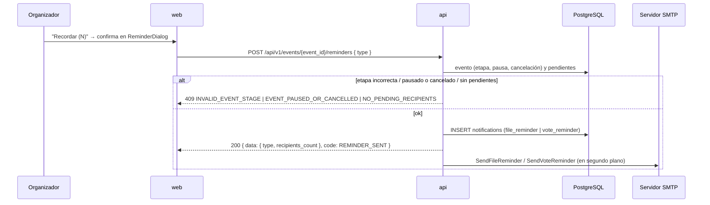

# Story Plan: S-009 (api) - Notificaciones in-app y recordatorios (api)

## Status

**Status:** Completed

## Story Reference

- **Story:** [S-009](../stories/S-009.notificaciones-in-app-y-recordatorios-api.md)
- **Service:** api
- **Summary:** Persistir avisos in-app (`type` + `data`, nunca texto) en una tabla nueva
  `notifications` (migración 024), emitirlos de forma best effort desde los siete handlers que hoy
  mandan email o equivalentes (etapa, cancelación, pausa, cierre, inscripción, ranking), exponer
  cuatro endpoints de lectura para el usuario del JWT (listado paginado por cursor, contador,
  marcar una y marcar todas) con retención de 90 días, y agregar
  `POST /events/{event_id}/reminders` para que el organizador recuerde a los pendientes de archivo
  o de ranking por email y notificación.

> **Story puramente backend** (`affects_ui: false`): no hay contexto UX ni Design System en este
> plan. Habilita S-016 (Gestión del organizador: recordatorios) y S-018 (Campana, panel y página de
> notificaciones) en `web`.

### Decisiones tomadas al planificar (modo automático)

| # | Tema | Decisión |
|---|---|---|
| D1 | Dónde vive el servicio y cómo se evita el ciclo de imports | Paquete nuevo `internal/domain/notification` con la entidad, los tipos y `Service`. `Service` depende de una interfaz **propia del paquete** (`notification.Writer`: `CreateBatch` + `UpsertParticipantRegistered`), no de `postgres` (que importa `domain/notification` para la entidad: importarlo al revés sería un ciclo). `postgres.NotificationRepository` la satisface estructuralmente. Mismo patrón que `vote/repositories.go` |
| D2 | Emisión sincrónica, email sin cambios | Las notificaciones se insertan **sincrónicamente** en el handler, después de la operación principal y antes de responder; la respuesta no cambia si fallan (`h.log.Warn`). Las goroutines de email existentes **no se tocan** (CA-18): siguen consultando sus destinatarios por su cuenta. Se acepta la consulta extra de `GetEventParticipants` a cambio de no alterar el email y de tener tests deterministas (sin goroutines) |
| D3 | Destinatarios "inscriptos" | `UserRepository.GetEventParticipants(eventID)`, que ya **excluye al autor** (`users.id <> events.author_id`). Es la misma lista que reciben los emails hoy. Si falla, `log.Warn` y no se emite nada (la respuesta no cambia) |
| D4 | `deadline` de `stage_changed` | `participation` → `req.estimated_end_date`; `voting` → `req.estimated_end_date`; `results` → la clave `deadline` **se omite**. Formato `YYYY-MM-DD` (string). `creation` no es destino posible |
| D5 | `stage_changed` en `voting` | Por destinatario: si tiene asignación en `voting.assignments` (las que acaba de escribir `OpenVoting`) → `{ stage: "voting", deadline, can_vote: true, assigned_count: len(assignment.AttachmentIDs) }`; si no → `{ stage: "voting", deadline, can_vote: false }` (sin `assigned_count`) |
| D6 | `stage_changed` en `results` | `CalculateAndPersistResults` pasa a devolver `(*vote.VotingResults, error)` (único llamador: `UpdateEventStage`). Por destinatario se busca en `AdjustedRanking` el elemento con `ParticipantID == recipient`: si está → `{ stage: "results", result_position: item.AdjustedRank, result_total: len(AdjustedRanking) }`; si no está, si el cálculo falló o si `voteHandler == nil` → `{ stage: "results" }`. Misma regla que `buildMyStatus` (S-008 D19) |
| D7 | Agregación de `participant_registered` | SQL explícito con `INSERT … ON CONFLICT (recipient_id, event_id, type) WHERE read_at IS NULL AND type = 'participant_registered' DO UPDATE SET data = jsonb_set(notifications.data, '{count}', to_jsonb(COALESCE((notifications.data->>'count')::int, 0) + 1)), created_at = now(), updated_at = now()`. Primera inscripción (o la anterior ya leída) → fila nueva con `data = {"count": 1}` |
| D8 | Retención | Constante `notification.RetentionDays = 90`. El corte se calcula **en SQL** (`created_at >= now() - interval '90 days'`) en listado, contador, marcar una y marcar todas. `GET /notifications` borra antes las del destinatario con `created_at < now() - interval '90 days'`; si el borrado falla, `log.Warn` y se lista igual |
| D9 | Paginación por cursor | Orden `created_at DESC, id DESC`. Se piden `limit + 1` filas: si vuelven más de `limit`, se recorta y `next_cursor` = `created_at` del último ítem devuelto; si no, `next_cursor: null`. `before` es exclusivo (`created_at < before`). `next_cursor` y `created_at` se serializan en **UTC con `time.RFC3339Nano`** para no perder los microsegundos de Postgres (si se truncan a segundos, el cursor repite o saltea filas). `before` se parsea con `time.RFC3339Nano` (acepta también RFC3339 sin fracción) |
| D10 | Validación de query del listado | `limit` ausente → 20. `limit` no entero, `< 1` o `> 50` → `400 INVALID_PAYLOAD` con `details: "limit must be an integer between 1 and 50"`. `before` no parseable → `400 INVALID_PAYLOAD` con `details: "before must be an RFC3339 date-time"`. No se recorta en silencio |
| D11 | `notification_id` mal formado | `404 NOTIFICATION_NOT_FOUND` (no `400`): el spec solo documenta `401` y `404` para ese endpoint, y una notificación con id inválido tampoco existe. Desvío consciente de la regla general de `validation` (UUID inválido → 400) para respetar el contrato |
| D12 | Marcar como leída, idempotente | `UPDATE notifications SET read_at = COALESCE(read_at, now()), updated_at = now() WHERE id = ? AND recipient_id = ? AND created_at >= now() - interval '90 days' RETURNING id, read_at`. Sin fila → sentinela `notification.ErrNotFound` → `404 NOTIFICATION_NOT_FOUND`. Repetir devuelve el mismo `read_at` |
| D13 | Marcar todas | `UPDATE … SET read_at = now(), updated_at = now() WHERE recipient_id = ? AND read_at IS NULL AND created_at >= now() - interval '90 days'`; `data.updated` = `RowsAffected` |
| D14 | `event` del listado | `JOIN events` en la misma consulta del listado (sin N+1): `event.id`, `event.name`, `event.stage` vigentes. `ON DELETE CASCADE` garantiza que el evento existe |
| D15 | Orden de validaciones en `SendReminder` | path param (`400 INVALID_EVENT_ID`) → body (`400 INVALID_PAYLOAD`; `type` con `binding:"required,oneof=file vote"`) → `GetByID` (`404 EVENT_NOT_FOUND`) → cancelado o pausado (`409 EVENT_PAUSED_OR_CANCELLED`) → etapa (`409 INVALID_EVENT_STAGE` + `current_stage`) → pendientes (`409 NO_PENDING_RECIPIENTS`) → notificaciones (best effort) → `200` → emails en goroutine. Pausa/cancelación va antes que la etapa porque es el estado que bloquea cualquier acción |
| D16 | Pendientes del recordatorio | `file`: `GetEventParticipants(eventID)` menos los `participant_id` de `AttachmentRepository.GetByEventID(eventID)`. `vote`: `VoteRepository.GetAssignmentsByEventID(eventID)` con `IsCompleted == false`, cruzado con `GetEventParticipants` para obtener el email (un `participant_id` de asignación que no figure como inscripto se descarta con `log.Warn`). Falla de cualquier lectura → `500 RETRIEVAL_ERROR` (código existente) |
| D17 | `deadline` de los recordatorios | `file` → `ParticipationEstimatedEndDate`; `vote` → `VotingEstimatedEndDate`; `YYYY-MM-DD` con `formatDatePtr` (puede ser `null` si el evento no tiene fecha) |
| D18 | Copy de los emails nuevos | `SendFileReminder` y `SendVoteReminder` en **español neutro, sin voseo** ("Ingresa", no "Ingresá"), aunque los templates existentes usen voseo (no se tocan, CA-18). Si `deadline` está vacío, el cuerpo omite la línea de fecha |
| D19 | Códigos de error 500 | Se reutilizan códigos existentes: lecturas → `RETRIEVAL_ERROR`; escrituras de leídas → `DB_UPDATE_ERROR`. `GET /notifications/unread-count` sin `user_id` en contexto → `401 NO_AUTH_TOKEN` (forma A, como `GetUserEvents`); en la práctica lo frena antes `JWTAuthMiddleware` (forma B) |
| D20 | `Data` vacío | `{}` (nunca `null`) para `event_cancelled`, `event_paused`, `registration_confirmed`. `Data.Value()` serializa `nil` como `'{}'` |
| D21 | `models.go` | `Notification` **no** se agrega a `AllModels()`: la migración 002 corre `AutoMigrate(AllModels()...)` en una base nueva y crearía la tabla antes de la 024, que fallaría con `relation already exists`. Igual que `vote_drafts` |

## Architectural Context

### Tech Stack

```
go 1.26.6
github.com/gin-gonic/gin v1.10.1        # router + binding (go-playground/validator)
gorm.io/gorm v1.30.2                    # ORM (clause.OnConflict, Exec, Raw)
gorm.io/driver/postgres v1.6.0
github.com/lib/pq v1.10.9
github.com/google/uuid v1.6.0
github.com/golang-jwt/jwt/v5 v5.3.0     # JWT HS256
github.com/charmbracelet/log v0.4.2     # logging clave-valor
github.com/stretchr/testify v1.11.1     # assert / require
```

PostgreSQL con reglas de negocio en triggers (ADR-002). Monolito backend + SPA (ADR-003). Gin y
GORM en lugar del catálogo chi/sqlc (ADR-004). Notificaciones persistidas + polling (ADR-009).

### Service Architecture

```
api/
├── cmd/api/main.go                       # wiring + registro de TODAS las rutas
├── internal/
│   ├── domain/
│   │   ├── event/events.go               # Event, Stage, StageFromString
│   │   ├── participant/                  # User, UserWithEventRole
│   │   ├── attachment/                   # Attachment
│   │   ├── vote/vote.go                  # Assignment (AttachmentIDs, IsCompleted), VotingResults (AdjustedRanking)
│   │   ├── vote/vote_draft.go            # ejemplo de tipo JSONB propio (DraftRankings Scan/Value)
│   │   └── notification/                 # NUEVO (esta story)
│   ├── email/
│   │   ├── email_service.go              # Send*Notification (chequea cfg.Email.Enabled y lista vacía)
│   │   └── templates.go                  # *Subject / *Body
│   ├── handlers/
│   │   ├── event_handler.go              # UpdateEventStage (l.288), UpdateEstimatedEndDate (l.610),
│   │   │                                 # RegisterParticipant (l.779), CancelEvent (l.1725),
│   │   │                                 # PauseEvent (l.1799), formatDatePtr (l.1882)
│   │   ├── distributed_vote_handler.go   # SubmitRankingVotes (l.548), CalculateAndPersistResults (l.780)
│   │   ├── notification_handler.go       # NUEVO
│   │   ├── mocks_repository_test.go      # mocks a mano de todos los repositorios
│   │   └── *_test.go
│   ├── middleware/auth/                  # JWTAuthMiddleware, GetUserIDFromContext, RequireEventOwner
│   └── storage/
│       ├── migrations/                   # NNN_descripción.go + migrations.go (GetMigrations)
│       └── postgres/
│           ├── repository.go             # interfaces de todos los repositorios
│           ├── notification_repository.go  # NUEVO
│           └── *_integration_test.go     # //go:build integration (migratedTx en vote_triggers_integration_test.go)
```

**Handlers (convención `http-server`):**

- Un handler es un método sobre un struct que recibe sus dependencias por constructor. Orden
  interno: 1. path params 2. body 3. reglas de negocio 4. respuesta.
- El handler no contiene el algoritmo de negocio: parsea, delega y responde.
- Nunca `panic`. Nunca `uuid.MustParse` sobre entrada del usuario.
- **Todas las rutas se registran en `cmd/api/main.go`**, en el grupo que corresponda. Un endpoint
  fuera de un grupo con `JWTAuthMiddleware()` queda **público**: verificar el grupo.
- Éxito con envelope `data` en todo endpoint nuevo; nunca serializar la entidad de dominio directo
  (construir el payload con `gin.H`).
- El logger se obtiene en el constructor (`logger.Handler("notification")`).
- No agregar logging de entrada/salida de requests (`events.CreateEvent()` ya lo hace).

**Validación (convención `validation`):** path params manual (`uuid.Parse`), body con binding tags
(`c.ShouldBindJSON`, error → `400 { error: "Invalid request payload", code: "INVALID_PAYLOAD", details: err.Error() }`),
reglas de negocio manuales. Query params: manual (`strconv.Atoi`).

**Manejo de errores (convención `error-handling`):**

- Forma A, siempre con `code`: `{ "error": "mensaje legible", "code": "SCREAMING_SNAKE", "details": "string opcional" }`.
- Forma B (middlewares): `{ "error": "UNAUTHORIZED"|"FORBIDDEN"|"NOT_FOUND", "message": "..." }`.
- No inventar `code` si ya existe uno equivalente; `details` es string; `401` credenciales,
  `403` sin permiso, `404` inexistente, `409` conflicto de estado, `400` entrada inválida; no
  exponer errores internos crudos (loguear y devolver mensaje controlado).
- Entre capas: `fmt.Errorf("...: %w", err)`; sentinela por módulo (`ErrNotFound`) e inspección con
  `errors.Is`.

**Logging (convención `logging`):** pares clave-valor, nunca interpolación; `Warn` para lo
recuperable (fallas best effort), `Error` para operaciones que fallan. No loguear tokens.

**Base (`_base`):** `gofumpt`; sin estado global mutable; constantes `MixedCaps`; errores
centinela `Err...`; comentarios solo para el "por qué"; doc comment en identificadores exportados.

**Database (convención `database`):**

- `TableName()` explícito; `BeforeCreate` que asigna UUID si viene nulo; opcionales como puntero.
- Enums de Postgres como tipo `string` con `Scan`/`Value`; JSONB como tipo propio con
  `Scan`/`Value` (ver `vote.DraftRankings`).
- Interfaz en `internal/storage/postgres/repository.go`, implementación en
  `{entidad}_repository.go`; IDs como `string`; firmas **sin** `context.Context`; dependencias por
  constructor (no usar `postgres.DB`).
- Migraciones en Go (`migrationNNNUp/Down` registradas en `GetMigrations()`), `Down` siempre
  implementado, numeración de tres dígitos.

**Testing (convención `testing`):** mocks a mano en `mocks_*_test.go` (al agregar un método a una
interfaz, agregarlo al mock y a las aserciones de compilación); tests de handler con `httptest` y
Gin en modo test; table-driven con `t.Run`; **verificar el `code`**, no solo el status;
integración detrás de `//go:build integration` con `migratedTx` (base `TEST_DB_NAME`).

### Relevant ADRs

- **ADR-009: Notificaciones in-app persistidas en la base y consultadas por polling**
  - Decision (verbatim):
    1. **La api inserta la notificación en la tabla `notifications`** en el mismo handler que
       dispara el email (o la acción equivalente), después de la operación principal. Es best
       effort, como los emails: si la inserción falla se loguea y la respuesta no cambia.
    2. **La web consulta por polling** `GET /api/v1/notifications/unread-count`: al montar, cada
       60 s con la pestaña visible, al volver el foco y después de cada navegación. El panel y la
       página piden el listado al abrirse.
    3. **Se guarda `type` + `data`, no texto.** `data` lleva solo los valores que el texto
       necesita y que no se pueden leer del evento vigente (cierre, cantidad asignada, puesto,
       conteo). La api devuelve además el evento vigente (`id`, `name`, `stage`) y la web compone
       título, cuerpo y acción con el catálogo de i18n.
    4. **Retención de 90 días** por filtro en las consultas, más un borrado de las viejas del
       destinatario al listar. Sin scheduler.
  - Consecuencias que obligan a la api: agregar un tipo es un valor más en el enum
    `notification_type`; una falla de inserción se pierde (sin garantía de entrega); el contador
    usa el índice parcial `idx_notifications_unread`.
- **ADR-003: Backend monolítico con SPA, sin microservicios ni bus de eventos**
  - Decision: dos servicios (`api` con todo el estado, `web` SPA); comunicación única `web → api`
    por HTTP REST con JWT. Sin bus, colas ni comunicación asincrónica entre servicios.
  - Implementation Rules: *"Cualquier documento o diseño que asuma comunicación asincrónica entre
    servicios de este producto está describiendo algo que no existe."* → Sin WebSocket, SSE, colas,
    workers ni scheduler (la retención se resuelve al listar).
- **ADR-004: Gin y GORM en el backend**
  - Implementation Rules: handlers sobre `*gin.Context`; queries con GORM (no sqlc). Revisar a mano
    que no haya N+1 (el listado hace `JOIN events`, la inserción es un lote).
- **ADR-005: Las entidades de dominio son a la vez modelo de persistencia y contrato JSON**
  - Implementation Rules: en handlers nuevos, construir el payload de respuesta aparte (`gin.H`)
    en vez de serializar la entidad.
- **ADR-002: Reglas de negocio en triggers** — `notifications` no tiene triggers; las reglas de
  esta story (agregación, retención, pertenencia) viven en SQL explícito del repositorio y en Go.

### API Context

Fuente: `docs/apis/api.yaml` (v1.1.0), que **ya describe S-009**. Prefijo `/api/v1`.

**JWT (convención `auth-jwt`):** `JWTAuthMiddleware` deja en el contexto `user_id` (string),
`user_email`, `user_role`. `auth.GetUserIDFromContext(c) (uuid.UUID, error)`. `RequireEventOwner(eventRepo)`
permite al autor o a un `admin` (forma B `403 { "error": "FORBIDDEN", "message": "Only the event creator or an admin can perform this action" }`).

#### Endpoints existentes con efecto nuevo (sin cambio de contrato)

| Endpoint | Handler | Efecto S-009 |
|---|---|---|
| `PATCH /api/v1/events/{event_id}/stage` | `EventHandler.UpdateEventStage` | `stage_changed` a los inscriptos (excluye al autor) |
| `PATCH /api/v1/events/{event_id}/cancel` | `EventHandler.CancelEvent` | `event_cancelled` a los inscriptos |
| `PATCH /api/v1/events/{event_id}/pause` | `EventHandler.PauseEvent` | `event_paused` a los inscriptos, **solo al pausar** |
| `PATCH /api/v1/events/{event_id}/estimated-end-date` | `EventHandler.UpdateEstimatedEndDate` | `deadline_changed { stage, new_date }` a los inscriptos |
| `POST /api/v1/events/{event_id}/register` | `EventHandler.RegisterParticipant` | `registration_confirmed` al inscripto + `participant_registered { count }` (agregada) al autor |
| `POST /api/v1/events/{event_id}/participants/{participant_id}/ranking-votes` | `DistributedVoteHandler.SubmitRankingVotes` | `ranking_submitted { replaced }` al participante |

Respuestas actuales que **no deben cambiar** (se testean byte a byte los campos clave):

- `PATCH …/stage` → `200 { data: { id, name, description, start_date, end_date, stage, participation_estimated_end_date, voting_estimated_end_date, author_id, updated_at }, message: "Event stage updated successfully", code: "STAGE_UPDATED", transition: { from, to }, voting?: { configuration, assignments_count, total_attachments } }`
- `PATCH …/cancel` → `200 { data: { id, name, stage, is_cancelled: true }, message: "Event cancelled successfully", code: "EVENT_CANCELLED" }`; `409 ALREADY_CANCELLED`
- `PATCH …/pause` → `200 { data: { id, name, stage, is_paused }, message, code: "EVENT_PAUSED" | "EVENT_RESUMED" }`; `409 EVENT_CANCELLED`
- `PATCH …/estimated-end-date` → body `{ stage: "participation"|"voting", estimated_end_date: "YYYY-MM-DD" }` → `200 { message, data: { event_id, stage, estimated_end_date, previous_date }, code: "ESTIMATED_DATE_UPDATED" }`
- `POST …/register` → body `{ participant_name, participant_email }` → `201 { data: { participant_id, participant_name, participant_email, event_id, event_name, registered_at }, message, code: "PARTICIPANT_REGISTERED" }`
- `POST …/ranking-votes` → body `{ assignment_id, rankings: [{ attachment_id, rank }] }` → `201 { message: "Ranking votes submitted successfully", event_id, participant_id, votes_count, replaced }` (plana, sin `data`)

#### `GET /api/v1/notifications` (JWT)

```yaml
query:
  limit: integer   # 1..50, default 20
  before: date-time  # cursor por created_at (exclusivo)
200:
  data:
    - id: uuid
      type: NotificationType
      data: object          # additionalProperties
      event: { id: uuid, name: string, stage: Stage }   # datos VIGENTES del evento
      read_at: date-time|null
      created_at: date-time
  unread_count: integer
  next_cursor: date-time|null
400: INVALID_PAYLOAD   # limit o before inválidos
401: MiddlewareUnauthorized   # forma B
```

Filtra siempre por el usuario del JWT y por los últimos 90 días, de la más reciente a la más
antigua. Además borra las del usuario con más de 90 días.

#### `GET /api/v1/notifications/unread-count` (JWT)

`200 { data: { unread_count: integer } }`; `401` forma B. Es el endpoint del polling (ADR-009).

#### `PATCH /api/v1/notifications/{notification_id}/read` (JWT)

`200 { data: { id: uuid, read_at: date-time }, code: NOTIFICATION_READ }`. Idempotente.
`404 NOTIFICATION_NOT_FOUND` (inexistente o ajena; no 403, para no confirmar que existe). `401`.

#### `POST /api/v1/notifications/read-all` (JWT)

`200 { data: { updated: integer }, code: NOTIFICATIONS_READ }`; `401`.

#### `POST /api/v1/events/{event_id}/reminders` (JWT + `RequireEventOwner`)

```yaml
requestBody: { type: file | vote }   # required
200: { data: { type: file|vote, recipients_count: integer }, message: string, code: REMINDER_SENT }
400: INVALID_PAYLOAD
401: MiddlewareUnauthorized
403: MiddlewareForbidden
404: EVENT_NOT_FOUND
409: INVALID_EVENT_STAGE (+ current_stage), NO_PENDING_RECIPIENTS, EVENT_PAUSED_OR_CANCELLED
```

`file` solo en `participation` (destinatarios = inscriptos sin propuesta); `vote` solo en `voting`
(destinatarios = asignaciones sin completar). Envía email en segundo plano y una notificación
`file_reminder` / `vote_reminder` por destinatario.

#### Schemas

```yaml
NotificationType: [stage_changed, event_cancelled, event_paused, deadline_changed,
                   participant_registered, registration_confirmed, ranking_submitted,
                   file_reminder, vote_reminder]

Notification:
  # data por tipo:
  #  stage_changed → {stage, deadline?} + en voting {can_vote, assigned_count?} + en results {result_position?, result_total?}
  #  deadline_changed → {stage, new_date}
  #  participant_registered → {count}
  #  ranking_submitted → {replaced}
  #  file_reminder / vote_reminder → {deadline}
  #  el resto → {}
  id: uuid
  type: NotificationType
  data: object
  event: { id: uuid, name: string, stage: Stage }
  read_at: date-time|null
  created_at: date-time
```

**Códigos existentes reutilizados:** `INVALID_EVENT_ID`, `INVALID_PAYLOAD`, `EVENT_NOT_FOUND`,
`RETRIEVAL_ERROR`, `DB_UPDATE_ERROR`, `NO_AUTH_TOKEN`. **Nuevos (ya en el spec):**
`NOTIFICATION_READ`, `NOTIFICATIONS_READ`, `NOTIFICATION_NOT_FOUND`, `REMINDER_SENT`,
`INVALID_EVENT_STAGE`, `NO_PENDING_RECIPIENTS`, `EVENT_PAUSED_OR_CANCELLED`.

**Seguridad:** toda consulta de lectura filtra por el `recipient_id` = `user_id` del JWT (nunca por
parámetro). `data` nunca incluye quién subió qué propuesta (regla de anonimato de S-007).

### Database Context

**Tabla nueva `notifications` — migración 024** (SQL explícito, como la 016 de `vote_drafts`;
la 023 ya existe):

| Columna | Tipo | Restricciones |
|---|---|---|
| `id` | `uuid` | PK, default `uuid_generate_v4()` |
| `recipient_id` | `uuid` | NOT NULL, FK → `users.id` ON DELETE CASCADE |
| `event_id` | `uuid` | NOT NULL, FK → `events.id` ON DELETE CASCADE |
| `type` | `notification_type` | NOT NULL |
| `data` | `jsonb` | NOT NULL, default `'{}'` |
| `read_at` | `timestamptz` | Nullable. `NULL` = sin leer |
| `created_at` | `timestamptz` | NOT NULL, default `now()` |
| `updated_at` | `timestamptz` | NOT NULL, default `now()` |

```dbml
Enum notification_type {
  stage_changed
  event_cancelled
  event_paused
  deadline_changed
  participant_registered
  registration_confirmed
  ranking_submitted
  file_reminder
  vote_reminder
}

Table notifications {
  id uuid [pk, default: `uuid_generate_v4()`]
  recipient_id uuid [not null, ref: > users.id]   // ON DELETE CASCADE
  event_id uuid [not null, ref: > events.id]      // ON DELETE CASCADE
  type notification_type [not null]
  data jsonb [not null, default: '{}']
  read_at timestamptz
  created_at timestamptz [not null, default: `now()`]
  updated_at timestamptz [not null, default: `now()`]

  indexes {
    (recipient_id, created_at) [name: 'idx_notifications_recipient_created']   // DESC
    (recipient_id) [name: 'idx_notifications_unread', note: 'parcial WHERE read_at IS NULL']
    (recipient_id, event_id, type) [unique, name: 'uq_notifications_registered_unread', note: "parcial WHERE read_at IS NULL AND type = 'participant_registered'"]
  }
}
```

Reglas (del esquema):
- **Agregación** de `participant_registered`: `INSERT … ON CONFLICT` sobre el índice único parcial
  → `data.count` suma y `created_at = now()`. Una vez leída, la próxima inscripción crea una fila
  nueva.
- **Retención de 90 días:** toda consulta filtra `created_at >= now() − interval '90 days'`;
  además `GET /notifications` borra las del destinatario más viejas. Sin scheduler (ADR-003).
- Solo la lee su destinatario (siempre por el `user_id` del JWT).

**Tablas leídas por esta story (sin cambios):**

- `events` — `id`, `name`, `author_id`, `stage` (`event_stage`), `participation_estimated_end_date`
  (`date`), `voting_estimated_end_date` (`date`), `is_cancelled`, `is_paused`.
- `event_participants` — PK `(event_id, user_id)`, `role` (`creator`|`participant`). El autor
  tiene su fila con `role = creator`; `GetEventParticipants` lo excluye.
- `attachments` — `event_id`, `participant_id` (una por participante por evento).
- `assignments` — `event_id`, `participant_id`, `attachment_ids uuid[]`, `is_completed` (lo
  mantiene el trigger `update_assignment_completion`).
- `voting_results` — uno por evento; `adjusted_ranking jsonb` = array de
  `{ attachment_id, participant_id, adjusted_rank, … }`.

**Entidades Go relevantes (existentes):**

```go
// internal/domain/event/events.go
type Event struct {
    ID                            uuid.UUID
    Name                          string
    AuthorID                      uuid.UUID
    Stage                         Stage      // StageCreation, StageParticipation, StageVoting, StageResult ("results")
    ParticipationEstimatedEndDate *time.Time `gorm:"type:date"`
    VotingEstimatedEndDate        *time.Time `gorm:"type:date"`
    IsCancelled                   bool
    IsPaused                      bool
    // ...
}

// internal/domain/vote/vote.go
type Assignment struct {
    ID            uuid.UUID
    EventID       uuid.UUID
    ParticipantID uuid.UUID
    AttachmentIDs pq.StringArray // len = m
    IsCompleted   bool           // trigger
}
type VotingResults struct {
    EventID         uuid.UUID
    AdjustedRanking AttachmentResultSlice // []AttachmentResult{ ParticipantID, AdjustedRank, ... }
}

// internal/domain/participant
type UserWithEventRole struct { User; EventRole string } // User{ ID, Name, Email, ... }
```

**Patrón JSONB existente a imitar (`internal/domain/vote/vote_draft.go`):**

```go
func (d DraftRankings) Value() (driver.Value, error) {
    if d == nil { return "[]", nil }
    b, err := json.Marshal(d)
    if err != nil { return nil, fmt.Errorf("failed to marshal DraftRankings: %w", err) }
    return string(b), nil
}
func (d *DraftRankings) Scan(value interface{}) error {
    if value == nil { *d = DraftRankings{}; return nil }
    var bytes []byte
    switch v := value.(type) {
    case []byte: bytes = v
    case string: bytes = []byte(v)
    default: return fmt.Errorf("failed to scan DraftRankings: unsupported type %T", value)
    }
    return json.Unmarshal(bytes, d)
}
```

**Patrón de migración con SQL explícito (`016_add_vote_drafts.go`):**

```go
func migration016Up(db *gorm.DB) error {
    if err := db.Exec(`CREATE TABLE vote_drafts (
        id UUID PRIMARY KEY DEFAULT uuid_generate_v4(),
        event_id UUID NOT NULL REFERENCES events(id) ON DELETE CASCADE,
        ...
        created_at TIMESTAMPTZ NOT NULL DEFAULT NOW(),
        updated_at TIMESTAMPTZ NOT NULL DEFAULT NOW())`).Error; err != nil {
        return err
    }
    return db.Exec(`CREATE INDEX idx_vote_drafts_participant ON vote_drafts(participant_id)`).Error
}
func migration016Down(db *gorm.DB) error {
    if err := db.Exec(`DROP INDEX IF EXISTS idx_vote_drafts_participant`).Error; err != nil { return err }
    return db.Exec(`DROP TABLE IF EXISTS vote_drafts`).Error
}
```

Registro en `GetMigrations()` (`migrations.go`), a continuación de la 023:

```go
{
    ID:   "024",
    Name: "add_notifications",
    Up:   migration024Up,
    Down: migration024Down,
},
```

### Flow Context

**`notificaciones-in-app`** (nuevo, Draft → esta story implementa el lado `api`):

```mermaid
sequenceDiagram
    participant U as Usuario
    participant WEB as web
    participant API as api
    participant DB as PostgreSQL

    Note over API: handler disparador (etapa, cancelación, pausa, cierre, inscripción, ranking, recordatorio)
    API->>API: completa la operación principal
    API->>DB: INSERT notifications (lote) / ON CONFLICT para participant_registered
    alt falla la inserción
        API->>API: log.Warn (la respuesta no cambia)
    end

    loop cada 60 s con la pestaña visible, al volver el foco y al navegar
        WEB->>API: GET /api/v1/notifications/unread-count
        API->>DB: COUNT WHERE recipient_id = JWT AND read_at IS NULL AND created_at >= now() - 90d
        API-->>WEB: 200 { data: { unread_count } }
    end

    U->>WEB: toca la campana
    WEB->>API: GET /api/v1/notifications?limit=10
    API->>DB: DELETE > 90 días del destinatario; SELECT últimos 90 días
    API-->>WEB: 200 { data[], unread_count, next_cursor }
    U->>WEB: toca una notificación
    WEB->>API: PATCH /api/v1/notifications/{notification_id}/read
    API-->>WEB: 200 { data: { id, read_at } }
    WEB-->>U: navega a la acción
```

Paso 1 — Emisión: `notification.Service`, inyectado por constructor en `EventHandler` y
`DistributedVoteHandler`, inserta en lote (`CreateInBatches`) **después** de la operación
principal (y del commit, si hay transacción).

| Disparador (handler) | `type` | Destinatarios | `data` |
|---|---|---|---|
| `UpdateEventStage` | `stage_changed` | inscriptos (excluye al autor) | `{ stage, deadline? }`; en `voting` + `{ can_vote, assigned_count? }`; en `results` + `{ result_position?, result_total? }` |
| `CancelEvent` | `event_cancelled` | inscriptos | `{}` |
| `PauseEvent` (solo al pausar) | `event_paused` | inscriptos | `{}` |
| `UpdateEstimatedEndDate` | `deadline_changed` | inscriptos | `{ stage, new_date }` |
| `RegisterParticipant` | `participant_registered` | autor | `{ count }` (agregada) |
| `RegisterParticipant` | `registration_confirmed` | inscripto | `{}` |
| `SubmitRankingVotes` | `ranking_submitted` | el participante | `{ replaced }` |
| `SendReminder` | `file_reminder` / `vote_reminder` | pendientes | `{ deadline }` |

Manejo de errores del flujo: falla la inserción → nada (log), la operación principal se confirma
igual; notificación ajena o inexistente → 404.

**`recordatorio-manual`** (nuevo, Draft → esta story implementa el lado `api`):



Estado resultante: una notificación por destinatario; emails enviados (o perdidos si SMTP falla,
sin reintento); sin registro del último envío (sin límite de frecuencia, fuera de alcance).

**Flujos existentes modificados:**

- **`avance-de-etapa-del-evento`**, Paso 4 ("Notificación por email", en segundo plano, a los
  participantes registrados): **además** del email, notificaciones `stage_changed`. Acciones
  independientes de la etapa: cancelar, pausar (solo al pausar) y posponer emiten
  `event_cancelled`, `event_paused` y `deadline_changed`.
- **`registro-y-carga-de-propuesta`**, Paso 2 (`POST /api/v1/events/{event_id}/register` →
  `INSERT event_participants role = 'participant'`): emite `registration_confirmed` (al inscripto)
  y `participant_registered` agregada (al autor).
- **`evaluacion-y-envio-de-ranking`**, Paso 4 (`POST …/ranking-votes`, `DELETE` + `INSERT` de
  votos en una transacción): emite `ranking_submitted` con `{replaced}`.

### Integration Points

- **SMTP** (existente, `internal/email/email_service.go`): cada `Send*` devuelve `nil` sin enviar
  si `cfg.Email.Enabled == false` o si la lista de destinatarios está vacía; si no, `send` abre
  una conexión y envía un correo individual por destinatario (cada uno ve solo su email). Los
  handlers lo llaman dentro de `go func() { … }()` y solo loguean el error. Sin reintentos.
  Los emails nuevos siguen exactamente ese patrón.
- Sin colas, bus ni servicios externos nuevos (ADR-003).

### Code Conventions

- Archivos `snake_case.go`; tipos y funciones exportadas en `MixedCaps` con doc comment.
- Constantes de tipo: `notification.TypeStageChanged = "stage_changed"`, etc.
- Repositorio: `PostgresNotificationRepository` + `NewPostgresNotificationRepository(db *gorm.DB)`,
  logger `logger.Repository("notification")`.
- Handler: `NotificationHandler` + `NewNotificationHandler(repo postgres.NotificationRepository)`,
  logger `logger.Handler("notification")`.
- Fechas de negocio `YYYY-MM-DD` (`formatDatePtr`); timestamps en RFC3339 (Nano para cursores).

### Reusable Code

- **`formatDatePtr(t *time.Time) interface{}`** (`internal/handlers/event_handler.go:1882`) —
  `YYYY-MM-DD` o `nil`. Para `deadline` de los recordatorios (D17).
- **`buildMyStatus`** (`internal/handlers/user_handler.go:465`) — muestra la regla de posición:
  recorrer `results.AdjustedRanking` buscando `ParticipantID == userID` y tomar `AdjustedRank` y
  `len(AdjustedRanking)`. Extraer un helper común `resultPosition(results *vote.VotingResults, userID uuid.UUID) (pos, total int, ok bool)` y usarlo desde `buildMyStatus` y desde la emisión de `stage_changed` en `results`.
- **`UserRepository.GetEventParticipants(eventID) ([]*participant.UserWithEventRole, error)`** —
  inscriptos sin el autor (D3).
- **`AttachmentRepository.GetByEventID(eventID)`** y **`VoteRepository.GetAssignmentsByEventID(eventID)`**
  — base de los pendientes del recordatorio (D16).
- **`VotingSetupRepository.OpenVoting`** / `votingSetup.assignments` — asignaciones recién escritas
  en la transición a `voting` (D5).
- **`DistributedVoteHandler.CalculateAndPersistResults`** — se cambia para devolver los resultados (D6).
- **`auth.GetUserIDFromContext(c)`** (`internal/middleware/auth/jwt.go:155`), **`auth.RequireEventOwner(repo)`**,
  **`auth.JWTAuthMiddleware()`**, **`auth.GenerateToken(userID, email, role)`** (tests de ruta real).
- **`vote.DraftRankings`** — patrón `Scan`/`Value` para `notification.Data`.
- **`clause.OnConflict`** (usado en `PostgresVoteDraftRepository.Upsert`) — no sirve para el
  índice **parcial** (requiere `WHERE` en el target): usar `db.Exec` con SQL explícito (D7).
- **Test helpers** (`internal/handlers`): `newTestEventHandlerSet()`, `newTestHandlerSet()`,
  `performRequest(t, method, handler, params, query, body)`, `performAuthedRequest(t, method,
  handler, params, userID, body)`, `jsonBody(t, w)`, `setEventParticipantCount(s, eventID, n)`,
  `newParticipationEvent()`, `newVotingEvent()`, mocks `addEvent`, `addUser`,
  `setEventParticipants`, `mockVotingSetupRepository`. Integración: `migratedTx`,
  `insertUser`, `addEventParticipant` (`internal/storage/postgres/*_integration_test.go`).

## Acceptance Criteria Coverage

| AC# | Description | Task(s) |
|-----|-------------|---------|
| CA-1 | Cambio de etapa → `stage_changed { stage }` a cada inscripto sin el autor | Task 4 |
| CA-2 | Apertura de votación distingue `can_vote` / `assigned_count` | Task 4 |
| CA-2b | Publicación de resultados con `result_position` / `result_total` | Task 4 |
| CA-3 | `event_cancelled`, `event_paused`, `deadline_changed { stage, new_date }` | Task 5 |
| CA-4 | Inscripción → `registration_confirmed` + `participant_registered { count }` | Task 5 |
| CA-5 | Agregación de `participant_registered` | Task 2, Task 5 |
| CA-6 | `ranking_submitted { replaced }` | Task 5 |
| CA-7 | Listado propio con `event` vigente, `unread_count`, `next_cursor` | Task 2, Task 6 |
| CA-8 | Paginación por cursor | Task 2, Task 6 |
| CA-9 | Contador de no leídas | Task 2, Task 6 |
| CA-10 | Marcar como leída idempotente | Task 2, Task 6 |
| CA-11 | Marcar todas como leídas | Task 2, Task 6 |
| CA-12 | Cada usuario ve solo lo suyo; ajena → `404 NOTIFICATION_NOT_FOUND` | Task 2, Task 6 |
| CA-13 | Retención de 90 días (filtro + borrado al listar) | Task 2, Task 6 |
| CA-14 | Recordatorio de archivo | Task 7 |
| CA-15 | Recordatorio de voto | Task 7 |
| CA-16 | Recordatorio sin pendientes / etapa incorrecta / pausado o cancelado | Task 7 |
| CA-17 | Una falla al notificar no rompe la operación | Task 3, Task 4, Task 5, Task 7 |
| CA-18 | Emails existentes sin cambios | Task 4, Task 5 |

## Test Scenarios

Convenciones: `AUTHOR` = autor del evento (rol global `organizer`), `P1..P4` = inscriptos (rol
`participant`), `OTHER` = otro usuario autenticado. En tests de handler directos, "como X" =
`performAuthedRequest(..., X.ID.String(), ...)` (o `c.Set("user_id", …)`). "Notificaciones
emitidas" = lo que recibió el `mockNotificationRepository` (`created []*notification.Notification`
y `registeredUpserts [][2]string`). Fechas: `D1 = "2026-11-15"`, `D2 = "2026-12-01"`.

### Emisión desde los handlers (unitarios con mocks)

| ID | Escenario | Input | Output Esperado | AC |
|----|-----------|-------|-----------------|-----|
| TS-1 | Paso a `participation` notifica a inscriptos | Evento `E { stage: "creation", author_id: AUTHOR.ID }`; `GetEventParticipants(E.id)` devuelve `P1..P4` (sin autor). `PATCH /api/v1/events/{E.id}/stage` como `AUTHOR`, body `{ "stage": "participation", "estimated_end_date": D1 }` | `200 { "code": "STAGE_UPDATED", "transition": { "from": "creation", "to": "participation" } }`; 4 notificaciones `type: "stage_changed"`, `event_id: E.id`, `recipient_id` ∈ {P1..P4}, cada una `data == { "stage": "participation", "deadline": "2026-11-15" }`; ninguna con `recipient_id == AUTHOR.ID` | CA-1 |
| TS-2 | Apertura de votación distingue a quien no participa | `E { stage: "participation" }` con `P1..P3` con propuesta y `P4` sin propuesta; body `{ "stage": "voting", "estimated_end_date": D2, "voting_config": { "attachments_per_evaluator": 2 } }` | `200 { "code": "STAGE_UPDATED", "voting": { "assignments_count": 3 } }`; `P1..P3`: `data == { "stage": "voting", "deadline": "2026-12-01", "can_vote": true, "assigned_count": 2 }`; `P4`: `data == { "stage": "voting", "deadline": "2026-12-01", "can_vote": false }` (sin clave `assigned_count`) | CA-2 |
| TS-3 | Publicación de resultados con puesto | `E { stage: "voting" }`, `voteHandler` real con mocks; `CalculateAndPersistResults` produce `adjusted_ranking` de 3 elementos con `participant_id` `P2` (rank 1), `P1` (rank 2), `P3` (rank 3); inscriptos `P1..P4`. Body `{ "stage": "results" }` | `200 { "code": "STAGE_UPDATED" }`; `P1`: `{ "stage": "results", "result_position": 2, "result_total": 3 }`; `P2`: `{ "stage": "results", "result_position": 1, "result_total": 3 }`; `P3`: `{ …, "result_position": 3, "result_total": 3 }`; `P4` (no figura): `data == { "stage": "results" }` | CA-2b |
| TS-4 | Resultados con cálculo fallido | Igual a TS-3 pero `configRepo.GetByEventID` devuelve error (el cálculo falla) | `200` (sin cambio); los 4 reciben `data == { "stage": "results" }` | CA-2b, CA-17 |
| TS-5 | Resultados sin `voteHandler` | `newTestEventHandlerSet()` (`voteHandler == nil`), `E { stage: "voting" }`, body `{ "stage": "results" }` | `200`; cada inscripto `data == { "stage": "results" }` | CA-2b |
| TS-6 | Cancelación | `E { stage: "participation", is_cancelled: false }`, inscriptos `P1, P2`; `PATCH /api/v1/events/{E.id}/cancel` | `200 { "code": "EVENT_CANCELLED", "data": { "is_cancelled": true } }`; 2 notificaciones `type: "event_cancelled"`, `data == {}` | CA-3 |
| TS-7 | Cancelar dos veces no notifica | `E { is_cancelled: true }`; `PATCH …/cancel` | `409 { "code": "ALREADY_CANCELLED" }`; 0 notificaciones | CA-3 |
| TS-8 | Pausar notifica, reanudar no | `E { is_paused: false }`, inscriptos `P1, P2`; `PATCH …/pause` dos veces | 1.ª: `200 { "code": "EVENT_PAUSED", "data": { "is_paused": true } }` y 2 notificaciones `event_paused` con `data == {}`; 2.ª: `200 { "code": "EVENT_RESUMED" }` y **ninguna** notificación nueva | CA-3 |
| TS-9 | Cambio de cierre | `E { stage: "participation", participation_estimated_end_date: "2026-11-01" }`, inscriptos `P1, P2`; `PATCH …/estimated-end-date` body `{ "stage": "participation", "estimated_end_date": "2026-11-20" }` | `200 { "code": "ESTIMATED_DATE_UPDATED", "data": { "estimated_end_date": "2026-11-20", "previous_date": "2026-11-01" } }`; 2 notificaciones `deadline_changed`, `data == { "stage": "participation", "new_date": "2026-11-20" }` | CA-3 |
| TS-10 | Cambio de cierre rechazado no notifica | Mismo evento; body `{ "stage": "participation", "estimated_end_date": "2026-10-20" }` (adelanta) | `400 { "code": "CANNOT_ADVANCE_DEADLINE" }`; 0 notificaciones | CA-3 |
| TS-11 | Inscripción | `E { stage: "participation", author_id: AUTHOR.ID }`; `POST /api/v1/events/{E.id}/register` anon, body `{ "participant_name": "Luz Pérez", "participant_email": "luz@example.com" }` | `201 { "code": "PARTICIPANT_REGISTERED" }`; 1 notificación `registration_confirmed` con `recipient_id` = id del usuario `luz@example.com`, `data == {}`; 1 upsert `participant_registered` con `(recipient_id = AUTHOR.ID, event_id = E.id)` | CA-4 |
| TS-12 | Inscripción rechazada no notifica | Tabla: evento en `voting` (`400 INVALID_REGISTRATION_STAGE`), pausado (`403 EVENT_PAUSED`), ya inscripto (`409 ALREADY_REGISTERED`), cupo lleno (`400 MAX_PARTICIPANTS_REACHED`) | El error de cada caso, sin cambios; 0 notificaciones y 0 upserts | CA-4 |
| TS-13 | Ranking enviado y reemplazado | `E { stage: "voting" }`, `P1` con asignación de 2 propuestas; `POST /api/v1/events/{E.id}/participants/{P1.id}/ranking-votes` body `{ "assignment_id": A1.id, "rankings": [{ "attachment_id": X, "rank": 1 }, { "attachment_id": Y, "rank": 2 }] }` dos veces (`ReplaceAssignmentVotes` devuelve `false` y luego `true`) | 1.ª: `201 { "votes_count": 2, "replaced": false }` y notificación `ranking_submitted` a `P1` con `data == { "replaced": false }`; 2.ª: `201 { "replaced": true }` y `data == { "replaced": true }` | CA-6 |
| TS-14 | Ranking rechazado no notifica | Body con rangos duplicados `[{ X, 1 }, { Y, 1 }]` | `400 { "error": "Duplicate rank found" }`; 0 notificaciones | CA-6 |
| TS-15 | Falla de inserción no cambia la respuesta | `mockNotificationRepository.createErr = errors.New("db down")` y `upsertErr` igual; repetir TS-1, TS-6, TS-8 (pausar), TS-9, TS-11 y TS-13 | Cada respuesta idéntica (status, `code`, `data`) a la de su escenario sin falla; el error no aparece en el body | CA-17 |
| TS-16 | Falla al leer inscriptos no cambia la respuesta | `userRepo.GetEventParticipants` devuelve error; `PATCH …/cancel` | `200 { "code": "EVENT_CANCELLED" }`; 0 notificaciones | CA-17 |
| TS-17 | Evento sin inscriptos | `E` sin inscriptos; `PATCH …/cancel` | `200`; `CreateBatch` **no** se llama (lista vacía no consulta) | CA-3 |
| TS-18 | Emails existentes sin cambios | Con `email.NewEmailService(&config.Config{})` (deshabilitado) correr TS-1, TS-6, TS-8, TS-9: la goroutine de email sigue llamando `SendStageChangeNotification(updatedEvent.Name, updatedEvent.Stage.String(), emails)`, `SendCancellationNotification`, `SendPauseNotification` (solo al pausar) y `SendEstimatedDateChangeNotification(existingEvent.Name, req.Stage, req.EstimatedEndDate, emails)` | Verificación por revisión del diff: los bloques `go func()` de email de los cuatro handlers no cambian (ni firmas ni argumentos); `go test -race ./...` pasa | CA-18 |

### `notification.Service` (unitarios)

| ID | Escenario | Input | Output Esperado | AC |
|----|-----------|-------|-----------------|-----|
| TS-19 | Lote con data por destinatario | `svc.Send(E.id, notification.TypeStageChanged, []uuid.UUID{P1, P2}, func(r uuid.UUID) notification.Data { return notification.Data{"stage": "voting", "can_vote": r == P1} })` | `writer.CreateBatch` recibe 2 entidades: `{ RecipientID: P1, EventID: E.id, Type: "stage_changed", Data: { "stage": "voting", "can_vote": true } }` y la de `P2` con `can_vote: false`; `ReadAt == nil` | CA-1, CA-2 |
| TS-20 | Sin destinatarios | `svc.Send(E.id, TypeEventCancelled, nil, nil)` | `nil`; `CreateBatch` no se llama | CA-3 |
| TS-21 | `data` nil se guarda como `{}` | `svc.Send(E.id, TypeEventCancelled, []uuid.UUID{P1}, nil)` | Entidad con `Data` que serializa a `{}` (`Data.Value()` == `"{}"`) | CA-3 |
| TS-22 | Error del writer se propaga envuelto | `writer.CreateBatch` devuelve `errors.New("boom")` | `svc.Send` devuelve error con `errors.Is(err, boomErr) == true` (el handler es quien lo loguea) | CA-17 |
| TS-23 | `Data` Scan/Value | `Data{"count": 3}.Value()`; `Scan([]byte("{\"count\":3}"))`; `Scan(nil)` | `"{\"count\":3}"`; `Data{"count": float64(3)}`; `Data{}` | CA-5 |

### Endpoints de lectura (unitarios de handler con mock)

| ID | Escenario | Input | Output Esperado | AC |
|----|-----------|-------|-----------------|-----|
| TS-24 | Listado feliz | Como `P1`; repo devuelve 2 ítems: `N2 { id: n2, type: "deadline_changed", data: { "stage": "participation", "new_date": "2026-11-20" }, event: { id: E.id, name: "Semana de la Ciencia", stage: "participation" }, read_at: null, created_at: 2026-10-04T12:00:00.123456Z }` y `N1 { type: "registration_confirmed", data: {}, read_at: 2026-10-03T10:00:00Z, created_at: 2026-10-03T09:00:00Z }`; `CountUnread` = 1. `GET /api/v1/notifications?limit=10` | `200 { "data": [ { "id": n2, "type": "deadline_changed", "data": { "stage": "participation", "new_date": "2026-11-20" }, "event": { "id": E.id, "name": "Semana de la Ciencia", "stage": "participation" }, "read_at": null, "created_at": "2026-10-04T12:00:00.123456Z" }, { "id": n1, "type": "registration_confirmed", "data": {}, … } ], "unread_count": 1, "next_cursor": null }`; el repo recibió `recipientID == P1.ID`, `limit + 1 == 11`, `before == nil` | CA-7 |
| TS-25 | `limit` por defecto | `GET /api/v1/notifications` | El repo recibe `limit + 1 == 21` | CA-7 |
| TS-26 | Hay más páginas | Repo devuelve 21 ítems para `limit=20` (el 20.º con `created_at = 2026-09-30T08:15:30.000123Z`) | `len(data) == 20`; `next_cursor == "2026-09-30T08:15:30.000123Z"` | CA-8 |
| TS-27 | `before` se pasa al repo | `GET /api/v1/notifications?limit=20&before=2026-09-30T08:15:30.000123Z` | El repo recibe `before` igual a `time.Date(2026, 9, 30, 8, 15, 30, 123000, time.UTC)` | CA-8 |
| TS-28 | Query inválida | Tabla: `?limit=0`, `?limit=51`, `?limit=diez`, `?before=ayer` | `400 { "code": "INVALID_PAYLOAD" }` en todos (con `details` de D10); el repo no se consulta | CA-8 |
| TS-29 | El listado borra las viejas antes de leer | `GET /api/v1/notifications` como `P1` | `DeleteExpired("P1.id")` se llama una vez y **antes** de `ListByRecipient` | CA-13 |
| TS-30 | Falla del borrado no corta el listado | `DeleteExpired` devuelve error | `200` con el listado normal | CA-13 |
| TS-31 | Falla del listado | `ListByRecipient` devuelve error | `500 { "code": "RETRIEVAL_ERROR" }`; el body no incluye el error crudo | CA-7 |
| TS-32 | Contador | Como `P1`; `CountUnread` = 2. `GET /api/v1/notifications/unread-count` | `200 { "data": { "unread_count": 2 } }`; el repo recibió `P1.ID` | CA-9 |
| TS-33 | Marcar como leída | `MarkRead(n1, P1)` devuelve `{ ID: n1, ReadAt: 2026-10-04T12:30:00Z }`. `PATCH /api/v1/notifications/{n1}/read` como `P1` | `200 { "data": { "id": n1, "read_at": "2026-10-04T12:30:00Z" }, "code": "NOTIFICATION_READ" }` | CA-10 |
| TS-34 | Ajena o inexistente | `MarkRead` devuelve `notification.ErrNotFound` | `404 { "error": "Notification not found", "code": "NOTIFICATION_NOT_FOUND" }` | CA-12 |
| TS-35 | Id mal formado | `PATCH /api/v1/notifications/not-a-uuid/read` | `404 { "code": "NOTIFICATION_NOT_FOUND" }`; el repo no se consulta (D11) | CA-12 |
| TS-36 | Marcar todas | `MarkAllRead(P1)` devuelve 2. `POST /api/v1/notifications/read-all` | `200 { "data": { "updated": 2 }, "code": "NOTIFICATIONS_READ" }` | CA-11 |
| TS-37 | Falla al marcar | `MarkRead` / `MarkAllRead` devuelven error genérico | `500 { "code": "DB_UPDATE_ERROR" }` | CA-10, CA-11 |
| TS-38 | Sin `user_id` en contexto | Handler directo sin `user_id` en los cuatro endpoints | `401 { "code": "NO_AUTH_TOKEN" }` | CA-12 |
| TS-39 | Ruta real exige JWT | Router con el grupo real `/api/v1/notifications` + `JWTAuthMiddleware()`; `GET /api/v1/notifications/unread-count` sin `Authorization` | `401 { "error": "UNAUTHORIZED", "message": "Missing Authorization header" }` | CA-12 |

### Repositorio de notificaciones (integración, `//go:build integration`)

| ID | Escenario | Input | Output Esperado | AC |
|----|-----------|-------|-----------------|-----|
| TS-40 | Migración 024 crea tabla, enum e índices | `migratedTx`; consultar `pg_type`, `pg_indexes` | Existe el tipo `notification_type` con los 9 valores; existen `idx_notifications_recipient_created`, `idx_notifications_unread` (parcial `read_at IS NULL`) y `uq_notifications_registered_unread` (único, parcial) | CA-7 |
| TS-41 | Down de la 024 | `migration024Down(tx)` y luego `migration024Up(tx)` | Down elimina tabla y tipo sin error; Up vuelve a crearlos sin error | — |
| TS-42 | Lote y lectura con evento vigente | `CreateBatch` de 2 notificaciones para `U` en `E { name: "Viejo nombre" }`; luego `UPDATE events SET name = 'Nombre nuevo'`; `ListByRecipient(U, nil, 11)` | 2 ítems con `Event.Name == "Nombre nuevo"`, `Event.Stage` vigente, orden `created_at DESC, id DESC`; `Data` deserializado | CA-7 |
| TS-43 | Agregación de inscripciones | `UpsertParticipantRegistered(AUTHOR, E)` ×3 | 1 sola fila `participant_registered` con `data->>'count' = '3'`, `read_at IS NULL`, `created_at` ≥ el de la primera inserción | CA-5 |
| TS-44 | Agregación tras leer | Fila con `count: 2`; `MarkRead(fila, AUTHOR)`; `UpsertParticipantRegistered(AUTHOR, E)` | 2 filas: la leída sigue con `count: 2`; la nueva sin leer con `count: 1` | CA-5 |
| TS-45 | Agregación por evento y destinatario | `UpsertParticipantRegistered(AUTHOR, E1)` y `(AUTHOR, E2)` | 2 filas distintas con `count: 1` cada una | CA-5 |
| TS-46 | Cursor | 25 notificaciones para `U` con `created_at` distintos; `ListByRecipient(U, nil, 21)` y luego `ListByRecipient(U, &created_at_del_20.º, 21)` | 1.ª: 21 filas (el handler recorta a 20); 2.ª: las 5 restantes, todas con `created_at < cursor` | CA-8 |
| TS-47 | Contador y retención | Para `U`: 2 sin leer recientes, 1 leída reciente, 1 sin leer con `created_at = now() - interval '91 days'` | `CountUnread(U) == 2`; `ListByRecipient(U, nil, 21)` devuelve 3 (sin la de 91 días) | CA-9, CA-13 |
| TS-48 | Borrado de viejas solo del destinatario | `U` y `V` con una notificación de 91 días cada uno; `DeleteExpired(U)` | Devuelve 1; la de `U` ya no existe; la de `V` sigue | CA-13 |
| TS-49 | Marcar como leída idempotente y aislada | `MarkRead(n, U)` dos veces; `MarkRead(n, V)`; `MarkRead(uuid.New(), U)`; `MarkRead(vieja_de_91_días, U)` | 1.ª y 2.ª devuelven el **mismo** `ReadAt`; las tres últimas devuelven `notification.ErrNotFound` y no modifican filas | CA-10, CA-12, CA-13 |
| TS-50 | Marcar todas | `U` con 2 sin leer, 1 leída y 1 sin leer de 91 días; `V` con 1 sin leer; `MarkAllRead(U)` | Devuelve 2; `CountUnread(U) == 0`; la de 91 días sigue con `read_at IS NULL`; `CountUnread(V) == 1` | CA-11, CA-12 |
| TS-51 | Aislamiento del listado | `U` y `V` con notificaciones; `ListByRecipient(U, nil, 21)` | Ningún ítem con `recipient_id == V` | CA-12 |
| TS-52 | Cascada | Borrar el evento `E` (o el usuario `U`) | Sus notificaciones desaparecen (`ON DELETE CASCADE`) | — |

### Recordatorios `POST /events/{event_id}/reminders`

Datos comunes: `EP { stage: "participation", author_id: AUTHOR.ID, participation_estimated_end_date: "2026-11-15" }` con inscriptos `P1` (con propuesta), `P2` (con propuesta) y `P3` (sin propuesta); `EV { stage: "voting", voting_estimated_end_date: "2026-12-01" }` con asignaciones de `P1..P4`, `P4` completa y `P1..P3` con `is_completed: false`.

| ID | Escenario | Input | Output Esperado | AC |
|----|-----------|-------|-----------------|-----|
| TS-53 | Recordatorio de archivo | `POST /api/v1/events/{EP.id}/reminders` como `AUTHOR`, body `{ "type": "file" }` | `200 { "data": { "type": "file", "recipients_count": 1 }, "message": "Reminder sent successfully", "code": "REMINDER_SENT" }`; 1 notificación `file_reminder` a `P3` con `data == { "deadline": "2026-11-15" }` | CA-14 |
| TS-54 | Recordatorio de voto | `POST …/{EV.id}/reminders` body `{ "type": "vote" }` | `200 { "data": { "type": "vote", "recipients_count": 3 }, "code": "REMINDER_SENT" }`; 3 notificaciones `vote_reminder` a `P1..P3` con `data == { "deadline": "2026-12-01" }`; ninguna a `P4` | CA-15 |
| TS-55 | Sin fecha estimada | `EP` con `participation_estimated_end_date: null`; `{ "type": "file" }` | `200`; `data == { "deadline": null }` | CA-14 |
| TS-56 | Sin pendientes | `EP` con todos con propuesta; `{ "type": "file" }`. `EV` con todas completas; `{ "type": "vote" }` | `409 { "code": "NO_PENDING_RECIPIENTS" }` en ambos; 0 notificaciones | CA-16 |
| TS-57 | Etapa incorrecta | `{ "type": "vote" }` sobre `EP`; `{ "type": "file" }` sobre `EV`; `{ "type": "file" }` sobre evento en `results` | `409 { "code": "INVALID_EVENT_STAGE", "current_stage": "participation" }` / `"voting"` / `"results"`; 0 notificaciones | CA-16 |
| TS-58 | Pausado o cancelado | `EP { is_paused: true }`; `EP { is_cancelled: true }`; ambos con `{ "type": "file" }` | `409 { "code": "EVENT_PAUSED_OR_CANCELLED" }`; 0 notificaciones | CA-16 |
| TS-59 | Pausado gana a etapa incorrecta | `EV { is_paused: true }` con `{ "type": "file" }` | `409 { "code": "EVENT_PAUSED_OR_CANCELLED" }` (D15) | CA-16 |
| TS-60 | Body inválido | Tabla: `{}`, `{ "type": "email" }`, `{ "type": "" }`, body `not-json` | `400 { "code": "INVALID_PAYLOAD" }` | CA-16 |
| TS-61 | Path inválido / inexistente | `POST /api/v1/events/not-a-uuid/reminders` y `…/{uuid.New()}/reminders` con `{ "type": "file" }` | `400 { "code": "INVALID_EVENT_ID" }` y `404 { "code": "EVENT_NOT_FOUND" }` | CA-16 |
| TS-62 | Falla al notificar no cambia la respuesta | `createErr = errors.New("db down")`; TS-53 | `200 { "code": "REMINDER_SENT", "data": { "recipients_count": 1 } }` | CA-17 |
| TS-63 | Falla al leer pendientes | `attachmentRepo.GetByEventID` (file) o `voteRepo.GetAssignmentsByEventID` (vote) devuelven error | `500 { "code": "RETRIEVAL_ERROR" }`; 0 notificaciones | CA-14, CA-15 |
| TS-64 | No autor (ruta real) | Router con el grupo `events` real; `POST /api/v1/events/{EP.id}/reminders` con token de `OTHER`, body `{ "type": "file" }` | `403 { "error": "FORBIDDEN", "message": "Only the event creator or an admin can perform this action" }` | CA-14 |
| TS-65 | Emails de recordatorio | `EmailService` con `cfg.Email.Enabled = false`: `SendFileReminder("Semana de la Ciencia", "2026-11-15", []string{"p3@example.com"})` y `SendVoteReminder(...)` | Devuelven `nil` sin abrir conexión; con lista vacía también `nil`. Templates: `fileReminderSubject("Semana de la Ciencia")` contiene `«Semana de la Ciencia»`; `fileReminderBody(name, "2026-11-15")` contiene `2026-11-15`; `fileReminderBody(name, "")` no contiene la línea de fecha; ningún template nuevo contiene `Ingresá`, `tenés`, `podés` ni `Hacé` | CA-14, CA-15 |

## Tasks

### Task 1: Migración 024 y entidad `notification`

**Status:** Completed

#### Description

Crear la tabla `notifications`, el enum `notification_type` y los tres índices (migración 024), y
el paquete de dominio `internal/domain/notification` con la entidad, los tipos, el JSONB `Data`, el
sentinela `ErrNotFound` y la constante de retención. Es la base de todo lo demás.

#### Acceptance Criteria

1. `internal/storage/migrations/024_add_notifications.go` con `migration024Up` / `migration024Down`
   registradas en `GetMigrations()` como `{ ID: "024", Name: "add_notifications" }`.
2. `Up` crea, en este orden: `CREATE TYPE notification_type AS ENUM (…9 valores…)`; la tabla con
   las columnas, defaults y FKs `ON DELETE CASCADE` del Database Context;
   `CREATE INDEX idx_notifications_recipient_created ON notifications (recipient_id, created_at DESC)`;
   `CREATE INDEX idx_notifications_unread ON notifications (recipient_id) WHERE read_at IS NULL`;
   `CREATE UNIQUE INDEX uq_notifications_registered_unread ON notifications (recipient_id, event_id, type) WHERE read_at IS NULL AND type = 'participant_registered'`.
3. `Down` borra índices, tabla y tipo (`DROP … IF EXISTS`).
4. `Notification` **no** se agrega a `AllModels()` (D21).
5. `internal/domain/notification/notification.go`:
   - `type Type string` con `Scan`/`Value` y las 9 constantes (`TypeStageChanged`,
     `TypeEventCancelled`, `TypeEventPaused`, `TypeDeadlineChanged`, `TypeParticipantRegistered`,
     `TypeRegistrationConfirmed`, `TypeRankingSubmitted`, `TypeFileReminder`, `TypeVoteReminder`).
   - `type Data map[string]any` con `Value` (`nil` → `"{}"`) y `Scan` (`nil` → `Data{}`).
   - `Notification { ID, RecipientID, EventID uuid.UUID; Type Type; Data Data; ReadAt *time.Time; CreatedAt, UpdatedAt time.Time }`
     con tags `gorm` (`type:notification_type`, `type:jsonb`) y `json`, `TableName() == "notifications"`,
     `BeforeCreate` que asigna UUID.
   - `Item` = `Notification` + `EventName string` + `EventStage string` (fila del listado con `JOIN`).
   - `var ErrNotFound = errors.New("notification not found")`; `const RetentionDays = 90`.
6. Test de integración de la migración (TS-40, TS-41) y unitario de `Data`/`Type` (TS-23).

#### Technical Details

**Architectural Context References:**
- Database Context → tabla, DBML, patrón de migración 016 y patrón JSONB de `vote.DraftRankings`.
- Code Conventions y convención `database` (`TableName`, `BeforeCreate`, enums con `Scan`/`Value`).
- D21 (no tocar `AllModels`).

**Files to Create/Modify:**
- `internal/storage/migrations/024_add_notifications.go` — nuevo.
- `internal/storage/migrations/migrations.go` — registrar la 024.
- `internal/storage/migrations/024_add_notifications_integration_test.go` — nuevo (usa el
  `migratedTx` del paquete `migrations`, definido en el test de la 023).
- `internal/domain/notification/notification.go` — nuevo.
- `internal/domain/notification/notification_test.go` — nuevo.

**Implementation Notes:**
- Una sentencia por `db.Exec` (como la 016), devolviendo el primer error.
- `Item` puede declararse como `struct { Notification; EventName string \`gorm:"column:event_name"\`; EventStage string \`gorm:"column:event_stage"\` }` para escanear el `JOIN` con `Scan`.
- `Data` se serializa con `encoding/json`; los números vuelven como `float64` al escanear (el
  handler los devuelve tal cual en el JSON).

**Dependencies:**
- `gorm.io/gorm`, `github.com/google/uuid`, `encoding/json`, `database/sql/driver`.

#### Testing Requirements

**Unit Tests:**
- TS-23: `Data.Value`/`Scan`, y `Type.Scan` con `string` y `[]byte`.

**Integration Tests:**
- TS-40, TS-41.

**Manual Testing:**
- `go run ./cmd/migrate` sobre la base local; `\d notifications` en `psql` muestra columnas e
  índices; `go run ./cmd/migrate -rollback` revierte.

#### Task Dependencies
**Blocked by:** None
**Blocks:** Task 2, Task 3
**Can run in parallel with:** N/A

---

### Task 2: `NotificationRepository`

**Status:** Completed

#### Description

Repositorio Postgres con las escrituras que usa el servicio (lote y upsert agregado) y las
lecturas/actualizaciones de los endpoints, todas filtradas por destinatario y por la ventana de 90
días. Implementa la agregación de CA-5, la paginación de CA-8 y la retención de CA-13.

#### Acceptance Criteria

1. Interfaz en `internal/storage/postgres/repository.go`:
   ```go
   type NotificationRepository interface {
       CreateBatch(notifications []*notification.Notification) error
       UpsertParticipantRegistered(recipientID, eventID string) error
       ListByRecipient(recipientID string, before *time.Time, limit int) ([]*notification.Item, error)
       CountUnread(recipientID string) (int64, error)
       MarkRead(id, recipientID string) (*notification.Notification, error)
       MarkAllRead(recipientID string) (int64, error)
       DeleteExpired(recipientID string) (int64, error)
   }
   ```
2. `CreateBatch` usa `CreateInBatches(notifications, 100)`; con slice vacío devuelve `nil` sin
   consultar.
3. `UpsertParticipantRegistered` ejecuta el SQL de D7 con `data = '{"count": 1}'` para la fila nueva.
4. `ListByRecipient`: `SELECT n.*, e.name AS event_name, e.stage AS event_stage FROM notifications n JOIN events e ON e.id = n.event_id WHERE n.recipient_id = ? AND n.created_at >= now() - interval '90 days' [AND n.created_at < ?] ORDER BY n.created_at DESC, n.id DESC LIMIT ?`.
5. `CountUnread`: `recipient_id = ? AND read_at IS NULL AND created_at >= now() - interval '90 days'`.
6. `MarkRead` con el SQL de D12 (`RETURNING`); sin fila → `notification.ErrNotFound`.
7. `MarkAllRead` con el SQL de D13; devuelve `RowsAffected`.
8. `DeleteExpired`: `DELETE FROM notifications WHERE recipient_id = ? AND created_at < now() - interval '90 days'`.
9. Errores envueltos con `fmt.Errorf("…: %w", err)`; logger `logger.Repository("notification")`.
10. `mockNotificationRepository` en `internal/handlers/mocks_repository_test.go` con la aserción
    de compilación `_ postgres.NotificationRepository = (*mockNotificationRepository)(nil)`;
    registra `created`, `registeredUpserts`, los argumentos de `ListByRecipient` y el orden de
    llamadas, y permite inyectar errores (`createErr`, `upsertErr`, `listErr`, `deleteErr`,
    `markErr`, …).

#### Technical Details

**Architectural Context References:**
- Database Context → reglas de agregación y retención; D7, D8, D9, D12, D13, D14.
- Convención `database` → interfaz en `repository.go`, IDs como `string`, sin `context.Context`.
- Reusable Code → `clause.OnConflict` **no** aplica (índice parcial): SQL explícito con `db.Exec`.

**Files to Create/Modify:**
- `internal/storage/postgres/repository.go` — interfaz.
- `internal/storage/postgres/notification_repository.go` — nuevo.
- `internal/storage/postgres/notification_repository_integration_test.go` — nuevo.
- `internal/handlers/mocks_repository_test.go` — mock.

**Implementation Notes:**
- El intervalo de 90 días se arma desde la constante: `fmt.Sprintf("interval '%d days'", notification.RetentionDays)` en una constante de paquete del repositorio (no es entrada del usuario).
- `MarkRead` con `Raw(...).Scan(&row)`; si `row.ID == uuid.Nil` → `ErrNotFound`.
- Validar los ids con `uuid.Parse` antes de consultar y devolver error si no son UUID (como los
  métodos por lote de S-008).
- En los tests de integración, insertar notificaciones viejas con `tx.Exec("INSERT INTO notifications (…, created_at) VALUES (…, now() - interval '91 days')")`.

**Dependencies:**
- Task 1 (entidad, sentinela, migración).

#### Testing Requirements

**Unit Tests:**
- No aplica (el repositorio se prueba contra la base).

**Integration Tests:**
- TS-42 a TS-52.

**Manual Testing:**
- `make test-integration`.

#### Task Dependencies
**Blocked by:** Task 1
**Blocks:** Task 3, Task 6
**Can run in parallel with:** N/A

---

### Task 3: `notification.Service` e inyección en los handlers

**Status:** Completed

#### Description

Servicio de emisión best effort, inyectado por constructor en `EventHandler` y
`DistributedVoteHandler` (DA de la story), más el wiring en `main.go` y el ajuste de los
constructores de test. No emite nada todavía: deja el punto de inyección listo para las Tasks 4, 5
y 7.

#### Acceptance Criteria

1. `internal/domain/notification/service.go`:
   ```go
   // Writer is the persistence the service needs; postgres.NotificationRepository satisfies it.
   type Writer interface {
       CreateBatch(notifications []*Notification) error
       UpsertParticipantRegistered(recipientID, eventID string) error
   }
   type Service struct{ writer Writer }
   func NewService(writer Writer) *Service
   // Send creates one notification per recipient; dataFor may be nil (empty data).
   func (s *Service) Send(eventID uuid.UUID, t Type, recipients []uuid.UUID, dataFor func(recipient uuid.UUID) Data) error
   // ParticipantRegistered adds one registration to the author's unread aggregate.
   func (s *Service) ParticipantRegistered(authorID, eventID uuid.UUID) error
   ```
2. `Send` con `recipients` vacío devuelve `nil` sin llamar a `CreateBatch`; `Data` nil → `Data{}`;
   errores envueltos con `%w`.
3. `NewEventHandler(…)` y `NewDistributedVoteHandler(…)` reciben un parámetro nuevo
   `notifier *notification.Service` (último parámetro) y lo guardan en el campo `notifier`.
4. Helper en handlers: `func (h *EventHandler) notify(eventID uuid.UUID, t notification.Type, recipients []uuid.UUID, dataFor func(uuid.UUID) notification.Data)` (y su equivalente en `DistributedVoteHandler`) que llama a `Send` y, si falla, `h.log.Warn("failed to create notifications", "event_id", eventID, "type", t, "error", err)`. Nunca escribe respuesta. Si `h.notifier == nil` no hace nada.
5. Helper `func (h *EventHandler) participantIDs(eventID string) ([]uuid.UUID, bool)` que llama a
   `GetEventParticipants` y devuelve los ids; si falla, `log.Warn` y `false` (D3).
6. `cmd/api/main.go`: `notificationRepo := postgres.NewPostgresNotificationRepository(db)`,
   `notifier := notification.NewService(notificationRepo)`, pasado a ambos constructores.
7. Tests: `newTestEventHandlerSet()` y `newTestHandlerSet()` crean un `mockNotificationRepository`
   (campo `notifRepo` en cada set) y pasan `notification.NewService(s.notifRepo)`; se actualizan
   las construcciones inline de `NewDistributedVoteHandler` en `event_handler_test.go` (l.1045,
   l.1095). `go test ./...` pasa sin cambios de comportamiento.

#### Technical Details

**Architectural Context References:**
- D1 (interfaz propia del paquete, sin ciclo), D2 (sincrónico), D3 (destinatarios).
- ADR-009 regla 1 (best effort, se loguea y la respuesta no cambia).
- Convención `http-server` (dependencias por constructor) y `logging` (`Warn` clave-valor).

**Files to Create/Modify:**
- `internal/domain/notification/service.go` — nuevo.
- `internal/domain/notification/service_test.go` — nuevo (con un writer falso local).
- `internal/handlers/event_handler.go` — campo, constructor, `notify`, `participantIDs`.
- `internal/handlers/distributed_vote_handler.go` — campo, constructor, `notify`.
- `cmd/api/main.go` — wiring.
- `internal/handlers/event_handler_test.go`, `internal/handlers/distributed_vote_handler_test.go` — sets de test.

**Implementation Notes:**
- Mantener el orden de parámetros existente y agregar `notifier` al final para minimizar el diff.
- El `UserHandler` no se toca.

**Dependencies:**
- Task 1 (tipos), Task 2 (repositorio para el wiring y el mock).

#### Testing Requirements

**Unit Tests:**
- TS-19 a TS-22.

**Integration Tests:**
- No aplica.

**Manual Testing:**
- `go build ./...` y `go vet ./...`.

#### Task Dependencies
**Blocked by:** Task 1, Task 2
**Blocks:** Task 4, Task 5, Task 7
**Can run in parallel with:** Task 6

---

### Task 4: `stage_changed` desde `UpdateEventStage`

**Status:** Completed

#### Description

Emitir `stage_changed` a los inscriptos (sin el autor) al cambiar la etapa, con `data` por
destinatario según la etapa destino: `deadline` en `participation`/`voting`, `can_vote` y
`assigned_count` en `voting`, `result_position`/`result_total` en `results`. Cubre CA-1, CA-2 y
CA-2b sin tocar el email existente (CA-18).

#### Acceptance Criteria

1. Después de leer `updatedEvent` y del cálculo de resultados, y **antes** de la goroutine de email,
   el handler obtiene los inscriptos (`participantIDs`) y llama a `notify(updatedEvent.ID, TypeStageChanged, ids, dataFor)`.
2. `dataFor` arma `{ "stage": updatedEvent.Stage.String() }` y:
   - `participation` / `voting`: agrega `"deadline": req.EstimatedEndDate` (D4).
   - `voting`: índice `participantID → assignment` desde `voting.assignments`; con asignación →
     `"can_vote": true, "assigned_count": len(a.AttachmentIDs)`; sin asignación → `"can_vote": false` (D5).
   - `results`: si hay resultados y `resultPosition(results, recipient)` encuentra al destinatario →
     `"result_position"`, `"result_total"`; si no, nada más (D6).
3. `DistributedVoteHandler.CalculateAndPersistResults(eventID string) (*vote.VotingResults, error)`
   devuelve los resultados que guardó; `UpdateEventStage` los usa (y sigue logueando el error con
   `Warn` como hoy).
4. Helper `resultPosition(results *vote.VotingResults, userID uuid.UUID) (position, total int, ok bool)`
   en `internal/handlers` (p. ej. `notification_payloads.go`); `buildMyStatus` pasa a usarlo sin
   cambiar su salida (los tests de S-008 siguen verdes).
5. La respuesta HTTP de `PATCH …/stage` no cambia en ningún caso (incluidos los errores).
6. La goroutine de email queda idéntica (CA-18).

#### Technical Details

**Architectural Context References:**
- Flow Context → `notificaciones-in-app` Paso 1 (tabla de disparadores) y
  `avance-de-etapa-del-evento` Paso 4.
- API Context → respuesta de `PATCH …/stage` que no debe cambiar.
- D4, D5, D6; Reusable Code → `buildMyStatus`, `votingSetup.assignments`.

**Files to Create/Modify:**
- `internal/handlers/event_handler.go` — `UpdateEventStage`.
- `internal/handlers/distributed_vote_handler.go` — firma de `CalculateAndPersistResults`.
- `internal/handlers/notification_payloads.go` — nuevo (`resultPosition` y, si conviene, los
  armadores de `data` por tipo).
- `internal/handlers/user_handler.go` — `buildMyStatus` usa `resultPosition`.
- `internal/handlers/notification_emission_test.go` — nuevo (TS-1 a TS-5, TS-15 parcial, TS-18).

**Implementation Notes:**
- `voting` es `nil` fuera de la transición a `voting`: el índice de asignaciones solo se arma ahí.
- En TS-3 usar `s.handler.voteHandler = NewDistributedVoteHandler(...)` con mocks, como los tests
  existentes de `results` (l.1045 de `event_handler_test.go`).
- No emitir si la operación principal falló (todas las salidas tempranas quedan antes del `notify`).

**Dependencies:**
- Task 3.

#### Testing Requirements

**Unit Tests:**
- TS-1, TS-2, TS-3, TS-4, TS-5; TS-15 (caso etapa); TS-18 (caso etapa).

**Integration Tests:**
- No aplica.

**Manual Testing:**
- Con el stack local: avanzar un evento a `voting` y consultar `SELECT recipient_id, data FROM notifications WHERE type = 'stage_changed'`.

#### Task Dependencies
**Blocked by:** Task 3
**Blocks:** Task 8
**Can run in parallel with:** Task 5, Task 6, Task 7

---

### Task 5: Emisión desde cancelación, pausa, cierre, inscripción y ranking

**Status:** Completed

#### Description

Emitir `event_cancelled`, `event_paused` (solo al pausar), `deadline_changed`,
`registration_confirmed` + `participant_registered` (agregada) y `ranking_submitted`, siempre
después del éxito de la operación principal y sin cambiar respuestas ni emails.

#### Acceptance Criteria

1. `CancelEvent`: tras `eventRepo.CancelEvent` exitoso → `notify(existingEvent.ID, TypeEventCancelled, inscriptos, nil)`.
2. `PauseEvent`: solo si `newPausedState == true` → `notify(…, TypeEventPaused, inscriptos, nil)`.
   Reanudar no emite.
3. `UpdateEstimatedEndDate`: tras `eventRepo.UpdateEstimatedEndDate` exitoso →
   `TypeDeadlineChanged` con `{ "stage": req.Stage, "new_date": req.EstimatedEndDate }`.
4. `RegisterParticipant`: tras `AddParticipantWithRole` exitoso →
   `notify(eventUUID, TypeRegistrationConfirmed, []uuid.UUID{existingUser.ID}, nil)` y
   `h.notifier.ParticipantRegistered(eventObj.AuthorID, eventUUID)` (error → `log.Warn`).
5. `SubmitRankingVotes`: tras `ReplaceAssignmentVotes` exitoso →
   `notify(eventUUID, TypeRankingSubmitted, []uuid.UUID{participantUUID}, { "replaced": replaced })`.
6. Ningún camino de error emite (TS-7, TS-10, TS-12, TS-14). Falla de inserción o de lectura de
   inscriptos → la respuesta no cambia (TS-15, TS-16).
7. Las goroutines de email de cancelación, pausa y cierre quedan idénticas (CA-18).

#### Technical Details

**Architectural Context References:**
- Flow Context → tabla de disparadores; `registro-y-carga-de-propuesta` Paso 2;
  `evaluacion-y-envio-de-ranking` Paso 4.
- API Context → respuestas que no deben cambiar.
- D2, D3, D20.

**Files to Create/Modify:**
- `internal/handlers/event_handler.go` — `CancelEvent`, `PauseEvent`, `UpdateEstimatedEndDate`,
  `RegisterParticipant`.
- `internal/handlers/distributed_vote_handler.go` — `SubmitRankingVotes`.
- `internal/handlers/notification_emission_test.go` — TS-6 a TS-17.

**Implementation Notes:**
- `RegisterParticipant` no necesita `GetEventParticipants`: los destinatarios son el inscripto y el autor.
- `SubmitRankingVotes` ya tiene `eventUUID` y `participantUUID` parseados.
- El anonimato de S-007 se mantiene: ningún `data` lleva ids de propuestas ni de autores de propuestas.

**Dependencies:**
- Task 3.

#### Testing Requirements

**Unit Tests:**
- TS-6 a TS-17; TS-18 (casos cancelación, pausa y cierre).

**Integration Tests:**
- No aplica.

**Manual Testing:**
- Inscribir 3 personas seguidas en un evento propio y verificar una sola fila
  `participant_registered` con `data = {"count": 3}`.

#### Task Dependencies
**Blocked by:** Task 3
**Blocks:** Task 8
**Can run in parallel with:** Task 4, Task 6, Task 7

---

### Task 6: `NotificationHandler` — listado, contador y marcado

**Status:** Completed

#### Description

Los cuatro endpoints de lectura bajo `/api/v1/notifications`, todos con `JWTAuthMiddleware` y
filtrados por el `user_id` del JWT. Cubre CA-7 a CA-13.

#### Acceptance Criteria

1. `internal/handlers/notification_handler.go` con `NotificationHandler` y
   `NewNotificationHandler(repo postgres.NotificationRepository) *NotificationHandler`, métodos
   `ListNotifications`, `GetUnreadCount`, `MarkAsRead`, `MarkAllAsRead`.
2. Todos obtienen el usuario con `auth.GetUserIDFromContext(c)`; si falla →
   `401 { "error": "Unauthorized: No valid authentication token", "code": "NO_AUTH_TOKEN" }` (D19).
3. `ListNotifications`:
   - Parsea `limit` (default 20, 1..50) y `before` (RFC3339Nano) según D10 → `400 INVALID_PAYLOAD`.
   - `DeleteExpired(userID)` (error → `log.Warn`, sigue) → `ListByRecipient(userID, before, limit+1)` → `CountUnread(userID)`.
   - Recorta a `limit` y calcula `next_cursor` (D9).
   - Cada ítem: `{ "id", "type", "data", "event": { "id", "name", "stage" }, "read_at", "created_at" }`;
     `read_at` `null` o RFC3339Nano UTC; `created_at` RFC3339Nano UTC; `data` nunca `null`.
   - Respuesta `200 { "data": [...], "unread_count": n, "next_cursor": string|null }`.
     Lista vacía → `"data": []` (no `null`).
   - Error de lectura → `500 RETRIEVAL_ERROR`.
4. `GetUnreadCount` → `200 { "data": { "unread_count": n } }`; error → `500 RETRIEVAL_ERROR`.
5. `MarkAsRead` → `uuid.Parse` (falla → `404 NOTIFICATION_NOT_FOUND`, D11) → `MarkRead(id, userID)`;
   `ErrNotFound` → `404 { "error": "Notification not found", "code": "NOTIFICATION_NOT_FOUND" }`;
   otro error → `500 DB_UPDATE_ERROR`; éxito → `200 { "data": { "id", "read_at" }, "code": "NOTIFICATION_READ" }`.
6. `MarkAllAsRead` → `200 { "data": { "updated": n }, "code": "NOTIFICATIONS_READ" }`; error →
   `500 DB_UPDATE_ERROR`.
7. Rutas en `cmd/api/main.go`, grupo nuevo con JWT:
   ```go
   notifications := api.Group("/notifications")
   notifications.Use(auth.JWTAuthMiddleware())
   {
       notifications.GET("", notificationHandler.ListNotifications)
       notifications.GET("/unread-count", notificationHandler.GetUnreadCount)
       notifications.PATCH("/:notification_id/read", notificationHandler.MarkAsRead)
       notifications.POST("/read-all", notificationHandler.MarkAllAsRead)
   }
   ```

#### Technical Details

**Architectural Context References:**
- API Context → los cuatro endpoints y el schema `Notification`.
- D8, D9, D10, D11, D12, D13, D19; ADR-005 (payload con `gin.H`, no la entidad).
- Convención `http-server` → verificar el grupo al registrar rutas.

**Files to Create/Modify:**
- `internal/handlers/notification_handler.go` — nuevo.
- `internal/handlers/notification_handler_test.go` — nuevo.
- `cmd/api/main.go` — handler y rutas.

**Implementation Notes:**
- Formatear con `t.UTC().Format(time.RFC3339Nano)`.
- Para TS-39 armar un router de test con `auth.JWTAuthMiddleware()` y el handler.

**Dependencies:**
- Task 2 (interfaz y mock). No depende de la emisión.

#### Testing Requirements

**Unit Tests:**
- TS-24 a TS-39.

**Integration Tests:**
- Cubiertos en Task 2 (TS-42 a TS-52).

**Manual Testing:**
- Con el stack local y un token: `curl -H "Authorization: Bearer $T" localhost:8080/api/v1/notifications?limit=5`
  y seguir `next_cursor`.

#### Task Dependencies
**Blocked by:** Task 2
**Blocks:** Task 8
**Can run in parallel with:** Task 3, Task 4, Task 5, Task 7

---

### Task 7: `POST /events/{event_id}/reminders` y emails de recordatorio

**Status:** Completed

#### Description

Recordatorio manual del organizador a los pendientes de archivo (`participation`) o de ranking
(`voting`): valida, emite `file_reminder` / `vote_reminder` por destinatario, responde y envía los
emails en segundo plano. Cubre CA-14 a CA-16.

#### Acceptance Criteria

1. `EventHandler.SendReminder` con request `SendReminderRequest { Type string \`json:"type" binding:"required,oneof=file vote"\` }`
   y el orden de validaciones de D15:
   - `400 { "error": "Invalid event_id format", "code": "INVALID_EVENT_ID" }`
   - `400 { "error": "Invalid request payload", "code": "INVALID_PAYLOAD", "details": … }`
   - `404 { "error": "Event not found", "code": "EVENT_NOT_FOUND" }`
   - `409 { "error": "Event is paused or cancelled", "code": "EVENT_PAUSED_OR_CANCELLED" }`
   - `409 { "error": "Reminder type does not match the event stage", "code": "INVALID_EVENT_STAGE", "current_stage": "<stage>" }`
   - `409 { "error": "There are no pending recipients", "code": "NO_PENDING_RECIPIENTS" }`
2. Pendientes según D16; falla de lectura → `500 { "code": "RETRIEVAL_ERROR" }`.
3. Notificación por destinatario con `{ "deadline": formatDatePtr(fecha de la etapa) }` (D17), best
   effort (`notify`).
4. Respuesta `200 { "data": { "type": req.Type, "recipients_count": n }, "message": "Reminder sent successfully", "code": "REMINDER_SENT" }`.
5. Después de armar la respuesta, goroutine con `SendFileReminder` o `SendVoteReminder(evt.Name, deadline, emails)`
   (error → `log.Warn`), mismo patrón que `SendStageChangeNotification`.
6. `internal/email/email_service.go`: `SendFileReminder(eventName, deadline string, recipients []string) error`
   y `SendVoteReminder(…)` con el mismo chequeo `cfg.Email.Enabled` / lista vacía.
7. `internal/email/templates.go`: `fileReminderSubject`, `fileReminderBody`, `voteReminderSubject`,
   `voteReminderBody` en español neutro (D18). Propuesta de copy:
   - Asunto archivo: `[Telescopio] Falta tu propuesta en el evento «%s»`; cuerpo: "Hola,\n\nTe
     recordamos que todavía no subiste tu propuesta al evento «%s».\n\nFecha estimada de cierre: %s\n\nIngresa a Telescopio para subirla.\n\nSaludos,\nEl equipo de Telescopio".
   - Asunto voto: `[Telescopio] Falta tu ranking en el evento «%s»`; cuerpo análogo con "todavía no
     enviaste tu ranking" e "Ingresa a Telescopio para completarlo".
   - Sin `deadline` se omite la línea "Fecha estimada de cierre".
8. Ruta en el grupo `events` (JWT): `events.POST("/:event_id/reminders", auth.RequireEventOwner(eventRepo), eventHandler.SendReminder)`.

#### Technical Details

**Architectural Context References:**
- API Context → `POST /events/{event_id}/reminders`; Flow Context → `recordatorio-manual`.
- Integration Points → patrón de email en goroutine.
- D15, D16, D17, D18; Reusable Code → `formatDatePtr`, `GetEventParticipants`,
  `AttachmentRepository.GetByEventID`, `VoteRepository.GetAssignmentsByEventID`.

**Files to Create/Modify:**
- `internal/handlers/event_handler.go` — `SendReminderRequest`, `SendReminder`.
- `internal/handlers/reminder_handler_test.go` — nuevo.
- `internal/email/email_service.go`, `internal/email/templates.go`.
- `internal/email/templates_test.go` — nuevo (primer test del paquete).
- `cmd/api/main.go` — ruta.

**Implementation Notes:**
- `recipients_count` = cantidad de pendientes calculados (no depende de que la inserción funcione).
- `oneof` es un tag del validador soportado por el binding de Gin; un valor vacío falla por `required`.
- Para TS-64 armar el router con `JWTAuthMiddleware()` + `RequireEventOwner(s.eventRepo)` y un
  token de `auth.GenerateToken(OTHER.ID, OTHER.Email, participant.RoleParticipant)`.

**Dependencies:**
- Task 3.

#### Testing Requirements

**Unit Tests:**
- TS-53 a TS-65.

**Integration Tests:**
- No aplica.

**Manual Testing:**
- Con `EMAIL_ENABLED=false`, enviar un recordatorio `file` y verificar la respuesta y las filas
  `file_reminder`; con SMTP de prueba, verificar el email recibido.

#### Task Dependencies
**Blocked by:** Task 3
**Blocks:** Task 8
**Can run in parallel with:** Task 4, Task 5, Task 6

---

### Task 8: Actualizar la documentación técnica

**Status:** Completed

#### Description

Reflejar la implementación en la documentación del producto: esquema, ADR, flujos, arquitectura,
spec y catálogo de código reutilizable.

#### Acceptance Criteria

1. `docs/db-schemas/telescopio_db.md`: `notifications` y `notification_type` pasan de
   "planificada" a aplicadas (migración 024); cabecera "24 aplicadas".
2. `docs/adrs/ADR-009-notificaciones-persistidas-con-polling.md`: estado "Aceptado" (quitar
   "pendiente de implementar" del lado `api`; la web sigue pendiente en S-018).
3. `docs/flows/notificaciones-in-app.md` y `docs/flows/recordatorio-manual.md`: indicar que el lado
   `api` está implementado (S-009) y documentar D9 (cursor RFC3339Nano, exclusivo) y D15 (orden de
   validaciones); `last_updated`.
4. `docs/flows/avance-de-etapa-del-evento.md`, `registro-y-carga-de-propuesta.md`,
   `evaluacion-y-envio-de-ranking.md`: incorporar la emisión al paso correspondiente y quitar S-009
   de "Cambios planificados".
5. `docs/apis/api.yaml`: verificar contra el código y completar lo que el plan decidió y el spec no
   lista: `500 RETRIEVAL_ERROR` en `/notifications`, `/unread-count` y `/reminders`;
   `500 DB_UPDATE_ERROR` en `/read` y `/read-all`; nota de D11 (id mal formado → 404) y del formato
   de `next_cursor`; `message` en la respuesta de `/reminders`.
6. `docs/architectures/api/manifest.yaml` y `overview.md`: módulo `notification` (y en
   `overview.md` la fila del módulo y "SMTP + notificaciones in-app").
7. `docs/reusable-code/api/index.md` y `services.md`: `notification.Service`,
   `NotificationRepository` (upsert agregado), `resultPosition`.

#### Technical Details

**Architectural Context References:**
- Technical Standards: los nombres de campos en flujos deben coincidir con el OpenAPI y el esquema.

**Files to Modify:**
- Los listados arriba (rutas desde la raíz del monorepo).

**Implementation Notes:**
- Español neutro, sin voseo.

**Dependencies:**
- Tasks 1 a 7 implementadas.

#### Testing Requirements

**Unit Tests:**
- No aplica.

**Integration Tests:**
- No aplica.

**Manual Testing:**
- Releer cada documento contra el código final.

#### Task Dependencies
**Blocked by:** Task 4, Task 5, Task 6, Task 7
**Blocks:** None
**Can run in parallel with:** N/A
