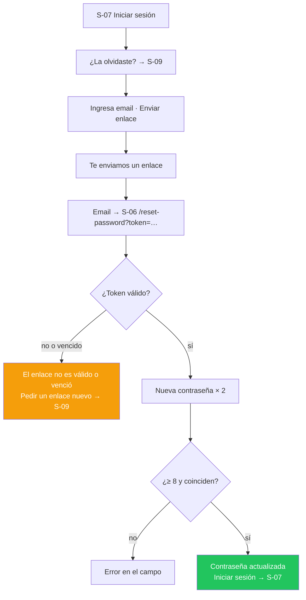

# Story Plan: S-012 (web) - Autenticación en páginas

## Status

**Status:** Completed

## Story Reference

- **Story:** [S-012](../stories/S-012.autenticacion-en-paginas.md)
- **Service:** web
- **Summary:** Reemplaza el modal de autenticación (y las páginas provisorias `/login` y `/register`
  de S-011) por cinco páginas propias con el layout dividido de 1b (`AuthLayout`): iniciar sesión,
  crear cuenta, recuperar contraseña, definir nueva contraseña y completar el nombre tras el primer
  ingreso con Google. Todas vuelven a `next`, traducen los errores por `code`, están en el catálogo
  `es` (neutro) / `en` y funcionan a 375 px.

### Hallazgos del código que condicionan el plan

Relevados al planificar (no están en la documentación, o la contradicen, y cambian cómo se implementa):

1. **El estado del router sobrevive a la recarga.** La story pide pasar la credencial de Google a
   `/complete-profile` "en el estado del router (en memoria, no en `localStorage`)" y, en CA-9, que
   al recargar se redirija a `/login`. Pero `BrowserRouter` guarda `location.state` dentro de
   `window.history.state`, y **el navegador restaura `history.state` al recargar la página**: con la
   implementación ingenua, una recarga de `/complete-profile` seguiría mostrando el formulario con el
   token. → **Decisión D-3.**
2. **El backend SÍ exige nombre único en el alta con Google.** CA-8 dice "El nombre no necesita ser
   único (el backend no lo exige)", pero `api/internal/handlers/google_auth_handler.go:161-177`
   consulta `UsernameExists` y responde `409 USERNAME_ALREADY_EXISTS`, y `docs/apis/api.yaml` lo
   documenta para `POST /api/v1/auth/google/register`. El screen.md de `complete-profile` ya había
   previsto el mensaje ("Ese nombre ya está en uso") como pregunta abierta. → **Decisión D-2.**
3. **El regex de nombre del `UsernameModal` rechaza acentos.** `/^[a-zA-Z0-9_ -]{3,}$/` deja afuera
   "Leo Gómez" o "María", que es justamente lo que Google sugiere en `profile.suggested_name`. El
   backend solo pide `minLength: 2`, `maxLength: 100` y "sin tabulaciones ni saltos de línea".
   → **Decisión D-9.**
4. **`Modal` y `LinkButton` siguen vivos fuera de auth.** `pages/event-detail/EventDetailPage.tsx`
   importa `components/modal/Modal` y `components/link-button/styles.css`;
   `pages/manage-event/ManageEventPage.tsx` usa `link-button/styles.css`. CA-12 solo pide borrar el
   modal `Auth`, `AuthForm`, `ForgotPasswordForm` y `UsernameModal`: **`Modal` y `LinkButton` no se
   tocan** (los retiran las stories de esas pantallas).
5. **`GoogleLoginButton` tiene el texto en inglés embebido** ("Continue with Google") y un
   `aria-label` en español fijo. Se reemplaza por `GoogleButton` con el texto por prop.
6. **No hay endpoint para validar el token de recuperación sin usarlo.** `POST /users/reset-password`
   es el único que conoce `INVALID_RESET_TOKEN` / `EXPIRED_RESET_TOKEN`. Validar el token al abrir la
   página requeriría un endpoint **NOT DOCUMENTED - needs verification**; no se inventa.
   → **Decisión D-4.**
7. **`ResetPasswordPage` actual** muestra `err.message` crudo y, tras el éxito, manda a `/` ("Go to
   home"). La versión nueva traduce por `code` y manda a `/login` (screen.md).
8. **`AuthForm` actual cambia a modo login ante `EMAIL_ALREADY_EXISTS`** y bloquea el envío si el
   chequeo de `/health` falló (`apiAvailable`). Ninguna de las dos cosas sigue: el error de email
   duplicado va en el campo (screen.md) y un fallo de red se informa al enviar. → **Decisión D-10.**
9. **Un login con contraseña incorrecta devuelve `401`**, y `apiRequest` ante cualquier `401` borra
   `telescopio_user` / `telescopio_token` y emite `auth:logout` (ADR-008). En `/login` no hay sesión
   que perder, así que es inocuo; **no agregar manejo especial** (la convención prohíbe manejar el
   401 en componentes).
10. **Las convenciones `auth.md` y `routing.md` del servicio están desactualizadas** (hablan de
    `openAuthModal`, `UsernameModal`, "no hay rutas protegidas"). Lo vigente después de S-011 está en
    el código: `AuthContextType` sin `openAuthModal`, `RequireAuth`, `safeNextPath`. Este plan copia
    el estado real, y la Task 7 actualiza la sección de Google de `auth.md`.

### Decisiones tomadas al planificar

- **D-1 · `/complete-profile` fuera del flujo va a `/login`, no a `/`.** El screen.md y el product-map
  dicen `/`; CA-9 de la story dice `/login`. La story es más reciente y es la que se valida.
- **D-2 · Nombre duplicado en Google = error del campo.** Ante `409 USERNAME_ALREADY_EXISTS`, el campo
  "Nombre" muestra `auth.completeProfile.nameTaken` ("Ese nombre ya está en uso. Prueba con otro.").
  No se agrega validación de unicidad en el cliente. **Avisar a producto:** el texto de CA-8 ("el
  backend no lo exige") es incorrecto.
- **D-3 · El estado del router se usa y se borra al montar.** `/login` y `/register` navegan a
  `/complete-profile` con `state: { googleToken, suggestedName, next }` (como pide la story). La página
  copia ese estado a su `useState` en el primer render y, en un `useEffect` de montaje, hace
  `navigate(location.pathname, { replace: true, state: null })`. Así el token deja de estar en
  `history.state`: una recarga o un acceso directo encuentran `state` vacío y redirigen a `/login`
  (CA-9). Nada se escribe en `localStorage` ni `sessionStorage`.
- **D-4 · Enlace inválido: inmediato si falta el token, al guardar si es inválido o venció.** Sin
  `token` en la URL la página arranca en el estado "El enlace no es válido o venció". Con token, el
  estado se alcanza cuando `resetPassword` responde `INVALID_RESET_TOKEN` o `EXPIRED_RESET_TOKEN`
  (no hay endpoint para validarlo antes, hallazgo 6).
- **D-5 · Las páginas de auth van fuera de `AppLayout`.** El product-map ("Chrome global") dice que
  S-06 a S-10 usan el layout dividido **sin barra de navegación**. Las cinco rutas se declaran como
  hermanas de la ruta de `AppLayout`, cada una envuelta en `AuthLayout`. Consecuencia: en estas
  páginas no hay selector de idioma (ningún screen.md lo incluye); el idioma es el elegido antes o el
  del navegador.
- **D-6 · Errores de la api traducidos por página, con lista de códigos admitidos.** `messageKeyForError`
  traduce cualquier código del catálogo, pero algunos textos son de otro contexto (`CREATION_ERROR` =
  "No pudimos crear **el evento**"). Se agrega `scopedMessageKeyForError(err, codes, fallback)` en
  `src/i18n/errors.ts`: si el `code` está en `codes` → `errors.<code>`; si es error de red
  (`TypeError`) → `errors.network`; en cualquier otro caso → `fallback` (el mensaje propio de la
  página). Ver la tabla de mapeo en "API Context".
- **D-7 · Copy neutro.** Los screen.md tienen voseo; el catálogo usa el español neutro de la tabla
  "Catálogo `auth.*`" (abajo), que incluye los ejemplos de CA-13. Esa tabla es la fuente de verdad del
  texto, no el microcopy de los screen.md.
- **D-8 · Validación del cliente con errores por campo.** Los formularios llevan `noValidate` y se
  validan a mano para mostrar el error en el `TextField` (DS: "error reemplaza a la ayuda",
  `aria-invalid`). Se valida **al enviar** (todos los campos) y **al salir de un campo con contenido**;
  al escribir en un campo con error, el error de ese campo se limpia. Se mantienen `type="email"`,
  `required` y `autoComplete` por semántica.
- **D-9 · Nombre: largo, no juego de caracteres.** `validateDisplayName` exige `trim().length` entre 3
  (story, CA-8) y 100 (backend). Acepta acentos y espacios. Se envía el valor recortado.
- **D-10 · Sin chequeo de `/health` en auth.** Las páginas nuevas no llaman a `ApiHealthService`: si la
  api no responde, el envío muestra `errors.network`.
- **D-11 · Tras definir la contraseña no se inicia sesión sola.** El screen.md lo descarta
  explícitamente ("Iniciar sesión automáticamente tras guardar: el flujo actual no lo hace y el REQ no
  lo pide") aunque UF-04 cierre con "sesión iniciada". Gana el screen.md y CA-6 ("ve … el botón
  'Iniciar sesión'").
- **D-12 · Beneficios ocultos en mobile.** La guía de grid dice "no ocultar información con
  `display:none` en mobile", pero los screen.md lo deciden explícitamente (`hidden_in_viewports:
  mobile`, "a 400px empujaban el formulario fuera de la primera pantalla") y CA-11 lo pide. Gana la
  pantalla.
- **D-13 · Foco.** Foco inicial: login → Email; registro → Nombre completo; recuperar → Email;
  nueva contraseña → Nueva contraseña (o el h1 si arranca en "enlace inválido"); completar perfil →
  Nombre con el texto seleccionado. Error de validación → primer campo con error. Credenciales
  inválidas → campo Contraseña (vaciado). Éxito/enlace inválido en `/reset-password` → h1
  (`tabIndex={-1}`). Éxito en `/forgot-password` → la confirmación (`role="status"`, `tabIndex={-1}`).
  Se usa `ref` + `useEffect`, no `autoFocus`.
- **D-14 · El email viaja a `/forgot-password` por estado del router, no por query.** `<Link
  to="/forgot-password" state={{ email }}>`: así no queda el email en la URL ni en el historial del
  servidor. No es un secreto, así que no se borra del `history.state`.
- **D-15 · Ubicación del código.** `AuthLayout` y `RedirectIfAuthenticated` en
  `src/components/layout/` (prefijo `ly-`, entran solos en las reglas estáticas de S-010). Lo
  específico de auth (`GoogleButton`) en `src/components/auth/google-button/` con prefijo `au-`: se
  agrega la carpeta a las reglas estáticas y el prefijo `au` a TS-9 de `static-rules.test.ts`. Las
  páginas en `src/pages/{login,register,forgot-password,reset-password,complete-profile}/`
  (convención `pages/{kebab-case}/`); `pages/auth-page/` se borra.
- **D-16 · Colores de marca de Google.** El SVG del logo de Google conserva sus `fill` (`#4285F4`,
  `#34A853`, `#FBBC05`, `#EA4335`) en el `.tsx`: son exigencia de la marca de Google, no colores del
  producto. El `.css` del botón usa solo tokens (las reglas estáticas miran solo `.css`).

---

## Architectural Context

### Tech Stack

```
react 19.1.1            react-dom 19.1.1
react-router-dom 7.9.4  @react-oauth/google 0.13.4
react-scripts 5.0.1     typescript 4.9.5 (strict: true)
@testing-library/react 16.3.0     @testing-library/jest-dom 6.6.4
@testing-library/user-event 13.5.0  @testing-library/dom 10.4.1
```

Create React App, **no Next.js**: SPA client-side pura, sin SSR, sin Server Components, sin Server
Actions (ADR-006). Fuentes Plus Jakarta Sans + JetBrains Mono ya cargadas en `public/index.html`.
`src/index.tsx` monta `<App />` dentro de `<React.StrictMode>` (los efectos de montaje corren dos
veces en desarrollo: D-3 debe tolerarlo).

### Service Architecture (convenciones del servicio, estado real tras S-010/S-011)

**Estructura** (`project-structure`): organización por tipo técnico.

```
src/
├── App.tsx                 # AppRoutes (exportada para tests) + providers
├── components/ui/          # primitivos del DS (Button, TextField, Callout, …) — prefijo ui-
├── components/layout/      # chrome global (AppHeader, AppLayout, RequireAuth, …) — prefijo ly-
├── components/events/      # compuestos de dominio — prefijo ev-
├── components/auth/        # NUEVO en esta story: GoogleButton — prefijo au-
├── pages/{kebab-case}/     # pantallas montadas en una ruta
├── context/AuthContext.tsx # sesión
├── domain/                 # lógica pura (redirect, dates, …) + index.ts
├── hooks/                  # hooks propios
├── i18n/                   # I18nProvider, useT, catálogos es/en, errores por code
├── services/api.ts         # servicios por dominio (UserService, GoogleAuthService, …)
├── config/api.ts           # apiRequest, ApiError, endpoints
├── styles/tokens.css       # ÚNICA fuente de tokens del DS v2.0.0
└── test-utils/renderWithProviders.tsx
```

- Carpeta `kebab-case`, componente `PascalCase`, **un componente por carpeta con su CSS al lado**.
- `export default` para el componente; tipos y helpers con export nombrado.
- Props tipadas en una `interface` arriba; `React.FC<Props>`.
- **Nada de `any`** en código nuevo; **nada de `console.log`** (solo `console.error` para errores reales).
- Configuración siempre desde `RUNTIME_CONFIG` (`src/config/runtime.ts`): `{ API_URL, GOOGLE_CLIENT_ID }`.
  `GOOGLE_CLIENT_ID` vacío ⇒ no se muestra el botón de Google.

**Routing** (`routing`, estado actual de `src/App.tsx`):

```tsx
export function AppRoutes(): JSX.Element {
  return (
    <Routes>
      <Route element={<AppLayout />}>
        <Route path="/" element={<HomePage />} />
        <Route path="/events" element={<EventsPage />} />
        <Route path="/events/create" element={<RequireAuth><CreateEventPage /></RequireAuth>} />
        <Route path="/events/:eventId/manage" element={<RequireAuth><ManageEventPage /></RequireAuth>} />
        <Route path="/events/:eventId" element={<EventDetailPageWrapper />} />
        <Route path="/login" element={<AuthPage mode="login" />} />        {/* provisoria S-011 → se reemplaza */}
        <Route path="/register" element={<AuthPage mode="register" />} />  {/* provisoria S-011 → se reemplaza */}
        <Route path="/reset-password" element={<ResetPasswordPage />} />   {/* se mueve fuera de AppLayout */}
        <Route path="*" element={<NotFoundPage />} />
      </Route>
    </Routes>
  );
}
```

- Navegación de usuario con `<Link>`; imperativa con `useNavigate()`; `navigate(to, { replace: true })`
  para redirecciones post-login. Query con `useSearchParams()`; estado con `useLocation().state`.
- `RequireAuth` (S-011): espera `loading === false`; sin `user` → `<Navigate to={loginPathFor(pathname + search)} replace />`.

**Auth** (`auth`, estado actual):

```ts
// src/types/index.ts
export interface AuthContextType {
  user: User | null;
  token: string | null;
  login: (userData: User, token: string) => void;   // persiste en localStorage y sincroniza eventos
  logout: () => void;
  updateUser: (updatedData: Partial<User>) => void;
  joinEvent: (eventId: string) => void;
  isAuthenticated: boolean;
  loading: boolean;                                   // true mientras restaura la sesión al arrancar
}
export interface User { id: string; name: string; email: string; role: …; joinedEventIDs: string[]; createdEventIDs: string[] }
```

- `useAuth()` lanza fuera de `AuthProvider` (en tests: `jest.mock('…/context/AuthContext')` + `renderWithProviders`).
- Almacenamiento: `telescopio_user` (JSON vía `useLocalStorage`) y `telescopio_token` (string crudo). **No tocar.**
- El `401` se maneja globalmente (ADR-008): **no agregar manejo de 401 en componentes**.
- Google, flujo en dos pasos del backend: `GoogleAuthService.verify(token)` → `existing_user` (con JWT)
  o `new_user` (con perfil sugerido); en el segundo caso, `GoogleAuthService.register(token, username)`.

**Formularios** (`forms`): un objeto `formData` con `handleChange` genérico por `name`;
`e.preventDefault()`; `setLoading(false)` en `finally`; botón deshabilitado mientras envía; par
`htmlFor`/`id` (lo resuelve `TextField`). Validación en tres niveles: atributos HTML → manual en el
submit → backend. En esta story, con D-8 (errores por campo, `noValidate`).

**Errores** (`error-handling`, tras S-010/S-011): `apiRequest` lanza `ApiError { status, code?, details }`;
el texto del servidor **nunca** se muestra (`messageKeyForError(err)` → `errors.<code>` | `errors.network`
para `TypeError` | `errors.generic`). `setError` vacío al empezar; `err instanceof …` antes de leer.

**Estilos** (`styling` + ADR-007 enmendado): CSS plano por componente, **solo tokens de
`src/styles/tokens.css`** (sin hex, sin `rgba()`, sin medidas que tengan token), **mobile-first**,
único corte `@media (min-width: 768px)`, nunca `max-width` en `@media`, clases con prefijo del
componente.

**Testing** (`testing`): archivo `.test.tsx` al lado; consultas por rol/label/texto; `userEvent`
(v13: `userEvent.type`, `userEvent.click` síncronos); `findBy*` para lo asíncrono; mockear
`services/api` con `jest.mock` (automock) y la sesión con `jest.mock('…/context/AuthContext')`;
`localStorage.clear()` en `beforeEach`. No sacar el `moduleNameMapper` de `package.json`.

```bash
cd web && CI=true npm test          # una corrida
cd web && npm run typecheck && npm run lint
```

### Relevant ADRs

Los ADRs del producto no tienen sección "Implementation Rules"; se copian la decisión y las reglas
que de ella se derivan.

- **ADR-006: Create React App en lugar de Next.js** — *Decisión:* "Create React App (`react-scripts`
  5.0.1) con react-router-dom 7.9.4. SPA client-side pura: sin SSR, sin file-based routing, sin Server
  Components. Todo el render ocurre en el navegador." → Las páginas son componentes cliente montados
  en `AppRoutes`.
- **ADR-007: CSS plano con variables (enmienda REQ-003)** — reglas verbatim de la enmienda:
  - "**Una sola fuente de tokens:** `web/src/styles/tokens.css`, con los tokens del DS `web` v2.0.0."
  - "**Sin hex literales** en los componentes nuevos."
  - "**Lenguaje visual nuevo:** de glassmorphism oscuro a 'bandas oscuras + contenido claro'."
  - "**Breakpoints como escala nombrada** (`--bp-mobile: 768px` documentado; en `@media` se usa el
    literal) y **mobile-first** en los componentes nuevos."
  - "**Componentes en vez de sistemas de clases:** `web/src/components/ui/` con los primitivos del DS
    (`Button`, `TextField`, `Dialog`, `DataTable`, …) y compuestos de dominio en
    `web/src/components/{dominio}/`."
  - "**Prefijo de clase por componente** para evitar colisiones."
- **ADR-008: Manejo global de expiración de sesión por CustomEvent** — *Decisión:* "Ante un `401`,
  `apiRequest` limpia la sesión de `localStorage` y emite un `CustomEvent` llamado `auth:logout`.
  `AuthContext` registra un listener en `window` y, al recibirlo, actualiza su estado para desloguear
  al usuario sin recargar la página." → No duplicar ese manejo en las páginas; todas las llamadas por
  los servicios de `services/api.ts` (nunca `fetch` directo).
- **ADR-010: i18n propio sobre `Intl`** — *Decisión (verbatim):*
  - "`I18nProvider` (Context) y `useT()`."
  - "Catálogos `es.ts` y `en.ts`; **el tipo de `en` se deriva de `es`**, así una clave faltante no compila."
  - "Interpolación simple (`{name}`) y plurales con `Intl.PluralRules`."
  - "Errores de la api traducidos por `code` (`errors.<code>`), con fallback genérico; nunca se muestra `err.message`."
  - "Verificación: lint contra texto embebido en JSX en las carpetas nuevas y un test que rechaza formas de voseo en el catálogo `es`."

### API Context

Sin cambios de API. Endpoints usados (de `docs/apis/api.yaml`), todos `security: []`, a través de los
servicios existentes de `src/services/api.ts` (no se modifican):

| Servicio (`src/services/api.ts`) | Endpoint | Request body | 2xx | Errores (`code`) |
|---|---|---|---|---|
| `UserService.authenticateUser(email, password): Promise<{ user: User; token: string }>` | `POST /api/v1/users/authenticate` | `{ email, password }` | `200 { message, token, user: UserSummary }` | `400 INVALID_PAYLOAD` · `401 INVALID_CREDENTIALS` (usuario inexistente o password incorrecta) · `401 OAUTH_ACCOUNT_NO_PASSWORD` (cuenta de Google sin password local) · `500 TOKEN_GENERATION_ERROR` |
| `UserService.createUser({ name, email, password }): Promise<{ user: User; token: string }>` | `POST /api/v1/users` | `{ name (2..100), email, password (≥8) }` (`lastname` opcional, no se usa) | `201 { message, token, user: UserSummary }` | `400 INVALID_PAYLOAD`, `INVALID_PASSWORD` · `409 EMAIL_ALREADY_EXISTS` · `500 CREATION_ERROR`, `TOKEN_GENERATION_ERROR` |
| `UserService.forgotPassword(email): Promise<void>` | `POST /api/v1/users/forgot-password` | `{ email }` | `200 { message }` — **también si el email no existe** (anti-enumeración) y si falla el envío del mail | `400 INVALID_PAYLOAD` · `500 TOKEN_GENERATION_ERROR`, `DB_ERROR` |
| `UserService.resetPassword(token, password): Promise<void>` | `POST /api/v1/users/reset-password` | `{ token (64 hex, válido 1 hora), password (≥8) }` | `200 { message }` | `400 INVALID_PAYLOAD`, `INVALID_RESET_TOKEN`, `EXPIRED_RESET_TOKEN`, `INVALID_PASSWORD` · `500 DB_ERROR` |
| `GoogleAuthService.verify(token): Promise<GoogleVerifyResponse>` | `POST /api/v1/auth/google/verify` | `{ token }` (access token de Google, flujo implicit) | `200` polimórfico: `{ status: "existing_user", token, user: { id, email, username } }` **o** `{ status: "new_user", google_token, profile: { email, suggested_name } }` | `400 INVALID_PAYLOAD` · `401 INVALID_GOOGLE_TOKEN` · `500 GOOGLE_API_ERROR`, `INTERNAL_ERROR` |
| `GoogleAuthService.register(token, username): Promise<{ user: User; token: string }>` | `POST /api/v1/auth/google/register` | `{ token, username (2..100, sin tabulaciones ni saltos de línea) }` | `201 { token, user: { id, email, username } }` | `400 INVALID_PAYLOAD` · `401 INVALID_GOOGLE_TOKEN` · `409 USERNAME_ALREADY_EXISTS` · `500 GOOGLE_API_ERROR`, `INTERNAL_ERROR` |

`GoogleVerifyResponse` (`src/services/api.ts`): `{ status: 'existing_user' | 'new_user'; token?: string;
user?: { id: string; email: string; username: string }; profile?: { suggested_name: string; email: string } }`.
`GoogleAuthService.register` ya devuelve `User` mapeado (`name: apiUser.username`, `role: 'participant'`,
`joinedEventIDs: []`, `createdEventIDs: []`). Para `existing_user`, el mapeo a `User` se hace en el hook
(igual que hoy `Auth.tsx`): `{ id: user.id, name: user.username, email: user.email, role: 'participant',
joinedEventIDs: [], createdEventIDs: [] }`.

**Forma de error** (`ApiError` en `src/config/api.ts`): `new ApiError({ status, body })` → `.status`,
`.code` (de `body.code`, o de `body.error` si es forma de middleware), `.details`. En tests:
`new ApiError({ status: 401, body: { error: 'Invalid email or password', code: 'INVALID_CREDENTIALS' } })`.

**Mapeo de errores por página (D-6)** — `scopedMessageKeyForError(err, codes, fallback)`:

| Página / acción | Códigos → `errors.<code>` (Callout) | Códigos que van al **campo** | Estado especial | Fallback (Callout) |
|---|---|---|---|---|
| Login (email) | `INVALID_CREDENTIALS`, `OAUTH_ACCOUNT_NO_PASSWORD`, `INVALID_PAYLOAD` | — | `INVALID_CREDENTIALS` vacía Contraseña | `auth.login.error` |
| Google (login y registro) | `INVALID_GOOGLE_TOKEN`, `GOOGLE_API_ERROR` | — | error del popup de Google → `auth.google.error` | `auth.google.error` |
| Registro | `INVALID_PAYLOAD` | `EMAIL_ALREADY_EXISTS` → Email: `auth.register.emailTaken` · `INVALID_PASSWORD` → Contraseña: `errors.INVALID_PASSWORD` | — | `auth.register.error` (vacía Contraseña) |
| Recuperar | `INVALID_PAYLOAD` | — | — | `auth.forgot.error` |
| Nueva contraseña | — | `INVALID_PASSWORD` → Nueva contraseña: `errors.INVALID_PASSWORD` | `INVALID_RESET_TOKEN`, `EXPIRED_RESET_TOKEN` → estado "enlace inválido" | `auth.reset.error` |
| Completar perfil | `INVALID_GOOGLE_TOKEN`, `GOOGLE_API_ERROR`, `INVALID_PAYLOAD` | `USERNAME_ALREADY_EXISTS` → Nombre: `auth.completeProfile.nameTaken` | — | `auth.completeProfile.error` |

En todos los casos un `TypeError` (red caída) → `errors.network`.

Textos ya existentes en `errors.*` que se usan (catálogo `es`, verbatim):

| Clave | es |
|---|---|
| `errors.INVALID_CREDENTIALS` | El correo o la contraseña no son correctos. |
| `errors.OAUTH_ACCOUNT_NO_PASSWORD` | Esta cuenta usa Google para iniciar sesión. Ingresa con Google. |
| `errors.INVALID_PAYLOAD` | Los datos enviados no son válidos. Revísalos e inténtalo de nuevo. |
| `errors.INVALID_PASSWORD` | La contraseña no cumple los requisitos. Elige una más segura. |
| `errors.INVALID_GOOGLE_TOKEN` | No pudimos validar tu cuenta de Google. Inténtalo de nuevo. |
| `errors.GOOGLE_API_ERROR` | No pudimos conectar con Google. Inténtalo de nuevo en unos minutos. |
| `errors.network` | No pudimos conectar con el servidor. Revisa tu conexión e inténtalo de nuevo. |

### Catálogo `auth.*` (nuevo — fuente de verdad del texto, D-7)

Se agrega el namespace `auth` a `src/i18n/catalogs/es.ts` y `en.ts`. Español neutro (sin voseo, sin
marcas de género); el test de voseo existente lo recorre.

| Clave | es | en |
|---|---|---|
| `auth.layout.backHome` | ← Volver al inicio | ← Back to home |
| `auth.fields.email` | Email | Email |
| `auth.fields.emailPlaceholder` | nombre@correo.com | name@email.com |
| `auth.fields.password` | Contraseña | Password |
| `auth.fields.passwordPlaceholder` | Tu contraseña | Your password |
| `auth.fields.passwordRule` | Al menos 8 caracteres. | At least 8 characters. |
| `auth.fields.newPasswordPlaceholder` | Al menos 8 caracteres | At least 8 characters |
| `auth.fields.showPassword` | Mostrar | Show |
| `auth.fields.hidePassword` | Ocultar | Hide |
| `auth.fields.fullName` | Nombre completo | Full name |
| `auth.fields.fullNamePlaceholder` | Tu nombre | Your name |
| `auth.google.continue` | Continuar con Google | Continue with Google |
| `auth.google.separator` | o con tu email | or with your email |
| `auth.google.error` | No pudimos conectarte con Google. Inténtalo de nuevo. | We couldn't connect you with Google. Please try again. |
| `auth.validation.emailInvalid` | Ingresa un email válido. | Enter a valid email. |
| `auth.validation.passwordRequired` | Ingresa tu contraseña. | Enter your password. |
| `auth.validation.nameRequired` | Ingresa tu nombre. | Enter your name. |
| `auth.validation.passwordMin` | Usa al menos 8 caracteres. | Use at least 8 characters. |
| `auth.validation.passwordMismatch` | Las contraseñas no coinciden. | The passwords don't match. |
| `auth.validation.nameMin` | Usa al menos 3 caracteres. | Use at least 3 characters. |
| `auth.validation.nameMax` | Usa como máximo 100 caracteres. | Use at most 100 characters. |
| `auth.login.brandTitle` | Vuelve a donde dejaste tus eventos. | Pick up where you left your events. |
| `auth.login.brandTitleNext` | Inicia sesión para continuar. | Log in to continue. |
| `auth.login.benefitFollow` | Sigue el estado de los eventos donde participas | Follow the status of the events you take part in |
| `auth.login.benefitSubmit` | Sube tu propuesta y vota cuando te toque | Upload your proposal and vote when it's your turn |
| `auth.login.benefitResults` | Consulta los rankings finales completos | See the full final rankings |
| `auth.login.title` | Iniciar sesión | Log in |
| `auth.login.noAccount` | ¿No tienes cuenta? | Don't have an account? |
| `auth.login.createOne` | Crea una gratis | Create one for free |
| `auth.login.forgot` | ¿La olvidaste? | Forgot it? |
| `auth.login.submit` | Iniciar sesión | Log in |
| `auth.login.submitting` | Iniciando sesión… | Logging in… |
| `auth.login.error` | No pudimos iniciar sesión. Inténtalo de nuevo. | We couldn't log you in. Please try again. |
| `auth.register.brandTitle` | Participa en eventos donde la comunidad decide. | Join events where the community decides. |
| `auth.register.benefitJoin` | Inscríbete y sube tu propuesta | Sign up and upload your proposal |
| `auth.register.benefitEvaluate` | Evalúa a otros participantes | Review other participants |
| `auth.register.benefitCreate` | Crea tus propios eventos | Create your own events |
| `auth.register.title` | Crear cuenta | Sign up |
| `auth.register.haveAccount` | ¿Ya tienes cuenta? | Already have an account? |
| `auth.register.login` | Inicia sesión | Log in |
| `auth.register.submit` | Crear cuenta | Create account |
| `auth.register.submitting` | Creando cuenta… | Creating account… |
| `auth.register.emailTaken` | Ya hay una cuenta con este email. Inicia sesión o recupera tu contraseña. | There's already an account with this email. Log in or recover your password. |
| `auth.register.error` | No pudimos crear tu cuenta. Inténtalo de nuevo. | We couldn't create your account. Please try again. |
| `auth.forgot.brandTitle` | Recupera el acceso a tus eventos. | Get back into your events. |
| `auth.forgot.backToLogin` | ← Volver a iniciar sesión | ← Back to log in |
| `auth.forgot.title` | Recuperar contraseña | Recover password |
| `auth.forgot.explanation` | Te enviaremos un enlace para definir una contraseña nueva. Si te inscribiste en un evento con un enlace y nunca creaste una contraseña, usa esta opción para crearla. | We'll send you a link to set a new password. If you joined an event through a link and never created a password, use this option to create one. |
| `auth.forgot.submit` | Enviar enlace | Send link |
| `auth.forgot.submitting` | Enviando… | Sending… |
| `auth.forgot.sentTitle` | Revisa tu email | Check your email |
| `auth.forgot.sentBody` | Si hay una cuenta con {email}, te enviamos un enlace. Vence en 1 hora. Revisa también la carpeta de spam. | If there's an account for {email}, we've sent you a link. It expires in 1 hour. Check your spam folder too. |
| `auth.forgot.error` | No pudimos enviar el enlace. Inténtalo de nuevo. | We couldn't send the link. Please try again. |
| `auth.reset.brandTitle` | Un paso más y vuelves a tus eventos. | One more step and you're back to your events. |
| `auth.reset.title` | Define tu nueva contraseña | Set your new password |
| `auth.reset.newPassword` | Nueva contraseña | New password |
| `auth.reset.repeatPassword` | Repite la contraseña | Repeat the password |
| `auth.reset.submit` | Guardar contraseña | Save password |
| `auth.reset.submitting` | Guardando… | Saving… |
| `auth.reset.error` | No pudimos guardar la contraseña. Inténtalo de nuevo. | We couldn't save the password. Please try again. |
| `auth.reset.successTitle` | Contraseña actualizada | Password updated |
| `auth.reset.successBody` | Ya puedes iniciar sesión con tu nueva contraseña. | You can now log in with your new password. |
| `auth.reset.goToLogin` | Iniciar sesión | Log in |
| `auth.reset.invalidTitle` | El enlace no es válido o venció | The link is invalid or has expired |
| `auth.reset.invalidBody` | Los enlaces de recuperación vencen en 1 hora y sirven una sola vez. Pide uno nuevo. | Recovery links expire in 1 hour and work only once. Request a new one. |
| `auth.reset.requestNew` | Pedir un enlace nuevo | Request a new link |
| `auth.completeProfile.brandTitle` | Ya casi estás. | You're almost there. |
| `auth.completeProfile.title` | Elige tu nombre | Choose your name |
| `auth.completeProfile.explanation` | Es el nombre que ven los organizadores y el que aparece en los resultados de los eventos. | It's the name organizers see and the one shown in event results. |
| `auth.completeProfile.name` | Nombre | Name |
| `auth.completeProfile.namePlaceholder` | Al menos 3 caracteres | At least 3 characters |
| `auth.completeProfile.submit` | Continuar | Continue |
| `auth.completeProfile.submitting` | Guardando… | Saving… |
| `auth.completeProfile.nameTaken` | Ese nombre ya está en uso. Prueba con otro. | That name is already taken. Try another one. |
| `auth.completeProfile.error` | No pudimos guardar tu nombre. Inténtalo de nuevo. | We couldn't save your name. Please try again. |

### Database Context

Ninguno: la story no toca base de datos.

### Flow Context

La story declara "Flujos Afectados: Ninguno a nivel de sistema". El flujo de interacción propio de la
story (verbatim de S-012):

> **Escenario: Primer ingreso con Google (CA-8, CA-9)**
>
> **Trigger:** usuario nuevo toca "Continuar con Google" en `/login?next=/events/abc`.
>
> 1. **[web — `login`]** recibe la credencial de Google; el backend indica que el usuario no existe.
> 2. **[web]** navega a `/complete-profile` pasando la credencial y `next` en el estado del router
>    (en memoria, no en `localStorage`).
> 3. **[web — `complete-profile`]** el usuario confirma el nombre →
>    `GoogleAuthService.register(googleToken, username)`.
> 4. **[web]** guarda la sesión como hoy y navega a `/events/abc`.
>
> **Outcome:** cuenta creada con el nombre elegido y el usuario en la pantalla que pidió.
>
> **Manejo de errores:**
> - Sin estado del router (recarga o acceso directo) → `/login`.
> - Error de la api → `Callout` de error con `t('errors.<code>')` y el botón habilitado de nuevo.

Ajuste del plan al paso 2: el estado del router se borra de `history.state` al montar
`/complete-profile` (D-3). Ajuste al manejo de errores: mapeo por página (D-6) y
`USERNAME_ALREADY_EXISTS` al campo (D-2).

### Integration Points

- **Google Identity** vía `@react-oauth/google` 0.13.4. `GoogleOAuthProvider` ya envuelve la app en
  `App.tsx` con `RUNTIME_CONFIG.GOOGLE_CLIENT_ID`. El botón usa
  `useGoogleLogin({ flow: 'implicit', onSuccess: (tokenResponse) => …tokenResponse.access_token…, onError })`
  y dispara el popup con la función que devuelve el hook. `tokenResponse.access_token` vacío ⇒ error.
  Ese access token es el `token` que reciben `verify` y `register`.
- **En tests:** `jest.mock('@react-oauth/google', () => ({ useGoogleLogin: (opts) => () => mockGoogleLogin(opts) }))`,
  donde el test llama `opts.onSuccess({ access_token: 'g-access-token' })` u `opts.onError()`; y
  `jest.mock('../../config/runtime', () => ({ RUNTIME_CONFIG: { API_URL: 'http://localhost:8080', GOOGLE_CLIENT_ID: 'test-client' } }))`
  (con `GOOGLE_CLIENT_ID: ''` para el caso sin Google).
- Sin colas ni otros servicios internos.

### Code Conventions

- Archivos: `src/pages/login/LoginPage.tsx` + `LoginPage.css` + `LoginPage.test.tsx` (idem `register`,
  `forgot-password`, `complete-profile`; `reset-password` se reescribe en su carpeta actual).
- Clases CSS: `ly-auth*` (AuthLayout), `au-google*` (GoogleButton), `au-{pagina}*` en las páginas si
  hacen falta (p. ej. `au-login__forgot`). Solo tokens.
- Todo el texto visible por `t('auth.…')` / `t('errors.…')`: las carpetas nuevas entran en la regla
  `react/jsx-no-literals` (override de `eslintConfig` y script `lint` de `package.json`).
- Lógica pura (validaciones) en `src/domain/auth.ts`, reexportada en `src/domain/index.ts`.

### Reusable Code

**Componentes** (re-exportados en `src/components/ui/index.ts`):

- **Button** (`src/components/ui/button/Button.tsx`) — props `variant: 'primary'|'secondary'|'tertiary'|'onBand'|'icon'`,
  `size: 'sm'|'md'|'lg'`, `loading`, `loadingLabel`, `disabled`, `iconStart`, `iconEnd`, `fullWidth`,
  `type: 'button'|'submit'`, `onClick`, más atributos nativos (`className`, `aria-*`). En `loading`:
  muestra `loadingLabel`, `aria-busy="true"` y queda `disabled`. `forwardRef`.
  ```tsx
  <Button type="submit" size="lg" fullWidth loading={submitting} loadingLabel={t('auth.login.submitting')}>
    {t('auth.login.submit')}
  </Button>
  ```
- **TextField** (`src/components/ui/text-field/TextField.tsx`) — `forwardRef<HTMLInputElement|HTMLTextAreaElement>`.
  Props: `type: 'text'|'email'|'password'`, `label`, `required`, `help`, `error`, `maxLength`,
  `size: 'md'|'lg'`, `value`, `onChange`, `onBlur`, `showPasswordLabel`, `hidePasswordLabel`, `name`,
  `id`, `placeholder`, `autoComplete`, `disabled`. Con `type="password"` + los dos labels renderiza el
  botón "Mostrar"/"Ocultar" con `aria-pressed`. `error` reemplaza a `help`, pone `aria-invalid="true"`
  y lo enlaza por `aria-describedby`.
  ```tsx
  <TextField ref={passwordRef} type="password" name="password" size="lg" label={t('auth.fields.password')}
    placeholder={t('auth.fields.passwordPlaceholder')} showPasswordLabel={t('auth.fields.showPassword')}
    hidePasswordLabel={t('auth.fields.hidePassword')} autoComplete="current-password" required
    value={formData.password} onChange={handleChange} onBlur={handleBlur} error={fieldErrors.password && t(fieldErrors.password)} />
  ```
- **Callout** (`src/components/ui/callout/Callout.tsx`) — `tone: 'info'|'warning'|'error'|'success'`,
  `title`, `id`, `action`, `children`. `tone="error"` ⇒ `role="alert"`.
  ```tsx
  {formError && <Callout tone="error">{t(formError)}</Callout>}
  ```
- **Icons** (`src/components/ui/icons/Icons.tsx`) — `CheckIcon` (beneficios), `CloseIcon`, `DotIcon`, …
- **RequireAuth** (`src/components/layout/require-auth/RequireAuth.tsx`) — modelo para
  `RedirectIfAuthenticated` (espera `loading`, `<Navigate replace />`).
- **AppLayout** (`src/components/layout/app-layout/AppLayout.tsx`) — chrome global; las páginas de auth
  quedan **fuera** (D-5).

**Utils:**

- **domain/redirect** (`src/domain/redirect.ts`):
  ```ts
  safeNextPath(raw: string | null | undefined): string   // solo rutas internas; default '/events'
  loginPathFor(path: string): string                       // `/login?next=${encodeURIComponent(path)}`
  ```
- **i18n** (`src/i18n/index.ts`): `useT()` → `{ t(key, params?), locale, setLocale, fmt }`;
  `messageKeyForError(err): TranslationKey`; tipo `TranslationKey` (claves hoja del catálogo `es`).
- **ApiError / getErrorCode** (`src/config/api.ts`).

**Hooks:** `useT` (i18n), `useAuth` (`src/context/AuthContext.tsx`).

**Test utils** (`src/test-utils/renderWithProviders.tsx`):
```ts
renderWithProviders(ui, { locale?: 'es'|'en', auth?: Partial<AuthContextType>, route?: string })
  // I18nProvider + MemoryRouter(initialEntries=[route]) + <LocationDisplay /> (data-testid="location", pathname+search)
  // devuelve también `auth` (el valor mockeado de useAuth: login/logout son jest.fn())
sampleUser: User  // { id: 'u-1', name: 'Ana Pérez', email: 'ana@example.com', role: 'participant', joinedEventIDs: [], createdEventIDs: [] }
LocationDisplay, buildAuth
```
Para probar `location.state` y entradas con estado, la Task 2 agrega a `renderWithProviders` la opción
`initialEntry?: { pathname: string; search?: string; state?: unknown }` (alternativa a `route`) y a
`LocationDisplay` un `<div data-testid="location-state">{JSON.stringify(location.state ?? null)}</div>`.

**Estilos:** `src/styles/tokens.css` — semánticos usados: `--bg-band`, `--bg-surface`, `--bg-canvas`,
`--text-inverse`, `--text-inverse-secondary`, `--text-signal`, `--text-primary`, `--text-secondary`,
`--text-action`, `--border-default`, `--focus-ring`, `--space-stack-sm|md|lg`, `--space-inline-sm|md`,
`--space-padding-compact|default|spacious`, `--type-heading-l`, `--type-heading-m`, `--type-body`,
`--type-ui`, `--type-caption`, `--type-eyebrow`, `--radius-control`, `--radius-field`,
`--button-secondary-*`. (Lista completa en "Design System Context".)


### Wireframes / Screens

**Superficie:** `web` · **Plataforma:** `web` · **Viewports de la superficie:** `desktop` (≥ 768px,
frame 1200px) y `mobile` (base, frame 400px; CA-11 verifica a 375px). Cada pantalla tiene que cumplir
los dos layouts. **Breakpoint** (DS `grid.md`): `bp.desktop = 768px`, siempre
`@media (min-width: 768px)`.

**Pantallas que toca la story:**

| Pantalla | Ruta | Archivo en el servicio |
|---|---|---|
| S-07 Iniciar sesión | `/login` | `src/pages/login/LoginPage.tsx` |
| S-08 Crear cuenta | `/register` | `src/pages/register/RegisterPage.tsx` |
| S-09 Recuperar contraseña | `/forgot-password` | `src/pages/forgot-password/ForgotPasswordPage.tsx` |
| S-06 Nueva contraseña | `/reset-password` | `src/pages/reset-password/ResetPasswordPage.tsx` (reescrita) |
| S-10 Completar perfil | `/complete-profile` | `src/pages/complete-profile/CompleteProfilePage.tsx` |

> **El microcopy de abajo tiene voseo** (copiado verbatim de los screen.md). El texto que se
> implementa es el de la tabla "Catálogo `auth.*`" (D-7). También prevalecen sobre los screen.md las
> decisiones D-1 (`/complete-profile` fuera del flujo → `/login`) y D-2 (nombre duplicado).

#### Contexto de navegación de la superficie (product-map, verbatim)

###### Chrome global

Presente en todas las pantallas salvo las de auth (S-06 a S-10), que usan el layout dividido sin
barra de navegación.

| Elemento | Sin sesión | Con sesión | Destino |
|---|---|---|---|
| Logo `TELESCOPIO` | ✓ | ✓ | `/` |
| `Inicio` | ✓ | ✓ | `/` |
| `Eventos` | ✓ | ✓ | `/events` |
| `Cómo funciona` | ✓ | ✓ | `/#como-funciona` (sección de S-01) |
| Selector de idioma `ES / EN` | ✓ en la barra | dentro del menú de usuario | cambia el idioma sin recargar |
| `Iniciar sesión` / `Crear cuenta` | ✓ | — | S-07 / S-08 |
| Campana con contador | — | ✓ | desktop: abre O-13 · mobile: navega a S-12 |
| Menú de usuario (iniciales + nombre) | — | ✓ | `Mis eventos`, `Idioma`, `Notificaciones`, `Cerrar sesión` |

En `mobile` las entradas de navegación (`Inicio`, `Eventos`, `Cómo funciona`) pasan a un menú
desplegable; la campana y el avatar quedan visibles en la barra. `[fuente: REQ-003 RF 9, AC 6]`

###### Rutas y acceso

| Ruta | Acceso | Sin acceso |
|---|---|---|
| `/`, `/events`, `/events/:id`, `/login`, `/register`, `/forgot-password`, `/reset-password`, `*` | Público | — |
| `/complete-profile` | Flujo Google | redirige a `/` |
| `/events/create`, `/my-events`, `/notifications` | Con sesión | `/login?next=<ruta>` (AC 33) |
| `/events/:id/manage` | Con sesión + autor | sin sesión → `/login?next=…`; no autor → estado "sin permiso" en S-05 (AC 32) |

**Inventario de Overlays:** ninguna de las cinco pantallas dispara overlays. Del product-map: "O-02
Auth, O-03 Completar nombre, O-04 Recuperar contraseña — pasan a ser las páginas S-07 a S-10 (REQ-003
RF 10)."

#### Flujo de usuario relevante (user-flows, verbatim)

###### UF-04 — Recuperar (u obtener) el acceso

**Audiencia:** participante · **Resuelve:** habilitador de todos los JTBD
**Pantallas:** S-07 → S-09 → email → S-06 → S-07



**Por qué es crítico:** quien se inscribió por un link puede no tener contraseña; para esa persona
este flujo es la forma de obtenerla. S-09 lo dice explícitamente.

###### Caminos no felices

| Situación | Qué ve el usuario |
|---|---|
| Token ausente, inválido o vencido | "El enlace no es válido o venció." + "Pedir un enlace nuevo" (ya no es un callejón sin salida) |
| Contraseñas distintas | "Las contraseñas no coinciden." |
| Menos de 8 caracteres | "Usá al menos 8 caracteres." |
| Email inexistente en S-09 | El mismo mensaje de éxito (no revela si la cuenta existe) |

**Estado final:** contraseña definida y sesión iniciada.

Extracto de UF-01 (Del link compartible a la propuesta entregada) que pasa por S-07/S-08:

> 2. Toca "Inscribirme al evento". Sin sesión pasa por S-07 y vuelve al mismo evento.
>
> **Criterio de éxito:** la entrega se completa sin salir de S-04 y sin perder el evento al pasar por
> el login (AC 12, 13, 33).

No hay flujos cross-surface (el producto tiene una sola superficie).

#### S-07 · `login.md` (verbatim)

##### Pantalla: Iniciar sesión (S-07)

###### Identidad

- **Audiencia primaria (co-primary):** [participante](../../../audiences/participante/research-context.md), [organizador](../../../audiences/organizador/research-context.md).
- **JTBD / Propósito:** entrar y volver exactamente a donde estaba (el evento que quería, la gestión, crear evento). Cubre REQ-003 RF 10, AC 7 y AC 33 (diseño 1b).
- **Viewports:**
  - **desktop** — layout dividido: marca y beneficios a la izquierda (5/12), formulario claro a la derecha (7/12).
  - **mobile** — la marca se reduce a una franja con el logo y el título; el formulario ocupa el ancho.

###### Entrada y salida

**Entradas:**
- Header · "Iniciar sesión". Cualquier acción que pide sesión (`?next=<ruta>`): inscribirse, crear evento, Mis eventos, gestión, notificaciones. S-06 · "Iniciar sesión" tras definir la contraseña.

**Salidas user-driven:**
- A S-08 · "Creá una gratis". A S-09 · "¿La olvidaste?". A S-01 · "← Volver al inicio".

**Salidas automáticas:**
- A `next` (o `/events` si no hay) tras iniciar sesión.
- A S-10 si entra con Google por primera vez y falta el nombre.

###### Estructura

| # | Nombre | Tipo | Variant/Level/State | Categoría | Viewports | Visibilidad | Propósito |
|---|--------|------|---------------------|-----------|-----------|-------------|-----------|
| 1 | Panel de marca | section | — | layout | ambos | viewport_overrides: mobile→franja con logo y título | AuthLayout: identidad |
| 2 | Título de marca | heading | h2 | content | ambos | — | Mensaje de bienvenida |
| 3 | Beneficios | list | — | content | ambos | hidden_in_viewports: mobile | Qué se puede hacer con cuenta |
| 4 | Volver al inicio | link | — | navigation | ambos | — | ← Volver al inicio |
| 5 | Título | heading | h1 | content | ambos | — | "Iniciar sesión" |
| 6 | Link registro | link | — | navigation | ambos | — | ¿No tenés cuenta? |
| 7 | Botón Google | button | secondary | input | ambos | — | Continuar con Google |
| 8 | Separador | label | — | content | ambos | — | "o con tu email" |
| 9 | Campo email | text-input | default | input | ambos | — | Email |
| 10 | Campo contraseña | text-input | default | input | ambos | — | Contraseña con "Mostrar" |
| 11 | Link olvido | link | — | navigation | ambos | — | ¿La olvidaste? |
| 12 | Error de login | alert | error | feedback | ambos | visible_only_in_states: error de validación, error de sistema / sin conexión | Credenciales o sistema |
| 13 | Botón iniciar sesión | button | primary | input | ambos | state_overrides: loading→disabled | Enviar |

###### Layout por viewport

###### desktop · 1200px
- row `auth`
  - col 5/12: Panel de marca, Título de marca, Beneficios
  - col 7/12: Volver al inicio, Título, Link registro, Botón Google, Separador, Campo email, Campo contraseña, Link olvido, Error de login, Botón iniciar sesión

###### mobile · 400px
- Panel de marca
- Título de marca
- Volver al inicio
- Título
- Link registro
- Botón Google
- Separador
- Campo email
- Campo contraseña
- Link olvido
- Error de login
- Botón iniciar sesión

###### Contenido

###### Panel de marca
- Texto/label: "TELESCOPIO"

###### Título de marca
- Texto/label: "Volvé a donde dejaste tus eventos."

###### Beneficios
- Texto/label: "✓ Seguí el estado de los eventos donde participás · ✓ Subí tu propuesta y votá cuando te toque · ✓ Consultá rankings finales completos"
- Icono: check

###### Volver al inicio
- Texto/label: "← Volver al inicio"

###### Título
- Texto/label: "Iniciar sesión"

###### Link registro
- Texto/label: "¿No tenés cuenta? Creá una gratis"

###### Botón Google
- Texto/label: "Continuar con Google"

###### Separador
- Texto/label: "o con tu email"

###### Campo email
- Texto/label: "Email" · placeholder "nombre@correo.com"

###### Campo contraseña
- Texto/label: "Contraseña" · placeholder "Tu contraseña" · acción "Mostrar" / "Ocultar"

###### Link olvido
- Texto/label: "¿La olvidaste?"
- Annotation: junto al campo contraseña (1b). Lleva el email cargado a S-09.

###### Error de login
- Texto/label: "El email o la contraseña no son correctos." / "No pudimos iniciar sesión. Probá de nuevo." / "No pudimos conectarte con Google. Probá de nuevo."

###### Botón iniciar sesión
- Texto/label: "Iniciar sesión"

###### Estados

###### default
- Aplica: Sí
- Mensaje: —
- Cambios: ninguno. Si viene con `next`, Título de marca pasa a "Iniciá sesión para continuar."

###### empty
- Aplica: No — formulario.

###### loading
- Aplica: Sí
- Mensaje: "Iniciando sesión…"
- Cambios: Botón iniciar sesión variant=disabled con el texto de carga; Botón Google disabled.

###### error de validación
- Aplica: Sí
- Mensaje: "El email o la contraseña no son correctos."
- Cambios: Error de login visible; Campo contraseña se vacía; Campo email conserva el valor. Email con formato inválido: Campo email state=error "Ingresá un email válido."

###### error de sistema / sin conexión
- Aplica: Sí
- Mensaje: "No pudimos iniciar sesión. Probá de nuevo."
- Cambios: Error de login visible; campos conservan el valor.

###### success
- Aplica: No — el éxito navega a `next`.

###### not found
- Aplica: No.

###### estado terminal / readonly
- Aplica: No. Con sesión ya iniciada, `/login` redirige a `/events`.

###### Interacciones

**Eventos:**
- Botón iniciar sesión · on submit → autentica → navega a `next` o `/events`.
- Botón Google · on click → OAuth → si es usuario nuevo sin nombre, S-10; si no, `next`.
- Link registro · on click → `/register` (conserva `next`).
- Link olvido · on click → `/forgot-password`.
- "Mostrar" · on click → alterna la visibilidad de la contraseña.

**Validaciones:**
- Campo email · vacío o formato inválido → "Ingresá un email válido."
- Campo contraseña · vacía → "Ingresá tu contraseña."

**Feedback:** redirect a `next`; la pantalla de destino ya se ve con sesión.

###### Accesibilidad

- **Orden de foco:** Volver al inicio → Link registro → Botón Google → Campo email → Campo contraseña → "Mostrar" → Link olvido → Botón iniciar sesión.
- **Landmarks y jerarquía:** main con dos regiones (marca `aside`, formulario). h1 = Título; el Título de marca es h2.
- **Foco y teclado:** el foco inicial va a Campo email. Enter envía el formulario.
- **Propio de esta composición:** Error de login se anuncia como alerta y el foco vuelve al primer campo con error.

###### Decisiones y descartes

**Decisiones tomadas:**
- Página en vez de modal (REQ-003 RF 10, 1b): el login es destino de `next` y necesita una URL.
- Layout dividido marca / formulario, compartido con S-06, S-08, S-09, S-10 (AuthLayout).
- "¿La olvidaste?" junto al campo donde se necesita (1b).
- En mobile se ocultan los beneficios: a 400px empujaban el formulario fuera de la primera pantalla.

**Alternativas descartadas:**
- Banner "Proyecto demo · los datos pueden reiniciarse": solo si existe una configuración de entorno demo (REQ-003 agregados); no se especifica acá.

**Preguntas abiertas:** ninguna.

#### S-08 · `register.md` (verbatim)

##### Pantalla: Crear cuenta (S-08)

###### Identidad

- **Audiencia primaria (co-primary):** [participante](../../../audiences/participante/research-context.md), [organizador](../../../audiences/organizador/research-context.md).
- **JTBD / Propósito:** crear la cuenta en un paso y seguir con lo que estaba haciendo (inscribirse, crear un evento). Cubre REQ-003 RF 10, AC 7. Derivada de 1b (no tiene diseño propio).
- **Viewports:**
  - **desktop** — layout dividido igual que S-07.
  - **mobile** — franja de marca compacta arriba y formulario a ancho completo.

###### Entrada y salida

**Entradas:**
- Header · "Crear cuenta". S-07 · "Creá una gratis". S-02 / S-04 · "Crear cuenta gratis" / "Crear cuenta".

**Salidas user-driven:**
- A S-07 · "¿Ya tenés cuenta? Iniciá sesión". A S-01 · "← Volver al inicio".

**Salidas automáticas:**
- A `next` (o `/events`) con la sesión iniciada tras crear la cuenta.
- A S-10 si entra con Google por primera vez y falta el nombre.

###### Estructura

| # | Nombre | Tipo | Variant/Level/State | Categoría | Viewports | Visibilidad | Propósito |
|---|--------|------|---------------------|-----------|-----------|-------------|-----------|
| 1 | Panel de marca | section | — | layout | ambos | viewport_overrides: mobile→franja con logo y título | AuthLayout |
| 2 | Título de marca | heading | h2 | content | ambos | — | Mensaje |
| 3 | Beneficios | list | — | content | ambos | hidden_in_viewports: mobile | Qué permite la cuenta |
| 4 | Volver al inicio | link | — | navigation | ambos | — | ← Volver al inicio |
| 5 | Título | heading | h1 | content | ambos | — | "Crear cuenta" |
| 6 | Link login | link | — | navigation | ambos | — | ¿Ya tenés cuenta? |
| 7 | Botón Google | button | secondary | input | ambos | — | Continuar con Google |
| 8 | Separador | label | — | content | ambos | — | "o con tu email" |
| 9 | Campo nombre | text-input | default | input | ambos | — | Nombre completo |
| 10 | Campo email | text-input | default | input | ambos | — | Email |
| 11 | Campo contraseña | text-input | default | input | ambos | — | Contraseña ≥ 8 |
| 12 | Error de registro | alert | error | feedback | ambos | visible_only_in_states: error de sistema / sin conexión | Falla del alta |
| 13 | Botón crear cuenta | button | primary | input | ambos | state_overrides: loading→disabled | Enviar |

###### Layout por viewport

###### desktop · 1200px
- row `auth`
  - col 5/12: Panel de marca, Título de marca, Beneficios
  - col 7/12: Volver al inicio, Título, Link login, Botón Google, Separador, Campo nombre, Campo email, Campo contraseña, Error de registro, Botón crear cuenta

###### mobile · 400px
- Panel de marca
- Título de marca
- Volver al inicio
- Título
- Link login
- Botón Google
- Separador
- Campo nombre
- Campo email
- Campo contraseña
- Error de registro
- Botón crear cuenta

###### Contenido

###### Panel de marca
- Texto/label: "TELESCOPIO"

###### Título de marca
- Texto/label: "Participá en eventos donde la comunidad decide."

###### Beneficios
- Texto/label: "✓ Inscribite y subí tu propuesta · ✓ Evaluá a otros participantes · ✓ Creá tus propios eventos"
- Icono: check

###### Volver al inicio
- Texto/label: "← Volver al inicio"

###### Título
- Texto/label: "Crear cuenta"

###### Link login
- Texto/label: "¿Ya tenés cuenta? Iniciá sesión"

###### Botón Google
- Texto/label: "Continuar con Google"

###### Separador
- Texto/label: "o con tu email"

###### Campo nombre
- Texto/label: "Nombre completo" · placeholder "Tu nombre"

###### Campo email
- Texto/label: "Email" · placeholder "nombre@correo.com"

###### Campo contraseña
- Texto/label: "Contraseña" · placeholder "Al menos 8 caracteres" · acción "Mostrar" / "Ocultar"

###### Error de registro
- Texto/label: "No pudimos crear tu cuenta. Probá de nuevo."

###### Botón crear cuenta
- Texto/label: "Crear cuenta"

###### Estados

###### default
- Aplica: Sí
- Mensaje: —
- Cambios: ninguno.

###### empty
- Aplica: No.

###### loading
- Aplica: Sí
- Mensaje: "Creando cuenta…"
- Cambios: Botón crear cuenta variant=disabled con el texto de carga; Botón Google disabled.

###### error de validación
- Aplica: Sí
- Mensaje: según el campo (ver Validaciones)
- Cambios: campo state=error con su mensaje. Email ya registrado: Campo email state=error "Ya hay una cuenta con este email. Iniciá sesión o recuperá tu contraseña."

###### error de sistema / sin conexión
- Aplica: Sí
- Mensaje: "No pudimos crear tu cuenta. Probá de nuevo."
- Cambios: Error de registro visible; los campos conservan el valor salvo la contraseña.

###### success
- Aplica: No — navega a `next` con la sesión iniciada.

###### not found
- Aplica: No.

###### estado terminal / readonly
- Aplica: No. Con sesión iniciada redirige a `/events`.

###### Interacciones

**Eventos:**
- Botón crear cuenta · on submit → crea la cuenta, inicia sesión y navega a `next` o `/events`.
- Botón Google · on click → OAuth (igual que S-07).
- Link login · on click → `/login` (conserva `next`).

**Validaciones:**
- Campo nombre · vacío → "Ingresá tu nombre."
- Campo email · formato inválido → "Ingresá un email válido."
- Campo contraseña · < 8 caracteres → "Usá al menos 8 caracteres."

**Feedback:** redirect a `next`.

###### Accesibilidad

- **Orden de foco:** Volver al inicio → Link login → Botón Google → Campo nombre → Campo email → Campo contraseña → Botón crear cuenta.
- **Landmarks y jerarquía:** igual que S-07. h1 = Título.
- **Foco y teclado:** foco inicial en Campo nombre.
- **Propio de esta composición:** la regla de 8 caracteres se asocia al campo como descripción (no solo como placeholder).

###### Decisiones y descartes

**Decisiones tomadas:**
- Página con el layout de 1b (REQ-003 RF 10, clarificaciones: "Páginas con el estilo de 1b").
- Mismos campos que el registro actual (nombre completo, email, contraseña ≥ 8): el REQ no cambia el alta.
- El link de error de email duplicado ofrece las dos salidas para quien se inscribió por link sin contraseña (UF-04).

**Alternativas descartadas:**
- Confirmar contraseña en el registro: no existe hoy; "Mostrar" cubre el error de tipeo.

**Preguntas abiertas:** ninguna.

#### S-09 · `forgot-password.md` (verbatim)

##### Pantalla: Recuperar contraseña (S-09)

###### Identidad

- **Audiencia primaria (co-primary):** [participante](../../../audiences/participante/research-context.md), [organizador](../../../audiences/organizador/research-context.md).
- **JTBD / Propósito:** pedir el enlace para definir una contraseña nueva — o la primera, si se inscribió por link sin tenerla. Cubre REQ-003 RF 10 y UF-04. Derivada de 1b.
- **Viewports:**
  - **desktop** — layout dividido igual que S-07.
  - **mobile** — franja de marca compacta y formulario a ancho completo.

###### Entrada y salida

**Entradas:**
- S-07 · "¿La olvidaste?". S-06 · "Pedir un enlace nuevo".

**Salidas user-driven:**
- A S-07 · "← Volver a iniciar sesión".

**Salidas automáticas:** ninguna (el enlace llega por email a S-06).

###### Estructura

| # | Nombre | Tipo | Variant/Level/State | Categoría | Viewports | Visibilidad | Propósito |
|---|--------|------|---------------------|-----------|-----------|-------------|-----------|
| 1 | Panel de marca | section | — | layout | ambos | viewport_overrides: mobile→franja con logo y título | AuthLayout |
| 2 | Título de marca | heading | h2 | content | ambos | — | Mensaje |
| 3 | Volver al login | link | — | navigation | ambos | — | ← Volver a iniciar sesión |
| 4 | Título | heading | h1 | content | ambos | — | "Recuperar contraseña" |
| 5 | Explicación | paragraph | body | content | ambos | hidden_in_states: success | Qué va a pasar |
| 6 | Campo email | text-input | default | input | ambos | hidden_in_states: success | Email |
| 7 | Error de envío | alert | error | feedback | ambos | visible_only_in_states: error de sistema / sin conexión | Falla |
| 8 | Botón enviar | button | primary | input | ambos | hidden_in_states: success · state_overrides: loading→disabled | Enviar enlace |
| 9 | Confirmación | alert | success | feedback | ambos | visible_only_in_states: success | Revisá tu email |

###### Layout por viewport

###### desktop · 1200px
- row `auth`
  - col 5/12: Panel de marca, Título de marca
  - col 7/12: Volver al login, Título, Explicación, Campo email, Error de envío, Botón enviar, Confirmación

###### mobile · 400px
- Panel de marca
- Título de marca
- Volver al login
- Título
- Explicación
- Campo email
- Error de envío
- Botón enviar
- Confirmación

###### Contenido

###### Panel de marca
- Texto/label: "TELESCOPIO"

###### Título de marca
- Texto/label: "Recuperá el acceso a tus eventos."

###### Volver al login
- Texto/label: "← Volver a iniciar sesión"

###### Título
- Texto/label: "Recuperar contraseña"

###### Explicación
- Texto/label: "Te enviamos un enlace para definir una contraseña nueva. Si te inscribiste a un evento con un link y nunca creaste una contraseña, usá esta opción para crearla."

###### Campo email
- Texto/label: "Email" · placeholder "nombre@correo.com"
- Annotation: llega precargado si viene de S-07 con el email escrito.

###### Error de envío
- Texto/label: "No pudimos enviar el enlace. Probá de nuevo."

###### Botón enviar
- Texto/label: "Enviar enlace"

###### Confirmación
- Texto/label: "Si hay una cuenta con {email}, te enviamos un enlace. Vence en 1 hora. Revisá también la carpeta de spam."

###### Estados

###### default
- Aplica: Sí
- Mensaje: —
- Cambios: ninguno.

###### empty
- Aplica: No.

###### loading
- Aplica: Sí
- Mensaje: "Enviando…"
- Cambios: Botón enviar variant=disabled con el texto de carga.

###### error de validación
- Aplica: Sí
- Mensaje: "Ingresá un email válido."
- Cambios: Campo email state=error.

###### error de sistema / sin conexión
- Aplica: Sí
- Mensaje: "No pudimos enviar el enlace. Probá de nuevo."
- Cambios: Error de envío visible.

###### success
- Aplica: Sí
- Mensaje: "Si hay una cuenta con {email}, te enviamos un enlace."
- Cambios: Explicación, Campo email y Botón enviar ocultos; Confirmación visible.

###### not found
- Aplica: No — el mensaje de éxito es el mismo exista o no la cuenta.

###### estado terminal / readonly
- Aplica: No.

###### Interacciones

**Eventos:**
- Botón enviar · on submit → pide el enlace → estado success.
- Volver al login · on click → `/login`.

**Validaciones:**
- Campo email · formato inválido → "Ingresá un email válido."

**Feedback:** confirmación en la misma pantalla.

###### Accesibilidad

- **Orden de foco:** Volver al login → Campo email → Botón enviar.
- **Landmarks y jerarquía:** igual que S-07. h1 = Título.
- **Foco y teclado:** foco inicial en Campo email; en success el foco va a Confirmación.
- **Propio de esta composición:** Confirmación se anuncia en región live.

###### Decisiones y descartes

**Decisiones tomadas:**
- Página con el layout de 1b (REQ-003 RF 10).
- La explicación nombra el caso "nunca creaste una contraseña": UF-04 detectó que para quien se inscribió por link este flujo es la única forma de obtenerla.
- El éxito no revela si el email existe.

**Alternativas descartadas:** ninguna.

**Preguntas abiertas:** ninguna.

#### S-06 · `reset-password.md` (verbatim)

##### Pantalla: Definir nueva contraseña (S-06)

###### Identidad

- **Audiencia primaria (co-primary):** [participante](../../../audiences/participante/research-context.md), [organizador](../../../audiences/organizador/research-context.md).
- **JTBD / Propósito:** definir la contraseña desde el enlace del email y entrar. Cubre C-06 y REQ-003 RF 10. Derivada de 1b.
- **Viewports:**
  - **desktop** — layout dividido igual que S-07.
  - **mobile** — franja de marca compacta y formulario a ancho completo (la v1.0 no tenía media queries).

###### Entrada y salida

**Entradas:**
- Enlace del email `/reset-password?token=…`.

**Salidas user-driven:**
- A S-07 · "Iniciar sesión" tras el éxito.
- A S-09 · "Pedir un enlace nuevo" con token inválido o vencido.

**Salidas automáticas:** ninguna.

###### Estructura

| # | Nombre | Tipo | Variant/Level/State | Categoría | Viewports | Visibilidad | Propósito |
|---|--------|------|---------------------|-----------|-----------|-------------|-----------|
| 1 | Panel de marca | section | — | layout | ambos | viewport_overrides: mobile→franja con logo y título | AuthLayout |
| 2 | Título de marca | heading | h2 | content | ambos | — | Mensaje |
| 3 | Título | heading | h1 | content | ambos | state_overrides: success→"Contraseña actualizada"; not found→"El enlace no es válido o venció" | Título |
| 4 | Campo contraseña | text-input | default | input | ambos | hidden_in_states: success, not found | Nueva contraseña |
| 5 | Campo repetir | text-input | default | input | ambos | hidden_in_states: success, not found | Repetir contraseña |
| 6 | Error de envío | alert | error | feedback | ambos | visible_only_in_states: error de sistema / sin conexión | Falla |
| 7 | Botón guardar | button | primary | input | ambos | hidden_in_states: success, not found · state_overrides: loading→disabled | Guardar |
| 8 | Mensaje de resultado | paragraph | body | content | ambos | visible_only_in_states: success, not found | Qué sigue |
| 9 | Botón siguiente paso | button | primary | input | ambos | visible_only_in_states: success, not found | Iniciar sesión / Pedir enlace nuevo |

###### Layout por viewport

###### desktop · 1200px
- row `auth`
  - col 5/12: Panel de marca, Título de marca
  - col 7/12: Título, Campo contraseña, Campo repetir, Error de envío, Botón guardar, Mensaje de resultado, Botón siguiente paso

###### mobile · 400px
- Panel de marca
- Título de marca
- Título
- Campo contraseña
- Campo repetir
- Error de envío
- Botón guardar
- Mensaje de resultado
- Botón siguiente paso

###### Contenido

###### Panel de marca
- Texto/label: "TELESCOPIO"

###### Título de marca
- Texto/label: "Un paso más y volvés a tus eventos."

###### Título
- Texto/label: "Definí tu nueva contraseña"

###### Campo contraseña
- Texto/label: "Nueva contraseña" · placeholder "Al menos 8 caracteres" · acción "Mostrar" / "Ocultar"

###### Campo repetir
- Texto/label: "Repetí la contraseña"

###### Error de envío
- Texto/label: "No pudimos guardar la contraseña. Probá de nuevo."

###### Botón guardar
- Texto/label: "Guardar contraseña"

###### Mensaje de resultado
- Texto/label: success "Ya podés iniciar sesión con tu nueva contraseña." · not found "Los enlaces de recuperación vencen en 1 hora y sirven una sola vez. Pedí uno nuevo."

###### Botón siguiente paso
- Texto/label: success "Iniciar sesión" · not found "Pedir un enlace nuevo"

###### Estados

###### default
- Aplica: Sí
- Mensaje: —
- Cambios: ninguno.

###### empty
- Aplica: No.

###### loading
- Aplica: Sí
- Mensaje: "Guardando…"
- Cambios: Botón guardar variant=disabled con el texto de carga.

###### error de validación
- Aplica: Sí
- Mensaje: "Usá al menos 8 caracteres." / "Las contraseñas no coinciden."
- Cambios: Campo contraseña o Campo repetir state=error con su mensaje.

###### error de sistema / sin conexión
- Aplica: Sí
- Mensaje: "No pudimos guardar la contraseña. Probá de nuevo."
- Cambios: Error de envío visible.

###### success
- Aplica: Sí
- Mensaje: "Contraseña actualizada"
- Cambios: campos y Botón guardar ocultos; Mensaje de resultado y Botón siguiente paso ("Iniciar sesión") visibles.

###### not found
- Aplica: Sí — token ausente, inválido o vencido.
- Mensaje: "El enlace no es válido o venció"
- Cambios: campos ocultos; Botón siguiente paso = "Pedir un enlace nuevo". Ya no es un callejón sin salida.

###### estado terminal / readonly
- Aplica: No.

###### Interacciones

**Eventos:**
- Botón guardar · on submit → guarda la contraseña → success.
- Botón siguiente paso · on click → success: `/login` · not found: `/forgot-password`.

**Validaciones:**
- Campo contraseña · < 8 caracteres → "Usá al menos 8 caracteres."
- Campo repetir · distinto → "Las contraseñas no coinciden."

**Feedback:** el resultado se muestra en la misma pantalla.

###### Accesibilidad

- **Orden de foco:** Campo contraseña → "Mostrar" → Campo repetir → Botón guardar.
- **Landmarks y jerarquía:** igual que S-07. h1 = Título.
- **Foco y teclado:** en success y not found el foco va al Título.
- **Propio de esta composición:** el cambio de estado se anuncia en región live.

###### Decisiones y descartes

**Decisiones tomadas:**
- Reescrita por REQ-003 con el layout de 1b (RF 10).
- El token inválido ofrece "Pedir un enlace nuevo": resuelve el callejón sin salida de la v1.0 (UF-04).
- Tras el éxito se va a iniciar sesión, no a la home.

**Alternativas descartadas:**
- Iniciar sesión automáticamente tras guardar: el flujo actual no lo hace y el REQ no lo pide.

**Preguntas abiertas:** ninguna.

#### S-10 · `complete-profile.md` (verbatim)

##### Pantalla: Completar perfil (S-10)

###### Identidad

- **Audiencia primaria (co-primary):** [participante](../../../audiences/participante/research-context.md), [organizador](../../../audiences/organizador/research-context.md).
- **JTBD / Propósito:** elegir el nombre con el que aparece en los eventos después de entrar con Google por primera vez, y seguir. Reemplaza al `UsernameModal`. Cubre REQ-003 RF 10. Derivada de 1b.
- **Viewports:**
  - **desktop** — layout dividido igual que S-07.
  - **mobile** — franja de marca compacta y formulario a ancho completo.
- **Acceso:** solo dentro del flujo de Google; fuera de él redirige a `/`.

###### Entrada y salida

**Entradas:**
- S-07 / S-08 · "Continuar con Google" (usuario nuevo).

**Salidas user-driven:** ninguna aparte de guardar.

**Salidas automáticas:**
- A `next` (o `/events`) tras guardar.

###### Estructura

| # | Nombre | Tipo | Variant/Level/State | Categoría | Viewports | Visibilidad | Propósito |
|---|--------|------|---------------------|-----------|-----------|-------------|-----------|
| 1 | Panel de marca | section | — | layout | ambos | viewport_overrides: mobile→franja con logo y título | AuthLayout |
| 2 | Título de marca | heading | h2 | content | ambos | — | Mensaje |
| 3 | Título | heading | h1 | content | ambos | — | "Elegí tu nombre" |
| 4 | Explicación | paragraph | body | content | ambos | — | Dónde se ve |
| 5 | Campo nombre | text-input | default | input | ambos | — | Precargado desde Google |
| 6 | Error de envío | alert | error | feedback | ambos | visible_only_in_states: error de sistema / sin conexión | Falla |
| 7 | Botón continuar | button | primary | input | ambos | state_overrides: loading→disabled | Guardar y seguir |

###### Layout por viewport

###### desktop · 1200px
- row `auth`
  - col 5/12: Panel de marca, Título de marca
  - col 7/12: Título, Explicación, Campo nombre, Error de envío, Botón continuar

###### mobile · 400px
- Panel de marca
- Título de marca
- Título
- Explicación
- Campo nombre
- Error de envío
- Botón continuar

###### Contenido

###### Panel de marca
- Texto/label: "TELESCOPIO"

###### Título de marca
- Texto/label: "Ya casi estás."

###### Título
- Texto/label: "Elegí tu nombre"

###### Explicación
- Texto/label: "Es el nombre que ven los organizadores y el que aparece en los resultados de los eventos."

###### Campo nombre
- Texto/label: "Nombre" · placeholder "Al menos 3 caracteres"
- Annotation: precargado con el nombre que devuelve Google.

###### Error de envío
- Texto/label: "No pudimos guardar tu nombre. Probá de nuevo."

###### Botón continuar
- Texto/label: "Continuar"

###### Estados

###### default
- Aplica: Sí
- Mensaje: —
- Cambios: ninguno.

###### empty
- Aplica: No.

###### loading
- Aplica: Sí
- Mensaje: "Guardando…"
- Cambios: Botón continuar variant=disabled.

###### error de validación
- Aplica: Sí
- Mensaje: "Usá al menos 3 caracteres." / "Ese nombre ya está en uso. Probá con otro."
- Cambios: Campo nombre state=error.

###### error de sistema / sin conexión
- Aplica: Sí
- Mensaje: "No pudimos guardar tu nombre. Probá de nuevo."
- Cambios: Error de envío visible.

###### success
- Aplica: No — navega a `next`.

###### not found
- Aplica: No.

###### estado terminal / readonly
- Aplica: No.

###### Interacciones

**Eventos:**
- Botón continuar · on submit → guarda el nombre → `next` o `/events`.

**Validaciones:**
- Campo nombre · < 3 caracteres → "Usá al menos 3 caracteres."

**Feedback:** redirect a `next`.

###### Accesibilidad

- **Orden de foco:** Campo nombre → Botón continuar.
- **Landmarks y jerarquía:** igual que S-07. h1 = Título.
- **Foco y teclado:** foco inicial en Campo nombre con el texto seleccionado.
- **Propio de esta composición:** ninguno.

###### Decisiones y descartes

**Decisiones tomadas:**
- Página/paso con el layout de 1b en vez de modal (REQ-003 RF 10).
- Mismo mínimo de 3 caracteres que el modal actual.

**Alternativas descartadas:**
- Permitir saltear el paso: el nombre se muestra en tablas de participantes y resultados.

**Preguntas abiertas:**
- ¿El nombre tiene que ser único? Se incluyó el mensaje por si el backend lo rechaza; confirmar con el backend.

### Design System Context — `web`

- **Versión fijada:** DS `web` **v2.0.0** (`docs/design-system/web/README.md`, 2026-10-02). Plataforma
  `web`, viewports `mobile` (base) y `desktop` (≥ 768px), mobile-first.
- **Accent color de la superficie:** `color.brand.primary` = **`#4B3FA8`** (`color.violet.700`), en
  código `--bg-action-primary` / `--text-action`.
- **Lenguaje visual:** "bandas oscuras + contenido claro". El panel de marca de auth es una de las tres
  bandas negras del producto (`bg.band`); el formulario vive en superficie clara.

#### Color (`foundations/color.md`, extracto verbatim)

###### El lenguaje visual

**Bandas oscuras + contenido claro.** El negro se usa **solo** para identidad y navegación: el
header, el encabezado de evento (EventHero) y el panel de marca de auth. Todo el contenido vive
sobre fondo claro, en superficies blancas con borde fino. Cada pantalla tiene **un único** paso
destacado en el color de acción. `[fuente: diseño — nota "Sistema" del Turno 1]`

###### Tokens semánticos de color

Los componentes consumen **estos**, nunca los primitivos. Detalle completo en
[`tokens/semantic.md`](../tokens/semantic.md).

| Token | Valor | Uso |
|---|---|---|
| `bg.canvas` | `color.gray.100` | Fondo de página |
| `bg.surface` | `color.white` | Tarjetas, diálogos, tablas |
| `bg.surface.subtle` | `color.gray.50` | Superficie secundaria |
| `bg.band` | `color.black` | Header, EventHero, panel de marca |
| `bg.band.raised` | `color.ink.800` | Superficie dentro de una banda |
| `bg.action.primary` | `color.violet.700` | Botón primario |
| `bg.action.subtle` | `color.violet.100` | Fondo suave de acción |
| `bg.accent` | `color.violet.500` | Acento ("ahora", no leída) |
| `bg.unread` | `color.violet.50` | Ítem no leído |
| `bg.success` / `bg.success.subtle` | `color.green.600` / `color.green.100` | Éxito |
| `bg.warning` / `bg.warning.subtle` | `color.amber.500` / `color.amber.100` | Advertencia |
| `bg.neutral.subtle` | `color.gray.150` | Chip neutro |
| `bg.disabled` | `color.gray.200` | Control deshabilitado |
| `text.primary` | `color.ink.900` | Texto principal |
| `text.secondary` | `color.gray.600` | Texto secundario |
| `text.muted` | `color.gray.500` | Metadatos |
| `text.disabled` | `color.gray.400` | Deshabilitado |
| `text.inverse` | `color.white` | Texto sobre banda |
| `text.inverse.secondary` | `color.violet.200` | Texto secundario sobre banda |
| `text.signal` | `color.cyan.400` | Señal sobre banda |
| `text.action` | `color.violet.700` | Links y botón secundario |
| `text.success` / `text.warning` / `text.error` | `color.green.700` / `color.amber.700` / `color.red.700` | Estado |
| `border.default` | `color.gray.200` | Bordes |
| `border.strong` | `color.gray.300` | Bordes de controles |
| `border.focus` | `color.violet.500` | Foco |
| `border.error` | `color.red.700` | Campo inválido |

`color.brand.primary` = **`#4B3FA8`** (`color.violet.700`). Es el valor que lee el generador de
wireframes.

###### Guidelines

**Do:**
- Usar el negro solo en bandas de identidad y navegación (header, EventHero, auth).
- Un solo elemento en `bg.action.primary` por pantalla: el paso destacado.
- Comunicar estado con texto además de color ("✓ Enviado", "Pendiente").
- Usar `text.inverse.secondary` y `text.signal` para jerarquía dentro de una banda.

**Don't:**
- No escribir hex literales en componentes (deuda #1 de la v1.0, RF 7).
- No poner contenido largo sobre `bg.band`: la banda es identidad, no lectura.
- No usar `bg.accent` como botón primario sobre fondo claro: el primario es `bg.action.primary`.
- No usar el cian sobre fondo claro (contraste insuficiente).

###### Accesibilidad

Contrastes calculados sobre los pares que el diseño usa:

| Par | Ratio | WCAG AA texto normal (4.5:1) |
|---|---|---|
| `text.primary` sobre `bg.surface` | 18.9:1 | ✓ |
| `text.secondary` sobre `bg.surface` | 6.5:1 | ✓ |
| `text.muted` sobre `bg.surface` | 4.56:1 | ✓ (justo) |
| `text.muted` sobre `bg.canvas` | 4.1:1 | ✗ — en el canvas usar `text.secondary` |
| blanco sobre `bg.action.primary` | 8.2:1 | ✓ |
| blanco sobre `bg.accent` | 4.7:1 | ✓ |
| blanco sobre `bg.success` | 3.5:1 | ✗ — **el "✓ Copiado" del diseño no cumple**; usar texto `font.weight.bold` ≥ 18.66px o `text.success` sobre `bg.success.subtle` |
| `text.success` sobre `bg.success.subtle` | 4.9:1 | ✓ |
| `text.warning` sobre `bg.warning.subtle` | 4.7:1 | ✓ |
| `text.error` sobre `bg.surface` | 5.8:1 | ✓ |
| `text.inverse.secondary` sobre `bg.band` | 13.4:1 | ✓ |
| `text.signal` sobre `bg.band` | 12.1:1 | ✓ |
| `text.disabled` sobre `bg.surface` | 3.1:1 | ✗ — aceptable solo en controles deshabilitados (WCAG los exime) |

**Objetivo:** WCAG 2.1 AA (REQ-003 FG-4). Ratios calculados con la fórmula de luminancia relativa
de WCAG 2.1.

#### Tipografía (`foundations/typography.md`, extracto verbatim)

###### Escala de tamaños

| Token | Tamaño | Uso |
|---|---|---|
| `font.size.2xs` | 12px | Eyebrows, etiquetas de tabla, contadores |
| `font.size.xs` | 13px | Metadatos, ayudas de campo, captions |
| `font.size.sm` | 14px | Texto de botones, celdas de tabla, chips |
| `font.size.md` | 15px | **Cuerpo** (el tamaño más usado del diseño) |
| `font.size.lg` | 16px | Cuerpo destacado, inputs |
| `font.size.xl` | 18px | Títulos de tarjeta (h3) |
| `font.size.2xl` | 20px | Títulos de sección (h2), "Tu próximo paso" |
| `font.size.3xl` | 28px | Títulos de diálogo grandes, métricas |
| `font.size.4xl` | 36px | h1 de pantalla en desktop |
| `font.size.5xl` | 44px | h1 de la landing y del EventHero en desktop |

En mobile, h1 baja un paso de la escala (`5xl → 3xl`, `4xl → 3xl`). Los demás tamaños no cambian.

###### Pesos

| Token | Valor | Uso |
|---|---|---|
| `font.weight.regular` | 400 | Cuerpo largo (descripciones) |
| `font.weight.medium` | 500 | Ítems leídos, texto de apoyo |
| `font.weight.semibold` | 600 | Botones, etiquetas, cuerpo de UI |
| `font.weight.bold` | 700 | Títulos h2/h3, ítems no leídos |
| `font.weight.extrabold` | 800 | h1, métricas grandes |

###### Tokens semánticos

| Token | Composición | Uso |
|---|---|---|
| `text.display` | `5xl` / `extrabold` / `tight` tracking | h1 de landing y EventHero |
| `text.heading.l` | `4xl` / `extrabold` / `tight` tracking | h1 de pantalla |
| `text.heading.m` | `2xl` / `bold` | h2 |
| `text.heading.s` | `xl` / `bold` | h3 |
| `text.body` | `md` / `regular` / `normal` | Cuerpo |
| `text.ui` | `sm` / `semibold` | Botones, tabs, chips |
| `text.caption` | `xs` / `medium` | Metadatos, ayudas |
| `text.eyebrow` | mono / `2xs` / `semibold` / `wide` tracking / mayúsculas | "TU PRÓXIMO PASO", "CÓMO FUNCIONA" |
| `text.metric` | `3xl` / `extrabold` / `tight` leading | StatTile |

###### Guidelines

**Do:**
- Un solo h1 por pantalla y secuencia `h1 → h2 → h3` sin saltos.
- Usar `text.eyebrow` para rotular secciones, nunca como título.
- Usar mono solo para datos y rótulos cortos.

**Don't:**
- No escribir tamaños literales (deuda de la v1.0).
- No usar mono para párrafos.
- No usar `extrabold` fuera de h1 y métricas.

En código, los semánticos de tipografía son `--type-display`, `--type-heading-l`, `--type-heading-m`,
`--type-heading-s`, `--type-body`, `--type-ui`, `--type-caption`, `--type-eyebrow`, `--type-metric`
(shorthand `font:`), más `--type-tracking-tight` / `--type-tracking-wide`.

#### Espaciado (`foundations/spacing.md`, extracto verbatim)

###### Escala

Base de **4px** (0.25rem), con progresión aproximadamente duplicada.

| Token | Variable CSS | Valor | Equivalente |
|---|---|---|---|
| `space.xs` | `--spacing-xs` | `0.25rem` | 4px |
| `space.sm` | `--spacing-sm` | `0.5rem` | 8px |
| `space.ms` | `--spacing-ms` | `0.75rem` | 12px — **nuevo en v2.0.0**: gap más usado del rediseño |
| `space.md` | `--spacing-md` | `1rem` | 16px |
| `space.lg` | `--spacing-lg` | `1.5rem` | 24px |
| `space.lx` | `--spacing-lx` | `1.75rem` | 28px — **nuevo en v2.0.0**: padding de superficies principales del rediseño |
| `space.xl` | `--spacing-xl` | `2rem` | 32px |
| `space.2xl` | `--spacing-2xl` | `3rem` | 48px |
| `space.3xl` | `--spacing-3xl` | — | ⚠️ solo en `global.css` |

**Es una escala coherente y bien adoptada** — de las fundaciones sembradas, la que está en mejor
estado.

###### Radio de borde

| Token | Variable CSS | Valor |
|---|---|---|
| `radius.xs` | `--radius-xs` | `6px` — etiquetas chicas sobre banda (eyebrow de etapa) |
| `radius.sm` | `--radius-sm` | `8px` — controles chicos sobre banda (ES/EN, menú) |
| `radius.md` | `--radius-md` | `10px` — **botones** |
| `radius.lg` | `--radius-lg` | `12px` — inputs, tarjetas internas, ítems de lista |
| `radius.xl` | `--radius-xl` | `14px` — bloques sobre canvas (franja "Cómo participar", zona de carga) |
| `radius.2xl` | `--radius-2xl` | `18px` — **superficies principales**: tarjetas de sección, diálogos, tablas |
| `radius.full` | `--radius-full` | `999px` — pills, chips, avatares |

#### Grid (`foundations/grid.md`, verbatim)

###### Viewports de UX ↔ breakpoints

| Viewport UX | Ancho del frame | Aplica |
|---|---|---|
| `mobile` | 400px | hasta 767px — **regla base** |
| `desktop` | 1200px | desde 768px (`@media (min-width: 768px)`) |

Tablet se comporta como desktop desde 768px.

###### Breakpoints

| Token | Valor | Tipo | Qué hace |
|---|---|---|---|
| `bp.desktop` | `768px` | **Estructural** | Columnas laterales, tablas en vez de filas apiladas, diálogos centrados en vez de pantalla completa |

**Un solo breakpoint.** `@media` no acepta variables CSS, así que el valor se escribe literal, pero
siempre `768px` y siempre `min-width` (DA-7). Los cortes de 1024px, 600px y 480px de la v1.0 **no se
usan en componentes nuevos** y desaparecen a medida que se reescriben las pantallas.

###### Contenedor

| Token | Valor | Uso |
|---|---|---|
| `container.max` | `1200px` | Ancho máximo del contenido (el diseño: frame de 1440px con 120px de margen) |
| `container.gutter.mobile` | `16px` | Margen lateral en mobile |
| `container.gutter.desktop` | `32px` | Margen lateral en desktop hasta llegar a `container.max` |
| `grid.columns` | 12 | Grilla de desktop |
| `grid.gap` | `space.lg` (24px) | Separación entre columnas |

###### Composiciones de desktop recurrentes

| Composición | Columnas | Pantallas |
|---|---|---|
| Contenido + lateral | 8/12 + 4/12 | Detalle, Gestión |
| Hero a dos columnas | 7/12 + 5/12 | Inicio, Crear evento |
| Auth dividido | 5/12 + 7/12 | Login y derivadas |
| Columna centrada | 8/12 centrada | Notificaciones |

En mobile todas se apilan en una columna.

###### Guidelines

**Do:**
- Escribir la regla base para mobile y agregar desktop con `@media (min-width: 768px)`.
- Apilar tablas como filas con etiqueta por valor en mobile (DataTable, AC 3).
- Verificar cada pantalla a 375px sin scroll horizontal (AC 3).

**Don't:**
- No agregar breakpoints nuevos.
- No ocultar información con `display:none` en mobile (el defecto de `EventTimeline` en la v1.0):
  reacomodar, no esconder.
- No usar `max-width` en componentes nuevos.

###### Accesibilidad

- Usable a 200% de zoom sin scroll horizontal.
- Áreas táctiles de al menos 44×44px en mobile.

#### Tokens semánticos (`tokens/semantic.md`, verbatim)

###### Color

###### Background
| Token | Valor | Uso |
|---|---|---|
| `bg.canvas` | `color.gray.100` | Fondo de página |
| `bg.surface` | `color.white` | Tarjetas, diálogos, tablas, inputs |
| `bg.surface.subtle` | `color.gray.50` | Superficie secundaria, filas alternas |
| `bg.band` | `color.black` | Header, EventHero, panel de marca |
| `bg.band.raised` | `color.ink.800` | Superficie dentro de una banda |
| `bg.action.primary` | `color.violet.700` | Botón primario |
| `bg.action.primary.hover` | **Pendiente** — el diseño no define hover | Hover de botón primario |
| `bg.action.subtle` | `color.violet.100` | Chip de acción, etiqueta "Votación" |
| `bg.accent` | `color.violet.500` | Etapa "ahora", punto de no leída, botón sobre banda |
| `bg.unread` | `color.violet.50` | Ítem no leído |
| `bg.success` | `color.green.600` | Éxito sólido |
| `bg.success.subtle` | `color.green.100` | Éxito suave |
| `bg.warning` | `color.amber.500` | Advertencia sólida |
| `bg.warning.subtle` | `color.amber.100` | Advertencia suave |
| `bg.neutral.subtle` | `color.gray.150` | Chip neutro ("Finalizado") |
| `bg.disabled` | `color.gray.200` | Control deshabilitado |
| `bg.backdrop` | `rgba(11,16,32,.55)` | Detrás de un diálogo |

###### Text
| Token | Valor | Uso |
|---|---|---|
| `text.primary` | `color.ink.900` | Texto principal |
| `text.secondary` | `color.gray.600` | Texto secundario |
| `text.muted` | `color.gray.500` | Metadatos (solo sobre `bg.surface`) |
| `text.disabled` | `color.gray.400` | Deshabilitado, placeholder |
| `text.inverse` | `color.white` | Sobre banda o acción |
| `text.inverse.secondary` | `color.violet.200` | Secundario sobre banda |
| `text.signal` | `color.cyan.400` | Señal sobre banda |
| `text.action` | `color.violet.700` | Links, botón secundario |
| `text.success` | `color.green.700` | Éxito |
| `text.warning` | `color.amber.700` | Advertencia |
| `text.error` | `color.red.700` | Error |

###### Border
| Token | Valor | Uso |
|---|---|---|
| `border.default` | `color.gray.200` | Superficies, divisores |
| `border.strong` | `color.gray.300` | Controles (inputs, botón secundario) |
| `border.focus` | `color.violet.500` | Foco |
| `border.error` | `color.red.700` | Inválido |
| `border.inverse` | `rgba(255,255,255,.12)` | Controles sobre banda |

###### Forma y elevación
| Token | Valor | Uso |
|---|---|---|
| `radius.control` | `radius.md` | Botones |
| `radius.field` | `radius.lg` | Inputs, ítems |
| `radius.surface` | `radius.2xl` | Tarjetas de sección, diálogos, tablas |
| `radius.area` | `radius.xl` | Bloques sobre canvas, zona de carga |
| `radius.pill` | `radius.full` | Pills, chips |
| `shadow.raised` | `shadow.1` | Paso destacado |
| `shadow.popover` | `shadow.2` | Popovers, menús |
| `shadow.dialog` | `shadow.3` | Diálogos |
| `shadow.toast` | `shadow.4` | Toasts |
| `focus.ring` | `0 0 0 4px color.violet.100` | Anillo de foco |

###### Spacing

| Token | Valor | Uso |
|---|---|---|
| `space.inline.sm` | `space.sm` (8px) | Gap entre ícono y texto |
| `space.inline.md` | `space.ms` (12px) | Gap entre controles |
| `space.stack.sm` | `space.sm` (8px) | Gap entre líneas relacionadas |
| `space.stack.md` | `space.md` (16px) | Gap entre bloques |
| `space.stack.lg` | `space.lx` (28px) | Gap entre secciones |
| `space.padding.compact` | `space.md` (16px) | Padding de filas y tarjetas chicas |
| `space.padding.default` | `space.lg` (24px) | Padding de tarjetas |
| `space.padding.spacious` | `space.lx` (28px) | Padding de superficies principales y diálogos |

###### Reglas

- Componentes consumen semánticos, nunca primitivos.
- Cambiar el mapeo de un semántico = MAJOR. Agregar uno = MINOR.

**Equivalencia en `src/styles/tokens.css`:** el punto pasa a guion (`bg.band` → `--bg-band`,
`text.inverse.secondary` → `--text-inverse-secondary`, `space.stack.md` → `--space-stack-md`,
`radius.field` → `--radius-field`, `focus.ring` → `--focus-ring`). Los primitivos (`--ref-*`) no se
consumen desde componentes.

#### Componente `button` (spec completa, verbatim)

##### Button

###### Propósito

Dispara una acción. Es el componente `Button` de `src/components/ui/button/` (DA-8): reemplaza el
sistema de clases `.btn-*` de la v1.0.

**Cuándo usar:** acciones que cambian estado (inscribirme, enviar, abrir votación), el paso destacado de cada pantalla, acciones de diálogos.

**Cuándo NO usar:** navegación entre pantallas sin acción → link (`<a>` con `text.action`); acción solo icónica sin texto → `variant="icon"` con `aria-label`.

###### Anatomía

1. **Container** — rectángulo con `radius.control`.
2. **Label** — verbo + objeto ("Enviar propuesta").
3. **Icono (opcional)** — antes o después del label (→ en pasos que avanzan).
4. **Indicador de carga** — reemplaza al icono en `loading`.

###### Variants

| Variant | Propósito | Tokens | Ejemplo |
|---|---|---|---|
| primary | **El** paso destacado; uno por pantalla | `button.primary.*` | "Abrir inscripción →" |
| secondary | Acción alternativa (contorno) | `button.secondary.*` | "Cancelar", "Cerrar votación y publicar" mientras falten votos |
| tertiary | Acción discreta, estilo texto | `button.tertiary.*` | "Pausar evento", "Marcar todo como leído" |
| on-band | Acción sobre `bg.band` | `button.onBand.*` | "Compartir" en EventHero |
| icon | Solo ícono (cerrar, ↑ ↓) | `button.icon.*` | "×" de un diálogo |

`destructive` no existe: el producto no tiene acciones destructivas con tratamiento propio (cancelar evento está fuera de alcance).

###### Sizes

| Size | Alto | Padding | Uso |
|---|---|---|---|
| sm | 36px | `space.ms` horizontal | Acciones de fila de tabla, chips de acción |
| md | 40px | 18px horizontal | Default |
| lg | 46px | `space.lg` horizontal | Paso destacado, CTA de landing; default en mobile para el paso destacado |

En mobile, el botón del paso destacado ocupa el ancho completo.

###### States

| State | Descripción | Tokens |
|---|---|---|
| default | Base | `button.{variant}.bg/fg/border` |
| hover | Puntero encima | `button.primary.bg.hover` — **Pendiente** (el diseño no lo define) |
| focus | Teclado | `focus.ring` + `border.focus` |
| active | Presionado | Pendiente, junto con hover |
| disabled | No interactivo | `bg.disabled` + `text.disabled` |
| loading | Acción en curso | label de carga ("Enviando…") + indicador; no clickeable |

###### Spacing & sizing rules

- Gap ícono–label: `space.inline.sm`.
- Entre botones de un grupo: `space.inline.md`; en diálogos, el primario a la derecha (desktop) o arriba (mobile, en alertdialog).
- Ancho mínimo 88px; el label no se corta: si no entra, el botón crece.

###### Accesibilidad

- **ARIA:** `<button>` nativo. `aria-busy="true"` en loading. `variant="icon"` exige `aria-label` traducido.
- **Teclado:** Enter y Espacio activan.
- **Foco:** anillo `focus.ring` siempre visible.
- **Screen reader:** en loading se anuncia el label de carga.
- Área táctil ≥ 44×44px en mobile (sm sube a 44px de alto en mobile).

###### Guidelines de contenido

- Verbo en infinitivo o imperativo + objeto, sentence case: "Abrir votación y asignar".
- El botón de confirmación repite el verbo del título del diálogo, nunca "Confirmar" / "OK" (2b).
- Máximo ~30 caracteres; los textos vienen del catálogo i18n.

###### Do's & don'ts

**Do:** un solo primary por pantalla (el paso destacado) · secondary para la opción segura de un diálogo con el mismo peso visual (2f) · mostrar el label de carga.

**Don't:** dos primary juntos · deshabilitar sin explicar por qué (mostrar el motivo cerca) · usar tertiary para la acción principal · usar emojis como ícono.

###### API

| Prop | Tipo | Default | Descripción |
|---|---|---|---|
| variant | `primary \| secondary \| tertiary \| onBand \| icon` | `primary` | Variant |
| size | `sm \| md \| lg` | `md` | Tamaño |
| loading | boolean | false | Estado de carga |
| loadingLabel | string | — | Label en loading |
| disabled | boolean | false | Deshabilitado |
| iconStart / iconEnd | ReactNode | — | Íconos |
| fullWidth | boolean | false | Ancho completo |
| type | `button \| submit` | `button` | Tipo nativo |
| onClick | function | — | Acción |

**Slots:** children = label. **Eventos:** `onClick`.

###### Componentes y patterns relacionados

[dialog](./dialog.md) · [card](./card.md) · [menu](./menu.md)

###### Historial

- 2026-09-18 v1.0.0 — Relevado del sistema de clases `.btn-*` de `global.css`.
- 2026-10-02 v2.0.0 — **Breaking.** Especificado como componente del rediseño de REQ-003: variants primary / secondary / tertiary / onBand / icon, sizes sm/md/lg, estado loading.

#### Componente `text-field` (spec completa, verbatim)

##### TextField

###### Propósito

Campo de texto con etiqueta, ayuda y error. Cubre tres roles con una sola API: línea simple,
**multilínea con contador** (descripción, comentario) y **búsqueda** (con ícono).

**Cuándo usar:** formularios (crear evento, editar datos, auth), comentario de la propuesta, búsqueda del listado.

**Cuándo NO usar:** números acotados → [number-stepper](./number-stepper.md); fechas → [date-quick-picker](./date-quick-picker.md); elegir entre opciones → [filter-tabs](./filter-tabs.md) o [menu](./menu.md).

###### Anatomía

1. **Label** — `text.ui`, con "*" si es obligatorio o "(opcional)".
2. **Field** — `bg.surface`, `border.strong`, `radius.field`.
3. **Ícono inicial (opcional)** — búsqueda.
4. **Acción final (opcional)** — "Mostrar" / "Ocultar" en contraseña, limpiar en búsqueda.
5. **Contador (multilínea)** — "{n} / {max}".
6. **Ayuda** — `text.caption` / `text.muted`.
7. **Mensaje de error** — `text.error`, reemplaza a la ayuda.

###### Variants

| Variant | Propósito | Ejemplo |
|---|---|---|
| text | Línea simple (text, email, password) | Nombre del evento, Email |
| multiline | Texto largo con contador y alto mínimo de 4 líneas | Descripción (2000), Comentario (1000) |
| search | Ícono de búsqueda, sin label visible (label accesible), botón limpiar | "Buscar por nombre u organizador" |

###### Sizes

| Size | Alto | Uso |
|---|---|---|
| md | 44px | Formularios en diálogos, búsqueda |
| lg | 52px | Formularios de página (auth, crear evento) |

###### States

| State | Tokens |
|---|---|
| default | `border.strong` |
| focus | `border.focus` + `focus.ring` |
| filled | igual a default |
| error | `border.error` + mensaje `text.error` |
| disabled | `bg.disabled` + `text.disabled` |
| read-only | `bg.surface.subtle`, sin borde fuerte (enlace de compartir) |

###### Spacing & sizing rules

Label–field `space.sm` · field–ayuda `space.xs` · entre campos `space.stack.md` · padding horizontal `space.md`.

###### Accesibilidad

- `<label for>` siempre (resuelve el input de archivo sin label de la v1.0); en `search`, label visualmente oculto.
- Ayuda y error en `aria-describedby`; `aria-invalid="true"` en error.
- El contador se anuncia solo al acercarse al límite (`aria-live="polite"` al 90%).
- "Mostrar" contraseña: `aria-pressed`.

###### Guidelines de contenido

Label sustantivo corto · placeholder solo como ejemplo ("Ej. Club de Fotografía"), nunca reemplaza al label · errores que dicen cómo resolver ("Usá al menos 8 caracteres.").

###### Do's & don'ts

**Do:** validar al salir del campo y al enviar · conservar el valor ante un error del servidor.

**Don't:** validar mientras se escribe la primera vez · usar el placeholder como label · cortar el texto pegado sin avisar (el contador bloquea y avisa).

###### API

| Prop | Tipo | Default | Descripción |
|---|---|---|---|
| variant | `text \| multiline \| search` | `text` | Variant |
| type | `text \| email \| password` | `text` | Tipo nativo (text) |
| label | string | — | Etiqueta |
| required | boolean | false | "*" |
| optional | boolean | false | "(opcional)" |
| help | string | — | Ayuda |
| error | string | — | Error |
| maxLength | number | — | Límite (muestra contador en multiline) |
| size | `md \| lg` | `md` | Alto |
| value / onChange | — | — | Controlado |

**Eventos:** `onChange`, `onBlur`, `onClear` (search).

###### Componentes y patterns relacionados

[number-stepper](./number-stepper.md) · [date-quick-picker](./date-quick-picker.md) · [dialog](./dialog.md)

###### Historial

- 2026-10-02 v2.0.0 — Creado para REQ-003. Absorbe `TextArea` con contador y `SearchInput` como variants (resolución "Reemplazar" de la revisión UX).

#### Componente `callout` (spec completa, verbatim)

##### Callout

###### Propósito

Aviso dentro del flujo de la pantalla. Cubre `InfoCallout` ("Después", "Consejo", "¿Cómo cuenta tu
voto?"), los avisos de consecuencias y el `ErrorBlock` con reintento (REQ-001).

**Cuándo usar:** explicar qué sigue, advertir una consecuencia antes de actuar, informar un error de un bloque con salida.

**Cuándo NO usar:** confirmación efímera de una acción → toast; pedir una decisión → [dialog](./dialog.md); estado de una entidad → [status-pill](./status-pill.md).

###### Anatomía

1. **Container** — `radius.field`, borde izquierdo o fondo según tono.
2. **Ícono** — por tono.
3. **Título (opcional)** — `text.ui` o eyebrow ("DESPUÉS").
4. **Texto.**
5. **Acción (opcional)** — "Reintentar", "Limpiar filtros" (button tertiary).

###### Variants

| Tono | Uso | Tokens |
|---|---|---|
| info | Después, Consejo, ¿Cómo cuenta tu voto? | `bg.surface.subtle` + `border.default`, ícono `text.action` |
| warning | Consecuencias ("1 participante… no va a evaluar"), pausado, faltan rankings | `bg.warning.subtle` + `text.warning` |
| error | Error de bloque o de acción, con reintento | `bg.surface` + `border.error` + `text.error` |
| success | Confirmación persistente ("Recibimos tu propuesta") | `bg.success.subtle` + `text.success` |

###### Sizes

Un tamaño; padding `space.md`.

###### States

default · con acción · busy (la acción muestra carga al reintentar).

###### Spacing & sizing rules

Gap ícono–texto `space.ms` · margen con el bloque al que refiere `space.sm` (va pegado a lo que explica).

###### Accesibilidad

- `error`: `role="alert"` (resuelve la falta de `role="alert"` de la v1.0).
- `warning` de consecuencia: estático, asociado al botón que advierte con `aria-describedby`.
- `info`: sin rol.
- Ícono con `aria-hidden`; el tono se dice en texto si el título no lo hace.

###### Guidelines de contenido

Una idea por callout · errores: qué pasó + qué hacer ("No pudimos cargar los participantes." + "Reintentar") · nunca el texto técnico del backend (`UNAUTHORIZED`, RF 8).

###### Do's & don'ts

**Do:** ubicar el error en el bloque que falló · deshabilitar el avance mientras un bloque esté en error (REQ-001).

**Don't:** reemplazar un error por un estado vacío · apilar varios callouts del mismo tono.

###### API

| Prop | Tipo | Default | Descripción |
|---|---|---|---|
| tone | `info \| warning \| error \| success` | `info` | Tono |
| title | string | — | Título |
| children | ReactNode | — | Texto |
| action | `{label, onClick, busy?}` | — | Acción |

###### Componentes y patterns relacionados

[card](./card.md) · [dialog](./dialog.md) · [data-table](./data-table.md) · [empty-state](./empty-state.md)

###### Historial

- 2026-10-02 v2.0.0 — Creado para REQ-003. Absorbe `InfoCallout` y `ErrorBlock`.

#### Patterns

`patterns/README.md` no define patterns de formulario todavía. Se aplica lo que fijan los componentes
(TextField: validar al salir y al enviar, conservar el valor ante error del servidor; Callout de error
con `role="alert"`).

#### Accesibilidad (`guidelines/accessibility.md`, verbatim — es placeholder v0.1.0)

###### Cumplimiento target

**WCAG 2.2 — Nivel AA** (mínimo).

Algunos criterios apuntar a **AAA** cuando es viable (contraste de texto largo,
keyboard navigation).

###### Áreas clave

###### Color y contraste
- Texto body (≥16pt): contraste ≥4.5:1.
- Texto grande (≥18pt o ≥14pt bold): contraste ≥3:1.
- Componentes interactivos (bordes, iconos): contraste ≥3:1.
- NO comunicar estado solo con color.

###### Teclado
- Todo elemento interactivo es accesible vía teclado.
- Foco visible (outline o equivalente, contraste ≥3:1).
- Orden de tab lógico (top → bottom, left → right en LTR).
- ESC cierra modales / popovers.
- Enter / Space activan controles.
- Sin keyboard traps.

###### Screen readers
- Cada componente declara su rol ARIA correcto.
- Iconos puramente decorativos: `aria-hidden="true"`.
- Iconos funcionales: `aria-label` descriptivo.
- Imágenes con contenido: `alt` real (no "image" o "photo").
- Live regions para feedback dinámico (`aria-live="polite"` o `assertive`).

###### Forms
- Cada input tiene un `<label>` asociado.
- Errores anunciados al screen reader (`aria-invalid`, `aria-describedby`).
- Helper text accesible vía `aria-describedby`.
- Required fields marcados con `aria-required="true"`.

###### Motion
- Respetar `prefers-reduced-motion: reduce`.
- No flashing >3 veces/segundo.
- Animaciones >5s deben ser pausables.

###### Targets táctiles
- Mínimo 44×44px (Apple) o 48×48px (Material).
- Spacing entre targets ≥8px.

###### Internacionalización
- Soportar texto en otros idiomas (longitud variable).
- Soportar RTL si aplica al locale del producto.
- Foco lógico se invierte en RTL (right → left).

`guidelines/content.md` e `i18n.md` son placeholders genéricos (v0.1.0, con ejemplos en voseo y
locales que no son los del producto): **no aplican**. Para i18n rige ADR-010 y para el tono, el
español neutro de CA-13.

#### DS Gaps — `web`

**Aceptados** (revisión UX de REQ-003, resolución "Dejar anotado"):

| Bloque | Resolución registrada |
|---|---|
| `AuthLayout` (y demás compuestos de dominio) | "viven en `components/{dominio}` (DA-8), se arman con primitivos del DS y los especifican los screen.md" — aceptado. Esta story lo arma con `bg.band` + `Button`/`TextField`/`Callout`, según la composición "Auth dividido 5/12 + 7/12" de `grid.md`. |

**Nuevos** (aparecieron al planificar; se resuelven inline, sin componente de DS):

| Bloque | Tipo en el screen.md | Resolución en este plan |
|---|---|---|
| Botón Google | `button` secondary | `Button` no admite el logo multicolor como ícono con su aspecto de marca; `GoogleButton` (`components/auth/google-button/`) reproduce el `variant="secondary"` (`--button-secondary-*`, `--radius-control`, alto lg 46px, ancho completo) con el SVG de Google. |
| Separador "o con tu email" | `label` | Texto `--type-caption` / `--text-secondary` entre dos líneas `--border-default` (clase `ly-auth__separator`). |
| Links ("¿La olvidaste?", "Crea una gratis", "← Volver al inicio") | `link` | `<Link>` con `--text-action`, `--type-ui` (DS button: "navegación entre pantallas sin acción → link"). |
| Beneficios | `list` | `<ul>` con `CheckIcon` (`aria-hidden`) y `--text-inverse-secondary`. |

Ninguno amerita `/product-design-system-update`: son de uso único dentro de `AuthLayout`.


---

## UI Preview

Las cinco pantallas comparten `AuthLayout`: en **desktop** (≥ 768px) una fila de 12 columnas con el
panel de marca negro en **5/12** y el formulario claro en **7/12**, a alto completo; en **mobile**
(base) una sola columna con la franja de marca compacta (logo + título de marca) arriba y el formulario
a ancho completo, sin beneficios. Todas son pantallas **nuevas** (reemplazan modales o la página
provisoria), por eso todo va en doble línea. Las páginas no muestran la barra global (D-5).

**Leyenda:**
- `+-+` Elemento existente (sin cambios)
- `+=+` Elemento NUEVO
- `<- NUEVO` / `<- MODIFICADO` indica cambios
- `[ ... ]` botón · `( ... )` campo · `> texto` link · `~ texto ~` aviso (Callout)

### S-07 Iniciar sesión — desktop · 1200px

```
+=============================================================================================+
| AuthLayout  (sin barra global)                                                    <- NUEVO  |
+==============================+==============================================================+
| bg.band (negro)       5/12   |  bg.surface (blanco)                                  7/12   |
|                              |                                                              |
|  TELESCOPIO                  |  > ← Volver al inicio                                        |
|                              |                                                              |
|  Vuelve a donde dejaste      |  Iniciar sesión                                     (h1)     |
|  tus eventos.         (h2)   |  ¿No tienes cuenta? > Crea una gratis                        |
|                              |                                                              |
|  ✓ Sigue el estado de los    |  [ G  Continuar con Google                              ]   |
|    eventos donde participas  |  ─────────────── o con tu email ───────────────              |
|  ✓ Sube tu propuesta y vota  |  Email                                                       |
|    cuando te toque           |  ( nombre@correo.com                                    )    |
|  ✓ Consulta los rankings     |  Contraseña                                                  |
|    finales completos         |  ( Tu contraseña                              | Mostrar )    |
|                              |                                       > ¿La olvidaste?       |
|                              |  ~ El correo o la contraseña no son correctos. ~  (error)    |
|                              |  [ Iniciar sesión                                       ]    |
|                              |                                       (primary, lg, full)    |
+==============================+==============================================================+
```

Con `?next=…` el h2 pasa a "Inicia sesión para continuar." y "Crea una gratis" conserva `next`.

### S-07 Iniciar sesión — mobile · 400px

```
+==================================+
| bg.band  TELESCOPIO              |  <- NUEVO (franja compacta)
| Vuelve a donde dejaste tus       |
| eventos.                   (h2)  |
+==================================+
| > ← Volver al inicio             |
| Iniciar sesión             (h1)  |
| ¿No tienes cuenta?               |
| > Crea una gratis                |
| [ G Continuar con Google      ]  |
| ──── o con tu email ────         |
| Email                            |
| ( nombre@correo.com          )   |
| Contraseña                       |
| ( Tu contraseña     | Mostrar )  |
|                > ¿La olvidaste?  |
| ~ aviso de error ~               |
| [ Iniciar sesión              ]  |
+==================================+
  (sin beneficios; sin scroll horizontal a 375px)
```

### S-08 Crear cuenta — desktop · 1200px

```
+==============================+==============================================================+
| bg.band               5/12   |  bg.surface                                           7/12   |  <- NUEVO
|  TELESCOPIO                  |  > ← Volver al inicio                                        |
|  Participa en eventos donde  |  Crear cuenta                                       (h1)     |
|  la comunidad decide. (h2)   |  ¿Ya tienes cuenta? > Inicia sesión                          |
|  ✓ Inscríbete y sube tu      |  [ G  Continuar con Google                              ]    |
|    propuesta                 |  ─────────────── o con tu email ───────────────              |
|  ✓ Evalúa a otros            |  Nombre completo   ( Tu nombre                          )    |
|    participantes             |  Email             ( nombre@correo.com                  )    |
|  ✓ Crea tus propios eventos  |  Contraseña        ( Al menos 8 caracteres    | Mostrar )    |
|                              |                    Al menos 8 caracteres.   (ayuda)          |
|                              |  ~ No pudimos crear tu cuenta. Inténtalo de nuevo. ~         |
|                              |  [ Crear cuenta                                         ]    |
+==============================+==============================================================+
```

(Los labels van arriba de cada campo; se dibujan a la izquierda solo por espacio.)

### S-08 Crear cuenta — mobile · 400px

```
+==================================+
| bg.band  TELESCOPIO              |  <- NUEVO
| Participa en eventos donde la    |
| comunidad decide.          (h2)  |
+==================================+
| > ← Volver al inicio             |
| Crear cuenta               (h1)  |
| ¿Ya tienes cuenta?               |
| > Inicia sesión                  |
| [ G Continuar con Google      ]  |
| ──── o con tu email ────         |
| Nombre completo  ( Tu nombre )   |
| Email  ( nombre@correo.com   )   |
| Contraseña ( ...   | Mostrar )   |
| Al menos 8 caracteres.           |
| ~ aviso de error ~               |
| [ Crear cuenta                ]  |
+==================================+
```

### S-09 Recuperar contraseña — desktop · 1200px

```
default                                                   success
+=================+==============================+        +=================+==============================+
| bg.band   5/12  |  bg.surface            7/12  |        | bg.band   5/12  |  bg.surface            7/12  |
|  TELESCOPIO     |  > ← Volver a iniciar sesión |        |  TELESCOPIO     |  > ← Volver a iniciar sesión |
|  Recupera el    |  Recuperar contraseña  (h1)  |        |  Recupera el    |  Recuperar contraseña  (h1)  |
|  acceso a tus   |  Te enviaremos un enlace …   |        |  acceso a tus   |  +========================+  |
|  eventos. (h2)  |  … usa esta opción para      |        |  eventos. (h2)  |  | ✓ Revisa tu email      |  |
|                 |  crearla.                    |        |                 |  | Si hay una cuenta con  |  |
|                 |  Email                       |        |                 |  | ana@example.com, te    |  |
|                 |  ( ana@example.com       )   |        |                 |  | enviamos un enlace. …  |  |
|                 |  ~ aviso de error ~          |        |                 |  +========================+  |
|                 |  [ Enviar enlace         ]   |        |                 |  (Callout success, role=status)|
+=================+==============================+        +=================+==============================+
                                                   <- NUEVO (sin beneficios: el screen.md no los incluye)
```

### S-09 Recuperar contraseña — mobile · 400px

```
default                              success
+==============================+     +==============================+
| bg.band TELESCOPIO           |     | bg.band TELESCOPIO           |
| Recupera el acceso a tus     |     | Recupera el acceso a tus     |
| eventos.               (h2)  |     | eventos.               (h2)  |
+==============================+     +==============================+
| > ← Volver a iniciar sesión  |     | > ← Volver a iniciar sesión  |
| Recuperar contraseña   (h1)  |     | Recuperar contraseña   (h1)  |
| Te enviaremos un enlace …    |     | ✓ Revisa tu email            |
| Email ( ana@example.com  )   |     | Si hay una cuenta con …      |
| ~ aviso de error ~           |     +==============================+
| [ Enviar enlace           ]  |
+==============================+                         <- NUEVO
```

### S-06 Nueva contraseña — desktop · 1200px

```
default (con ?token=…)                       success                                  enlace inválido / vencido
+===============+=======================+    +===============+=======================+    +===============+==========================+
| bg.band  5/12 | bg.surface      7/12  |    | bg.band  5/12 | bg.surface      7/12  |    | bg.band  5/12 | bg.surface         7/12  |
| TELESCOPIO    | Define tu nueva       |    | TELESCOPIO    | Contraseña            |    | TELESCOPIO    | El enlace no es válido   |
| Un paso más y | contraseña     (h1)   |    | Un paso más y | actualizada    (h1)   |    | Un paso más y | o venció          (h1)   |
| vuelves a tus | Nueva contraseña      |    | vuelves a tus | Ya puedes iniciar     |    | vuelves a tus | Los enlaces de recupera- |
| eventos. (h2) | ( ...     | Mostrar ) |    | eventos. (h2) | sesión con tu nueva   |    | eventos. (h2) | ción vencen en 1 hora …  |
|               | Repite la contraseña  |    |               | contraseña.           |    |               | [ Pedir un enlace nuevo ]|
|               | ( ...               ) |    |               | [ Iniciar sesión    ] |    |               |                          |
|               | ~ aviso de error ~    |    |               |                       |    |               |                          |
|               | [ Guardar contraseña ]|    |               |                       |    |               |                          |
+===============+=======================+    +===============+=======================+    +===============+==========================+
                                                                                                         <- MODIFICADO (reescrita)
```

### S-06 Nueva contraseña — mobile · 400px

```
default                              success / enlace inválido
+==============================+     +==============================+
| bg.band TELESCOPIO           |     | bg.band TELESCOPIO           |
| Un paso más y vuelves a tus  |     | Un paso más y vuelves a tus  |
| eventos.               (h2)  |     | eventos.               (h2)  |
+==============================+     +==============================+
| Define tu nueva contraseña   |     | Contraseña actualizada (h1)  |
| Nueva contraseña             |     |  — o — El enlace no es …     |
| ( ...          | Mostrar )   |     | Ya puedes iniciar sesión …   |
| Repite la contraseña         |     |  — o — Los enlaces vencen …  |
| ( ...                    )   |     | [ Iniciar sesión          ]  |
| ~ aviso de error ~           |     |  — o — [ Pedir un enlace … ] |
| [ Guardar contraseña      ]  |     +==============================+
+==============================+                         <- MODIFICADO
```

### S-10 Completar perfil — desktop · 1200px

```
+==============================+==============================================================+
| bg.band               5/12   |  bg.surface                                           7/12   |  <- NUEVO
|  TELESCOPIO                  |  Elige tu nombre                                    (h1)     |
|  Ya casi estás.       (h2)   |  Es el nombre que ven los organizadores y el que aparece     |
|                              |  en los resultados de los eventos.                           |
|                              |  Nombre                                                      |
|                              |  ( Leo Gómez                                          )      |
|                              |  ~ No pudimos guardar tu nombre. Inténtalo de nuevo. ~       |
|                              |  [ Continuar                                            ]    |
+==============================+==============================================================+
```

### S-10 Completar perfil — mobile · 400px

```
+==================================+
| bg.band  TELESCOPIO              |  <- NUEVO
| Ya casi estás.             (h2)  |
+==================================+
| Elige tu nombre            (h1)  |
| Es el nombre que ven los …       |
| Nombre                           |
| ( Leo Gómez                  )   |
| ~ aviso de error ~               |
| [ Continuar                   ]  |
+==================================+
```

---

## Acceptance Criteria Coverage

| AC# | Description | Task(s) |
|-----|-------------|---------|
| CA-1 | Página `/login` con layout dividido 1b, Google, email, contraseña con "Mostrar", "¿La olvidaste?", enlace a crear cuenta | 2, 3, 4, 7 |
| CA-2 | Vuelta a `next` tras login con email o Google; sin `next` → Eventos (validación de S-011) | 3, 4 |
| CA-3 | Credenciales incorrectas → aviso traducido, nunca `UNAUTHORIZED` ni texto del backend; conserva el email | 1, 4 |
| CA-4 | Crear cuenta (nombre, email, contraseña ≥ 8) → sesión iniciada y `next`; email ya registrado → aviso traducido | 1, 4 |
| CA-5 | Recuperar contraseña → "Revisa tu email" en el mismo layout; email precargado desde login; explicación de primera contraseña | 4, 5 |
| CA-6 | Definir nueva contraseña → "Contraseña actualizada" + "Iniciar sesión" | 5 |
| CA-7 | Token inválido o vencido → "El enlace no es válido o venció" + "Pedir un enlace nuevo" → `/forgot-password` | 5 |
| CA-8 | Primer ingreso con Google → `/complete-profile` con nombre precargado; nombre ≥ 3; sesión y `next` | 3, 6 |
| CA-9 | `/complete-profile` directo o recargado → `/login`; token de Google nunca en almacenamiento persistente | 6 |
| CA-10 | Con sesión, `/login` y `/register` redirigen a `next` o Eventos | 2, 7 |
| CA-11 | Mobile 375px: franja de marca, sin beneficios, formulario a ancho completo, sin scroll horizontal | 2, 4, 5, 6, 8 |
| CA-12 | No existen `Auth`, `AuthForm`, `ForgotPasswordForm`, `UsernameModal`; rutas provisorias reemplazadas; tests de auth actualizados | 7 |
| CA-13 | Copy en el catálogo, español neutro, con versión en inglés | 1, 7, 8 |

---

## Test Scenarios

Convenciones de los escenarios:
- `render(X, opts)` = `renderWithProviders(X, opts)` de `src/test-utils/renderWithProviders.tsx`, con
  `jest.mock('../../context/AuthContext')` y `jest.mock('../../services/api')` (automock). `auth` es el
  valor devuelto (sus `login` / `logout` son `jest.fn()`).
- `guest` = `{ user: null, isAuthenticated: false, loading: false }`; `signedIn` =
  `{ user: sampleUser, isAuthenticated: true, loading: false }`.
- `location` = texto de `getByTestId('location')` (pathname + search); `locationState` =
  `JSON.parse(getByTestId('location-state').textContent)` (Task 2).
- Google: `jest.mock('@react-oauth/google', () => ({ useGoogleLogin: (opts) => () => mockGoogleLogin(opts) }))`
  y `jest.mock('../../config/runtime', () => ({ RUNTIME_CONFIG: { API_URL: 'http://localhost:8080', GOOGLE_CLIENT_ID: 'test-client' } }))`.
  "Google responde `X`" = `mockGoogleLogin.mockImplementation((opts) => opts.onSuccess({ access_token: X }))`.
- `apiErr(status, code)` = `new ApiError({ status, body: { error: 'server text', code } })`.
- Locale `es` salvo que se indique.

### Dominio y catálogo

| ID | Escenario | Input | Output Esperado | AC |
|----|-----------|-------|-----------------|-----|
| TS-1 | Email válido | `isValidEmail('ana@example.com')`, `isValidEmail(' ana@example.com ')`, `isValidEmail('ana@')`, `isValidEmail('ana example.com')`, `isValidEmail('')`, `isValidEmail('   ')` | `true`, `true`, `false`, `false`, `false`, `false` | CA-1, CA-4, CA-5 |
| TS-2 | Validación de login | `validateLogin({ email: '', password: '' })`; `validateLogin({ email: 'ana@example.com', password: 'x' })` | `{ email: 'auth.validation.emailInvalid', password: 'auth.validation.passwordRequired' }`; `{}` | CA-1 |
| TS-3 | Validación de registro | `validateRegister({ name: '  ', email: 'ana@', password: '1234567' })`; `validateRegister({ name: 'Ana Pérez', email: 'ana@example.com', password: '12345678' })` | `{ name: 'auth.validation.nameRequired', email: 'auth.validation.emailInvalid', password: 'auth.validation.passwordMin' }`; `{}` | CA-4 |
| TS-4 | Validación de nueva contraseña | `validateNewPassword({ password: '1234567', confirm: '1234567' })`; `validateNewPassword({ password: 'secreto123', confirm: 'secreto124' })`; `validateNewPassword({ password: 'secreto123', confirm: 'secreto123' })` | `{ password: 'auth.validation.passwordMin' }`; `{ confirm: 'auth.validation.passwordMismatch' }`; `{}` | CA-6 |
| TS-5 | Validación del nombre | `validateDisplayName('Al')`, `validateDisplayName('  Al  ')`, `validateDisplayName('Leo Gómez')`, `validateDisplayName('María')`, `validateDisplayName('x'.repeat(101))` | `'auth.validation.nameMin'`, `'auth.validation.nameMin'`, `undefined`, `undefined`, `'auth.validation.nameMax'` | CA-8 |
| TS-6 | Error acotado por página | `scopedMessageKeyForError(apiErr(401, 'INVALID_CREDENTIALS'), ['INVALID_CREDENTIALS'], 'auth.login.error')`; `scopedMessageKeyForError(apiErr(500, 'CREATION_ERROR'), ['INVALID_PAYLOAD'], 'auth.register.error')`; `scopedMessageKeyForError(new TypeError('Failed to fetch'), [], 'auth.forgot.error')`; `scopedMessageKeyForError(new ApiError({ status: 500, body: {} }), ['INVALID_PAYLOAD'], 'auth.reset.error')` | `'errors.INVALID_CREDENTIALS'`; `'auth.register.error'`; `'errors.network'`; `'auth.reset.error'` | CA-3, CA-4 |
| TS-7 | Catálogo neutro y con ejemplos de CA-13 | `es.auth` y `en.auth` | `es.auth.login.noAccount === '¿No tienes cuenta?'`, `es.auth.login.createOne === 'Crea una gratis'`, `es.auth.login.brandTitle === 'Vuelve a donde dejaste tus eventos.'`, `es.auth.completeProfile.title === 'Elige tu nombre'`; `findVoseo` y `findGenderMarks` devuelven `[]` para todas las hojas de `es.auth`; `en` compila con las mismas claves (`npm run typecheck`); los tests existentes de `src/i18n/catalog.test.ts` y `neutral-spanish.test.ts` siguen en verde | CA-13 |

### Layout y redirección con sesión

| ID | Escenario | Input | Output Esperado | AC |
|----|-----------|-------|-----------------|-----|
| TS-8 | Estructura de `AuthLayout` | `render(<AuthLayout brandTitle="Vuelve a donde dejaste tus eventos." benefits={['Uno', 'Dos', 'Tres']} backLink={{ to: '/', label: '← Volver al inicio' }} title="Iniciar sesión"><p>contenido</p></AuthLayout>)` | `getByRole('main')`; `getByRole('complementary')` contiene el texto `TELESCOPIO` y `getByRole('heading', { level: 2, name: 'Vuelve a donde dejaste tus eventos.' })`; `getAllByRole('listitem')` tiene 3; `getByRole('link', { name: '← Volver al inicio' })` con `href="/"`; `getByRole('heading', { level: 1, name: 'Iniciar sesión' })`; `getByText('contenido')`; `queryByRole('banner') === null` | CA-1 |
| TS-9 | `AuthLayout` sin beneficios ni link | `render(<AuthLayout brandTitle="Ya casi estás." title="Elige tu nombre"><p>x</p></AuthLayout>)` | `queryByRole('list') === null`; `queryByRole('link') === null`; `headingRef` (si se pasa) apunta al h1 | CA-8 |
| TS-10 | mobile/desktop · CSS de `AuthLayout` (presencia + disposición) | `fs.readFileSync('src/components/layout/auth-layout/AuthLayout.css', 'utf8')` | Fuera de `@media`: `.ly-auth__benefits` con `display: none` y el layout en una columna; dentro de `@media (min-width: 768px)`: `.ly-auth__benefits` visible y la grilla con `grid-template-columns: 5fr 7fr` (5/12 + 7/12); ninguna `@media` con `max-width`; el archivo no tiene hex, `rgba(` ni medidas con token (lo verifica `static-rules.test.ts` TS-7/TS-8/TS-9 al estar en `components/layout/`) | CA-11, CA-1 |
| TS-11 | Con sesión, `/login` va a `next` | `render(<Routes><Route path="/login" element={<RedirectIfAuthenticated><p>login</p></RedirectIfAuthenticated>} /><Route path="*" element={<p>otra</p>} /></Routes>, { route: '/login?next=%2Fevents%2Fabc', auth: signedIn })` | `location === '/events/abc'`; `queryByText('login') === null` | CA-10 |
| TS-12 | Con sesión sin `next` o con `next` externo | igual a TS-11 con `route: '/login'` y con `route: '/login?next=https%3A%2F%2Fevil.com'` | `location === '/events'` en ambos | CA-10 |
| TS-13 | Restaurando sesión / sin sesión | igual a TS-11 con `auth: { user: null, loading: true }`; y con `auth: guest` | con `loading`: no renderiza `login` y `location` sigue `'/login?next=%2Fevents%2Fabc'`; con `guest`: `getByText('login')` | CA-10 |

### Iniciar sesión (`/login`)

| ID | Escenario | Input | Output Esperado | AC |
|----|-----------|-------|-----------------|-----|
| TS-14 | Render por defecto | `render(<Routes><Route path="/login" element={<LoginPage />} /></Routes>, { route: '/login', auth: guest })` | h1 `Iniciar sesión`; h2 `Vuelve a donde dejaste tus eventos.`; 3 beneficios (`Sigue el estado de los eventos donde participas`, `Sube tu propuesta y vota cuando te toque`, `Consulta los rankings finales completos`); link `← Volver al inicio` `href="/"`; texto `¿No tienes cuenta?` y link `Crea una gratis` `href="/register"`; botón `Continuar con Google`; texto `o con tu email`; `getByLabelText(/^Email/)` con `type="email"` y placeholder `nombre@correo.com`; `getByLabelText(/^Contraseña/)` con `type="password"`; botón `Mostrar` con `aria-pressed="false"`; link `¿La olvidaste?` `href="/forgot-password"`; botón `Iniciar sesión` `type="submit"`; `queryByRole('alert') === null`; `document.activeElement === getByLabelText(/^Email/)` | CA-1 |
| TS-15 | Con `next` | TS-14 con `route: '/login?next=%2Fevents%2Fabc'` | h2 `Inicia sesión para continuar.`; link `Crea una gratis` con `href="/register?next=%2Fevents%2Fabc"` | CA-1, CA-2 |
| TS-16 | Mostrar / ocultar contraseña | TS-14 + `userEvent.type(password, 'secreto123')` + click `Mostrar` | input `type="text"` con valor `secreto123`; el botón pasa a `Ocultar` con `aria-pressed="true"`; otro click lo devuelve a `type="password"` | CA-1 |
| TS-17 | Login con `next` | `route: '/login?next=%2Fevents%2Fabc'`; `UserService.authenticateUser.mockResolvedValue({ user: sampleUser, token: 'jwt-abc' })`; escribir `ana@example.com` / `secreto123`; click `Iniciar sesión` | `authenticateUser` llamado 1 vez con `('ana@example.com', 'secreto123')`; `auth.login` llamado con `(sampleUser, 'jwt-abc')`; `location === '/events/abc'` (con `findBy`/`waitFor`) | CA-2 |
| TS-18 | Login sin `next` | TS-17 con `route: '/login'` | `location === '/events'` | CA-2 |
| TS-19 | Cargando | `authenticateUser.mockReturnValue(new Promise(() => {}))` + enviar con datos válidos | botón con texto `Iniciando sesión…`, `disabled` y `aria-busy="true"`; botón `Continuar con Google` `disabled` | CA-1 |
| TS-20 | Credenciales incorrectas | `authenticateUser.mockRejectedValue(apiErr(401, 'INVALID_CREDENTIALS'))`; enviar `ana@example.com` / `incorrecta1` | `findByRole('alert')` con texto `El correo o la contraseña no son correctos.`; en todo el documento no aparecen `INVALID_CREDENTIALS`, `UNAUTHORIZED` ni `server text`; Email conserva `ana@example.com`; Contraseña vacía (`''`) y con foco; `auth.login` no llamado; `location === '/login'`; el botón vuelve a habilitarse | CA-3 |
| TS-21 | Cuenta de Google sin contraseña | `authenticateUser.mockRejectedValue(apiErr(401, 'OAUTH_ACCOUNT_NO_PASSWORD'))` | alert `Esta cuenta usa Google para iniciar sesión. Ingresa con Google.` | CA-3 |
| TS-22 | Error de red y error desconocido | `authenticateUser.mockRejectedValue(new TypeError('Failed to fetch'))`; en otro render `mockRejectedValue(apiErr(500, 'TOKEN_GENERATION_ERROR'))` | alert `No pudimos conectar con el servidor. Revisa tu conexión e inténtalo de nuevo.` y Email + Contraseña conservan su valor; en el segundo, alert `No pudimos iniciar sesión. Inténtalo de nuevo.` | CA-3 |
| TS-23 | Validación del cliente | click `Iniciar sesión` sin datos; luego Email `ana@` | sin llamada a `authenticateUser`; Email con error `Ingresa un email válido.` (`aria-invalid="true"`, el texto en su `aria-describedby`); Contraseña con `Ingresa tu contraseña.`; foco en Email; al escribir en Email su error desaparece | CA-1 |
| TS-24 | "¿La olvidaste?" lleva el email | rutas `/login` → `<LoginPage />` y `/forgot-password` → `<ForgotPasswordPage />`; escribir `ana@example.com` en Email; click `¿La olvidaste?` | `location === '/forgot-password'`; `getByLabelText(/^Email/)` con valor `ana@example.com` | CA-5 |
| TS-25 | En inglés | TS-14 con `locale: 'en'` | h1 `Log in`; `Don't have an account?` + link `Create one for free`; botón `Continue with Google`; texto `or with your email`; labels `Email`, `Password`; botón `Show`; link `Forgot it?` | CA-13 |

### Google (en `/login`; `/register` reutiliza el mismo hook)

| ID | Escenario | Input | Output Esperado | AC |
|----|-----------|-------|-----------------|-----|
| TS-26 | Usuario existente | `route: '/login?next=%2Fevents%2Fabc'`; Google responde `'g-access-token'`; `GoogleAuthService.verify.mockResolvedValue({ status: 'existing_user', token: 'jwt-g', user: { id: 'u-9', email: 'leo@example.com', username: 'Leo' } })`; click `Continuar con Google` | `verify` llamado con `'g-access-token'`; `auth.login` llamado con `({ id: 'u-9', name: 'Leo', email: 'leo@example.com', role: 'participant', joinedEventIDs: [], createdEventIDs: [] }, 'jwt-g')`; `location === '/events/abc'` | CA-2 |
| TS-27 | Usuario nuevo → completar perfil | TS-26 con `verify.mockResolvedValue({ status: 'new_user', google_token: 'g-access-token', profile: { email: 'leo@example.com', suggested_name: 'Leo Gómez' } })` | `auth.login` no llamado; `location === '/complete-profile'`; `locationState` igual a `{ googleToken: 'g-access-token', suggestedName: 'Leo Gómez', next: '/events/abc' }`; ningún valor de `localStorage` ni de `sessionStorage` contiene `g-access-token` | CA-8, CA-9 |
| TS-28 | Errores de Google | `mockGoogleLogin.mockImplementation((opts) => opts.onError())`; en otro render Google responde y `verify.mockRejectedValue(apiErr(401, 'INVALID_GOOGLE_TOKEN'))`; en otro `verify.mockRejectedValue(apiErr(500, 'GOOGLE_API_ERROR'))` | alert `No pudimos conectarte con Google. Inténtalo de nuevo.`; alert `No pudimos validar tu cuenta de Google. Inténtalo de nuevo.`; alert `No pudimos conectar con Google. Inténtalo de nuevo en unos minutos.`; el botón de Google vuelve a habilitarse | CA-1 |
| TS-29 | Sin Google configurado | `RUNTIME_CONFIG.GOOGLE_CLIENT_ID = ''` (mock del módulo) + TS-14 | `queryByRole('button', { name: 'Continuar con Google' }) === null`; `queryByText('o con tu email') === null`; el formulario de email sigue | CA-1 |

### Crear cuenta (`/register`)

| ID | Escenario | Input | Output Esperado | AC |
|----|-----------|-------|-----------------|-----|
| TS-30 | Render | `route: '/register?next=%2Fevents%2Fabc'`, `auth: guest` | h1 `Crear cuenta`; h2 `Participa en eventos donde la comunidad decide.`; beneficios `Inscríbete y sube tu propuesta`, `Evalúa a otros participantes`, `Crea tus propios eventos`; `¿Ya tienes cuenta?` + link `Inicia sesión` con `href="/login?next=%2Fevents%2Fabc"`; link `← Volver al inicio`; botón `Continuar con Google`; campos `Nombre completo` (placeholder `Tu nombre`), `Email`, `Contraseña` (placeholder `Al menos 8 caracteres`, ayuda `Al menos 8 caracteres.` enlazada por `aria-describedby`, botón `Mostrar`); botón `Crear cuenta`; foco en `Nombre completo` | CA-4 |
| TS-31 | Alta exitosa | TS-30; `UserService.createUser.mockResolvedValue({ user: sampleUser, token: 'jwt-new' })`; escribir `Ana Pérez`, `ana@example.com`, `secreto123`; click `Crear cuenta` | `createUser` llamado con `{ name: 'Ana Pérez', email: 'ana@example.com', password: 'secreto123' }`; `auth.login` con `(sampleUser, 'jwt-new')`; `location === '/events/abc'`; con `route: '/register'` → `'/events'` | CA-4, CA-2 |
| TS-32 | Validación | contraseña `corta12` (7); nombre vacío | sin llamada a `createUser`; Contraseña con error `Usa al menos 8 caracteres.`; Nombre completo con `Ingresa tu nombre.`; foco en el primer campo con error | CA-4 |
| TS-33 | Email ya registrado | `createUser.mockRejectedValue(apiErr(409, 'EMAIL_ALREADY_EXISTS'))` | Email con error `Ya hay una cuenta con este email. Inicia sesión o recupera tu contraseña.` y `aria-invalid="true"`; no aparece `EMAIL_ALREADY_EXISTS` ni `server text`; `location` sigue en `/register` (no cambia a login); Nombre completo y Email conservan su valor; `auth.login` no llamado | CA-4 |
| TS-34 | Error de sistema | `createUser.mockRejectedValue(apiErr(500, 'CREATION_ERROR'))`; en otro render `apiErr(400, 'INVALID_PASSWORD')` | alert `No pudimos crear tu cuenta. Inténtalo de nuevo.` (no `No pudimos crear el evento`), Nombre y Email conservados, Contraseña vacía; con `INVALID_PASSWORD`, error en el campo Contraseña `La contraseña no cumple los requisitos. Elige una más segura.` | CA-4 |
| TS-35 | Cargando y en inglés | `createUser` pendiente; y render con `locale: 'en'` | botón `Creando cuenta…` deshabilitado + Google deshabilitado; en inglés h1 `Sign up`, `Already have an account?` + `Log in`, botón `Create account`, label `Full name` | CA-4, CA-13 |

### Recuperar contraseña (`/forgot-password`)

| ID | Escenario | Input | Output Esperado | AC |
|----|-----------|-------|-----------------|-----|
| TS-36 | Render y precarga | `initialEntry: { pathname: '/forgot-password', state: { email: 'ana@example.com' } }`; y `route: '/forgot-password'` | h1 `Recuperar contraseña`; h2 `Recupera el acceso a tus eventos.`; sin beneficios (`queryByRole('list') === null`); texto que contiene `nunca creaste una contraseña, usa esta opción para crearla`; link `← Volver a iniciar sesión` `href="/login"`; Email con valor `ana@example.com` (con estado) y `''` (sin estado); botón `Enviar enlace`; foco en Email | CA-5 |
| TS-37 | Envío exitoso | TS-36 con estado; `UserService.forgotPassword.mockResolvedValue(undefined)`; click `Enviar enlace` | `forgotPassword` llamado con `'ana@example.com'`; `findByRole('status')` contiene `Revisa tu email` y `Si hay una cuenta con ana@example.com, te enviamos un enlace. Vence en 1 hora. Revisa también la carpeta de spam.`; ya no están el campo Email, el botón `Enviar enlace` ni la explicación; el foco está en el contenedor `status`; sigue el link `← Volver a iniciar sesión`; h1 sin cambios | CA-5 |
| TS-38 | Validación | Email `ana@` + enviar | sin llamada; Email con error `Ingresa un email válido.` | CA-5 |
| TS-39 | Errores | `forgotPassword.mockRejectedValue(new TypeError('Failed to fetch'))`; en otro render `apiErr(500, 'DB_ERROR')` | alert `No pudimos conectar con el servidor. Revisa tu conexión e inténtalo de nuevo.`; alert `No pudimos enviar el enlace. Inténtalo de nuevo.`; Email conservado; botón habilitado | CA-5 |
| TS-40 | Cargando | `forgotPassword` pendiente | botón `Enviando…` deshabilitado con `aria-busy="true"` | CA-5 |

### Nueva contraseña (`/reset-password`)

| ID | Escenario | Input | Output Esperado | AC |
|----|-----------|-------|-----------------|-----|
| TS-41 | Sin token | `route: '/reset-password'` | h1 `El enlace no es válido o venció` con el foco; texto `Los enlaces de recuperación vencen en 1 hora y sirven una sola vez. Pide uno nuevo.`; botón `Pedir un enlace nuevo`; sin campos de contraseña; click en el botón → `location === '/forgot-password'` | CA-7 |
| TS-42 | Render con token | `route: '/reset-password?token=abc123'` | h1 `Define tu nueva contraseña`; h2 `Un paso más y vuelves a tus eventos.`; campos `Nueva contraseña` (placeholder `Al menos 8 caracteres`, botón `Mostrar`) y `Repite la contraseña`; botón `Guardar contraseña`; sin link de volver; foco en `Nueva contraseña` | CA-6 |
| TS-43 | Validación | `1234567` / `1234567`; luego `secreto123` / `secreto124` | sin llamada a `resetPassword`; `Nueva contraseña` con `Usa al menos 8 caracteres.`; después `Repite la contraseña` con `Las contraseñas no coinciden.` | CA-6 |
| TS-44 | Éxito | `UserService.resetPassword.mockResolvedValue(undefined)`; `secreto123` en ambos; click `Guardar contraseña` | `resetPassword` llamado con `('abc123', 'secreto123')`; h1 `Contraseña actualizada` con el foco; texto `Ya puedes iniciar sesión con tu nueva contraseña.`; botón `Iniciar sesión` → click → `location === '/login'`; sin campos; `auth.login` no llamado; el cambio de estado está en una región `aria-live="polite"` | CA-6 |
| TS-45 | Token vencido o inválido al guardar | `resetPassword.mockRejectedValue(apiErr(400, 'EXPIRED_RESET_TOKEN'))`; en otro render `apiErr(400, 'INVALID_RESET_TOKEN')` | mismo estado que TS-41 (h1 `El enlace no es válido o venció`, botón `Pedir un enlace nuevo` → `/forgot-password`); no hay `role="alert"` con `EXPIRED_RESET_TOKEN` | CA-7 |
| TS-46 | Otros errores | `apiErr(500, 'DB_ERROR')`; en otro render `apiErr(400, 'INVALID_PASSWORD')` | alert `No pudimos guardar la contraseña. Inténtalo de nuevo.` y los campos siguen; con `INVALID_PASSWORD`, error en `Nueva contraseña`: `La contraseña no cumple los requisitos. Elige una más segura.` | CA-6 |
| TS-47 | Cargando | `resetPassword` pendiente | botón `Guardando…` deshabilitado con `aria-busy="true"` | CA-6 |

### Completar perfil (`/complete-profile`)

`state` = `{ googleToken: 'g-access-token', suggestedName: 'Leo Gómez', next: '/events/abc' }`;
`registerOk` = `GoogleAuthService.register.mockResolvedValue({ user: { id: 'u-9', name: 'Leo Gómez', email: 'leo@example.com', role: 'participant', joinedEventIDs: [], createdEventIDs: [] }, token: 'jwt-g2' })`.

| ID | Escenario | Input | Output Esperado | AC |
|----|-----------|-------|-----------------|-----|
| TS-48 | Acceso directo | rutas `/complete-profile` → `<CompleteProfilePage />` y `/login` → `<p>login</p>`; `route: '/complete-profile'` (sin estado) | `location === '/login'`; `getByText('login')`; nunca se renderiza `Elige tu nombre` | CA-9 |
| TS-49 | El token sale del historial (recarga) | `window.history.replaceState({ usr: state, key: 'k1', idx: 0 }, '', '/complete-profile')`; `render(<I18nProvider initialLocale="es"><BrowserRouter><Routes><Route path="/complete-profile" element={<CompleteProfilePage />} /><Route path="/login" element={<p>login</p>} /></Routes></BrowserRouter></I18nProvider>)` con `useAuth` mockeado `guest`; después desmontar y volver a renderizar lo mismo (simula la recarga) | primer render: campo `Nombre` con `Leo Gómez` y `JSON.stringify(window.history.state)` **no** contiene `g-access-token`; segundo render: `getByText('login')` (redirigido a `/login`); `localStorage` y `sessionStorage` sin valores que contengan `g-access-token` | CA-9 |
| TS-50 | Render con estado | `initialEntry: { pathname: '/complete-profile', state }` | h1 `Elige tu nombre`; h2 `Ya casi estás.`; texto `Es el nombre que ven los organizadores y el que aparece en los resultados de los eventos.`; campo `Nombre` con valor `Leo Gómez`, con el foco y el texto seleccionado (`selectionStart === 0`, `selectionEnd === 9`); botón `Continuar`; sin link de volver | CA-8 |
| TS-51 | Guardar y volver a `next` | TS-50 + `registerOk` + click `Continuar` | `register` llamado con `('g-access-token', 'Leo Gómez')`; `auth.login` con `({ id: 'u-9', name: 'Leo Gómez', email: 'leo@example.com', role: 'participant', joinedEventIDs: [], createdEventIDs: [] }, 'jwt-g2')`; `location === '/events/abc'`; con `state.next` ausente → `'/events'`; con el campo en `'  Leo  '` → `register` llamado con `('g-access-token', 'Leo')` | CA-8, CA-2 |
| TS-52 | Nombre corto | campo `Al` + `Continuar` | sin llamada; error `Usa al menos 3 caracteres.` en `Nombre` | CA-8 |
| TS-53 | Nombre en uso | `register.mockRejectedValue(apiErr(409, 'USERNAME_ALREADY_EXISTS'))` | error en `Nombre`: `Ese nombre ya está en uso. Prueba con otro.` (`aria-invalid="true"`); botón habilitado; `location` sigue `/complete-profile` | CA-8 |
| TS-54 | Errores de sistema | `apiErr(500, 'INTERNAL_ERROR')`; en otro render `apiErr(401, 'INVALID_GOOGLE_TOKEN')` | alert `No pudimos guardar tu nombre. Inténtalo de nuevo.`; alert `No pudimos validar tu cuenta de Google. Inténtalo de nuevo.`; en ambos el botón `Continuar` vuelve a habilitarse | CA-8 |

### Rutas, eliminación de modales y lint

| ID | Escenario | Input | Output Esperado | AC |
|----|-----------|-------|-----------------|-----|
| TS-55 | Auth fuera del chrome global | `render(<AppRoutes />, { route: '/login', auth: guest })` | h1 `Iniciar sesión`; `queryByRole('banner') === null`; no aparece `Telescopio · evaluación distribuida entre pares` (pie de `AppLayout`) | CA-1, CA-12 |
| TS-56 | Con sesión no se ven login ni registro | `render(<AppRoutes />, { route: '/login?next=%2Fevents%2Fabc', auth: signedIn })`; `render(<AppRoutes />, { route: '/register', auth: signedIn })` | `location === '/events/abc'`; `location === '/events'` | CA-10 |
| TS-57 | Rutas nuevas resueltas | `render(<AppRoutes />, { route })` con `route` = `/forgot-password`, `/reset-password?token=t1`, `/complete-profile` (sin estado) y `/register`, `auth: guest` | h1 `Recuperar contraseña`; h1 `Define tu nueva contraseña`; `location === '/login'` con h1 `Iniciar sesión`; h1 `Crear cuenta`; en ninguna aparece `No encontramos esta página` | CA-12 |
| TS-58 | Ruta protegida termina en el login nuevo | `render(<AppRoutes />, { route: '/events/create', auth: guest })` | `location === '/login?next=%2Fevents%2Fcreate'`; h2 `Inicia sesión para continuar.` (los TS-46/47/48 existentes de `routes.test.tsx` siguen en verde) | CA-2 |
| TS-59 | Modales eliminados | test en `src/auth-modal-removed.test.ts` (nombres armados por partes) | no existen `components/auth/Auth.tsx`, `components/auth/Auth.css`, `components/auth/ForgotPasswordForm.tsx`, `components/auth/UsernameModal.tsx`, `components/auth/GoogleLoginButton.tsx`, `components/auth-form/AuthForm.tsx`, `pages/auth-page/AuthPage.tsx`; ningún `.ts`/`.tsx` de `src/` contiene `UsernameModal`, `ForgotPasswordForm`, `AuthForm`, `TAuthForm` ni `AuthProps`; `components/modal/Modal.tsx` y `components/link-button/LinkButton.tsx` **siguen existiendo** (los usa `EventDetailPage`) | CA-12 |
| TS-60 | Lint de textos embebidos en las carpetas nuevas | `literalErrors('const A = () => <p>Hola mundo</p>; export default A;', path)` (helper de `src/i18n/lint.test.ts`) con `path` = `src/pages/login/Fake.tsx`, `src/pages/complete-profile/Fake.tsx`, `src/components/auth/fake/Fake.tsx`; y `cd web && npm run lint` | 1 error `react/jsx-no-literals` en cada uno; `npm run lint` sale con código 0 | CA-13 |
| TS-61 | Suite, tipos y build | `cd web && CI=true npm test && npm run typecheck && npm run build` | todo en verde; `static-rules.test.ts` cubre `components/auth` y acepta el prefijo `au-` | CA-12 |

### Responsive y accesibilidad (manual)

| ID | Escenario | Input | Output Esperado | AC |
|----|-----------|-------|-----------------|-----|
| TS-62 | mobile · 375px (presencia) | Navegador a 375×800, en `es` y `en`: `/login`, `/register`, `/forgot-password`, `/reset-password?token=x`, `/reset-password`, `/complete-profile` (vía Google o con el estado inyectado) | `document.documentElement.scrollWidth <= 375`; franja negra arriba con `TELESCOPIO` y el título de marca; **sin** lista de beneficios en login y registro; formulario a ancho completo; botones primarios a ancho completo; campos de 52px y controles ≥ 44px de alto | CA-11 |
| TS-63 | desktop · 1200px (disposición) | Navegador a 1200×800, mismas rutas | panel negro a la izquierda ≈ 5/12 del ancho y formulario blanco ≈ 7/12, ambos a alto completo; beneficios visibles en login y registro; sin barra global ni pie | CA-1, CA-11 |
| TS-64 | Teclado y lector de pantalla | Recorrer `/login` con Tab y con un lector | orden de foco: `← Volver al inicio` → `Crea una gratis` → `Continuar con Google` → Email → Contraseña → `Mostrar` → `¿La olvidaste?` → `Iniciar sesión`; Enter en un campo envía; el error se anuncia como alerta; landmarks `main` + `complementary` | CA-1 |

**Total:** 64 test scenarios (61 automatizados + 3 manuales).

---

## Tasks

### Task 1: Dominio de auth, catálogo `auth.*` y errores acotados por página

**Status:** Completed

#### Description

Base sin UI que usan todas las páginas: validaciones puras, el namespace `auth` del catálogo en
español neutro e inglés, y el helper que traduce errores de la api con una lista de códigos admitidos
por página (D-6). Cubre CA-13 y el lado "traducido" de CA-3 y CA-4.

#### Acceptance Criteria

1. `src/domain/auth.ts` exporta `PASSWORD_MIN_LENGTH = 8`, `DISPLAY_NAME_MIN_LENGTH = 3`,
   `DISPLAY_NAME_MAX_LENGTH = 100`, `isValidEmail(value: string): boolean` (recorta; regex
   `/^[^\s@]+@[^\s@]+\.[^\s@]+$/`), y:
   - `validateLogin({ email, password }): FieldErrors<'email' | 'password'>`
   - `validateRegister({ name, email, password }): FieldErrors<'name' | 'email' | 'password'>`
   - `validateNewPassword({ password, confirm }): FieldErrors<'password' | 'confirm'>`
   - `validateDisplayName(name: string): TranslationKey | undefined`
   donde `type FieldErrors<K extends string> = Partial<Record<K, TranslationKey>>`. Cumplen TS-1 a TS-5.
2. `src/domain/index.ts` reexporta lo anterior.
3. `src/i18n/errors.ts` exporta
   `scopedMessageKeyForError(err: unknown, codes: readonly string[], fallback: TranslationKey): TranslationKey`
   (TS-6) y `src/i18n/index.ts` lo reexporta. `messageKeyForError` no cambia.
4. `es.ts` y `en.ts` tienen el namespace `auth` con **exactamente** las claves y textos de la tabla
   "Catálogo `auth.*`" (Architectural Context). `sentBody` usa el placeholder `{email}`.
5. TS-7 pasa; los tests existentes de `src/i18n/` siguen en verde (el de cobertura de códigos de
   `api.yaml` no cambia: no se agregan claves a `errors`).

#### Technical Details

**Architectural Context References:**
- ADR-010 (catálogo tipado, `en` derivado de `es`, nunca `err.message`).
- "Catálogo `auth.*`" y "Mapeo de errores por página" en API Context.
- Reusable Code: `messageKeyForError`, `ApiError`, `TranslationKey`.

**Files to Create/Modify:**
- `src/domain/auth.ts` (nuevo) + `src/domain/auth.test.ts` (nuevo)
- `src/domain/index.ts`
- `src/i18n/errors.ts`, `src/i18n/index.ts`, `src/i18n/errors.test.ts` (agregar TS-6)
- `src/i18n/catalogs/es.ts`, `src/i18n/catalogs/en.ts`
- `src/i18n/catalog.test.ts` (agregar TS-7)

**Implementation Notes:**
- `scopedMessageKeyForError`: `if (err instanceof ApiError && err.code && codes.includes(err.code) && hasOwn(es.errors, err.code)) return \`errors.${err.code}\``;
  `if (err instanceof TypeError) return 'errors.network'`; si no, `fallback`.
- Las validaciones devuelven **claves**, no textos: la página hace `t(key)`.
- `validateRegister.name`: vacío tras `trim()` → `nameRequired`; más de 100 → `nameMax`.
- No agregar claves a `errors.*` (rompería el conteo de TS-23 de S-011 si no corresponden a un código).

**Dependencies:** ninguna externa.

#### Testing Requirements
**Unit Tests:** TS-1 a TS-7.
**Integration Tests:** —
**Manual Testing:** —

#### Task Dependencies
**Blocked by:** None
**Blocks:** Task 2, 3, 4, 5, 6
**Can run in parallel with:** N/A

---

### Task 2: `AuthLayout`, `RedirectIfAuthenticated` y utilidades de test

**Status:** Completed

#### Description

El layout dividido compartido por las cinco páginas (desktop 5/12 marca + 7/12 formulario; mobile
franja compacta sin beneficios) y el guard inverso a `RequireAuth` para CA-10. Además se amplía
`renderWithProviders` para poder probar entradas con `state` y leer `location.state`.

#### Acceptance Criteria

1. `src/components/layout/auth-layout/AuthLayout.tsx`:
   ```ts
   interface AuthLayoutProps {
     brandTitle: string;
     benefits?: string[];
     backLink?: { to: string; label: string; state?: unknown };
     title: string;
     headingRef?: React.Ref<HTMLHeadingElement>;
     children: React.ReactNode;
   }
   ```
   Renderiza `<main id="main" className="ly-auth">` con `<aside className="ly-auth__brand">` (logo
   `t('common.appName')`, `<h2>` con `brandTitle`, `<ul className="ly-auth__benefits">` con
   `CheckIcon aria-hidden` si hay `benefits`) y `<section className="ly-auth__panel">` (link de vuelta
   si hay, `<h1 ref={headingRef} tabIndex={-1}>` con `title`, `children`). Sin `AppHeader` ni pie.
   Cumple TS-8 y TS-9.
2. `AuthLayout.css` mobile-first (TS-10): base en una columna, banda `--bg-band` / `--text-inverse`,
   título de marca `--type-heading-m`, `.ly-auth__benefits { display: none }`; panel `--bg-surface`,
   padding `--space-padding-default`, h1 `--type-heading-l` (en mobile un paso menos, ver tipografía).
   `@media (min-width: 768px)`: `display: grid; grid-template-columns: 5fr 7fr; min-height: 100vh`,
   banda con padding `--space-padding-spacious`, beneficios visibles (`--text-inverse-secondary`,
   gap `--space-stack-sm`), panel con el formulario de ancho cómodo (columna interna centrada,
   p. ej. `max-width: 480px` en el contenido — permitido: no es `@media`). Exporta clases de apoyo
   para las páginas: `.ly-auth__form` (stack con gap `--space-stack-md`), `.ly-auth__separator`
   (texto `--type-caption` `--text-secondary` entre líneas `--border-default`), `.ly-auth__alt`
   (texto + link en `--type-ui`, link `--text-action`), `.ly-auth__back` (link de vuelta),
   `.ly-auth__aside-link` (link alineado a la derecha, para "¿La olvidaste?").
3. `src/components/layout/redirect-if-authenticated/RedirectIfAuthenticated.tsx`: con `loading` →
   `null`; con `user` → `<Navigate to={safeNextPath(searchParams.get('next'))} replace />`; si no,
   `children`. Cumple TS-11 a TS-13.
4. `src/components/layout/index.ts` exporta `AuthLayout` y `RedirectIfAuthenticated`.
5. `src/test-utils/renderWithProviders.tsx`: opción `initialEntry?: { pathname: string; search?: string; state?: unknown }`
   (si viene, se usa en `MemoryRouter initialEntries` en lugar de `route`) y `LocationDisplay` agrega
   `<div data-testid="location-state">{JSON.stringify(location.state ?? null)}</div>`. Los tests
   existentes siguen en verde.

#### Technical Details

**Architectural Context References:**
- Screens: "Layout por viewport" de los cinco screen.md; grid "Auth dividido 5/12 + 7/12"; D-5, D-12.
- DS: `bg.band`, `text.inverse*`, tipografía (`text.heading.l` h1, en mobile `4xl → 3xl`), grid
  (mobile-first, `768px`, gutter mobile 16px = `--space-padding-compact`).
- Reusable Code: `RequireAuth` (modelo del guard), `safeNextPath`, `CheckIcon`, `useT`.
- Static rules de S-010 (`components/layout/` ya está cubierto: sin hex, prefijo `ly-`, sin medidas
  sueltas con token, sin texto propio).

**Files to Create/Modify:**
- `src/components/layout/auth-layout/AuthLayout.tsx`, `AuthLayout.css`, `AuthLayout.test.tsx` (nuevos)
- `src/components/layout/redirect-if-authenticated/RedirectIfAuthenticated.tsx`, `.test.tsx` (nuevos)
- `src/components/layout/index.ts`
- `src/test-utils/renderWithProviders.tsx`

**Implementation Notes:**
- El h1 lleva `tabIndex={-1}` para poder recibir foco programático (reset-password) sin entrar en el
  orden de Tab.
- `aside` sin `aria-label` extra: el `complementary` con el h2 basta (screen.md: "main con dos
  regiones (marca `aside`, formulario)").
- El logo no es link (el screen.md no lo pide; la salida es "← Volver al inicio").

**Dependencies:** `react-router-dom` (`Link`, `Navigate`, `useSearchParams`).

#### Testing Requirements
**Unit Tests:** TS-8 a TS-13.
**Integration Tests:** —
**Manual Testing:** se valida en TS-62/TS-63 (Task 8).

#### Task Dependencies
**Blocked by:** Task 1
**Blocks:** Task 4, 5, 6, 7
**Can run in parallel with:** Task 3

---

### Task 3: `GoogleButton` y hook `useGoogleSignIn`

**Status:** Completed

#### Description

Reemplaza `GoogleLoginButton` (texto en inglés embebido) por `GoogleButton` traducible, y concentra en
un hook el flujo de dos pasos de Google que comparten login y registro: usuario existente → sesión y
`next`; usuario nuevo → `/complete-profile` con la credencial en el estado del router (CA-2, CA-8).

#### Acceptance Criteria

1. `src/components/auth/google-button/GoogleButton.tsx`:
   `interface GoogleButtonProps { label: string; onToken: (accessToken: string) => void; onError: () => void; disabled?: boolean }`.
   Usa `useGoogleLogin({ flow: 'implicit', onSuccess, onError })`; `access_token` vacío → `onError()`.
   `<button type="button" className="au-google">` con el SVG de Google (`aria-hidden`) y `label`.
   CSS con prefijo `au-`, solo tokens (`--button-secondary-bg|fg|border`, `--radius-control`,
   `--type-ui`, `--focus-ring`), alto 46px, ancho completo, área táctil ≥ 44px.
2. `src/hooks/useGoogleSignIn.ts`:
   ```ts
   useGoogleSignIn(next: string | null): {
     busy: boolean;
     error: TranslationKey | null;
     onToken: (accessToken: string) => Promise<void>;
     onError: () => void;
   }
   ```
   `onToken`: `busy=true`, `error=null`; `GoogleAuthService.verify(token)`;
   `existing_user` con `token` y `user` → `login(mapUser(user), token)` + `navigate(safeNextPath(next), { replace: true })`;
   `new_user` → `navigate('/complete-profile', { state: { googleToken: accessToken, suggestedName: profile?.suggested_name ?? '', next } })`;
   error → `scopedMessageKeyForError(err, ['INVALID_GOOGLE_TOKEN', 'GOOGLE_API_ERROR'], 'auth.google.error')`;
   `busy=false` en `finally`. `onError` (popup) → `error = 'auth.google.error'`.
3. Nada se escribe en `localStorage`/`sessionStorage` en el camino `new_user`.
4. `src/components/ui/__tests__/static-rules.test.ts`: `ROOTS` incluye `components/auth` y TS-9 acepta
   el prefijo `au-` (`/^(ui|ev|ly|au)-/`).
5. Los escenarios TS-26 a TS-29 pasan (se ejecutan desde `LoginPage.test.tsx` en la Task 4).

#### Technical Details

**Architectural Context References:**
- Integration Points (Google Identity, mocks de test); API Context (`verify`, `register`, mapeo a `User`).
- D-3 (el estado se pasa por el router), D-6 (códigos admitidos), D-16 (colores de marca en el SVG).
- Reusable Code: `safeNextPath`, `useAuth().login`, `scopedMessageKeyForError` (Task 1).

**Files to Create/Modify:**
- `src/components/auth/google-button/GoogleButton.tsx`, `GoogleButton.css` (nuevos)
- `src/hooks/useGoogleSignIn.ts` (nuevo)
- `src/components/ui/__tests__/static-rules.test.ts`

**Implementation Notes:**
- Copiar los `path` del SVG de `components/auth/GoogleLoginButton.tsx` (se borra en la Task 7).
- `GoogleButton` no decide visibilidad: las páginas lo renderizan solo si `RUNTIME_CONFIG.GOOGLE_CLIENT_ID`.
- La regla `react/jsx-no-literals` aplicará a `components/auth` (Task 7 la agrega): el componente no
  puede tener texto propio.

**Dependencies:** `@react-oauth/google` (ya instalado).

#### Testing Requirements
**Unit Tests:** cubiertos por TS-26 a TS-29 (Task 4) + reglas estáticas.
**Integration Tests:** —
**Manual Testing:** con `GOOGLE_CLIENT_ID` real: usuario existente vuelve a `next`; usuario nuevo llega a `/complete-profile`.

#### Task Dependencies
**Blocked by:** Task 1
**Blocks:** Task 4, 6
**Can run in parallel with:** Task 2

---

### Task 4: Páginas `/login` y `/register`

**Status:** Completed

#### Description

Las dos páginas de entrada, sobre `AuthLayout`, con Google, formulario de email, errores traducidos
por campo o en `Callout`, regreso a `next` y conservación de `next` entre ellas. Cubre CA-1 a CA-4 y la
entrada a CA-5.

#### Acceptance Criteria

1. `src/pages/login/LoginPage.tsx` cumple TS-14 a TS-25 y TS-26 a TS-29: estructura y orden del
   screen.md (link volver, h1, "¿No tienes cuenta? Crea una gratis", Google + separador, Email,
   Contraseña con Mostrar/Ocultar, "¿La olvidaste?" pegado al campo, Callout de error, botón).
   - `brandTitle = next ? t('auth.login.brandTitleNext') : t('auth.login.brandTitle')`.
   - Link a registro: `next ? \`/register?next=${encodeURIComponent(next)}\` : '/register'`.
   - "¿La olvidaste?": `<Link to="/forgot-password" state={{ email: formData.email.trim() }}>`.
   - Envío: valida (`validateLogin`); si hay errores, los muestra y enfoca el primero; si no,
     `UserService.authenticateUser(email.trim(), password)` → `login(user, token)` →
     `navigate(safeNextPath(next), { replace: true })`.
   - Error: `INVALID_CREDENTIALS` vacía Contraseña y la enfoca; el resto según la tabla de D-6.
   - `loading`: botón `loadingLabel` + Google `disabled`. Google también deshabilita el botón de
     envío mientras `busy`.
2. `src/pages/register/RegisterPage.tsx` cumple TS-30 a TS-35: Nombre completo (`maxLength={100}`,
   `autoComplete="name"`), Email (`autoComplete="email"`), Contraseña (`help={t('auth.fields.passwordRule')}`,
   `autoComplete="new-password"`, Mostrar/Ocultar); "¿Ya tienes cuenta? Inicia sesión" con `next`.
   `UserService.createUser({ name: name.trim(), email: email.trim(), password })` → `login` →
   `navigate(safeNextPath(next), { replace: true })`. `EMAIL_ALREADY_EXISTS` → error en Email;
   `INVALID_PASSWORD` → error en Contraseña; otro → Callout `auth.register.error` y Contraseña vacía.
3. Formularios con `noValidate`, `onSubmit` con `preventDefault`, un `formData` + `fieldErrors` +
   `formError` (D-8); al cambiar un campo se limpia su error; `onBlur` valida el campo si tiene
   contenido.
4. Ningún texto fijo en JSX (todo por `t`); ningún `console.log`; CSS (si hace falta) con prefijo
   `au-login` / `au-register` y solo tokens.

#### Technical Details

**Architectural Context References:**
- Screens S-07 y S-08 (Estructura, Layout por viewport, Estados, Interacciones, Accesibilidad).
- API Context (`authenticateUser`, `createUser`, mapeo de errores); Catálogo `auth.*`.
- DS: `TextField` size `lg` (formularios de página), `Button` primary `lg` `fullWidth`, `Callout` error.
- D-6, D-7, D-8, D-13, D-14.
- Reusable Code: `AuthLayout` y `.ly-auth__*` (Task 2), `GoogleButton` + `useGoogleSignIn` (Task 3),
  `validateLogin` / `validateRegister` (Task 1), `safeNextPath`, `RUNTIME_CONFIG`.

**Files to Create/Modify:**
- `src/pages/login/LoginPage.tsx`, `LoginPage.css` (si hace falta), `LoginPage.test.tsx` (nuevos)
- `src/pages/register/RegisterPage.tsx`, `RegisterPage.css` (si hace falta), `RegisterPage.test.tsx` (nuevos)

**Implementation Notes:**
- Refs a los `TextField` (`forwardRef`) para el foco inicial y el foco en el primer error
  (`useEffect` de montaje; no `autoFocus`).
- Orden de los campos con error para el foco: login `email → password`; registro `name → email → password`.
- "¿No tienes cuenta?" y el link "Crea una gratis" van en un `<p className="ly-auth__alt">` con
  `<span>{t(...)}</span>` + `<Link>`; la separación entre ambos se resuelve con CSS (`gap`), no con
  un literal `{' '}` en el JSX.
- El `401` de credenciales dispara `auth:logout` en `apiRequest` (hallazgo 9): no hacer nada.

**Dependencies:** Task 1, 2, 3.

#### Testing Requirements
**Unit Tests:** TS-14 a TS-35 (`LoginPage.test.tsx`, `RegisterPage.test.tsx`), con los mocks de
`services/api`, `context/AuthContext`, `@react-oauth/google` y `config/runtime`; `localStorage.clear()`
en `beforeEach`.
**Integration Tests:** TS-24 (login → forgot con email precargado).
**Manual Testing:** login y registro reales contra la api local (`make up`), con y sin `next`.

#### Task Dependencies
**Blocked by:** Task 1, 2, 3
**Blocks:** Task 7
**Can run in parallel with:** Task 5, 6

---

### Task 5: Páginas `/forgot-password` y `/reset-password`

**Status:** Completed

#### Description

Recuperar contraseña como página (antes era un sub-formulario del modal) y reescritura de la página
de nueva contraseña con el layout de 1b, sus tres estados (formulario, éxito, enlace inválido) y
salida en cada uno. Cubre CA-5, CA-6 y CA-7.

#### Acceptance Criteria

1. `src/pages/forgot-password/ForgotPasswordPage.tsx` cumple TS-36 a TS-40:
   - `AuthLayout` con `brandTitle = t('auth.forgot.brandTitle')`, sin beneficios,
     `backLink = { to: '/login', label: t('auth.forgot.backToLogin') }`, `title = t('auth.forgot.title')`.
   - Email inicial = `(location.state as { email?: string } | null)?.email ?? ''`.
   - Envío: `isValidEmail` → `UserService.forgotPassword(email.trim())` → estado `sent`.
   - `sent`: oculta explicación, campo y botón; muestra
     `<div role="status" tabIndex={-1} ref={…}><Callout tone="success" title={t('auth.forgot.sentTitle')}>{t('auth.forgot.sentBody', { email })}</Callout></div>`
     y le pasa el foco.
   - Error: Callout `scopedMessageKeyForError(err, ['INVALID_PAYLOAD'], 'auth.forgot.error')`.
2. `src/pages/reset-password/ResetPasswordPage.tsx` reescrita (TS-41 a TS-47):
   - Estado `view: 'form' | 'success' | 'invalid'`, inicial `token ? 'form' : 'invalid'` (D-4).
   - `AuthLayout` con `brandTitle = t('auth.reset.brandTitle')`, sin `backLink`, `title` según `view`
     (`auth.reset.title` | `auth.reset.successTitle` | `auth.reset.invalidTitle`) y `headingRef`.
   - `form`: Nueva contraseña (Mostrar/Ocultar, `autoComplete="new-password"`) + Repite la contraseña
     (`type="password"`) + Callout de error + botón `Guardar contraseña`.
   - `validateNewPassword` antes de llamar a `UserService.resetPassword(token, password)`.
   - Éxito → `success`; `INVALID_RESET_TOKEN` / `EXPIRED_RESET_TOKEN` → `invalid`;
     `INVALID_PASSWORD` → error en Nueva contraseña; otro → Callout `auth.reset.error`.
   - `success`: texto `auth.reset.successBody` + `Button` primary `auth.reset.goToLogin` → `/login`.
   - `invalid`: texto `auth.reset.invalidBody` + `Button` primary `auth.reset.requestNew` → `/forgot-password`.
   - Al entrar en `success` o `invalid` (incluido el inicio sin token) el foco va al h1. El contenido
     que cambia de estado vive en un contenedor `aria-live="polite"`.
   - No llama a `login` (D-11).
3. `ResetPasswordPage.css` se reemplaza (o se borra si alcanza con `.ly-auth__*`): sin clases v1.0
   (`reset-password-*`, `auth-form`, `form-group`, `error-message`, `auth-submit-btn`).

#### Technical Details

**Architectural Context References:**
- Screens S-09 y S-06; UF-04 (caminos no felices); D-4, D-11, D-13, D-14.
- API Context (`forgotPassword` responde 200 aunque el email no exista; `resetPassword` y sus códigos).
- DS: `Callout` success (sin rol propio → envolver en `role="status"`), `TextField`, `Button`.
- Reusable Code: `AuthLayout`, `isValidEmail`, `validateNewPassword`, `scopedMessageKeyForError`.

**Files to Create/Modify:**
- `src/pages/forgot-password/ForgotPasswordPage.tsx`, `ForgotPasswordPage.test.tsx` (+ `.css` si hace falta) (nuevos)
- `src/pages/reset-password/ResetPasswordPage.tsx` (reescrito), `ResetPasswordPage.css`, `ResetPasswordPage.test.tsx` (nuevo)

**Implementation Notes:**
- `token` de `useSearchParams().get('token') ?? ''`.
- El mensaje de éxito de recuperar no revela si la cuenta existe (es el mismo siempre).
- Tras `sent`, el link "← Volver a iniciar sesión" sigue visible (única salida).

**Dependencies:** Task 1, 2.

#### Testing Requirements
**Unit Tests:** TS-36 a TS-47.
**Integration Tests:** TS-24 (desde la Task 4) verifica la precarga.
**Manual Testing:** pedir un enlace con la api local, abrir el link del email (o el token de la base),
definir la contraseña, reutilizar el mismo enlace → "El enlace no es válido o venció".

#### Task Dependencies
**Blocked by:** Task 1, 2
**Blocks:** Task 7
**Can run in parallel with:** Task 4, 6

---

### Task 6: Página `/complete-profile`

**Status:** Completed

#### Description

Reemplaza al `UsernameModal`: tras el primer ingreso con Google el usuario elige su nombre en una
página del mismo layout y vuelve a `next`. La credencial de Google vive solo en memoria: se toma del
estado del router y se borra del historial al montar (D-3). Cubre CA-8 y CA-9.

#### Acceptance Criteria

1. `src/pages/complete-profile/CompleteProfilePage.tsx` cumple TS-48 a TS-54:
   - `const [pending] = useState(() => readPending(location.state))` donde `readPending` devuelve
     `{ googleToken: string; suggestedName: string; next: string | null } | null` solo si
     `googleToken` es un string no vacío.
   - Sin `pending` → `<Navigate to="/login" replace />` (D-1).
   - `useEffect` de montaje: si `location.state` no es `null`, `navigate(location.pathname, { replace: true, state: null })`
     (TS-49). Debe tolerar el doble efecto de `StrictMode`.
   - `AuthLayout` con `brandTitle = t('auth.completeProfile.brandTitle')`, sin beneficios ni `backLink`,
     `title = t('auth.completeProfile.title')`; párrafo `auth.completeProfile.explanation`; `TextField`
     `Nombre` (`size="lg"`, `maxLength={100}`, `autoComplete="nickname"`, valor inicial
     `pending.suggestedName`, foco con el texto seleccionado); Callout de error; botón `Continuar`.
   - Envío: `validateDisplayName(name)`; `GoogleAuthService.register(pending.googleToken, name.trim())` →
     `login(user, token)` → `navigate(safeNextPath(pending.next), { replace: true })`.
   - `USERNAME_ALREADY_EXISTS` → error en `Nombre` (`auth.completeProfile.nameTaken`, D-2); otros
     según D-6 (`INVALID_GOOGLE_TOKEN`, `GOOGLE_API_ERROR`, `INVALID_PAYLOAD` → `errors.<code>`;
     resto → `auth.completeProfile.error`).
2. No se escribe nada en `localStorage` ni `sessionStorage` durante el flujo (TS-49).

#### Technical Details

**Architectural Context References:**
- Screen S-10; Flow Context (escenario de primer ingreso con Google); hallazgos 1, 2, 3; D-1, D-2, D-3, D-9.
- API Context (`GoogleAuthService.register`, `409 USERNAME_ALREADY_EXISTS`).
- Reusable Code: `AuthLayout`, `validateDisplayName`, `scopedMessageKeyForError`, `safeNextPath`, `useAuth().login`.

**Files to Create/Modify:**
- `src/pages/complete-profile/CompleteProfilePage.tsx`, `CompleteProfilePage.test.tsx` (+ `.css` si hace falta) (nuevos)

**Implementation Notes:**
- `readPending` valida tipos (`typeof state === 'object'`, `typeof googleToken === 'string'`), sin `any`.
- La selección inicial: `inputRef.current?.focus(); inputRef.current?.select()` en el efecto de montaje.
- TS-49 usa `BrowserRouter` real sobre `window.history` de jsdom; resetear con
  `window.history.replaceState(null, '', '/')` en `afterEach`.

**Dependencies:** Task 1, 2 (y Task 3 para el flujo de punta a punta).

#### Testing Requirements
**Unit Tests:** TS-48 a TS-54.
**Integration Tests:** TS-27 (login → `/complete-profile` con el estado correcto).
**Manual Testing:** con una cuenta de Google nueva: llegar a `/complete-profile`, recargar → `/login`;
repetir y guardar → sesión iniciada en `next`.

#### Task Dependencies
**Blocked by:** Task 1, 2
**Blocks:** Task 7
**Can run in parallel with:** Task 4, 5

---

### Task 7: Rutas, borrado de los modales y configuración de lint

**Status:** Completed

#### Description

Conecta las cinco páginas en `AppRoutes` fuera del chrome global, aplica `RedirectIfAuthenticated` a
login y registro, borra el modal de auth y sus restos, y extiende la regla de textos embebidos a las
carpetas nuevas. Cubre CA-10, CA-12 y la verificación de CA-13.

#### Acceptance Criteria

1. `src/App.tsx` → `AppRoutes`:
   ```tsx
   <Routes>
     <Route element={<AppLayout />}>
       {/* "/", "/events", "/events/create", "/events/:eventId/manage", "/events/:eventId" sin cambios */}
       <Route path="*" element={<NotFoundPage />} />
     </Route>
     <Route path="/login" element={<RedirectIfAuthenticated><LoginPage /></RedirectIfAuthenticated>} />
     <Route path="/register" element={<RedirectIfAuthenticated><RegisterPage /></RedirectIfAuthenticated>} />
     <Route path="/forgot-password" element={<ForgotPasswordPage />} />
     <Route path="/reset-password" element={<ResetPasswordPage />} />
     <Route path="/complete-profile" element={<CompleteProfilePage />} />
   </Routes>
   ```
   Se quita el import de `AuthPage`. TS-55 a TS-58 pasan; los tests existentes de `routes.test.tsx`
   (TS-46/47/48/58/61 de S-011) siguen en verde.
2. Se borran: `src/components/auth/Auth.tsx`, `Auth.css`, `Auth.test.tsx`, `ForgotPasswordForm.tsx`,
   `UsernameModal.tsx`, `GoogleLoginButton.tsx`; `src/components/auth-form/AuthForm.tsx`,
   `AuthForm.test.tsx` (carpeta completa); `src/pages/auth-page/AuthPage.tsx`, `AuthPage.css`,
   `AuthPage.test.tsx` (carpeta completa). **No** se borran `components/modal/` ni
   `components/link-button/` (hallazgo 4).
3. `src/types/index.ts`: se eliminan `FormData`, `AuthProps` y `TAuthForm` (sin otros usos).
4. `src/auth-modal-removed.test.ts` agrega TS-59 (rutas y nombres armados por partes, como TS-64 de S-011).
5. `package.json`: en `eslintConfig.overrides[0].files` se reemplaza `src/pages/auth-page/**/*.tsx` por
   `src/pages/login/**/*.tsx`, `src/pages/register/**/*.tsx`, `src/pages/forgot-password/**/*.tsx`,
   `src/pages/reset-password/**/*.tsx`, `src/pages/complete-profile/**/*.tsx` y
   `src/components/auth/**/*.tsx`; el script `lint` cambia `src/pages/auth-page` por esas mismas
   carpetas (+ `src/hooks/useGoogleSignIn.ts`). `src/i18n/lint.test.ts` agrega TS-60.
6. `docs/architectures/web/conventions/auth.md`: la sección "Google OAuth" pasa a describir el paso 2
   como "navega a `/complete-profile` con la credencial en el estado del router (que la página borra
   del historial al montar)" en lugar de `UsernameModal`, y se quita `openAuthModal` de la tabla de
   `AuthContext`. (Solo lo que esta story cambia; el resto de la deuda documental queda fuera.)

#### Technical Details

**Architectural Context References:**
- Routing actual (Service Architecture); D-5, D-15; hallazgos 4 y 10.
- Reusable Code: `RedirectIfAuthenticated` (Task 2), `NotFoundPage`.

**Files to Create/Modify:**
- `src/App.tsx`, `src/routes.test.tsx`
- `src/types/index.ts`
- `src/auth-modal-removed.test.ts`, `src/i18n/lint.test.ts`
- `package.json`
- Borrados listados en el criterio 2
- `../docs/architectures/web/conventions/auth.md` (fuera del servicio: raíz del monorepo)

**Implementation Notes:**
- `/reset-password` sale de `AppLayout` (antes estaba adentro).
- Verificar con `grep -rn "auth-page\|AuthPage\|components/auth/Auth\|auth-form" web/src` que no
  quedan referencias.

**Dependencies:** Task 4, 5, 6.

#### Testing Requirements
**Unit Tests:** TS-55 a TS-60.
**Integration Tests:** `routes.test.tsx` completo.
**Manual Testing:** navegar desde la barra a "Iniciar sesión" y "Crear cuenta"; desde un evento sin
sesión, "Inscribirme" → login → vuelve al evento.

#### Task Dependencies
**Blocked by:** Task 4, 5, 6
**Blocks:** Task 8
**Can run in parallel with:** N/A

---

### Task 8: Verificación final

**Status:** Completed

#### Description

Corrida completa de la suite, tipos, lint y build, y verificación manual responsive y de teclado de
las cinco páginas en ambos idiomas.

#### Acceptance Criteria

1. `cd web && CI=true npm test`, `npm run typecheck`, `npm run lint` y `npm run build` en verde (TS-61).
2. TS-62, TS-63 y TS-64 verificados manualmente (`make web` + api local) en `es` y `en`.
3. Sin `console.log` nuevos (`grep -rn "console.log" web/src/pages/{login,register,forgot-password,reset-password,complete-profile} web/src/components/auth web/src/hooks/useGoogleSignIn.ts` vacío).

#### Technical Details

**Architectural Context References:** Testing (Service Architecture); grid (375px sin scroll, 200% de zoom).

**Files to Create/Modify:** ninguno (solo correcciones si algo falla).

**Implementation Notes:** verificar también a 200% de zoom en desktop (grid: "Usable a 200% de zoom
sin scroll horizontal").

**Dependencies:** Task 7.

#### Testing Requirements
**Unit Tests:** suite completa.
**Integration Tests:** —
**Manual Testing:** TS-62, TS-63, TS-64.

#### Task Dependencies
**Blocked by:** Task 7
**Blocks:** None
**Can run in parallel with:** N/A
