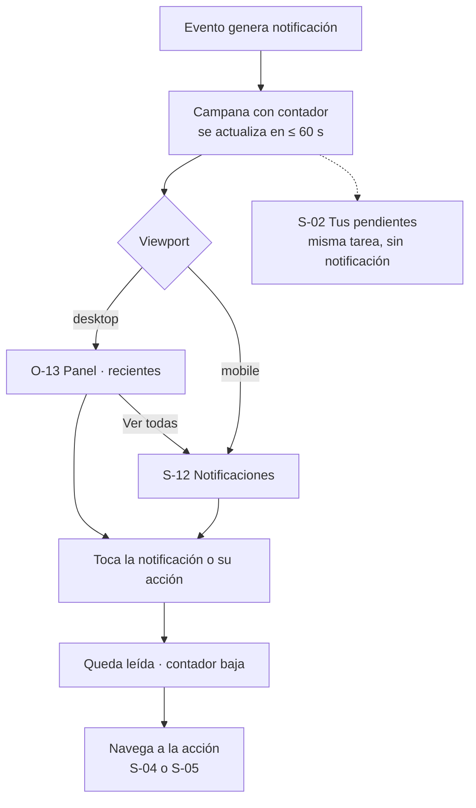

# Story Plan: S-013 (web) - Inicio, Eventos y Mis eventos

## Status

**Status:** Completed

## Story Reference

- **Story:** [S-013](../stories/S-013.inicio-eventos-y-mis-eventos.md)
- **Service:** web
- **Summary:** Reemplaza el `HomePage` placeholder (WHY/HOW/DEMO, inline en `App.tsx`) y el listado
  viejo `components/events/Events.tsx` (tabs All / My / Subscriptions + "Refresh") por tres páginas
  del rediseño: Inicio (`/`) con contenido real, Eventos (`/events`) con "Tus pendientes", filtros por
  etapa con conteo, búsqueda con debounce y una acción por fila, y Mis eventos (`/my-events`, con
  sesión) separada en "Organizo" y "Participo". Consume los contratos que agregó S-008 (`q`,
  `stage_counts`, `participants_count`, `scope=all`, `role`, `my_status`); todo el texto sale del
  catálogo `es` (neutro) / `en` y las tres pantallas funcionan a 375 px.

### Hallazgos del código que condicionan el plan

Relevados al planificar (no están en la documentación, o la contradicen, y cambian cómo se implementa):

1. **`GET /api/v1/events` no devuelve `organizer`.** `EventListItem` (api.yaml y
   `api/internal/handlers/event_handler.go:1373-1392`) no trae ese campo, aunque `q` busca por
   organizador en el backend. La columna "EVENTO" muestra nombre + descripción corta, que es lo que
   pide el screen.md; **no se muestra organizador en la tabla**. El servicio viejo
   `EventService.getAllEvents` lo rellenaba con el texto inventado `"Organizador por determinar"`
   (dato fabricado, REQ-001): se elimina junto con el servicio.
2. **`GET /api/v1/events` tampoco dice si el usuario está inscripto ni su progreso.** Solo trae
   `participant_ids` y `author_id`. Para resolver la acción de fila ("Subir archivo", "Votar") hace
   falta el `my_status` de `GET /users/{id}/events?scope=all`, que la página ya pide para los
   pendientes. → **Decisión D-3.**
3. **`DataTable` no admite texto debajo de la acción ni nombre accesible distinto del label.** CA-7
   pide "Requiere cuenta" / "Público" debajo del botón y el DS pide que la acción tenga nombre único
   ("Gestionar Evento 1"), pero `DataTableRowAction` es `{ label, onClick, variant }`. → **D-6.**
4. **No hay componente de paginación en el DS** y el screen.md de Eventos la incluye
   ("Anterior · {página} de {total} · Siguiente"). → **D-7** y DS Gaps (nuevo).
5. **El listado no define orden.** `GetAll()` del backend no ordena explícitamente y el screen.md de
   Inicio pide "el cierre más próximo". → **D-4.**
6. **El link "Cómo funciona" del header ya apunta a `/#como-funciona`** (`AppHeader.tsx:12`), pero
   React Router no hace scroll a un hash: hoy el ancla no existe y nada la enfoca. → **D-9.**
7. **El menú de usuario ya navega a `/my-events`** (`UserMenu.tsx`, S-011), pero la ruta no existe y
   cae en la 404. Esta story la crea con `RequireAuth`.
8. **Las fechas de `/users/{id}/events` no son homogéneas:** `start_date`/`end_date`/`created_at`
   vienen en RFC3339, mientras que `participation_estimated_end_date` y `voting_estimated_end_date`
   vienen como `YYYY-MM-DD` (`formatDatePtr`). Todas se formatean con `fmt.date` de `domain/dates`,
   que toma la parte `YYYY-MM-DD` en calendario local.
9. **Tests existentes que dependen de lo que se borra:** `routes.test.tsx` (TS-61 espera el heading
   `Browse Events` y mockea `EventService.getAllEvents`), `components/events/Events.test.tsx` (TS-62
   de S-011, botón "Create Event") y `services/api.test.ts` (dos tests de `getAllEvents`). Se
   actualizan en la Task 8.
10. **`App.css` conserva reglas del `HomePage` placeholder** (`.main-content`, `.section`,
    `.section-container`, `.section-content` y sus overrides en `@media (max-width: 768px)`). CA-15
    pide borrar los CSS viejos: se borran esas reglas (las de `.navbar`/`.nav-*` no son de esta story
    y no se tocan).
11. **`components/events/` no está entero en lint ni en las reglas estáticas**: `package.json`
    (`lint` y override de `react/jsx-no-literals`) y `static-rules.test.ts` listan carpetas una por
    una. Las carpetas nuevas (`pending-card`, `events-table`, `pages/home`, `pages/events-list`,
    `pages/my-events`) se agregan explícitamente.

### Decisiones tomadas al planificar

- **D-1 · Copy neutro.** Los screen.md tienen voseo ("Creá", "Querés", "organizás"…). El catálogo usa
  el español neutro de la tabla "Catálogo nuevo" (abajo), que incluye los literales de la story
  ("Todavía no has organizado ningún evento.", "Falta subir tu archivo", "Te toca votar",
  "Quedaste en el puesto X de Y", "Requiere cuenta", "Público"…). Esa tabla es la fuente de verdad del
  texto, no el microcopy de los screen.md. Los textos que el screen.md muestra en mayúsculas
  ("TUS PENDIENTES · {n}", "CÓMO FUNCIONA", eyebrows) se guardan en minúscula de oración y se ponen en
  mayúsculas por CSS (`text-transform: uppercase`), así los lectores de pantalla no los deletrean.
- **D-2 · Pendientes (`pendingTasks`).** A partir de los ítems con `role === 'participant'` de
  `GET /users/{id}/events?scope=all`:
  - `upload`: `stage === 'participation'` y `my_status.has_attachment === false`.
  - `vote`: `stage === 'voting'`, `my_status.has_assignment === true` y
    `my_status.ranking_submitted === false`.
  - `results`: `stage === 'results'` y `my_status.result_position` y `result_total` no nulos.
  - `upload` y `vote` **se excluyen si `is_paused` o `is_cancelled`** (CA-4). `results` se excluye si
    `is_cancelled`.
  - Orden: tipo (`upload` → `vote` → `results`) y, dentro del tipo, cierre ascendente
    (`participation_estimated_end_date` para `upload`, `voting_estimated_end_date` para `vote`;
    `results` no tiene cierre); sin fecha va al final del tipo; empate → `name` (`localeCompare`).
  - Se muestran 4 (`PENDING_LIMIT = 4`); si hay más, link "Ver todos en Mis eventos" → `/my-events`.
    El título muestra el **total** ("Tus pendientes · 6"). Sin pendientes, el bloque (título incluido)
    no se muestra.
- **D-3 · Acción de fila (`rowAction`)** — tabla del product-map, con datos combinados:
  - `isAuthor = user && event.author_id === user.id`.
  - `registered = myEvent?.role === 'participant' || event.participant_ids?.includes(user.id)`.
  - `myStatus = myEvent?.my_status ?? null` (ítem de `scope=all` con el mismo `id`).
  - Resolución, en orden: autor → `manage` (secundaria); `results` → `results` (secundaria; sin
    sesión con hint "Público"); `is_paused || is_cancelled` → `view` (secundaria);
    `participation` + no inscripto → `participate` (primaria; sin sesión con hint "Requiere cuenta");
    `participation` + inscripto + `myStatus?.has_attachment === false` → `upload` (primaria);
    `voting` + `myStatus?.has_assignment && !myStatus.ranking_submitted` → `vote` (primaria);
    cualquier otro caso (incluido "inscripto pero no se pudo cargar `my_status`") → `view`
    (secundaria). La regla de pausado/cancelado no está en el product-map; se agrega para ser
    coherente con CA-4 (un evento pausado no pide subir ni votar).
  - Destino: `manage` → `/events/{id}/manage`; el resto → `/events/{id}`. Sin sesión,
    `participate` también va a `/events/{id}` (el detalle resuelve la inscripción, S-015).
- **D-4 · Orden.** Inicio: abiertos = `stage === 'participation'` y no pausados ni cancelados, por
  `participation_estimated_end_date` ascendente (sin fecha al final), empate por
  `participants_count` descendente (pregunta abierta del screen.md: "el de más inscriptos"), luego
  `name`. Destacado = el primero; "Abiertos ahora" = los primeros 3 (el destacado incluido: con un solo
  evento abierto la lista no queda vacía). La tabla de Eventos respeta el orden del servidor (no se
  reordena lo que el servidor pagina). Mis eventos: cada sección por `created_at` descendente.
- **D-5 · Pill de etapa (`stagePill`).** Prioridad: `is_cancelled` → neutral "Cancelado";
  `is_paused` → warning "Pausado"; `creation` → neutral "Borrador · no visible"; `participation` →
  success + punto "Inscripción abierta"; `voting` → action "Votación"; `results` → neutral
  "Finalizado" (DS status-pill: nombres de etapa únicos). "Cancelado" no está en ningún screen.md; se
  agrega para no mostrar un evento cancelado como abierto.
- **D-6 · Extensión de `DataTable`.** `DataTableRowAction` suma `hint?: string` (texto
  `--type-caption` / `--text-secondary` debajo del botón, en la misma celda) y
  `accessibleLabel?: string` (va como `aria-label` del botón). `EventsTable` pasa
  `accessibleLabel = t('events.actions.accessibleName', { action, name })` → "Gestionar Evento 1". El
  cambio es retrocompatible (props opcionales) y se avisa para la spec del DS (DS Gaps).
- **D-7 · Paginación inline.** `limit = 10` (default del backend), `?page=` en la URL. Debajo de la
  tabla: botones `Button variant="tertiary" size="sm"` "Anterior" / "Siguiente" (deshabilitados en
  los extremos) y el texto "{page} de {total}", dentro de `<nav aria-label="Paginación">`. Se oculta si
  `total_pages <= 1`, en `loading`, en `empty` y en `error`. Cambiar filtro o búsqueda vuelve a la
  página 1 (se borra `page` de la URL).
- **D-8 · Estado en la URL.** `/events` lee `stage`, `q` y `page` con `useSearchParams`. `stage`
  válido: `participation | voting | results`; cualquier otro valor (incluido `creation`) se trata como
  "Todos" y no se envía. El input de búsqueda tiene estado local; tras **300 ms** sin escribir se
  actualiza `?q=` con `setSearchParams(…, { replace: true })` (sin entradas de historial por tecla);
  `q` vacío se borra de la URL. El filtro hace `setSearchParams` normal (sí deja historial). Cada
  cambio de `stage`/`q`/`page` pide `GET /events` de nuevo; las respuestas viejas se descartan con un
  contador de request (`requestIdRef`) — no hay `AbortController` en `apiRequest`.
- **D-9 · Ancla "Cómo funciona".** La sección lleva `id="como-funciona"` y su h2 `tabIndex={-1}`.
  `HomePage` tiene un efecto sobre `location.hash`: si es `#como-funciona`, hace
  `section.scrollIntoView?.()` y enfoca el h2 (accesibilidad del screen.md). Funciona desde otra ruta y
  desde la misma Inicio.
- **D-10 · Cupo.** `ProgressBar` con `value = participants_count`, `max = max_participants`,
  `label = "{count} / {max}"` y `valueText = "{count} de {max} lugares ocupados"`. Si
  `max_participants` es `null` no hay barra: solo el texto "{count} inscritos" (plural). En el
  destacado de Inicio el texto visible es "{count} de {max} lugares ocupados" (screen.md).
- **D-11 · Errores por bloque y "Reintentar".** Cada bloque que carga datos muestra su propio
  `Callout tone="error"` con `action={{ label: t('common.retry'), onClick }}`: en Inicio, un error
  reemplaza destacado + lista; en Eventos, el de la tabla oculta tabla y paginación (los filtros quedan
  sin conteo) y el de pendientes ocupa el lugar de las tarjetas (la tabla sigue, CA-13); en Mis
  eventos, un error oculta las dos secciones completas (títulos incluidos: un "Organizo · 0" sería
  falso, CA-11). El texto es el de la pantalla, **nunca** `err.message` ni `errors.<code>` (los
  códigos posibles — `RETRIEVAL_ERROR`, `INVALID_STAGE_FILTER`, `FORBIDDEN` — no aportan al usuario).
  Un `401` lo maneja `apiRequest` (ADR-008), no la página.
- **D-12 · Orden de foco vs. orden visual en mobile.** El DOM sigue el orden de desktop
  (filtros → búsqueda, como pide el orden de foco del screen.md); en mobile la búsqueda se muestra
  primero con `order: -1` dentro del contenedor flex (CA-14). Es la única reordenación visual.
- **D-13 · Variante visitante de Eventos.** Sin sesión no se llama a `/users/{id}/events`. "Crear un
  evento" va a `/login?next=%2Fevents%2Fcreate` (`loginPathFor('/events/create')`) con
  `variant="secondary"`. Con sesión "+ Crear evento" (`primary`) va a `/events/create`. Mismo criterio
  en Inicio ("Crear un evento" y "Crear mi primer evento").
- **D-14 · Ubicación del código.** `src/domain/events.ts` (lógica pura), `src/components/events/pending-card/`
  (`ev-pending-card`), `src/components/events/events-table/` (`ev-events-table`), páginas en
  `src/pages/home/` (`hm-`), `src/pages/events-list/` (`evl-`) y `src/pages/my-events/` (`mye-`).
  Los prefijos de páginas no entran en la regla TS-9 de `static-rules.test.ts` (que solo mira
  `components/`), pero se respetan igual.
- **D-15 · Skeletons.** Inicio: destacado y lista como `Card` con bloques `ui`-skeleton (clase propia
  `hm-skeleton`, fondo `--bg-disabled`) + texto visualmente oculto "Cargando eventos…" en
  `role="status"`. Eventos: `DataTable loading skeletonRows={5}`, `FilterTabs loading`, 2 tarjetas de
  pendiente skeleton. Mis eventos: dos `DataTable loading skeletonRows={3}`.

---

## Architectural Context

### Tech Stack

```
react 19.1.1            react-dom 19.1.1
react-router-dom 7.9.4  @react-oauth/google 0.13.4
react-scripts 5.0.1     typescript 4.9.5 (strict: true)
@testing-library/react 16.3.0     @testing-library/jest-dom 6.6.4
@testing-library/user-event 13.5.0  @testing-library/dom 10.4.1
```

Create React App, **no Next.js**: SPA client-side pura, sin SSR (ADR-006). `src/index.tsx` monta
`<App />` dentro de `<React.StrictMode>` (los efectos de montaje corren dos veces en desarrollo: el
contador de request de D-8 lo tolera).

### Service Architecture (convenciones del servicio, estado real tras S-010/S-011/S-012)

**Estructura** (`project-structure`): organización por tipo técnico.

```
src/
├── App.tsx                 # AppRoutes (exportada para tests) + providers
├── components/ui/          # primitivos del DS (Button, TextField, DataTable, …) — prefijo ui-
├── components/layout/      # chrome global (AppHeader, AppLayout, RequireAuth, …) — prefijo ly-
├── components/events/      # compuestos de dominio (EventHero, StageTimeline, …) — prefijo ev-
│   ├── pending-card/       # NUEVO: PendingCard
│   └── events-table/       # NUEVO: EventsTable (config de columnas sobre DataTable)
├── pages/{kebab-case}/     # pantallas montadas en una ruta
│   ├── home/               # NUEVO: HomePage (sale de App.tsx)
│   ├── events-list/        # NUEVO: EventsListPage (reemplaza components/events/Events.tsx)
│   └── my-events/          # NUEVO: MyEventsPage
├── context/AuthContext.tsx # sesión
├── domain/                 # lógica pura + index.ts — NUEVO: events.ts
├── i18n/                   # I18nProvider, useT, catálogos es/en, errores por code
├── services/api.ts         # servicios por dominio (EventService, UserService, …)
├── config/api.ts           # apiRequest, ApiError, API_CONFIG.ENDPOINTS
├── styles/tokens.css       # ÚNICA fuente de tokens del DS v2.0.0
└── test-utils/renderWithProviders.tsx
```

- Carpeta `kebab-case`, componente `PascalCase`, **un componente por carpeta con su CSS al lado**.
- `export default` para el componente; tipos y helpers con export nombrado.
- Props tipadas en una `interface` arriba; `React.FC<Props>`.
- **Nada de `any`** en código nuevo; **nada de `console.log`** (solo `console.error` para errores reales).

**Routing** (`routing`, estado actual de `src/App.tsx`):

```tsx
export function AppRoutes(): JSX.Element {
  return (
    <Routes>
      <Route element={<AppLayout />}>
        <Route path="/" element={<HomePage />} />                 {/* inline en App.tsx → pages/home */}
        <Route path="/events" element={<EventsPage />} />         {/* wrapper de Events.tsx → pages/events-list */}
        <Route path="/events/create" element={<RequireAuth><CreateEventPage /></RequireAuth>} />
        <Route path="/events/:eventId/manage" element={<RequireAuth><ManageEventPage /></RequireAuth>} />
        <Route path="/events/:eventId" element={<EventDetailPageWrapper />} />
        {/* NUEVO: <Route path="/my-events" element={<RequireAuth><MyEventsPage /></RequireAuth>} /> */}
        <Route path="*" element={<NotFoundPage />} />
      </Route>
      {/* Páginas de autenticación: layout propio, sin barra global ni pie */}
      <Route path="/login" element={<RedirectIfAuthenticated><LoginPage /></RedirectIfAuthenticated>} />
      <Route path="/register" element={<RedirectIfAuthenticated><RegisterPage /></RedirectIfAuthenticated>} />
      <Route path="/forgot-password" element={<ForgotPasswordPage />} />
      <Route path="/reset-password" element={<ResetPasswordPage />} />
      <Route path="/complete-profile" element={<CompleteProfilePage />} />
    </Routes>
  );
}
```

- Navegación de usuario con `<Link>`; imperativa con `useNavigate()`. Query con `useSearchParams()`;
  hash con `useLocation().hash`.
- `RequireAuth` (S-011): espera `loading === false`; sin `user` →
  `<Navigate to={loginPathFor(pathname + search)} replace />`. Con eso CA-12 queda cubierto
  (`/my-events` → `/login?next=%2Fmy-events`).
- `EventDetailPageWrapper` (redirige al autor a `/manage`) **no se toca** (S-015).

**Auth** (`auth`, estado actual):

```ts
// src/types/index.ts
export interface AuthContextType {
  user: User | null;            // User { id, name, email, role, joinedEventIDs, createdEventIDs }
  token: string | null;
  login: (userData: User, token: string) => void;
  logout: () => void;
  updateUser: (updatedData: Partial<User>) => void;
  joinEvent: (eventId: string) => void;
  isAuthenticated: boolean;
  loading: boolean;             // true mientras restaura la sesión al arrancar
}
```

- `useAuth()` lanza fuera de `AuthProvider` (en tests: `jest.mock('…/context/AuthContext')` +
  `renderWithProviders`).
- El `401` se maneja globalmente (ADR-008): **no agregar manejo de 401 en páginas**.
- `AuthContext.syncUserEvents` usa `UserService.getUserEvents(userId)` (sin `scope`): **no se toca**;
  esta story agrega un método nuevo con `scope=all`.

**Obtención de datos** (`data-fetching`): tres capas — `apiRequest` (cliente: `BASE_URL`, JWT,
`ApiError`, 401 global) → servicios de `src/services/api.ts` (mapean la respuesta a tipos del front) →
componente con **las tres** variables `loading`, `error` y dato; `setError('')` (o `null`) al empezar,
`setLoading(false)` en `finally`. Sin caché, sin `AbortController` (D-8 usa contador de request).

**Errores** (`error-handling`, tras S-010/S-011): `apiRequest` lanza `ApiError { status, code?, details }`;
el texto del servidor **nunca** se muestra. En esta story los bloques muestran su propio mensaje
(D-11).

**Estilos** (`styling` + ADR-007 enmendado): CSS plano por componente, **solo tokens de
`src/styles/tokens.css`** (sin hex, sin `rgba()`, sin medidas que tengan token), **mobile-first**,
único corte `@media (min-width: 768px)`, nunca `max-width` en `@media`, clases con prefijo del
componente.

**Testing** (`testing`): archivo `.test.tsx` al lado; consultas por rol/label/texto; `userEvent`
v13 (`userEvent.type`, `userEvent.click` síncronos); `findBy*` para lo asíncrono; `jest.useFakeTimers()`
+ `act(() => jest.advanceTimersByTime(300))` para el debounce; mockear `services/api` con `jest.mock`
(automock) y la sesión con `jest.mock('…/context/AuthContext')`; `localStorage.clear()` en
`beforeEach`. No sacar el `moduleNameMapper` de `package.json`.

```bash
cd web && CI=true npm test          # una corrida
cd web && npm run typecheck && npm run lint
```

### Relevant ADRs

Los ADRs del producto no tienen sección "Implementation Rules"; se copian la decisión y las reglas
que de ella se derivan.

- **ADR-006: Create React App en lugar de Next.js** — *Decisión:* "Create React App (`react-scripts`
  5.0.1) con react-router-dom 7.9.4. SPA client-side pura: sin SSR, sin file-based routing, sin Server
  Components. Todo el render ocurre en el navegador." → Las páginas son componentes cliente montados
  en `AppRoutes`.
- **ADR-007: CSS plano con variables (enmienda REQ-003)** — reglas verbatim de la enmienda:
  - "**Una sola fuente de tokens:** `web/src/styles/tokens.css`, con los tokens del DS `web` v2.0.0."
  - "**Sin hex literales** en los componentes nuevos."
  - "**Lenguaje visual nuevo:** de glassmorphism oscuro a 'bandas oscuras + contenido claro'."
  - "**Breakpoints como escala nombrada** (`--bp-mobile: 768px` documentado; en `@media` se usa el
    literal) y **mobile-first** en los componentes nuevos."
  - "**Componentes en vez de sistemas de clases:** `web/src/components/ui/` con los primitivos del DS
    (`Button`, `TextField`, `Dialog`, `DataTable`, …) y compuestos de dominio en
    `web/src/components/{dominio}/`."
  - "**Prefijo de clase por componente** para evitar colisiones."
- **ADR-008: Manejo global de expiración de sesión por CustomEvent** — *Decisión:* "Ante un `401`,
  `apiRequest` limpia la sesión de `localStorage` y emite un `CustomEvent` llamado `auth:logout`.
  `AuthContext` registra un listener en `window` y, al recibirlo, actualiza su estado para desloguear
  al usuario sin recargar la página." → Las páginas no manejan el 401; todas las llamadas por los
  servicios de `services/api.ts` (nunca `fetch` directo).
- **ADR-010: i18n propio sobre `Intl`** — *Decisión (verbatim):*
  - "`I18nProvider` (Context) y `useT()`."
  - "Catálogos `es.ts` y `en.ts`; **el tipo de `en` se deriva de `es`**, así una clave faltante no compila."
  - "Interpolación simple (`{name}`) y plurales con `Intl.PluralRules`."
  - "Errores de la api traducidos por `code` (`errors.<code>`), con fallback genérico; nunca se muestra `err.message`."
  - "Verificación: lint contra texto embebido en JSX en las carpetas nuevas y un test que rechaza formas de voseo en el catálogo `es`."
- **REQ-003 DA-5 (reglas de dominio en `src/domain/`)** — "El front define nombres/orden/siguiente
  etapa, … formato de fechas … **No recalcula**" lo que calcula el backend. → `pendingTasks`,
  `rowAction`, `stagePill` y `openEvents` viven en `src/domain/events.ts` y solo **interpretan**
  `my_status` (la posición del ranking la calcula el backend).

### API Context

Sin cambios de API. Endpoints usados (de `docs/apis/api.yaml`, implementados por S-008), a través de
métodos **nuevos** de `src/services/api.ts`:

#### `GET /api/v1/events` — `security: []` (público; con JWT también funciona)

Query: `page` (int ≥ 1, default 1), `limit` (1..100, default 10), `stage` (`Stage`), `q` (string,
"búsqueda case-insensitive por `name` u `organizer`"; ignora espacios de los extremos; en blanco no
filtra). "**Nunca devuelve eventos en `creation`**; `stage=creation` → `data: []`. `stage_counts` se
calcula sobre el conjunto filtrado por `q`, antes de filtrar por `stage` y de paginar, y siempre trae
las tres claves (`participation`, `voting`, `results`), aunque valgan 0."

```yaml
200:
  data: [EventListItem]
  pagination: { page: integer, limit: integer, total: integer, total_pages: integer }
  filters: { stage: string }
  stage_counts: { participation: integer, voting: integer, results: integer }
400: INVALID_STAGE_FILTER   # incluye valid_stages
500: RETRIEVAL_ERROR

EventListItem:
  id: string(uuid)
  name: string
  description: string
  start_date: string(date)          # YYYY-MM-DD
  end_date: string(date)
  stage: Stage                      # creation | participation | voting | results
  author_id: string(uuid)
  max_participants: integer|null
  participation_estimated_end_date: string(date)|null
  voting_estimated_end_date: string(date)|null
  participant_ids: [string(uuid)]
  participants_count: integer
  is_cancelled: boolean
  is_paused: boolean
  created_at: string(date-time)
  updated_at: string(date-time)
```

Ejemplo de respuesta (para mocks):

```json
{
  "data": [
    { "id": "e-1", "name": "Concurso de afiches", "description": "Diseña el afiche del festival",
      "start_date": "2026-10-01", "end_date": "2026-11-30", "stage": "participation",
      "author_id": "u-9", "max_participants": 20,
      "participation_estimated_end_date": "2026-10-10", "voting_estimated_end_date": null,
      "participant_ids": ["u-2", "u-3"], "participants_count": 12,
      "is_cancelled": false, "is_paused": false,
      "created_at": "2026-09-28T12:00:00Z", "updated_at": "2026-09-28T12:00:00Z" }
  ],
  "pagination": { "page": 1, "limit": 10, "total": 1, "total_pages": 1 },
  "filters": { "stage": "participation" },
  "stage_counts": { "participation": 4, "voting": 2, "results": 2 }
}
```

#### `GET /api/v1/users/{user_id}/events?scope=all` — con JWT, solo el propio usuario

"Con `scope=all` (S-008) incluye también los eventos que el usuario creó, incluso en `creation`, y
cada ítem trae `role`; los ítems con `role = participant` traen `my_status`. La posición sale de
`voting_results.adjusted_ranking`." "**Las fechas acá salen en RFC3339 completo**" (salvo las dos
estimadas, que salen `YYYY-MM-DD`, hallazgo 8). `scope=all` sobre otro usuario → `403 FORBIDDEN`.

```yaml
200:
  data:
    - id: string(uuid)
      name: string
      title: string                 # duplicado de name
      description: string
      stage: Stage
      start_date: string(date-time)
      date: string(date-time)       # duplicado de start_date
      end_date: string(date-time)
      organizer: string
      author_id: string(uuid)
      creator_id: string(uuid)      # duplicado de author_id
      created_at: string(date-time)
      updated_at: string(date-time)
      role: creator | participant
      max_participants: integer|null
      participants_count: integer
      participation_estimated_end_date: string(date)|null
      voting_estimated_end_date: string(date)|null
      is_paused: boolean
      is_cancelled: boolean
      my_status:                    # null si role = creator
        has_attachment: boolean
        has_assignment: boolean
        ranking_submitted: boolean
        result_position: integer|null   # null fuera de results
        result_total: integer|null
400: INVALID_PAYLOAD (scope inválido)
401: NO_AUTH_TOKEN, UNAUTHORIZED_ACCESS
403: FORBIDDEN
500: RETRIEVAL_ERROR
```

#### Métodos nuevos en `src/services/api.ts` (Task 1)

```ts
// src/types/index.ts (nuevos)
export type StageCounts = { participation: number; voting: number; results: number };

export interface EventListItem {
  id: string;
  name: string;
  description: string;
  stage: EventStage;
  author_id: string;
  max_participants: number | null;
  participants_count: number;
  participant_ids: string[];
  participation_estimated_end_date: string | null;
  voting_estimated_end_date: string | null;
  is_paused: boolean;
  is_cancelled: boolean;
  created_at: string;
}

export interface EventListPage {
  items: EventListItem[];
  pagination: { page: number; limit: number; total: number; totalPages: number };
  stageCounts: StageCounts;
}

export interface MyStatus {
  has_attachment: boolean;
  has_assignment: boolean;
  ranking_submitted: boolean;
  result_position: number | null;
  result_total: number | null;
}

export interface MyEvent extends Omit<EventListItem, 'participant_ids'> {
  role: 'creator' | 'participant';
  my_status: MyStatus | null;
}

// src/services/api.ts
EventService.listEvents(params: { q?: string; stage?: EventStage; page?: number; limit?: number }): Promise<EventListPage>
//   GET `${API_CONFIG.ENDPOINTS.EVENTS}?` + URLSearchParams con solo las claves definidas y no vacías
//   (q recortado). Mapea pagination.total_pages → totalPages y stage_counts → stageCounts
//   (faltante → { participation: 0, voting: 0, results: 0 }). participants_count faltante →
//   participant_ids.length. Sin fallbacks inventados; los errores se relanzan.
UserService.getMyEvents(userId: string): Promise<MyEvent[]>
//   GET `${API_CONFIG.ENDPOINTS.USERS}/${userId}/events?scope=all`. Mapea solo los campos de MyEvent.
```

Los nombres de campo del front **son los de la api** (snake_case), salvo `pagination.totalPages` y
`stageCounts`, que se normalizan en el servicio.

### Catálogo nuevo (fuente de verdad del texto, D-1)

Se agregan los namespaces `home`, `events` y `myEvents`, y `common.retry`, a
`src/i18n/catalogs/es.ts` y `en.ts`. Español neutro (sin voseo, sin marcas de género); el test de
voseo existente los recorre. Las claves `plural(...)` usan el parámetro `count`.

| Clave | es | en |
|---|---|---|
| `common.retry` | Reintentar | Try again |
| `home.eyebrow` | Evaluación entre pares · votación distribuida | Peer review · distributed voting |
| `home.title` | Concursos donde la comunidad decide quién gana. | Contests where the community decides who wins. |
| `home.subtitle` | Crea un evento, recibe propuestas y deja que los propios participantes se evalúen entre sí. Resultados justos, sin jurado central. | Create an event, receive proposals and let the participants review each other. Fair results, no central jury. |
| `home.explore` | Explorar eventos abiertos → | Explore open events → |
| `home.create` | Crear un evento | Create an event |
| `home.featured.label` | Evento destacado | Featured event |
| `home.featured.status` | Inscripción abierta | Registration open |
| `home.featured.closesIn` | plural: `Cierra en {count} día` / `Cierra en {count} días` | plural: `Closes in {count} day` / `Closes in {count} days` |
| `home.featured.closesToday` | Cierra hoy | Closes today |
| `home.featured.capacity` | {count} de {max} lugares ocupados | {count} of {max} spots taken |
| `home.featured.participate` | Participar | Join |
| `home.how.eyebrow` | Cómo funciona | How it works |
| `home.how.title` | Cuatro etapas, siempre visibles | Four stages, always visible |
| `home.how.step` | {number} · {stage} | {number} · {stage} |
| `home.how.creation` | El organizador define el evento y su cupo. | The organizer defines the event and its capacity. |
| `home.how.participation` | Te inscribes y subes tu propuesta antes del cierre. | You sign up and upload your proposal before the deadline. |
| `home.how.voting` | Cada participante evalúa y ordena propuestas de otros. | Each participant reviews and ranks other people's proposals. |
| `home.how.results` | Se publica el ranking final para todos. | The final ranking is published for everyone. |
| `home.open.title` | Abiertos ahora | Open now |
| `home.open.seeAll` | Ver todos los eventos → | See all events → |
| `home.open.cta` | Ver y participar | View and join |
| `home.open.empty` | Ahora no hay eventos con inscripción abierta. | There are no events open for registration right now. |
| `home.open.emptyAction` | Ver todos los eventos | See all events |
| `home.open.error` | No pudimos cargar los eventos abiertos. | We couldn't load the open events. |
| `home.open.loading` | Cargando eventos… | Loading events… |
| `home.banner.title` | ¿Quieres evaluar propuestas con tu comunidad? | Want to review proposals with your community? |
| `home.banner.text` | Configurar un evento toma menos de 5 minutos. | Setting up an event takes less than 5 minutes. |
| `home.banner.cta` | Crear mi primer evento | Create my first event |
| `events.timeline.now` | Ahora | Now |
| `events.timeline.completed` | Completada | Completed |
| `events.timeline.pending` | Pendiente | Pending |
| `events.timeline.stepOf` | Etapa {number} de 4 | Stage {number} of 4 |
| `events.pill.participation` | Inscripción abierta | Registration open |
| `events.pill.voting` | Votación | Voting |
| `events.pill.results` | Finalizado | Finished |
| `events.pill.draft` | Borrador · no visible | Draft · not visible |
| `events.pill.paused` | Pausado | Paused |
| `events.pill.cancelled` | Cancelado | Cancelled |
| `events.actions.manage` | Gestionar | Manage |
| `events.actions.participate` | Participar | Join |
| `events.actions.upload` | Subir archivo | Upload file |
| `events.actions.view` | Ver evento | View event |
| `events.actions.vote` | Votar | Vote |
| `events.actions.results` | Ver resultados | View results |
| `events.actions.requiresAccount` | Requiere cuenta | Requires an account |
| `events.actions.public` | Público | Public |
| `events.actions.accessibleName` | {action} {name} | {action} {name} |
| `events.table.event` | Evento | Event |
| `events.table.stage` | Etapa | Stage |
| `events.table.participants` | Participantes | Participants |
| `events.table.created` | Creado | Created |
| `events.table.close` | Cierre | Closes |
| `events.table.myStatus` | Mi estado | My status |
| `events.table.action` | Acción | Action |
| `events.table.capacity` | {count} / {max} | {count} / {max} |
| `events.table.capacityText` | {count} de {max} lugares ocupados | {count} of {max} spots taken |
| `events.table.registered` | plural: `{count} inscrito` / `{count} inscritos` | plural: `{count} registered` / `{count} registered` |
| `events.myStatus.missingFile` | Falta tu archivo | Your file is missing |
| `events.myStatus.proposalSent` | Propuesta enviada | Proposal sent |
| `events.myStatus.toVote` | Te toca votar | Your turn to vote |
| `events.myStatus.rankingSent` | Ranking enviado | Ranking sent |
| `events.myStatus.notVoting` | No participas en la votación | You're not part of the voting |
| `events.myStatus.position` | Puesto {position} de {total} | Place {position} of {total} |
| `events.pending.title` | Tus pendientes · {count} | Your to-dos · {count} |
| `events.pending.uploadTitle` | Falta subir tu archivo | Your file is still missing |
| `events.pending.uploadAction` | Subir archivo | Upload file |
| `events.pending.voteTitle` | Te toca votar | Your turn to vote |
| `events.pending.voteAction` | Votar | Vote |
| `events.pending.resultsTitle` | Resultados publicados | Results published |
| `events.pending.resultsPosition` | Quedaste en el puesto {position} de {total} | You finished in place {position} of {total} |
| `events.pending.resultsAction` | Ver ranking | View ranking |
| `events.pending.closes` | Cierra el {date} | Closes on {date} |
| `events.pending.seeAll` | Ver todos en Mis eventos | See all in My events |
| `events.pending.error` | No pudimos cargar tus pendientes. | We couldn't load your to-dos. |
| `events.pending.loading` | Cargando tus pendientes… | Loading your to-dos… |
| `events.list.eyebrowGuest` | Explorar · {count} eventos públicos | Explore · {count} public events |
| `events.list.title` | Eventos | Events |
| `events.list.subtitle` | Encuentra dónde participar o sigue los eventos que ya te involucran. | Find where to take part or follow the events you're already in. |
| `events.list.subtitleGuest` | Mira qué se está evaluando y consulta los resultados publicados. Para participar o crear tu propio evento necesitas una cuenta gratuita. | See what's being reviewed and check the published results. To take part or create your own event you need a free account. |
| `events.list.create` | + Crear evento | + Create event |
| `events.list.createGuest` | Crear un evento | Create an event |
| `events.list.filtersLabel` | Filtrar por etapa | Filter by stage |
| `events.list.filterAll` | Todos | All |
| `events.list.filterParticipation` | Inscripción abierta | Registration open |
| `events.list.filterVoting` | En votación | Voting |
| `events.list.filterResults` | Finalizados | Finished |
| `events.list.filterAccessible` | plural: `{label}, {count} evento` / `{label}, {count} eventos` | plural: `{label}, {count} event` / `{label}, {count} events` |
| `events.list.searchLabel` | Buscar eventos | Search events |
| `events.list.searchPlaceholder` | Buscar por nombre u organizador | Search by name or organizer |
| `events.list.searchClear` | Borrar búsqueda | Clear search |
| `events.list.resultsCount` | plural: `{count} evento` / `{count} eventos` | plural: `{count} event` / `{count} events` |
| `events.list.loading` | Cargando eventos… | Loading events… |
| `events.list.noMatches` | No hay eventos que coincidan con tu búsqueda. | No events match your search. |
| `events.list.clearFilters` | Limpiar filtros | Clear filters |
| `events.list.noEvents` | Todavía no hay eventos públicos. | There are no public events yet. |
| `events.list.error` | No pudimos cargar los eventos. | We couldn't load the events. |
| `events.list.paginationLabel` | Paginación | Pagination |
| `events.list.previous` | Anterior | Previous |
| `events.list.next` | Siguiente | Next |
| `events.list.pageOf` | {page} de {total} | {page} of {total} |
| `events.list.howTitle` | Cómo participar | How to take part |
| `events.list.howStep1` | Elige un evento con inscripción abierta | Pick an event open for registration |
| `events.list.howStep2` | Crea tu cuenta e inscríbete | Create your account and sign up |
| `events.list.howStep3` | Sube tu propuesta | Upload your proposal |
| `events.list.howStep4` | Vota a otros participantes | Vote on other participants |
| `events.list.bannerTitle` | ¿Quieres que tu comunidad evalúe propuestas? | Want your community to review proposals? |
| `events.list.bannerText` | Crea una cuenta gratis y arma tu evento en menos de 5 minutos. | Create a free account and set up your event in less than 5 minutes. |
| `events.list.bannerCta` | Crear cuenta gratis | Create a free account |
| `myEvents.title` | Mis eventos | My events |
| `myEvents.subtitle` | Los eventos que organizas y en los que participas, en un solo lugar. | The events you organize and take part in, all in one place. |
| `myEvents.create` | + Crear evento | + Create event |
| `myEvents.organizingTitle` | Organizo · {count} | I organize · {count} |
| `myEvents.organizingEmpty` | Todavía no has organizado ningún evento. | You haven't organized any events yet. |
| `myEvents.organizingEmptyAction` | Crear evento | Create event |
| `myEvents.participatingTitle` | Participo · {count} | I take part · {count} |
| `myEvents.participatingEmpty` | Todavía no te has inscrito en ningún evento. | You haven't signed up for any events yet. |
| `myEvents.participatingEmptyAction` | Explorar eventos | Explore events |
| `myEvents.error` | No pudimos cargar tus eventos. | We couldn't load your events. |
| `myEvents.loading` | Cargando tus eventos… | Loading your events… |

Nombres de etapa en "Cómo funciona" y en la `StageTimeline` compacta: `stages.{stage}.name`
(ya existen: Creación · Participación · Votación · Resultados).

### Database Context

Ninguno: la story no toca base de datos.

### Flow Context

La story declara "Flujos Afectados: Ninguno a nivel de sistema". El flujo de interacción propio de la
story (verbatim de S-013):

> **Escenario: Ver pendientes y filtrar (CA-3 a CA-6)**
>
> **Trigger:** usuario con sesión abre `/events`.
>
> 1. **[web]** en paralelo: `GET /events?stage=&q=` y `GET /users/{id}/events?scope=all`.
> 2. **[web — `domain/events.ts`]** arma los pendientes con `my_status` y la acción de cada fila.
> 3. **[web]** el usuario elige un filtro → actualiza `?stage=` → `GET /events?stage=participation&q=`
>    (los conteos vienen en `stage_counts`).
>
> **Outcome:** pendientes arriba y tabla filtrada con conteos.
>
> **Manejo de errores:**
> - Falla del listado → `Callout` de error con reintento en la tabla.
> - Falla de pendientes → error con reintento solo en ese bloque.

Ajustes del plan: el paso 1 envía solo los parámetros con valor (D-8) y `page`; `GET /users/{id}/events`
se pide **una vez** al montar (no en cada cambio de filtro) y también alimenta la acción de fila (D-3).

### Integration Points

- Sin servicios externos, colas ni otros servicios internos. Solo la api propia por `apiRequest`.

### Code Conventions

- Archivos: `src/pages/home/HomePage.tsx` + `HomePage.css` + `HomePage.test.tsx` (idem
  `events-list/EventsListPage`, `my-events/MyEventsPage`); `src/components/events/pending-card/PendingCard.{tsx,css,test.tsx}`;
  `src/components/events/events-table/EventsTable.{tsx,css,test.tsx}`; `src/domain/events.ts` + `events.test.ts`.
- Clases CSS: `hm-*`, `evl-*`, `mye-*`, `ev-pending-card*`, `ev-events-table*`. Solo tokens.
- Todo el texto visible por `t('home.…' | 'events.…' | 'myEvents.…' | 'stages.…' | 'common.…')`; las
  carpetas nuevas entran en `react/jsx-no-literals` (Task 8).
- Lógica pura en `src/domain/events.ts`, reexportada en `src/domain/index.ts`.
- Debounce: constante `SEARCH_DEBOUNCE_MS = 300` en `src/domain/events.ts` (la usa la página).

### Reusable Code

**Componentes** (re-exportados en `src/components/ui/index.ts`):

- **Button** (`src/components/ui/button/Button.tsx`) — `variant: 'primary'|'secondary'|'tertiary'|'onBand'|'icon'`,
  `size: 'sm'|'md'|'lg'`, `loading`, `loadingLabel`, `disabled`, `iconStart`, `iconEnd`, `fullWidth`,
  `type`, `onClick`, atributos nativos (`aria-*`, `className`). Para links con aspecto de botón se usa
  `<Link className="ui-button ui-button--md ui-button--primary">` (patrón de `AppHeader`).
- **TextField** (`src/components/ui/text-field/TextField.tsx`) — `variant="search"`: label
  visualmente oculto, ícono de lupa, `type="search"`, botón de borrar si `value && onClear && clearLabel`.
  ```tsx
  <TextField variant="search" label={t('events.list.searchLabel')}
    placeholder={t('events.list.searchPlaceholder')} value={query}
    onChange={(e) => setQuery(e.target.value)} onClear={() => setQuery('')}
    clearLabel={t('events.list.searchClear')} />
  ```
- **DataTable** (`src/components/ui/data-table/DataTable.tsx`) — genérico `<T>`: `columns:
  { key, header, render?, align? }[]`, `rows`, `rowKey`, `rowAction?: (row) => { label, onClick,
  variant? }`, `actionHeader?`, `highlightRow?`, `caption`, `captionHidden?`, `loading?`,
  `skeletonRows?` (default 3). En mobile (base) se apila con `data-label` por celda y la acción a ancho
  completo; desde 768px es `display: table`. Se extiende con `hint` y `accessibleLabel` (D-6, Task 3).
- **FilterTabs** (`src/components/ui/filter-tabs/FilterTabs.tsx`) — `options: { value, label, count?,
  accessibleLabel? }[]`, `value`, `onChange`, `loading?` (conteos skeleton), `controls?`
  (`aria-controls`), `label?` (nombre del tablist). Flechas / Home / End.
- **StatusPill** (`src/components/ui/status-pill/StatusPill.tsx`) — `tone`, `size: 'sm'|'md'`,
  `icon: 'dot'|'check'|'none'`, `children`.
- **ProgressBar** (`src/components/ui/progress-bar/ProgressBar.tsx`) — `value`, `max`, `tone`,
  `size: 'sm'|'md'`, `label?` (texto visible), `valueText?` (`aria-valuetext`).
- **EmptyState** (`src/components/ui/empty-state/EmptyState.tsx`) — `variant: 'inline'|'page'`,
  `icon?`, `title`, `headingLevel?`, `description?`, `action?: { label, onClick?, href? }`.
- **Card** (`src/components/ui/card/Card.tsx`) — `variant: 'default'|'subtle'|'raised'|'feature'|'interactive'`,
  `padding`, `as: 'section'|'article'|'a'|'button'`, `eyebrow?`, `title?`, `headingLevel?`,
  `className?`, `children`. `feature` = franja destacada (CtaBanner, REQ-003: "variante destacada de la
  superficie card").
- **Callout** (`src/components/ui/callout/Callout.tsx`) — `tone: 'info'|'warning'|'error'|'success'`,
  `title?`, `action?: { label, onClick, busy? }`, `children`. `tone="error"` ⇒ `role="alert"`.
- **Icons** (`src/components/ui/icons/Icons.tsx`) — `SearchIcon`, `PlusIcon`, `CheckIcon`, `DotIcon`,
  `CloseIcon`, `UploadIcon`… (no hay flecha: "→" va en el texto del catálogo).
- **StageTimeline** (`src/components/events/stage-timeline/StageTimeline.tsx`) — `current`,
  `stageLabels: Record<EventStage, string>`, `nowLabel`, `completedLabel`, `pendingLabel`,
  `stepOfLabel`, `variant: 'full'|'compact'`. En el destacado: `variant="compact"`.
- **RequireAuth** (`src/components/layout/require-auth/RequireAuth.tsx`) — guard de `/my-events`.
- **AppLayout** (`src/components/layout/app-layout/AppLayout.tsx`) — header + `<main id="main">` +
  footer ("Telescopio · evaluación distribuida entre pares", ya en `footer.tagline`): las páginas no
  dibujan header ni footer.
- **visually-hidden** (`src/components/ui/visually-hidden.css`) — clase `ui-visually-hidden` para la
  región live y los textos de carga.

**Utils:**

- **domain/dates** (`src/domain/dates.ts`): `daysUntilClose(date, now?)` (0 = hoy, negativo = pasó),
  `formatDate(date, locale)`, `todayISO(now?)`. En componentes, `fmt.date(date)` de `useT()`.
- **domain/stages** (`src/domain/stages.ts`): `STAGE_ORDER`, `stageIndex`, `stageNameKey(stage)` →
  `` `stages.${stage}.name` ``.
- **domain/redirect** (`src/domain/redirect.ts`): `loginPathFor(path)` →
  `` `/login?next=${encodeURIComponent(path)}` ``.
- **i18n** (`src/i18n/index.ts`): `useT()` → `{ t(key, params?), locale, setLocale, fmt }`;
  `plural({ one, other })` para el catálogo; `TranslationKey`.
- **ApiError** (`src/config/api.ts`): `new ApiError({ status, body: { error, code } })` en tests.

**Hooks:** `useT` (i18n), `useAuth` (`src/context/AuthContext.tsx`).

**Test utils** (`src/test-utils/renderWithProviders.tsx`):
```ts
renderWithProviders(ui, { locale?: 'es'|'en', auth?: Partial<AuthContextType>, route?: string,
  initialEntry?: { pathname, search?, state? } })
  // I18nProvider + MemoryRouter + <LocationDisplay /> (data-testid="location": pathname+search)
sampleUser: User  // { id: 'u-1', name: 'Ana Pérez', email: 'ana@example.com', role: 'participant', joinedEventIDs: [], createdEventIDs: [] }
```
Para probar el hash (D-9) se usa `route: '/#como-funciona'`.

**Estilos:** `src/styles/tokens.css` — semánticos usados: `--bg-canvas`, `--bg-surface`,
`--bg-surface-subtle`, `--bg-band`, `--bg-disabled`, `--text-primary`, `--text-secondary`,
`--text-muted`, `--text-inverse`, `--text-inverse-secondary`, `--text-signal`, `--text-action`,
`--border-default`, `--space-stack-sm|md|lg`, `--space-inline-sm|md`,
`--space-padding-compact|default|spacious`, `--type-display`, `--type-heading-l|m|s`, `--type-body`,
`--type-ui`, `--type-caption`, `--type-eyebrow`, `--type-tracking-wide`, `--radius-surface`,
`--radius-pill`, `--bg-success-subtle`, `--bg-action-subtle`, `--bg-warning-subtle`. Todos existen en
`tokens.css` (verificado al planificar). Lista completa en "Design System Context".

### Wireframes / Screens

**Superficie:** `web` · **Plataforma:** `web` · **Viewports de la superficie:** `desktop` (≥ 768px,
frame 1200px) y `mobile` (base, frame 400px; CA-14 verifica a 375px). Cada pantalla tiene que cumplir
los dos layouts. **Breakpoint** (DS `grid.md`): `bp.desktop = 768px`, siempre
`@media (min-width: 768px)`.

**Pantallas que toca la story:**

| Pantalla | Ruta | Archivo en el servicio |
|---|---|---|
| S-01 Inicio | `/` | `src/pages/home/HomePage.tsx` (nueva; sale de `App.tsx`) |
| S-02 Eventos | `/events` | `src/pages/events-list/EventsListPage.tsx` (nueva; reemplaza `components/events/Events.tsx`) |
| S-11 Mis eventos | `/my-events` | `src/pages/my-events/MyEventsPage.tsx` (nueva) |

> El microcopy de los screen.md está en voseo; el texto que se implementa es el de "Catálogo nuevo"
> (D-1). Lo que sigue se copia verbatim como especificación de estructura, layout, estados e
> interacciones.

#### Contexto de navegación de la superficie (product-map, verbatim)

###### Chrome global

Presente en todas las pantallas salvo las de auth (S-06 a S-10), que usan el layout dividido sin
barra de navegación.

| Elemento | Sin sesión | Con sesión | Destino |
|---|---|---|---|
| Logo `TELESCOPIO` | ✓ | ✓ | `/` |
| `Inicio` | ✓ | ✓ | `/` |
| `Eventos` | ✓ | ✓ | `/events` |
| `Cómo funciona` | ✓ | ✓ | `/#como-funciona` (sección de S-01) |
| Selector de idioma `ES / EN` | ✓ en la barra | dentro del menú de usuario | cambia el idioma sin recargar |
| `Iniciar sesión` / `Crear cuenta` | ✓ | — | S-07 / S-08 |
| Campana con contador | — | ✓ | desktop: abre O-13 · mobile: navega a S-12 |
| Menú de usuario (iniciales + nombre) | — | ✓ | `Mis eventos`, `Idioma`, `Notificaciones`, `Cerrar sesión` |

En `mobile` las entradas de navegación (`Inicio`, `Eventos`, `Cómo funciona`) pasan a un menú
desplegable; la campana y el avatar quedan visibles en la barra. `[fuente: REQ-003 RF 9, AC 6]`

---

###### Rutas y acceso

| Ruta | Acceso | Sin acceso |
|---|---|---|
| `/`, `/events`, `/events/:id`, `/login`, `/register`, `/forgot-password`, `/reset-password`, `*` | Público | — |
| `/complete-profile` | Flujo Google | redirige a `/` |
| `/events/create`, `/my-events`, `/notifications` | Con sesión | `/login?next=<ruta>` (AC 33) |
| `/events/:id/manage` | Con sesión + autor | sin sesión → `/login?next=…`; no autor → estado "sin permiso" en S-05 (AC 32) |

###### Un evento en Creación no existe para los demás

Un evento en etapa `creation` no aparece en S-02 y, si alguien que no es su autor lo abre por URL,
ve S-13 (mismo estado que un evento inexistente). Su autor lo ve en S-11 con la etiqueta
"Borrador · no visible". `[fuente: REQ-003 RF 14, AC 34]`

###### La acción de cada fila del listado

En S-02 y S-11 cada fila muestra **una sola acción**, resuelta por rol y etapa:

| Condición | Texto | Variante |
|---|---|---|
| Es el autor | `Gestionar` | contorno |
| `participation` + no inscripto | `Participar` (sin sesión: + "Requiere cuenta") | primaria |
| `participation` + inscripto sin propuesta | `Subir archivo` | primaria |
| `participation` + con propuesta | `Ver evento` | contorno |
| `voting` + con asignación sin enviar | `Votar` | primaria |
| `voting` + otro caso | `Ver evento` | contorno |
| `results` | `Ver resultados` | contorno |

`[fuente: REQ-003 RF 13 — 1c, 1h]`

---

Inventario de Overlays: ninguna de las tres pantallas abre overlays (O-13, el panel de notificaciones del header, es de S-018).

#### Flujo de usuario relevante (user-flows, verbatim)

###### UF-05 — Enterarse de lo que me toca

**Audiencia:** participante y organizador · **Resuelve:** participante JTBD-01/02/03 y organizador JTBD-02 (saber a tiempo qué hacer)
**Pantallas:** O-13 (desktop), S-12, S-02 ("Tus pendientes") · **Flujo técnico:** `notificaciones-in-app` (nuevo en REQ-003)
**Trigger:** pasa algo en un evento del usuario: cambio de etapa, cancelación, inscripción, ranking enviado o recordatorio.



**Pasos (happy path):**
1. La campana muestra el contador de no leídas.
2. Abre el panel (desktop) o la página (mobile); las no leídas se ven con punto y en negrita.
3. Toca una: queda leída, el contador baja y navega a la acción ("Ir a votar", "Subir archivo", "Ver inscriptos").
4. "Marcar todo como leído" deja el contador en 0.

###### Caminos no felices

| Situación | Qué ve el usuario |
|---|---|
| Sin notificaciones | "No tenés notificaciones. Te avisamos acá cuando pase algo en tus eventos." |
| Falla la carga | "No pudimos cargar tus notificaciones." + "Reintentar" |
| Notificación de más de 90 días | No aparece |
| El evento de la notificación ya avanzó | La acción lleva al evento en su etapa actual |

**Estado final:** el usuario llegó a la pantalla donde tiene que actuar y la notificación quedó leída.
**Criterio de éxito:** desde cualquier pantalla con sesión, una tarea pendiente está a dos toques (AC 28–31).

---

UF-01 a UF-04 empiezan en S-04/S-05/S-07; de estas pantallas solo toman la entrada ("acción de fila" → S-04), ya cubierta por la tabla de acciones. `cross-surface-flows.md`: no aplica (una sola superficie).

#### S-01 · `home.md` (verbatim)

```yaml
name: home
surface: web
route: "/"
viewports: [desktop, mobile]
audiences: [participante, organizador]
fidelity: mid
status: diseñada
version: "2.0"
date: 2026-10-02
```

##### Pantalla: Inicio (S-01)

###### Identidad

- **Audiencia primaria (co-primary):**
  - [participante](../../../audiences/participante/research-context.md) — llega sin contexto y necesita entender qué es el producto y dónde participar.
  - [organizador](../../../audiences/organizador/research-context.md) — evalúa si puede armar su convocatoria acá.
- **JTBD / Propósito:** entender en segundos qué hace Telescopio y elegir entre explorar eventos abiertos o crear uno. Cubre REQ-003 RF 12 (propuesta de valor, 4 etapas, eventos abiertos, CTA crear).
- **Viewports:**
  - **desktop** — hero a dos columnas (mensaje + evento destacado) para que los dos caminos queden arriba del pliegue.
  - **mobile** — todo apilado; el evento destacado va después de los CTAs.
  - Tablet: se comporta como desktop por encima de 768px.

###### Entrada y salida

**Entradas:**
- Desde fuera (URL directa, buscador).
- Desde cualquier pantalla · logo o "Inicio" del header.

**Salidas user-driven:**
- A S-02 Eventos · "Explorar eventos abiertos →" o "Ver todos los eventos →".
- A S-03 Crear evento · "Crear un evento" o "Crear mi primer evento" (sin sesión pasa por S-07).
- A S-04 Detalle · "Participar" en el evento destacado o "Ver y participar" en una tarjeta.
- A S-07 / S-08 · "Iniciar sesión" / "Crear cuenta" del header.

**Salidas automáticas:** ninguna.

###### Estructura

| # | Nombre | Tipo | Variant/Level/State | Categoría | Viewports | Visibilidad | Propósito |
|---|--------|------|---------------------|-----------|-----------|-------------|-----------|
| 1 | header | header | — | layout | ambos | — | AppHeader: navegación, idioma, sesión |
| 2 | Eyebrow hero | label | — | content | ambos | — | Categoría del producto |
| 3 | Hero heading | heading | h1 | content | ambos | — | Propuesta de valor |
| 4 | Hero subtitle | paragraph | body | content | ambos | — | Cómo funciona en una frase |
| 5 | CTA explorar | button | primary | input | ambos | — | Camino del participante |
| 6 | CTA crear | button | secondary | input | ambos | — | Camino del organizador |
| 7 | Evento destacado | card | — | content | ambos | hidden_in_states: empty, error de sistema / sin conexión | Un evento con inscripción abierta real |
| 8 | Etapas del destacado | progress-bar | — | feedback | ambos | hidden_in_states: empty, error de sistema / sin conexión | StageTimeline compacta del destacado |
| 9 | Cupo del destacado | progress-bar | — | feedback | ambos | hidden_in_states: empty, error de sistema / sin conexión | Lugares ocupados |
| 10 | Botón participar destacado | button | primary | input | ambos | hidden_in_states: empty, error de sistema / sin conexión | Ir al detalle del destacado |
| 11 | Eyebrow cómo funciona | label | — | content | ambos | — | Ancla `#como-funciona` |
| 12 | Heading etapas | heading | h2 | content | ambos | — | Título de la sección |
| 13 | Etapa creación | card | — | content | ambos | — | Paso 01 |
| 14 | Etapa participación | card | — | content | ambos | — | Paso 02 |
| 15 | Etapa votación | card | — | content | ambos | — | Paso 03 |
| 16 | Etapa resultados | card | — | content | ambos | — | Paso 04 |
| 17 | Heading abiertos | heading | h2 | content | ambos | — | Título de la sección de eventos |
| 18 | Link ver todos | link | — | navigation | ambos | — | Ir a S-02 |
| 19 | Eventos abiertos | card-list | — | content | ambos | hidden_in_states: empty, error de sistema / sin conexión | Hasta 3 eventos con inscripción abierta |
| 20 | Sin eventos abiertos | empty-state | — | feedback | ambos | visible_only_in_states: empty | No hay inscripciones abiertas |
| 21 | Error eventos | alert | error | feedback | ambos | visible_only_in_states: error de sistema / sin conexión | Falla la carga de eventos |
| 22 | Banner crear | card | — | content | ambos | — | CtaBanner para organizadores |
| 23 | CTA banner crear | button | primary | input | ambos | — | Crear mi primer evento |
| 24 | footer | footer | — | layout | ambos | — | Pie |

###### Layout por viewport

###### desktop · 1200px
- row `hero`
  - col 7/12: Eyebrow hero, Hero heading, Hero subtitle, CTA explorar, CTA crear
  - col 5/12: Evento destacado, Etapas del destacado, Cupo del destacado, Botón participar destacado
- Eyebrow cómo funciona
- Heading etapas
- row `etapas`
  - col 3/12: Etapa creación
  - col 3/12: Etapa participación
  - col 3/12: Etapa votación
  - col 3/12: Etapa resultados
- row `abiertos-titulo`
  - col 9/12: Heading abiertos
  - col 3/12: Link ver todos
- Eventos abiertos
- Sin eventos abiertos
- Error eventos
- row `banner`
  - col 9/12: Banner crear
  - col 3/12: CTA banner crear

###### mobile · 400px
- Eyebrow hero
- Hero heading
- Hero subtitle
- CTA explorar
- CTA crear
- Evento destacado
- Etapas del destacado
- Cupo del destacado
- Botón participar destacado
- Eyebrow cómo funciona
- Heading etapas
- Etapa creación
- Etapa participación
- Etapa votación
- Etapa resultados
- Heading abiertos
- Eventos abiertos
- Sin eventos abiertos
- Error eventos
- Link ver todos
- Banner crear
- CTA banner crear

###### Contenido

###### header
- Texto/label: "TELESCOPIO | Inicio · Eventos · Cómo funciona | ES/EN · Iniciar sesión · Crear cuenta"
- Annotation: con sesión reemplaza los botones de sesión por la campana y el menú de usuario (ver product-map, Chrome global).

###### Eyebrow hero
- Texto/label: "EVALUACIÓN ENTRE PARES · VOTACIÓN DISTRIBUIDA"

###### Hero heading
- Texto/label: "Concursos donde la comunidad decide quién gana."

###### Hero subtitle
- Texto/label: "Creá un evento, recibí propuestas y dejá que los propios participantes se evalúen entre sí. Resultados justos, sin jurado central."

###### CTA explorar
- Texto/label: "Explorar eventos abiertos"
- Icono: arrow-right

###### CTA crear
- Texto/label: "Crear un evento"

###### Evento destacado
- Texto/label: "● Inscripción abierta · Cierra en {n} días" + nombre y descripción del evento
- Annotation: el evento con inscripción abierta y cierre más próximo. Si no hay ninguno, la tarjeta no se muestra (nunca datos inventados, REQ-001).

###### Etapas del destacado
- Texto/label: "Creación · Participación · Votación · Resultados"
- Annotation: StageTimeline en versión compacta, con la etapa actual marcada.

###### Cupo del destacado
- Texto/label: "{inscriptos} de {cupo} lugares ocupados"

###### Botón participar destacado
- Texto/label: "Participar"

###### Eyebrow cómo funciona
- Texto/label: "CÓMO FUNCIONA"

###### Heading etapas
- Texto/label: "Cuatro etapas, siempre visibles"

###### Etapa creación
- Texto/label: "01 · Creación — El organizador define el evento y su cupo."

###### Etapa participación
- Texto/label: "02 · Participación — Te inscribís y subís tu propuesta antes del cierre."

###### Etapa votación
- Texto/label: "03 · Votación — Cada participante evalúa y ordena propuestas de otros."

###### Etapa resultados
- Texto/label: "04 · Resultados — Se publica el ranking final para todos."

###### Heading abiertos
- Texto/label: "Abiertos ahora"

###### Link ver todos
- Texto/label: "Ver todos los eventos"
- Icono: arrow-right

###### Eventos abiertos
- Texto/label: tarjetas con "Inscripción abierta", "{n} lugares", nombre, descripción y "Ver y participar"
- Annotation: hasta 3 eventos en Participación, del cierre más próximo al más lejano.

###### Sin eventos abiertos
- Texto/label: "Ahora no hay eventos con inscripción abierta." · acción "Ver todos los eventos"

###### Error eventos
- Texto/label: "No pudimos cargar los eventos abiertos." · acción "Reintentar"

###### Banner crear
- Texto/label: "¿Querés evaluar propuestas con tu comunidad? — Configurar un evento toma menos de 5 minutos."

###### CTA banner crear
- Texto/label: "Crear mi primer evento"

###### footer
- Texto/label: "Telescopio · evaluación distribuida entre pares"

###### Estados

###### default
- Aplica: Sí
- Mensaje: —
- Cambios: ninguno (estado base).

###### empty
- Aplica: Sí
- Mensaje: "Ahora no hay eventos con inscripción abierta."
- Cambios:
  - Evento destacado, Etapas del destacado, Cupo del destacado, Botón participar destacado: ocultos.
  - Eventos abiertos: oculto. Sin eventos abiertos: visible.

###### loading
- Aplica: Sí
- Mensaje: "Cargando eventos…"
- Cambios: Evento destacado y Eventos abiertos como skeleton; el resto del contenido es estático y se muestra.

###### error de validación
- Aplica: No — la pantalla no tiene inputs.

###### error de sistema / sin conexión
- Aplica: Sí
- Mensaje: "No pudimos cargar los eventos abiertos."
- Cambios: Error eventos visible con "Reintentar"; Evento destacado y Eventos abiertos ocultos.

###### success
- Aplica: No — no hay acciones que confirmar.

###### not found
- Aplica: No — no representa un recurso por ID.

###### estado terminal / readonly
- Aplica: No.

###### Interacciones

**Eventos:**
- CTA explorar · on click → navega a `/events?stage=participation`.
- CTA crear / CTA banner crear · on click → navega a `/events/create` (sin sesión: `/login?next=/events/create`).
- Botón participar destacado / tarjeta de Eventos abiertos · on click → navega a `/events/{id}`.
- Link ver todos · on click → navega a `/events`.
- "Cómo funciona" del header · on click → scroll a `#como-funciona`.

**Validaciones:** ninguna.

**Feedback:** "Reintentar" vuelve a pedir los eventos.

###### Accesibilidad

- **Orden de foco:** header → CTA explorar → CTA crear → Botón participar destacado → Link ver todos → tarjetas de Eventos abiertos → CTA banner crear.
- **Landmarks y jerarquía:** header / main / footer. h1 = Hero heading; h2 = Heading etapas, Heading abiertos.
- **Foco y teclado:** sin overlays propios.
- **Propio de esta composición:** el ancla `#como-funciona` recibe foco al navegar desde el header para que lectores de pantalla anuncien la sección.

###### Decisiones y descartes

**Decisiones tomadas:**
- Reescrita por REQ-003 sobre el diseño 1a: el placeholder WHY/HOW/DEMO no cubría ninguna capability.
- Dos caminos explícitos (explorar / crear): la landing atiende a las dos audiencias.
- Las 4 etapas se explican antes de entrar a un evento: es el modelo mental que usan todas las demás pantallas.
- Evento destacado real, nunca de ejemplo: REQ-001 prohíbe datos inventados; si no hay eventos abiertos se oculta.
- Hero a dos columnas en desktop: apilado dejaba el evento destacado fuera del primer pliegue.
- Microcopy en español; la versión en inglés vive en el catálogo i18n (REQ-003 DA-3).

**Alternativas descartadas:**
- "Ver demo" / "Ver demo guiada": fuera de alcance (REQ-003, agregados); no se muestran.
- Texto de etapa Creación "define reglas, fechas y cupo": las fechas y reglas se definen al avanzar de etapa (L-4); el copy se ajustó.

**Preguntas abiertas:**
- ¿Qué evento se destaca si hay varios con el mismo cierre? Se propone el de más inscriptos.

#### S-02 · `events-list.md` (verbatim)

```yaml
name: events-list
surface: web
route: "/events"
viewports: [desktop, mobile]
audiences: [participante]
fidelity: mid
status: diseñada
version: "2.0"
date: 2026-10-02
```

##### Pantalla: Eventos (S-02)

###### Identidad

- **Audiencia primaria:** [participante](../../../audiences/participante/research-context.md) — con o sin sesión.
- **JTBD / Propósito:** ver primero lo que me toca hacer ("Tus pendientes") y después encontrar dónde participar o consultar resultados. Cubre REQ-003 RF 13 y 14 (diseños 1c con sesión, 1h sin sesión).
- **Viewports:**
  - **desktop** — tabla con columnas Evento / Etapa / Participantes / Creado / acción.
  - **mobile** — la tabla se apila: cada fila es una tarjeta con etiqueta por valor (AC 3). Los filtros se desplazan horizontalmente.

###### Entrada y salida

**Entradas:**
- Header · "Eventos".
- S-01 · "Explorar eventos abiertos" / "Ver todos los eventos".
- S-04 · "← Eventos". S-13 · "Ir a Eventos".

**Salidas user-driven:**
- A S-04 · acción de fila ("Participar", "Subir archivo", "Votar", "Ver evento", "Ver resultados") o acción de una tarjeta de pendientes.
- A S-05 · "Gestionar" en un evento propio.
- A S-03 · "+ Crear evento" / "Crear un evento".
- A S-08 · "Crear cuenta gratis" (sin sesión).

**Salidas automáticas:** ninguna.

###### Estructura

| # | Nombre | Tipo | Variant/Level/State | Categoría | Viewports | Visibilidad | Propósito |
|---|--------|------|---------------------|-----------|-----------|-------------|-----------|
| 1 | header | header | — | layout | ambos | — | AppHeader |
| 2 | Eyebrow visitante | label | — | content | ambos | visible_only_in_states: visitante | Cantidad de eventos públicos |
| 3 | Título | heading | h1 | content | ambos | — | "Eventos" |
| 4 | Bajada | paragraph | body | content | ambos | state_overrides: visitante→texto sin sesión | Qué se puede hacer acá |
| 5 | Botón crear evento | button | primary | input | ambos | — | Ir a S-03 |
| 6 | Título pendientes | heading | h2 | content | ambos | hidden_in_states: visitante | "Tus pendientes · N" |
| 7 | Tarjeta pendiente | card | — | content | ambos | hidden_in_states: visitante | PendingCard: tarea + evento + cierre + acción |
| 8 | Cómo participar | list | — | content | ambos | visible_only_in_states: visitante | Franja de 4 pasos |
| 9 | Filtros de etapa | tabs | — | navigation | ambos | — | FilterTabs con conteo |
| 10 | Búsqueda | search-bar | default | input | ambos | — | Por nombre u organizador |
| 11 | Tabla de eventos | table | — | content | ambos | hidden_in_states: empty, error de sistema / sin conexión · viewport_overrides: mobile→filas apiladas | DataTable |
| 12 | Sin resultados | empty-state | — | feedback | ambos | visible_only_in_states: empty | Filtro o búsqueda sin coincidencias |
| 13 | Error de carga | alert | error | feedback | ambos | visible_only_in_states: error de sistema / sin conexión | Falla el listado |
| 14 | Paginación | pagination | — | navigation | ambos | hidden_in_states: empty, loading, error de sistema / sin conexión | Páginas del listado |
| 15 | Banner cuenta | card | — | content | ambos | visible_only_in_states: visitante | CtaBanner de registro |
| 16 | CTA crear cuenta | button | primary | input | ambos | visible_only_in_states: visitante | Ir a S-08 |
| 17 | footer | footer | — | layout | ambos | — | Pie |

###### Layout por viewport

###### desktop · 1200px
- Eyebrow visitante
- row `titulo`
  - col 9/12: Título, Bajada
  - col 3/12: Botón crear evento
- Título pendientes
- row `pendientes`
  - col 6/12: Tarjeta pendiente
  - col 6/12: Tarjeta pendiente
- Cómo participar
- row `filtros`
  - col 8/12: Filtros de etapa
  - col 4/12: Búsqueda
- Tabla de eventos
- Sin resultados
- Error de carga
- Paginación
- row `banner`
  - col 9/12: Banner cuenta
  - col 3/12: CTA crear cuenta

###### mobile · 400px
- Eyebrow visitante
- Título
- Bajada
- Botón crear evento
- Título pendientes
- Tarjeta pendiente
- Tarjeta pendiente
- Cómo participar
- Búsqueda
- Filtros de etapa
- Tabla de eventos
- Sin resultados
- Error de carga
- Paginación
- Banner cuenta
- CTA crear cuenta

###### Contenido

###### header
- Texto/label: "TELESCOPIO | Inicio · Eventos · Cómo funciona | campana · menú de usuario" (sin sesión: "ES/EN · Iniciar sesión · Crear cuenta")

###### Eyebrow visitante
- Texto/label: "EXPLORAR · {n} EVENTOS PÚBLICOS"

###### Título
- Texto/label: "Eventos"

###### Bajada
- Texto/label: con sesión "Encontrá dónde participar o seguí los eventos que ya te involucran." · sin sesión "Mirá qué se está evaluando y consultá los resultados publicados. Para participar o crear tu propio evento necesitás una cuenta gratuita."

###### Botón crear evento
- Texto/label: con sesión "+ Crear evento" · sin sesión "Crear un evento"
- Icono: plus

###### Título pendientes
- Texto/label: "TUS PENDIENTES · {n}"

###### Tarjeta pendiente
- Texto/label: tres tipos:
  - "Falta subir tu archivo" · nombre del evento · "Cierra el {fecha}" · acción "Subir archivo"
  - "Te toca votar" · nombre del evento · "Cierra el {fecha}" · acción "Votar"
  - "Resultados publicados" · nombre del evento · "Quedaste en el puesto {X} de {Y}" · acción "Ver ranking"
- Annotation: sale de `my_status` de `GET /users/{id}/events`; el puesto es el del ranking ajustado (FG-5 sigue abierto).

###### Cómo participar
- Texto/label: "Cómo participar — 1 Elegí un evento con inscripción abierta · 2 Creá tu cuenta e inscribite · 3 Subí tu propuesta · 4 Votá a otros participantes"

###### Filtros de etapa
- Texto/label: "Todos · {n} | Inscripción abierta · {n} | En votación · {n} | Finalizados · {n}"
- Annotation: los conteos salen de `stage_counts` sobre el conjunto filtrado por la búsqueda. No existe filtro de Creación.

###### Búsqueda
- Texto/label: placeholder "Buscar por nombre u organizador"
- Icono: search
- Annotation: filtra con debounce mientras se escribe; no hay botón "Buscar".

###### Tabla de eventos
- Texto/label: columnas "EVENTO" (nombre + descripción corta) · "ETAPA" (StatusPill) · "PARTICIPANTES" (barra de cupo + "{n} / {cupo}") · "CREADO" · acción
- Annotation: una sola acción por fila según rol y etapa (tabla en product-map). Sin sesión, "Participar" muestra debajo "Requiere cuenta"; "Ver resultados" muestra "Público". En mobile cada fila se apila con la etiqueta de cada valor.

###### Sin resultados
- Texto/label: "No hay eventos que coincidan con tu búsqueda." · acción "Limpiar filtros"

###### Error de carga
- Texto/label: "No pudimos cargar los eventos." · acción "Reintentar"

###### Paginación
- Texto/label: "Anterior · {página} de {total} · Siguiente"

###### Banner cuenta
- Texto/label: "¿Querés que tu comunidad evalúe propuestas? — Creá una cuenta gratis y armá tu evento en menos de 5 minutos."

###### CTA crear cuenta
- Texto/label: "Crear cuenta gratis"

###### footer
- Texto/label: "Telescopio · evaluación distribuida entre pares"

###### Estados

###### default
- Aplica: Sí
- Mensaje: —
- Cambios: ninguno.

###### empty
- Aplica: Sí
- Mensaje: "No hay eventos que coincidan con tu búsqueda."
- Cambios: Tabla de eventos y Paginación ocultas; Sin resultados visible. Si no hay ningún evento público y no hay búsqueda, el texto pasa a "Todavía no hay eventos públicos." con la acción "Crear un evento".

###### loading
- Aplica: Sí
- Mensaje: "Cargando eventos…"
- Cambios: Tabla de eventos como skeleton de 5 filas; conteos de Filtros de etapa como skeleton; Tarjeta pendiente como skeleton.

###### error de validación
- Aplica: No — la búsqueda no tiene reglas de validación.

###### error de sistema / sin conexión
- Aplica: Sí
- Mensaje: "No pudimos cargar los eventos."
- Cambios: Error de carga visible con "Reintentar"; Tabla de eventos y Paginación ocultas. Si fallan solo los pendientes, el error se muestra en ese bloque ("No pudimos cargar tus pendientes." + "Reintentar") y la tabla sigue visible.

###### visitante (sin sesión)
- parent_state: default
- Aplica: Sí
- Mensaje: —
- Cambios:
  - Eyebrow visitante, Cómo participar, Banner cuenta, CTA crear cuenta: visibles.
  - Título pendientes, Tarjeta pendiente: ocultos.
  - Bajada: content = texto sin sesión. Botón crear evento: content="Crear un evento", variant=secondary.
  - header: "Iniciar sesión · Crear cuenta" en lugar de campana y menú.

###### success
- Aplica: No.

###### not found
- Aplica: No.

###### estado terminal / readonly
- Aplica: No.

###### Interacciones

**Eventos:**
- Filtros de etapa · on click → filtra la tabla y actualiza la URL (`?stage=`).
- Búsqueda · on input (debounce 300 ms) → filtra y actualiza conteos (`?q=`).
- Acción de fila / Tarjeta pendiente · on click → navega a `/events/{id}` (o `/events/{id}/manage` si es "Gestionar").
- Botón crear evento · on click → `/events/create` (sin sesión: `/login?next=/events/create`).
- CTA crear cuenta · on click → `/register`.
- "Limpiar filtros" · on click → vuelve a "Todos" sin búsqueda.

**Validaciones:** ninguna.

**Feedback:** la tabla se actualiza en el lugar; sin botón "Refresh" (el listado se vuelve a pedir al volver a la pantalla).

###### Accesibilidad

- **Orden de foco:** header → Botón crear evento → Tarjetas pendientes → Filtros de etapa → Búsqueda → filas de la tabla → Paginación → CTA crear cuenta.
- **Landmarks y jerarquía:** header / main / footer. h1 = Título; h2 = Título pendientes, "Cómo participar".
- **Foco y teclado:** Filtros de etapa se recorren con flechas (patrón tablist).
- **Propio de esta composición:** el cambio de resultados al filtrar o buscar se anuncia en una región live ("{n} eventos").

###### Decisiones y descartes

**Decisiones tomadas:**
- Reescrita por REQ-003 sobre 1c y 1h: una sola pantalla con variantes por sesión, no dos pantallas.
- "Tus pendientes" antes de la lista: lo que el usuario tiene que hacer importa más que explorar (RF 13).
- Filtros por etapa con conteo + búsqueda reemplazan los tabs All / My / Subscriptions; los eventos propios pasan a S-11 (REQ-003 clarificaciones).
- Una sola acción por fila: mantiene el mecanismo de orientación de la v1.0 con textos en español.
- En mobile la búsqueda va antes de los filtros: es la herramienta más directa a 400px.
- Eventos en Creación nunca aparecen (RF 14).

**Alternativas descartadas:**
- Botón "Refresh": se elimina (diseño 1c).
- "Ver demo" en la franja Cómo participar: fuera de alcance.
- Filtro de Creación: esos eventos no son públicos.

**Preguntas abiertas:**
- ¿Cuántas tarjetas de pendientes mostrar antes de colapsar? Se propone 4 y "Ver todos en Mis eventos".

#### S-11 · `my-events.md` (verbatim)

```yaml
name: my-events
surface: web
route: "/my-events"
viewports: [desktop, mobile]
audiences: [organizador, participante]
fidelity: mid
status: diseñada
version: "1.0"
date: 2026-10-02
```

##### Pantalla: Mis eventos (S-11)

###### Identidad

- **Audiencia primaria (co-primary):**
  - [organizador](../../../audiences/organizador/research-context.md) — vuelve a los eventos que conduce, incluidos los que están en Creación y nadie más ve.
  - [participante](../../../audiences/participante/research-context.md) — ve dónde está inscripto y qué le falta en cada uno.
- **JTBD / Propósito:** tener en un solo lugar todos mis eventos, separados por rol. Cubre REQ-003 RF 15, AC 10. No tiene diseño: se arma con la tabla de eventos de 1c (REQ-003, pantallas sin diseño).
- **Viewports:**
  - **desktop** — dos secciones apiladas, cada una con su tabla.
  - **mobile** — las tablas se apilan como en S-02.
- **Acceso:** con sesión (`RequireAuth`).

###### Entrada y salida

**Entradas:**
- Menú de usuario · "Mis eventos". S-05 · "← Mis eventos". S-02 · "Ver todos en Mis eventos".

**Salidas user-driven:**
- A S-05 · "Gestionar" en un evento de "Organizo".
- A S-04 · acción de una fila de "Participo".
- A S-03 · "+ Crear evento". A S-02 · "Explorar eventos".

**Salidas automáticas:**
- A S-07 sin sesión.

###### Estructura

| # | Nombre | Tipo | Variant/Level/State | Categoría | Viewports | Visibilidad | Propósito |
|---|--------|------|---------------------|-----------|-----------|-------------|-----------|
| 1 | header | header | — | layout | ambos | — | AppHeader |
| 2 | Título | heading | h1 | content | ambos | — | "Mis eventos" |
| 3 | Bajada | paragraph | body | content | ambos | — | Qué hay acá |
| 4 | Botón crear evento | button | primary | input | ambos | — | Ir a S-03 |
| 5 | Título organizo | heading | h2 | content | ambos | — | "Organizo · N" |
| 6 | Tabla organizo | table | — | content | ambos | hidden_in_states: empty, error de sistema / sin conexión · viewport_overrides: mobile→filas apiladas | Eventos propios |
| 7 | Sin eventos organizados | empty-state | — | feedback | ambos | visible_only_in_states: empty | No organiza ninguno |
| 8 | Título participo | heading | h2 | content | ambos | — | "Participo · N" |
| 9 | Tabla participo | table | — | content | ambos | hidden_in_states: empty, error de sistema / sin conexión · viewport_overrides: mobile→filas apiladas | Eventos en los que participa |
| 10 | Sin participaciones | empty-state | — | feedback | ambos | visible_only_in_states: empty | No participa en ninguno |
| 11 | Error de carga | alert | error | feedback | ambos | visible_only_in_states: error de sistema / sin conexión | Falla |
| 12 | footer | footer | — | layout | ambos | — | Pie |

###### Layout por viewport

###### desktop · 1200px
- row `titulo`
  - col 9/12: Título, Bajada
  - col 3/12: Botón crear evento
- Error de carga
- Título organizo
- Tabla organizo
- Sin eventos organizados
- Título participo
- Tabla participo
- Sin participaciones

###### mobile · 400px
- Título
- Bajada
- Botón crear evento
- Error de carga
- Título organizo
- Tabla organizo
- Sin eventos organizados
- Título participo
- Tabla participo
- Sin participaciones

###### Contenido

###### header
- Texto/label: "TELESCOPIO | Inicio · Eventos · Cómo funciona | campana · menú de usuario"

###### Título
- Texto/label: "Mis eventos"

###### Bajada
- Texto/label: "Los eventos que organizás y en los que participás, en un solo lugar."

###### Botón crear evento
- Texto/label: "+ Crear evento"

###### Título organizo
- Texto/label: "Organizo · {n}"

###### Tabla organizo
- Texto/label: columnas "EVENTO · ETAPA · PARTICIPANTES · CIERRE" + acción "Gestionar"
- Annotation: incluye eventos en Creación con StatusPill "Borrador · no visible" (AC 10). Cierre = fecha de la etapa actual o "—".

###### Sin eventos organizados
- Texto/label: "Todavía no organizaste ningún evento." · acción "Crear evento"

###### Título participo
- Texto/label: "Participo · {n}"

###### Tabla participo
- Texto/label: columnas "EVENTO · ETAPA · MI ESTADO · CIERRE" + acción según estado
- Annotation: Mi estado = "Falta tu archivo" / "Propuesta enviada" / "Te toca votar" / "Ranking enviado" / "No participás de la votación" / "Puesto {X} de {Y}". La acción sigue la tabla del product-map.

###### Sin participaciones
- Texto/label: "Todavía no te inscribiste en ningún evento." · acción "Explorar eventos"

###### Error de carga
- Texto/label: "No pudimos cargar tus eventos." · acción "Reintentar"

###### footer
- Texto/label: "Telescopio · evaluación distribuida entre pares"

###### Estados

###### default
- Aplica: Sí
- Mensaje: —
- Cambios: ninguno.

###### empty
- Aplica: Sí — por sección: cada tabla vacía se reemplaza por su estado vacío; la otra sección se muestra normal.
- Mensaje: "Todavía no organizaste ningún evento." / "Todavía no te inscribiste en ningún evento."
- Cambios: Tabla organizo → Sin eventos organizados; Tabla participo → Sin participaciones.

###### loading
- Aplica: Sí
- Mensaje: "Cargando tus eventos…"
- Cambios: las dos tablas como skeleton de 3 filas.

###### error de validación
- Aplica: No.

###### error de sistema / sin conexión
- Aplica: Sí
- Mensaje: "No pudimos cargar tus eventos."
- Cambios: Error de carga visible con "Reintentar"; tablas ocultas (nunca vacías).

###### success
- Aplica: No.

###### not found
- Aplica: No.

###### estado terminal / readonly
- Aplica: No.

###### Interacciones

**Eventos:**
- Fila de Tabla organizo · "Gestionar" → `/events/{id}/manage`.
- Fila de Tabla participo · acción → `/events/{id}`.
- Botón crear evento · on click → `/events/create`.
- "Reintentar" · on click → vuelve a pedir los eventos.

**Validaciones:** ninguna.

**Feedback:** ninguno adicional.

###### Accesibilidad

- **Orden de foco:** header → Botón crear evento → filas de Tabla organizo → filas de Tabla participo.
- **Landmarks y jerarquía:** header / main / footer. h1 = Título; h2 = Título organizo, Título participo.
- **Foco y teclado:** sin overlays.
- **Propio de esta composición:** cada tabla tiene como caption su h2.

###### Decisiones y descartes

**Decisiones tomadas:**
- Nueva por REQ-003 (RF 15): reemplaza los tabs My Events / My Subscriptions de la v1.0 y es el destino de "← Mis eventos" (2a).
- Dos secciones por rol y no filtros: el rol es por evento (product-overview) y las acciones son distintas.
- "Organizo" primero: es la única forma de llegar a un evento propio en Creación (RF 14).
- Reutiliza la tabla de eventos de S-02 (DataTable) con columnas propias por sección: RF 5.

**Alternativas descartadas:**
- Filtros por etapa y búsqueda: el volumen por usuario es chico; S-02 ya los tiene.

**Preguntas abiertas:**
- ¿Ocultar los eventos finalizados hace más de N meses? Por ahora se muestran todos.

### Design System Context — `web`

- **Versión fijada:** DS `web` **v2.0.0** (`docs/design-system/web/README.md`).
- **Accent color de la superficie:** `color.brand.primary` = **`#4B3FA8`** (`color.violet.700`), de
  `foundations/color.md`. En código se consume solo vía semánticos (`--bg-action-primary`,
  `--text-action`); nunca el hex.
- **Patterns:** `patterns/` está vacío (placeholder); no aplica.
- `guidelines/content.md` e `i18n.md` son placeholders genéricos (v0.1.0): **no aplican**. Para i18n
  rige ADR-010 y para el tono, el español neutro (D-1).

#### Grid (`foundations/grid.md`, verbatim)

##### Grid (web)

> **v2.0.0 — mobile-first (REQ-003, DA-7).** La v1.0 relevó un CSS desktop-first con cuatro cortes
> literales. El rediseño conserva el **único corte estructural real (768px)** y cambia la dirección:
> los componentes nuevos se escriben mobile-first. `[fuente: diseño REQ-003 + DA-7]`
>
> **Fuente única de los valores de breakpoint.** La leen `/service-planify-story`,
> `/service-implement-story` y `/product-ux-wireframes`.

###### Viewports de UX ↔ breakpoints

| Viewport UX | Ancho del frame | Aplica |
|---|---|---|
| `mobile` | 400px | hasta 767px — **regla base** |
| `desktop` | 1200px | desde 768px (`@media (min-width: 768px)`) |

Tablet se comporta como desktop desde 768px.

###### Breakpoints

| Token | Valor | Tipo | Qué hace |
|---|---|---|---|
| `bp.desktop` | `768px` | **Estructural** | Columnas laterales, tablas en vez de filas apiladas, diálogos centrados en vez de pantalla completa |

**Un solo breakpoint.** `@media` no acepta variables CSS, así que el valor se escribe literal, pero
siempre `768px` y siempre `min-width` (DA-7). Los cortes de 1024px, 600px y 480px de la v1.0 **no se
usan en componentes nuevos** y desaparecen a medida que se reescriben las pantallas.

###### Contenedor

| Token | Valor | Uso |
|---|---|---|
| `container.max` | `1200px` | Ancho máximo del contenido (el diseño: frame de 1440px con 120px de margen) |
| `container.gutter.mobile` | `16px` | Margen lateral en mobile |
| `container.gutter.desktop` | `32px` | Margen lateral en desktop hasta llegar a `container.max` |
| `grid.columns` | 12 | Grilla de desktop |
| `grid.gap` | `space.lg` (24px) | Separación entre columnas |

###### Composiciones de desktop recurrentes

| Composición | Columnas | Pantallas |
|---|---|---|
| Contenido + lateral | 8/12 + 4/12 | Detalle, Gestión |
| Hero a dos columnas | 7/12 + 5/12 | Inicio, Crear evento |
| Auth dividido | 5/12 + 7/12 | Login y derivadas |
| Columna centrada | 8/12 centrada | Notificaciones |

En mobile todas se apilan en una columna.

###### Guidelines

**Do:**
- Escribir la regla base para mobile y agregar desktop con `@media (min-width: 768px)`.
- Apilar tablas como filas con etiqueta por valor en mobile (DataTable, AC 3).
- Verificar cada pantalla a 375px sin scroll horizontal (AC 3).

**Don't:**
- No agregar breakpoints nuevos.
- No ocultar información con `display:none` en mobile (el defecto de `EventTimeline` en la v1.0):
  reacomodar, no esconder.
- No usar `max-width` en componentes nuevos.

###### Accesibilidad

- Usable a 200% de zoom sin scroll horizontal.
- Áreas táctiles de al menos 44×44px en mobile.

###### Historial

- 2026-09-18 v1.0.0 — Sembrado desde el código existente de `web` (desktop-first, cortes 1024/768/600/480).
- 2026-10-02 v2.0.0 — **Breaking.** Mobile-first con un único breakpoint `768px` (`min-width`),
  contenedor de 1200px y composiciones del rediseño de REQ-003.

#### Tokens semánticos (`tokens/semantic.md`, verbatim)

##### Tokens — Semantic (alias)

> Tier 2. Mapean primitivos a roles. **Los componentes consumen estos, nunca los primitivos.**

###### Color

###### Background
| Token | Valor | Uso |
|---|---|---|
| `bg.canvas` | `color.gray.100` | Fondo de página |
| `bg.surface` | `color.white` | Tarjetas, diálogos, tablas, inputs |
| `bg.surface.subtle` | `color.gray.50` | Superficie secundaria, filas alternas |
| `bg.band` | `color.black` | Header, EventHero, panel de marca |
| `bg.band.raised` | `color.ink.800` | Superficie dentro de una banda |
| `bg.action.primary` | `color.violet.700` | Botón primario |
| `bg.action.primary.hover` | **Pendiente** — el diseño no define hover | Hover de botón primario |
| `bg.action.subtle` | `color.violet.100` | Chip de acción, etiqueta "Votación" |
| `bg.accent` | `color.violet.500` | Etapa "ahora", punto de no leída, botón sobre banda |
| `bg.unread` | `color.violet.50` | Ítem no leído |
| `bg.success` | `color.green.600` | Éxito sólido |
| `bg.success.subtle` | `color.green.100` | Éxito suave |
| `bg.warning` | `color.amber.500` | Advertencia sólida |
| `bg.warning.subtle` | `color.amber.100` | Advertencia suave |
| `bg.neutral.subtle` | `color.gray.150` | Chip neutro ("Finalizado") |
| `bg.disabled` | `color.gray.200` | Control deshabilitado |
| `bg.backdrop` | `rgba(11,16,32,.55)` | Detrás de un diálogo |

###### Text
| Token | Valor | Uso |
|---|---|---|
| `text.primary` | `color.ink.900` | Texto principal |
| `text.secondary` | `color.gray.600` | Texto secundario |
| `text.muted` | `color.gray.500` | Metadatos (solo sobre `bg.surface`) |
| `text.disabled` | `color.gray.400` | Deshabilitado, placeholder |
| `text.inverse` | `color.white` | Sobre banda o acción |
| `text.inverse.secondary` | `color.violet.200` | Secundario sobre banda |
| `text.signal` | `color.cyan.400` | Señal sobre banda |
| `text.action` | `color.violet.700` | Links, botón secundario |
| `text.success` | `color.green.700` | Éxito |
| `text.warning` | `color.amber.700` | Advertencia |
| `text.error` | `color.red.700` | Error |

###### Border
| Token | Valor | Uso |
|---|---|---|
| `border.default` | `color.gray.200` | Superficies, divisores |
| `border.strong` | `color.gray.300` | Controles (inputs, botón secundario) |
| `border.focus` | `color.violet.500` | Foco |
| `border.error` | `color.red.700` | Inválido |
| `border.inverse` | `rgba(255,255,255,.12)` | Controles sobre banda |

###### Forma y elevación
| Token | Valor | Uso |
|---|---|---|
| `radius.control` | `radius.md` | Botones |
| `radius.field` | `radius.lg` | Inputs, ítems |
| `radius.surface` | `radius.2xl` | Tarjetas de sección, diálogos, tablas |
| `radius.area` | `radius.xl` | Bloques sobre canvas, zona de carga |
| `radius.pill` | `radius.full` | Pills, chips |
| `shadow.raised` | `shadow.1` | Paso destacado |
| `shadow.popover` | `shadow.2` | Popovers, menús |
| `shadow.dialog` | `shadow.3` | Diálogos |
| `shadow.toast` | `shadow.4` | Toasts |
| `focus.ring` | `0 0 0 4px color.violet.100` | Anillo de foco |

###### Spacing

| Token | Valor | Uso |
|---|---|---|
| `space.inline.sm` | `space.sm` (8px) | Gap entre ícono y texto |
| `space.inline.md` | `space.ms` (12px) | Gap entre controles |
| `space.stack.sm` | `space.sm` (8px) | Gap entre líneas relacionadas |
| `space.stack.md` | `space.md` (16px) | Gap entre bloques |
| `space.stack.lg` | `space.lx` (28px) | Gap entre secciones |
| `space.padding.compact` | `space.md` (16px) | Padding de filas y tarjetas chicas |
| `space.padding.default` | `space.lg` (24px) | Padding de tarjetas |
| `space.padding.spacious` | `space.lx` (28px) | Padding de superficies principales y diálogos |

###### Typography

Ver [`typography.md`](../foundations/typography.md) → Tokens semánticos (`text.display`,
`text.heading.l/m/s`, `text.body`, `text.ui`, `text.caption`, `text.eyebrow`, `text.metric`).

###### Reglas

- Componentes consumen semánticos, nunca primitivos.
- Cambiar el mapeo de un semántico = MAJOR. Agregar uno = MINOR.

###### Historial

- 2026-09-18 v0.1.0 — Placeholder inicial.
- 2026-10-02 v2.0.0 — **Breaking.** Mapeo al rediseño de REQ-003; nuevos roles `bg.band`,
  `bg.accent`, `bg.unread`, `text.inverse.secondary`, `text.signal`, `radius.*`, `shadow.*`.

**Equivalencia en `src/styles/tokens.css`:** el punto pasa a guion (`bg.band` → `--bg-band`,
`text.inverse.secondary` → `--text-inverse-secondary`, `space.stack.md` → `--space-stack-md`). Los
primitivos (`--ref-*`) no se consumen desde componentes nuevos (excepción heredada: `DataTable.css`
usa `--ref-space-*`; no se replica).

#### Componente `data-table` (spec completa, verbatim)

##### DataTable

###### Propósito

Lista de registros con columnas, estados por celda y **una sola acción por fila**. En mobile se
apila: cada fila es un bloque con la etiqueta de cada valor (AC 3).

**Cuándo usar:** eventos (S-02, S-11), participantes de la gestión (S-05), participantes públicos (O-08), ranking completo (S-04).

**Cuándo NO usar:** 1–3 elementos con mucho texto → [card](./card.md); listas de notificaciones → NotificationItem (dominio).

###### Anatomía

1. **Container** — `bg.surface`, `border.default`, `radius.surface`.
2. **Cabecera** — `text.eyebrow` en mono ("EVENTO", "ETAPA").
3. **Fila** — divisor `border.default`; alterna opcional `bg.surface.subtle`.
4. **Celda** — texto, [status-pill](./status-pill.md), [progress-bar](./progress-bar.md) o acción.
5. **Acción de fila** — [button](./button.md) sm, última columna.
6. **Fila apilada (mobile)** — etiqueta + valor por celda, acción a ancho completo al final.

###### Variants

| Variant | Uso |
|---|---|
| default | Tablas de datos |
| highlighted-row | Fila resaltada ("Vos" en el ranking): `bg.unread` |

###### Sizes

Fila de 56px (desktop) con padding `space.md`; en mobile el bloque apilado tiene padding `space.padding.compact`.

###### States

| State | Comportamiento |
|---|---|
| default | Filas |
| loading | Skeleton de N filas (el contenedor no colapsa) |
| empty | Se reemplaza por [empty-state](./empty-state.md) — lo decide la pantalla |
| error | Se reemplaza por [callout](./callout.md) error con "Reintentar"; **nunca** filas vacías ni inventadas (REQ-001) |
| row hover | `bg.surface.subtle` si la fila es navegable |

###### Spacing & sizing rules

Columna de acción alineada a la derecha, ancho al contenido · texto largo en dos líneas máximo con elipsis y título completo accesible · sin scroll horizontal en mobile (se apila).

###### Accesibilidad

- `<table>` semántica con `<caption>` (puede ser visualmente oculto) y `<th scope="col">`.
- En mobile se mantiene la semántica de tabla con CSS (`display:block` + `data-label` visible), no se reemplaza por divs.
- La acción de fila tiene nombre único ("Gestionar Evento 1").

###### Guidelines de contenido

Cabeceras de 1–2 palabras · fechas con el formato del dominio (`src/domain/dates`) · "—" para vacío, nunca "Not specified" ni datos inventados.

###### Do's & don'ts

**Do:** una acción por fila resuelta por rol y etapa · etiqueta visible en cada valor apilado.

**Don't:** varias acciones por fila · ocultar columnas en mobile (apilar, no ocultar) · paginar en el cliente lo que el servidor ya pagina.

###### API

| Prop | Tipo | Default | Descripción |
|---|---|---|---|
| columns | `{key, header, render?, align?}[]` | — | Columnas |
| rows | `T[]` | — | Datos |
| rowKey | `(row) => string` | — | Clave |
| rowAction | `(row) => {label, onClick, variant}` | — | Acción única |
| highlightRow | `(row) => boolean` | — | Fila resaltada |
| caption | string | — | Caption accesible |
| loading | boolean | false | Skeleton |

###### Componentes y patterns relacionados

[status-pill](./status-pill.md) · [progress-bar](./progress-bar.md) · [empty-state](./empty-state.md) · [callout](./callout.md)

###### Historial

- 2026-10-02 v2.0.0 — Creado para REQ-003. Unifica la tabla de `Events` y la de participantes de `ManageEventPage`.

#### Componente `filter-tabs` (spec completa, verbatim)

##### FilterTabs

###### Propósito

Filtra una lista por una dimensión, mostrando cuántos resultados tiene cada opción.

**Cuándo usar:** etapa en Eventos ("Todos · 7 | Inscripción abierta · 4 | En votación · 0 | Finalizados · 3").

**Cuándo NO usar:** navegar entre pantallas → links del header; más de 6 opciones → [menu](./menu.md).

###### Anatomía

1. **Lista** — fila de opciones con `radius.pill`.
2. **Opción** — label + " · " + conteo.
3. **Indicador de seleccionada** — fondo `bg.band` + `text.inverse`.

###### Variants

| Variant | Uso |
|---|---|
| default | Sobre canvas o surface |

###### Sizes

md: 36px de alto, padding `8px 14px` (del diseño).

###### States

| State | Tokens |
|---|---|
| default | `text.secondary`, sin fondo |
| selected | `bg.band` + `text.inverse`, `font.weight.semibold` |
| hover | `bg.neutral.subtle` |
| focus | `focus.ring` |
| empty (conteo 0) | se muestra igual y es seleccionable |
| loading | conteos como skeleton |

###### Spacing & sizing rules

Gap entre opciones `space.xs`. En mobile la fila hace scroll horizontal dentro de su contenedor (nunca la página) con la seleccionada visible.

###### Accesibilidad

- `role="tablist"` / `role="tab"` con `aria-selected`; controla la lista (`aria-controls`).
- Flechas ← → mueven entre opciones; Home/End a los extremos.
- El conteo forma parte del nombre accesible ("Inscripción abierta, 4 eventos").

###### Guidelines de contenido

Nombres de etapa del catálogo único · conteo siempre visible.

###### Do's & don'ts

**Do:** mantener la opción seleccionada en la URL.

**Don't:** ocultar opciones con conteo 0 (cambia la posición de las demás) · usar tabs para acciones.

###### API

| Prop | Tipo | Default | Descripción |
|---|---|---|---|
| options | `{value, label, count?}[]` | — | Opciones |
| value | string | — | Seleccionada |
| onChange | function | — | Cambio |
| loading | boolean | false | Conteos en skeleton |

###### Componentes y patterns relacionados

[data-table](./data-table.md) · [text-field](./text-field.md) (búsqueda)

###### Historial

- 2026-10-02 v2.0.0 — Creado para REQ-003 (S-02 Eventos, S-11 Mis eventos).

#### Componente `status-pill` (spec completa, verbatim)

##### StatusPill

> **Reemplaza a `status-badge` (v1.0).**

###### Propósito

Comunica en pocas palabras el estado de un evento o de la situación personal del usuario.

**Cuándo usar:** etapa en listados y encabezados ("Inscripción abierta · cierra en 3 días"), estado de archivo o voto en tablas ("✓ Enviado", "Pendiente"), rol ("Organizás este evento"), visibilidad ("Borrador · no visible").

**Cuándo NO usar:** contadores → texto o el contador de la campana; filtros → [filter-tabs](./filter-tabs.md); avisos con explicación → [callout](./callout.md).

###### Anatomía

1. **Container** — `radius.pill`.
2. **Punto o ícono (opcional)** — "●" en "Inscripción abierta", "✓" en completado.
3. **Label** — `text.ui` en tamaño `2xs`–`sm`.

###### Variants

| Variant | Uso | Tokens |
|---|---|---|
| success | Inscripción abierta, ✓ Enviado, ✓ archivo | `bg.success.subtle` + `text.success` |
| warning | Falta archivo, Pendiente, Pausado | `bg.warning.subtle` + `text.warning` |
| action | Votación, Te toca votar | `bg.action.subtle` + `text.action` |
| neutral | Finalizado, No participa, Borrador | `bg.neutral.subtle` + `text.secondary` |
| on-band | Sobre `bg.band` (EventHero, rol) | `bg.band.raised` + `text.inverse` (texto clave en `text.signal`) |

Nombres de etapa **únicos** en todo el producto, del catálogo i18n: Creación · Participación (pill: "Inscripción abierta") · Votación · Resultados (pill: "Finalizado"). Resuelve el "Completed" vs "Results" de la v1.0.

###### Sizes

| Size | Alto | Uso |
|---|---|---|
| sm | 22px | Celdas de tabla |
| md | 28px | Encabezados, tarjetas |

###### States

Estático: no es interactivo.

###### Spacing & sizing rules

Padding `4px 10px` (sm) / `5px 11px` (md) del diseño · gap punto–label `space.xs` · nunca se corta: hace wrap en mobile.

###### Accesibilidad

- Texto real, nunca solo color.
- Íconos decorativos con `aria-hidden`.
- No usar `role="status"`: es contenido estático.

###### Guidelines de contenido

Máximo ~40 caracteres · etapa + dato clave separados por " · " · copy neutro de género ("Inscripto").

###### Do's & don'ts

**Do:** una sola pill de estado por entidad · combinar etapa y plazo en la misma pill.

**Don't:** usar la pill como botón · inventar variants por color.

###### API

| Prop | Tipo | Default | Descripción |
|---|---|---|---|
| tone | `success \| warning \| action \| neutral \| onBand` | `neutral` | Variant |
| size | `sm \| md` | `md` | Tamaño |
| icon | `dot \| check \| none` | `none` | Indicador |
| children | string | — | Label |

###### Componentes y patterns relacionados

[data-table](./data-table.md) · [card](./card.md)

###### Historial

- 2026-09-18 v1.0.0 — Relevado como `status-badge` (CSS duplicado por archivo).
- 2026-10-02 v2.0.0 — **Breaking.** Renombrado a `status-pill` con los tonos del rediseño de REQ-003 y nombres de etapa únicos.

#### Componente `progress-bar` (spec completa, verbatim)

##### ProgressBar

###### Propósito

Muestra cuánto de un total está cubierto. Es la `CapacityBar` de REQ-003 y la barra de "Rankings enviados".

**Cuándo usar:** cupo ocupado ("13 de 20 lugares"), rankings enviados ("1 de 4"), paso del wizard en mobile.

**Cuándo NO usar:** carga indeterminada → skeleton; etapas del evento → StageTimeline (dominio).

###### Anatomía

1. **Track** — `bg.disabled`, `radius.pill`.
2. **Fill** — color por tono.
3. **Label (opcional)** — "{n} / {total}" o "{n} de {total} lugares ocupados".

###### Variants

| Tono | Uso | Fill |
|---|---|---|
| action | Cupo, rankings | `bg.accent` |
| success | Completo | `bg.success` |
| warning | Cupo completo | `bg.warning` |

###### Sizes

| Size | Alto | Uso |
|---|---|---|
| sm | 4px | Celdas de tabla |
| md | 8px | Tarjetas, StatTile |

###### States

default · complete (100%: tono success, salvo cupo completo que es warning).

###### Spacing & sizing rules

Label arriba o a la derecha con gap `space.sm`; ancho al contenedor.

###### Accesibilidad

`role="progressbar"` con `aria-valuenow`, `aria-valuemin="0"`, `aria-valuemax` y `aria-valuetext` traducido ("13 de 20 lugares ocupados"). El label visible repite el valor (no depender del color).

###### Guidelines de contenido

Siempre el número además de la barra.

###### Do's & don'ts

**Do:** mostrar el total real (nunca porcentajes inventados).

**Don't:** animar en loop · usarla como indicador de carga.

###### API

| Prop | Tipo | Default | Descripción |
|---|---|---|---|
| value | number | — | Actual |
| max | number | — | Total |
| tone | `action \| success \| warning` | `action` | Tono |
| size | `sm \| md` | `md` | Alto |
| label | string | — | Texto visible |
| valueText | string | — | Texto accesible |

###### Componentes y patterns relacionados

[stat-tile](./stat-tile.md) · [data-table](./data-table.md)

###### Historial

- 2026-10-02 v2.0.0 — Creado para REQ-003 (CapacityBar + rankings enviados).

#### Componente `text-field` (spec completa, verbatim)

##### TextField

###### Propósito

Campo de texto con etiqueta, ayuda y error. Cubre tres roles con una sola API: línea simple,
**multilínea con contador** (descripción, comentario) y **búsqueda** (con ícono).

**Cuándo usar:** formularios (crear evento, editar datos, auth), comentario de la propuesta, búsqueda del listado.

**Cuándo NO usar:** números acotados → [number-stepper](./number-stepper.md); fechas → [date-quick-picker](./date-quick-picker.md); elegir entre opciones → [filter-tabs](./filter-tabs.md) o [menu](./menu.md).

###### Anatomía

1. **Label** — `text.ui`, con "*" si es obligatorio o "(opcional)".
2. **Field** — `bg.surface`, `border.strong`, `radius.field`.
3. **Ícono inicial (opcional)** — búsqueda.
4. **Acción final (opcional)** — "Mostrar" / "Ocultar" en contraseña, limpiar en búsqueda.
5. **Contador (multilínea)** — "{n} / {max}".
6. **Ayuda** — `text.caption` / `text.muted`.
7. **Mensaje de error** — `text.error`, reemplaza a la ayuda.

###### Variants

| Variant | Propósito | Ejemplo |
|---|---|---|
| text | Línea simple (text, email, password) | Nombre del evento, Email |
| multiline | Texto largo con contador y alto mínimo de 4 líneas | Descripción (2000), Comentario (1000) |
| search | Ícono de búsqueda, sin label visible (label accesible), botón limpiar | "Buscar por nombre u organizador" |

###### Sizes

| Size | Alto | Uso |
|---|---|---|
| md | 44px | Formularios en diálogos, búsqueda |
| lg | 52px | Formularios de página (auth, crear evento) |

###### States

| State | Tokens |
|---|---|
| default | `border.strong` |
| focus | `border.focus` + `focus.ring` |
| filled | igual a default |
| error | `border.error` + mensaje `text.error` |
| disabled | `bg.disabled` + `text.disabled` |
| read-only | `bg.surface.subtle`, sin borde fuerte (enlace de compartir) |

###### Spacing & sizing rules

Label–field `space.sm` · field–ayuda `space.xs` · entre campos `space.stack.md` · padding horizontal `space.md`.

###### Accesibilidad

- `<label for>` siempre (resuelve el input de archivo sin label de la v1.0); en `search`, label visualmente oculto.
- Ayuda y error en `aria-describedby`; `aria-invalid="true"` en error.
- El contador se anuncia solo al acercarse al límite (`aria-live="polite"` al 90%).
- "Mostrar" contraseña: `aria-pressed`.

###### Guidelines de contenido

Label sustantivo corto · placeholder solo como ejemplo ("Ej. Club de Fotografía"), nunca reemplaza al label · errores que dicen cómo resolver ("Usá al menos 8 caracteres.").

###### Do's & don'ts

**Do:** validar al salir del campo y al enviar · conservar el valor ante un error del servidor.

**Don't:** validar mientras se escribe la primera vez · usar el placeholder como label · cortar el texto pegado sin avisar (el contador bloquea y avisa).

###### API

| Prop | Tipo | Default | Descripción |
|---|---|---|---|
| variant | `text \| multiline \| search` | `text` | Variant |
| type | `text \| email \| password` | `text` | Tipo nativo (text) |
| label | string | — | Etiqueta |
| required | boolean | false | "*" |
| optional | boolean | false | "(opcional)" |
| help | string | — | Ayuda |
| error | string | — | Error |
| maxLength | number | — | Límite (muestra contador en multiline) |
| size | `md \| lg` | `md` | Alto |
| value / onChange | — | — | Controlado |

**Eventos:** `onChange`, `onBlur`, `onClear` (search).

###### Componentes y patterns relacionados

[number-stepper](./number-stepper.md) · [date-quick-picker](./date-quick-picker.md) · [dialog](./dialog.md)

###### Historial

- 2026-10-02 v2.0.0 — Creado para REQ-003. Absorbe `TextArea` con contador y `SearchInput` como variants (resolución "Reemplazar" de la revisión UX).

#### Componente `button` (spec completa, verbatim)

##### Button

###### Propósito

Dispara una acción. Es el componente `Button` de `src/components/ui/button/` (DA-8): reemplaza el
sistema de clases `.btn-*` de la v1.0.

**Cuándo usar:** acciones que cambian estado (inscribirme, enviar, abrir votación), el paso destacado de cada pantalla, acciones de diálogos.

**Cuándo NO usar:** navegación entre pantallas sin acción → link (`<a>` con `text.action`); acción solo icónica sin texto → `variant="icon"` con `aria-label`.

###### Anatomía

1. **Container** — rectángulo con `radius.control`.
2. **Label** — verbo + objeto ("Enviar propuesta").
3. **Icono (opcional)** — antes o después del label (→ en pasos que avanzan).
4. **Indicador de carga** — reemplaza al icono en `loading`.

###### Variants

| Variant | Propósito | Tokens | Ejemplo |
|---|---|---|---|
| primary | **El** paso destacado; uno por pantalla | `button.primary.*` | "Abrir inscripción →" |
| secondary | Acción alternativa (contorno) | `button.secondary.*` | "Cancelar", "Cerrar votación y publicar" mientras falten votos |
| tertiary | Acción discreta, estilo texto | `button.tertiary.*` | "Pausar evento", "Marcar todo como leído" |
| on-band | Acción sobre `bg.band` | `button.onBand.*` | "Compartir" en EventHero |
| icon | Solo ícono (cerrar, ↑ ↓) | `button.icon.*` | "×" de un diálogo |

`destructive` no existe: el producto no tiene acciones destructivas con tratamiento propio (cancelar evento está fuera de alcance).

###### Sizes

| Size | Alto | Padding | Uso |
|---|---|---|---|
| sm | 36px | `space.ms` horizontal | Acciones de fila de tabla, chips de acción |
| md | 40px | 18px horizontal | Default |
| lg | 46px | `space.lg` horizontal | Paso destacado, CTA de landing; default en mobile para el paso destacado |

En mobile, el botón del paso destacado ocupa el ancho completo.

###### States

| State | Descripción | Tokens |
|---|---|---|
| default | Base | `button.{variant}.bg/fg/border` |
| hover | Puntero encima | `button.primary.bg.hover` — **Pendiente** (el diseño no lo define) |
| focus | Teclado | `focus.ring` + `border.focus` |
| active | Presionado | Pendiente, junto con hover |
| disabled | No interactivo | `bg.disabled` + `text.disabled` |
| loading | Acción en curso | label de carga ("Enviando…") + indicador; no clickeable |

###### Spacing & sizing rules

- Gap ícono–label: `space.inline.sm`.
- Entre botones de un grupo: `space.inline.md`; en diálogos, el primario a la derecha (desktop) o arriba (mobile, en alertdialog).
- Ancho mínimo 88px; el label no se corta: si no entra, el botón crece.

###### Accesibilidad

- **ARIA:** `<button>` nativo. `aria-busy="true"` en loading. `variant="icon"` exige `aria-label` traducido.
- **Teclado:** Enter y Espacio activan.
- **Foco:** anillo `focus.ring` siempre visible.
- **Screen reader:** en loading se anuncia el label de carga.
- Área táctil ≥ 44×44px en mobile (sm sube a 44px de alto en mobile).

###### Guidelines de contenido

- Verbo en infinitivo o imperativo + objeto, sentence case: "Abrir votación y asignar".
- El botón de confirmación repite el verbo del título del diálogo, nunca "Confirmar" / "OK" (2b).
- Máximo ~30 caracteres; los textos vienen del catálogo i18n.

###### Do's & don'ts

**Do:** un solo primary por pantalla (el paso destacado) · secondary para la opción segura de un diálogo con el mismo peso visual (2f) · mostrar el label de carga.

**Don't:** dos primary juntos · deshabilitar sin explicar por qué (mostrar el motivo cerca) · usar tertiary para la acción principal · usar emojis como ícono.

###### API

| Prop | Tipo | Default | Descripción |
|---|---|---|---|
| variant | `primary \| secondary \| tertiary \| onBand \| icon` | `primary` | Variant |
| size | `sm \| md \| lg` | `md` | Tamaño |
| loading | boolean | false | Estado de carga |
| loadingLabel | string | — | Label en loading |
| disabled | boolean | false | Deshabilitado |
| iconStart / iconEnd | ReactNode | — | Íconos |
| fullWidth | boolean | false | Ancho completo |
| type | `button \| submit` | `button` | Tipo nativo |
| onClick | function | — | Acción |

**Slots:** children = label. **Eventos:** `onClick`.

###### Componentes y patterns relacionados

[dialog](./dialog.md) · [card](./card.md) · [menu](./menu.md)

###### Historial

- 2026-09-18 v1.0.0 — Relevado del sistema de clases `.btn-*` de `global.css`.
- 2026-10-02 v2.0.0 — **Breaking.** Especificado como componente del rediseño de REQ-003: variants primary / secondary / tertiary / onBand / icon, sizes sm/md/lg, estado loading.

#### Componente `card` (spec completa, verbatim)

##### Card (superficie)

> **Reemplaza a `glass-card` (v1.0).** El glassmorphism deja de existir: la superficie base pasa a
> ser blanca sobre canvas claro.

###### Propósito

Agrupa contenido relacionado sobre el canvas.

**Cuándo usar:** secciones de una pantalla ("Tu próximo paso", "Detalles", "Tu progreso"), tarjetas de evento y de pendientes, la franja "¿Querés…?" (variant `feature`).

**Cuándo NO usar:** métricas → [stat-tile](./stat-tile.md); avisos → [callout](./callout.md); listas tabulares → [data-table](./data-table.md).

###### Anatomía

1. **Container** — `bg.surface`, borde `border.default`, `radius.surface`.
2. **Eyebrow (opcional)** — `text.eyebrow`.
3. **Título (opcional)** — h2/h3.
4. **Body.**
5. **Acciones (opcional).**

###### Variants

| Variant | Uso | Tokens |
|---|---|---|
| default | Sección | `bg.surface` + `border.default` |
| subtle | Superficie secundaria (podio 2° y 3°, fila de detalle) | `bg.surface.subtle` |
| raised | **El** paso destacado ("Tu próximo paso") | `bg.surface` + `shadow.raised` |
| feature | Franja CtaBanner ("¿Querés evaluar propuestas…?") con acción | `bg.band` + `text.inverse` |
| interactive | Tarjeta clickeable (evento, pendiente) | default + borde `border.strong` en hover/focus |

###### Sizes

| Size | Padding | Uso |
|---|---|---|
| compact | `space.padding.compact` | Pendientes, ítems |
| default | `space.padding.default` | Secciones laterales |
| spacious | `space.padding.spacious` | Secciones principales |

###### States

default · hover/focus (solo `interactive`: `border.strong` + `focus.ring`).

###### Spacing & sizing rules

Gap interno `space.stack.md` · entre cards `space.stack.md` (mobile) / `space.lg` (desktop).

###### Accesibilidad

- `interactive`: el área clickeable es un único `<a>` o `<button>` (no anidar controles).
- Si tiene título, usar el nivel correcto de heading; `section` con `aria-labelledby`.

###### Guidelines de contenido

Título corto; eyebrow en mayúsculas desde el catálogo ("TU PRÓXIMO PASO").

###### Do's & don'ts

**Do:** un solo `raised` por pantalla · `feature` solo para invitaciones a una acción.

**Don't:** anidar cards con borde dentro de cards con borde · usar `feature` para contenido de lectura.

###### API

| Prop | Tipo | Default | Descripción |
|---|---|---|---|
| variant | `default \| subtle \| raised \| feature \| interactive` | `default` | Variant |
| padding | `compact \| default \| spacious` | `default` | Padding |
| as | `section \| article \| a \| button` | `section` | Elemento |
| eyebrow / title | string | — | Encabezado |

###### Componentes y patterns relacionados

[stat-tile](./stat-tile.md) · [callout](./callout.md) · [empty-state](./empty-state.md)

###### Historial

- 2026-09-18 v1.0.0 — Relevado como `glass-card` (patrón glass repetido a mano).
- 2026-10-02 v2.0.0 — **Breaking.** Renombrado a `card`; superficie clara del rediseño de REQ-003 con variants default / subtle / raised / feature / interactive.

#### Componente `empty-state` (spec completa, verbatim)

##### EmptyState

###### Propósito

Dice que no hay datos **porque no los hay** (no por un error) y ofrece la acción siguiente.

**Cuándo usar:** sin inscriptos, sin resultados de búsqueda, sin notificaciones, Mis eventos vacío, 404.

**Cuándo NO usar:** falla de carga → [callout](./callout.md) error (REQ-001: un error no se muestra como vacío).

###### Anatomía

1. **Ícono** — `text.muted`, 32px.
2. **Título** — `text.heading.s` (h1 en la 404).
3. **Texto** — `text.secondary`.
4. **Acción (opcional)** — button secondary (primary en la 404).

###### Variants

| Variant | Uso |
|---|---|
| inline | Dentro de una tabla o card |
| page | Pantalla completa (404) |

###### Sizes

inline: padding `space.lg`; page: padding `space.2xl`.

###### States

Estático.

###### Spacing & sizing rules

Centrado; ancho máximo del texto 420px; gap `space.sm` (ícono–título), `space.md` (texto–acción).

###### Accesibilidad

Título con el nivel de heading que corresponda en la pantalla; ícono `aria-hidden`.

###### Guidelines de contenido

Qué falta + qué hacer: "Todavía no hay inscriptos" + "Compartí el enlace de invitación…".

###### Do's & don'ts

**Do:** ofrecer siempre una salida.

**Don't:** usarlo para errores · ilustraciones grandes que empujan la acción fuera de pantalla en mobile.

###### API

| Prop | Tipo | Default | Descripción |
|---|---|---|---|
| variant | `inline \| page` | `inline` | Variant |
| icon | IconName | — | Ícono |
| title | string | — | Título |
| description | string | — | Texto |
| action | `{label, onClick \| href}` | — | Acción |

###### Componentes y patterns relacionados

[callout](./callout.md) · [data-table](./data-table.md) · [card](./card.md)

###### Historial

- 2026-10-02 v2.0.0 — Creado para REQ-003.

#### Componente `callout` (spec completa, verbatim)

##### Callout

###### Propósito

Aviso dentro del flujo de la pantalla. Cubre `InfoCallout` ("Después", "Consejo", "¿Cómo cuenta tu
voto?"), los avisos de consecuencias y el `ErrorBlock` con reintento (REQ-001).

**Cuándo usar:** explicar qué sigue, advertir una consecuencia antes de actuar, informar un error de un bloque con salida.

**Cuándo NO usar:** confirmación efímera de una acción → toast; pedir una decisión → [dialog](./dialog.md); estado de una entidad → [status-pill](./status-pill.md).

###### Anatomía

1. **Container** — `radius.field`, borde izquierdo o fondo según tono.
2. **Ícono** — por tono.
3. **Título (opcional)** — `text.ui` o eyebrow ("DESPUÉS").
4. **Texto.**
5. **Acción (opcional)** — "Reintentar", "Limpiar filtros" (button tertiary).

###### Variants

| Tono | Uso | Tokens |
|---|---|---|
| info | Después, Consejo, ¿Cómo cuenta tu voto? | `bg.surface.subtle` + `border.default`, ícono `text.action` |
| warning | Consecuencias ("1 participante… no va a evaluar"), pausado, faltan rankings | `bg.warning.subtle` + `text.warning` |
| error | Error de bloque o de acción, con reintento | `bg.surface` + `border.error` + `text.error` |
| success | Confirmación persistente ("Recibimos tu propuesta") | `bg.success.subtle` + `text.success` |

###### Sizes

Un tamaño; padding `space.md`.

###### States

default · con acción · busy (la acción muestra carga al reintentar).

###### Spacing & sizing rules

Gap ícono–texto `space.ms` · margen con el bloque al que refiere `space.sm` (va pegado a lo que explica).

###### Accesibilidad

- `error`: `role="alert"` (resuelve la falta de `role="alert"` de la v1.0).
- `warning` de consecuencia: estático, asociado al botón que advierte con `aria-describedby`.
- `info`: sin rol.
- Ícono con `aria-hidden`; el tono se dice en texto si el título no lo hace.

###### Guidelines de contenido

Una idea por callout · errores: qué pasó + qué hacer ("No pudimos cargar los participantes." + "Reintentar") · nunca el texto técnico del backend (`UNAUTHORIZED`, RF 8).

###### Do's & don'ts

**Do:** ubicar el error en el bloque que falló · deshabilitar el avance mientras un bloque esté en error (REQ-001).

**Don't:** reemplazar un error por un estado vacío · apilar varios callouts del mismo tono.

###### API

| Prop | Tipo | Default | Descripción |
|---|---|---|---|
| tone | `info \| warning \| error \| success` | `info` | Tono |
| title | string | — | Título |
| children | ReactNode | — | Texto |
| action | `{label, onClick, busy?}` | — | Acción |

###### Componentes y patterns relacionados

[card](./card.md) · [dialog](./dialog.md) · [data-table](./data-table.md) · [empty-state](./empty-state.md)

###### Historial

- 2026-10-02 v2.0.0 — Creado para REQ-003. Absorbe `InfoCallout` y `ErrorBlock`.

#### Accesibilidad (`guidelines/accessibility.md`, verbatim — es placeholder v0.1.0)

##### Accesibilidad

> **Placeholder inicial** — Reemplazar con specs reales del producto.

###### Propósito

Reglas transversales de accesibilidad. Aplican a todos los componentes y
pantallas. Cualquier excepción debe documentarse explícitamente.

###### Cumplimiento target

**WCAG 2.2 — Nivel AA** (mínimo).

Algunos criterios apuntar a **AAA** cuando es viable (contraste de texto largo,
keyboard navigation).

###### Áreas clave

###### Color y contraste
- Texto body (≥16pt): contraste ≥4.5:1.
- Texto grande (≥18pt o ≥14pt bold): contraste ≥3:1.
- Componentes interactivos (bordes, iconos): contraste ≥3:1.
- NO comunicar estado solo con color.

###### Teclado
- Todo elemento interactivo es accesible vía teclado.
- Foco visible (outline o equivalente, contraste ≥3:1).
- Orden de tab lógico (top → bottom, left → right en LTR).
- ESC cierra modales / popovers.
- Enter / Space activan controles.
- Sin keyboard traps.

###### Screen readers
- Cada componente declara su rol ARIA correcto.
- Iconos puramente decorativos: `aria-hidden="true"`.
- Iconos funcionales: `aria-label` descriptivo.
- Imágenes con contenido: `alt` real (no "image" o "photo").
- Live regions para feedback dinámico (`aria-live="polite"` o `assertive`).

###### Forms
- Cada input tiene un `<label>` asociado.
- Errores anunciados al screen reader (`aria-invalid`, `aria-describedby`).
- Helper text accesible vía `aria-describedby`.
- Required fields marcados con `aria-required="true"`.

###### Motion
- Respetar `prefers-reduced-motion: reduce`.
- No flashing >3 veces/segundo.
- Animaciones >5s deben ser pausables.

###### Targets táctiles
- Mínimo 44×44px (Apple) o 48×48px (Material).
- Spacing entre targets ≥8px.

###### Internacionalización
- Soportar texto en otros idiomas (longitud variable).
- Soportar RTL si aplica al locale del producto.
- Foco lógico se invierte en RTL (right → left).

###### Testing

- **Automatizado**: axe-core, Lighthouse, eslint-plugin-jsx-a11y.
- **Manual**: navegación 100% con teclado, screen reader real (VoiceOver, NVDA, TalkBack).
- **Audit**: incluir a11y en code review checklist.

###### Historial

- 2026-09-18 v0.1.0 — Placeholder inicial.

#### DS Gaps — `web`

**Aceptados** (revisión UX de REQ-003, resolución "Dejar anotado"):

| Bloque | Resolución registrada |
|---|---|
| `PendingCard` (y demás compuestos de dominio) | "Compuestos de dominio (EventHero, StageTimeline, NextStepCard, ProgressChecklist, PendingCard, …) — viven en `components/{dominio}` (DA-8), se arman con primitivos del DS y los especifican los screen.md" — aceptado. Esta story arma `PendingCard` con `Card` + `StatusPill` + `Button`, y `EventsTable` como configuración de columnas sobre `DataTable`. |

**Ya resueltos en DS v2.0.0** (revisión UX de REQ-003): Búsqueda (`search-bar` → `TextField` variante
búsqueda), Filtros por etapa (`FilterTabs`), Tabla de eventos (`DataTable`), Cupo (`ProgressBar`),
error por bloque (`Callout`), estados vacíos (`EmptyState`), franjas "¿Quieres…?" (`Card` variante
`feature`). Todos existen en `src/components/ui/`.

**Nuevos** (aparecieron al planificar; se resuelven inline):

| Bloque | Tipo en el screen.md | Resolución en este plan |
|---|---|---|
| Paginación (S-02) | `pagination` | Sin componente en el DS. Inline en `EventsListPage` (D-7): `<nav aria-label>` + dos `Button variant="tertiary" size="sm"` + texto "{page} de {total}". Si aparece otro listado paginado, conviene un `Pagination` en el DS (`/product-design-system-update`). |
| Texto bajo la acción de fila ("Requiere cuenta", "Público") y nombre accesible único | `table` | La API de `DataTable` del DS no los contempla. Se agregan las props opcionales `hint` y `accessibleLabel` a `DataTableRowAction` (D-6, retrocompatible). **Avisar a producto** para sumar ambas props a la spec `data-table.md` (MINOR). |
| Eyebrows y headings | `label`, `heading` | Texto con `--type-eyebrow` + `--type-tracking-wide` + `text-transform: uppercase` (D-1); h1/h2 con `--type-heading-*`. No requieren componente. |
| Cómo participar (S-02) / Etapas (S-01) | `list` / `card` | `<ol>` con `Card variant="subtle"` por paso (S-01) o ítems numerados en una franja (S-02). |
| Links "Ver todos los eventos →", "Ver todos en Mis eventos" | `link` | `<Link>` con `--text-action`, `--type-ui`. |


---

## UI Preview

Las tres pantallas viven dentro de `AppLayout` (header global y pie ya existentes, sin cambios). Las
tres son **reescrituras completas**: el `HomePage` placeholder y el `Events` viejo se borran y
`/my-events` no existía, por eso todo el contenido va en doble línea. Las fracciones de columna son
las de "Layout por viewport" de cada screen.md; en mobile todo se apila en una columna.

**Leyenda:**
- `+-+` Elemento existente (sin cambios)
- `+=+` Elemento NUEVO
- `<- NUEVO` / `<- MODIFICADO` indica cambios
- `[ ... ]` botón · `( ... )` campo · `> texto` link · `~ texto ~` aviso (Callout) · `▓▓░░` ProgressBar

### S-01 Inicio — desktop · 1200px

```
+------------------------------------------------------------------------------------------+
| [header global AppHeader — sin cambios]                                                  |
+------------------------------------------------------------------------------------------+
| +=========================================+  +=====================================+     |
| | EVALUACIÓN ENTRE PARES · VOTACIÓN ...   |  | ● Inscripción abierta · Cierra en 3 días| <- NUEVO
| | Concursos donde la comunidad            |  | Concurso de afiches (h3)             |     |
| | decide quién gana.  (h1)                |  | Diseña el afiche del festival        |     |
| | Crea un evento, recibe propuestas ...   |  | Creación · [Participación] · Vot · Res|  (StageTimeline compacta)
| | [Explorar eventos abiertos →] [Crear un evento]  | ▓▓▓▓▓▓░░░░ 12 de 20 lugares ocupados |     |
| |                 7/12                    |  | [Participar]                5/12     |     |
| +=========================================+  +=====================================+     |
|                                                                                          |
| CÓMO FUNCIONA   (#como-funciona)                                                <- NUEVO |
| Cuatro etapas, siempre visibles (h2)                                                     |
| +============+ +============+ +============+ +============+                               |
| | 01·Creación| | 02·Particip| | 03·Votación| | 04·Result. |                               |
| | texto  3/12| | texto  3/12| | texto  3/12| | texto  3/12|                               |
| +============+ +============+ +============+ +============+                               |
|                                                                                          |
| Abiertos ahora (h2)                                  9/12 |  > Ver todos los eventos → 3/12|
| +==========================+ +==========================+ +==========================+  |
| | ● Inscripción abierta    | | ● Inscripción abierta    | | ● Inscripción abierta    |  |
| | Concurso de afiches      | | Hackatón verde           | | Fotografía urbana        |  |
| | descripción…             | | descripción…             | | descripción…             |  |
| | ▓▓▓▓░░ 12 / 20           | | ▓░░░░░ 3 / 30            | | 7 inscritos (sin cupo)   |  |
| | [Ver y participar]       | | [Ver y participar]       | | [Ver y participar]       |  |
| +==========================+ +==========================+ +==========================+  |
|   (empty: "Ahora no hay eventos con inscripción abierta." + [Ver todos los eventos])     |
|   (error: ~ No pudimos cargar los eventos abiertos. [Reintentar] ~)                      |
|                                                                                          |
| +=========================================================+ +=======================+    |
| | ¿Quieres evaluar propuestas con tu comunidad?     9/12  | | [Crear mi primer      |    |
| | Configurar un evento toma menos de 5 minutos.           | |  evento]        3/12  |    |
| +=========================================================+ +=======================+    |
+------------------------------------------------------------------------------------------+
| [footer global — sin cambios]                                                            |
+------------------------------------------------------------------------------------------+
```

Las tarjetas de "Abiertos ahora" se reparten en 3 columnas de 4/12 dentro del ancho completo (el
screen.md las declara como un solo bloque `card-list` a ancho completo). En empty/error, el destacado
desaparece y el hero ocupa su 7/12 (la columna derecha queda vacía).

### S-01 Inicio — mobile · 400px

```
+--------------------------------------+
| [header global — sin cambios]        |
+--------------------------------------+
| +==================================+ |
| | EVALUACIÓN ENTRE PARES · ...     | | <- NUEVO
| | Concursos donde la comunidad     | |
| | decide quién gana. (h1)          | |
| | Crea un evento, recibe ...       | |
| | [Explorar eventos abiertos →]    | |  (ancho completo)
| | [Crear un evento]                | |
| +==================================+ |
| +==================================+ |
| | ● Inscripción abierta · Cierra…  | |
| | Concurso de afiches              | |
| | Creación·[Participación]·…       | |
| | ▓▓▓▓▓▓░░░ 12 de 20 lugares ocup. | |
| | [Participar]                     | |
| +==================================+ |
| CÓMO FUNCIONA                        |
| Cuatro etapas, siempre visibles      |
| +==============================+     |
| | 01 · Creación — …            |     |
| +==============================+     |
| | 02 · Participación — …       |     |
| | 03 · Votación — …            |     |
| | 04 · Resultados — …          |     |
| +==============================+     |
| Abiertos ahora                       |
| +==============================+     |
| | tarjeta 1 · 2 · 3 apiladas   |     |
| +==============================+     |
| > Ver todos los eventos →            |  (después de la lista en mobile)
| +==============================+     |
| | ¿Quieres evaluar propuestas… |     |
| | [Crear mi primer evento]     |     |
| +==============================+     |
+--------------------------------------+
| [footer global]                      |
+--------------------------------------+
```

### S-02 Eventos (con sesión) — desktop · 1200px

```
+------------------------------------------------------------------------------------------+
| [header global — sin cambios]                                                            |
+------------------------------------------------------------------------------------------+
| Eventos (h1)                                                        |                    |
| Encuentra dónde participar o sigue los eventos ...           9/12   | [+ Crear evento] 3/12 <- NUEVO
|                                                                                          |
| TUS PENDIENTES · 3 (h2)                                                         <- NUEVO |
| +==========================================+ +==========================================+ |
| | Falta subir tu archivo                   | | Te toca votar                            | |
| | Concurso de afiches                      | | Hackatón verde                           | |
| | Cierra el 10 oct 2026      [Subir archivo]| | Cierra el 12 oct 2026            [Votar] | |
| |                  6/12                    | |                  6/12                    | |
| +==========================================+ +==========================================+ |
| +==========================================+                                             |
| | Resultados publicados                    |                                             |
| | Fotografía urbana                        |                                             |
| | Quedaste en el puesto 2 de 9 [Ver ranking]|                                            |
| +==========================================+                                             |
|   (más de 4: > Ver todos en Mis eventos)                                                 |
|   (error: ~ No pudimos cargar tus pendientes. [Reintentar] ~ — la tabla sigue)           |
|                                                                                          |
| +=========================================================+ +==========================+ |
| | [Todos · 8] [Inscripción abierta · 4] [En votación · 2] | | (🔍 Buscar por nombre u   | |
| | [Finalizados · 2]                         8/12 (tablist) | |  organizador)      4/12  | |
| +=========================================================+ +==========================+ |
| +======================================================================================+ |
| | EVENTO                    | ETAPA                 | PARTICIPANTES | CREADO     |       | |
| | Concurso de afiches       | ● Inscripción abierta | ▓▓▓░ 12 / 20  | 28 sep 2026| [Subir archivo] |
| | Diseña el afiche…         |                       |               |            |       | |
| | Hackatón verde            | Votación              | ▓░░░ 3 / 30   | 20 sep 2026| [Votar]| |
| | Taller de cerámica        | ● Inscripción abierta | ▓▓░░ 5 / 10   | 15 sep 2026| [Gestionar] |
| | Fotografía urbana         | Finalizado            | 9 inscritos   | 01 sep 2026| [Ver resultados] |
| +======================================================================================+ |
|   (empty: "No hay eventos que coincidan con tu búsqueda." + [Limpiar filtros])           |
|   (error: ~ No pudimos cargar los eventos. [Reintentar] ~ — sin tabla ni paginación)     |
|                     [Anterior]   1 de 2   [Siguiente]                           <- NUEVO |
+------------------------------------------------------------------------------------------+
| [footer global]                                                                          |
+------------------------------------------------------------------------------------------+
```

### S-02 Eventos (visitante) — desktop · 1200px

```
+------------------------------------------------------------------------------------------+
| [header global — "Iniciar sesión · Crear cuenta"]                                        |
+------------------------------------------------------------------------------------------+
| EXPLORAR · 8 EVENTOS PÚBLICOS                                                   <- NUEVO |
| Eventos (h1)                                                        |                    |
| Mira qué se está evaluando y consulta los resultados ...     9/12   | [Crear un evento] 3/12 (secondary)
|                                                                                          |
| +======================================================================================+ |
| | Cómo participar (h2)                                                                 | |
| | 1 Elige un evento…  2 Crea tu cuenta e inscríbete  3 Sube tu propuesta  4 Vota a …   | |
| +======================================================================================+ |
| [Todos · 8] [Inscripción abierta · 4] [En votación · 2] [Finalizados · 2] | (🔍 Buscar…) |
| +======================================================================================+ |
| | Concurso de afiches  | ● Inscripción abierta | 12 / 20 | 28 sep 2026 | [Participar]  | |
| |                      |                       |         |             | Requiere cuenta | |
| | Fotografía urbana    | Finalizado            | 9 inscr.| 01 sep 2026 | [Ver resultados] |
| |                      |                       |         |             | Público        | |
| +======================================================================================+ |
| +=========================================================+ +==========================+ |
| | ¿Quieres que tu comunidad evalúe propuestas?      9/12  | | [Crear cuenta gratis]3/12| |
| | Crea una cuenta gratis y arma tu evento en menos de 5…  | +==========================+ |
| +=========================================================+                              |
+------------------------------------------------------------------------------------------+
```

Sin "Tus pendientes" y sin botón "Refresh".

### S-02 Eventos — mobile · 400px

```
+--------------------------------------+
| [header global]                      |
+--------------------------------------+
| (visitante: EXPLORAR · 8 EVENTOS …)  |
| Eventos (h1)                         |
| Encuentra dónde participar …         |
| [+ Crear evento]       (ancho compl.)|
| TUS PENDIENTES · 3                   |
| +==================================+ |
| | Falta subir tu archivo           | |
| | Concurso de afiches              | |
| | Cierra el 10 oct 2026            | |  <- fecha siempre visible (CA-14)
| | [Subir archivo]                  | |
| +==================================+ |
| | Te toca votar …                  | |
| +==================================+ |
| (🔍 Buscar por nombre u organizador)  |  <- búsqueda ANTES de los filtros (CA-14, D-12)
| [Todos·8][Inscripción abierta·4][En…→|  (tablist con scroll horizontal interno,
| +==================================+ |   sin scroll de la página)
| | EVENTO                           | |
| | Concurso de afiches              | |
| | ETAPA                            | |
| | ● Inscripción abierta            | |
| | PARTICIPANTES                    | |
| | ▓▓▓▓░░ 12 / 20                   | |
| | CREADO                           | |
| | 28 sep 2026                      | |
| | [Subir archivo]   (ancho compl.) | |
| +----------------------------------+ |
| | (siguiente fila apilada)         | |
| +==================================+ |
| [Anterior]  1 de 2  [Siguiente]      |
| (visitante: franja + [Crear cuenta   |
|  gratis])                            |
+--------------------------------------+
```

### S-11 Mis eventos — desktop · 1200px

```
+------------------------------------------------------------------------------------------+
| [header global — sin cambios]                                                            |
+------------------------------------------------------------------------------------------+
| Mis eventos (h1)                                                    |                    |
| Los eventos que organizas y en los que participas, …         9/12   | [+ Crear evento] 3/12 <- NUEVO
|   (error: ~ No pudimos cargar tus eventos. [Reintentar] ~ — sin secciones)               |
|                                                                                          |
| Organizo · 2 (h2 = caption de la tabla)                                         <- NUEVO |
| +======================================================================================+ |
| | EVENTO              | ETAPA                  | PARTICIPANTES | CIERRE      |           | |
| | Taller de cerámica  | ● Inscripción abierta  | ▓▓░░ 5 / 10   | 20 oct 2026 | [Gestionar] |
| | Feria de ciencias   | Borrador · no visible  | 0 / 30        | —           | [Gestionar] |
| +======================================================================================+ |
|   (vacío: "Todavía no has organizado ningún evento." + [Crear evento])                   |
|                                                                                          |
| Participo · 3 (h2 = caption de la tabla)                                        <- NUEVO |
| +======================================================================================+ |
| | EVENTO              | ETAPA                  | MI ESTADO          | CIERRE      |      | |
| | Concurso de afiches | ● Inscripción abierta  | Falta tu archivo   | 10 oct 2026 | [Subir archivo] |
| | Hackatón verde      | Votación               | Te toca votar      | 12 oct 2026 | [Votar] |
| | Fotografía urbana   | Finalizado             | Puesto 2 de 9      | —           | [Ver resultados] |
| +======================================================================================+ |
|   (vacío: "Todavía no te has inscrito en ningún evento." + [Explorar eventos])           |
+------------------------------------------------------------------------------------------+
| [footer global]                                                                          |
+------------------------------------------------------------------------------------------+
```

### S-11 Mis eventos — mobile · 400px

```
+--------------------------------------+
| [header global]                      |
+--------------------------------------+
| Mis eventos (h1)                     |
| Los eventos que organizas y …        |
| [+ Crear evento]      (ancho compl.) |
| Organizo · 2                         |
| +==================================+ |
| | EVENTO        Taller de cerámica | |
| | ETAPA         ● Inscripción abie.| |  (etiqueta arriba, valor abajo)
| | PARTICIPANTES ▓▓░░ 5 / 10        | |
| | CIERRE        20 oct 2026        | |
| | [Gestionar]       (ancho compl.) | |
| +==================================+ |
| Participo · 3                        |
| +==================================+ |
| | EVENTO / ETAPA / MI ESTADO /     | |
| | CIERRE apilados + [acción]       | |
| +==================================+ |
+--------------------------------------+
| [footer global]                      |
+--------------------------------------+
```

---

## Acceptance Criteria Coverage

| AC# | Description | Task(s) |
|-----|-------------|---------|
| CA-1 | Landing con propuesta de valor, "Explorar eventos" / "Crear un evento", destacado real con etapas, cupo y "Participar", "Cómo funciona" (`#como-funciona`) con 4 etapas, hasta 3 abiertos con "Ver todos", franja crear; sin "Ver demo" | 1, 2, 5 |
| CA-2 | Landing sin abiertos → "Ahora no hay eventos con inscripción abierta."; error → "Reintentar"; nunca eventos inventados | 1, 5 |
| CA-3 | "Tus pendientes · 3" con archivo (cierre + "Subir archivo"), voto (cierre + "Votar") y resultados ("Quedaste en el puesto X de Y" + "Ver ranking") | 1, 2, 4, 6 |
| CA-4 | Más de 4 → 4 ordenados por tipo y cierre + "Ver todos en Mis eventos"; pausados/cancelados sin pendientes de archivo/voto | 1, 4, 6 |
| CA-5 | Filtros por etapa con conteo, `?stage=participation`, sin filtro de Creación | 1, 2, 6 |
| CA-6 | Búsqueda con debounce 300 ms, `?q=`, región live, sin coincidencias → "Limpiar filtros" | 1, 6 |
| CA-7 | Una acción por fila según rol y etapa; "Requiere cuenta" / "Público" sin sesión | 1, 3, 6, 7 |
| CA-8 | Barra de cupo "12 / 20" en tabla y landing | 3, 5 |
| CA-9 | Visitante en `/events`: sin pendientes, "Cómo participar", "Crear un evento" secundaria, franja "Crear cuenta gratis", sin "Refresh" | 6 |
| CA-10 | `/my-events` con "Organizo · 2" (Creación = "Borrador · no visible") y "Participo · 3", una acción por fila | 1, 3, 7, 8 |
| CA-11 | Sección vacía con su texto (la otra normal); error con "Reintentar" sin tablas vacías | 7 |
| CA-12 | Visitante en `/my-events` → `/login?next=/my-events` | 8 |
| CA-13 | Falla solo pendientes → "No pudimos cargar tus pendientes." + "Reintentar", tabla visible | 6 |
| CA-14 | 375 px sin scroll horizontal; búsqueda antes de filtros; filas apiladas con etiquetas; cierres de pendientes visibles | 3, 4, 5, 6, 7, 9 |
| CA-15 | `HomePage` fuera de `App.tsx`; `Events.tsx` reemplazado (sin tabs ni "Refresh"); CSS viejos borrados; texto del catálogo es/en | 2, 8, 9 |

---

## Test Scenarios

Convenciones de los escenarios:
- `render(X, opts)` = `renderWithProviders(X, opts)` de `src/test-utils/renderWithProviders.tsx`, con
  `jest.mock('../../context/AuthContext')` y `jest.mock('../../services/api')` (automock).
- `guest` = `{ user: null, isAuthenticated: false, loading: false }`; `signedIn` =
  `{ user: sampleUser, isAuthenticated: true, loading: false }` (`sampleUser.id === 'u-1'`).
- `location` = texto de `getByTestId('location')` (pathname + search).
- `now` fijo: `new Date(2026, 9, 7, 10, 0)` (7 oct 2026) en el dominio; en páginas,
  `jest.useFakeTimers().setSystemTime(new Date(2026, 9, 7, 10, 0))` cuando el texto depende de la fecha.
- Fábricas de test (en `src/test-utils/eventFixtures.ts`, Task 1):
  - `listItem(over)` = `EventListItem` `{ id: 'e-1', name: 'Concurso de afiches', description: 'Diseña el afiche del festival', stage: 'participation', author_id: 'u-9', max_participants: 20, participants_count: 12, participant_ids: [], participation_estimated_end_date: '2026-10-10', voting_estimated_end_date: null, is_paused: false, is_cancelled: false, created_at: '2026-09-28T12:00:00Z', ...over }`.
  - `myEvent(over)` = `MyEvent` `{ ...listItem() sin participant_ids, role: 'participant', my_status: { has_attachment: false, has_assignment: false, ranking_submitted: false, result_position: null, result_total: null }, ...over }`.
  - `page(items, over)` = `EventListPage` `{ items, pagination: { page: 1, limit: 10, total: items.length, totalPages: 1 }, stageCounts: { participation: 4, voting: 2, results: 2 }, ...over }`.
- `apiErr(status, code)` = `new ApiError({ status, body: { error: 'server text', code } })`.
- Locale `es` salvo que se indique.

### Servicios (`src/services/api.test.ts`)

| ID | Escenario | Input | Output Esperado | AC |
|----|-----------|-------|-----------------|-----|
| TS-1 | `listEvents` arma la query solo con valores | `EventService.listEvents({ q: '  afiche ', stage: 'participation', page: 2, limit: 10 })`; luego `listEvents({ q: '', page: 1 })` | `apiRequest` llamado con `'/api/v1/events?q=afiche&stage=participation&page=2&limit=10'`; luego con `'/api/v1/events?page=1'` (sin `q` vacío) | CA-5, CA-6 |
| TS-2 | `listEvents` mapea la respuesta | `apiRequest.mockResolvedValue({ data: [{ id: 'e-1', name: 'Concurso de afiches', description: 'x', stage: 'participation', author_id: 'u-9', max_participants: 20, participants_count: 12, participant_ids: ['u-2'], participation_estimated_end_date: '2026-10-10', voting_estimated_end_date: null, is_paused: false, is_cancelled: false, created_at: '2026-09-28T12:00:00Z', start_date: '2026-10-01' }], pagination: { page: 1, limit: 10, total: 1, total_pages: 1 }, filters: { stage: '' }, stage_counts: { participation: 4, voting: 2, results: 2 } })` | `{ items: [{ id: 'e-1', name: 'Concurso de afiches', description: 'x', stage: 'participation', author_id: 'u-9', max_participants: 20, participants_count: 12, participant_ids: ['u-2'], participation_estimated_end_date: '2026-10-10', voting_estimated_end_date: null, is_paused: false, is_cancelled: false, created_at: '2026-09-28T12:00:00Z' }], pagination: { page: 1, limit: 10, total: 1, totalPages: 1 }, stageCounts: { participation: 4, voting: 2, results: 2 } }`; ningún ítem tiene `organizer` | CA-5, CA-8 |
| TS-3 | `listEvents` relanza errores, sin datos inventados | `apiRequest.mockRejectedValue(apiErr(500, 'RETRIEVAL_ERROR'))` | la promesa rechaza con ese `ApiError`; no devuelve lista | CA-2 |
| TS-4 | `getMyEvents` pide `scope=all` y mapea | `apiRequest.mockResolvedValue({ data: [{ id: 'e-3', name: 'Feria', title: 'Feria', description: '', stage: 'creation', role: 'creator', my_status: null, max_participants: 30, participants_count: 0, participation_estimated_end_date: null, voting_estimated_end_date: null, is_paused: false, is_cancelled: false, author_id: 'u-1', created_at: '2026-10-01T09:00:00Z' }] })`; `UserService.getMyEvents('u-1')` | llamado con `'/api/v1/users/u-1/events?scope=all'`; devuelve `[{ id: 'e-3', name: 'Feria', description: '', stage: 'creation', role: 'creator', my_status: null, max_participants: 30, participants_count: 0, participation_estimated_end_date: null, voting_estimated_end_date: null, is_paused: false, is_cancelled: false, author_id: 'u-1', created_at: '2026-10-01T09:00:00Z' }]` | CA-10 |

### Dominio (`src/domain/events.test.ts`)

| ID | Escenario | Input | Output Esperado | AC |
|----|-----------|-------|-----------------|-----|
| TS-5 | Pendientes de los tres tipos | `pendingTasks([myEvent({ id: 'a', stage: 'participation' }), myEvent({ id: 'b', stage: 'voting', voting_estimated_end_date: '2026-10-12', my_status: { has_attachment: true, has_assignment: true, ranking_submitted: false, result_position: null, result_total: null } }), myEvent({ id: 'c', stage: 'results', my_status: { has_attachment: true, has_assignment: true, ranking_submitted: true, result_position: 2, result_total: 9 } })])` | `[{ kind: 'upload', event: {id 'a'}, deadline: '2026-10-10' }, { kind: 'vote', event: {id 'b'}, deadline: '2026-10-12' }, { kind: 'results', event: {id 'c'}, deadline: null, position: 2, total: 9 }]` | CA-3 |
| TS-6 | No son pendientes | `pendingTasks([myEvent({ role: 'creator', my_status: null }), myEvent({ my_status: { has_attachment: true, … } }), myEvent({ stage: 'voting', my_status: { has_attachment: true, has_assignment: false, ranking_submitted: false, … } }), myEvent({ stage: 'voting', my_status: { has_attachment: true, has_assignment: true, ranking_submitted: true, … } }), myEvent({ stage: 'results', my_status: { …, result_position: null, result_total: null } })])` | `[]` | CA-3 |
| TS-7 | Pausados y cancelados | `pendingTasks([myEvent({ is_paused: true }), myEvent({ stage: 'voting', is_cancelled: true, my_status: { has_attachment: true, has_assignment: true, ranking_submitted: false, … } }), myEvent({ stage: 'results', is_paused: true, my_status: { …, result_position: 1, result_total: 5 } })])` | solo `[{ kind: 'results', … position: 1, total: 5 }]` | CA-4 |
| TS-8 | Orden por tipo y cierre | pendientes: `results` (id `r`), `vote` cierre `'2026-10-20'` (id `v2`), `upload` cierre `'2026-10-15'` (id `u2`), `vote` cierre `'2026-10-09'` (id `v1`), `upload` sin cierre (id `u3`), `upload` cierre `'2026-10-08'` (id `u1`) | ids en orden `['u1', 'u2', 'u3', 'v1', 'v2', 'r']`; `PENDING_LIMIT === 4` | CA-4 |
| TS-9 | Acción de fila: autor y resultados | `rowAction({ event: listItem({ author_id: 'u-1' }), userId: 'u-1', myEvent: undefined })`; `rowAction({ event: listItem({ stage: 'results' }), userId: null })`; `rowAction({ event: listItem({ stage: 'results' }), userId: 'u-1' })` | `{ kind: 'manage', variant: 'secondary', to: '/events/e-1/manage' }`; `{ kind: 'results', variant: 'secondary', to: '/events/e-1', hint: 'public' }`; `{ kind: 'results', variant: 'secondary', to: '/events/e-1' }` (sin `hint`) | CA-7 |
| TS-10 | Acción de fila: participación | `rowAction({ event: listItem(), userId: null })`; `rowAction({ event: listItem(), userId: 'u-1' })`; `rowAction({ event: listItem({ participant_ids: ['u-1'] }), userId: 'u-1', myEvent: myEvent() })`; `rowAction({ event: listItem({ participant_ids: ['u-1'] }), userId: 'u-1', myEvent: myEvent({ my_status: { has_attachment: true, … } }) })`; `rowAction({ event: listItem({ participant_ids: ['u-1'] }), userId: 'u-1', myEvent: undefined })` | `{ kind: 'participate', variant: 'primary', to: '/events/e-1', hint: 'requiresAccount' }`; `{ kind: 'participate', variant: 'primary', to: '/events/e-1' }`; `{ kind: 'upload', variant: 'primary', … }`; `{ kind: 'view', variant: 'secondary', … }`; `{ kind: 'view', variant: 'secondary', … }` (sin `my_status`, D-3) | CA-7 |
| TS-11 | Acción de fila: votación, pausado | `rowAction({ event: listItem({ stage: 'voting' }), userId: 'u-1', myEvent: myEvent({ stage: 'voting', my_status: { has_attachment: true, has_assignment: true, ranking_submitted: false, … } }) })`; igual con `ranking_submitted: true`; `rowAction({ event: listItem({ is_paused: true }), userId: 'u-1' })` | `{ kind: 'vote', variant: 'primary', … }`; `{ kind: 'view', variant: 'secondary', … }`; `{ kind: 'view', variant: 'secondary', … }` | CA-7, CA-4 |
| TS-12 | Pill de etapa | `stagePill({ stage: 'participation', is_paused: false, is_cancelled: false })`, `…'voting'…`, `…'results'…`, `…'creation'…`, `{ stage: 'participation', is_paused: true, is_cancelled: false }`, `{ stage: 'voting', is_paused: true, is_cancelled: true }` | `{ key: 'events.pill.participation', tone: 'success', icon: 'dot' }`, `{ key: 'events.pill.voting', tone: 'action', icon: 'none' }`, `{ key: 'events.pill.results', tone: 'neutral', icon: 'none' }`, `{ key: 'events.pill.draft', tone: 'neutral', icon: 'none' }`, `{ key: 'events.pill.paused', tone: 'warning', icon: 'none' }`, `{ key: 'events.pill.cancelled', tone: 'neutral', icon: 'none' }` | CA-10 |
| TS-13 | Mi estado y cierre actual | `myStatusLabel(myEvent())`, `myStatusLabel(myEvent({ my_status: { has_attachment: true, … } }))`, `…voting + has_assignment + !ranking_submitted`, `…voting + ranking_submitted`, `…voting + !has_assignment`, `…results + position 2 de 9`, `…results sin posición`; `currentDeadline(myEvent())`, `currentDeadline(myEvent({ stage: 'voting', voting_estimated_end_date: '2026-10-12' }))`, `currentDeadline(myEvent({ stage: 'results' }))` | `{ key: 'events.myStatus.missingFile' }`, `{ key: 'events.myStatus.proposalSent' }`, `{ key: 'events.myStatus.toVote' }`, `{ key: 'events.myStatus.rankingSent' }`, `{ key: 'events.myStatus.notVoting' }`, `{ key: 'events.myStatus.position', params: { position: 2, total: 9 } }`, `null`; `'2026-10-10'`, `'2026-10-12'`, `null` | CA-10 |
| TS-14 | Abiertos para Inicio | `openEvents([listItem({ id: 'a', participation_estimated_end_date: '2026-10-20' }), listItem({ id: 'b', participation_estimated_end_date: '2026-10-09', participants_count: 3 }), listItem({ id: 'c', participation_estimated_end_date: '2026-10-09', participants_count: 8 }), listItem({ id: 'd', participation_estimated_end_date: null }), listItem({ id: 'e', is_paused: true }), listItem({ id: 'f', stage: 'voting' })])` | ids `['c', 'b', 'a', 'd']` (sin `e` ni `f`; empate por más inscriptos; sin fecha al final) | CA-1 |
| TS-15 | Parámetro de etapa de la URL | `parseStageFilter('participation')`, `parseStageFilter('voting')`, `parseStageFilter('results')`, `parseStageFilter('creation')`, `parseStageFilter('foo')`, `parseStageFilter(null)` | `'participation'`, `'voting'`, `'results'`, `'all'`, `'all'`, `'all'` | CA-5 |

### Compuestos (`PendingCard`, `EventsTable`, `DataTable`)

| ID | Escenario | Input | Output Esperado | AC |
|----|-----------|-------|-----------------|-----|
| TS-16 | `DataTable` con hint y nombre accesible | `render(<DataTable caption="Eventos" columns={[{ key: 'name', header: 'Evento' }]} rows={[{ id: '1', name: 'Evento 1' }]} rowKey={(r) => r.id} rowAction={() => ({ label: 'Participar', accessibleLabel: 'Participar Evento 1', hint: 'Requiere cuenta', onClick: jest.fn(), variant: 'primary' })} />)` | `getByRole('button', { name: 'Participar Evento 1' })` con texto visible `Participar`; `getByText('Requiere cuenta')` dentro de la misma celda que el botón; sin `hint` ni `accessibleLabel` el render es igual al actual (tests de `DataTable.test.tsx` siguen en verde) | CA-7 |
| TS-17 | `PendingCard` de archivo | `render(<PendingCard task={{ kind: 'upload', event: myEvent({ id: 'e-1', name: 'Concurso de afiches' }), deadline: '2026-10-10' }} />)` | `getByRole('heading', { name: 'Falta subir tu archivo' })`; texto `Concurso de afiches`; texto `Cierra el 10 oct 2026`; `getByRole('link', { name: 'Subir archivo' })` con `href="/events/e-1"` | CA-3 |
| TS-18 | `PendingCard` de voto y de resultados | `task={{ kind: 'vote', event: myEvent({ id: 'e-2', name: 'Hackatón verde', stage: 'voting' }), deadline: '2026-10-12' }}`; `task={{ kind: 'results', event: myEvent({ id: 'e-3', name: 'Fotografía urbana', stage: 'results' }), deadline: null, position: 2, total: 9 }}` | heading `Te toca votar`, `Cierra el 12 oct 2026`, link `Votar` → `/events/e-2`; heading `Resultados publicados`, texto `Quedaste en el puesto 2 de 9`, link `Ver ranking` → `/events/e-3`, sin texto `Cierra el` | CA-3 |
| TS-19 | `PendingCard` sin cierre | `task={{ kind: 'upload', event: myEvent(), deadline: null }}` | sin texto `Cierra el`; heading y acción presentes | CA-3 |
| TS-20 | `EventsTable` variante `public` con sesión | `render(<EventsTable variant="public" caption="Eventos" rows={[listItem({ id: 'e-1', name: 'Concurso de afiches', participant_ids: ['u-1'] }), listItem({ id: 'e-2', name: 'Taller de cerámica', author_id: 'u-1', max_participants: 10, participants_count: 5 })]} userId="u-1" myEventsById={{ 'e-1': myEvent({ id: 'e-1' }) }} />, { auth: signedIn })` | cabeceras `Evento`, `Etapa`, `Participantes`, `Creado`; fila 1: `Concurso de afiches`, `Diseña el afiche del festival`, pill `Inscripción abierta`, `role="progressbar"` con `aria-valuenow="12"` `aria-valuemax="20"` y texto `12 / 20`, `28 sep 2026`, botón `Subir archivo Concurso de afiches`; fila 2: botón `Gestionar Taller de cerámica` (texto visible `Gestionar`); un solo botón por fila | CA-7, CA-8 |
| TS-21 | `EventsTable` sin sesión | `rows={[listItem({ id: 'e-1' }), listItem({ id: 'e-4', name: 'Fotografía urbana', stage: 'results', max_participants: null, participants_count: 9 })]}`, `userId={null}` | fila 1: botón `Participar Concurso de afiches` y texto `Requiere cuenta`; fila 2: pill `Finalizado`, texto `9 inscritos` sin `progressbar`, botón `Ver resultados Fotografía urbana` y texto `Público` | CA-7, CA-8 |
| TS-22 | Click en la acción navega | TS-20 + click `Gestionar Taller de cerámica`; en otro render click `Subir archivo Concurso de afiches` | `location === '/events/e-2/manage'`; `location === '/events/e-1'` | CA-7 |
| TS-23 | `EventsTable` variantes `organizer` y `participant` | `variant="organizer"` con `[myEvent({ id: 'e-5', name: 'Feria de ciencias', role: 'creator', stage: 'creation', my_status: null, participants_count: 0, max_participants: 30, participation_estimated_end_date: null })]`; `variant="participant"` con `[myEvent({ id: 'e-6', stage: 'voting', voting_estimated_end_date: '2026-10-12', my_status: { has_attachment: true, has_assignment: true, ranking_submitted: false, result_position: null, result_total: null } })]` | organizer: cabeceras `Evento`, `Etapa`, `Participantes`, `Cierre`; pill `Borrador · no visible`; `0 / 30`; cierre `—`; botón `Gestionar Feria de ciencias`. participant: cabeceras `Evento`, `Etapa`, `Mi estado`, `Cierre`; `Te toca votar`; `12 oct 2026`; botón `Votar …` | CA-10 |
| TS-24 | mobile/desktop · CSS de `PendingCard` y `EventsTable` | leer `PendingCard.css` y `EventsTable.css` con `fs` | fuera de `@media`: el cierre (`.ev-pending-card__deadline`) sin `display: none`; ninguna `@media` con `max-width`; las reglas de `static-rules.test.ts` (TS-7/8/9/10) cubren las dos carpetas nuevas y pasan | CA-14 |

### Inicio (`/`)

| ID | Escenario | Input | Output Esperado | AC |
|----|-----------|-------|-----------------|-----|
| TS-25 | Render con abiertos | fecha del sistema 7 oct 2026; `EventService.listEvents.mockResolvedValue(page([listItem({ id: 'e-1', name: 'Concurso de afiches' }), listItem({ id: 'e-2', name: 'Hackatón verde', participation_estimated_end_date: '2026-10-15', max_participants: 30, participants_count: 3 }), listItem({ id: 'e-3', name: 'Fotografía urbana', participation_estimated_end_date: '2026-10-20' }), listItem({ id: 'e-4', name: 'Taller', participation_estimated_end_date: '2026-10-25' })]))`; `render(<HomePage />, { auth: guest })` | `listEvents` llamado con `{ stage: 'participation', limit: 100 }`; h1 `Concursos donde la comunidad decide quién gana.`; link `Explorar eventos abiertos →` `href="/events?stage=participation"`; link `Crear un evento` `href="/login?next=%2Fevents%2Fcreate"`; región del destacado con `Concurso de afiches`, `Inscripción abierta · Cierra en 3 días`, `StageTimeline` compacta con `aria-current="step"` en `Participación`, texto `12 de 20 lugares ocupados`, link `Participar` → `/events/e-1`; h2 `Cuatro etapas, siempre visibles` dentro de `#como-funciona` con 4 ítems (`01 · Creación` … `04 · Resultados`); h2 `Abiertos ahora` con 3 tarjetas (`Concurso de afiches`, `Hackatón verde`, `Fotografía urbana`; no `Taller`), cada una con link `Ver y participar`; link `Ver todos los eventos →` `href="/events"`; link `Crear mi primer evento`; `queryByText(/demo/i) === null` | CA-1, CA-8 |
| TS-26 | Con sesión, los CTA de crear van directo | TS-25 con `auth: signedIn` | `Crear un evento` y `Crear mi primer evento` con `href="/events/create"` | CA-1 |
| TS-27 | Cierra hoy / sin fecha | destacado con `participation_estimated_end_date: '2026-10-07'`; en otro render con `null` | texto `Cierra hoy`; en el otro solo `Inscripción abierta` sin `Cierra` | CA-1 |
| TS-28 | Sin eventos abiertos | `listEvents.mockResolvedValue(page([]))`; también con `page([listItem({ is_paused: true })])` | texto `Ahora no hay eventos con inscripción abierta.` con acción `Ver todos los eventos` → `/events`; `queryByText('Participar') === null`; `queryByText('Ver y participar') === null`; "Cómo funciona" y franja siguen visibles | CA-2 |
| TS-29 | Error y reintento | `listEvents.mockRejectedValueOnce(new TypeError('Failed to fetch')).mockResolvedValueOnce(page([listItem()]))` | `findByRole('alert')` con `No pudimos cargar los eventos abiertos.`; sin destacado ni tarjetas; click `Reintentar` → `listEvents` llamado 2 veces y aparece `Concurso de afiches`; en ningún momento aparece `server text` ni `Failed to fetch` | CA-2 |
| TS-30 | Cargando | `listEvents.mockReturnValue(new Promise(() => {}))` | `getByRole('status')` con texto `Cargando eventos…`; h1 y "Cómo funciona" visibles; sin tarjetas de eventos | CA-1 |
| TS-31 | Ancla `#como-funciona` | `render(<HomePage />, { route: '/#como-funciona', auth: guest })` con `Element.prototype.scrollIntoView = jest.fn()` | `scrollIntoView` llamado sobre la sección `#como-funciona`; `document.activeElement` es el h2 `Cuatro etapas, siempre visibles` (con `tabindex="-1"`) | CA-1 |
| TS-32 | En inglés | TS-25 con `locale: 'en'` | h1 `Contests where the community decides who wins.`; link `Explore open events →`; h2 `Four stages, always visible`; `Open now`; `Create my first event` | CA-15 |
| TS-33 | mobile/desktop · CSS de Inicio | leer `src/pages/home/HomePage.css` | fuera de `@media`: `.hm-hero`, `.hm-steps`, `.hm-open__list` y `.hm-banner` en una columna; dentro de `@media (min-width: 768px)`: `.hm-hero` con `grid-template-columns: 7fr 5fr`, `.hm-steps` con `repeat(4, 1fr)`, `.hm-open__list` con `repeat(3, 1fr)`, `.hm-banner` con `9fr 3fr`; sin `max-width` en `@media`; sin hex ni `rgba(` | CA-14 |

### Eventos (`/events`)

| ID | Escenario | Input | Output Esperado | AC |
|----|-----------|-------|-----------------|-----|
| TS-34 | Con sesión: pendientes + tabla | `listEvents.mockResolvedValue(page([listItem({ id: 'e-1', participant_ids: ['u-1'] })], { stageCounts: { participation: 4, voting: 2, results: 2 }, pagination: { page: 1, limit: 10, total: 8, totalPages: 1 } }))`; `UserService.getMyEvents.mockResolvedValue([myEvent({ id: 'e-1' }), myEvent({ id: 'e-2', name: 'Hackatón verde', stage: 'voting', voting_estimated_end_date: '2026-10-12', my_status: { has_attachment: true, has_assignment: true, ranking_submitted: false, result_position: null, result_total: null } }), myEvent({ id: 'e-3', name: 'Fotografía urbana', stage: 'results', my_status: { has_attachment: true, has_assignment: true, ranking_submitted: true, result_position: 2, result_total: 9 } })])`; `render(<EventsListPage />, { route: '/events', auth: signedIn })` | `getMyEvents` llamado con `'u-1'`; `listEvents` con `{ page: 1, limit: 10 }` (sin `stage` ni `q`); h1 `Eventos`; h2 `Tus pendientes · 3`; tarjetas `Falta subir tu archivo` (`Cierra el 10 oct 2026`, `Subir archivo`), `Te toca votar` (`Cierra el 12 oct 2026`, `Votar`), `Resultados publicados` (`Quedaste en el puesto 2 de 9`, `Ver ranking`); tabs `Todos · 8`, `Inscripción abierta · 4`, `En votación · 2`, `Finalizados · 2` (ninguna `Creación`); fila de `Concurso de afiches` con botón `Subir archivo Concurso de afiches`; link `+ Crear evento` → `/events/create`; `queryByRole('button', { name: /refresh/i }) === null`; `queryByText('Cómo participar') === null` | CA-3, CA-5, CA-7 |
| TS-35 | Tope de pendientes | `getMyEvents` con 6 pendientes (3 `upload`, 2 `vote`, 1 `results`) | h2 `Tus pendientes · 6`; 4 tarjetas en orden de TS-8; link `Ver todos en Mis eventos` → `/my-events` | CA-4 |
| TS-36 | Sin pendientes | `getMyEvents.mockResolvedValue([myEvent({ role: 'creator', my_status: null })])` | `queryByRole('heading', { name: /Tus pendientes/ }) === null`; la tabla se muestra | CA-3 |
| TS-37 | Filtro por etapa | TS-34 + click tab `Inscripción abierta · 4` | `location === '/events?stage=participation'`; `listEvents` llamado con `{ stage: 'participation', page: 1, limit: 10 }`; el tab queda `aria-selected="true"`; `getMyEvents` sigue llamado 1 sola vez | CA-5 |
| TS-38 | Entrada con `?stage=` y `?q=` | `route: '/events?stage=voting&q=verde'` | `listEvents` llamado con `{ stage: 'voting', q: 'verde', page: 1, limit: 10 }`; tab `En votación · 2` seleccionado; búsqueda con valor `verde` | CA-5, CA-6 |
| TS-39 | `?stage=creation` se ignora | `route: '/events?stage=creation'` | `listEvents` llamado con `{ page: 1, limit: 10 }` (sin `stage`); tab `Todos` seleccionado | CA-5 |
| TS-40 | Búsqueda con debounce | `jest.useFakeTimers()`; TS-34; `userEvent.type(getByRole('searchbox', { name: 'Buscar eventos' }), 'afi')`; `act(() => jest.advanceTimersByTime(299))`; luego `act(() => jest.advanceTimersByTime(1))` | a los 299 ms `listEvents` sigue con 1 llamada y `location === '/events'`; a los 300 ms `location === '/events?q=afi'` y `listEvents` llamado con `{ q: 'afi', page: 1, limit: 10 }` (una sola llamada nueva, no una por tecla) | CA-6 |
| TS-41 | Región live con el total | TS-40 con la segunda respuesta `page([listItem()], { pagination: { page: 1, limit: 10, total: 1, totalPages: 1 } })` | un elemento con `aria-live="polite"` contiene `1 evento`; con `total: 8` contiene `8 eventos` | CA-6 |
| TS-42 | Sin coincidencias y limpiar | `route: '/events?stage=voting&q=zzz'`; `listEvents.mockResolvedValue(page([], { stageCounts: { participation: 0, voting: 0, results: 0 }, pagination: { page: 1, limit: 10, total: 0, totalPages: 0 } }))`; click `Limpiar filtros` | texto `No hay eventos que coincidan con tu búsqueda.`; sin `table`; tras el click `location === '/events'`, búsqueda vacía, tab `Todos` seleccionado | CA-6 |
| TS-43 | Sin eventos públicos | `route: '/events'`, `listEvents` con `page([], { stageCounts: { participation: 0, voting: 0, results: 0 }, pagination: { …, total: 0, totalPages: 0 } })`, `auth: guest` | texto `Todavía no hay eventos públicos.` con acción `Crear un evento` | CA-6 |
| TS-44 | Error de la tabla | `listEvents.mockRejectedValueOnce(apiErr(500, 'RETRIEVAL_ERROR')).mockResolvedValueOnce(page([listItem()]))` | alert `No pudimos cargar los eventos.`; sin `table` ni paginación; no aparece `server text` ni `RETRIEVAL_ERROR`; click `Reintentar` → aparece la fila `Concurso de afiches` | CA-6 |
| TS-45 | Error solo en pendientes | `getMyEvents.mockRejectedValueOnce(new TypeError('Failed to fetch')).mockResolvedValueOnce([myEvent()])`; `listEvents` OK | alert `No pudimos cargar tus pendientes.` con `Reintentar`; la tabla con `Concurso de afiches` visible; click `Reintentar` → `getMyEvents` llamado 2 veces y aparece `Falta subir tu archivo` | CA-13 |
| TS-46 | Visitante | `render(<EventsListPage />, { route: '/events', auth: guest })`; `listEvents` como TS-34 | `getMyEvents` no llamado; texto `Explorar · 8 eventos públicos`; bajada `Mira qué se está evaluando…`; sin h2 `Tus pendientes`; h2 `Cómo participar` con 4 pasos (`Elige un evento con inscripción abierta`, …); link `Crear un evento` con clase `ui-button--secondary` y `href="/login?next=%2Fevents%2Fcreate"`; link `Crear cuenta gratis` → `/register`; fila con botón `Participar Concurso de afiches` y texto `Requiere cuenta`; ningún botón `Refresh`/`Actualizar` | CA-9, CA-7 |
| TS-47 | Paginación | `route: '/events?stage=voting'`; `listEvents` con `pagination: { page: 1, limit: 10, total: 23, totalPages: 3 }`; click `Siguiente`; luego escribir en la búsqueda y avanzar 300 ms | `getByRole('navigation', { name: 'Paginación' })` con `1 de 3` y `Anterior` deshabilitado; tras `Siguiente`: `location === '/events?stage=voting&page=2'` y `listEvents` con `{ stage: 'voting', page: 2, limit: 10 }`; tras buscar, la URL no tiene `page` | CA-5 |
| TS-48 | Sin paginación con una página | TS-34 (`totalPages: 1`) | `queryByRole('navigation', { name: 'Paginación' }) === null` | CA-5 |
| TS-49 | Respuesta vieja descartada | `listEvents` primera llamada devuelve una promesa que se resuelve **después** de la segunda (filtro cambiado); primera con `[listItem({ name: 'Viejo' })]`, segunda con `[listItem({ name: 'Nuevo' })]` | se ve `Nuevo` y nunca `Viejo` tras resolver ambas | CA-5, CA-6 |
| TS-50 | Tabs con teclado | foco en `Todos · 8` + `{arrowright}` | foco y selección en `Inscripción abierta · 4`; `location === '/events?stage=participation'` | CA-5 |
| TS-51 | En inglés | TS-34 con `locale: 'en'` | h1 `Events`; h2 `Your to-dos · 3`; tabs `All · 8`, `Registration open · 4`, `Voting · 2`, `Finished · 2`; búsqueda con placeholder `Search by name or organizer` | CA-15 |
| TS-52 | mobile/desktop · CSS de Eventos | leer `src/pages/events-list/EventsListPage.css` | fuera de `@media`: `.evl-toolbar` en columna (flex) y `.evl-search` con `order: -1` (búsqueda primero, CA-14); `.evl-pending__list` en una columna; dentro de `@media (min-width: 768px)`: `.evl-search` con `order: 0`, `.evl-toolbar` en fila con filtros `8fr`/búsqueda `4fr` (o `flex: 2`/`flex: 1`), `.evl-pending__list` con `repeat(2, 1fr)`, `.evl-header` y `.evl-banner` con `9fr 3fr`; el tablist de filtros con `overflow-x: auto` en mobile (sin scroll de la página); sin `max-width` en `@media` | CA-14 |

### Mis eventos (`/my-events`)

| ID | Escenario | Input | Output Esperado | AC |
|----|-----------|-------|-----------------|-----|
| TS-53 | Organizo y Participo | `getMyEvents.mockResolvedValue([myEvent({ id: 'o1', name: 'Taller de cerámica', role: 'creator', my_status: null, author_id: 'u-1', created_at: '2026-09-15T10:00:00Z' }), myEvent({ id: 'o2', name: 'Feria de ciencias', role: 'creator', stage: 'creation', my_status: null, author_id: 'u-1', created_at: '2026-10-01T10:00:00Z', participation_estimated_end_date: null }), myEvent({ id: 'p1', name: 'Concurso de afiches' }), myEvent({ id: 'p2', name: 'Hackatón verde', stage: 'voting', my_status: { has_attachment: true, has_assignment: true, ranking_submitted: false, result_position: null, result_total: null } }), myEvent({ id: 'p3', name: 'Fotografía urbana', stage: 'results', my_status: { has_attachment: true, has_assignment: true, ranking_submitted: true, result_position: 2, result_total: 9 } })])`; `render(<MyEventsPage />, { route: '/my-events', auth: signedIn })` | h1 `Mis eventos`; tabla con caption `Organizo · 2` (filas `Feria de ciencias` antes que `Taller de cerámica`, por `created_at` desc); `Feria de ciencias` con pill `Borrador · no visible` y botón `Gestionar Feria de ciencias`; tabla con caption `Participo · 3` con `Falta tu archivo`/`Subir archivo`, `Te toca votar`/`Votar`, `Puesto 2 de 9`/`Ver resultados`; link `+ Crear evento` → `/events/create` | CA-10, CA-7 |
| TS-54 | Gestionar navega | TS-53 + click `Gestionar Taller de cerámica` | `location === '/events/o1/manage'` | CA-10 |
| TS-55 | Sección vacía | `getMyEvents.mockResolvedValue([myEvent({ id: 'p1' })])` | texto `Todavía no has organizado ningún evento.` con acción `Crear evento`; no hay tabla `Organizo`; heading `Organizo · 0`; tabla `Participo · 1` normal. Con `[]`: también `Todavía no te has inscrito en ningún evento.` + `Explorar eventos` → `/events` | CA-11 |
| TS-56 | Error y reintento | `getMyEvents.mockRejectedValueOnce(apiErr(500, 'RETRIEVAL_ERROR')).mockResolvedValueOnce([myEvent()])` | alert `No pudimos cargar tus eventos.`; `queryAllByRole('table')` vacío; sin `Organizo ·` ni `Participo ·`; click `Reintentar` → aparece `Participo · 1` | CA-11 |
| TS-57 | Cargando | `getMyEvents.mockReturnValue(new Promise(() => {}))` | dos tablas con `aria-busy="true"` (skeleton); `getByRole('status')` con `Cargando tus eventos…` | CA-11 |
| TS-58 | Requiere sesión | `render(<AppRoutes />, { route: '/my-events', auth: guest })` | `location === '/login?next=%2Fmy-events'`; `queryByRole('heading', { name: 'Mis eventos' }) === null` | CA-12 |
| TS-59 | mobile/desktop · CSS de Mis eventos | leer `src/pages/my-events/MyEventsPage.css` | fuera de `@media`: `.mye-header` en una columna; dentro de `@media (min-width: 768px)`: `.mye-header` con `grid-template-columns: 9fr 3fr`; sin `max-width` en `@media`; las tablas son `DataTable` (apilado lo da el primitivo) | CA-14 |

### Rutas, reemplazo y verificación

| ID | Escenario | Input | Output Esperado | AC |
|----|-----------|-------|-----------------|-----|
| TS-60 | Rutas nuevas | `render(<AppRoutes />, { route: '/', auth: guest })`; `route: '/events'`; `route: '/my-events'` con `signedIn` (servicios mockeados con `page([])` y `[]`) | `/`: h1 `Concursos donde la comunidad decide quién gana.` y `getByRole('banner')`; `/events`: h1 `Eventos` (reemplaza TS-61 de S-011, que esperaba `Browse Events`); `/my-events`: h1 `Mis eventos`; ninguna cae en `No encontramos esta página` | CA-15, CA-10 |
| TS-61 | Código viejo eliminado | `fs.existsSync` sobre `src/components/events/Events.tsx`, `Events.css`, `Events.test.tsx`; lectura de `src/App.tsx` y `src/App.css`; `src/services/api.ts` | los tres archivos no existen; `App.tsx` no contiene `function HomePage`, `function EventsPage` ni `WHY?`; `App.css` no contiene `.main-content` ni `.section`; `api.ts` no contiene `getAllEvents` ni `Organizador por determinar` (agregado a `src/deadcode.test.ts`) | CA-15 |
| TS-62 | Sin texto embebido y catálogo neutro | `npm run lint` (con las carpetas nuevas en el script y en el override); `findVoseo` / `findGenderMarks` sobre todas las hojas de `es.home`, `es.events`, `es.myEvents` | lint sin errores; `[]` en ambos; `en` compila con las mismas claves (`npm run typecheck`); los tests existentes de `src/i18n/` siguen en verde | CA-15 |
| TS-63 | Smoke de la app | `App.test.tsx` existente (render de `<App />` en inglés) | sigue pasando: barra con `Home`, `Events`, `How it works`; la Inicio muestra `Contests where the community decides who wins.` y no `See Demo` | CA-1, CA-15 |
| TS-64 | Manual · 375 px | Chrome DevTools a 375×812 en `/`, `/events` (con y sin sesión) y `/my-events` | sin scroll horizontal; búsqueda arriba de los filtros; filas apiladas con etiqueta (EVENTO, ETAPA, PARTICIPANTES, CREADO/CIERRE/MI ESTADO); acción a ancho completo; cierres de los pendientes visibles | CA-14 |
| TS-65 | Manual · desktop 1200 px | mismas rutas a 1200 px | hero 7/12 + 5/12; etapas en 4 columnas; pendientes de a 2; filtros 8/12 + búsqueda 4/12; franjas 9/12 + 3/12; tablas como tabla | CA-1, CA-9, CA-10 |

**Totales:** 65 escenarios — happy path 30, errores 9, bordes 14, responsive/estáticos 12.

---

## Tasks

### Task 1: Tipos, servicios y dominio de eventos

**Status:** Completed

#### Description

Base sin UI: tipos del listado y de "mis eventos", dos métodos de servicio sobre los contratos de
S-008 y las reglas puras de `src/domain/events.ts` (pendientes, acción de fila, pill, mi estado,
cierre actual, abiertos para Inicio, parseo del filtro). Elimina `EventService.getAllEvents` (con su
dato inventado). Cubre la lógica de CA-1 a CA-10.

#### Acceptance Criteria

1. `src/types/index.ts` exporta `StageCounts`, `EventListItem`, `EventListPage`, `MyStatus`,
   `MyEvent` exactamente como en "Métodos nuevos en `src/services/api.ts`" (API Context).
2. `EventService.listEvents(params)` y `UserService.getMyEvents(userId)` cumplen TS-1 a TS-4.
   `EventService.getAllEvents` se elimina; `UserService.getUserEvents` no cambia.
3. `src/domain/events.ts` exporta:
   - `SEARCH_DEBOUNCE_MS = 300`, `PENDING_LIMIT = 4`, `EVENTS_PAGE_SIZE = 10`.
   - `type PendingTask = { kind: 'upload' | 'vote' | 'results'; event: MyEvent; deadline: string | null; position?: number; total?: number }`
     y `pendingTasks(events: MyEvent[]): PendingTask[]` (D-2; TS-5 a TS-8).
   - `type RowActionKind = 'manage' | 'participate' | 'upload' | 'view' | 'vote' | 'results'`,
     `type RowAction = { kind: RowActionKind; variant: 'primary' | 'secondary'; to: string; hint?: 'requiresAccount' | 'public' }`
     y `rowAction(input: { event: Pick<EventListItem, 'id' | 'stage' | 'author_id' | 'is_paused' | 'is_cancelled'> & { participant_ids?: string[] }; userId: string | null; myEvent?: MyEvent }): RowAction`
     (D-3; TS-9 a TS-11). Para filas de Mis eventos se llama con `myEvent` = el propio ítem.
   - `stagePill(e: Pick<EventListItem, 'stage' | 'is_paused' | 'is_cancelled'>): { key: TranslationKey; tone: StatusPillTone; icon: 'dot' | 'none' }` (D-5; TS-12).
   - `myStatusLabel(e: MyEvent): { key: TranslationKey; params?: Params } | null` y
     `currentDeadline(e: Pick<EventListItem, 'stage' | 'participation_estimated_end_date' | 'voting_estimated_end_date'>): string | null` (TS-13).
   - `openEvents(items: EventListItem[]): EventListItem[]` (D-4; TS-14).
   - `type StageFilter = 'all' | 'participation' | 'voting' | 'results'` y
     `parseStageFilter(raw: string | null): StageFilter` (TS-15).
4. `src/domain/index.ts` reexporta `events`.
5. `src/test-utils/eventFixtures.ts` exporta `listItem`, `myEvent` y `page` (convenciones de los TS).

#### Technical Details

**Architectural Context References:**
- API Context (`GET /events`, `GET /users/{id}/events?scope=all`, tipos nuevos).
- D-2, D-3, D-4, D-5, D-8; REQ-003 DA-5 (el front interpreta `my_status`, no recalcula).
- Reusable Code: `apiRequest`, `API_CONFIG.ENDPOINTS.EVENTS` / `USERS`, `domain/stages`
  (`STAGE_ORDER`), `TranslationKey`, `Params`, `StatusPillTone` (tipo de `components/ui`; si
  importar un tipo de UI desde `domain` incomoda, declarar el union literal en `domain/events.ts`).

**Files to Create/Modify:**
- `src/types/index.ts` (tipos nuevos; quitar `EventsProps`, que solo usa `Events.tsx`)
- `src/services/api.ts` (`listEvents`, `getMyEvents`; borrar `getAllEvents`)
- `src/services/api.test.ts` (TS-1 a TS-4; reemplazar los dos tests de `getAllEvents` — el de "no
  fabrica eventos" pasa a `listEvents`, TS-3)
- `src/domain/events.ts` (nuevo) + `src/domain/events.test.ts` (nuevo)
- `src/domain/index.ts`
- `src/test-utils/eventFixtures.ts` (nuevo)

**Implementation Notes:**
- Query: `new URLSearchParams()` agregando en orden `q` (recortado, solo si no vacío), `stage`, `page`,
  `limit`; `${ENDPOINTS.EVENTS}${qs ? `?${qs}` : ''}`.
- Mapeo defensivo sin inventar: `participants_count ?? participant_ids.length`,
  `max_participants ?? null`, fechas `?? null`, `is_paused/is_cancelled ?? false`. Respuesta sin
  `data` array → `throw new Error('Invalid response')` (no devolver `[]` silencioso).
- Sin `console.log` (el servicio viejo los tenía); `console.error` solo si se relanza.
- Orden de `pendingTasks`: `kindOrder = { upload: 0, vote: 1, results: 2 }`; fechas comparadas como
  strings `YYYY-MM-DD` (`null` al final); empate `name.localeCompare`.
- `rowAction`: implementar el orden exacto de D-3.

**Dependencies:** ninguna externa.

#### Testing Requirements
**Unit Tests:** TS-1 a TS-15.
**Integration Tests:** —
**Manual Testing:** —

#### Task Dependencies
**Blocked by:** None
**Blocks:** Task 3, 4, 5, 6, 7
**Can run in parallel with:** Task 2

---

### Task 2: Catálogo `home.*`, `events.*`, `myEvents.*` y `common.retry`

**Status:** Completed

#### Description

Todo el texto de las tres pantallas en `es` (neutro) y `en`. Cubre la parte de catálogo de CA-15 y los
literales de CA-1 a CA-13.

#### Acceptance Criteria

1. `es.ts` y `en.ts` tienen **exactamente** las claves y textos de la tabla "Catálogo nuevo"
   (Architectural Context). Las marcadas "plural" usan `plural({ one, other })` con `{count}`.
2. `findVoseo` y `findGenderMarks` devuelven `[]` para todas las hojas nuevas de `es` (TS-62); los
   tests existentes de `src/i18n/` siguen en verde.
3. No se agregan claves a `errors.*`.

#### Technical Details

**Architectural Context References:** ADR-010; D-1; "Catálogo nuevo".

**Files to Create/Modify:**
- `src/i18n/catalogs/es.ts`, `src/i18n/catalogs/en.ts`
- `src/i18n/catalog.test.ts` (agregar TS-62 para los namespaces nuevos)

**Implementation Notes:**
- `common.retry` va en el objeto `common` existente.
- Los textos que se muestran en mayúsculas se guardan en minúscula de oración (D-1).
- `events.list.filterAccessible` y `events.list.resultsCount` se llaman con
  `t(key, { count, label })`.

**Dependencies:** —

#### Testing Requirements
**Unit Tests:** TS-62 (parte de catálogo).
**Integration Tests:** —
**Manual Testing:** —

#### Task Dependencies
**Blocked by:** None
**Blocks:** Task 3, 4, 5, 6, 7
**Can run in parallel with:** Task 1

---

### Task 3: `DataTable` con hint y nombre accesible + `EventsTable`

**Status:** Completed

#### Description

Extiende el primitivo (D-6) y crea la configuración de columnas compartida por S-02 y S-11 (la story
la declara "dueña"). Una sola acción por fila, cupo con `ProgressBar`, pill de etapa. Cubre CA-7, CA-8
y la tabla de CA-10.

#### Acceptance Criteria

1. `DataTableRowAction` suma `hint?: string` y `accessibleLabel?: string`; el botón recibe
   `aria-label={accessibleLabel}` y el hint se renderiza como `<span className="ui-data-table__hint">`
   debajo del botón en la celda de acción (TS-16). Los tests actuales de `DataTable.test.tsx` siguen
   en verde.
2. `src/components/events/events-table/EventsTable.tsx`:
   ```ts
   interface EventsTableProps {
     variant: 'public' | 'organizer' | 'participant';
     caption: string;
     captionHidden?: boolean;
     rows: EventListItem[] | MyEvent[];
     userId: string | null;
     myEventsById?: Record<string, MyEvent>;   // solo 'public'
     loading?: boolean;
     skeletonRows?: number;
     id?: string;                               // para aria-controls de FilterTabs
   }
   ```
   Columnas: `public` → Evento · Etapa · Participantes · Creado; `organizer` → Evento · Etapa ·
   Participantes · Cierre; `participant` → Evento · Etapa · Mi estado · Cierre (cabeceras de
   `events.table.*`). Cumple TS-20 a TS-23.
3. Celda Evento: nombre (`ev-events-table__name`, `--type-ui` en negrita) + descripción
   (`ev-events-table__desc`, `--text-secondary`, 2 líneas con elipsis). Etapa: `StatusPill size="sm"`
   según `stagePill`. Participantes: D-10 (`ProgressBar size="sm"`). Creado: `fmt.date(created_at)`.
   Cierre: `currentDeadline` → `fmt.date` o `—`. Mi estado: `myStatusLabel` → `t(...)` o `—`.
4. Acción: `rowAction(...)` → `label = t('events.actions.<kind>')`, `accessibleLabel =
   t('events.actions.accessibleName', { action: label, name })`, `hint` traducido
   (`events.actions.requiresAccount` | `events.actions.public`), `variant`, `onClick = navigate(to)`.
5. CSS con prefijo `ev-events-table`, solo tokens; la carpeta se agrega a `ROOTS` de
   `static-rules.test.ts` (TS-24).

#### Technical Details

**Architectural Context References:**
- D-3, D-5, D-6, D-10; DS `data-table`, `status-pill`, `progress-bar` (verbatim arriba).
- Reusable Code: `DataTable`, `StatusPill`, `ProgressBar`, `useT().fmt.date`, `useNavigate`.

**Files to Create/Modify:**
- `src/components/ui/data-table/DataTable.tsx`, `DataTable.css` (`.ui-data-table__hint`:
  `display: block`, `--type-caption`, `--text-secondary`, margen superior `--space-stack-sm`),
  `DataTable.test.tsx` (TS-16)
- `src/components/events/events-table/EventsTable.tsx`, `EventsTable.css`, `EventsTable.test.tsx`
- `src/components/ui/__tests__/static-rules.test.ts` (agregar `'events-table'` y `'pending-card'` a la
  lista de `components/events`)

**Implementation Notes:**
- `DataTable` es genérico: `EventsTable` arma `columns` según `variant` con `render`.
- `rowKey = (row) => row.id`.
- En mobile el apilado lo da `DataTable` (no duplicar estilos).

**Dependencies:** Task 1 (dominio, tipos), Task 2 (catálogo).

#### Testing Requirements
**Unit Tests:** TS-16, TS-20 a TS-23, TS-24 (parte `EventsTable`).
**Integration Tests:** —
**Manual Testing:** ver fila apilada a 375 px (TS-64).

#### Task Dependencies
**Blocked by:** Task 1, Task 2
**Blocks:** Task 6, Task 7
**Can run in parallel with:** Task 4, Task 5

---

### Task 4: `PendingCard`

**Status:** Completed

#### Description

Compuesto de dominio de "Tus pendientes" (aceptado en la revisión UX como compuesto): tarea + evento +
cierre (o puesto) + una acción. Cubre CA-3 y la parte de CA-14 "fechas de cierre visibles".

#### Acceptance Criteria

1. `src/components/events/pending-card/PendingCard.tsx` con `interface PendingCardProps { task: PendingTask }`.
2. Render: `Card as="article" variant="default" padding="compact"` con h3 = título por tipo
   (`events.pending.uploadTitle` | `voteTitle` | `resultsTitle`), nombre del evento, línea
   `events.pending.closes` con `fmt.date(deadline)` (solo si `deadline`) o
   `events.pending.resultsPosition` (results), y `<Link className="ui-button ui-button--sm ui-button--primary">`
   (`uploadAction` | `voteAction` | `resultsAction`) a `/events/{id}`. TS-17 a TS-19.
3. CSS `ev-pending-card*`: en mobile el cierre queda visible (sin `display: none`), la acción debajo;
   desde 768px acción a la derecha. Solo tokens (TS-24).

#### Technical Details

**Architectural Context References:** D-2; DS `card`, `button`; Reusable Code `Card`, `useT`.

**Files to Create/Modify:**
- `src/components/events/pending-card/PendingCard.tsx`, `PendingCard.css`, `PendingCard.test.tsx`

**Implementation Notes:**
- Tono visual opcional por tipo con `StatusPill` (`warning` archivo, `action` voto, `success`
  resultados) solo si no repite el título; no inventar texto nuevo.
- Sin lógica de negocio: todo viene en `task`.

**Dependencies:** Task 1, Task 2.

#### Testing Requirements
**Unit Tests:** TS-17 a TS-19, TS-24 (parte `PendingCard`).
**Integration Tests:** —
**Manual Testing:** —

#### Task Dependencies
**Blocked by:** Task 1, Task 2
**Blocks:** Task 6
**Can run in parallel with:** Task 3, Task 5

---

### Task 5: Página Inicio (`/`)

**Status:** Completed

#### Description

`HomePage` del rediseño (1a) en `src/pages/home/`, con contenido real: hero de dos caminos, evento
destacado con `StageTimeline` compacta y cupo, "Cómo funciona" con ancla, "Abiertos ahora" y franja
para organizadores. Cubre CA-1, CA-2, CA-8 (landing) y CA-14 (Inicio).

#### Acceptance Criteria

1. Al montar pide `EventService.listEvents({ stage: 'participation', limit: 100 })`; con
   `openEvents` arma destacado (`[0]`) y lista (`slice(0, 3)`) (D-4). Estados loading / default /
   empty / error según el screen.md y D-11, D-15. TS-25 a TS-30.
2. Destacado: `Card variant="raised"` con `StatusPill tone="success" icon="dot"`
   "Inscripción abierta · Cierra en {n} días" (`home.featured.status` +
   `home.featured.closesIn`/`closesToday` con `daysUntilClose`; sin fecha o ya pasada → solo el
   estado), h3 nombre, descripción, `StageTimeline variant="compact" current="participation"` con
   `stageLabels` de `stages.*.name` y labels de `events.timeline.*`, `ProgressBar` con
   `home.featured.capacity` (D-10), link "Participar" → `/events/{id}`.
3. "Cómo funciona": `<section id="como-funciona" aria-labelledby>` con eyebrow, h2
   (`tabIndex={-1}`) y `<ol>` de 4 `Card variant="subtle"` con `home.how.step`
   (`{ number: '01', stage: t('stages.creation.name') }`) + texto. Efecto de hash D-9 (TS-31).
4. CTA: "Explorar eventos abiertos →" → `/events?stage=participation`; "Ver todos los eventos →" →
   `/events`; "Crear un evento" y "Crear mi primer evento" → `/events/create` con sesión o
   `loginPathFor('/events/create')` sin sesión (D-13). Sin "Ver demo".
5. Layout por viewport del screen.md con CSS mobile-first `hm-*` (TS-33); en mobile "Ver todos los
   eventos" va después de la lista (CSS `order` o DOM; si se usa DOM, respetar el orden de foco del
   screen.md: link antes de las tarjetas en desktop → usar `order` en mobile).
6. Texto 100 % del catálogo (TS-32).

#### Technical Details

**Architectural Context References:**
- Screen S-01 (verbatim), D-4, D-9, D-10, D-11, D-13, D-15; DS `card`, `button`, `progress-bar`,
  `status-pill`, `empty-state`, `callout`, grid "Hero a dos columnas 7/12 + 5/12".
- Reusable Code: `StageTimeline`, `Card`, `StatusPill`, `ProgressBar`, `EmptyState`, `Callout`,
  `daysUntilClose`, `loginPathFor`, `useAuth`, `useT`.

**Files to Create/Modify:**
- `src/pages/home/HomePage.tsx`, `HomePage.css`, `HomePage.test.tsx`

**Implementation Notes:**
- Estado: `{ status: 'loading' | 'ready' | 'error'; items: EventListItem[] }` + `load()` reutilizado
  por "Reintentar".
- Región de carga: `<p role="status" className="ui-visually-hidden">{t('home.open.loading')}</p>`
  mientras `loading`.
- Tarjetas de "Abiertos ahora": `Card as="article"` con pill, nombre (h3), descripción, `ProgressBar`
  (`events.table.capacity`) y link "Ver y participar".
- Franja: `Card variant="feature"` (9/12) + link botón (3/12).
- No escribir header ni footer (los da `AppLayout`).

**Dependencies:** Task 1, Task 2.

#### Testing Requirements
**Unit Tests:** TS-25 a TS-33.
**Integration Tests:** TS-60 (ruta `/`, en Task 8).
**Manual Testing:** TS-64, TS-65 en `/`; click en "Cómo funciona" del header desde `/events`.

#### Task Dependencies
**Blocked by:** Task 1, Task 2
**Blocks:** Task 8
**Can run in parallel with:** Task 3, Task 4, Task 6, Task 7

---

### Task 6: Página Eventos (`/events`)

**Status:** Completed

#### Description

`EventsListPage` (1c con sesión / 1h sin sesión) en `src/pages/events-list/`: "Tus pendientes",
filtros por etapa con conteo, búsqueda con debounce, tabla con una acción por fila, paginación,
errores por bloque y variante visitante. Cubre CA-3 a CA-9, CA-13 y CA-14 (Eventos).

#### Acceptance Criteria

1. Estado de URL según D-8 (`useSearchParams`: `stage`, `q`, `page`); `listEvents({ q, stage, page,
   limit: EVENTS_PAGE_SIZE })` en cada cambio, con descarte de respuestas viejas (TS-37 a TS-40,
   TS-47, TS-49).
2. Con sesión, `UserService.getMyEvents(user.id)` **una vez** al montar (y en su "Reintentar"):
   alimenta `pendingTasks` (bloque "Tus pendientes", D-2) y `myEventsById` para `EventsTable` (D-3).
   TS-34 a TS-36, TS-45.
3. `FilterTabs` con 4 opciones (`all`, `participation`, `voting`, `results`), `count` de
   `stageCounts` (`all` = suma), `accessibleLabel = t('events.list.filterAccessible', { label, count })`,
   `controls` = id de la tabla, `loading` mientras carga; sin opción Creación (TS-34, TS-50).
4. Búsqueda `TextField variant="search"` (estado local, debounce `SEARCH_DEBOUNCE_MS`,
   `onClear` limpia y actualiza la URL al instante). Región `aria-live="polite"`
   (`ui-visually-hidden`) con `events.list.resultsCount` según `pagination.total` (TS-41).
5. Estados de la tabla: loading (`EventsTable loading skeletonRows={5}`), empty con/ sin filtros
   (`EmptyState`: `noMatches` + "Limpiar filtros" → `setSearchParams({})` y query local vacía;
   `noEvents` + "Crear un evento"), error (`Callout` + "Reintentar"). TS-42 a TS-44.
6. Paginación D-7 (TS-47, TS-48).
7. Variante visitante (D-13): eyebrow con la suma de `stageCounts`, bajada `subtitleGuest`, "Cómo
   participar" (h2 + `<ol>` de 4 pasos), botón "Crear un evento" secundario a login, franja `Card
   variant="feature"` + "Crear cuenta gratis" → `/register`; sin pendientes (TS-46). Sin botón
   "Refresh" en ninguna variante.
8. Layout por viewport con CSS `evl-*` mobile-first; búsqueda antes de filtros en mobile (D-12);
   pendientes 2 por fila desde 768px (TS-52).

#### Technical Details

**Architectural Context References:**
- Screen S-02 (verbatim), UF-05, product-map "La acción de cada fila"; D-2, D-3, D-7, D-8, D-11,
  D-12, D-13, D-15; DS `filter-tabs`, `text-field`, `data-table`, `empty-state`, `callout`, `card`.
- Reusable Code: `FilterTabs`, `TextField`, `EmptyState`, `Callout`, `Card`, `Button`,
  `EventsTable` (Task 3), `PendingCard` (Task 4), `loginPathFor`, `useAuth`, `useT`.

**Files to Create/Modify:**
- `src/pages/events-list/EventsListPage.tsx`, `EventsListPage.css`, `EventsListPage.test.tsx`

**Implementation Notes:**
- `const requestId = useRef(0)`; en cada fetch `const id = ++requestId.current` y al resolver
  `if (id !== requestId.current) return`.
- Debounce con `useEffect` sobre `query`: `const h = setTimeout(() => commitQuery(query), SEARCH_DEBOUNCE_MS); return () => clearTimeout(h);`
  — `commitQuery` no hace nada si `query.trim() === (searchParams.get('q') ?? '')`. Al cambiar `q`
  se borra `page`.
- `listEvents` recibe **solo las claves con valor** (sin `q: undefined` ni `stage: undefined`): los
  TS comparan el objeto exacto con `toHaveBeenCalledWith`.
- `setSearchParams` preserva las otras claves (construir desde `new URLSearchParams(searchParams)`).
- `myEventsById = Object.fromEntries(myEvents.map((e) => [e.id, e]))`; si `getMyEvents` falla, la
  tabla usa `{}` (acciones conservadoras, D-3).
- El listado se vuelve a pedir al volver a la pantalla porque la página se monta de nuevo (sin
  "Refresh").

**Dependencies:** Task 1, 2, 3, 4.

#### Testing Requirements
**Unit Tests:** TS-34 a TS-52.
**Integration Tests:** TS-60 (ruta `/events`, en Task 8).
**Manual Testing:** TS-64, TS-65 en `/events` con y sin sesión.

#### Task Dependencies
**Blocked by:** Task 1, Task 2, Task 3, Task 4
**Blocks:** Task 8
**Can run in parallel with:** Task 5, Task 7

---

### Task 7: Página Mis eventos (`/my-events`)

**Status:** Completed

#### Description

`MyEventsPage` en `src/pages/my-events/`: dos secciones por rol con la tabla de eventos, vacío por
sección y error único. Cubre CA-10, CA-11 y CA-14 (Mis eventos).

#### Acceptance Criteria

1. Al montar `UserService.getMyEvents(user.id)`; separa `role === 'creator'` (Organizo) y
   `role === 'participant'` (Participo), cada una por `created_at` desc (D-4).
2. Cada sección: h2 (`myEvents.organizingTitle` / `participatingTitle` con `count`) asociado a la
   tabla como caption (`EventsTable caption=… captionHidden` + `aria-labelledby` del h2, o caption
   visible estilizado como h2 — el screen.md pide "cada tabla tiene como caption su h2"), variante
   `organizer` / `participant`. TS-53, TS-54.
3. Vacío por sección con `EmptyState` (`organizingEmpty` + "Crear evento" → `/events/create`;
   `participatingEmpty` + "Explorar eventos" → `/events`); la otra sección normal (TS-55).
4. Error: `Callout` `myEvents.error` + "Reintentar"; no se muestran secciones ni tablas (D-11,
   TS-56). Loading: dos `EventsTable loading skeletonRows={3}` + status `myEvents.loading` (TS-57).
5. Encabezado: h1, bajada y link "+ Crear evento" → `/events/create`; CSS `mye-*` con `9fr 3fr`
   desde 768px (TS-59).

#### Technical Details

**Architectural Context References:**
- Screen S-11 (verbatim); D-4, D-5, D-11, D-15; DS `data-table`, `empty-state`, `callout`.
- Reusable Code: `EventsTable` (Task 3), `EmptyState`, `Callout`, `useAuth`, `useT`.

**Files to Create/Modify:**
- `src/pages/my-events/MyEventsPage.tsx`, `MyEventsPage.css`, `MyEventsPage.test.tsx`

**Implementation Notes:**
- `user` siempre existe (la ruta va con `RequireAuth`); igual, `if (!user) return null`.
- Para la acción de filas de Participo, `EventsTable` llama a `rowAction({ event: row, userId, myEvent: row })`.

**Dependencies:** Task 1, 2, 3.

#### Testing Requirements
**Unit Tests:** TS-53 a TS-57, TS-59.
**Integration Tests:** TS-58, TS-60 (en Task 8).
**Manual Testing:** TS-64, TS-65 en `/my-events`.

#### Task Dependencies
**Blocked by:** Task 1, Task 2, Task 3
**Blocks:** Task 8
**Can run in parallel with:** Task 5, Task 6

---

### Task 8: Rutas, borrado de lo anterior y configuración de lint

**Status:** Completed

#### Description

Conecta las páginas en `AppRoutes`, crea `/my-events` protegida y elimina el código reemplazado
(CA-15): `HomePage`/`EventsPage` inline, `components/events/Events.*`, las reglas de Inicio de
`App.css`. Suma las carpetas nuevas a lint y reglas estáticas y actualiza los tests que dependían de lo
borrado. Cubre CA-12 y CA-15.

#### Acceptance Criteria

1. `App.tsx`: `<Route path="/" element={<HomePage />} />` y
   `<Route path="/events" element={<EventsListPage />} />` con las páginas nuevas;
   `<Route path="/my-events" element={<RequireAuth><MyEventsPage /></RequireAuth>} />` dentro de
   `AppLayout`. Se borran las funciones `HomePage` y `EventsPage` y el import de `Events`.
   `EventDetailPageWrapper` no cambia. TS-58, TS-60.
2. Se borran `src/components/events/Events.tsx`, `Events.css`, `Events.test.tsx`; en `App.css` se
   borran `.main-content`, `.section`, `.section-container`, `.section-content` y sus overrides
   dentro de `@media (max-width: 768px)` (hallazgo 10). `src/deadcode.test.ts` suma TS-61.
3. `package.json`: el script `lint` y el override de `react/jsx-no-literals` incluyen
   `src/pages/home`, `src/pages/events-list`, `src/pages/my-events`,
   `src/components/events/pending-card`, `src/components/events/events-table` y `src/domain`
   (ya está en `lint`). `npm run lint` sin errores (TS-62).
4. `routes.test.tsx`: mocks de `EventService.listEvents` (`page([])`) y `UserService.getMyEvents`
   (`[]`) en vez de `getAllEvents`; TS-61 de S-011 pasa a esperar el h1 `Eventos`; se agregan TS-58
   y TS-60. El TS-62 de S-011 (crear evento sin sesión) queda cubierto por TS-46.
5. `App.test.tsx` (TS-63) sigue pasando.

#### Technical Details

**Architectural Context References:** Routing (estado actual), D-13, D-14; hallazgos 7, 9, 10, 11.

**Files to Create/Modify:**
- `src/App.tsx`, `src/App.css`
- `src/components/events/Events.tsx`, `Events.css`, `Events.test.tsx` (borrar)
- `src/routes.test.tsx`, `src/deadcode.test.ts`
- `package.json` (`scripts.lint`, `eslintConfig.overrides[0].files`)

**Implementation Notes:**
- Verificar con `grep -rn "components/events/Events\|getAllEvents\|EventsProps" web/src` que no quedan
  referencias.
- Las rutas protegidas comparten el patrón `<RequireAuth>` de `/events/create`.

**Dependencies:** Task 5, 6, 7.

#### Testing Requirements
**Unit Tests:** TS-58, TS-60, TS-61, TS-62, TS-63.
**Integration Tests:** suite completa `CI=true npm test`.
**Manual Testing:** abrir `/my-events` sin sesión → login con `next`; menú de usuario → Mis eventos.

#### Task Dependencies
**Blocked by:** Task 5, Task 6, Task 7
**Blocks:** Task 9
**Can run in parallel with:** N/A

---

### Task 9: Verificación final

**Status:** Completed

#### Description

Corrida completa y verificación responsive manual de las tres pantallas. Cubre CA-14 de punta a punta
y confirma CA-15.

#### Acceptance Criteria

1. `cd web && CI=true npm test`, `npm run typecheck` y `npm run lint` en verde.
2. TS-64 y TS-65 verificados en el navegador (375 px y 1200 px) con la api local (o con datos de una
   base de prueba), con y sin sesión: sin scroll horizontal, búsqueda antes de filtros en mobile,
   filas apiladas con etiqueta, cierres visibles, layouts de desktop según los screen.md.
3. Recorrido manual: header "Cómo funciona" desde `/events` → Inicio enfocada en la sección; filtro +
   búsqueda + paginación reflejados en la URL y restaurados al recargar; volver atrás desde un detalle
   vuelve a pedir el listado.
4. Avisar a producto: (a) agregar `hint` y `accessibleLabel` a la API de `data-table.md`; (b)
   paginación sin componente de DS (DS Gaps "Nuevos").

#### Technical Details

**Architectural Context References:** grid (`foundations/grid.md`), DS Gaps.

**Files to Create/Modify:** ninguno (salvo correcciones que surjan).

**Implementation Notes:** —

**Dependencies:** Task 8.

#### Testing Requirements
**Unit Tests:** suite completa.
**Integration Tests:** —
**Manual Testing:** TS-64, TS-65 y el recorrido del criterio 3.

#### Task Dependencies
**Blocked by:** Task 8
**Blocks:** None
**Can run in parallel with:** N/A
