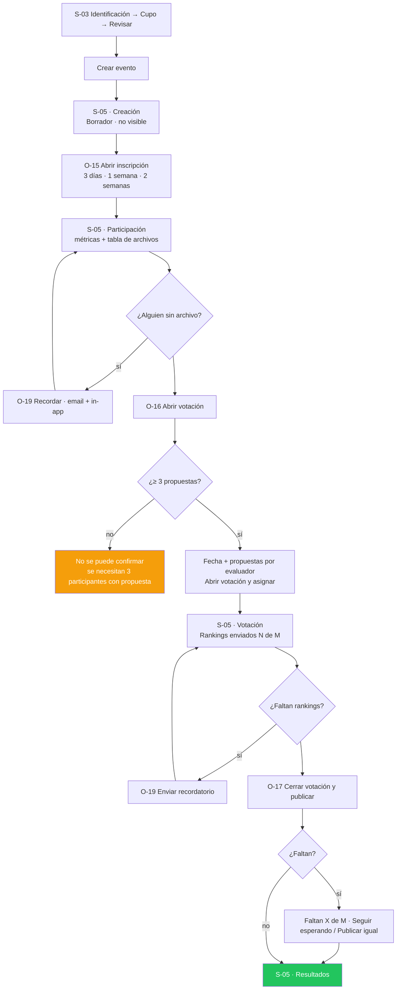

# Story Plan: S-014 (web) - Crear y editar evento

## Status

**Status:** Ready

## Story Reference

- **Story:** [S-014](../stories/S-014.crear-y-editar-evento.md)
- **Service:** web
- **Summary:** Reemplaza el formulario único de `CreateEventPage` (en inglés, CSS viejo, errores por
  substring de `err.message`) por un asistente de tres pasos — Identificación → Cupo → Revisar y
  crear — con vista previa en vivo, y agrega el diálogo `EditEventDialog` para corregir nombre,
  descripción, organizador y cupo en Creación y Participación vía `PATCH /api/v1/events/{event_id}`.
  Las reglas viven en `src/domain/eventForm.ts` y se comparten entre crear y editar; hasta S-016 el
  botón "Editar datos" se monta de forma provisoria en la `ManageEventPage` actual.

### Hallazgos del código que condicionan el plan

Relevados al planificar (no están en la documentación de la story, o la contradicen):

1. **Limitación de la api que el front no puede resolver.** El CHECK `future_start_date` de
   `events` se reevalúa en todo `UPDATE` (deuda técnica 10 de `docs/architectures/api/overview.md`,
   verificada por `TestEventUpdate_FutureStartDateCheckOnOldEvent`): `PATCH /events/{event_id}`
   responde `500 DB_UPDATE_ERROR` si `start_date` es anterior a ayer. Como la fecha automática de
   creación es "mañana", **editar un evento creado hace más de ~2 días falla**. El diálogo lo trata
   como error genérico ("No pudimos guardar los cambios. Inténtalo de nuevo.") y conserva los datos.
   No se corrige en esta story (decisión de producto pendiente en la api).
2. **Conteo de caracteres.** El backend cuenta runas (`utf8.RuneCountInString` en el PATCH; el
   validador de gin `min`/`max` del POST también cuenta runas); JS `.length` cuenta unidades UTF-16.
   `eventForm.ts` cuenta con `Array.from(value).length` (code points). El `maxLength` nativo del
   `TextField` (UTF-16) es más restrictivo, nunca más permisivo: no hace falta tocarlo.
3. **`organizer` en `EventDetail` nunca viene vacío**: si el evento no lo define, la api devuelve
   el nombre del autor. El diálogo precarga ese valor; si el usuario no lo toca, no se envía.
4. **Dato fabricado vigente.** `EventService.getEventById` y `EventService.createEvent` rellenan
   `organizer` con `"Organizador por determinar"` (y `createEvent` además inventa `status`,
   `voteCount`, `attachmentCount`, `max_participants || 20`). Es lo que REQ-001 prohíbe. Esta story
   reescribe `createEvent` y extrae un mapper `toEvent(raw)` compartido por `getEventById` y el
   nuevo `updateEvent`, sin ese texto (`organizer: raw.organizer ?? ''`).
5. **Los inscritos no incluyen al autor.** `GetEventParticipants` excluye el rol `creator`, y la
   api compara `max_participants` contra ese número. En el front, `Event.participant_ids` (de
   `getEventById`) ya es esa lista: el mínimo del cupo es `max(1, participant_ids.length)`.
6. **`max_participants` puede ser `null`** (columna nullable; la api usa 20 por defecto al
   inscribir). El diálogo precarga `event.max_participants ?? 20`, que es lo que hoy muestra la
   gestión (`event.max_participants || 20`).
7. **El DS prohíbe diálogos encadenados** (`dialog.md`, Don't). La confirmación "¿Descartar los
   cambios?" del diálogo de edición se resuelve **dentro** del mismo diálogo (D-8). La del asistente
   ("¿Descartar el evento?") sí es un `Dialog variant="alert"`, porque el asistente es una página.
8. **`CreateEventPage` hace su propio guard** (`useEffect` que navega a `/events` sin sesión) además
   de `RequireAuth`. Se elimina: `RequireAuth` ya cubre CA-8.
9. **`ManageEventPage` es legado** (texto en inglés, fuera de lint): solo se le agregan el botón
   provisorio, el diálogo y dos avisos, con texto del catálogo. El rediseño es S-016.
10. **`routes.test.tsx` mockea `./pages/create-event/CreateEventPage`** y ya prueba CA-8 (TS-46/48
    de S-011). El reemplazo mantiene ruta y archivo (`src/pages/create-event/CreateEventPage.tsx`),
    así que esos tests no cambian.
11. **Carpetas fuera de lint y de reglas estáticas.** `package.json` (`lint` y override de
    `react/jsx-no-literals`) y `static-rules.test.ts` listan carpetas una por una:
    `src/pages/create-event`, `src/components/events/event-preview` y
    `src/components/events/edit-event-dialog` se agregan explícitamente (Task 8).

### Decisiones tomadas al planificar

- **D-1 · Copy neutro.** Los screen.md están en voseo ("Revisá y creá", "Incluí", "Si lo dejás",
  "Podés", "definís", "Probá", "abrí"). El catálogo usa el español neutro de la tabla "Catálogo
  nuevo" (abajo), que es la fuente de verdad del texto. Se escribe **"inscritos"** (no
  "inscriptos", como dice CA-10), igual que el catálogo de S-013 (`events.table.registered`). El
  eyebrow "PASO N DE 3" se guarda en minúscula de oración y se pone en mayúsculas por CSS.
- **D-2 · Vista previa = tarjeta propia** (decidido con el usuario al planificar). Compuesto
  `components/events/event-preview/EventPreview` (`ev-event-preview`): `Card variant="default"`
  con `StatusPill` de `stagePill({ stage: 'participation', is_paused: false, is_cancelled: false })`
  ("Inscripción abierta", success + punto), nombre, descripción recortada a 2 líneas (CSS
  `-webkit-line-clamp`), "por {organizador}" y `ProgressBar size="sm" value={0} max={cupo}` con
  `label = events.table.capacity` ("0 / 20"). Sin botones. Todo el bloque es `aria-hidden="true"`.
  Organizador vacío → nombre del usuario en sesión ("Si lo dejas vacío se muestra tu nombre").
  Nombre vacío → "Nombre del evento"; descripción vacía → "La descripción aparecerá aquí." (ambos
  con `--text-muted`). No es la fila de `EventsTable` (que no muestra organizador): es una
  aproximación honesta de cómo se verá, alineada al screen.md.
- **D-3 · Validación compartida.** `validateEventForm(values, { minCapacity = 1, fields })` devuelve
  `FieldErrors<EventFormField>` (claves de traducción, mismo patrón que `domain/auth`). Mide sobre
  el valor **recortado** (`trim`) y con code points (hallazgo 2). Mensajes únicos para crear y
  editar (el screen.md de O-18 dice "entre 3 y 200"; el de S-03 separa mínimo y máximo: se usan los
  de S-03 en ambos).
- **D-4 · Cuándo se muestran los errores.** Al tocar "Siguiente" (o "Guardar cambios") se valida
  el paso; si hay errores se muestran y el foco va al **primer campo con error** (orden nombre →
  descripción → organizador → cupo). A partir de ese intento, los errores del paso se recalculan en
  cada cambio (`showErrors = true`). El botón nunca se deshabilita por validación.
- **D-5 · Indicador de pasos (gap aceptado "Wizard de pasos").** Inline en la página (`cev-steps`):
  `<nav aria-label="Pasos del asistente"><ol>` con 3 ítems. Paso anterior al actual = `<button>`
  "✓ {n} {nombre}" con nombre accesible "{nombre}, completado"; actual = `aria-current="step"` +
  texto "En curso"; posterior = texto pendiente. **Solo se navega hacia atrás** tocando el
  indicador; hacia adelante se avanza con "Siguiente" (que valida). En mobile (base) el `<ol>`
  queda visualmente oculto y se ve una barra de 3 segmentos + "Paso N de 3"; desde 768px se ven
  las etiquetas.
- **D-6 · Eyebrow en mobile.** "PASO N DE 3" (bloque 5) se oculta en mobile (`display: none` en la
  base, visible desde 768px) porque el indicador ya dice "Paso N de 3": mostrarlo dos veces
  seguidas es ruido. Los lectores de pantalla siguen recibiendo el paso por la región `role="status"`
  (D-7).
- **D-7 · Foco y anuncio al cambiar de paso.** El h2 del paso lleva `tabIndex={-1}` y recibe el foco
  después de cada cambio de paso (efecto sobre `step`, sin correr en el montaje inicial). Una región
  `role="status"` visualmente oculta anuncia "Paso {n} de 3, {nombre}".
- **D-8 · Descarte en el diálogo de edición.** Si hay cambios sin guardar y el usuario toca
  "Cancelar", × o Escape, el diálogo **no se cierra**: el cuerpo muestra un
  `Callout tone="warning" title="¿Descartar los cambios?"` y el pie cambia a "Seguir editando"
  (secondary) / "Descartar" (primary). "Seguir editando" vuelve al formulario con los datos;
  "Descartar" cierra. Sin cambios, cierra directo. Mientras guarda (`busy`) no se cierra (lo
  garantiza `Dialog`).
- **D-9 · Solo los campos cambiados.** `changedEventFields(initial, values)` compara los valores
  recortados y devuelve el body snake_case (`name`, `description`, `organizer`,
  `max_participants`). Si queda vacío, "Guardar cambios" cierra el diálogo **sin llamar a la api**
  y sin aviso.
- **D-10 · Errores al crear.** `DUPLICATE_EVENT_NAME` → vuelve al paso 1, error del campo nombre
  = `errors.DUPLICATE_EVENT_NAME` ("Ya existe un evento con este nombre. Elige otro.") y foco en el
  nombre; el error se borra al editar el nombre. El resto → `Callout tone="error"` en el paso 3 con
  `t(scopedMessageKeyForError(err, CREATE_EVENT_ERROR_CODES, 'createEvent.errors.generic'))`, con
  `CREATE_EVENT_ERROR_CODES = ['INVALID_PAYLOAD', 'INVALID_MAX_PARTICIPANTS',
  'MAX_PARTICIPANTS_LIMIT_EXCEEDED']`; red (`TypeError`) → `errors.network`. Los códigos de fecha
  (`PAST_START_DATE`, `DURATION_*`, …) los causa el front: van al genérico. Los datos se conservan.
- **D-11 · Errores al editar.** `400 MAX_PARTICIPANTS_BELOW_REGISTERED` → el mínimo del selector
  pasa a `err.details.current_count` (si es número) y el selector muestra
  "El cupo no puede ser menor a los {count} inscritos."; `409 DUPLICATE_EVENT_NAME` → error en el
  campo nombre; `409 INVALID_UPDATE_STAGE` → `Callout` error "El evento ya pasó a votación y sus
  datos no se pueden editar." y "Guardar cambios" deshabilitado; red → `errors.network` en el
  `Callout`; cualquier otro → "No pudimos guardar los cambios. Inténtalo de nuevo.". El diálogo
  queda abierto con los datos.
- **D-12 · Avisos en la gestión provisoria.** Éxito al crear → `navigate('/events/{id}/manage',
  { state: { notice: 'eventCreated' } })`. `ManageEventPage` lee `location.state?.notice`, muestra
  `Callout tone="success"` "Evento creado. Cuando esté listo, abre la inscripción." y limpia el state
  con `navigate(pathname, { replace: true, state: null })` (un reload no lo repite). Éxito al editar
  → `Callout tone="success"` "Datos actualizados." (estado local de la página).
- **D-13 · Cancelar el asistente.** "Con datos" = `hasEventFormData(values)`: algún texto no vacío
  tras `trim` o cupo ≠ 20. Sin datos → `navigate('/events')`. Con datos → `Dialog variant="alert"`
  título "¿Descartar el evento?", texto "Se perderá lo que cargaste." (`describedBy`), acciones
  "Seguir editando" (secondary, foco inicial vía `initialFocusRef`) / "Descartar" (primary →
  `/events`).
- **D-14 · Fecha automática.** Se mantiene (story: "la fecha automática que hoy envía
  `CreateEventPage` se mantiene"), pero en calendario local y en el dominio:
  `automaticEventDates(now) = { start_date: addDays(todayISO(now), 1), end_date: addDays(todayISO(now), 2) }`.
  Hoy se calculaba en UTC con `toISOString()`.
- **D-15 · Valores enviados al crear.** `name`, `description` y `organizer` recortados;
  `organizer` vacío se envía como `""` (la api cae al nombre del autor); `max_participants`
  siempre (1–100).
- **D-16 · Ubicación del código.** `src/domain/eventForm.ts` (+ test), reexportado en
  `src/domain/index.ts`; `src/pages/create-event/CreateEventPage.{tsx,css,test.tsx}` (prefijo
  `cev-`); `src/components/events/event-preview/EventPreview.{tsx,css,test.tsx}`
  (`ev-event-preview`); `src/components/events/edit-event-dialog/EditEventDialog.{tsx,css,test.tsx}`
  (`ev-edit-event-dialog`).

---

## Architectural Context

### Tech Stack

```
react 19.1.1            react-dom 19.1.1
react-router-dom 7.9.4  @react-oauth/google 0.13.4
react-scripts 5.0.1     typescript 4.9.5 (strict: true)
@testing-library/react 16.3.0     @testing-library/jest-dom 6.6.4
@testing-library/user-event 13.5.0  @testing-library/dom 10.4.1
```

Create React App, **no Next.js**: SPA client-side pura, sin SSR (ADR-006). `src/index.tsx` monta
`<App />` dentro de `<React.StrictMode>`.

### Service Architecture (convenciones del servicio, estado real tras S-010 … S-013)

**Estructura** (`project-structure`): organización por tipo técnico.

```
src/
├── App.tsx                 # AppRoutes (exportada para tests) + providers
├── components/ui/          # primitivos del DS (Button, TextField, Dialog, NumberStepper, …) — prefijo ui-
├── components/layout/      # chrome global (AppHeader, AppLayout, RequireAuth, …) — prefijo ly-
├── components/events/      # compuestos de dominio — prefijo ev-
│   ├── event-preview/      # NUEVO: EventPreview
│   └── edit-event-dialog/  # NUEVO: EditEventDialog
├── pages/{kebab-case}/     # pantallas montadas en una ruta
│   ├── create-event/       # REESCRITA: CreateEventPage (asistente) — prefijo cev-
│   └── manage-event/       # legado; solo integración provisoria
├── context/AuthContext.tsx # sesión
├── domain/                 # lógica pura + index.ts — NUEVO: eventForm.ts
├── i18n/                   # I18nProvider, useT, catálogos es/en, errores por code
├── services/api.ts         # servicios por dominio (EventService, UserService, …)
├── config/api.ts           # apiRequest, ApiError, API_CONFIG.ENDPOINTS
├── styles/tokens.css       # ÚNICA fuente de tokens del DS v2.0.0
└── test-utils/             # renderWithProviders, eventFixtures
```

- Carpeta `kebab-case`, componente `PascalCase`, **un componente por carpeta con su CSS al lado**.
- `export default` para el componente; tipos y helpers con export nombrado.
- Props tipadas en una `interface` arriba; `React.FC<Props>`.
- **Nada de `any`** en código nuevo; **nada de `console.log`** (solo `console.error` para errores reales).

**Routing** (`routing`, `src/App.tsx`, sin cambios en esta story):

```tsx
<Route element={<AppLayout />}>
  <Route path="/" element={<HomePage />} />
  <Route path="/events" element={<EventsListPage />} />
  <Route path="/my-events" element={<RequireAuth><MyEventsPage /></RequireAuth>} />
  <Route path="/events/create" element={<RequireAuth><CreateEventPage /></RequireAuth>} />
  <Route path="/events/:eventId/manage" element={<RequireAuth><ManageEventPage /></RequireAuth>} />
  <Route path="/events/:eventId" element={<EventDetailPageWrapper />} />
  <Route path="*" element={<NotFoundPage />} />
</Route>
```

- `RequireAuth` (S-011): espera `loading === false`; sin `user` →
  `<Navigate to={loginPathFor(pathname + search)} replace />` → CA-8 cubierto
  (`/events/create` → `/login?next=%2Fevents%2Fcreate`).
- Navegación imperativa con `useNavigate()`; state de navegación con `useLocation().state`.
- Las entradas al asistente ya existen: S-01 ("Crear un evento", "Crear mi primer evento"), S-02
  ("+ Crear evento") y S-11 ("+ Crear evento", "Crear evento").

**Auth** (`auth`): `useAuth()` → `{ user: User | null, isAuthenticated, loading, … }`;
`User { id, name, email, role, joinedEventIDs, createdEventIDs }`. El `401` se maneja globalmente
(ADR-008): **no agregar manejo de 401 en páginas**. En tests: `jest.mock('…/context/AuthContext')`
+ `renderWithProviders(ui, { auth })`.

**Obtención de datos** (`data-fetching`): `apiRequest` (BASE_URL, JWT, `ApiError`, 401 global) →
servicios de `src/services/api.ts` (mapean a tipos del front) → componente con `loading` / `error` /
dato; `setLoading(false)` en `finally`.

**Formularios** (`forms`, adaptado por el rediseño): inputs controlados con un solo objeto de
estado (`values`), `e.preventDefault()` en el submit, botón con `loading` mientras envía (sin doble
submit), validación manual antes de llamar a la api y la api como garantía final. Lo que la
convención marca como pendiente y esta story resuelve: **error por campo** (`TextField error`,
asociado por `aria-describedby`), **foco al primer error**, y error del formulario con
`role="alert"` (`Callout tone="error"`).

**Errores** (`error-handling`, DA-6): `apiRequest` lanza `ApiError { status, code?, details }`;
`details` trae los extras del body (`current_count`, `current_stage`). El texto del servidor
**nunca** se muestra: se traduce por `code` con `messageKeyForError` / `scopedMessageKeyForError`.

**Estilos** (`styling` + ADR-007 enmendado): CSS plano por componente, **solo tokens de
`src/styles/tokens.css`** (sin hex, sin `rgba()`, sin medidas que tengan token), **mobile-first**,
único corte `@media (min-width: 768px)`, nunca `max-width` en `@media`, clases con prefijo del
componente.

**Testing** (`testing`): `.test.tsx` al lado; consultas por rol/label/texto; `userEvent` v13
(síncrono); `findBy*` para lo asíncrono; `jest.mock('…/services/api')` (automock) y
`jest.mock('…/context/AuthContext')`. No sacar el `moduleNameMapper` de `package.json`.

```bash
cd web && CI=true npm test          # una corrida
cd web && npm run typecheck && npm run lint
```

### Relevant ADRs

Los ADRs del producto no tienen sección "Implementation Rules"; se copian la decisión y las reglas
que de ella se derivan.

- **ADR-006: Create React App en lugar de Next.js** — *Decisión:* "Create React App (`react-scripts`
  5.0.1) con react-router-dom 7.9.4. SPA client-side pura: sin SSR, sin file-based routing, sin Server
  Components. Todo el render ocurre en el navegador."
- **ADR-007: CSS plano con variables (enmienda REQ-003)** — reglas verbatim de la enmienda:
  - "**Una sola fuente de tokens:** `web/src/styles/tokens.css`, con los tokens del DS `web` v2.0.0."
  - "**Sin hex literales** en los componentes nuevos."
  - "**Lenguaje visual nuevo:** de glassmorphism oscuro a 'bandas oscuras + contenido claro'."
  - "**Breakpoints como escala nombrada** (`--bp-mobile: 768px` documentado; en `@media` se usa el
    literal) y **mobile-first** en los componentes nuevos."
  - "**Componentes en vez de sistemas de clases:** `web/src/components/ui/` con los primitivos del DS
    (`Button`, `TextField`, `Dialog`, `DataTable`, …) y compuestos de dominio en
    `web/src/components/{dominio}/`."
  - "**Prefijo de clase por componente** para evitar colisiones."
- **ADR-008: Manejo global de expiración de sesión por CustomEvent** — *Decisión:* "Ante un `401`,
  `apiRequest` limpia la sesión de `localStorage` y emite un `CustomEvent` llamado `auth:logout`.
  `AuthContext` registra un listener en `window` y, al recibirlo, actualiza su estado para desloguear
  al usuario sin recargar la página." → El asistente y el diálogo no manejan 401.
- **ADR-010: i18n propio sobre `Intl`** — *Decisión (verbatim):*
  - "`I18nProvider` (Context) y `useT()`."
  - "Catálogos `es.ts` y `en.ts`; **el tipo de `en` se deriva de `es`**, así una clave faltante no compila."
  - "Interpolación simple (`{name}`) y plurales con `Intl.PluralRules`."
  - "Errores de la api traducidos por `code` (`errors.<code>`), con fallback genérico; nunca se muestra `err.message`."
  - "Verificación: lint contra texto embebido en JSX en las carpetas nuevas y un test que rechaza formas de voseo en el catálogo `es`."
- **REQ-003 DA-5 (reglas de dominio en `src/domain/`)** — "Reglas de dominio del front en
  `src/domain/`, sin duplicar las del backend. … El front define nombres/orden/siguiente etapa,
  validación … formato de fechas … **No recalcula**" → los rangos de `eventForm.ts` son **iguales**
  a los del backend (feedback rápido); la api sigue siendo la garantía (cupo vs. inscritos,
  nombre único).
- **REQ-003 DA-6** — "`ApiError` conserva `code` y la web traduce por `code` … Los componentes
  muestran `t('errors.' + code)` con fallback genérico; nunca `err.message`. Elimina los
  `err.message.includes(...)`." → se borran los `includes('DUPLICATE_EVENT_NAME')` /
  `includes('INVALID_PAYLOAD')` de la página vieja.

### API Context

Sin endpoints nuevos. Ambos requieren JWT (`Authorization: Bearer`, lo agrega `apiRequest`).

#### `POST /api/v1/events` — crear (sin cambios)

"El autor sale siempre del JWT. El campo `author_id` del body existe en el struct pero **nunca se
lee**. El envelope de respuesta es `event`, no `data`."

```yaml
requestBody:
  required: [name, description, start_date, end_date]
  name: { type: string, minLength: 3, maxLength: 200 }
  description: { type: string, minLength: 10, maxLength: 2000 }
  start_date: { type: string, format: date, description: 'Formato YYYY-MM-DD. No puede ser pasada' }
  end_date: { type: string, format: date, description: 'Formato YYYY-MM-DD. Duración entre 1 y 365 días' }
  organizer: { type: string }
  max_participants: { type: integer, minimum: 1, maximum: 100, default: 20, nullable: true }
201:
  event:
    id: string(uuid)
    name: string
    description: string
    start_date: string(date)
    end_date: string(date)
    organizer: string
    shareable_link: string          # '/events/3fa85f64-…'
    max_participants: integer|null
    stage: Stage                    # 'creation'
    author_id: string(uuid)
    created_at: string(date-time)
  message: 'Event created successfully'
  code: EVENT_CREATED
400: INVALID_PAYLOAD, INVALID_START_DATE, INVALID_END_DATE, PAST_START_DATE, INVALID_DATE_RANGE,
     DURATION_TOO_SHORT, DURATION_TOO_LONG, INVALID_MAX_PARTICIPANTS,
     MAX_PARTICIPANTS_LIMIT_EXCEEDED, VALIDATION_FAILED
401: UNAUTHORIZED, USER_NOT_FOUND
409: DUPLICATE_EVENT_NAME           # comparación exacta de name contra todos los eventos
500: INVALID_TOKEN, DB_CREATE_ERROR
```

Ejemplo (para mocks):

```json
{ "event": { "id": "e-9", "name": "Concurso de afiches", "description": "Diseña el afiche del festival",
  "start_date": "2026-10-06", "end_date": "2026-10-07", "organizer": "Club de Diseño",
  "shareable_link": "/events/e-9", "max_participants": 20, "stage": "creation",
  "author_id": "u-1", "created_at": "2026-10-05T12:00:00Z" },
  "message": "Event created successfully", "code": "EVENT_CREATED" }
```

#### `PATCH /api/v1/events/{event_id}` — editar datos (S-008)

"Solo el autor (`RequireEventOwner`) y solo en `creation` o `participation`. Al menos un campo. Las
fechas no se editan acá." Orden de validaciones del handler: id → body (`400 INVALID_PAYLOAD`) →
evento (`404`) → etapa (`409`) → cupo (`400`) → nombre único (`409`) → `UPDATE`. "Reenviar el nombre
propio no es conflicto. `max_participants` se compara con los inscriptos sin contar al autor."

```yaml
requestBody (minProperties: 1):
  name: { type: string, minLength: 3, maxLength: 200 }
  description: { type: string, minLength: 10, maxLength: 2000 }
  organizer: { type: string, maxLength: 200 }
  max_participants: { type: integer, minimum: 1, maximum: 100, description: 'No puede ser menor a los inscriptos' }
200:
  data: EventDetail
  message: 'Event updated successfully'
  code: EVENT_UPDATED
400: INVALID_PAYLOAD, MAX_PARTICIPANTS_BELOW_REGISTERED (+ current_count: integer)
401: middleware (forma B)
403: middleware (forma B: { error: FORBIDDEN, message })
404: EVENT_NOT_FOUND (no-admin + inexistente: forma B 404 { error: NOT_FOUND })
409: INVALID_UPDATE_STAGE (+ current_stage: string), DUPLICATE_EVENT_NAME
500: PARTICIPANT_CHECK_ERROR, DB_UPDATE_ERROR, RETRIEVAL_ERROR   # DB_UPDATE_ERROR: ver hallazgo 1

EventDetail = EventListItem + { organizer: string ("Si el evento no define organizador, cae al
nombre del autor"), attachment_count: integer }
EventListItem: id, name, description, start_date(date), end_date(date), stage, author_id,
  max_participants(integer|null), participation_estimated_end_date(date|null),
  voting_estimated_end_date(date|null), participant_ids[uuid], participants_count, is_cancelled,
  is_paused, created_at, updated_at
```

Ejemplos de error (body → `ApiError`):

```json
{ "error": "max_participants cannot be lower than the registered participants",
  "code": "MAX_PARTICIPANTS_BELOW_REGISTERED", "current_count": 12 }
→ ApiError { status: 400, code: 'MAX_PARTICIPANTS_BELOW_REGISTERED', details: { current_count: 12 } }

{ "error": "Event can only be updated during creation or participation stage",
  "code": "INVALID_UPDATE_STAGE", "current_stage": "voting" }
→ ApiError { status: 409, code: 'INVALID_UPDATE_STAGE', details: { current_stage: 'voting' } }
```

#### Servicios (Task 2)

```ts
// src/types/index.ts (nuevos)
export interface EventCreateInput {
  name: string;
  description: string;
  organizer: string;
  max_participants: number;
}
export type EventUpdate = Partial<EventCreateInput>;   // body del PATCH, solo lo que cambió

// src/services/api.ts
EventService.createEvent(input: EventCreateInput, now?: Date): Promise<{ id: string }>
//   POST API_CONFIG.ENDPOINTS.EVENTS con { ...input, ...automaticEventDates(now) }.
//   Devuelve { id: response.event.id }. Sin console.log, sin campos inventados; relanza errores.
EventService.updateEvent(eventId: string, changes: EventUpdate): Promise<Event>
//   PATCH `${API_CONFIG.ENDPOINTS.EVENTS}/${eventId}` con JSON.stringify(changes) → toEvent(response.data).
// toEvent(raw): Event — mapper privado, usado también por getEventById (mismo mapeo que hoy salvo
//   organizer: raw.organizer ?? '' — sin "Organizador por determinar").
```

`Event` (front, existente): `id`, `title` (= `name`), `description`, `stage`, `date`, `organizer?`,
`max_participants?`, `participant_ids?`, `creator_id?`, `is_paused?`, `is_cancelled?`,
`created_at?`, `updated_at?`, `participation_estimated_end_date?`, `voting_estimated_end_date?`.

### Dominio nuevo — `src/domain/eventForm.ts` (Task 1)

```ts
export const EVENT_NAME_MIN = 3;
export const EVENT_NAME_MAX = 200;
export const EVENT_DESCRIPTION_MIN = 10;
export const EVENT_DESCRIPTION_MAX = 2000;
export const EVENT_ORGANIZER_MAX = 200;
export const EVENT_CAPACITY_MIN = 1;
export const EVENT_CAPACITY_MAX = 100;
export const EVENT_CAPACITY_DEFAULT = 20;

export interface EventFormValues { name: string; description: string; organizer: string; maxParticipants: number }
export type EventFormField = keyof EventFormValues;
export const EVENT_FORM_FIELDS: readonly EventFormField[] = ['name', 'description', 'organizer', 'maxParticipants'];
export const EMPTY_EVENT_FORM: EventFormValues = { name: '', description: '', organizer: '', maxParticipants: 20 };

export const charCount = (value: string): number => Array.from(value).length;
export const minCapacityFor = (registered: number): number => Math.max(EVENT_CAPACITY_MIN, registered);
export const canEditEvent = (stage: EventStage): boolean => stage === 'creation' || stage === 'participation';

export const validateEventForm = (
  values: EventFormValues,
  options?: { minCapacity?: number; fields?: readonly EventFormField[] }
): FieldErrors<EventFormField>;
//   name: charCount(trim) < 3 → 'eventForm.validation.nameMin'; > 200 → 'eventForm.validation.nameMax'
//   description: < 10 → 'eventForm.validation.descriptionMin'; > 2000 → 'eventForm.validation.descriptionMax'
//   organizer: > 200 → 'eventForm.validation.organizerMax'
//   maxParticipants: no entero, < minCapacity o > 100 → 'eventForm.validation.capacityRange'
//     (si minCapacity > 1 y valor < minCapacity → 'eventForm.validation.capacityBelowRegistered')
//   Solo valida `fields` (default: todos). Sin errores → {}.

export const toEventInput = (values: EventFormValues): EventCreateInput;   // trims → snake_case
export const changedEventFields = (initial: EventFormValues, values: EventFormValues): EventUpdate;
export const hasEventFormData = (values: EventFormValues): boolean;
export const automaticEventDates = (now?: Date): { start_date: string; end_date: string };
```

`FieldErrors<K>` es el tipo existente de `src/domain/auth.ts`. `todayISO` y `addDays` vienen de
`src/domain/dates.ts`.

### Catálogo nuevo (fuente de verdad del texto, D-1)

Namespaces nuevos `eventForm`, `createEvent`, `editEvent` y `manageEvent` en
`src/i18n/catalogs/es.ts` y `en.ts`. Español neutro (sin voseo, sin marcas de género). Las claves
`plural(...)` usan `count`.

| Clave | es | en |
|---|---|---|
| `eventForm.nameLabel` | Nombre del evento | Event name |
| `eventForm.namePlaceholder` | Ej. Concurso de fotografía primavera 2026 | E.g. Spring photo contest 2026 |
| `eventForm.nameHelp` | Es lo primero que verán en la lista de eventos. | It's the first thing people see in the events list. |
| `eventForm.descriptionLabel` | Descripción | Description |
| `eventForm.descriptionHelp` | Incluye qué deben enviar y cómo se evalúa. | Include what to submit and how it's evaluated. |
| `eventForm.organizerLabel` | Organizador | Organizer |
| `eventForm.optional` | (opcional) | (optional) |
| `eventForm.organizerPlaceholder` | Ej. Club de Fotografía | E.g. Photography Club |
| `eventForm.organizerHelp` | Si lo dejas vacío se muestra tu nombre. | If you leave it empty, your name is shown. |
| `eventForm.capacityLabel` | Cupo de participantes | Participant limit |
| `eventForm.capacityLabelShort` | Cupo | Limit |
| `eventForm.capacityRange` | Entre 1 y 100 | Between 1 and 100 |
| `eventForm.capacityMin` | plural: `Mínimo {count}: ya hay {count} inscrito.` / `Mínimo {count}: ya hay {count} inscritos.` | plural: `Minimum {count}: {count} person is already registered.` / `Minimum {count}: {count} people are already registered.` |
| `eventForm.capacityDecrement` | Restar uno al cupo | Decrease limit |
| `eventForm.capacityIncrement` | Sumar uno al cupo | Increase limit |
| `eventForm.validation.nameMin` | El nombre tiene que tener al menos 3 caracteres. | The name must have at least 3 characters. |
| `eventForm.validation.nameMax` | El nombre puede tener hasta 200 caracteres. | The name can have up to 200 characters. |
| `eventForm.validation.descriptionMin` | La descripción tiene que tener al menos 10 caracteres. | The description must have at least 10 characters. |
| `eventForm.validation.descriptionMax` | La descripción puede tener hasta 2000 caracteres. | The description can have up to 2000 characters. |
| `eventForm.validation.organizerMax` | Puede tener hasta 200 caracteres. | It can have up to 200 characters. |
| `eventForm.validation.capacityRange` | El cupo tiene que estar entre 1 y 100. | The limit must be between 1 and 100. |
| `eventForm.validation.capacityBelowRegistered` | plural: `El cupo no puede ser menor a {count} inscrito.` / `El cupo no puede ser menor a los {count} inscritos.` | plural: `The limit can't be lower than the {count} registered person.` / `The limit can't be lower than the {count} registered people.` |
| `createEvent.breadcrumbLabel` | Ruta de navegación | Breadcrumb |
| `createEvent.breadcrumbEvents` | Eventos | Events |
| `createEvent.title` | Crear evento | Create event |
| `createEvent.stepsLabel` | Pasos del asistente | Wizard steps |
| `createEvent.steps.identification` | Identificación | Details |
| `createEvent.steps.capacity` | Cupo | Limit |
| `createEvent.steps.review` | Revisar y crear | Review and create |
| `createEvent.stepCurrent` | En curso | In progress |
| `createEvent.stepCompleted` | {name}, completado | {name}, completed |
| `createEvent.stepOf` | Paso {number} de 3 | Step {number} of 3 |
| `createEvent.stepAnnouncement` | Paso {number} de 3, {name} | Step {number} of 3, {name} |
| `createEvent.questions.identification` | ¿De qué se trata tu evento? | What is your event about? |
| `createEvent.questions.capacity` | ¿Cuántas personas pueden participar? | How many people can take part? |
| `createEvent.questions.review` | Revisa y crea tu evento | Review and create your event |
| `createEvent.capacityHelp` | Cuando se completa el cupo nadie más puede inscribirse. Puedes cambiarlo mientras la inscripción esté abierta. | Once the limit is reached, nobody else can sign up. You can change it while registration is open. |
| `createEvent.review.name` | Nombre | Name |
| `createEvent.review.description` | Descripción | Description |
| `createEvent.review.organizer` | Organizador | Organizer |
| `createEvent.review.capacity` | Cupo | Limit |
| `createEvent.review.capacityValue` | plural: `{count} participante` / `{count} participantes` | plural: `{count} participant` / `{count} participants` |
| `createEvent.review.organizerFallback` | {name} (tu nombre) | {name} (your name) |
| `createEvent.review.edit` | Editar | Edit |
| `createEvent.review.editField` | Editar {field} | Edit {field} |
| `createEvent.visibilityNotice` | El evento se crea en etapa Creación: nadie más puede verlo hasta que abras la inscripción. La fecha de cierre la defines en ese momento. | The event is created in the Creation stage: nobody else can see it until you open registration. You set the closing date at that point. |
| `createEvent.preview.title` | Vista previa en la lista | Preview in the list |
| `createEvent.preview.namePlaceholder` | Nombre del evento | Event name |
| `createEvent.preview.descriptionPlaceholder` | La descripción aparecerá aquí. | The description will appear here. |
| `createEvent.preview.by` | por {organizer} | by {organizer} |
| `createEvent.tipTitle` | Consejo | Tip |
| `createEvent.tip` | Los eventos con criterios de evaluación claros reciben votos más consistentes. | Events with clear evaluation criteria get more consistent votes. |
| `createEvent.errors.generic` | No pudimos crear el evento. Inténtalo de nuevo. | We couldn't create the event. Please try again. |
| `createEvent.cancel` | Cancelar | Cancel |
| `createEvent.back` | ← Atrás | ← Back |
| `createEvent.nextCapacity` | Siguiente: Cupo → | Next: Limit → |
| `createEvent.nextReview` | Siguiente: Revisar → | Next: Review → |
| `createEvent.submit` | Crear evento | Create event |
| `createEvent.submitting` | Creando evento… | Creating event… |
| `createEvent.discard.title` | ¿Descartar el evento? | Discard the event? |
| `createEvent.discard.text` | Se perderá lo que cargaste. | What you entered will be lost. |
| `createEvent.discard.keep` | Seguir editando | Keep editing |
| `createEvent.discard.confirm` | Descartar | Discard |
| `createEvent.discard.close` | Cerrar | Close |
| `editEvent.title` | Editar datos del evento | Edit event details |
| `editEvent.close` | Cerrar | Close |
| `editEvent.cancel` | Cancelar | Cancel |
| `editEvent.save` | Guardar cambios | Save changes |
| `editEvent.saving` | Guardando… | Saving… |
| `editEvent.errors.generic` | No pudimos guardar los cambios. Inténtalo de nuevo. | We couldn't save the changes. Please try again. |
| `editEvent.errors.stageLocked` | El evento ya pasó a votación y sus datos no se pueden editar. | The event has moved to voting and its details can no longer be edited. |
| `editEvent.discard.title` | ¿Descartar los cambios? | Discard the changes? |
| `editEvent.discard.keep` | Seguir editando | Keep editing |
| `editEvent.discard.confirm` | Descartar | Discard |
| `manageEvent.editData` | Editar datos | Edit details |
| `manageEvent.created` | Evento creado. Cuando esté listo, abre la inscripción. | Event created. When it's ready, open registration. |
| `manageEvent.updated` | Datos actualizados. | Details updated. |

Errores ya existentes que se usan: `errors.DUPLICATE_EVENT_NAME` ("Ya existe un evento con este
nombre. Elige otro."), `errors.INVALID_PAYLOAD`, `errors.INVALID_MAX_PARTICIPANTS`,
`errors.MAX_PARTICIPANTS_LIMIT_EXCEEDED`, `errors.network` ("No pudimos conectar con el servidor.
Revisa tu conexión e inténtalo de nuevo."). Etiquetas reutilizadas: `events.pill.participation`,
`events.table.capacity` ("{count} / {max}"), `events.table.capacityText`.

### Database Context

Ninguno: la story no toca base de datos.

### Flow Context

Flujo `edicion-y-visibilidad-del-evento` (`docs/flows/edicion-y-visibilidad-del-evento.md`, stories
S-008 y S-014). Esta story implementa **el lado web del Paso 3**; los pasos 1 y 2 (auth opcional,
ocultar `creation`) ya los consume S-013. Verbatim:

> ### Paso 3: Editar datos
>
> **Origen:** `web` (`EditEventDialog`) · **Destino:** `api` · **Tipo:** REST
>
> - **Método:** PATCH
> - **Endpoint:** `/api/v1/events/{event_id}`
> - **Auth:** JWT Bearer — solo el autor (`RequireEventOwner`)
> - **Body** (al menos uno):
>   ```json
>   {
>     "name": "string — 3..200",
>     "description": "string — 10..2000",
>     "organizer": "string — 0..200",
>     "max_participants": "integer — 1..100, >= inscriptos"
>   }
>   ```
> - **Response 200:** `{ "data": "EventDetail", "message": "string", "code": "EVENT_UPDATED" }`
>
> **Operación de BD:** `UPDATE events` vía `EventRepository.Update`. Las fechas no se editan acá.
>
> Orden de validaciones: id → body (`400 INVALID_PAYLOAD`) → evento (`404 EVENT_NOT_FOUND`) →
> etapa (`409`) → cupo (`400`) → nombre único (`409`) → `UPDATE`. Reenviar el nombre propio no es
> conflicto. `max_participants` se compara con los inscriptos sin contar al autor.
>
> > **Limitación conocida:** el CHECK `future_start_date` se reevalúa en todo `UPDATE` de la fila,
> > así que editar un evento con `start_date` anterior a ayer responde `500 DB_UPDATE_ERROR`.
>
> | Paso | Condición | Respuesta | Qué ve el usuario |
> |---|---|---|---|
> | 3 | Payload vacío o fuera de rango | `400 INVALID_PAYLOAD` | Motivo junto al campo |
> | 3 | Cupo menor a inscriptos | `400 MAX_PARTICIPANTS_BELOW_REGISTERED` (+ `current_count`) | "El cupo no puede ser menor a los inscriptos" |
> | 3 | Etapa `voting` o `results` | `409 INVALID_UPDATE_STAGE` (+ `current_stage`) | La acción no se ofrece; si llega, mensaje traducido |
> | 3 | Nombre repetido | `409 DUPLICATE_EVENT_NAME` | Mensaje traducido |
> | 3 | No es el autor | 403 | — |
>
> **Estado resultante:** `events.name`, `description`, `organizer`, `max_participants` actualizados;
> se reflejan en detalle, listado y notificaciones (que muestran el nombre vigente).

Flujo de interacción de la story (verbatim de S-014):

> **Escenario: Editar datos (CA-9, CA-10)** — **Trigger:** el organizador toca "Editar datos" en la gestión.
> 1. **[web — `EditEventDialog`]** precarga los datos y fija el mínimo del cupo en los inscriptos.
> 2. **[web]** "Guardar" → `PATCH /events/{event_id}` solo con los campos cambiados.
> 3. **[api]** `200 { data: EventDetail, code: EVENT_UPDATED }`.
> 4. **[web]** cierra el diálogo y actualiza el evento en pantalla.
>
> **Manejo de errores:** `400 MAX_PARTICIPANTS_BELOW_REGISTERED`, `409 INVALID_UPDATE_STAGE`,
> `409 DUPLICATE_EVENT_NAME` → aviso traducido en el diálogo, que queda abierto con los datos.

"Se reflejan en detalle y listado": `EventDetailPage` y `EventsListPage` piden el evento al montar
(sin caché), así que ven los datos nuevos sin cambios. La gestión los ve por `onSaved` (Task 7).

### Integration Points

- Sin servicios externos, colas ni otros servicios internos. Solo la api propia por `apiRequest`.

### Code Conventions

- Archivos: `src/domain/eventForm.ts` + `eventForm.test.ts`;
  `src/pages/create-event/CreateEventPage.{tsx,css,test.tsx}`;
  `src/components/events/event-preview/EventPreview.{tsx,css,test.tsx}`;
  `src/components/events/edit-event-dialog/EditEventDialog.{tsx,css,test.tsx}`.
- Clases CSS: `cev-*`, `ev-event-preview*`, `ev-edit-event-dialog*`. Solo tokens.
- Todo el texto visible por `t('eventForm.…' | 'createEvent.…' | 'editEvent.…' | 'manageEvent.…' |
  'events.…' | 'errors.…')`; las carpetas nuevas entran en `react/jsx-no-literals` (Task 8).
- Lógica pura en `src/domain/eventForm.ts`, reexportada en `src/domain/index.ts`.

### Reusable Code

**Componentes** (re-exportados en `src/components/ui/index.ts`):

- **TextField** (`src/components/ui/text-field/TextField.tsx`) — `forwardRef` (para el foco al
  primer error). Props: `variant: 'text'|'multiline'|'search'`, `label`, `required` (asterisco
  `aria-hidden` + `aria-required`), `optional` + `optionalLabel`, `help`, `error` (reemplaza a
  `help`, `aria-invalid` + `aria-describedby`), `maxLength` (en `multiline` muestra el contador
  "{n} / {max}", `aria-live` desde el 90%), `placeholder`, `name`, `value`, `onChange`, `disabled`.
  ```tsx
  <TextField ref={refs.description} variant="multiline" name="description" required
    label={t('eventForm.descriptionLabel')} help={t('eventForm.descriptionHelp')}
    error={errors.description && t(errors.description)} maxLength={EVENT_DESCRIPTION_MAX}
    value={values.description} onChange={handleChange} />
  ```
- **NumberStepper** (`src/components/ui/number-stepper/NumberStepper.tsx`) — `value`, `min`, `max`,
  `label`, `help`, `error`, `rangeError` (texto si se tipea fuera de rango), `decrementLabel`,
  `incrementLabel`, `disabled`, `onChange(n)`. Los botones − / + se deshabilitan en `min` / `max`;
  un valor tipeado fuera de rango no llama a `onChange` (muestra `rangeError`) y al salir vuelve al
  último válido.
- **Dialog** (`src/components/ui/dialog/Dialog.tsx`) — `open`, `onClose`, `variant: 'default'|'alert'`,
  `size: 'sm'|'md'` (md = 560px desde 768px; en mobile pantalla completa), `title`, `busy` (no cierra
  con Escape/backdrop/×), `actions`, `closeLabel`, `describedBy`, `initialFocusRef`, `children`.
  Portal en `document.body`, foco atrapado, resto `inert`, foco vuelve al disparador. Foco inicial:
  primer foco no-× (en O-18 = Campo nombre).
- **Button** (`src/components/ui/button/Button.tsx`) — `variant: 'primary'|'secondary'|'tertiary'|'onBand'|'icon'`,
  `size`, `loading`, `loadingLabel` (texto visible mientras carga), `disabled`, `fullWidth`, `type`,
  `onClick`, `aria-*`. `forwardRef`.
- **Callout** (`src/components/ui/callout/Callout.tsx`) — `tone: 'info'|'warning'|'error'|'success'`,
  `title?`, `id?`, `action?`, `children`. `tone="error"` ⇒ `role="alert"`.
- **Card** (`src/components/ui/card/Card.tsx`) — `variant: 'default'|'subtle'|'raised'|'feature'|'interactive'`,
  `padding`, `as`, `eyebrow?`, `title?`, `headingLevel?`, `className?`, `children`.
- **StatusPill** (`src/components/ui/status-pill/StatusPill.tsx`) — `tone`, `size: 'sm'|'md'`,
  `icon: 'dot'|'check'|'none'`, `children`.
- **ProgressBar** (`src/components/ui/progress-bar/ProgressBar.tsx`) — `value`, `max`, `tone`,
  `size: 'sm'|'md'`, `label?`, `valueText?`.
- **Icons** (`src/components/ui/icons/Icons.tsx`) — `CheckIcon`, `CloseIcon`, `MinusIcon`,
  `PlusIcon`, `DotIcon`… ("←" / "→" van en el texto del catálogo).
- **visually-hidden** (`src/components/ui/visually-hidden.css`) — clase `ui-visually-hidden`.
- **RequireAuth** / **AppLayout** — ya montan guard, header, `<main id="main">` y pie.

**Utils:**

- **domain/auth** (`src/domain/auth.ts`): tipo `FieldErrors<K>` y el patrón `compact(...)` a imitar.
- **domain/dates** (`src/domain/dates.ts`): `todayISO(now?)`, `addDays(date, days)`.
- **domain/events** (`src/domain/events.ts`): `stagePill(e)` → `{ key, tone, icon }`.
- **domain/stages**: `stageNameKey(stage)`.
- **i18n** (`src/i18n/index.ts`, `src/i18n/errors.ts`): `useT()` → `{ t, locale, fmt }`; `plural()`;
  `messageKeyForError(err)`, `scopedMessageKeyForError(err, codes, fallback)`.
- **ApiError / getErrorCode** (`src/config/api.ts`): en tests,
  `new ApiError({ status: 409, body: { error: 'x', code: 'DUPLICATE_EVENT_NAME' } })`.

**Patrón de foco al primer error ya implementado:** `src/pages/register/RegisterPage.tsx` (refs por
campo y `refs[firstInvalid].current?.focus()`).

**Test utils:** `renderWithProviders(ui, { locale?, auth?, route?, initialEntry? })` (I18nProvider +
MemoryRouter + `<LocationDisplay />` con `data-testid="location"`); `sampleUser` (`id: 'u-1'`,
`name: 'Ana Pérez'`); `src/test-utils/eventFixtures.ts` (`listItem`, `myEvent`, `page`).

**Estilos:** `src/styles/tokens.css` — semánticos a usar: `--bg-canvas`, `--bg-surface`,
`--bg-surface-subtle`, `--bg-disabled`, `--text-primary`, `--text-secondary`, `--text-muted`,
`--text-action`, `--border-default`, `--space-stack-sm|md|lg`, `--space-inline-sm|md`,
`--space-padding-compact|default|spacious`, `--type-heading-l|m|s`, `--type-body`, `--type-ui`,
`--type-caption`, `--type-eyebrow`, `--type-tracking-wide`, `--radius-surface`, `--radius-pill`,
`--bg-success-subtle`. Lista completa en "Design System Context".

### Wireframes / Screens

**Superficie:** `web` · **Plataforma:** `web` · **Viewports de la superficie:** `desktop` (≥ 768px,
frame 1200px; el diálogo, 560px) y `mobile` (base, frame 400px; CA-12 verifica a 375px). Cada pantalla
tiene que cumplir los dos layouts. **Breakpoint** (DS `grid.md`): `bp.desktop = 768px`, siempre
`@media (min-width: 768px)`.

**Pantallas que toca la story:**

| Pantalla | Ruta | Archivo en el servicio |
|---|---|---|
| S-03 Crear evento | `/events/create` | `src/pages/create-event/CreateEventPage.tsx` (reescrita) |
| O-18 Editar datos (modal sobre S-05) | `/events/:eventId/manage` | `src/components/events/edit-event-dialog/EditEventDialog.tsx` (nuevo) |

> El microcopy de los screen.md está en voseo; el texto que se implementa es el de "Catálogo nuevo"
> (D-1). Lo que sigue se copia verbatim como especificación de estructura, layout, estados e
> interacciones.

#### Contexto de navegación de la superficie (product-map, verbatim)

###### Chrome global


Presente en todas las pantallas salvo las de auth (S-06 a S-10), que usan el layout dividido sin
barra de navegación.

| Elemento | Sin sesión | Con sesión | Destino |
|---|---|---|---|
| Logo `TELESCOPIO` | ✓ | ✓ | `/` |
| `Inicio` | ✓ | ✓ | `/` |
| `Eventos` | ✓ | ✓ | `/events` |
| `Cómo funciona` | ✓ | ✓ | `/#como-funciona` (sección de S-01) |
| Selector de idioma `ES / EN` | ✓ en la barra | dentro del menú de usuario | cambia el idioma sin recargar |
| `Iniciar sesión` / `Crear cuenta` | ✓ | — | S-07 / S-08 |
| Campana con contador | — | ✓ | desktop: abre O-13 · mobile: navega a S-12 |
| Menú de usuario (iniciales + nombre) | — | ✓ | `Mis eventos`, `Idioma`, `Notificaciones`, `Cerrar sesión` |

En `mobile` las entradas de navegación (`Inicio`, `Eventos`, `Cómo funciona`) pasan a un menú
desplegable; la campana y el avatar quedan visibles en la barra. `[fuente: REQ-003 RF 9, AC 6]`

###### Rutas y acceso


| Ruta | Acceso | Sin acceso |
|---|---|---|
| `/`, `/events`, `/events/:id`, `/login`, `/register`, `/forgot-password`, `/reset-password`, `*` | Público | — |
| `/complete-profile` | Flujo Google | redirige a `/` |
| `/events/create`, `/my-events`, `/notifications` | Con sesión | `/login?next=<ruta>` (AC 33) |
| `/events/:id/manage` | Con sesión + autor | sin sesión → `/login?next=…`; no autor → estado "sin permiso" en S-05 (AC 32) |

###### El contenido de S-05 depende de la etapa


| Etapa | Próximo paso destacado | Acción secundaria |
|---|---|---|
| `creation` | Abrir inscripción (O-15) con checklist | Editar datos, Pausar |
| `participation` | Pasar a votación (O-16) con consecuencias | Recordar (N), Editar datos, Pausar |
| `voting` | Publicar resultados (O-17), como contorno | Enviar recordatorio a N pendientes, Pausar |
| `results` | — (resultados como en S-04) | Compartir |

###### Inventario de Overlays (filtrado: O-18)

| # | Overlay | Tipo | Trigger | Propósito |
|---|---|---|---|---|
| O-18 | Editar datos del evento | modal | S-05 · "Editar datos" | Nombre, descripción, organizador y cupo en Creación y Participación (RF 17) |

#### Flujo de usuario relevante (user-flows, verbatim)

###### UF-03 — Conducir el evento de principio a fin

**Audiencia:** organizador · **Resuelve:** JTBD-01, JTBD-02 y JTBD-03 (abrir, conducir, publicar)
**Pantallas:** S-03 → S-05 → O-15, O-16, O-17, O-18, O-19, O-07 · **Flujos técnicos:**
[`avance-de-etapa`](../../../flows/avance-de-etapa-del-evento.md),
[`configuracion-y-generacion-de-asignaciones`](../../../flows/configuracion-y-generacion-de-asignaciones.md)
**Trigger:** "+ Crear evento" en S-02 o "Crear un evento" en S-01.



**Pasos (happy path):**
1. Crea el evento en 3 pasos con vista previa; queda en Creación, invisible para los demás.
2. Abre la inscripción eligiendo un atajo de duración; el evento pasa a ser público.
3. Sigue inscriptos y archivos; recuerda a quien falta.
4. Abre la votación en un solo diálogo; se asignan propuestas solo a quienes subieron archivo.
5. Sigue "Rankings enviados N de M"; recuerda a los pendientes.
6. Publica (con aviso si faltan rankings); ve el resultado como lo ve cualquiera.

**Acciones laterales:** "Editar datos" (O-18) en Creación y Participación; "editar" el cierre (O-07, solo posponer); "Pausar evento".

###### Caminos no felices

| Situación | Qué ve el organizador |
|---|---|
| Menos de 3 participantes con propuesta | En O-16: "Se necesitan al menos 3 participantes con propuesta para abrir la votación." y confirmar deshabilitado |
| Propuestas por evaluador al máximo | El "+" se deshabilita y se lee "máximo N" |
| Umbrales inválidos | En O-16: "El umbral confiable tiene que superar al poco confiable por al menos 0,1." |
| Cierre anterior al actual | En O-07: "El cierre solo se puede posponer." |
| Cupo menor a los inscriptos | En O-18: "El cupo no puede ser menor a los N inscriptos." |
| Sin pendientes | El botón de recordatorio no se muestra |
| Falla una carga de la gestión | En ese bloque: "No pudimos cargar los participantes." + "Reintentar"; avanzar queda deshabilitado (REQ-001) |
| No es el autor | "No tenés permiso para gestionar este evento." + "Ir a Eventos" |
| Sin sesión | `/login?next=…` y vuelta a la gestión |

**Estado final:** evento en Resultados con ranking calculado y público.
**Criterio de éxito:** cada etapa tiene un único paso destacado y sus consecuencias se leen antes de confirmar (AC 16–24, 35–39).


#### S-03 · `create-event.md` (verbatim)


##### Pantalla: Crear evento (S-03)

###### Identidad

- **Audiencia primaria:** [organizador](../../../audiences/organizador/research-context.md)
- **JTBD / Propósito:** dejar armado el evento (qué es y cuántos pueden participar) y ver cómo lo van a encontrar los demás antes de crearlo. Cubre JTBD-01 del organizador y REQ-003 RF 16 (wizard Identificación → Cupo → Revisar y crear, mismas validaciones que hoy).
- **Viewports:**
  - **desktop** — formulario a la izquierda y vista previa en vivo a la derecha.
  - **mobile** — el paso actual a ancho completo; la vista previa va debajo del formulario; la barra de acciones queda fija abajo.
- **Acceso:** con sesión (`RequireAuth`); sin sesión → `/login?next=/events/create`.

###### Entrada y salida

**Entradas:**
- S-02 · "+ Crear evento". S-01 · "Crear un evento" / "Crear mi primer evento". S-11 · "Crear evento".

**Salidas user-driven:**
- A S-05 Gestión · "Crear evento" en el paso 3 (éxito).
- A S-02 · "Cancelar".

**Salidas automáticas:**
- A S-07 si no hay sesión.

###### Estructura

| # | Nombre | Tipo | Variant/Level/State | Categoría | Viewports | Visibilidad | Propósito |
|---|--------|------|---------------------|-----------|-----------|-------------|-----------|
| 1 | header | header | — | layout | ambos | — | AppHeader |
| 2 | Migas | breadcrumbs | — | navigation | ambos | — | Eventos / Crear evento |
| 3 | Título | heading | h1 | content | ambos | — | "Crear evento" |
| 4 | Pasos del wizard | progress-bar | — | feedback | ambos | viewport_overrides: mobile→"Paso N de 3" sin etiquetas | Stepper de 3 pasos |
| 5 | Eyebrow paso | label | — | content | ambos | — | "PASO N DE 3" |
| 6 | Pregunta del paso | heading | h2 | content | ambos | — | Título del paso actual |
| 7 | Campo nombre | text-input | default | input | ambos | visible_only_in_states: default, error de validación | Paso 1 |
| 8 | Campo descripción | textarea | default | input | ambos | visible_only_in_states: default, error de validación | Paso 1, con contador |
| 9 | Campo organizador | text-input | default | input | ambos | visible_only_in_states: default, error de validación | Paso 1, opcional |
| 10 | Selector de cupo | text-input | default | input | ambos | visible_only_in_states: paso cupo | Paso 2, NumberStepper |
| 11 | Ayuda cupo | paragraph | caption | content | ambos | visible_only_in_states: paso cupo | Qué significa el cupo |
| 12 | Resumen revisión | list | — | content | ambos | visible_only_in_states: paso revisar | Paso 3: datos a confirmar |
| 13 | Aviso visibilidad | alert | info | feedback | ambos | visible_only_in_states: paso revisar | Qué pasa al crear |
| 14 | Título vista previa | label | — | content | ambos | — | "Vista previa en la lista" |
| 15 | Vista previa | card | — | content | ambos | — | Fila tal como se verá en S-02 |
| 16 | Consejo | alert | info | feedback | ambos | visible_only_in_states: default | InfoCallout |
| 17 | Error del formulario | alert | error | feedback | ambos | visible_only_in_states: error de sistema / sin conexión | Falla al crear |
| 18 | Botón cancelar | button | tertiary | input | ambos | — | Salir sin crear |
| 19 | Botón atrás | button | secondary | input | ambos | hidden_in_states: default | Paso anterior |
| 20 | Botón siguiente | button | primary | input | ambos | state_overrides: paso revisar→"Crear evento"; loading→disabled | Avanzar / crear |

###### Layout por viewport

###### desktop · 1200px
- Migas
- Título
- Pasos del wizard
- row `wizard`
  - col 7/12: Eyebrow paso, Pregunta del paso, Campo nombre, Campo descripción, Campo organizador, Selector de cupo, Ayuda cupo, Resumen revisión, Aviso visibilidad, Error del formulario
  - col 5/12: Título vista previa, Vista previa, Consejo
- row `acciones`
  - col 6/12: Botón cancelar
  - col 3/12: Botón atrás
  - col 3/12: Botón siguiente

###### mobile · 400px
- Migas
- Título
- Pasos del wizard
- Eyebrow paso
- Pregunta del paso
- Campo nombre
- Campo descripción
- Campo organizador
- Selector de cupo
- Ayuda cupo
- Resumen revisión
- Aviso visibilidad
- Error del formulario
- Título vista previa
- Vista previa
- Consejo
- row `acciones`
  - col 4/12: Botón atrás
  - col 8/12: Botón siguiente
- Botón cancelar

###### Contenido

###### header
- Texto/label: "TELESCOPIO | Inicio · Eventos · Cómo funciona | campana · menú de usuario"

###### Migas
- Texto/label: "Eventos / Crear evento"

###### Título
- Texto/label: "Crear evento"

###### Pasos del wizard
- Texto/label: "1 Identificación · 2 Cupo · 3 Revisar y crear"
- Annotation: completado ✓, actual "En curso", pendiente. Se puede volver a un paso completado tocándolo.

###### Eyebrow paso
- Texto/label: "PASO {n} DE 3"

###### Pregunta del paso
- Texto/label: paso 1 "¿De qué se trata tu evento?" · paso 2 "¿Cuántas personas pueden participar?" · paso 3 "Revisá y creá tu evento"

###### Campo nombre
- Texto/label: "Nombre del evento *" · placeholder "Ej. Concurso de fotografía primavera 2026" · ayuda "Es lo primero que verán en la lista de eventos."

###### Campo descripción
- Texto/label: "Descripción *" · contador "{n} / 2000" · ayuda "Incluí qué deben enviar y cómo se evalúa."

###### Campo organizador
- Texto/label: "Organizador (opcional)" · placeholder "Ej. Club de Fotografía" · ayuda "Si lo dejás vacío se muestra tu nombre."

###### Selector de cupo
- Texto/label: "Cupo de participantes *" · selector "− {n} +" · "Entre 1 y 100"

###### Ayuda cupo
- Texto/label: "Cuando se completa el cupo nadie más puede inscribirse. Podés cambiarlo mientras la inscripción esté abierta."

###### Resumen revisión
- Texto/label: "Nombre · Descripción · Organizador · Cupo" con "Editar" junto a cada dato

###### Aviso visibilidad
- Texto/label: "El evento se crea en etapa Creación: nadie más puede verlo hasta que abras la inscripción. La fecha de cierre la definís en ese momento."
- Icono: info

###### Título vista previa
- Texto/label: "Vista previa en la lista"

###### Vista previa
- Texto/label: "Inscripción abierta" · nombre · descripción recortada · "por {organizador} · 0 / {cupo}"
- Annotation: se actualiza en vivo; muestra cómo se verá el evento cuando abra la inscripción.

###### Consejo
- Texto/label: "Consejo — Los eventos con criterios de evaluación claros reciben votos más consistentes."

###### Error del formulario
- Texto/label: "No pudimos crear el evento. Probá de nuevo."

###### Botón cancelar
- Texto/label: "Cancelar"

###### Botón atrás
- Texto/label: "← Atrás"

###### Botón siguiente
- Texto/label: paso 1 "Siguiente: Cupo →" · paso 2 "Siguiente: Revisar →" · paso 3 "Crear evento"

###### Estados

###### default
- Aplica: Sí (paso 1, Identificación)
- Mensaje: —
- Cambios: Botón atrás oculto.

###### paso cupo
- parent_state: default
- Aplica: Sí
- Mensaje: —
- Cambios: Campo nombre, Campo descripción, Campo organizador y Consejo ocultos; Selector de cupo y Ayuda cupo visibles; Botón atrás visible.

###### paso revisar
- parent_state: default
- Aplica: Sí
- Mensaje: —
- Cambios: Resumen revisión y Aviso visibilidad visibles; inputs ocultos; Botón siguiente content="Crear evento".

###### empty
- Aplica: No — es un formulario.

###### loading
- Aplica: Sí
- Mensaje: "Creando evento…"
- Cambios: Botón siguiente variant=disabled con el texto de carga; Botón atrás y Botón cancelar disabled.

###### error de validación
- Aplica: Sí
- Mensaje: según el campo (ver Validaciones)
- Cambios: el campo inválido state=error con su mensaje; Botón siguiente sigue habilitado y lleva el foco al primer error.

###### error de sistema / sin conexión
- Aplica: Sí
- Mensaje: "No pudimos crear el evento. Probá de nuevo."
- Cambios: Error del formulario visible; los datos cargados se conservan. Si el nombre ya existe: "Ya existe un evento con ese nombre." en Campo nombre (paso 1).

###### success
- Aplica: No — el éxito navega a S-05.

###### not found
- Aplica: No.

###### estado terminal / readonly
- Aplica: No.

###### Interacciones

**Eventos:**
- Botón siguiente · on click → valida el paso; si es válido avanza; en el paso 3 crea el evento.
- Botón atrás · on click → paso anterior sin perder datos.
- Pasos del wizard · on click en un paso completado → vuelve a ese paso.
- "Editar" en Resumen revisión · on click → vuelve al paso del dato.
- Botón cancelar · on click → navega a `/events` (con datos cargados pide confirmar: "¿Descartar el evento? Se pierde lo que cargaste." · "Seguir editando" / "Descartar").

**Validaciones:**
- Campo nombre · vacío o < 3 caracteres → "El nombre tiene que tener al menos 3 caracteres."
- Campo nombre · > 200 caracteres → "El nombre puede tener hasta 200 caracteres."
- Campo descripción · < 10 caracteres → "La descripción tiene que tener al menos 10 caracteres."
- Campo descripción · > 2000 caracteres → el contador bloquea el ingreso.
- Campo organizador · > 200 caracteres → "Puede tener hasta 200 caracteres."
- Selector de cupo · fuera de 1–100 → los botones − / + se deshabilitan en los límites.

**Feedback:** éxito → navega a `/events/{id}/manage` con el aviso "Evento creado. Cuando esté listo, abrí la inscripción."

###### Accesibilidad

- **Orden de foco:** Migas → Pasos del wizard → campos del paso → Botón cancelar → Botón atrás → Botón siguiente. La vista previa no recibe foco.
- **Landmarks y jerarquía:** header / main. h1 = Título; h2 = Pregunta del paso.
- **Foco y teclado:** al cambiar de paso el foco va a Pregunta del paso.
- **Propio de esta composición:** el paso actual se anuncia como "Paso N de 3, {nombre}" (aria-current en el stepper); la vista previa es `aria-hidden` porque repite los datos del formulario.

###### Decisiones y descartes

**Decisiones tomadas:**
- Wizard de 3 pasos y no de 5: REQ-003 L-4 — solo lo que existe hoy; fechas y reglas se definen al avanzar de etapa (O-15, O-16).
- Vista previa en vivo del diseño 1d: el organizador ve cómo lo encontrarán en S-02.
- Aviso de visibilidad en el paso 3: con RF 14 un evento en Creación es invisible, y hay que decirlo antes de crear.
- En mobile la vista previa va debajo: a 400px no hay espacio lateral y el formulario es la tarea.
- Éxito navega a S-05 (la v1.0 iba a S-04 y redirigía).

**Alternativas descartadas:**
- Pasos "Fechas", "Archivos permitidos" y "Reglas de votación": fuera de alcance (L-4).
- "Guardar borrador" y autoguardado: fuera de alcance; el wizard es corto.

**Preguntas abiertas:** ninguna.

#### O-18 · `edit-event-dialog.md` (verbatim)


##### Overlay: Editar datos del evento (O-18)

###### Identidad

- **Audiencia primaria:** [organizador](../../../audiences/organizador/research-context.md)
- **JTBD / Propósito:** corregir nombre, descripción, organizador o cupo sin rehacer el evento. Cubre REQ-003 RF 17, AC 23, 45, 46. No tiene diseño: deriva del botón "Editar datos" de 2a y de los campos de S-03.
- **Viewports:**
  - **desktop** — diálogo de 560px centrado.
  - **mobile** — diálogo a pantalla completa con las acciones fijas abajo.

###### Entrada y salida

**Entradas:** S-05 en Creación o Participación · "Editar datos".

**Salidas user-driven:** a S-05 · "Cancelar", × o Escape.

**Salidas automáticas:** a S-05 con "Datos actualizados."

###### Estructura

| # | Nombre | Tipo | Variant/Level/State | Categoría | Viewports | Visibilidad | Propósito |
|---|--------|------|---------------------|-----------|-----------|-------------|-----------|
| 1 | Título | heading | h2 | content | ambos | — | "Editar datos del evento" |
| 2 | Botón cerrar | button | tertiary | input | ambos | — | × |
| 3 | Campo nombre | text-input | default | input | ambos | — | Nombre |
| 4 | Campo descripción | textarea | default | input | ambos | — | Descripción con contador |
| 5 | Campo organizador | text-input | default | input | ambos | — | Organizador |
| 6 | Selector de cupo | text-input | default | input | ambos | — | NumberStepper con mínimo = inscriptos |
| 7 | Ayuda cupo | paragraph | caption | content | ambos | — | Límite inferior |
| 8 | Error de guardado | alert | error | feedback | ambos | visible_only_in_states: error de sistema / sin conexión | Falla |
| 9 | Botón cancelar | button | secondary | input | ambos | — | Cerrar |
| 10 | Botón guardar | button | primary | input | ambos | state_overrides: loading→disabled | Guardar |

###### Layout por viewport

###### desktop · 560px
- row `cabecera`
  - col 11/12: Título
  - col 1/12: Botón cerrar
- Campo nombre
- Campo descripción
- row `datos`
  - col 8/12: Campo organizador
  - col 4/12: Selector de cupo, Ayuda cupo
- Error de guardado
- row `acciones`
  - col 6/12: Botón cancelar
  - col 6/12: Botón guardar

###### mobile · 400px
- row `cabecera`
  - col 10/12: Título
  - col 2/12: Botón cerrar
- Campo nombre
- Campo descripción
- Campo organizador
- Selector de cupo
- Ayuda cupo
- Error de guardado
- row `acciones`
  - col 5/12: Botón cancelar
  - col 7/12: Botón guardar

###### Contenido

###### Título
- Texto/label: "Editar datos del evento"

###### Botón cerrar
- Texto/label: "×"
- Icono: close

###### Campo nombre
- Texto/label: "Nombre del evento *"

###### Campo descripción
- Texto/label: "Descripción *" · contador "{n} / 2000"

###### Campo organizador
- Texto/label: "Organizador (opcional)"

###### Selector de cupo
- Texto/label: "Cupo *" · "− {n} +"

###### Ayuda cupo
- Texto/label: "Mínimo {inscriptos}: ya hay {inscriptos} inscriptos."

###### Error de guardado
- Texto/label: "No pudimos guardar los cambios. Probá de nuevo."

###### Botón cancelar
- Texto/label: "Cancelar"

###### Botón guardar
- Texto/label: "Guardar cambios"

###### Estados

###### default
- Aplica: Sí
- Mensaje: —
- Cambios: campos precargados con los datos vigentes.

###### empty
- Aplica: No.

###### loading
- Aplica: Sí
- Mensaje: "Guardando…"
- Cambios: Botón guardar y Botón cancelar disabled.

###### error de validación
- Aplica: Sí
- Mensaje: según el campo (ver Validaciones)
- Cambios: campo state=error con su mensaje.

###### error de sistema / sin conexión
- Aplica: Sí
- Mensaje: "No pudimos guardar los cambios. Probá de nuevo."
- Cambios: Error de guardado visible. Si el evento ya pasó a Votación: "El evento ya está en votación y sus datos no se pueden editar." y Botón guardar disabled.

###### success
- Aplica: No — cierra y S-05 muestra "Datos actualizados."

###### not found
- Aplica: No.

###### estado terminal / readonly
- Aplica: No — en Votación y Resultados el diálogo no es accesible (AC 46).

###### Interacciones

**Eventos:**
- Botón guardar · on click → guarda solo los campos modificados.
- Botón cancelar / Botón cerrar / Escape → cierra; con cambios sin guardar pide confirmar: "¿Descartar los cambios?" · "Seguir editando" / "Descartar".

**Validaciones:**
- Campo nombre · < 3 o > 200 caracteres → "El nombre tiene que tener entre 3 y 200 caracteres."
- Campo nombre · duplicado → "Ya existe un evento con ese nombre."
- Campo descripción · < 10 caracteres → "La descripción tiene que tener al menos 10 caracteres."
- Campo organizador · > 200 caracteres → "Puede tener hasta 200 caracteres."
- Selector de cupo · menor a los inscriptos → "El cupo no puede ser menor a los {n} inscriptos." (el "−" se deshabilita en ese mínimo; AC 45).

**Feedback:** los cambios se ven en S-05 y en S-02 / S-04.

###### Accesibilidad

- **Orden de foco:** Botón cerrar → Campo nombre → Campo descripción → Campo organizador → Selector de cupo → Botón cancelar → Botón guardar.
- **Landmarks y jerarquía:** diálogo con `aria-labelledby` = Título (h2).
- **Foco y teclado:** atrapa el foco; foco inicial en Campo nombre; Escape cierra.
- **Propio de esta composición:** ninguno.

###### Decisiones y descartes

**Decisiones tomadas:**
- Nuevo por REQ-003 (RF 17): diálogo en vez de pantalla, porque edita cuatro campos y vuelve a la gestión.
- Mismos campos y reglas que S-03 (mismos componentes, RF 5).
- Fechas no editables acá: el cierre se pospone desde O-07 (D-04 fuera de alcance).

**Alternativas descartadas:**
- Reutilizar el wizard de S-03 para editar: tres pasos para cambiar un dato.

**Preguntas abiertas:** ninguna.

### Design System Context — `web`

**Versión fijada:** `web` v2.0.0 (`docs/design-system/web/README.md`, 2026-10-02). **Accent de la superficie:** `color.brand.primary` de `foundations/color.md` (ya en `tokens.css`; los componentes consumen semánticos). Lo que sigue se copia verbatim; las specs de `text-field`, `button`, `card`, `callout`, `status-pill` y `progress-bar` son las mismas que copió el plan de S-013 (DS sin cambios desde v2.0.0).

#### Grid (`foundations/grid.md`, verbatim)

##### Grid (web)

> **v2.0.0 — mobile-first (REQ-003, DA-7).** La v1.0 relevó un CSS desktop-first con cuatro cortes
> literales. El rediseño conserva el **único corte estructural real (768px)** y cambia la dirección:
> los componentes nuevos se escriben mobile-first. `[fuente: diseño REQ-003 + DA-7]`
>
> **Fuente única de los valores de breakpoint.** La leen `/service-planify-story`,
> `/service-implement-story` y `/product-ux-wireframes`.

###### Viewports de UX ↔ breakpoints

| Viewport UX | Ancho del frame | Aplica |
|---|---|---|
| `mobile` | 400px | hasta 767px — **regla base** |
| `desktop` | 1200px | desde 768px (`@media (min-width: 768px)`) |

Tablet se comporta como desktop desde 768px.

###### Breakpoints

| Token | Valor | Tipo | Qué hace |
|---|---|---|---|
| `bp.desktop` | `768px` | **Estructural** | Columnas laterales, tablas en vez de filas apiladas, diálogos centrados en vez de pantalla completa |

**Un solo breakpoint.** `@media` no acepta variables CSS, así que el valor se escribe literal, pero
siempre `768px` y siempre `min-width` (DA-7). Los cortes de 1024px, 600px y 480px de la v1.0 **no se
usan en componentes nuevos** y desaparecen a medida que se reescriben las pantallas.

###### Contenedor

| Token | Valor | Uso |
|---|---|---|
| `container.max` | `1200px` | Ancho máximo del contenido (el diseño: frame de 1440px con 120px de margen) |
| `container.gutter.mobile` | `16px` | Margen lateral en mobile |
| `container.gutter.desktop` | `32px` | Margen lateral en desktop hasta llegar a `container.max` |
| `grid.columns` | 12 | Grilla de desktop |
| `grid.gap` | `space.lg` (24px) | Separación entre columnas |

###### Composiciones de desktop recurrentes

| Composición | Columnas | Pantallas |
|---|---|---|
| Contenido + lateral | 8/12 + 4/12 | Detalle, Gestión |
| Hero a dos columnas | 7/12 + 5/12 | Inicio, Crear evento |
| Auth dividido | 5/12 + 7/12 | Login y derivadas |
| Columna centrada | 8/12 centrada | Notificaciones |

En mobile todas se apilan en una columna.

###### Guidelines

**Do:**
- Escribir la regla base para mobile y agregar desktop con `@media (min-width: 768px)`.
- Apilar tablas como filas con etiqueta por valor en mobile (DataTable, AC 3).
- Verificar cada pantalla a 375px sin scroll horizontal (AC 3).

**Don't:**
- No agregar breakpoints nuevos.
- No ocultar información con `display:none` en mobile (el defecto de `EventTimeline` en la v1.0):
  reacomodar, no esconder.
- No usar `max-width` en componentes nuevos.

###### Accesibilidad

- Usable a 200% de zoom sin scroll horizontal.
- Áreas táctiles de al menos 44×44px en mobile.

###### Historial

- 2026-09-18 v1.0.0 — Sembrado desde el código existente de `web` (desktop-first, cortes 1024/768/600/480).
- 2026-10-02 v2.0.0 — **Breaking.** Mobile-first con un único breakpoint `768px` (`min-width`),
  contenedor de 1200px y composiciones del rediseño de REQ-003.

#### Tokens semánticos (`tokens/semantic.md`, verbatim)

##### Tokens — Semantic (alias)

> Tier 2. Mapean primitivos a roles. **Los componentes consumen estos, nunca los primitivos.**

###### Color

###### Background
| Token | Valor | Uso |
|---|---|---|
| `bg.canvas` | `color.gray.100` | Fondo de página |
| `bg.surface` | `color.white` | Tarjetas, diálogos, tablas, inputs |
| `bg.surface.subtle` | `color.gray.50` | Superficie secundaria, filas alternas |
| `bg.band` | `color.black` | Header, EventHero, panel de marca |
| `bg.band.raised` | `color.ink.800` | Superficie dentro de una banda |
| `bg.action.primary` | `color.violet.700` | Botón primario |
| `bg.action.primary.hover` | **Pendiente** — el diseño no define hover | Hover de botón primario |
| `bg.action.subtle` | `color.violet.100` | Chip de acción, etiqueta "Votación" |
| `bg.accent` | `color.violet.500` | Etapa "ahora", punto de no leída, botón sobre banda |
| `bg.unread` | `color.violet.50` | Ítem no leído |
| `bg.success` | `color.green.600` | Éxito sólido |
| `bg.success.subtle` | `color.green.100` | Éxito suave |
| `bg.warning` | `color.amber.500` | Advertencia sólida |
| `bg.warning.subtle` | `color.amber.100` | Advertencia suave |
| `bg.neutral.subtle` | `color.gray.150` | Chip neutro ("Finalizado") |
| `bg.disabled` | `color.gray.200` | Control deshabilitado |
| `bg.backdrop` | `rgba(11,16,32,.55)` | Detrás de un diálogo |

###### Text
| Token | Valor | Uso |
|---|---|---|
| `text.primary` | `color.ink.900` | Texto principal |
| `text.secondary` | `color.gray.600` | Texto secundario |
| `text.muted` | `color.gray.500` | Metadatos (solo sobre `bg.surface`) |
| `text.disabled` | `color.gray.400` | Deshabilitado, placeholder |
| `text.inverse` | `color.white` | Sobre banda o acción |
| `text.inverse.secondary` | `color.violet.200` | Secundario sobre banda |
| `text.signal` | `color.cyan.400` | Señal sobre banda |
| `text.action` | `color.violet.700` | Links, botón secundario |
| `text.success` | `color.green.700` | Éxito |
| `text.warning` | `color.amber.700` | Advertencia |
| `text.error` | `color.red.700` | Error |

###### Border
| Token | Valor | Uso |
|---|---|---|
| `border.default` | `color.gray.200` | Superficies, divisores |
| `border.strong` | `color.gray.300` | Controles (inputs, botón secundario) |
| `border.focus` | `color.violet.500` | Foco |
| `border.error` | `color.red.700` | Inválido |
| `border.inverse` | `rgba(255,255,255,.12)` | Controles sobre banda |

###### Forma y elevación
| Token | Valor | Uso |
|---|---|---|
| `radius.control` | `radius.md` | Botones |
| `radius.field` | `radius.lg` | Inputs, ítems |
| `radius.surface` | `radius.2xl` | Tarjetas de sección, diálogos, tablas |
| `radius.area` | `radius.xl` | Bloques sobre canvas, zona de carga |
| `radius.pill` | `radius.full` | Pills, chips |
| `shadow.raised` | `shadow.1` | Paso destacado |
| `shadow.popover` | `shadow.2` | Popovers, menús |
| `shadow.dialog` | `shadow.3` | Diálogos |
| `shadow.toast` | `shadow.4` | Toasts |
| `focus.ring` | `0 0 0 4px color.violet.100` | Anillo de foco |

###### Spacing

| Token | Valor | Uso |
|---|---|---|
| `space.inline.sm` | `space.sm` (8px) | Gap entre ícono y texto |
| `space.inline.md` | `space.ms` (12px) | Gap entre controles |
| `space.stack.sm` | `space.sm` (8px) | Gap entre líneas relacionadas |
| `space.stack.md` | `space.md` (16px) | Gap entre bloques |
| `space.stack.lg` | `space.lx` (28px) | Gap entre secciones |
| `space.padding.compact` | `space.md` (16px) | Padding de filas y tarjetas chicas |
| `space.padding.default` | `space.lg` (24px) | Padding de tarjetas |
| `space.padding.spacious` | `space.lx` (28px) | Padding de superficies principales y diálogos |

###### Typography

Ver [`typography.md`](../foundations/typography.md) → Tokens semánticos (`text.display`,
`text.heading.l/m/s`, `text.body`, `text.ui`, `text.caption`, `text.eyebrow`, `text.metric`).

###### Reglas

- Componentes consumen semánticos, nunca primitivos.
- Cambiar el mapeo de un semántico = MAJOR. Agregar uno = MINOR.

###### Historial

- 2026-09-18 v0.1.0 — Placeholder inicial.
- 2026-10-02 v2.0.0 — **Breaking.** Mapeo al rediseño de REQ-003; nuevos roles `bg.band`,
  `bg.accent`, `bg.unread`, `text.inverse.secondary`, `text.signal`, `radius.*`, `shadow.*`.

**Equivalencia en `src/styles/tokens.css`:** el punto pasa a guion (`bg.band` → `--bg-band`,
`text.inverse.secondary` → `--text-inverse-secondary`, `space.stack.md` → `--space-stack-md`). Los
primitivos (`--ref-*`) no se consumen desde componentes nuevos (excepción heredada: `DataTable.css`
usa `--ref-space-*`; no se replica).

#### Componente `text-field` (spec completa, verbatim)

##### TextField

###### Propósito

Campo de texto con etiqueta, ayuda y error. Cubre tres roles con una sola API: línea simple,
**multilínea con contador** (descripción, comentario) y **búsqueda** (con ícono).

**Cuándo usar:** formularios (crear evento, editar datos, auth), comentario de la propuesta, búsqueda del listado.

**Cuándo NO usar:** números acotados → [number-stepper](./number-stepper.md); fechas → [date-quick-picker](./date-quick-picker.md); elegir entre opciones → [filter-tabs](./filter-tabs.md) o [menu](./menu.md).

###### Anatomía

1. **Label** — `text.ui`, con "*" si es obligatorio o "(opcional)".
2. **Field** — `bg.surface`, `border.strong`, `radius.field`.
3. **Ícono inicial (opcional)** — búsqueda.
4. **Acción final (opcional)** — "Mostrar" / "Ocultar" en contraseña, limpiar en búsqueda.
5. **Contador (multilínea)** — "{n} / {max}".
6. **Ayuda** — `text.caption` / `text.muted`.
7. **Mensaje de error** — `text.error`, reemplaza a la ayuda.

###### Variants

| Variant | Propósito | Ejemplo |
|---|---|---|
| text | Línea simple (text, email, password) | Nombre del evento, Email |
| multiline | Texto largo con contador y alto mínimo de 4 líneas | Descripción (2000), Comentario (1000) |
| search | Ícono de búsqueda, sin label visible (label accesible), botón limpiar | "Buscar por nombre u organizador" |

###### Sizes

| Size | Alto | Uso |
|---|---|---|
| md | 44px | Formularios en diálogos, búsqueda |
| lg | 52px | Formularios de página (auth, crear evento) |

###### States

| State | Tokens |
|---|---|
| default | `border.strong` |
| focus | `border.focus` + `focus.ring` |
| filled | igual a default |
| error | `border.error` + mensaje `text.error` |
| disabled | `bg.disabled` + `text.disabled` |
| read-only | `bg.surface.subtle`, sin borde fuerte (enlace de compartir) |

###### Spacing & sizing rules

Label–field `space.sm` · field–ayuda `space.xs` · entre campos `space.stack.md` · padding horizontal `space.md`.

###### Accesibilidad

- `<label for>` siempre (resuelve el input de archivo sin label de la v1.0); en `search`, label visualmente oculto.
- Ayuda y error en `aria-describedby`; `aria-invalid="true"` en error.
- El contador se anuncia solo al acercarse al límite (`aria-live="polite"` al 90%).
- "Mostrar" contraseña: `aria-pressed`.

###### Guidelines de contenido

Label sustantivo corto · placeholder solo como ejemplo ("Ej. Club de Fotografía"), nunca reemplaza al label · errores que dicen cómo resolver ("Usá al menos 8 caracteres.").

###### Do's & don'ts

**Do:** validar al salir del campo y al enviar · conservar el valor ante un error del servidor.

**Don't:** validar mientras se escribe la primera vez · usar el placeholder como label · cortar el texto pegado sin avisar (el contador bloquea y avisa).

###### API

| Prop | Tipo | Default | Descripción |
|---|---|---|---|
| variant | `text \| multiline \| search` | `text` | Variant |
| type | `text \| email \| password` | `text` | Tipo nativo (text) |
| label | string | — | Etiqueta |
| required | boolean | false | "*" |
| optional | boolean | false | "(opcional)" |
| help | string | — | Ayuda |
| error | string | — | Error |
| maxLength | number | — | Límite (muestra contador en multiline) |
| size | `md \| lg` | `md` | Alto |
| value / onChange | — | — | Controlado |

**Eventos:** `onChange`, `onBlur`, `onClear` (search).

###### Componentes y patterns relacionados

[number-stepper](./number-stepper.md) · [date-quick-picker](./date-quick-picker.md) · [dialog](./dialog.md)

###### Historial

- 2026-10-02 v2.0.0 — Creado para REQ-003. Absorbe `TextArea` con contador y `SearchInput` como variants (resolución "Reemplazar" de la revisión UX).

#### Componente `button` (spec completa, verbatim)

##### Button

###### Propósito

Dispara una acción. Es el componente `Button` de `src/components/ui/button/` (DA-8): reemplaza el
sistema de clases `.btn-*` de la v1.0.

**Cuándo usar:** acciones que cambian estado (inscribirme, enviar, abrir votación), el paso destacado de cada pantalla, acciones de diálogos.

**Cuándo NO usar:** navegación entre pantallas sin acción → link (`<a>` con `text.action`); acción solo icónica sin texto → `variant="icon"` con `aria-label`.

###### Anatomía

1. **Container** — rectángulo con `radius.control`.
2. **Label** — verbo + objeto ("Enviar propuesta").
3. **Icono (opcional)** — antes o después del label (→ en pasos que avanzan).
4. **Indicador de carga** — reemplaza al icono en `loading`.

###### Variants

| Variant | Propósito | Tokens | Ejemplo |
|---|---|---|---|
| primary | **El** paso destacado; uno por pantalla | `button.primary.*` | "Abrir inscripción →" |
| secondary | Acción alternativa (contorno) | `button.secondary.*` | "Cancelar", "Cerrar votación y publicar" mientras falten votos |
| tertiary | Acción discreta, estilo texto | `button.tertiary.*` | "Pausar evento", "Marcar todo como leído" |
| on-band | Acción sobre `bg.band` | `button.onBand.*` | "Compartir" en EventHero |
| icon | Solo ícono (cerrar, ↑ ↓) | `button.icon.*` | "×" de un diálogo |

`destructive` no existe: el producto no tiene acciones destructivas con tratamiento propio (cancelar evento está fuera de alcance).

###### Sizes

| Size | Alto | Padding | Uso |
|---|---|---|---|
| sm | 36px | `space.ms` horizontal | Acciones de fila de tabla, chips de acción |
| md | 40px | 18px horizontal | Default |
| lg | 46px | `space.lg` horizontal | Paso destacado, CTA de landing; default en mobile para el paso destacado |

En mobile, el botón del paso destacado ocupa el ancho completo.

###### States

| State | Descripción | Tokens |
|---|---|---|
| default | Base | `button.{variant}.bg/fg/border` |
| hover | Puntero encima | `button.primary.bg.hover` — **Pendiente** (el diseño no lo define) |
| focus | Teclado | `focus.ring` + `border.focus` |
| active | Presionado | Pendiente, junto con hover |
| disabled | No interactivo | `bg.disabled` + `text.disabled` |
| loading | Acción en curso | label de carga ("Enviando…") + indicador; no clickeable |

###### Spacing & sizing rules

- Gap ícono–label: `space.inline.sm`.
- Entre botones de un grupo: `space.inline.md`; en diálogos, el primario a la derecha (desktop) o arriba (mobile, en alertdialog).
- Ancho mínimo 88px; el label no se corta: si no entra, el botón crece.

###### Accesibilidad

- **ARIA:** `<button>` nativo. `aria-busy="true"` en loading. `variant="icon"` exige `aria-label` traducido.
- **Teclado:** Enter y Espacio activan.
- **Foco:** anillo `focus.ring` siempre visible.
- **Screen reader:** en loading se anuncia el label de carga.
- Área táctil ≥ 44×44px en mobile (sm sube a 44px de alto en mobile).

###### Guidelines de contenido

- Verbo en infinitivo o imperativo + objeto, sentence case: "Abrir votación y asignar".
- El botón de confirmación repite el verbo del título del diálogo, nunca "Confirmar" / "OK" (2b).
- Máximo ~30 caracteres; los textos vienen del catálogo i18n.

###### Do's & don'ts

**Do:** un solo primary por pantalla (el paso destacado) · secondary para la opción segura de un diálogo con el mismo peso visual (2f) · mostrar el label de carga.

**Don't:** dos primary juntos · deshabilitar sin explicar por qué (mostrar el motivo cerca) · usar tertiary para la acción principal · usar emojis como ícono.

###### API

| Prop | Tipo | Default | Descripción |
|---|---|---|---|
| variant | `primary \| secondary \| tertiary \| onBand \| icon` | `primary` | Variant |
| size | `sm \| md \| lg` | `md` | Tamaño |
| loading | boolean | false | Estado de carga |
| loadingLabel | string | — | Label en loading |
| disabled | boolean | false | Deshabilitado |
| iconStart / iconEnd | ReactNode | — | Íconos |
| fullWidth | boolean | false | Ancho completo |
| type | `button \| submit` | `button` | Tipo nativo |
| onClick | function | — | Acción |

**Slots:** children = label. **Eventos:** `onClick`.

###### Componentes y patterns relacionados

[dialog](./dialog.md) · [card](./card.md) · [menu](./menu.md)

###### Historial

- 2026-09-18 v1.0.0 — Relevado del sistema de clases `.btn-*` de `global.css`.
- 2026-10-02 v2.0.0 — **Breaking.** Especificado como componente del rediseño de REQ-003: variants primary / secondary / tertiary / onBand / icon, sizes sm/md/lg, estado loading.

#### Componente `number-stepper` (spec completa, verbatim)


##### NumberStepper

###### Propósito

Elige un entero dentro de un rango con − / +, mostrando el recomendado y el máximo.

**Cuándo usar:** cupo (S-03, O-18), propuestas por evaluador y ajustes avanzados (O-16).

**Cuándo NO usar:** rangos amplios donde escribir es más rápido (>100 pasos) → [text-field](./text-field.md) numérico.

###### Anatomía

1. **Label.**
2. **Botón −** — `Button variant="icon"`.
3. **Valor** — editable por teclado.
4. **Botón +.**
5. **Ayuda** — "Recomendado: 3 · máximo 3" / "Entre 1 y 100".

###### Variants

| Variant | Uso |
|---|---|
| default | Entero |
| with-unit | Con unidad ("3 posiciones") |

###### Sizes

md: 44px de alto; botones de 44×44px (táctil).

###### States

| State | Comportamiento |
|---|---|
| default | Ambos botones activos |
| at-min / at-max | El botón correspondiente se deshabilita (AC 36: no permite superar el máximo) |
| error | Valor tipeado fuera de rango: `border.error` + mensaje |
| disabled | Todo deshabilitado |

###### Spacing & sizing rules

Valor de ancho fijo (3 dígitos) · gap `space.sm`.

###### Accesibilidad

Valor como `<input type="number">` con `role="spinbutton"`, `aria-valuemin/max/now`; flechas ↑ ↓ cambian el valor; botones con `aria-label` traducido ("Disminuir", "Aumentar") y `aria-controls` al input.

###### Guidelines de contenido

La ayuda dice el recomendado y el límite; los límites vienen del backend cuando existen (`GET /voting-config/preview`, DA-5).

###### Do's & don'ts

**Do:** iniciar en el recomendado.

**Don't:** calcular en el front límites que define el backend.

###### API

| Prop | Tipo | Default | Descripción |
|---|---|---|---|
| value | number | — | Valor |
| min / max | number | — | Límites |
| step | number | 1 | Paso |
| recommended | number | — | Recomendado (en la ayuda) |
| unit | string | — | Unidad |
| label / help / error | string | — | Textos |
| onChange | function | — | Cambio |

###### Componentes y patterns relacionados

[text-field](./text-field.md) · [dialog](./dialog.md)

###### Historial

- 2026-10-02 v2.0.0 — Creado para REQ-003 (2d, cupo).

#### Componente `dialog` (spec completa, verbatim)


##### Dialog

> **Reemplaza a `modal` (v1.0).** Es el único overlay modal del producto: reemplaza a `Modal`,
> `stage-modal-*` y `share-menu` (DA-8).

###### Propósito

Pide una decisión o un dato acotado sin salir de la pantalla.

**Cuándo usar:** transiciones de etapa (O-15, O-16, O-17), editar cierre o datos, confirmar un recordatorio o una pausa, compartir, ver participantes.

**Cuándo NO usar:** flujos de más de un paso o largos → página (por eso auth pasó a páginas); avisos que no piden decisión → [callout](./callout.md) o toast; menús → [menu](./menu.md).

###### Anatomía

1. **Backdrop** — `bg.backdrop`; click afuera cierra (salvo `alertdialog`).
2. **Container** — `bg.surface`, `radius.surface`, `shadow.dialog`.
3. **Eyebrow (opcional)** — transición de etapa en `text.eyebrow` ("CREACIÓN → PARTICIPACIÓN").
4. **Título** — h2, describe la acción.
5. **Botón cerrar** — `Button variant="icon"` "×".
6. **Body** — contenido.
7. **Acciones** — secondary + primary.

###### Variants

| Variant | Propósito | Ejemplo |
|---|---|---|
| default | Formulario o contenido | Abrir inscripción, Editar datos |
| alert | Decisión irreversible; `role="alertdialog"`, sin cierre por click afuera | Publicar resultados |

###### Sizes

| Size | Ancho desktop | Uso |
|---|---|---|
| sm | 480px | Confirmaciones, fecha |
| md | 560px | Formularios, abrir votación, participantes |

**Mobile:** pantalla completa, acciones fijas abajo.

###### States

| State | Descripción |
|---|---|
| open / closed | Entrada con opacidad + desplazamiento corto (`motion`), solo opacidad con `prefers-reduced-motion` |
| busy | Acción en curso: acciones deshabilitadas, no se cierra con Escape |
| error | [callout](./callout.md) de error dentro del body; los datos se conservan |

###### Spacing & sizing rules

Padding `space.padding.spacious` (desktop) / `space.padding.compact` (mobile) · gap entre secciones `space.stack.md` · alto máximo 90vh con scroll en el body, cabecera y acciones fijas.

###### Accesibilidad

- **ARIA:** `role="dialog"` (o `alertdialog`), `aria-modal="true"`, `aria-labelledby` = título, `aria-describedby` cuando hay explicación.
- **Teclado:** Escape cierra (salvo busy); Tab circula dentro.
- **Foco:** atrapado; foco inicial en el primer control (o en la opción segura en `alert`); al cerrar vuelve al disparador.
- **Screen reader:** el resto de la página queda `inert`.

###### Guidelines de contenido

Título = la acción ("Abrir inscripción"), no "Advance to…" · el botón primario repite el verbo · las consecuencias irreversibles se dicen en el body, antes de los botones.

###### Do's & don'ts

**Do:** un diálogo por decisión · decir qué no se puede deshacer · conservar lo cargado ante un error.

**Don't:** diálogos encadenados · usar un diálogo para un aviso informativo · cerrar con click afuera un `alert`.

###### API

| Prop | Tipo | Default | Descripción |
|---|---|---|---|
| open | boolean | — | Visible |
| onClose | function | — | Cierre (×, Escape, backdrop) |
| variant | `default \| alert` | `default` | Rol |
| size | `sm \| md` | `sm` | Ancho desktop |
| eyebrow | string | — | Transición |
| title | string | — | Título |
| busy | boolean | false | Acción en curso |
| actions | ReactNode | — | Botones |

**Slots:** children = body. **Eventos:** `onClose`.

###### Componentes y patterns relacionados

[button](./button.md) · [callout](./callout.md) · [date-quick-picker](./date-quick-picker.md) · [number-stepper](./number-stepper.md)

###### Historial

- 2026-09-18 v1.0.0 — Relevado como `modal` desde `Modal.tsx` (sin `role`, foco ni Escape).
- 2026-10-02 v2.0.0 — **Breaking.** Renombrado a `dialog` y especificado para REQ-003: accesibilidad completa, eyebrow de transición, variant `alert`, pantalla completa en mobile.

#### Componente `card` (spec completa, verbatim)

##### Card (superficie)

> **Reemplaza a `glass-card` (v1.0).** El glassmorphism deja de existir: la superficie base pasa a
> ser blanca sobre canvas claro.

###### Propósito

Agrupa contenido relacionado sobre el canvas.

**Cuándo usar:** secciones de una pantalla ("Tu próximo paso", "Detalles", "Tu progreso"), tarjetas de evento y de pendientes, la franja "¿Querés…?" (variant `feature`).

**Cuándo NO usar:** métricas → [stat-tile](./stat-tile.md); avisos → [callout](./callout.md); listas tabulares → [data-table](./data-table.md).

###### Anatomía

1. **Container** — `bg.surface`, borde `border.default`, `radius.surface`.
2. **Eyebrow (opcional)** — `text.eyebrow`.
3. **Título (opcional)** — h2/h3.
4. **Body.**
5. **Acciones (opcional).**

###### Variants

| Variant | Uso | Tokens |
|---|---|---|
| default | Sección | `bg.surface` + `border.default` |
| subtle | Superficie secundaria (podio 2° y 3°, fila de detalle) | `bg.surface.subtle` |
| raised | **El** paso destacado ("Tu próximo paso") | `bg.surface` + `shadow.raised` |
| feature | Franja CtaBanner ("¿Querés evaluar propuestas…?") con acción | `bg.band` + `text.inverse` |
| interactive | Tarjeta clickeable (evento, pendiente) | default + borde `border.strong` en hover/focus |

###### Sizes

| Size | Padding | Uso |
|---|---|---|
| compact | `space.padding.compact` | Pendientes, ítems |
| default | `space.padding.default` | Secciones laterales |
| spacious | `space.padding.spacious` | Secciones principales |

###### States

default · hover/focus (solo `interactive`: `border.strong` + `focus.ring`).

###### Spacing & sizing rules

Gap interno `space.stack.md` · entre cards `space.stack.md` (mobile) / `space.lg` (desktop).

###### Accesibilidad

- `interactive`: el área clickeable es un único `<a>` o `<button>` (no anidar controles).
- Si tiene título, usar el nivel correcto de heading; `section` con `aria-labelledby`.

###### Guidelines de contenido

Título corto; eyebrow en mayúsculas desde el catálogo ("TU PRÓXIMO PASO").

###### Do's & don'ts

**Do:** un solo `raised` por pantalla · `feature` solo para invitaciones a una acción.

**Don't:** anidar cards con borde dentro de cards con borde · usar `feature` para contenido de lectura.

###### API

| Prop | Tipo | Default | Descripción |
|---|---|---|---|
| variant | `default \| subtle \| raised \| feature \| interactive` | `default` | Variant |
| padding | `compact \| default \| spacious` | `default` | Padding |
| as | `section \| article \| a \| button` | `section` | Elemento |
| eyebrow / title | string | — | Encabezado |

###### Componentes y patterns relacionados

[stat-tile](./stat-tile.md) · [callout](./callout.md) · [empty-state](./empty-state.md)

###### Historial

- 2026-09-18 v1.0.0 — Relevado como `glass-card` (patrón glass repetido a mano).
- 2026-10-02 v2.0.0 — **Breaking.** Renombrado a `card`; superficie clara del rediseño de REQ-003 con variants default / subtle / raised / feature / interactive.

#### Componente `callout` (spec completa, verbatim)

##### Callout

###### Propósito

Aviso dentro del flujo de la pantalla. Cubre `InfoCallout` ("Después", "Consejo", "¿Cómo cuenta tu
voto?"), los avisos de consecuencias y el `ErrorBlock` con reintento (REQ-001).

**Cuándo usar:** explicar qué sigue, advertir una consecuencia antes de actuar, informar un error de un bloque con salida.

**Cuándo NO usar:** confirmación efímera de una acción → toast; pedir una decisión → [dialog](./dialog.md); estado de una entidad → [status-pill](./status-pill.md).

###### Anatomía

1. **Container** — `radius.field`, borde izquierdo o fondo según tono.
2. **Ícono** — por tono.
3. **Título (opcional)** — `text.ui` o eyebrow ("DESPUÉS").
4. **Texto.**
5. **Acción (opcional)** — "Reintentar", "Limpiar filtros" (button tertiary).

###### Variants

| Tono | Uso | Tokens |
|---|---|---|
| info | Después, Consejo, ¿Cómo cuenta tu voto? | `bg.surface.subtle` + `border.default`, ícono `text.action` |
| warning | Consecuencias ("1 participante… no va a evaluar"), pausado, faltan rankings | `bg.warning.subtle` + `text.warning` |
| error | Error de bloque o de acción, con reintento | `bg.surface` + `border.error` + `text.error` |
| success | Confirmación persistente ("Recibimos tu propuesta") | `bg.success.subtle` + `text.success` |

###### Sizes

Un tamaño; padding `space.md`.

###### States

default · con acción · busy (la acción muestra carga al reintentar).

###### Spacing & sizing rules

Gap ícono–texto `space.ms` · margen con el bloque al que refiere `space.sm` (va pegado a lo que explica).

###### Accesibilidad

- `error`: `role="alert"` (resuelve la falta de `role="alert"` de la v1.0).
- `warning` de consecuencia: estático, asociado al botón que advierte con `aria-describedby`.
- `info`: sin rol.
- Ícono con `aria-hidden`; el tono se dice en texto si el título no lo hace.

###### Guidelines de contenido

Una idea por callout · errores: qué pasó + qué hacer ("No pudimos cargar los participantes." + "Reintentar") · nunca el texto técnico del backend (`UNAUTHORIZED`, RF 8).

###### Do's & don'ts

**Do:** ubicar el error en el bloque que falló · deshabilitar el avance mientras un bloque esté en error (REQ-001).

**Don't:** reemplazar un error por un estado vacío · apilar varios callouts del mismo tono.

###### API

| Prop | Tipo | Default | Descripción |
|---|---|---|---|
| tone | `info \| warning \| error \| success` | `info` | Tono |
| title | string | — | Título |
| children | ReactNode | — | Texto |
| action | `{label, onClick, busy?}` | — | Acción |

###### Componentes y patterns relacionados

[card](./card.md) · [dialog](./dialog.md) · [data-table](./data-table.md) · [empty-state](./empty-state.md)

###### Historial

- 2026-10-02 v2.0.0 — Creado para REQ-003. Absorbe `InfoCallout` y `ErrorBlock`.

#### Componente `status-pill` (spec completa, verbatim)

##### StatusPill

> **Reemplaza a `status-badge` (v1.0).**

###### Propósito

Comunica en pocas palabras el estado de un evento o de la situación personal del usuario.

**Cuándo usar:** etapa en listados y encabezados ("Inscripción abierta · cierra en 3 días"), estado de archivo o voto en tablas ("✓ Enviado", "Pendiente"), rol ("Organizás este evento"), visibilidad ("Borrador · no visible").

**Cuándo NO usar:** contadores → texto o el contador de la campana; filtros → [filter-tabs](./filter-tabs.md); avisos con explicación → [callout](./callout.md).

###### Anatomía

1. **Container** — `radius.pill`.
2. **Punto o ícono (opcional)** — "●" en "Inscripción abierta", "✓" en completado.
3. **Label** — `text.ui` en tamaño `2xs`–`sm`.

###### Variants

| Variant | Uso | Tokens |
|---|---|---|
| success | Inscripción abierta, ✓ Enviado, ✓ archivo | `bg.success.subtle` + `text.success` |
| warning | Falta archivo, Pendiente, Pausado | `bg.warning.subtle` + `text.warning` |
| action | Votación, Te toca votar | `bg.action.subtle` + `text.action` |
| neutral | Finalizado, No participa, Borrador | `bg.neutral.subtle` + `text.secondary` |
| on-band | Sobre `bg.band` (EventHero, rol) | `bg.band.raised` + `text.inverse` (texto clave en `text.signal`) |

Nombres de etapa **únicos** en todo el producto, del catálogo i18n: Creación · Participación (pill: "Inscripción abierta") · Votación · Resultados (pill: "Finalizado"). Resuelve el "Completed" vs "Results" de la v1.0.

###### Sizes

| Size | Alto | Uso |
|---|---|---|
| sm | 22px | Celdas de tabla |
| md | 28px | Encabezados, tarjetas |

###### States

Estático: no es interactivo.

###### Spacing & sizing rules

Padding `4px 10px` (sm) / `5px 11px` (md) del diseño · gap punto–label `space.xs` · nunca se corta: hace wrap en mobile.

###### Accesibilidad

- Texto real, nunca solo color.
- Íconos decorativos con `aria-hidden`.
- No usar `role="status"`: es contenido estático.

###### Guidelines de contenido

Máximo ~40 caracteres · etapa + dato clave separados por " · " · copy neutro de género ("Inscripto").

###### Do's & don'ts

**Do:** una sola pill de estado por entidad · combinar etapa y plazo en la misma pill.

**Don't:** usar la pill como botón · inventar variants por color.

###### API

| Prop | Tipo | Default | Descripción |
|---|---|---|---|
| tone | `success \| warning \| action \| neutral \| onBand` | `neutral` | Variant |
| size | `sm \| md` | `md` | Tamaño |
| icon | `dot \| check \| none` | `none` | Indicador |
| children | string | — | Label |

###### Componentes y patterns relacionados

[data-table](./data-table.md) · [card](./card.md)

###### Historial

- 2026-09-18 v1.0.0 — Relevado como `status-badge` (CSS duplicado por archivo).
- 2026-10-02 v2.0.0 — **Breaking.** Renombrado a `status-pill` con los tonos del rediseño de REQ-003 y nombres de etapa únicos.

#### Componente `progress-bar` (spec completa, verbatim)

##### ProgressBar

###### Propósito

Muestra cuánto de un total está cubierto. Es la `CapacityBar` de REQ-003 y la barra de "Rankings enviados".

**Cuándo usar:** cupo ocupado ("13 de 20 lugares"), rankings enviados ("1 de 4"), paso del wizard en mobile.

**Cuándo NO usar:** carga indeterminada → skeleton; etapas del evento → StageTimeline (dominio).

###### Anatomía

1. **Track** — `bg.disabled`, `radius.pill`.
2. **Fill** — color por tono.
3. **Label (opcional)** — "{n} / {total}" o "{n} de {total} lugares ocupados".

###### Variants

| Tono | Uso | Fill |
|---|---|---|
| action | Cupo, rankings | `bg.accent` |
| success | Completo | `bg.success` |
| warning | Cupo completo | `bg.warning` |

###### Sizes

| Size | Alto | Uso |
|---|---|---|
| sm | 4px | Celdas de tabla |
| md | 8px | Tarjetas, StatTile |

###### States

default · complete (100%: tono success, salvo cupo completo que es warning).

###### Spacing & sizing rules

Label arriba o a la derecha con gap `space.sm`; ancho al contenedor.

###### Accesibilidad

`role="progressbar"` con `aria-valuenow`, `aria-valuemin="0"`, `aria-valuemax` y `aria-valuetext` traducido ("13 de 20 lugares ocupados"). El label visible repite el valor (no depender del color).

###### Guidelines de contenido

Siempre el número además de la barra.

###### Do's & don'ts

**Do:** mostrar el total real (nunca porcentajes inventados).

**Don't:** animar en loop · usarla como indicador de carga.

###### API

| Prop | Tipo | Default | Descripción |
|---|---|---|---|
| value | number | — | Actual |
| max | number | — | Total |
| tone | `action \| success \| warning` | `action` | Tono |
| size | `sm \| md` | `md` | Alto |
| label | string | — | Texto visible |
| valueText | string | — | Texto accesible |

###### Componentes y patterns relacionados

[stat-tile](./stat-tile.md) · [data-table](./data-table.md)

###### Historial

- 2026-10-02 v2.0.0 — Creado para REQ-003 (CapacityBar + rankings enviados).

#### Accesibilidad (`guidelines/accessibility.md`, verbatim — es placeholder v0.1.0)

##### Accesibilidad

> **Placeholder inicial** — Reemplazar con specs reales del producto.

###### Propósito

Reglas transversales de accesibilidad. Aplican a todos los componentes y
pantallas. Cualquier excepción debe documentarse explícitamente.

###### Cumplimiento target

**WCAG 2.2 — Nivel AA** (mínimo).

Algunos criterios apuntar a **AAA** cuando es viable (contraste de texto largo,
keyboard navigation).

###### Áreas clave

###### Color y contraste
- Texto body (≥16pt): contraste ≥4.5:1.
- Texto grande (≥18pt o ≥14pt bold): contraste ≥3:1.
- Componentes interactivos (bordes, iconos): contraste ≥3:1.
- NO comunicar estado solo con color.

###### Teclado
- Todo elemento interactivo es accesible vía teclado.
- Foco visible (outline o equivalente, contraste ≥3:1).
- Orden de tab lógico (top → bottom, left → right en LTR).
- ESC cierra modales / popovers.
- Enter / Space activan controles.
- Sin keyboard traps.

###### Screen readers
- Cada componente declara su rol ARIA correcto.
- Iconos puramente decorativos: `aria-hidden="true"`.
- Iconos funcionales: `aria-label` descriptivo.
- Imágenes con contenido: `alt` real (no "image" o "photo").
- Live regions para feedback dinámico (`aria-live="polite"` o `assertive`).

###### Forms
- Cada input tiene un `<label>` asociado.
- Errores anunciados al screen reader (`aria-invalid`, `aria-describedby`).
- Helper text accesible vía `aria-describedby`.
- Required fields marcados con `aria-required="true"`.

###### Motion
- Respetar `prefers-reduced-motion: reduce`.
- No flashing >3 veces/segundo.
- Animaciones >5s deben ser pausables.

###### Targets táctiles
- Mínimo 44×44px (Apple) o 48×48px (Material).
- Spacing entre targets ≥8px.

###### Internacionalización
- Soportar texto en otros idiomas (longitud variable).
- Soportar RTL si aplica al locale del producto.
- Foco lógico se invierte en RTL (right → left).

###### Testing

- **Automatizado**: axe-core, Lighthouse, eslint-plugin-jsx-a11y.
- **Manual**: navegación 100% con teclado, screen reader real (VoiceOver, NVDA, TalkBack).
- **Audit**: incluir a11y en code review checklist.

###### Historial

- 2026-09-18 v0.1.0 — Placeholder inicial.

#### DS Gaps — `web`

**Aceptados** (revisión UX de REQ-003, resolución "Dejar anotado"):

| Bloque | Resolución registrada |
|---|---|
| Pasos del wizard (S-03) | "Wizard de pasos — section — Dejar anotado — uso único (S-03)" — aceptado. Se arma inline en `CreateEventPage` (D-5): `<nav><ol>` + `<button>` para pasos completados + barra de 3 segmentos en mobile. |
| Vista previa y diálogo de edición | "Compuestos de dominio … viven en `components/{dominio}` (DA-8), se arman con primitivos del DS y los especifican los screen.md" — aceptado. `EventPreview` (`Card` + `StatusPill` + `ProgressBar`) y `EditEventDialog` (`Dialog` + `TextField` + `NumberStepper` + `Callout` + `Button`). |

**Ya resueltos en DS v2.0.0** (revisión UX de REQ-003): campos (`TextField`, también multilínea con
contador), selector − / + (`NumberStepper`), avisos y errores (`Callout`), diálogo (`Dialog`),
superficie de la vista previa (`Card`). Todos existen en `src/components/ui/`.

**Nuevos** (aparecieron al planificar; se resuelven inline):

| Bloque | Tipo en el screen.md | Resolución en este plan |
|---|---|---|
| Migas (S-03) | `breadcrumbs` | Sin componente en el DS. Inline: `<nav aria-label={t('createEvent.breadcrumbLabel')}><ol>` con `<Link to="/events">Eventos</Link>` · `/` (`aria-hidden`) · "Crear evento" (`aria-current="page"`), `--type-caption`, `--text-secondary`, link en `--text-action`. Si otra pantalla usa migas, conviene un `Breadcrumbs` en el DS. |
| Resumen revisión (S-03) | `list` | `<dl>` con pares `dt`/`dd` y un `Button variant="tertiary" size="sm"` "Editar" por dato (nombre accesible "Editar {campo}"). No requiere componente. |
| Confirmación de descarte dentro de O-18 | — (interacción) | El DS prohíbe diálogos encadenados: `Callout tone="warning"` dentro del mismo `Dialog` + acciones del pie reemplazadas (D-8). |
| Eyebrow del paso y pregunta | `label`, `heading` | Texto con `--type-eyebrow` + `--type-tracking-wide` + `text-transform: uppercase`; h2 con `--type-heading-m`. |


---

## UI Preview

S-03 vive dentro de `AppLayout` (header global y pie existentes, sin cambios) y es una
**reescritura completa** (la página vieja se borra): todo va en doble línea. O-18 es nuevo y se abre
sobre la `ManageEventPage` actual. Las fracciones de columna son las de "Layout por viewport" de
cada screen.md.

**Leyenda:**
- `+-+` Elemento existente (sin cambios)
- `+=+` Elemento NUEVO
- `<- NUEVO` / `<- MODIFICADO` indica cambios
- `[ ... ]` botón · `( ... )` campo · `~ texto ~` aviso (Callout) · `▓▓░░` barra

### S-03 Crear evento, paso 1 — desktop · 1200px

```
+==========================================================================================+
| Eventos / Crear evento                                                    (migas)        |
| Crear evento                                                              (h1)           |
| [✓ 1 Identificación] ─── (2) Cupo ─── (3) Revisar y crear      (indicador; actual: En curso)
| +========================================= 7/12 +  +===================== 5/12 +         |
| | PASO 1 DE 3                                    |  | Vista previa en la lista     |         |
| | ¿De qué se trata tu evento?   (h2)             |  | +==========================+ |         |
| | (Nombre del evento *                       )   |  | | ● Inscripción abierta    | |         |
| |   Es lo primero que verán en la lista…         |  | | Concurso de afiches      | |         |
| | (Descripción *                             )   |  | | Diseña el afiche del…    | |         |
| | (                                          )   |  | | por Club de Diseño       | |         |
| |   Incluye qué deben enviar…       28 / 2000    |  | | ░░░░░░░░░░ 0 / 20        | |         |
| | (Organizador (opcional)                    )   |  | +==========================+ |         |
| |   Si lo dejas vacío se muestra tu nombre.      |  | ~ Consejo — Los eventos con  |         |
| +================================================+  |   criterios claros… ~        |         |
|                                                     +==============================+         |
| [Cancelar]                       6/12        |  (Atrás oculto) 3/12 | [Siguiente: Cupo →] 3/12
+==========================================================================================+
```

### S-03 Crear evento, paso 2 — desktop · 1200px

```
+==========================================================================================+
| Eventos / Crear evento                                                                   |
| Crear evento                                                                             |
| [✓ 1 Identificación] ─── (2) Cupo · En curso ─── (3) Revisar y crear                     |
| +========================================= 7/12 +  +===================== 5/12 +         |
| | PASO 2 DE 3                                    |  | Vista previa en la lista     |         |
| | ¿Cuántas personas pueden participar? (h2)      |  | +==========================+ |         |
| | Cupo de participantes *                        |  | | ● Inscripción abierta    | |         |
| | [−]  ( 20 )  [+]                               |  | | Concurso de afiches      | |         |
| |   Entre 1 y 100                                |  | | ░░░░░░░░░░ 0 / 20        | |         |
| | Cuando se completa el cupo nadie más puede…    |  | +==========================+ |         |
| +================================================+  +==============================+         |
| [Cancelar]                       6/12        |  [← Atrás] 3/12 | [Siguiente: Revisar →] 3/12
+==========================================================================================+
```

### S-03 Crear evento, paso 3 — desktop · 1200px

```
+==========================================================================================+
| [✓ 1 Identificación] ─── [✓ 2 Cupo] ─── (3) Revisar y crear · En curso                    |
| +========================================= 7/12 +  +===================== 5/12 +         |
| | PASO 3 DE 3                                    |  | Vista previa en la lista     |         |
| | Revisa y crea tu evento   (h2)                 |  | +==========================+ |         |
| | Nombre       Concurso de afiches     [Editar]  |  | | ● Inscripción abierta    | |         |
| | Descripción  Diseña el afiche…       [Editar]  |  | | …                        | |         |
| | Organizador  Club de Diseño          [Editar]  |  | +==========================+ |         |
| | Cupo         20 participantes        [Editar]  |  +==============================+         |
| | ~ El evento se crea en etapa Creación: nadie   |                                           |
| |   más puede verlo hasta que abras… ~ (info)    |                                           |
| | ~ No pudimos crear el evento… ~ (solo si falla)|                                           |
| +================================================+                                           |
| [Cancelar]                       6/12        |  [← Atrás] 3/12 | [Crear evento] 3/12        |
+==========================================================================================+
loading: [Crear evento] → "Creando evento…" deshabilitado; Atrás y Cancelar deshabilitados.
```

### S-03 Crear evento — mobile · 400px

```
+================================+
| Eventos / Crear evento         |
| Crear evento                   |
| ▓▓▓▓▓░░░░░░░░░  Paso 1 de 3    |   <- el eyebrow "PASO N DE 3" se oculta (D-6)
| ¿De qué se trata tu evento?    |
| (Nombre del evento *        )  |
| (Descripción *              )  |
| (                  28 / 2000)  |
| (Organizador (opcional)     )  |
| Vista previa en la lista       |
| +============================+ |
| | ● Inscripción abierta      | |
| | Concurso de afiches        | |
| | ░░░░░░░ 0 / 20             | |
| +============================+ |
| ~ Consejo — … ~                |
|================================|   <- barra de acciones fija abajo (position: sticky)
| [← Atrás] 4/12 [Siguiente: Cupo →] 8/12
| [Cancelar]                     |
+================================+
(paso 1: "Atrás" oculto → "Siguiente" ocupa la fila)
```

### O-18 Editar datos — desktop · 560px

```
+=====================================================+
| Editar datos del evento   (h2)                 [×]  |  11/12 + 1/12
| (Nombre del evento *                             )  |
| (Descripción *                                   )  |
| (                                   120 / 2000   )  |
| (Organizador (opcional)       ) 8/12 | Cupo * 4/12  |
|                                      | [−](12)[+]   |
|                                      | Mínimo 12: ya|
|                                      | hay 12       |
|                                      | inscritos.   |
| ~ No pudimos guardar los cambios… ~ (solo si falla) |
| [Cancelar] 6/12             [Guardar cambios] 6/12  |
+=====================================================+

con cambios y Cancelar / × / Escape (D-8):
+=====================================================+
| Editar datos del evento                        [×]  |
| ~ ¿Descartar los cambios? ~ (warning)               |
| [Seguir editando]                     [Descartar]   |
+=====================================================+
```

### O-18 Editar datos — mobile · 400px

```
+================================+   pantalla completa (Dialog en mobile)
| Editar datos del evento 10/12 [×] 2/12
| (Nombre del evento *        )  |
| (Descripción *              )  |
| (Organizador (opcional)     )  |
| Cupo *                         |
| [−]  ( 12 )  [+]               |
| Mínimo 12: ya hay 12 inscritos.|
| ~ error (si falla) ~           |
|================================|   acciones fijas abajo
| [Cancelar] 5/12 [Guardar cambios] 7/12
+================================+
```

### S-05 Gestión (provisoria) — desktop · 1200px y mobile · 400px

```
+------------------------------------------------------------+
| ← Back to Event Details                                    |
| Manage Event                                               |
| +==========================================================+  <- NUEVO (solo tras crear / editar)
| | ✓ Evento creado. Cuando esté listo, abre la inscripción. |
| +==========================================================+
| +--------------------------------------------------------+ |
| | Concurso de afiches              +==================+  | |
| | Diseña el afiche…                | Editar datos     |  | |  <- NUEVO (solo creation / participation)
| |                                  +==================+  | |
| | Created … · Current Stage … · Participants 12 / 20     | |
| +--------------------------------------------------------+ |
+------------------------------------------------------------+
Mobile: el botón queda debajo del título, ancho completo. El resto de la gestión, sin cambios
(se rediseña en S-016).
```

---

## Acceptance Criteria Coverage

| AC# | Descripción | Task(s) |
|---|---|---|
| CA-1 | Asistente de 3 pasos con indicador, "PASO N DE 3", vista previa y consejo; sin fechas ni reglas | 3, 4, 5 |
| CA-2 | Identificación: rangos 3–200 / 10–2000 / ≤ 200, error junto al campo, no avanza | 1, 3, 5 |
| CA-3 | Cupo 1–100, botones deshabilitados en límites, 20 inicial, vista previa refleja | 1, 4, 5 |
| CA-4 | Crear → Creación, gestión con aviso; aviso de visibilidad en el resumen | 2, 5, 7 |
| CA-5 | Volver sin perder datos (Atrás, paso completado, Editar) | 5 |
| CA-6 | Cancelar con confirmación / sin datos sale directo | 1, 5 |
| CA-7 | Error al crear traducido por `code`, datos conservados | 2, 5 |
| CA-8 | Visitante → `/login?next=/events/create` | 5, 8 (ya cubierto por `RequireAuth`; regresión) |
| CA-9 | Diálogo Editar datos con `PATCH`, cierra y datos nuevos visibles | 2, 6, 7 |
| CA-10 | Cupo mínimo = inscritos; rechazo de la api con motivo | 1, 6 |
| CA-11 | Sin edición en Votación ni Resultados | 1, 7 |
| CA-12 | Mobile 375 px: sin scroll horizontal, "Paso N de 3", acciones fijas, vista previa debajo | 5, 6, 8 |
| CA-13 | Reemplazo de `CreateEventPage` y su CSS, validaciones en `src/domain/`, texto del catálogo es/en | 1, 3, 5, 8 |

---

## Test Scenarios

Fecha fija de referencia: `now = new Date(2026, 9, 5, 10, 0)` (5 de octubre de 2026, hora local).
Usuario: `sampleUser` (`id: 'u-1'`, `name: 'Ana Pérez'`). Idioma `es` salvo que se indique.
Texto esperado = catálogo de este plan.

### Dominio (`src/domain/eventForm.test.ts`)

| ID | Escenario | Input | Output Esperado | AC |
|----|-----------|-------|-----------------|-----|
| TS-1 | Formulario válido | `validateEventForm({ name: 'Concurso de afiches', description: 'Diseña el afiche del festival', organizer: '', maxParticipants: 20 })` | `{}` | CA-2 |
| TS-2 | Límites del nombre (recortado) | `name: '  ab  '` / `'abc'` / `'a'.repeat(200)` / `'a'.repeat(201)` | `{ name: 'eventForm.validation.nameMin' }` / sin error / sin error / `{ name: 'eventForm.validation.nameMax' }` | CA-2 |
| TS-3 | Límites de la descripción | `description: 'a'.repeat(9)` / `'a'.repeat(10)` / `'a'.repeat(2000)` / `'a'.repeat(2001)` | `descriptionMin` / sin error / sin error / `descriptionMax` | CA-2 |
| TS-4 | Organizador opcional y máximo | `organizer: ''` / `'a'.repeat(200)` / `'a'.repeat(201)` | sin error / sin error / `{ organizer: 'eventForm.validation.organizerMax' }` | CA-2 |
| TS-5 | Conteo por code points | `name: '😀😀😀'` (3 code points, `.length === 6`); `name: '😀'.repeat(200)` | sin error en ambos (`charCount('😀😀😀') === 3`) | CA-2 |
| TS-6 | Cupo y mínimo por inscritos | `maxParticipants: 0` / `101` / `20`; con `{ minCapacity: 12 }`: `11` / `12` | `capacityRange` / `capacityRange` / sin error; `{ maxParticipants: 'eventForm.validation.capacityBelowRegistered' }` / sin error | CA-3, CA-10 |
| TS-7 | Validar solo los campos del paso | `validateEventForm({ name: 'a', description: '', organizer: '', maxParticipants: 0 }, { fields: ['maxParticipants'] })` | `{ maxParticipants: 'eventForm.validation.capacityRange' }` (sin `name` ni `description`) | CA-2, CA-3 |
| TS-8 | Campos cambiados | `changedEventFields({ name: 'Afiches', description: 'Diseña el afiche', organizer: 'Club', maxParticipants: 20 }, { name: ' Afiches ', description: 'Diseña el afiche', organizer: 'Club de Diseño', maxParticipants: 15 })` | `{ organizer: 'Club de Diseño', max_participants: 15 }` (sin `name`: igual tras `trim`) | CA-9 |
| TS-9 | Sin cambios | `changedEventFields(v, { ...v })` | `{}` | CA-9 |
| TS-10 | Datos cargados | `hasEventFormData(EMPTY_EVENT_FORM)` / `{ ...EMPTY_EVENT_FORM, name: '   ' }` / `{ ...EMPTY_EVENT_FORM, organizer: 'x' }` / `{ ...EMPTY_EVENT_FORM, maxParticipants: 21 }` | `false` / `false` / `true` / `true` | CA-6 |
| TS-11 | Entrada para crear | `toEventInput({ name: ' Afiches ', description: ' Diseña el afiche ', organizer: '  ', maxParticipants: 30 })` | `{ name: 'Afiches', description: 'Diseña el afiche', organizer: '', max_participants: 30 }` | CA-4 |
| TS-12 | Fecha automática en calendario local | `automaticEventDates(new Date(2026, 9, 5, 23, 30))` | `{ start_date: '2026-10-06', end_date: '2026-10-07' }` | CA-4 |
| TS-13 | Etapas editables y mínimo | `canEditEvent('creation')`, `('participation')`, `('voting')`, `('results')`; `minCapacityFor(0)`, `minCapacityFor(12)` | `true`, `true`, `false`, `false`; `1`, `12` | CA-10, CA-11 |

### Servicios (`src/services/api.test.ts`, `fetch` mockeado)

| ID | Escenario | Input | Output Esperado | AC |
|----|-----------|-------|-----------------|-----|
| TS-14 | Crear evento | `EventService.createEvent({ name: 'Concurso de afiches', description: 'Diseña el afiche del festival', organizer: 'Club de Diseño', max_participants: 20 }, new Date(2026, 9, 5))`; respuesta `201` del ejemplo de API Context | `fetch` con `POST .../api/v1/events` y body exacto `{"name":"Concurso de afiches","description":"Diseña el afiche del festival","organizer":"Club de Diseño","max_participants":20,"start_date":"2026-10-06","end_date":"2026-10-07"}`; resuelve `{ id: 'e-9' }`; sin `console.log` | CA-4 |
| TS-15 | Crear con nombre duplicado | respuesta `409 { error: 'An event with this name already exists', code: 'DUPLICATE_EVENT_NAME' }` | rechaza con `ApiError { status: 409, code: 'DUPLICATE_EVENT_NAME' }` | CA-7 |
| TS-16 | Editar solo un campo | `EventService.updateEvent('e-1', { max_participants: 15 })`; respuesta `200 { data: { id: 'e-1', name: 'Concurso de afiches', description: 'Diseña el afiche del festival', stage: 'participation', author_id: 'u-1', organizer: 'Club de Diseño', max_participants: 15, participant_ids: ['u-2'], participants_count: 1, is_paused: false, is_cancelled: false, start_date: '2026-10-06', end_date: '2026-10-07', participation_estimated_end_date: '2026-10-20', voting_estimated_end_date: null, created_at: '2026-10-05T12:00:00Z', updated_at: '2026-10-05T13:00:00Z', attachment_count: 0 }, code: 'EVENT_UPDATED' }` | `fetch` con `PATCH .../api/v1/events/e-1` y body `{"max_participants":15}`; resuelve `Event` con `id: 'e-1'`, `title: 'Concurso de afiches'`, `organizer: 'Club de Diseño'`, `max_participants: 15`, `participant_ids: ['u-2']`, `stage: 'participation'`, `creator_id: 'u-1'` | CA-9 |
| TS-17 | Error del PATCH con extras | respuesta `400 { error: '…', code: 'MAX_PARTICIPANTS_BELOW_REGISTERED', current_count: 12 }` | rechaza con `ApiError { status: 400, code: 'MAX_PARTICIPANTS_BELOW_REGISTERED', details: { current_count: 12 } }` | CA-10 |
| TS-18 | Sin dato fabricado | `getEventById('e-1')` con `data.organizer` ausente | `organizer: ''`; `services/api.ts` no contiene `'Organizador por determinar'` | CA-13 |

### Vista previa (`src/components/events/event-preview/EventPreview.test.tsx`)

| ID | Escenario | Input | Output Esperado | AC |
|----|-----------|-------|-----------------|-----|
| TS-19 | Datos completos | `<EventPreview name="Concurso de afiches" description="Diseña el afiche del festival" organizer="Club de Diseño" capacity={20} fallbackOrganizer="Ana Pérez" />` | textos "Inscripción abierta", "Concurso de afiches", "Diseña el afiche del festival", "por Club de Diseño", "0 / 20"; el contenedor raíz tiene `aria-hidden="true"`; no hay `button` ni `link` | CA-1, CA-3 |
| TS-20 | Campos vacíos | `name=""`, `description=""`, `organizer="  "`, `capacity={35}`, `fallbackOrganizer="Ana Pérez"` | "Nombre del evento", "La descripción aparecerá aquí.", "por Ana Pérez", "0 / 35" | CA-1 |
| TS-21 | Inglés | mismo input que TS-19, `locale: 'en'` | "Registration open", "by Club de Diseño", "0 / 20" | CA-13 |

### Asistente (`src/pages/create-event/CreateEventPage.test.tsx`; `EventService` mockeado, `auth: { user: sampleUser, isAuthenticated: true, loading: false }`, `route: '/events/create'`)

| ID | Escenario | Input | Output Esperado | AC |
|----|-----------|-------|-----------------|-----|
| TS-22 | Render inicial | abrir la página | h1 "Crear evento"; migas con link "Eventos" → `/events`; indicador con "Identificación", "Cupo", "Revisar y crear" y el actual con `aria-current="step"`; "Paso 1 de 3"; h2 "¿De qué se trata tu evento?"; campos "Nombre del evento", "Descripción", "Organizador"; "Vista previa en la lista"; "Consejo"; botón "Siguiente: Cupo →"; **no** hay botón "← Atrás"; no hay campos de fecha ni de tipo de archivo (`queryByLabelText(/fecha/i) === null`) | CA-1 |
| TS-23 | Avanzar con datos inválidos | tipear `name: 'ab'`, `description: 'corta'`; click "Siguiente: Cupo →" | "El nombre tiene que tener al menos 3 caracteres." y "La descripción tiene que tener al menos 10 caracteres." visibles; ambos campos `aria-invalid="true"` y su `aria-describedby` apunta al mensaje; el foco está en "Nombre del evento"; sigue el h2 del paso 1 | CA-2 |
| TS-24 | El error se recalcula al corregir | tras TS-23, tipear "c" en nombre (`'abc'`) | desaparece el error del nombre; el de la descripción sigue | CA-2 |
| TS-25 | Organizador demasiado largo | `name` y `description` válidos, `organizer: 'a'.repeat(201)` (pegado con `fireEvent.change`); click "Siguiente: Cupo →" | "Puede tener hasta 200 caracteres."; foco en "Organizador"; no avanza | CA-2 |
| TS-26 | Avanzar al paso 2 | `name: 'Concurso de afiches'`, `description: 'Diseña el afiche del festival'`; click "Siguiente: Cupo →" | h2 "¿Cuántas personas pueden participar?" con el foco; región `role="status"` con "Paso 2 de 3, Cupo"; spinbutton "Cupo de participantes" con valor `20`; "Entre 1 y 100"; ayuda "Cuando se completa el cupo…"; botón "← Atrás" visible; "Consejo" ya no está | CA-1, CA-3 |
| TS-27 | Límites del cupo | en paso 2, escribir `1` en el spinbutton; luego `100` | con 1: botón "Restar uno al cupo" deshabilitado; con 100: "Sumar uno al cupo" deshabilitado | CA-3 |
| TS-28 | La vista previa refleja los datos | paso 1: `name: 'Concurso de afiches'`, `organizer: ''`; paso 2: click "Sumar uno al cupo" ×2 | la vista previa muestra "Concurso de afiches", "por Ana Pérez" y "0 / 22" | CA-1, CA-3 |
| TS-29 | Resumen | avanzar hasta el paso 3 con `organizer: 'Club de Diseño'`, cupo 22 | h2 "Revisa y crea tu evento"; resumen con "Concurso de afiches", "Diseña el afiche del festival", "Club de Diseño", "22 participantes"; botones "Editar nombre", "Editar descripción", "Editar organizador", "Editar cupo"; aviso "El evento se crea en etapa Creación: nadie más puede verlo hasta que abras la inscripción. …"; botón "Crear evento" | CA-4 |
| TS-30 | Organizador vacío en el resumen | igual que TS-29 con `organizer: ''` | el resumen muestra "Ana Pérez (tu nombre)" | CA-4 |
| TS-31 | Crear | en paso 3 click "Crear evento"; `createEvent` resuelve `{ id: 'e-9' }` | `EventService.createEvent` llamado con `{ name: 'Concurso de afiches', description: 'Diseña el afiche del festival', organizer: 'Club de Diseño', max_participants: 22 }`; `location` = `/events/e-9/manage`; el state de navegación es `{ notice: 'eventCreated' }` | CA-4 |
| TS-32 | Cargando | `createEvent` con promesa pendiente; click "Crear evento" | el botón muestra "Creando evento…" y está deshabilitado; "← Atrás" y "Cancelar" deshabilitados; un segundo click no vuelve a llamar a `createEvent` | CA-4 |
| TS-33 | Volver con "Atrás" | en paso 3 click "← Atrás"; luego "← Atrás" | paso 2 con cupo 22; paso 1 con nombre, descripción y organizador cargados | CA-5 |
| TS-34 | Volver por el indicador | en paso 3 click en el paso completado "Identificación, completado" | paso 1 con los datos; el foco en su h2; "Revisar y crear" ya no es botón | CA-5 |
| TS-35 | Volver por "Editar" | en paso 3 click "Editar cupo" | paso 2 con cupo 22 | CA-5 |
| TS-36 | Cancelar sin datos | página recién abierta; click "Cancelar" | `location` = `/events`; no aparece diálogo | CA-6 |
| TS-37 | Cancelar con datos → seguir | tipear `name: 'Afi'`; click "Cancelar" | `alertdialog` "¿Descartar el evento?" con "Se perderá lo que cargaste.", foco en "Seguir editando"; click "Seguir editando" → diálogo cerrado, sigue en `/events/create` con `name: 'Afi'` | CA-6 |
| TS-38 | Cancelar con datos → descartar | tras abrir el diálogo de TS-37, click "Descartar" | `location` = `/events` | CA-6 |
| TS-39 | Nombre duplicado | `createEvent` rechaza `new ApiError({ status: 409, body: { error: 'x', code: 'DUPLICATE_EVENT_NAME' } })` en paso 3 | vuelve al paso 1; "Nombre del evento" con "Ya existe un evento con este nombre. Elige otro." y el foco; descripción y organizador conservados; al tipear en el nombre el error desaparece | CA-7 |
| TS-40 | Error de payload traducido | `createEvent` rechaza `ApiError({ status: 400, body: { error: 'x', code: 'INVALID_PAYLOAD' } })` | sigue en paso 3; `role="alert"` con "Los datos enviados no son válidos. Revísalos e inténtalo de nuevo."; datos del resumen intactos; "Crear evento" habilitado | CA-7 |
| TS-41 | Sin conexión | `createEvent` rechaza `new TypeError('Failed to fetch')` | `role="alert"` con "No pudimos conectar con el servidor. Revisa tu conexión e inténtalo de nuevo." | CA-7 |
| TS-42 | Código no contemplado | `createEvent` rechaza `ApiError({ status: 400, body: { error: 'x', code: 'PAST_START_DATE' } })` | `role="alert"` con "No pudimos crear el evento. Inténtalo de nuevo."; nunca se muestra `'x'` | CA-7 |
| TS-43 | Inglés | `locale: 'en'` | h1 "Create event", "Step 1 of 3", botón "Next: Limit →" | CA-13 |

### Diálogo (`src/components/events/edit-event-dialog/EditEventDialog.test.tsx`)

Props base: `open`, `event = { id: 'e-1', title: 'Concurso de afiches', description: 'Diseña el afiche del festival', organizer: 'Club de Diseño', max_participants: 20, participant_ids: Array.from({ length: 12 }, (_, i) => 'p-' + i), stage: 'participation', … }`, `onClose = jest.fn()`, `onSaved = jest.fn()`.

| ID | Escenario | Input | Output Esperado | AC |
|----|-----------|-------|-----------------|-----|
| TS-44 | Precarga | abrir | `dialog` con nombre accesible "Editar datos del evento"; "Nombre del evento" = "Concurso de afiches" con el foco; descripción, "Club de Diseño", spinbutton "Cupo" = `20` | CA-9 |
| TS-45 | Mínimo de cupo | abrir; escribir `12` en el spinbutton | ayuda "Mínimo 12: ya hay 12 inscritos."; "Restar uno al cupo" deshabilitado en 12 | CA-10 |
| TS-46 | Sin inscritos | `participant_ids: []` | ayuda "Entre 1 y 100"; con 1, "Restar uno al cupo" deshabilitado | CA-10 |
| TS-47 | Guardar solo lo cambiado | cambiar el organizador a "Club de Fotografía"; click "Guardar cambios"; `updateEvent` resuelve `Event` con `organizer: 'Club de Fotografía'` | `EventService.updateEvent('e-1', { organizer: 'Club de Fotografía' })`; `onSaved` llamado con ese `Event`; el diálogo se cierra (`onClose` o desmontaje según contrato de Task 6) | CA-9 |
| TS-48 | Guardar sin cambios | click "Guardar cambios" sin tocar nada | `updateEvent` **no** se llama; se cierra sin `onSaved` | CA-9 |
| TS-49 | Validación local | nombre `'ab'`; click "Guardar cambios" | "El nombre tiene que tener al menos 3 caracteres." en el campo, con el foco; `updateEvent` no se llama | CA-9 |
| TS-50 | La api rechaza el cupo | cupo 12; `updateEvent` rechaza `ApiError({ status: 400, body: { error: 'x', code: 'MAX_PARTICIPANTS_BELOW_REGISTERED', current_count: 14 } })` | el selector muestra "El cupo no puede ser menor a los 14 inscritos." y su mínimo pasa a 14 ("Restar uno al cupo" deshabilitado en 14 tras subir el valor); el diálogo sigue abierto | CA-10 |
| TS-51 | Etapa bloqueada | `updateEvent` rechaza `ApiError({ status: 409, body: { error: 'x', code: 'INVALID_UPDATE_STAGE', current_stage: 'voting' } })` | `role="alert"` "El evento ya pasó a votación y sus datos no se pueden editar."; "Guardar cambios" deshabilitado; datos conservados | CA-9, CA-11 |
| TS-52 | Nombre duplicado | nombre "Otro evento"; rechaza `ApiError({ status: 409, body: { error: 'x', code: 'DUPLICATE_EVENT_NAME' } })` | error "Ya existe un evento con este nombre. Elige otro." en el campo nombre | CA-9 |
| TS-53 | Falla genérica y de red | rechaza `ApiError({ status: 500, body: { error: 'x', code: 'DB_UPDATE_ERROR' } })`; otro test con `TypeError` | "No pudimos guardar los cambios. Inténtalo de nuevo." / "No pudimos conectar con el servidor. …"; diálogo abierto | CA-9 |
| TS-54 | Guardando | `updateEvent` pendiente; click "Guardar cambios"; luego Escape | "Guardando…" en el botón deshabilitado; "Cancelar" deshabilitado; Escape no cierra (`onClose` no llamado) | CA-9 |
| TS-55 | Descartar con cambios | cambiar la descripción; click "Cancelar" | sigue abierto con `Callout` "¿Descartar los cambios?" y botones "Seguir editando" / "Descartar"; "Seguir editando" → vuelve el formulario con la descripción editada; repetir y "Descartar" → `onClose` llamado, `updateEvent` no | CA-9 |
| TS-56 | Escape y × sin cambios | sin cambios: Escape; en otro render, click "Cerrar" (×) | `onClose` llamado directo, sin confirmación | CA-9 |

### Gestión provisoria (`src/pages/manage-event/ManageEventPage.test.tsx`)

| ID | Escenario | Input | Output Esperado | AC |
|----|-----------|-------|-----------------|-----|
| TS-57 | Botón por etapa | `getEventById` → evento propio (`creator_id: 'u-1'`) con `stage` `creation`, `participation`, `voting`, `results` (un render por etapa) | botón "Editar datos" presente en `creation` y `participation`; ausente en `voting` y `results` | CA-9, CA-11 |
| TS-58 | Editar y ver el cambio | `stage: 'participation'`; click "Editar datos"; cambiar nombre a "Afiches 2026"; "Guardar cambios"; `updateEvent` resuelve el evento con `title: 'Afiches 2026'` | diálogo cerrado; heading del evento "Afiches 2026"; aviso "Datos actualizados." | CA-9 |
| TS-59 | Aviso de creación | `initialEntry: { pathname: '/events/e-9/manage', state: { notice: 'eventCreated' } }` | `Callout` "Evento creado. Cuando esté listo, abre la inscripción."; tras el render el state de la ubicación queda en `null` | CA-4 |

### Responsive, reemplazo y verificación

| ID | Escenario | Input | Output Esperado | AC |
|----|-----------|-------|-----------------|-----|
| TS-60 | mobile · presencia (DOM) | render del asistente | existe el texto "Paso 1 de 3" del indicador compacto; el eyebrow "Paso 1 de 3" lleva la clase que lo oculta en mobile (`cev-eyebrow`); la vista previa viene **después** del formulario en el DOM (`compareDocumentPosition`) | CA-12 |
| TS-61 | mobile · arreglo (manual, 375px) | Chrome DevTools a 375 × 812 en los 3 pasos y con el diálogo abierto | `document.documentElement.scrollWidth <= 375`; la barra de acciones del asistente queda visible al hacer scroll (sticky abajo); el indicador muestra solo "Paso N de 3"; el diálogo ocupa la pantalla con las acciones abajo | CA-12 |
| TS-62 | desktop · arreglo (manual, 1200px) | DevTools a 1200px | formulario y vista previa lado a lado (7/12 + 5/12); acciones: Cancelar a la izquierda, Atrás y Siguiente a la derecha; diálogo de 560px con organizador 8/12 + cupo 4/12 | CA-1 |
| TS-63 | CSS viejo borrado | `src/pages/create-event/CreateEventPage.css` | no contiene `.create-event-` ni `.form-group` ni `.btn`; `CreateEventPage.tsx` no contiene `err.message` ni `console.log` | CA-13 |
| TS-64 | Reglas estáticas y lint | `static-rules.test.ts` con `event-preview` y `edit-event-dialog` en `ROOTS`; `npm run lint` con `src/pages/create-event`, `src/components/events/event-preview`, `src/components/events/edit-event-dialog` | sin colores ni medidas sueltas; sin literales en JSX | CA-13 |
| TS-65 | Catálogo neutro y completo | `neutral-spanish.test.ts` y `npm run typecheck` | sin voseo en `es`; `en` tiene todas las claves nuevas (no compila si falta una) | CA-13 |
| TS-66 | Rutas (regresión) | `routes.test.tsx` existente (TS-46/48 de S-011) | `/events/create` sin sesión → `/login?next=%2Fevents%2Fcreate`; con sesión renderiza la página | CA-8 |

**Total:** 66 test scenarios.

---

## Tasks

### Task 1: Dominio `eventForm.ts`

**Status:** Pending

#### Description
Crear `src/domain/eventForm.ts` con los rangos y las funciones puras que comparten el asistente y
el diálogo (CA-2, CA-3, CA-6, CA-10, CA-11, CA-13). Es la única fuente de las reglas del formulario
en el front.

#### Acceptance Criteria
1. Exporta constantes, tipos y funciones exactamente como "Dominio nuevo" del Architectural Context.
2. Cuenta caracteres con `Array.from(value.trim()).length` (hallazgo 2) para los mínimos y máximos.
3. `validateEventForm` respeta `fields` y `minCapacity` y devuelve claves de traducción (sin texto).
4. `automaticEventDates` usa `todayISO` / `addDays` de `domain/dates` (calendario local, D-14).
5. Reexportado en `src/domain/index.ts`.
6. Tipos `EventCreateInput` y `EventUpdate` agregados en `src/types/index.ts`.

#### Technical Details

**Architectural Context References:** REQ-003 DA-5; "Dominio nuevo"; patrón `FieldErrors` /
`compact` de `domain/auth` (Reusable Code); D-3, D-9, D-13, D-14.

**Files to Create/Modify:**
- `src/domain/eventForm.ts` (nuevo)
- `src/domain/eventForm.test.ts` (nuevo)
- `src/domain/index.ts`
- `src/types/index.ts`

**Implementation Notes:**
- `capacityBelowRegistered` se usa solo cuando `minCapacity > 1` y el valor es menor; fuera de
  1–100 siempre `capacityRange`.
- `changedEventFields` compara `trim` de cada texto y el número; devuelve claves de la api
  (`max_participants`).
- `hasEventFormData`: `trim` no vacío en algún texto o `maxParticipants !== EVENT_CAPACITY_DEFAULT`.

**Dependencies:** `src/domain/auth.ts` (`FieldErrors`), `src/domain/dates.ts`, `src/types`.

#### Testing Requirements
**Unit Tests:** TS-1 a TS-13.
**Manual Testing:** —

#### Task Dependencies
**Blocked by:** None
**Blocks:** Task 2, 5, 6, 7
**Can run in parallel with:** Task 3

---

### Task 2: Servicios `createEvent` y `updateEvent`

**Status:** Pending

#### Description
Reescribir `EventService.createEvent` (sin logs, sin campos inventados, fecha automática del
dominio) y agregar `EventService.updateEvent` para `PATCH /api/v1/events/{event_id}` (CA-4, CA-7,
CA-9). Extraer el mapper `toEvent(raw)` y usarlo en `getEventById` sin
`"Organizador por determinar"` (hallazgo 4).

#### Acceptance Criteria
1. `createEvent(input: EventCreateInput, now?: Date): Promise<{ id: string }>` envía el body de
   TS-14 y devuelve `{ id: response.event.id }`.
2. `updateEvent(eventId, changes: EventUpdate): Promise<Event>` envía solo `changes` y devuelve
   `toEvent(response.data)`.
3. Los errores se relanzan tal cual (`ApiError` con `code` y `details`); sin `console.log`
   (se permite el `console.error` existente del patrón).
4. `getEventById` mapea con `toEvent`; `services/api.ts` ya no contiene `'Organizador por determinar'`.
5. La interfaz privada `CreateEventRequest` vieja se elimina.

#### Technical Details

**Architectural Context References:** API Context (`POST /api/v1/events`, `PATCH
/api/v1/events/{event_id}`, Servicios); ADR-008 (401 global); DA-6.

**Files to Create/Modify:**
- `src/services/api.ts`
- `src/services/api.test.ts`

**Implementation Notes:**
- Endpoint del PATCH: `` `${API_CONFIG.ENDPOINTS.EVENTS}/${eventId}` `` (no hace falta una constante nueva).
- `toEvent` conserva el mapeo actual de `getEventById` campo por campo (`title`, `date`,
  `creator_id`, `participant_ids`, fechas estimadas, `is_paused`, `is_cancelled`, `max_participants`,
  `created_at`, `updated_at`), con `organizer: raw.organizer ?? ''`. No cambiar otros fallbacks
  para no alterar `EventDetailPage` fuera de alcance.
- Verificar con `grep` que nadie más usa la forma vieja de `createEvent` (solo la página).

**Dependencies:** Task 1 (`automaticEventDates`, tipos).

#### Testing Requirements
**Unit Tests:** TS-14 a TS-18.
**Manual Testing:** con la api local, crear un evento desde la página (Task 5) y verificar en la
red el body del POST.

#### Task Dependencies
**Blocked by:** Task 1
**Blocks:** Task 5, 6, 7
**Can run in parallel with:** Task 3, 4

---

### Task 3: Catálogo `eventForm`, `createEvent`, `editEvent` y `manageEvent`

**Status:** Pending

#### Description
Agregar al catálogo `es` (neutro) y `en` todas las claves de "Catálogo nuevo" (CA-13, D-1).

#### Acceptance Criteria
1. Todas las claves de la tabla existen en `src/i18n/catalogs/es.ts` y `en.ts`, con los textos exactos.
2. Las plurales usan `plural({ one, other })` con `count`.
3. `neutral-spanish.test.ts` pasa (sin voseo ni marcas de género); `npm run typecheck` pasa.

#### Technical Details

**Architectural Context References:** ADR-010; "Catálogo nuevo"; D-1.

**Files to Create/Modify:**
- `src/i18n/catalogs/es.ts`
- `src/i18n/catalogs/en.ts`

**Implementation Notes:** ubicar los namespaces nuevos después de `myEvents` y antes de `errors`.

**Dependencies:** ninguna.

#### Testing Requirements
**Unit Tests:** TS-65 (tests existentes del catálogo).
**Manual Testing:** —

#### Task Dependencies
**Blocked by:** None
**Blocks:** Task 4, 5, 6, 7
**Can run in parallel with:** Task 1, 2

---

### Task 4: Compuesto `EventPreview`

**Status:** Pending

#### Description
Tarjeta de vista previa del asistente (CA-1, CA-3; D-2): cómo se verá el evento en el listado
cuando abra la inscripción.

#### Acceptance Criteria
1. Props: `name`, `description`, `organizer`, `capacity: number`, `fallbackOrganizer: string`.
2. Renderiza `Card` con `StatusPill` (de `stagePill` para `participation`: "Inscripción abierta",
   `tone="success"`, `icon="dot"`, `size="sm"`), nombre (`--type-heading-s`), descripción recortada
   a 2 líneas, "por {organizador}" (organizador recortado o `fallbackOrganizer`) y
   `ProgressBar size="sm" value={0} max={capacity} label="0 / {capacity}"`.
3. Placeholders `createEvent.preview.namePlaceholder` / `descriptionPlaceholder` con `--text-muted`.
4. Raíz con `aria-hidden="true"`; sin elementos enfocables.
5. CSS con prefijo `ev-event-preview`, solo tokens, mobile-first.

#### Technical Details

**Architectural Context References:** Reusable Code (`Card`, `StatusPill`, `ProgressBar`,
`stagePill`); DS `card`, `status-pill`, `progress-bar`; D-2.

**Files to Create/Modify:**
- `src/components/events/event-preview/EventPreview.tsx`
- `src/components/events/event-preview/EventPreview.css`
- `src/components/events/event-preview/EventPreview.test.tsx`

**Implementation Notes:** `valueText` del `ProgressBar` = `events.table.capacityText` (aunque esté
oculto, mantiene el componente correcto). Recorte de descripción con
`display: -webkit-box; -webkit-line-clamp: 2; -webkit-box-orient: vertical; overflow: hidden`.

**Dependencies:** Task 3.

#### Testing Requirements
**Unit Tests:** TS-19 a TS-21.
**Manual Testing:** ver la tarjeta en la columna 5/12 (1200px) y a ancho completo (400px).

#### Task Dependencies
**Blocked by:** Task 3
**Blocks:** Task 5
**Can run in parallel with:** Task 1, 2, 6

---

### Task 5: Página `CreateEventPage` — asistente de 3 pasos

**Status:** Pending

#### Description
Reescribir por completo `src/pages/create-event/CreateEventPage.tsx` y su CSS como el asistente de
S-03 (CA-1 a CA-8, CA-12, CA-13). Se borra todo el JSX, el CSS y el guard propio de la versión
anterior.

#### Acceptance Criteria
1. Estado: `step: 1 | 2 | 3`, `values: EventFormValues` (inicia en `EMPTY_EVENT_FORM`),
   `showErrors`, `serverNameError`, `submitError: TranslationKey | null`, `creating`,
   `confirmDiscard`.
2. Estructura y orden según "Layout por viewport" de S-03 (desktop: fila `wizard` 7/12 + 5/12 y
   fila `acciones` 6/12 + 3/12 + 3/12; mobile: todo apilado, vista previa después del formulario,
   fila Atrás 4/12 + Siguiente 8/12 y Cancelar debajo).
3. Migas, h1, indicador de pasos (D-5), eyebrow (D-6), h2 con foco al cambiar de paso y región
   `role="status"` (D-7).
4. Paso 1: tres `TextField` (nombre `required`, `maxLength={200}`; descripción `multiline`,
   `required`, `maxLength={2000}` con contador; organizador `optional` + `optionalLabel`,
   `maxLength={200}`) y el `Callout tone="info" title="Consejo"`. Paso 2: `NumberStepper`
   (`min={1}`, `max={100}`, `label` "Cupo de participantes", `help` "Entre 1 y 100", `rangeError`
   `eventForm.validation.capacityRange`) y la ayuda del cupo. Paso 3: `<dl>` del resumen con
   "Editar {campo}", `Callout tone="info"` de visibilidad y `Callout tone="error"` si `submitError`.
5. "Siguiente" valida con `validateEventForm(values, { fields })` del paso (paso 1: nombre,
   descripción, organizador; paso 2: cupo); con errores, foco al primero (D-4) y no avanza.
6. "Crear evento" llama `EventService.createEvent(toEventInput(values))`; éxito →
   `navigate('/events/' + id + '/manage', { state: { notice: 'eventCreated' } })`; errores según D-10.
7. Cargando: `Button loading loadingLabel="Creando evento…"`, Atrás y Cancelar `disabled`.
8. Cancelar según D-13 con `Dialog variant="alert" size="sm"`.
9. Mobile: la fila de acciones es `position: sticky; bottom: 0` con fondo `--bg-surface` y borde
   superior `--border-default`; sin scroll horizontal a 375px.
10. Sin texto literal en JSX (todo `t(...)`), sin `err.message`, sin `console.log`.

#### Technical Details

**Architectural Context References:** Wireframes S-03 (verbatim); Routing / RequireAuth; Formularios;
Errores; D-4 a D-7, D-10, D-13, D-15; Reusable Code (`TextField` con ref, `NumberStepper`, `Dialog`,
`Callout`, `Button`, patrón de foco de `RegisterPage`); DS `grid`, `text-field`, `number-stepper`,
`dialog`, `callout`, `button`; accesibilidad.

**Files to Create/Modify:**
- `src/pages/create-event/CreateEventPage.tsx` (reescrito)
- `src/pages/create-event/CreateEventPage.css` (reescrito, prefijo `cev-`)
- `src/pages/create-event/CreateEventPage.test.tsx` (nuevo)

**Implementation Notes:**
- `handleChange` genérico por `name` (convención `forms`); al cambiar `name` se borra `serverNameError`.
- Error mostrado del nombre = `serverNameError ?? (showErrors ? errors.name : undefined)`.
- `<form onSubmit>` con `e.preventDefault()`; "Siguiente" y "Crear evento" son `type="submit"`;
  Atrás, Cancelar y los "Editar" son `type="button"`.
- Desde 768px la grilla usa `display: grid; grid-template-columns: repeat(12, minmax(0, 1fr))` con
  `grid-column: span 7` / `span 5` (contenedor y gutters de `grid.md`); en mobile el eyebrow
  `display: none` y el `<ol>` del indicador con la clase `ui-visually-hidden`.
- Volver al paso N desde el indicador o "Editar" no valida; avanzar sí.
- "Consejo" solo en el paso 1 (estado `default` del screen.md).
- El efecto de foco no corre en el montaje inicial (ref `firstRender`).

**Dependencies:** Task 1, 2, 3, 4.

#### Testing Requirements
**Unit Tests:** TS-22 a TS-43, TS-60, TS-63.
**Integration Tests:** TS-66 (rutas existentes).
**Manual Testing:** TS-61, TS-62 en Chrome DevTools (375px y 1200px); recorrer los 3 pasos con
teclado (Tab, Enter) y con lector de pantalla verificar el anuncio "Paso N de 3, …".

#### Task Dependencies
**Blocked by:** Task 1, 2, 3, 4
**Blocks:** Task 7, 8
**Can run in parallel with:** Task 6

---

### Task 6: `EditEventDialog`

**Status:** Pending

#### Description
Diálogo O-18 para editar nombre, descripción, organizador y cupo de un evento propio en Creación o
Participación (CA-9, CA-10, CA-11, CA-12). Lo reutiliza S-016 en la gestión rediseñada.

#### Acceptance Criteria
1. Props: `open: boolean`, `event: Event`, `onClose: () => void`, `onSaved: (event: Event) => void`.
   Al guardar con éxito llama `onSaved(updated)` y luego `onClose()`.
2. Precarga `initial = { name: event.title, description: event.description, organizer:
   event.organizer ?? '', maxParticipants: event.max_participants ?? 20 }` (hallazgo 6); se
   reinicia cada vez que `open` pasa a `true`.
3. `minCapacity = minCapacityFor(event.participant_ids?.length ?? 0)`, elevado por
   `current_count` tras `MAX_PARTICIPANTS_BELOW_REGISTERED` (D-11). Ayuda: `eventForm.capacityMin`
   si el mínimo > 1, si no `eventForm.capacityRange`.
4. `Dialog size="md" title="Editar datos del evento" closeLabel="Cerrar" busy={saving}`; acciones
   "Cancelar" (secondary) y "Guardar cambios" (primary, `loading`, `loadingLabel="Guardando…"`).
5. Layout de O-18: nombre, descripción (multilínea con contador), fila organizador 8/12 + cupo 4/12
   desde 768px; apilado en mobile.
6. Guardar: valida todo con `validateEventForm(values, { minCapacity })`; con errores, foco al
   primero; sin errores, `changedEventFields` → vacío cierra sin llamar (D-9), si no
   `EventService.updateEvent(event.id, changes)`. Errores según D-11.
7. Descarte con cambios según D-8 (inline, sin segundo diálogo).
8. Sin texto literal en JSX; CSS con prefijo `ev-edit-event-dialog`, solo tokens.

#### Technical Details

**Architectural Context References:** Wireframes O-18 (verbatim); API Context (PATCH); Flow
Context (Paso 3); D-3, D-4, D-8, D-9, D-11; DS `dialog` ("Don't: diálogos encadenados"),
`text-field`, `number-stepper`, `callout`, `button`.

**Files to Create/Modify:**
- `src/components/events/edit-event-dialog/EditEventDialog.tsx`
- `src/components/events/edit-event-dialog/EditEventDialog.css`
- `src/components/events/edit-event-dialog/EditEventDialog.test.tsx`

**Implementation Notes:**
- `onClose` del `Dialog` (×, Escape, backdrop) pasa por `requestClose()`: si
  `Object.keys(changedEventFields(initial, values)).length > 0` → `confirmDiscard = true`; si no,
  `onClose()`.
- `current_count` se lee como `typeof err.details.current_count === 'number'`.
- `INVALID_UPDATE_STAGE` → estado `locked = true` que deshabilita "Guardar cambios" hasta cerrar.
- El foco inicial queda en "Nombre del evento" (comportamiento de `Dialog`: primer foco no-×).

**Dependencies:** Task 1, 2, 3.

#### Testing Requirements
**Unit Tests:** TS-44 a TS-56.
**Manual Testing:** a 375px el diálogo ocupa la pantalla con acciones abajo (TS-61); Tab circula
dentro; al cerrar el foco vuelve a "Editar datos".

#### Task Dependencies
**Blocked by:** Task 1, 2, 3
**Blocks:** Task 7
**Can run in parallel with:** Task 4, 5

---

### Task 7: Integración provisoria en `ManageEventPage`

**Status:** Pending

#### Description
Hasta S-016: botón "Editar datos" en la gestión actual (solo Creación y Participación), el diálogo
montado y los avisos de "Evento creado…" y "Datos actualizados." (CA-4, CA-9, CA-11; D-12).

#### Acceptance Criteria
1. Botón `Button variant="secondary" size="sm"` con `t('manageEvent.editData')` en la tarjeta de
   info del evento, visible solo si `canEditEvent(event.stage)`.
2. `<EditEventDialog open={editOpen} event={event} onClose=… onSaved={(updated) => { setEvent(prev
   => ({ ...prev, ...updated })); setNotice('updated'); }} />`.
3. Aviso de creación leído de `location.state?.notice === 'eventCreated'` y limpiado con
   `navigate(location.pathname, { replace: true, state: null })`.
4. Avisos con `Callout tone="success"` debajo del encabezado; texto del catálogo.
5. Los tests existentes de `ManageEventPage.test.tsx` siguen pasando.

#### Technical Details

**Architectural Context References:** Story "Integración provisoria"; product-map "El contenido de
S-05 depende de la etapa" (Editar datos en `creation` y `participation`); D-12; Reusable Code
(`Callout`, `Button`).

**Files to Create/Modify:**
- `src/pages/manage-event/ManageEventPage.tsx`
- `src/pages/manage-event/ManageEventPage.css` (solo si hace falta ubicar el botón)
- `src/pages/manage-event/ManageEventPage.test.tsx`

**Implementation Notes:**
- El merge `{ ...prev, ...updated }` conserva campos que el PATCH no devuelve igual (p. ej.
  `voteCount`).
- No traducir ni rediseñar el resto de la página (S-016).

**Dependencies:** Task 5 (state de navegación), Task 6.

#### Testing Requirements
**Unit Tests:** TS-57 a TS-59.
**Manual Testing:** crear un evento → llegar a la gestión con el aviso; recargar → el aviso no
vuelve; editar → aviso y datos nuevos; abrir `/events` y el detalle y ver el nombre nuevo.

#### Task Dependencies
**Blocked by:** Task 5, 6
**Blocks:** Task 8
**Can run in parallel with:** N/A

---

### Task 8: Lint, reglas estáticas y verificación final

**Status:** Pending

#### Description
Sumar las carpetas nuevas a las verificaciones automáticas y correr la suite completa (CA-8,
CA-12, CA-13).

#### Acceptance Criteria
1. `package.json`: `src/pages/create-event`, `src/components/events/event-preview` y
   `src/components/events/edit-event-dialog` en el script `lint` y en los `files` del override de
   `react/jsx-no-literals`.
2. `src/components/ui/__tests__/static-rules.test.ts`: `event-preview` y `edit-event-dialog` en
   `ROOTS`.
3. `CI=true npm test`, `npm run typecheck` y `npm run lint` pasan sin errores ni warnings.
4. Verificación manual de TS-61 y TS-62 hecha y anotada en el commit o el PR.

#### Technical Details

**Architectural Context References:** Code Conventions; hallazgos 10 y 11; Testing.

**Files to Create/Modify:**
- `package.json`
- `src/components/ui/__tests__/static-rules.test.ts`

**Implementation Notes:** `src/pages/create-event` queda fuera de `static-rules` (solo mira
`components/`), igual que las demás páginas; el lint de literales sí la cubre.

**Dependencies:** Task 1 a 7.

#### Testing Requirements
**Unit Tests:** TS-64 a TS-66 y la suite completa.
**Manual Testing:** TS-61, TS-62.

#### Task Dependencies
**Blocked by:** Task 1, 2, 3, 4, 5, 6, 7
**Blocks:** None
**Can run in parallel with:** N/A
