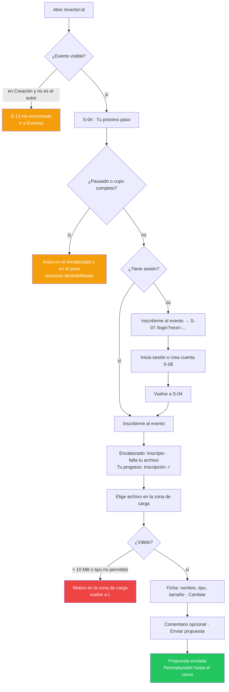

# Story Plan: S-015 (web) - Detalle del evento, propuesta, compartir y resultados

## Status

**Status:** Completed

## Story Reference

- **Story:** [S-015](../stories/S-015.detalle-del-evento-propuesta-y-resultados.md)
- **Service:** web
- **Summary:** Reescribe `EventDetailPage` (S-04) sobre el lenguaje visual nuevo: encabezado oscuro,
  línea de etapas con "ahora", un bloque "Tu próximo paso" que cambia según etapa y rol (inscribirse,
  subir o reemplazar la propuesta con confirmación en la zona de carga, pausado, cupo completo,
  votación, resultados, cancelado), columna de detalles, diálogo de compartir (O-14), diálogo de
  participantes (O-08) y resultados públicos con podio y ranking en escala 0–10. Los estados viven en
  `src/domain/eventDetail.ts`. El detalle deja de avanzar etapas y se borran `ShareButton`,
  `Participants`, `VotingResultsPanel` y los modales de subida/reemplazo.

### Hallazgos del código que condicionan el plan

Relevados al planificar (no están en la documentación de la story, o la contradicen):

1. **El reemplazo no es un solo POST.** `POST /events/{event_id}/participant/{participant_id}/attachment`
   rechaza una segunda propuesta con `409 DUPLICATE_ATTACHMENT` ("Una sola propuesta por participante
   por evento", api.yaml y flujo `registro-y-carga-de-propuesta` Paso 4 "Reemplazo"). Reemplazar es
   `DELETE /api/v1/attachments/{attachment_id}` y después el `POST`. Si el `DELETE` funciona y el
   `POST` falla, el participante queda **sin propuesta**: la página pasa a "Sube tu propuesta" con el
   archivo elegido y el comentario conservados y el error visible; reintentar es solo el `POST` (D-5).
2. **La respuesta de la subida no tiene la forma de `Attachment`.** El `201` del POST trae
   `data: { id, filename, size, mime_type, description, participant, uploaded_at }`; el listado
   (`GET /attachments`) trae `original_name` y `file_size`. Hoy `AttachmentService.uploadAttachment`
   devuelve `response.data` casteado a `Attachment`, con `original_name` y `file_size` `undefined`.
   Se mapea en el servicio (Task 2).
3. **`GET /events/{event_id}/participants` exige sesión** (`401` sin JWT). Un visitante no puede abrir
   O-08: sin sesión, "Participantes 4 / 20" se muestra **sin** "ver" (D-3). Además
   `EventService.getEventParticipants` mapea a `User` y pierde `created_at` (la fecha de inscripción
   que pide O-08): se agrega `EventService.getParticipants` (Task 2). `getEventParticipants` queda
   para `ManageEventPage` hasta S-016.
4. **`RankingVotePanel` contradice CA-14.** Su bloque `rvp-quality-note` dice "Your vote carries weight
   based on quality… the more influence your vote has on the final result" (el error L-6 de REQ-003).
   Se quita ese bloque (Task 4); el aside muestra "¿Cómo cuenta tu voto?" con el copy correcto.
5. **`VotingResultsPanel` también lo usa `ManageEventPage`** (etapa Resultados). Para borrarlo (CA-20)
   la gestión pasa, de forma provisoria hasta S-016, al compuesto nuevo `voting/EventResults` (D-4).
   El panel viejo hacía `POST …/distributed-results/recalculate` como respaldo cuando faltaba el
   resultado; el compuesto nuevo **no** recalcula: `404 RESULTS_NOT_CALCULATED` →
   "Los resultados todavía no están disponibles." (CA-13). El recálculo ocurre al pasar a Resultados
   (S-006) y el POST muta estado (D-11 de la api).
6. **`FileDropzone` no soporta bien el reemplazo.** Con `submitted`, "Reemplazar archivo" pone
   `replacing = true` (estado interno) y la página no se entera; al elegir un archivo `handleFiles`
   hace `setReplacing(false)`, así que "Cambiar" (`onClear`) vuelve a la ficha "Enviada el…" en vez de
   a la zona de carga. Se corrige: `replacing` solo vuelve a `false` cuando cambia `submitted`, y se
   agrega `onReplace?: () => void` (Task 4).
7. **`StageTimeline` en mobile no muestra el cierre.** El resumen mobile es
   "`{etapa} · {ahora} · {Etapa N de 4}`"; CA-19 pide además el cierre. Se agrega la prop opcional
   `summaryDetail?: React.ReactNode`, que se muestra junto al resumen (Task 4). `HomePage` no la pasa:
   no cambia.
8. **Doble pedido del evento.** `EventDetailPageWrapper` (en `App.tsx`) pide el evento para saber si
   quien mira es el autor y después la página lo vuelve a pedir; además decide antes de que `auth`
   termine de cargar. La página nueva lee `eventId` con `useParams`, espera `loading === false`, pide
   el evento una vez y redirige al autor con `<Navigate replace>`. El wrapper se borra (Task 8).
   `routes.test.tsx` TS-61 ("detalle de evento no cae en la 404") mockea `getEventById → null`: con la
   página nueva `null` es "No encontrada", así que el mock pasa a devolver un evento (Task 11).
9. **`Modal` queda sin uso.** Solo lo importa `EventDetailPage` (modales de confirmar subida y de
   reemplazar). `auth-modal-removed.test.ts` TS-59 afirma que `components/modal/Modal.tsx` existe
   ("los usa EventDetailPage"): se borra `Modal` y se invierte la aserción (Task 11). `LinkButton`
   sigue (su CSS lo importa `ManageEventPage`).
10. **Otros usos que siguen:** `EventTimeline`, `StageAdvanceModal`, `VotingConfigurationPanel` y
    `link-button/styles.css` los usa `ManageEventPage` → **no** se borran (S-016).
    `ApiHealthService` lo mockea `routes.test.tsx` → se conserva; el detalle deja de llamarlo.
    `getShareableEventInfo` solo lo usa `ShareButton` → se borra con él (D-1).
11. **`RESULTS_NOT_CALCULATED` llega como forma B** (`{ error: 'RESULTS_NOT_CALCULATED', message }`);
    `ApiError` ya la convierte en `code` (`FORM_B_CODE`). `errors.RESULTS_NOT_CALCULATED` ya existe
    en el catálogo con el texto de CA-13.
12. **`VotingResults` no declara `total_votes`**, que la api sí devuelve (`distributed_vote_handler.go`
    y api.yaml). Se agrega al tipo (Task 2): es el `{m} evaluaciones` del resultado.
13. **Carpetas fuera de lint.** `package.json` (script `lint` y override de `react/jsx-no-literals`) y
    `static-rules.test.ts` (`ROOTS`) listan carpetas una por una. Se agregan `src/pages/event-detail`,
    `src/components/events/share-dialog`, `src/components/events/participants-table`,
    `src/components/events/participants-dialog` y `src/components/voting` (Task 11).

### Decisiones tomadas al planificar

Aprobadas por el usuario al planificar (D-1 a D-7 = D-A a D-G de la propuesta).

- **D-1 · Enlace armado en el cliente.** O-14 dice "loading: No — el enlace se arma en el cliente":
  `shareUrl(window.location.origin, event.id)` = `${origin}/events/${id}`. `GET /events/{id}/share`
  **no** se consume y `EventService.getShareableEventInfo` se borra.
- **D-2 · Banner de eventos abiertos.** `EventService.listEvents({ stage: 'participation', limit: 1 })`
  → `stageCounts.participation` (incluye pausados; aproximación aceptada). Con `0` o si el pedido
  falla, el banner y su CTA no se muestran (es información complementaria; no hay error visible).
- **D-3 · "ver" participantes solo con sesión** (hallazgo 3). Con sesión, "ver" se ofrece aunque haya
  0 inscritos (O-08 tiene estado vacío).
- **D-4 · Compuesto `voting/EventResults`** (`src/components/voting/event-results/`): pide
  `GET /distributed-results`, maneja carga / error con Reintentar / sin resultados, y arma `Podium` +
  `RankingList` + nota del puntaje. Expone `onLoaded(results)` para que la página arme el título
  ("{n} participantes · {m} evaluaciones") y el "Finalizó". Lo usa el detalle y, provisoriamente,
  `ManageEventPage`.
- **D-5 · Reemplazo sin modal** (CA-6, hallazgo 1). Propuesta enviada → `FileDropzone` en `submitted`;
  "Reemplazar archivo" → zona de carga (`onReplace` marca `replacing = true` en la página) → archivo
  elegido + comentario precargado con la descripción anterior → "Enviar nueva versión" →
  `deleteAttachment(myAttachment.id)` y luego `uploadAttachment(...)`. Falla del `DELETE` →
  `eventDetail.errors.replace`, nada cambió. `DELETE` ok + `POST` falla → `myAttachment = null`,
  `replacing = false`, archivo y comentario conservados, mensaje `eventDetail.errors.upload` (o el del
  `code`), estado `upload`. Mientras se reemplaza no hay forma de "volver" a la propuesta vigente
  salvo recargar (el screen.md no lo define).
- **D-6 · Aviso de éxito.** "Recibimos tu propuesta." en `Callout tone="success"` dentro de
  "Tu próximo paso", con un contenedor `role="status"`; se oculta a los `SUCCESS_NOTICE_MS = 5000` ms
  o en la siguiente acción.
- **D-7 · "Tu progreso" sin fecha de inscripción.** El detalle no trae la fecha de inscripción del
  usuario: el paso 1 dice "Confirmada" sin fecha.
- **D-8 · Español neutro** (como S-013/S-014). Los screen.md están en voseo ("Inscribite", "Subí",
  "Ordená", "Probá", "Vos", "Inscripto"); el texto que se implementa es el de "Catálogo nuevo":
  "Inscríbete", "Sube", "Ordena", "Intenta de nuevo", "Tú", **"Inscrito"**. Los eyebrows
  ("TU PRÓXIMO PASO", "COMPARTIR", "DESPUÉS", "¿TE GUSTÓ?") se guardan en minúscula de oración y se
  ponen en mayúsculas por CSS.
- **D-9 · Prioridad de estados** de `nextStepState`: `cancelled` > `results` > `paused` > estados de
  la etapa. En Resultados no hay acciones, así que una pausa no tapa el ranking. Un inscrito con el
  cupo lleno sigue en `upload`/`submitted` (el cupo solo bloquea a quien no está inscrito).
- **D-10 · Etapa Creación.** La api ya responde `404` para Creación ajena; si igualmente llega un
  evento en `creation` (p. ej. un `admin` que no es el autor) la página muestra "No encontrada",
  como pide el screen.md ("A S-13 si el evento … está en Creación y quien mira no es el autor").
- **D-11 · Votación hasta S-017.** En `vote` y `rankingSent` la página pide la asignación
  (`getParticipantAssignment`, `null` = `NO_ASSIGNMENT`) para decidir el estado y contar las propuestas
  del título, y dentro de `NextStepCard` monta el `RankingVotePanel` actual (que vuelve a pedirla:
  doble pedido aceptado hasta S-017). En Resultados no se muestra la lista de solo lectura (S-017).
- **D-12 · Podio y ranking.** Sobre `adjusted_ranking` ordenado por `adjusted_rank`; posición =
  `adjusted_rank`. Podio = las 3 primeras (o menos si hay menos); tabla desde la 4.ª (si no hay
  4.ª, no hay tabla). `adjusted_ranking` vacío = sin resultados. `participant_name` ausente → "—".
  "Tú" si hay sesión y `participant_id === user.id`.
- **D-13 · Meta y "Finalizó".** Meta = "Organiza {organizer} · {count} de {max} participantes" con
  `count = participant_ids.length` (sin el autor) y `max = max_participants ?? 20` (default de la api
  al inscribir). En Resultados se agrega "· Finalizó el {date}" con `calculated_at` cuando llegan los
  resultados.
- **D-14 · Errores por `code`.** Inscripción: `REGISTER_ERROR_CODES = ['MAX_PARTICIPANTS_REACHED',
  'EVENT_PAUSED', 'INVALID_REGISTRATION_STAGE', 'ALREADY_REGISTERED']`, fallback
  `eventDetail.errors.register`. Subida: `UPLOAD_ERROR_CODES = ['FILE_TOO_LARGE', 'INVALID_FILE_TYPE',
  'EVENT_PAUSED', 'INVALID_EVENT_STAGE', 'DUPLICATE_ATTACHMENT', 'DESCRIPTION_TOO_LONG']`, fallback
  `eventDetail.errors.upload`. Red → `errors.network`. Siempre con `scopedMessageKeyForError`; nunca
  `err.message`. Tras `ALREADY_REGISTERED` o `MAX_PARTICIPANTS_REACHED` se recarga el evento.
- **D-15 · Ubicación del código.**
  `src/domain/eventDetail.ts` (+ test) reexportado en `src/domain/index.ts`;
  `src/pages/event-detail/EventDetailPage.{tsx,css,test.tsx}` (prefijo `edp-`, CSS reescrito);
  `src/components/events/share-dialog/ShareDialog.{tsx,css,test.tsx}` (`ev-share-dialog`);
  `src/components/events/participants-table/ParticipantsTable.{tsx,css,test.tsx}` (`ev-participants-table`);
  `src/components/events/participants-dialog/ParticipantsDialog.{tsx,css,test.tsx}` (`ev-participants-dialog`);
  `src/components/voting/podium/Podium.{tsx,css,test.tsx}` (`vt-podium`);
  `src/components/voting/ranking-list/RankingList.{tsx,css,test.tsx}` (`vt-ranking-list`);
  `src/components/voting/event-results/EventResults.{tsx,css,test.tsx}` (`vt-event-results`).

---

## Architectural Context

### Tech Stack

```
react 19.1.1            react-dom 19.1.1
react-router-dom 7.9.4  @react-oauth/google 0.13.4
react-scripts 5.0.1     typescript 4.9.5 (strict: true)
@testing-library/react 16.3.0     @testing-library/jest-dom 6.6.4
@testing-library/user-event 13.5.0  @testing-library/dom 10.4.1
```

Create React App, **no Next.js**: SPA client-side pura, sin SSR (ADR-006). Sin dependencias nuevas:
los logos de las redes son SVG propios en `Icons.tsx`.

### Service Architecture (convenciones del servicio, estado real tras S-010 … S-014)

**Estructura** (`project-structure`): organización por tipo técnico.

```
src/
├── App.tsx                 # AppRoutes (exportada para tests) + providers — se borra EventDetailPageWrapper
├── components/ui/          # primitivos del DS (Button, Dialog, DataTable, FileDropzone, …) — prefijo ui-
├── components/layout/      # chrome global (AppHeader, AppLayout, RequireAuth, …) — prefijo ly-
├── components/events/      # compuestos de dominio — prefijo ev-
│   ├── event-hero/ stage-timeline/ next-step-card/ progress-checklist/   # S-010 (se reutilizan)
│   ├── share-dialog/       # NUEVO: ShareDialog (O-14)
│   ├── participants-table/ # NUEVO: ParticipantsTable (variante pública)
│   └── participants-dialog/# NUEVO: ParticipantsDialog (O-08)
├── components/voting/      # NUEVO dominio — prefijo vt-
│   ├── podium/ ranking-list/ event-results/
├── components/ranking-vote-panel/   # legado (S-017 lo reemplaza); se le quita la nota errónea
├── components/{ShareButton.*, participants/, voting-results-panel/, modal/}   # SE BORRAN
├── pages/event-detail/     # REESCRITA: EventDetailPage — prefijo edp-
├── context/AuthContext.tsx # sesión (useAuth: user, isAuthenticated, loading, joinEvent)
├── domain/                 # lógica pura + index.ts — NUEVO: eventDetail.ts
├── i18n/                   # I18nProvider, useT, catálogos es/en, errores por code
├── services/api.ts         # EventService, AttachmentService, DistributedVotingService, …
├── config/api.ts           # apiRequest, ApiError, getErrorCode, API_CONFIG.ENDPOINTS
├── styles/tokens.css       # ÚNICA fuente de tokens del DS v2.0.0
└── test-utils/             # renderWithProviders, eventFixtures
```

- Carpeta `kebab-case`, componente `PascalCase`, **un componente por carpeta con su CSS al lado**.
- `export default` para el componente; tipos y helpers con export nombrado.
- Props tipadas en una `interface` arriba; `React.FC<Props>`.
- **Nada de `any`** en código nuevo; **nada de `console.log`** (solo `console.error` para errores reales).

**Routing** (`routing`, `src/App.tsx`). Cambia solo la ruta del detalle:

```tsx
<Route element={<AppLayout />}>
  <Route path="/" element={<HomePage />} />
  <Route path="/events" element={<EventsListPage />} />
  <Route path="/my-events" element={<RequireAuth><MyEventsPage /></RequireAuth>} />
  <Route path="/events/create" element={<RequireAuth><CreateEventPage /></RequireAuth>} />
  <Route path="/events/:eventId/manage" element={<RequireAuth><ManageEventPage /></RequireAuth>} />
  <Route path="/events/:eventId" element={<EventDetailPage />} />   {/* antes: EventDetailPageWrapper */}
  <Route path="*" element={<NotFoundPage />} />
</Route>
```

- `loginPathFor(path)` (`domain/redirect`) → `/login?next=${encodeURIComponent(path)}`; el login
  vuelve a `next` (S-011/S-012).
- La pantalla "No encontrada" es `src/pages/not-found/NotFoundPage.tsx` (sin props; `EmptyState`
  "No encontramos esta página" + "Ir a Eventos"; pone `document.title` y enfoca el h1). El detalle la
  **renderiza en el lugar** (sin cambiar la URL) para 404, `INVALID_EVENT_ID`, `null` y Creación.

**Auth** (`auth`): `useAuth()` → `{ user: User | null, isAuthenticated, loading, joinEvent, … }`;
`User { id, name, email, role, joinedEventIDs, createdEventIDs }`. El `401` se maneja globalmente
(ADR-008): **no agregar manejo de 401 en páginas**. En tests: `jest.mock('…/context/AuthContext')` +
`renderWithProviders(ui, { auth })`.

**Obtención de datos** (`data-fetching`): `apiRequest` → servicios de `src/services/api.ts` →
componente con `loading` / `error` / dato; `setLoading(false)` en `finally`. Sin caché: cada montaje
pide de nuevo. Los pedidos dependientes (propuesta propia, asignación) se hacen después del evento.

**Formularios** (`forms`): controlados, botón con `loading` mientras envía (sin doble envío),
validación local antes de llamar (archivo con `domain/files`), la api como garantía final.

**Errores** (`error-handling`, DA-6): `apiRequest` lanza `ApiError { status, code?, details }`. El
texto del servidor **nunca** se muestra: `messageKeyForError` / `scopedMessageKeyForError`. Los
errores van **junto al bloque que falló** (CA-18): carga → `Callout tone="error"` con "Reintentar";
acción → `Callout tone="error"` dentro de "Tu próximo paso" conservando lo elegido.

**Estilos** (`styling` + ADR-007 enmendado): CSS plano por componente, **solo tokens de
`src/styles/tokens.css`** (sin hex, sin `rgba()`, sin medidas que tengan token), **mobile-first**,
único corte `@media (min-width: 768px)`, nunca `max-width` en `@media`, clases con prefijo del
componente.

**Testing** (`testing`): `.test.tsx` al lado; consultas por rol/label/texto; `userEvent` v13
(síncrono); `findBy*` para lo asíncrono; `jest.mock('…/services/api')` (automock) y
`jest.mock('…/context/AuthContext')`; `jest.useFakeTimers()` para los 2 s de "Copiado" y los 5 s del
aviso. No sacar el `moduleNameMapper` de `package.json`.

```bash
cd web && CI=true npm test          # una corrida
cd web && npm run typecheck && npm run lint
```

### Relevant ADRs

Los ADRs del producto no tienen sección "Implementation Rules"; se copian la decisión y las reglas
que de ella se derivan.

- **ADR-006: Create React App en lugar de Next.js** — *Decisión:* "Create React App (`react-scripts`
  5.0.1) con react-router-dom 7.9.4. SPA client-side pura: sin SSR, sin file-based routing, sin Server
  Components. Todo el render ocurre en el navegador."
- **ADR-007: CSS plano con variables (enmienda REQ-003)** — reglas verbatim de la enmienda:
  - "**Una sola fuente de tokens:** `web/src/styles/tokens.css`, con los tokens del DS `web` v2.0.0."
  - "**Sin hex literales** en los componentes nuevos."
  - "**Lenguaje visual nuevo:** de glassmorphism oscuro a 'bandas oscuras + contenido claro'."
  - "**Breakpoints como escala nombrada** (`--bp-mobile: 768px` documentado; en `@media` se usa el
    literal) y **mobile-first** en los componentes nuevos."
  - "**Componentes en vez de sistemas de clases:** `web/src/components/ui/` con los primitivos del DS
    (`Button`, `TextField`, `Dialog`, `DataTable`, …) y compuestos de dominio en
    `web/src/components/{dominio}/`."
  - "**Prefijo de clase por componente** para evitar colisiones."
- **ADR-008: Manejo global de expiración de sesión por CustomEvent** — *Decisión:* "Ante un `401`,
  `apiRequest` limpia la sesión de `localStorage` y emite un `CustomEvent` llamado `auth:logout`.
  `AuthContext` registra un listener en `window` y, al recibirlo, actualiza su estado para desloguear
  al usuario sin recargar la página." → La página no maneja 401; por eso "ver" participantes no se
  ofrece sin sesión (D-3).
- **ADR-010: i18n propio sobre `Intl`** — *Decisión (verbatim):*
  - "`I18nProvider` (Context) y `useT()`."
  - "Catálogos `es.ts` y `en.ts`; **el tipo de `en` se deriva de `es`**, así una clave faltante no compila."
  - "Interpolación simple (`{name}`) y plurales con `Intl.PluralRules`."
  - "Errores de la api traducidos por `code` (`errors.<code>`), con fallback genérico; nunca se muestra `err.message`."
  - "Verificación: lint contra texto embebido en JSX en las carpetas nuevas y un test que rechaza formas de voseo en el catálogo `es`."
- **REQ-003 DA-5 (reglas de dominio en `src/domain/`)** — "El front define nombres/orden/siguiente
  etapa, validación de archivo (tipos y 10 MB, iguales a los del backend), formato de fechas y escala
  de puntaje. **No recalcula**" → los estados de "Tu próximo paso" y la escala del puntaje viven en
  `domain/eventDetail.ts` + `domain/score.ts`; el ranking **no** se recalcula en el cliente.
- **REQ-003 DA-6** — "`ApiError` conserva `code` y la web traduce por `code` … nunca `err.message`.
  Elimina los `err.message.includes(...)`."
- **REQ-003 DA-8** — "`Dialog` reemplaza las tres implementaciones de overlay (`Modal`,
  `stage-modal-*`, `share-menu`) con `role="dialog"`, `aria-modal`, foco atrapado y cierre por
  Escape" · "Se eliminan los componentes reemplazados y el código muerto". Compuestos de dominio:
  `events/ShareDialog`, `events/ParticipantsTable`, `voting/Podium`, `voting/RankingList`.
- **REQ-003 DA-9** — "`/events/:eventId` | Detalle (1e, 1f, 1i, 2g) | Público; el autor es redirigido
  a `/manage` (comportamiento actual)" · "`openAuthModal` se reemplaza por `navigate('/login?next=…')`".
- **REQ-003 L-6 / L-7 / L-8 / L-9 / L-11** — copy del mecanismo corregido (la propia propuesta sube o
  baja, el voto no pesa más); resultados públicos; puntaje `mbc_score × 10` con un decimal; comentario
  hasta 1000 caracteres; copy neutro.

### API Context

Sin endpoints nuevos ni cambios de contrato. `apiRequest` agrega `Authorization: Bearer` si hay token.
Formas de error de la api: `ApiError {error, code, details?}` (handlers), `MiddlewareError
{error: CODE, message}` (auth) y `LegacyError {error}` (votación distribuida); `ApiError` del front
normaliza las dos primeras a `code`.

#### `GET /api/v1/events/{event_id}` — detalle (auth opcional)

"Un evento en `creation` responde `404 EVENT_NOT_FOUND` a quien no sea su autor ni `admin` (S-008)."
`200 { data: EventDetail }`; `400 MISSING_EVENT_ID | INVALID_EVENT_ID`; `404 EVENT_NOT_FOUND`.

```yaml
EventDetail = EventListItem + { organizer: string (cae al nombre del autor), attachment_count: integer }
EventListItem:
  id, name, description, start_date, end_date, stage (creation|participation|voting|results),
  author_id, max_participants (integer, nullable), participation_estimated_end_date (date, nullable),
  voting_estimated_end_date (date, nullable), participant_ids (uuid[]), participants_count,
  is_cancelled, is_paused, created_at, updated_at
```

El front lo mapea con `toEvent(raw)` a `Event`: `id`, `title` (= `name`), `description`, `stage`,
`date`, `organizer` (`raw.organizer ?? ''`), `max_participants`, `participant_ids` (sin el autor),
`creator_id` (= `author_id`), `is_paused`, `is_cancelled`, `participation_estimated_end_date`,
`voting_estimated_end_date`, `attachmentCount`, `created_at`, `updated_at`.

#### `POST /api/v1/events/{event_id}/register` — inscribirse (público)

Body `{ participant_name (2..100), participant_email }` — la web envía `user.name` y `user.email`
(`EventService.registerForEvent(eventId, name, email)`). `201 { data: { participant_id,
participant_name, participant_email, event_id, event_name, registered_at }, message, code:
PARTICIPANT_REGISTERED }`. Errores: `400 INVALID_PAYLOAD | INVALID_REGISTRATION_STAGE (+ current_stage)
| CREATOR_CANNOT_REGISTER | MAX_PARTICIPANTS_REACHED (+ current_count, max_participants)`,
`403 EVENT_PAUSED`, `404 EVENT_NOT_FOUND`, `409 ALREADY_REGISTERED`, `500 USER_CREATE_ERROR |
PARTICIPANT_CHECK_ERROR | REGISTRATION_ERROR`. Efecto (S-009): notificaciones `registration_confirmed`
y `participant_registered`.

#### `POST /api/v1/events/{event_id}/participant/{participant_id}/attachment` — subir (JWT)

`multipart/form-data`: `file` (binary, requerido) y `description` (opcional, ≤ 1000, se guarda con
trim). "Solo durante la etapa `participation`, y solo el propio participante o el autor del evento.
**Una sola propuesta por participante por evento.**"

```json
201 { "data": { "id": "uuid", "filename": "afiche.pdf", "size": 2516582, "mime_type": "application/pdf",
                "description": "", "participant": "Ana Pérez", "uploaded_at": "2026-10-05T13:00:00Z" },
      "message": "string", "code": "UPLOAD_SUCCESS" }
```

Errores: `400 MISSING_PARAMETERS | INVALID_EVENT_ID | INVALID_PARTICIPANT_ID | INVALID_EVENT_STAGE
(+ current_stage) | NO_FILE | DESCRIPTION_TOO_LONG | FILE_TOO_LARGE (+ max_size, received_size) |
INVALID_FILE_TYPE (+ received_type, allowed_types) | INVALID_FILENAME`, `403 EVENT_PAUSED |
CREATOR_CANNOT_UPLOAD | NOT_REGISTERED`, `404 EVENT_NOT_FOUND | PARTICIPANT_NOT_FOUND`,
`409 DUPLICATE_ATTACHMENT (+ existing_attachment_id)`, `500 FILE_SAVE_ERROR | DB_SAVE_ERROR`.

#### `DELETE /api/v1/attachments/{attachment_id}` — borrar la propia (JWT)

"Solo el dueño de la propuesta, y solo durante la etapa `participation`: permite reemplazarla subiendo
otra." `200 { message, code: DELETE_SUCCESS }`; `400 INVALID_EVENT_STAGE`; `403 FORBIDDEN |
CREATOR_CANNOT_DELETE`; `404 ATTACHMENT_NOT_FOUND`; `500 EVENT_LOOKUP_ERROR | DB_DELETE_ERROR`.

#### `GET /api/v1/events/{event_id}/attachments` — propuestas (JWT)

"**Anonimato (S-007):** el autor del evento y un `admin` reciben todas las propuestas; cualquier otro
usuario recibe solo las propias." `200 { data: [{ id, event_id, participant_id, original_name,
file_size, mime_type, description? (se omite si vacía), uploaded_at, url }], count }`. La página busca
`att.participant_id === user.id`.

#### `GET /api/v1/events/{event_id}/participants/{participant_id}/assignment` — asignación (JWT)

"Solo el propio participante, el autor del evento o un admin, en etapa `voting` o `results`." `200
{ assignment: AnonymousAssignment { id, event_id, is_completed, completed_at, attachments: [{ id,
label, mime_type, file_size, description }] }, event_name, participant_id }`. "Un inscripto sin
asignación recibe `404 NO_ASSIGNMENT`" → `DistributedVotingService.getParticipantAssignment` ya
devuelve `null` en ese caso (S-007).

#### `GET /api/v1/events/{event_id}/distributed-results` — resultados (público)

"**Solo lectura:** devuelve la fila guardada en `voting_results` … No escribe ni recalcula. Disponible
en las etapas `voting` y `results`. **Público (sin sesión)**."

```yaml
200 data:
  id, event_id, global_ranking: AttachmentResult[], adjusted_ranking: AttachmentResult[],
  participant_qualities: { uuid: Q_i }, total_participants: integer, total_votes: integer,
  attachments_per_evaluator: integer, calculated_at: date-time, updated_at: date-time
AttachmentResult:
  attachment_id, filename, participant_id, participant_name (puede estar ausente),
  mbc_score (normalizado en [0,1]), global_rank, adjusted_rank, vote_count, average_rank
404: evento inexistente, o { error: "RESULTS_NOT_CALCULATED", message } si no se guardó el ranking
403: etapa incorrecta (+ current_stage)
```

#### `GET /api/v1/events/{event_id}/participants` — participantes (JWT)

"Cualquier usuario autenticado. El `role` es el rol **dentro del evento**. ⚠️ Devuelve `email` a
cualquier usuario autenticado; la web solo lo muestra al organizador."
`200 { data: { event: { id, name, stage }, participants: [{ id, name, email, role (creator |
participant), created_at }] }, count }`; `401`; `404 EVENT_NOT_FOUND`; `500 RETRIEVAL_ERROR`.

#### `GET /api/v1/events?stage=participation&limit=1` — conteo para el banner (público, D-2)

"`stage_counts` se calcula sobre el conjunto filtrado por `q`, antes de filtrar por `stage` y de
paginar, y siempre trae las tres claves (`participation`, `voting`, `results`)." Se usa
`EventService.listEvents(...)` existente → `EventListPage.stageCounts.participation`.

#### Servicios (Task 2)

```ts
// src/types/index.ts
export interface VotingResults { /* … existente … */ total_votes: number; }   // NUEVO campo
export interface EventParticipant {
  id: string;
  name: string;
  email: string;            // el front público nunca lo muestra
  role: 'creator' | 'participant';
  created_at: string;       // fecha de inscripción
}

// src/services/api.ts
EventService.getParticipants(eventId: string): Promise<EventParticipant[]>
//   GET API_CONFIG.ENDPOINTS.EVENT_PARTICIPANTS(eventId) → response.data.participants
//   mapeado campo a campo y filtrado a role === 'participant'. Relanza errores.
AttachmentService.uploadAttachment(eventId, participantId, file, description?): Promise<Attachment>
//   igual que hoy, pero mapea la respuesta: { id: d.id, event_id: eventId, participant_id: participantId,
//   original_name: d.filename, stored_name: '', file_size: d.size, mime_type: d.mime_type,
//   description: d.description || undefined, uploaded_at: d.uploaded_at }
EventService.registerForEvent(...)   // sin console.log (se conserva el console.error)
EventService.getShareableEventInfo   // SE BORRA (D-1)
```

### Dominio nuevo — `src/domain/eventDetail.ts` (Task 1)

```ts
import type { Attachment, AttachmentResult, Event, EventStage } from '../types';
import type { Params, TranslationKey } from '../i18n/types';

export const DEFAULT_CAPACITY = 20;          // default de la api al inscribir
export const COMMENT_MAX = 1000;             // L-9
export const COPY_FEEDBACK_MS = 2000;        // "✓ Copiado" (CA-15)
export const SUCCESS_NOTICE_MS = 5000;       // "Recibimos tu propuesta." (D-6)

export type NextStepState =
  | 'default'             // screen.md "default"
  | 'upload'              // "subir propuesta" (+ subestado de página "archivo elegido")
  | 'submitted'           // "propuesta enviada"
  | 'vote'                // "votar" (S-017 completa la lista)
  | 'rankingSent'         // "ranking enviado" (S-017)
  | 'noProposalInVoting'  // "sin propuesta en votación"
  | 'paused'              // "pausado"
  | 'full'                // "cupo completo"
  | 'votingNotRegistered' // "votación sin inscripción"
  | 'results'             // "resultados"
  | 'cancelled';          // "estado terminal / readonly"

/** Estado de la asignación del usuario en Votación. `null` = no aplica. */
export type AssignmentStatus = 'none' | 'pending' | 'completed' | null;

type DetailEvent = Pick<Event, 'stage' | 'is_paused' | 'is_cancelled' | 'participant_ids' | 'max_participants'>;

export const capacityOf = (e: Pick<Event, 'max_participants'>): number => e.max_participants ?? DEFAULT_CAPACITY;
export const isRegistered = (e: Pick<Event, 'participant_ids'>, userId: string | null): boolean =>
  Boolean(userId && e.participant_ids?.includes(userId));
export const isFull = (e: Pick<Event, 'participant_ids' | 'max_participants'>): boolean =>
  (e.participant_ids?.length ?? 0) >= capacityOf(e);

export const nextStepState = (
  event: DetailEvent,
  userId: string | null,
  myAttachment: Pick<Attachment, 'id'> | null,
  assignment: AssignmentStatus
): NextStepState;
//  1. is_cancelled → 'cancelled'
//  2. stage 'results' → 'results'
//  3. is_paused → 'paused'
//  4. stage 'participation': inscrito → (myAttachment ? 'submitted' : 'upload');
//                            no inscrito → (isFull ? 'full' : 'default')
//  5. stage 'voting': no inscrito → 'votingNotRegistered';
//                     inscrito → assignment 'none' → 'noProposalInVoting', 'completed' → 'rankingSent',
//                                'pending' | null → 'vote'
//  6. stage 'creation' (no llega: la página muestra No encontrada, D-10) → 'default'

export const detailPill = (
  state: NextStepState,
  event: Pick<Event, 'stage' | 'participation_estimated_end_date' | 'voting_estimated_end_date'>,
  now?: Date
): { key: TranslationKey; params?: Params; tone: 'success' | 'warning' | 'action' | 'neutral' | 'onBand' };
//  default, full    → días = daysUntilClose(participation_estimated_end_date, now):
//                     > 0 → 'eventDetail.pill.openCloses' { count }; 0 → 'eventDetail.pill.openClosesToday';
//                     null o < 0 → 'eventDetail.pill.open'
//  upload           → 'eventDetail.pill.missingFile'
//  submitted        → 'eventDetail.pill.proposalSent'
//  vote             → igual que default con voting_estimated_end_date: 'voteCloses' | 'voteClosesToday' | 'vote'
//  rankingSent      → 'eventDetail.pill.rankingSent'
//  noProposalInVoting, votingNotRegistered → 'eventDetail.pill.votingInProgress'
//  results          → 'eventDetail.pill.results'
//  paused           → 'eventDetail.pill.paused'
//  cancelled        → 'eventDetail.pill.cancelled'
//  tone: siempre 'onBand' (la píldora va sobre la banda oscura del EventHero)

export interface DetailProgressStep {
  labelKey: TranslationKey; detailKey?: TranslationKey; params?: Params; status: 'done' | 'current' | 'pending';
}
export const progressSteps = (
  state: NextStepState,
  event: Pick<Event, 'participation_estimated_end_date'>,
  now?: Date
): DetailProgressStep[] | null;
//  Solo para upload, submitted, vote, rankingSent (screen.md: "Tu progreso" visible solo ahí); si no → null.
//  1 Inscripción · 'eventDetail.progress.confirmed' · done
//  2 Subir propuesta · upload: current + ('pendingCloses' {count} si días > 0 | 'pending') ; resto: done + 'sent'
//  3 Votar · upload/submitted: pending + 'voteLater'; vote: current + 'votePending'; rankingSent: done + 'voteSent'
//  4 Ver resultados · pending, sin detalle

export const splitResults = (ranking: AttachmentResult[]): { podium: AttachmentResult[]; rest: AttachmentResult[] };
//  copia ordenada por adjusted_rank ascendente; podium = primeras 3; rest = desde la 4.ª (D-12)

export const shareUrl = (origin: string, eventId: string): string;  // `${origin}/events/${eventId}`
export type ShareNetwork = 'whatsapp' | 'x' | 'linkedin' | 'facebook' | 'email';
export const shareLinks = (url: string, name: string): { network: ShareNetwork; href: string }[];
//  whatsapp: `https://wa.me/?text=${encodeURIComponent(`${name}\n${url}`)}`
//  x:        `https://twitter.com/intent/tweet?text=${encodeURIComponent(name)}&url=${encodeURIComponent(url)}`
//  linkedin: `https://www.linkedin.com/sharing/share-offsite/?url=${encodeURIComponent(url)}`
//  facebook: `https://www.facebook.com/sharer/sharer.php?u=${encodeURIComponent(url)}`
//  email:    `mailto:?subject=${encodeURIComponent(name)}&body=${encodeURIComponent(url)}`
//  (mismos destinos que el ShareButton actual; orden del screen.md)

export const shareAudienceKey = (stage: EventStage): TranslationKey;
//  participation → 'share.audience.participation'; voting → 'share.audience.voting';
//  results → 'share.audience.results'; creation → 'share.audience.voting' (no llega)
export const afterKey = (state: NextStepState, stage: EventStage): TranslationKey | null;
//  null si state es 'results' o 'cancelled'; stage participation → 'eventDetail.after.participation';
//  voting → 'eventDetail.after.voting'; otro → null
```

Reutiliza de S-010: `daysUntilClose`, `formatDate` (`domain/dates`), `currentDeadline`
(`domain/events`), `formatScore` (`domain/score`), `validateFile`, `formatFileSize`, `fileTypeLabel`,
`MAX_FILE_BYTES` (`domain/files`), `STAGE_ORDER`, `stageIndex`, `stageNameKey` (`domain/stages`).

### Catálogo nuevo (fuente de verdad del texto, D-8)

Namespaces nuevos `eventDetail`, `share`, `participants` y `results` en `src/i18n/catalogs/es.ts` y
`en.ts`, después de `manageEvent` y antes de `errors`. Español neutro. Las claves `plural(...)` usan
`count`. Los textos en mayúsculas del screen.md se guardan en minúscula de oración (CSS los pasa a
mayúsculas).

| Clave | es | en |
|---|---|---|
| `eventDetail.back` | ← Eventos | ← Events |
| `eventDetail.share` | Compartir | Share |
| `eventDetail.meta` | Organiza {organizer} · {count} de {max} participantes | Organized by {organizer} · {count} of {max} participants |
| `eventDetail.metaFinished` | Finalizó el {date} | Ended on {date} |
| `eventDetail.loading` | Cargando evento… | Loading event… |
| `eventDetail.loadError` | No pudimos cargar el evento. | We couldn't load the event. |
| `eventDetail.goToEvents` | Ir a Eventos | Go to Events |
| `eventDetail.pill.open` | Inscripción abierta | Registration open |
| `eventDetail.pill.openCloses` | plural: `Inscripción abierta · cierra en {count} día` / `Inscripción abierta · cierra en {count} días` | plural: `Registration open · closes in {count} day` / `Registration open · closes in {count} days` |
| `eventDetail.pill.openClosesToday` | Inscripción abierta · cierra hoy | Registration open · closes today |
| `eventDetail.pill.missingFile` | Inscrito · falta tu archivo | Registered · your file is missing |
| `eventDetail.pill.proposalSent` | Propuesta enviada | Proposal sent |
| `eventDetail.pill.vote` | Te toca votar | Your turn to vote |
| `eventDetail.pill.voteCloses` | plural: `Te toca votar · cierra en {count} día` / `Te toca votar · cierra en {count} días` | plural: `Your turn to vote · closes in {count} day` / `Your turn to vote · closes in {count} days` |
| `eventDetail.pill.voteClosesToday` | Te toca votar · cierra hoy | Your turn to vote · closes today |
| `eventDetail.pill.rankingSent` | Ranking enviado | Ranking sent |
| `eventDetail.pill.votingInProgress` | Votación en curso | Voting in progress |
| `eventDetail.pill.results` | Finalizado · resultados publicados | Finished · results published |
| `eventDetail.pill.paused` | Evento pausado | Event paused |
| `eventDetail.pill.cancelled` | Cancelado | Cancelled |
| `eventDetail.timeline.creation` | Evento configurado | Event set up |
| `eventDetail.timeline.participation` | Inscríbete y sube tu archivo | Sign up and upload your file |
| `eventDetail.timeline.voting` | Evalúas a otros participantes | You review other participants |
| `eventDetail.timeline.results` | Ranking final | Final ranking |
| `eventDetail.timeline.closes` | Cierra el {date} | Closes on {date} |
| `eventDetail.nextStep.eyebrow` | Tu próximo paso | Your next step |
| `eventDetail.nextStep.default.title` | Inscríbete para participar | Sign up to take part |
| `eventDetail.nextStep.default.text` | Después de inscribirte podrás subir tu propuesta. Puedes reemplazarla hasta el cierre. | After signing up you can upload your proposal. You can replace it until the deadline. |
| `eventDetail.nextStep.upload.title` | Sube tu propuesta | Upload your proposal |
| `eventDetail.nextStep.upload.text` | Puedes reemplazarla las veces que quieras hasta el {date}. | You can replace it as many times as you want until {date}. |
| `eventDetail.nextStep.upload.textNoDate` | Puedes reemplazarla las veces que quieras hasta el cierre. | You can replace it as many times as you want until the deadline. |
| `eventDetail.nextStep.submitted.title` | Tu propuesta está enviada | Your proposal is sent |
| `eventDetail.nextStep.submitted.text` | Puedes reemplazarla hasta el {date}. | You can replace it until {date}. |
| `eventDetail.nextStep.submitted.textNoDate` | Puedes reemplazarla hasta el cierre. | You can replace it until the deadline. |
| `eventDetail.nextStep.vote.title` | plural: `Ordena la {count} propuesta` / `Ordena las {count} propuestas` | plural: `Rank the {count} proposal` / `Rank the {count} proposals` |
| `eventDetail.nextStep.vote.text` | Arriba la que te parece mejor. Abre cada archivo antes de decidir. | Put the one you think is best at the top. Open each file before deciding. |
| `eventDetail.nextStep.rankingSent.title` | Tu ranking está enviado | Your ranking is sent |
| `eventDetail.nextStep.rankingSent.text` | Puedes modificarlo y reenviarlo hasta el cierre de la votación. | You can change it and send it again until voting closes. |
| `eventDetail.nextStep.paused.title` | El evento está pausado | The event is paused |
| `eventDetail.nextStep.paused.text` | Por ahora no se puede inscribir ni subir propuestas. El organizador reanudará el evento. | For now you can't sign up or upload proposals. The organizer will resume the event. |
| `eventDetail.nextStep.full.title` | El cupo está completo | The event is full |
| `eventDetail.nextStep.full.text` | No quedan lugares en este evento. | There are no places left in this event. |
| `eventDetail.nextStep.noProposalInVoting.title` | No participas en esta votación | You're not part of this vote |
| `eventDetail.nextStep.noProposalInVoting.text` | No subiste una propuesta durante la inscripción, así que en este evento no evalúas ni recibes evaluaciones. | You didn't upload a proposal during registration, so in this event you don't review or get reviewed. |
| `eventDetail.nextStep.votingNotRegistered.title` | La votación está en curso | Voting is in progress |
| `eventDetail.nextStep.votingNotRegistered.text` | Los participantes están evaluando las propuestas. Los resultados se publican al cerrar la votación. | Participants are reviewing the proposals. Results are published when voting closes. |
| `eventDetail.nextStep.results.title` | Así votó la comunidad | This is how the community voted |
| `eventDetail.nextStep.results.text` | {participants} · {evaluations} | {participants} · {evaluations} |
| `eventDetail.nextStep.cancelled.title` | Este evento fue cancelado | This event was cancelled |
| `eventDetail.nextStep.cancelled.text` | Ya no se puede participar en este evento. | You can no longer take part in this event. |
| `eventDetail.requirements.label` | Requisitos | Requirements |
| `eventDetail.requirements.formats` | Imagen o documento | Image or document |
| `eventDetail.requirements.size` | Máx. 10 MB | Max. 10 MB |
| `eventDetail.requirements.closes` | Cierre: {date} | Deadline: {date} |
| `eventDetail.register` | Inscribirme al evento | Sign up for the event |
| `eventDetail.registering` | Inscribiendo… | Signing up… |
| `eventDetail.upload.prompt` | Arrastra tu archivo aquí o | Drag your file here or |
| `eventDetail.upload.promptAction` | elígelo desde tu equipo | choose it from your device |
| `eventDetail.upload.formats` | JPG, PNG, GIF, WebP, PDF, TXT, DOC, DOCX · hasta 10 MB | JPG, PNG, GIF, WebP, PDF, TXT, DOC, DOCX · up to 10 MB |
| `eventDetail.upload.ready` | listo para enviar | ready to send |
| `eventDetail.upload.change` | Cambiar | Change |
| `eventDetail.upload.changeAccessible` | Cambiar archivo {name} | Change file {name} |
| `eventDetail.upload.submittedOn` | Enviada el {date} | Sent on {date} |
| `eventDetail.upload.replace` | Reemplazar archivo | Replace file |
| `eventDetail.upload.tooLarge` | El archivo supera los 10 MB. | The file is larger than 10 MB. |
| `eventDetail.upload.invalidType` | Ese formato no está permitido. Usa JPG, PNG, GIF, WebP, PDF, TXT, DOC o DOCX. | That format isn't allowed. Use JPG, PNG, GIF, WebP, PDF, TXT, DOC or DOCX. |
| `eventDetail.upload.multiple` | Elige un solo archivo. | Choose a single file. |
| `eventDetail.comment.label` | Comentario | Comment |
| `eventDetail.comment.optional` | (opcional) | (optional) |
| `eventDetail.comment.help` | Lo verán los evaluadores junto a tu archivo. | Reviewers will see it next to your file. |
| `eventDetail.submit` | Enviar propuesta | Send proposal |
| `eventDetail.submitReplace` | Enviar nueva versión | Send new version |
| `eventDetail.submitting` | Enviando propuesta… | Sending proposal… |
| `eventDetail.submitHelpEmpty` | Elige un archivo para continuar | Choose a file to continue |
| `eventDetail.submitHelpReady` | Podrás reemplazarlo hasta el cierre | You can replace it until the deadline |
| `eventDetail.received` | Recibimos tu propuesta. | We received your proposal. |
| `eventDetail.errors.register` | No pudimos inscribirte. Intenta de nuevo. | We couldn't sign you up. Please try again. |
| `eventDetail.errors.upload` | No pudimos enviar tu propuesta. Intenta de nuevo. | We couldn't send your proposal. Please try again. |
| `eventDetail.errors.replace` | No pudimos reemplazar tu propuesta. Intenta de nuevo. | We couldn't replace your proposal. Please try again. |
| `eventDetail.errors.assignment` | No pudimos cargar tus propuestas asignadas. | We couldn't load your assigned proposals. |
| `eventDetail.progress.title` | Tu progreso | Your progress |
| `eventDetail.progress.done` | Completado | Completed |
| `eventDetail.progress.registration` | Inscripción | Registration |
| `eventDetail.progress.confirmed` | Confirmada | Confirmed |
| `eventDetail.progress.upload` | Subir propuesta | Upload proposal |
| `eventDetail.progress.pending` | Pendiente | Pending |
| `eventDetail.progress.pendingCloses` | plural: `Pendiente · cierra en {count} día` / `Pendiente · cierra en {count} días` | plural: `Pending · closes in {count} day` / `Pending · closes in {count} days` |
| `eventDetail.progress.sent` | Enviada | Sent |
| `eventDetail.progress.vote` | Votar | Vote |
| `eventDetail.progress.voteLater` | Te avisamos cuando empiece | We'll let you know when it starts |
| `eventDetail.progress.voteSent` | Enviado | Sent |
| `eventDetail.progress.results` | Ver resultados | See results |
| `eventDetail.howVoteCounts.title` | ¿Cómo cuenta tu voto? | How does your vote count? |
| `eventDetail.howVoteCounts.text` | Tu orden se compara con el de los demás evaluadores. Si evalúas con coherencia, tu propia propuesta sube posiciones en el ranking final; si no, baja. | Your order is compared with the other reviewers'. If you review consistently, your own proposal moves up in the final ranking; if not, it moves down. |
| `eventDetail.about` | Sobre el evento | About the event |
| `eventDetail.details.title` | Detalles | Details |
| `eventDetail.details.organizer` | Organiza | Organizer |
| `eventDetail.details.closes` | Cierre de {stage} | {stage} closes |
| `eventDetail.details.participants` | Participantes | Participants |
| `eventDetail.details.participantsValue` | {count} / {max} | {count} / {max} |
| `eventDetail.details.view` | ver | view |
| `eventDetail.details.viewAccessible` | Ver participantes | View participants |
| `eventDetail.details.evaluations` | Evaluaciones | Reviews |
| `eventDetail.details.finished` | Finalizó | Ended |
| `eventDetail.after.title` | Después | Next |
| `eventDetail.after.participation` | Al cerrar la inscripción, el organizador abre la votación y te asigna propuestas para evaluar. | When registration closes, the organizer opens voting and assigns you proposals to review. |
| `eventDetail.after.voting` | Al cerrar la votación se publica el ranking final para todos. | When voting closes, the final ranking is published for everyone. |
| `eventDetail.banner.title` | ¿Te gustó? | Did you like it? |
| `eventDetail.banner.text` | plural: `Hay {count} evento con inscripción abierta ahora.` / `Hay {count} eventos con inscripción abierta ahora.` | plural: `There is {count} event open for registration now.` / `There are {count} events open for registration now.` |
| `eventDetail.banner.guest` | Crea tu cuenta para participar en el próximo. | Create your account to take part in the next one. |
| `eventDetail.banner.cta` | Ver eventos | See events |
| `eventDetail.banner.createAccount` | Crear cuenta | Create account |
| `share.eyebrow` | Compartir | Share |
| `share.close` | Cerrar | Close |
| `share.audience.participation` | Quien abra el enlace verá el evento y podrá inscribirse. | Anyone who opens the link will see the event and can sign up. |
| `share.audience.voting` | Quien abra el enlace verá el evento. | Anyone who opens the link will see the event. |
| `share.audience.results` | Quien abra el enlace verá los resultados, aunque no tenga cuenta. | Anyone who opens the link will see the results, even without an account. |
| `share.linkLabel` | Enlace del evento | Event link |
| `share.copy` | Copiar | Copy |
| `share.copied` | ✓ Copiado | ✓ Copied |
| `share.copyFailed` | No pudimos copiar el enlace. Selecciónalo y cópialo a mano. | We couldn't copy the link. Select it and copy it manually. |
| `share.via` | o enviarlo por | or send it via |
| `share.networks.whatsapp` | WhatsApp | WhatsApp |
| `share.networks.x` | X | X |
| `share.networks.linkedin` | LinkedIn | LinkedIn |
| `share.networks.facebook` | Facebook | Facebook |
| `share.networks.email` | Email | Email |
| `share.networkAccessible` | Compartir por {network} | Share via {network} |
| `share.more` | Más opciones | More options |
| `participants.title` | Participantes · {count} / {max} | Participants · {count} / {max} |
| `participants.close` | Cerrar | Close |
| `participants.name` | Nombre | Name |
| `participants.registeredAt` | Inscripción | Signed up |
| `participants.empty` | Todavía no hay inscritos. | Nobody has signed up yet. |
| `participants.error` | No pudimos cargar los participantes. | We couldn't load the participants. |
| `participants.loading` | Cargando participantes… | Loading participants… |
| `results.podium` | Podio | Podium |
| `results.place` | Puesto {position} | Place {position} |
| `results.position` | Posición | Position |
| `results.participant` | Participante | Participant |
| `results.proposal` | Propuesta | Proposal |
| `results.score` | Puntaje | Score |
| `results.ranking` | Ranking completo | Full ranking |
| `results.you` | Tú | You |
| `results.evaluations` | plural: `{count} evaluación` / `{count} evaluaciones` | plural: `{count} review` / `{count} reviews` |
| `results.note` | El puntaje combina los rankings de todos los participantes, en una escala de 0 a 10. La propuesta de quien evaluó con coherencia sube posiciones; la de quien no, baja. | The score combines every participant's ranking on a 0 to 10 scale. The proposal of anyone who reviewed consistently moves up; otherwise it moves down. |
| `results.loading` | Cargando resultados… | Loading results… |
| `results.error` | No pudimos cargar los resultados. | We couldn't load the results. |

Claves existentes que se reutilizan: `common.retry` ("Reintentar"), `common.points` ("{score} pts"),
`common.participants` (plural "{count} participante(s)"), `stages.{stage}.name`,
`events.timeline.now` / `completed` / `pending` / `stepOf` ("Etapa {number} de 4"),
`errors.RESULTS_NOT_CALCULATED` ("Los resultados todavía no están disponibles."),
`errors.MAX_PARTICIPANTS_REACHED`, `errors.EVENT_PAUSED`, `errors.INVALID_REGISTRATION_STAGE`,
`errors.ALREADY_REGISTERED`, `errors.FILE_TOO_LARGE`, `errors.INVALID_FILE_TYPE`,
`errors.INVALID_EVENT_STAGE`, `errors.DUPLICATE_ATTACHMENT`, `errors.DESCRIPTION_TOO_LONG`,
`errors.network`, `nav.register` ("Crear cuenta").

### Database Context

Ninguno: la story no toca base de datos.

### Flow Context

#### `registro-y-carga-de-propuesta` (`docs/flows/registro-y-carga-de-propuesta.md`)

Cambios planificados para S-015 (verbatim): "| 2 | Sin sesión, "Inscribirme" lleva a
`/login?next=/events/{event_id}` | S-015 |" · "| 4 | La confirmación del archivo pasa del modal a la
zona de carga (`FileDropzone`); el reemplazo no tiene modal aparte | S-015 |". Pasos vigentes que la
página consume (verbatim, resumidos a lo contractual):

> **Paso 1: Cargar el detalle del evento** — GET `/api/v1/events/{event_id}`, auth pública con
> autenticación opcional. "**Response (éxito) — 200:** envelope `data` con el evento, incluyendo
> `stage`, `is_paused`, `is_cancelled`, `max_participants`, `participant_ids` y `participants_count`."
> "**Response — 404 `EVENT_NOT_FOUND`:** también cuando el evento está en `creation` y quien consulta
> no es su autor ni `admin` (S-008)." "**Nota de comportamiento:** si el usuario autenticado es el
> creador (`creator_id === user.id`), `EventDetailPageWrapper` redirige a `/events/{id}/manage` y este
> flujo no continúa" (con S-015 la redirección la hace la propia página).
>
> **Paso 2: Registrarse al evento** — POST `/api/v1/events/{event_id}/register`, body
> `{ "participant_name": "string — req, minLength 2, maxLength 100", "participant_email": "string — req,
> format email" }`. "**Reglas validadas:** Solo durante la etapa `participation`. El creador del evento
> no puede registrarse. Cupo: se rechaza si se alcanzó `max_participants` (default 20)."
>
> **Paso 3: Validación del archivo en el cliente** — "Tamaño `10 * 1024 * 1024` (10 MiB)" y "Tipo MIME
> Whitelist de 8 tipos"; con S-010 vive en `src/domain/files.ts` (`validateFile`: el tipo se evalúa
> antes que el tamaño; sin MIME decide la extensión).
>
> **Paso 4: Subir la propuesta** — POST `/api/v1/events/{event_id}/participant/{participant_id}/attachment`,
> "`multipart/form-data` con el campo `file` (binary) y `description` (opcional, hasta 1000
> caracteres; `DESCRIPTION_TOO_LONG` si se excede)". "**Reglas validadas:** solo en etapa
> `participation`; **una sola propuesta por participante por evento**; el creador no puede subir."
> "**Reemplazo:** durante `participation`, el dueño puede eliminar su propuesta
> (`DELETE /api/v1/attachments/{attachment_id}`) y subir otra."

Manejo de errores resultante (lo que ve el usuario con S-015):

| Paso | Condición | Respuesta | Qué ve el usuario |
|---|---|---|---|
| 1 | Evento inexistente o en `creation` ajeno | 404 `EVENT_NOT_FOUND` | Pantalla "No encontrada" |
| 1 | Falla de red / 5xx | — | "No pudimos cargar el evento." + Reintentar + Ir a Eventos |
| 2 | Sin sesión | — | "Inscribirme al evento" → `/login?next=%2Fevents%2F{id}` |
| 2 | Cupo completo | 400 `MAX_PARTICIPANTS_REACHED` | "El cupo está completo. No quedan lugares en este evento." y se recarga el evento |
| 2 | Pausado | 403 `EVENT_PAUSED` | Mensaje traducido |
| 2 | Otro / red | — | "No pudimos inscribirte. Intenta de nuevo." / `errors.network` |
| 3 | > 10 MB / tipo | — (cliente) | En la zona: "El archivo supera los 10 MB." / "Ese formato no está permitido. …" |
| 4 | Falla de subida | 4xx/5xx | Mensaje por `code` o "No pudimos enviar tu propuesta. Intenta de nuevo."; el archivo se conserva |
| 4 | Reemplazo: falla el DELETE | 4xx/5xx | "No pudimos reemplazar tu propuesta. Intenta de nuevo."; nada cambió |

**Estado resultante:** `event_participants` con la fila del usuario; `attachments` con exactamente una
propuesta suya (la nueva, si reemplazó).

#### `calculo-y-publicacion-de-resultados` (`docs/flows/calculo-y-publicacion-de-resultados.md`)

Cambio planificado para S-015 (verbatim): "| Presentación | Puntaje `mbc_score × 10` con un decimal
y separador según idioma; podio (1–3) + lista sobre `adjusted_ranking`; el propio participante
resaltado | S-015 |". Forma de cada elemento de los rankings (verbatim del Paso 5):

```json
{
  "attachment_id":    "uuid",
  "filename":         "string",
  "participant_id":   "uuid",
  "participant_name": "string",
  "mbc_score":        "number",
  "global_rank":      "integer",
  "adjusted_rank":    "integer",
  "vote_count":       "integer",
  "average_rank":     "number"
}
```

"`total_votes` | integer, CHECK ≥ 0. Puede ser menor que `total_participants` cuando se publica con
rankings faltantes (migración 023)". "⚠️ No está definido cuál de los dos es el ranking oficial del
producto" — REQ-003 decidió presentar `adjusted_ranking` (FG-5 sigue abierto).

#### `avance-de-etapa-del-evento` (`docs/flows/avance-de-etapa-del-evento.md`)

Cambio planificado (verbatim): "| 1 | Se reemplaza la doble validación de
`ManageEventPage`/`EventDetailPage` por un único módulo `web/src/domain/stages.ts`, usado **solo desde
la gestión**. Se elimina "todos votaron". `EventDetailPage` deja de avanzar etapas. Cierra D-05 |
S-015, S-016 |". → S-015 hace la parte de `EventDetailPage`: sin botón de avanzar, sin
`StageAdvanceModal`, sin `VotingConfigurationPanel`, sin `handleStageConfirm`.

Al terminar (Task 11) se incorporan estos cambios a los pasos de los tres flujos y se quitan de
"Cambios planificados".

### Integration Points

- Sin servicios externos de backend, colas ni otros servicios internos: solo la api por `apiRequest`.
- **Navegador:** `navigator.clipboard.writeText(url)` (puede rechazar o no existir → aviso de falla,
  CA-15); `navigator.share({ title, url })` solo si `typeof navigator.share === 'function'`
  (`AbortError` del usuario se ignora); `window.open(href, '_blank', 'noopener,noreferrer')` no hace
  falta: las redes son `<a href target="_blank" rel="noopener noreferrer">`; Email es `<a href="mailto:…">`.
- **Redes** (URLs públicas de compartir, las mismas del `ShareButton` actual): `https://wa.me/?text=`,
  `https://twitter.com/intent/tweet?text=&url=`, `https://www.linkedin.com/sharing/share-offsite/?url=`,
  `https://www.facebook.com/sharer/sharer.php?u=`, `mailto:?subject=&body=`.

### Code Conventions

- Archivos y prefijos de D-15. Solo tokens en CSS; mobile-first; corte único `@media (min-width: 768px)`.
- Todo el texto visible por `t('eventDetail.…' | 'share.…' | 'participants.…' | 'results.…' |
  'events.…' | 'stages.…' | 'common.…' | 'errors.…')`; las carpetas nuevas entran en
  `react/jsx-no-literals` (Task 11).
- Lógica pura en `src/domain/eventDetail.ts`, reexportada en `src/domain/index.ts`.
- Los compuestos reciben textos ya traducidos o usan `useT()` (como `EventsTable`); los primitivos del
  DS reciben textos por props (`FileDropzone.labels`, `Dialog.closeLabel`, …).

### Reusable Code

**Componentes de dominio (S-010)** — se reutilizan, no se reescriben:

- **EventHero** (`src/components/events/event-hero/EventHero.tsx`) — banda oscura.
  Props: `back?: { label, to }` (Link), `pills?: ReactNode` (típicamente `StatusPill tone="onBand"`),
  `title` (h1), `meta?: ReactNode`, `actions?: ReactNode` (típicamente `Button variant="onBand"`).
- **StageTimeline** (`src/components/events/stage-timeline/StageTimeline.tsx`) — `current`,
  `stageLabels: Record<EventStage, string>`, `subtitles?: Partial<Record<EventStage, ReactNode>>`,
  `nowLabel`, `completedLabel`, `pendingLabel`, `stepOfLabel` ("Etapa N de 4"), `variant: 'full' |
  'compact'`, `onEditDeadline?`, `editLabel?`. En mobile (base) muestra solo el resumen
  "`{etapa} · {ahora} · {stepOf}`"; desde 768px, las 4 etapas en fila con `aria-current="step"`.
  **Task 4 agrega** `summaryDetail?: ReactNode` (cierre en mobile).
- **NextStepCard** (`src/components/events/next-step-card/NextStepCard.tsx`) — `Card variant="raised"
  padding="spacious"` con `eyebrow`, `title` (h2 del Card), `description`, `checklist?`, `consequence?`,
  `primaryAction?: { label, onClick, disabled?, loading?, loadingLabel? }`, `primaryVariant`,
  `secondaryAction?`, `children` (contenido entre la descripción y las acciones).
- **ProgressChecklist** (`src/components/events/progress-checklist/ProgressChecklist.tsx`) — `title`,
  `headingLevel`, `steps: { label, detail?, status: 'done' | 'current' | 'pending' }[]`, `doneLabel`.
- **RankingVotePanel** (`src/components/ranking-vote-panel/RankingVotePanel.tsx`, legado S-007) —
  `eventId`, `participantId`, `onVotesSubmitted`. Carga asignación, borrador, descarga anónima y envío.

**Primitivos del DS** (re-exportados en `src/components/ui/index.ts`):

- **Button** — `variant: 'primary'|'secondary'|'tertiary'|'onBand'|'icon'`, `size: 'sm'|'md'|'lg'`,
  `loading`, `loadingLabel`, `disabled`, `fullWidth`, `type`, `onClick`, `aria-*`; `forwardRef`.
- **Dialog** — `open`, `onClose`, `variant: 'default'|'alert'`, `size: 'sm'` (480px) `|'md'` (560px)
  (mobile: pantalla completa, acciones abajo), `eyebrow?`, `title`, `busy`, `actions`, `closeLabel`,
  `describedBy`, `initialFocusRef`, `children`. Portal, foco atrapado, resto `inert`, Escape/backdrop/×
  cierran, el foco vuelve al disparador.
- **DataTable** — `columns: { key, header, render?, align? }[]`, `rows`, `rowKey`, `rowAction?`,
  `actionHeader?`, `highlightRow?: (row) => boolean` (fila `ui-data-table__row--highlighted`, el
  "Vos/Tú" del ranking), `caption`, `captionHidden`, `loading`, `skeletonRows`. Apila con `data-label`
  en mobile.
- **FileDropzone** — `file`, `submitted?: { name, size, date }`, `error`, `disabled`, `uploading`,
  `locale`, `labels: { prompt, promptAction, formats, ready, change, changeAccessible ({name}),
  submittedOn ({date}), replace }`, `onSelect(file)`, `onReject(reason: 'too_large' | 'invalid_type' |
  'multiple')`, `onClear()`. Valida con `domain/files`; el error va con `role="alert"` dentro de la zona.
  **Task 4 agrega** `onReplace?` y corrige "Cambiar" durante un reemplazo.
- **TextField** — `variant="multiline"`, `label`, `optional` + `optionalLabel`, `help`, `error`,
  `maxLength` (contador "{n} / {max}", `aria-live` desde el 90%), `name`, `value`, `onChange`, `disabled`.
- **Callout** — `tone: 'info'|'warning'|'error'|'success'`, `title?`, `id?`, `action?: { label,
  onClick }` (Reintentar), `children`. `tone="error"` ⇒ `role="alert"`.
- **Card** — `variant: 'default'|'subtle'|'raised'|'feature'|'interactive'`, `padding`, `eyebrow?`,
  `title?`, `headingLevel?`, `className?`.
- **StatusPill** — `tone: 'success'|'warning'|'action'|'neutral'|'onBand'`, `size`, `icon`.
- **EmptyState** — `variant: 'inline'|'page'`, `icon?`, `title`, `headingLevel?`, `description?`,
  `action?`.
- **Icons** (`src/components/ui/icons/Icons.tsx`) — `CloseIcon`, `CheckIcon`, `UploadIcon`, `DotIcon`,
  … (`IconProps` = props de SVG). **Task 4 agrega** `ShareIcon`, `LinkIcon`, `MailIcon`,
  `WhatsAppIcon`, `XLogoIcon`, `LinkedInIcon`, `FacebookIcon` (monocromos, `currentColor`,
  `aria-hidden` por defecto).
- **visually-hidden** (`src/components/ui/visually-hidden.css`) — clase `ui-visually-hidden`.
- **NotFoundPage** (`src/pages/not-found/NotFoundPage.tsx`) — se renderiza en el lugar.

**Utils:**

- **domain/dates**: `daysUntilClose(date, now)`, `formatDate(date, locale)` ("10 oct 2026"),
  `formatDateTime(iso, locale)`, `isClosed`.
- **domain/events**: `currentDeadline(e)` (cierre de la etapa actual), `stagePill`.
- **domain/stages**: `STAGE_ORDER`, `stageIndex`, `stageNameKey(stage)`.
- **domain/files**: `validateFile`, `formatFileSize(bytes, locale)` ("2,4 MB"), `fileTypeLabel`,
  `MAX_FILE_BYTES`, `ACCEPT_ATTRIBUTE`.
- **domain/score**: `formatScore(mbc, locale)` → `0.74` → "7,4" (es) / "7.4" (en).
- **domain/redirect**: `loginPathFor(path)`.
- **i18n** (`src/i18n/index.ts`, `src/i18n/errors.ts`): `useT()` → `{ t, locale, fmt }`; `plural()`;
  `messageKeyForError(err)`, `scopedMessageKeyForError(err, codes, fallback)`.
- **ApiError / getErrorCode** (`src/config/api.ts`): en tests,
  `new ApiError({ status: 409, body: { error: 'x', code: 'ALREADY_REGISTERED' } })`;
  forma B: `new ApiError({ status: 404, body: { error: 'RESULTS_NOT_CALCULATED', message: 'x' } })`.

**Patrones ya implementados a imitar:** carga con `Callout` de error + Reintentar en
`src/pages/events-list/EventsListPage.tsx`; diálogo con estado interno y foco en
`src/components/events/edit-event-dialog/EditEventDialog.tsx`; tabla sobre `DataTable` en
`src/components/events/events-table/EventsTable.tsx`.

**Test utils:** `renderWithProviders(ui, { locale?, auth?, route?, initialEntry? })`
(I18nProvider + MemoryRouter + `<LocationDisplay />` con `data-testid="location"`); `sampleUser`
(`id: 'u-1'`, `name: 'Ana Pérez'`, `email: 'ana@example.com'`); `src/test-utils/eventFixtures.ts`.
Para la página con `useParams`, montar con `<Routes><Route path="/events/:eventId" element={<EventDetailPage />} /><Route path="/events/:eventId/manage" element={<p>gestion</p>} /></Routes>` y `route: '/events/e-1'`.

**Estilos:** `src/styles/tokens.css` — semánticos a usar: `--bg-canvas`, `--bg-surface`,
`--bg-surface-subtle`, `--bg-band`, `--bg-unread`, `--text-primary`, `--text-secondary`, `--text-muted`,
`--text-inverse`, `--text-inverse-secondary`, `--text-action`, `--border-default`, `--space-stack-*`, `--space-inline-*`,
`--space-padding-*`, `--type-heading-l|m|s`, `--type-body`, `--type-ui`, `--type-caption`,
`--type-eyebrow`, `--type-tracking-wide`, `--radius-surface`, `--radius-pill`. Lista completa en
"Design System Context"; los nombres de arriba existen en `tokens.css`.

### Wireframes / Screens

**Superficie:** `web` · **Plataforma:** `web` · **Viewports de la superficie:** `desktop` (≥ 768px,
frame 1200px; O-14 480px, O-08 560px) y `mobile` (base, frame 400px; CA-19 verifica a 375px). Cada
pantalla tiene que cumplir los dos layouts. **Breakpoint** (DS `grid.md`): `bp.desktop = 768px`,
siempre `@media (min-width: 768px)`.

**Pantallas que toca la story:**

| Pantalla | Ruta | Archivo en el servicio |
|---|---|---|
| S-04 Detalle (estados excepto el contenido de `votar` y `ranking enviado`, que es de S-017) | `/events/:eventId` | `src/pages/event-detail/EventDetailPage.tsx` (reescrita) |
| O-14 Compartir (modal sobre S-04) | `/events/:eventId` | `src/components/events/share-dialog/ShareDialog.tsx` (nuevo) |
| O-08 Participantes, variante pública (modal sobre S-04) | `/events/:eventId` | `src/components/events/participants-dialog/ParticipantsDialog.tsx` + `participants-table/ParticipantsTable.tsx` (nuevos) |

> El microcopy de los screen.md está en voseo; el texto que se implementa es el de "Catálogo nuevo"
> (D-8). Lo que sigue se copia verbatim como especificación de estructura, layout, estados e
> interacciones.

#### Contexto de navegación de la superficie (product-map, verbatim)

##### Chrome global


Presente en todas las pantallas salvo las de auth (S-06 a S-10), que usan el layout dividido sin
barra de navegación.

| Elemento | Sin sesión | Con sesión | Destino |
|---|---|---|---|
| Logo `TELESCOPIO` | ✓ | ✓ | `/` |
| `Inicio` | ✓ | ✓ | `/` |
| `Eventos` | ✓ | ✓ | `/events` |
| `Cómo funciona` | ✓ | ✓ | `/#como-funciona` (sección de S-01) |
| Selector de idioma `ES / EN` | ✓ en la barra | dentro del menú de usuario | cambia el idioma sin recargar |
| `Iniciar sesión` / `Crear cuenta` | ✓ | — | S-07 / S-08 |
| Campana con contador | — | ✓ | desktop: abre O-13 · mobile: navega a S-12 |
| Menú de usuario (iniciales + nombre) | — | ✓ | `Mis eventos`, `Idioma`, `Notificaciones`, `Cerrar sesión` |

En `mobile` las entradas de navegación (`Inicio`, `Eventos`, `Cómo funciona`) pasan a un menú
desplegable; la campana y el avatar quedan visibles en la barra. `[fuente: REQ-003 RF 9, AC 6]`

---

##### Rutas, redirección del autor y Creación

###### Rutas y acceso

| Ruta | Acceso | Sin acceso |
|---|---|---|
| `/`, `/events`, `/events/:id`, `/login`, `/register`, `/forgot-password`, `/reset-password`, `*` | Público | — |
| `/complete-profile` | Flujo Google | redirige a `/` |
| `/events/create`, `/my-events`, `/notifications` | Con sesión | `/login?next=<ruta>` (AC 33) |
| `/events/:id/manage` | Con sesión + autor | sin sesión → `/login?next=…`; no autor → estado "sin permiso" en S-05 (AC 32) |

###### Una URL, dos destinos (se mantiene)

`/events/:eventId` sigue redirigiendo al autor a `/events/:eventId/manage`. Lo que cambia es que
S-05 ya **no** tiene un botón de vuelta a S-04: "← Mis eventos" lleva a S-11. Se elimina el loop de
navegación de la v1.0.

> ⚠️ **Pregunta abierta.** El diseño (2a, 2c, 2e) muestra "Ver página pública", pero con el redirect
> actual el autor nunca puede ver S-04. Hasta que se decida cómo saltear el redirect, S-05 no
> muestra esa acción; "Compartir" (O-14) cubre la necesidad de pasar el enlace.

###### Un evento en Creación no existe para los demás

Un evento en etapa `creation` no aparece en S-02 y, si alguien que no es su autor lo abre por URL,
ve S-13 (mismo estado que un evento inexistente). Su autor lo ve en S-11 con la etiqueta
"Borrador · no visible". `[fuente: REQ-003 RF 14, AC 34]`

###### El contenido de S-04 depende de la etapa y del rol

El bloque "Tu próximo paso" de S-04 es el único lugar que cambia; el resto de la pantalla
(encabezado, línea de etapas, detalles) es estable.

| Etapa | Rol / condición | "Tu próximo paso" |
|---|---|---|
| `participation` | sin sesión o no inscripto | Inscribite para participar |
| `participation` | inscripto sin propuesta | Subí tu propuesta (zona de carga) |
| `participation` | inscripto con propuesta | Tu propuesta está enviada (reemplazar) |
| `participation` | cupo completo | El cupo está completo |
| cualquiera | evento pausado | El evento está pausado |
| `voting` | con asignación | Ordená las N propuestas (lista ordenable) |
| `voting` | sin propuesta | No participás de esta votación |
| `voting` | ranking enviado | Tu ranking está enviado (modificable) |
| `results` | cualquiera, también sin sesión | Ranking final (podio + lista) |

##### Inventario de Overlays (filtrado: O-08, O-14)

| # | Overlay | Tipo | Trigger | Propósito |
|---|---|---|---|---|
| O-08 | Participantes | modal | S-04 · "ver" en Detalles | Tabla de participantes del evento (nombre, fecha de inscripción) |
| O-14 | Compartir | modal | S-04 / S-05 · "Compartir" | Copiar el enlace con confirmación + redes (1j) |

**En mobile** los modales ocupan el ancho completo con las acciones fijas abajo (comportamiento del componente Dialog del DS).

#### Flujo de usuario relevante (user-flows, verbatim)

###### UF-01 — Del link compartible a la propuesta entregada

**Audiencia:** participante · **Resuelve:** JTBD-01 (entregar antes de que cierre)
**Pantallas:** S-04, S-07, S-08 · **Flujo técnico:** [`registro-y-carga-de-propuesta`](../../../flows/registro-y-carga-de-propuesta.md)
**Trigger:** alguien comparte la URL `/events/:id` o el usuario elige "Participar" en S-02.



**Pasos (happy path):**
1. Abre el enlace y ve el encabezado con la etapa y el cierre, la línea de etapas con "ahora" y el bloque "Tu próximo paso" con requisitos (formatos, 10 MB, fecha de cierre).
2. Toca "Inscribirme al evento". Sin sesión pasa por S-07 y vuelve al mismo evento.
3. Elige el archivo: la zona de carga muestra nombre, tipo y tamaño antes de enviar.
4. Envía; "Tu progreso" marca la propuesta como enviada.

####### Caminos no felices

| Situación | Qué ve el usuario |
|---|---|
| Evento en Creación (no es el autor) | S-13: "No encontramos esta página" + "Ir a Eventos" |
| Evento pausado | Encabezado "Evento pausado"; "Por ahora no se puede inscribir ni subir propuestas." |
| Cupo completo | "El cupo está completo. No quedan lugares en este evento." |
| Archivo > 10 MB | En la zona de carga: "El archivo supera los 10 MB." |
| Tipo no permitido | En la zona de carga: "Ese formato no está permitido. Usá JPG, PNG, GIF, WebP, PDF, TXT, DOC o DOCX." |
| Falla el envío | "No pudimos enviar tu propuesta. Probá de nuevo." — el archivo elegido se conserva |
| Ya entregó | "Tu propuesta está enviada" + "Reemplazar archivo" hasta el cierre |

**Estado final:** participante inscripto con propuesta enviada, reemplazable hasta el cierre de Participación.
**Criterio de éxito:** la entrega se completa sin salir de S-04 y sin perder el evento al pasar por el login (AC 12, 13, 33).

---

> UF-02 (votar) y la parte de ranking de S-04 son de S-017. Cross-surface flows: no aplica (una sola superficie).

#### S-04 · `event-detail.md` (verbatim)


#### Pantalla: Detalle del evento (S-04)

##### Identidad

- **Audiencia primaria:** [participante](../../../audiences/participante/research-context.md) — también visitante sin sesión.
- **JTBD / Propósito:** saber en qué etapa está el evento y hacer lo único que me toca ahora: inscribirme, subir mi propuesta, ordenar mis asignadas o ver el resultado. Las tres JTBD del participante pasan por acá. Cubre REQ-003 RF 18–21, 30–32 (diseños 1e, 1f, 1i, 2g).
- **Viewports:**
  - **desktop** — encabezado oscuro a todo el ancho; debajo, contenido principal (8/12) y columna lateral de detalles (4/12).
  - **mobile** — todo apilado: "Tu próximo paso" va primero, detalles y "Después" al final. La línea de etapas muestra solo la etapa actual con "N de 4".
- **Acceso:** público. El autor del evento es redirigido a S-05 (se mantiene).

##### Entrada y salida

**Entradas:**
- Link compartido, S-01, S-02 (acción de fila o pendiente), S-11, O-13 / S-12 (acción de una notificación).

**Salidas user-driven:**
- A S-02 · "← Eventos".
- A S-07 · "Inscribirme al evento" sin sesión (`/login?next=/events/{id}`).
- A O-14 · "Compartir".
- A O-08 · "ver" en Participantes.
- A S-02 · "Ver eventos" en el banner de resultados. A S-08 · "Crear cuenta" (visitante).

**Salidas automáticas:**
- A S-05 si quien mira es el autor.
- A S-13 si el evento no existe o está en Creación y quien mira no es el autor.

##### Estructura

| # | Nombre | Tipo | Variant/Level/State | Categoría | Viewports | Visibilidad | Propósito |
|---|--------|------|---------------------|-----------|-----------|-------------|-----------|
| 1 | header | header | — | layout | ambos | — | AppHeader |
| 2 | Volver | link | — | navigation | ambos | — | ← Eventos |
| 3 | Estado del evento | badge | — | content | ambos | — | StatusPill: etapa + cierre o situación personal |
| 4 | Título del evento | heading | h1 | content | ambos | — | Nombre |
| 5 | Meta del evento | label | — | content | ambos | — | Organiza · participantes · fecha |
| 6 | Botón compartir | button | secondary | input | ambos | — | Abre O-14 |
| 7 | Línea de etapas | progress-bar | — | feedback | ambos | viewport_overrides: mobile→solo etapa actual "N de 4" | StageTimeline con "ahora" |
| 8 | Eyebrow próximo paso | label | — | content | ambos | hidden_in_states: resultados | "TU PRÓXIMO PASO" |
| 9 | Título próximo paso | heading | h2 | content | ambos | — | Lo que toca ahora |
| 10 | Texto próximo paso | paragraph | body | content | ambos | — | Explicación breve |
| 11 | Requisitos | chips | — | content | ambos | visible_only_in_states: default | Formato · tamaño · cierre |
| 12 | Botón inscribirme | button | primary | input | ambos | visible_only_in_states: default | Inscripción |
| 13 | Zona de carga | section | — | input | ambos | visible_only_in_states: subir propuesta, error de validación | FileDropzone |
| 14 | Archivo elegido | card | — | content | ambos | visible_only_in_states: archivo elegido, propuesta enviada | FileChip: tipo, nombre, tamaño, Cambiar |
| 15 | Campo comentario | textarea | default | input | ambos | visible_only_in_states: archivo elegido | Comentario opcional con contador |
| 16 | Botón enviar propuesta | button | primary | input | ambos | visible_only_in_states: subir propuesta, archivo elegido, error de validación · state_overrides: subir propuesta→disabled | Enviar |
| 17 | Ayuda envío | paragraph | caption | content | ambos | visible_only_in_states: subir propuesta, archivo elegido | Hint del botón |
| 18 | Lista de ranking | list | — | input | ambos | visible_only_in_states: votar, ranking enviado, resultados | SortableRankList |
| 19 | Botón enviar ranking | button | primary | input | ambos | visible_only_in_states: votar, ranking enviado · state_overrides: ranking enviado→"Reenviar mi ranking", secondary | Enviar / reenviar |
| 20 | Ayuda ranking | paragraph | caption | content | ambos | visible_only_in_states: votar, ranking enviado | Se puede modificar hasta el cierre |
| 21 | Cómo cuenta tu voto | alert | info | feedback | ambos | visible_only_in_states: votar, ranking enviado | InfoCallout del mecanismo real |
| 22 | Aviso del paso | alert | warning | feedback | ambos | visible_only_in_states: pausado, cupo completo, sin propuesta en votación | Por qué no hay acción |
| 23 | Mensaje de acción | alert | error | feedback | ambos | visible_only_in_states: error de sistema / sin conexión | Falla de una acción |
| 24 | Podio | card-list | — | content | ambos | visible_only_in_states: resultados | Top 3 |
| 25 | Ranking completo | table | — | content | ambos | visible_only_in_states: resultados | Posición · participante · propuesta · puntaje |
| 26 | Nota del puntaje | paragraph | caption | content | ambos | visible_only_in_states: resultados | Cómo se calcula |
| 27 | Tu progreso | list | — | content | ambos | visible_only_in_states: subir propuesta, archivo elegido, propuesta enviada, votar, ranking enviado | ProgressChecklist |
| 28 | Sobre el evento | paragraph | body | content | ambos | — | Descripción |
| 29 | Detalles | list | — | content | ambos | — | Organiza · cierre · participantes "ver" |
| 30 | Después | alert | info | feedback | ambos | hidden_in_states: resultados | Qué pasa en la próxima etapa |
| 31 | Banner otros eventos | card | — | content | ambos | visible_only_in_states: resultados | CtaBanner: eventos abiertos |
| 32 | CTA ver eventos | button | primary | input | ambos | visible_only_in_states: resultados | Ir a S-02 |
| 33 | footer | footer | — | layout | ambos | — | Pie |

##### Layout por viewport

###### desktop · 1200px
- Volver
- row `hero`
  - col 9/12: Estado del evento, Título del evento, Meta del evento
  - col 3/12: Botón compartir
- Línea de etapas
- row `cuerpo`
  - col 8/12: Eyebrow próximo paso, Título próximo paso, Texto próximo paso, Requisitos, Botón inscribirme, Zona de carga, Archivo elegido, Campo comentario, Botón enviar propuesta, Ayuda envío, Lista de ranking, Botón enviar ranking, Ayuda ranking, Aviso del paso, Mensaje de acción, Podio, Ranking completo, Nota del puntaje, Sobre el evento
  - col 4/12: Tu progreso, Cómo cuenta tu voto, Detalles, Después
- row `banner`
  - col 9/12: Banner otros eventos
  - col 3/12: CTA ver eventos

###### mobile · 400px
- Volver
- Estado del evento
- Título del evento
- Meta del evento
- Botón compartir
- Línea de etapas
- Eyebrow próximo paso
- Título próximo paso
- Texto próximo paso
- Requisitos
- Botón inscribirme
- Zona de carga
- Archivo elegido
- Campo comentario
- Botón enviar propuesta
- Ayuda envío
- Lista de ranking
- Botón enviar ranking
- Ayuda ranking
- Aviso del paso
- Mensaje de acción
- Podio
- Ranking completo
- Nota del puntaje
- Tu progreso
- Cómo cuenta tu voto
- Sobre el evento
- Detalles
- Después
- Banner otros eventos
- CTA ver eventos

##### Contenido

###### header
- Texto/label: "TELESCOPIO | Inicio · Eventos · Cómo funciona | campana · menú de usuario" (sin sesión: "ES/EN · Iniciar sesión · Crear cuenta")

###### Volver
- Texto/label: "← Eventos"

###### Estado del evento
- Texto/label según situación: "Inscripción abierta · cierra en {n} días" · "Inscripto · falta tu archivo" · "Propuesta enviada" · "Te toca votar · cierra en {n} días" · "Ranking enviado" · "Votación en curso" · "Finalizado · resultados publicados" · "Evento pausado" · "Cancelado"

###### Título del evento
- Texto/label: nombre del evento

###### Meta del evento
- Texto/label: "Organiza {organizador} · {n} de {cupo} participantes" (en resultados: "· finalizó el {fecha}")

###### Botón compartir
- Texto/label: "Compartir"
- Icono: share

###### Línea de etapas
- Texto/label: "✓ Creación — Evento configurado · Participación · ahora — Inscribite y subí tu archivo · Votación — Evaluás a otros participantes · Resultados — Ranking final"
- Annotation: etapas completadas con ✓, la actual con "ahora" y su cierre ("Cierra {fecha}"). En mobile: "Participación · ahora · etapa 2 de 4".

###### Eyebrow próximo paso
- Texto/label: "TU PRÓXIMO PASO"

###### Título próximo paso
- Texto/label: default "Inscribite para participar" · subir propuesta "Subí tu propuesta" · propuesta enviada "Tu propuesta está enviada" · votar "Ordená las {n} propuestas" · ranking enviado "Tu ranking está enviado" · pausado "El evento está pausado" · cupo completo "El cupo está completo" · sin propuesta en votación "No participás de esta votación" · votación sin inscripción "La votación está en curso" · resultados "Así votó la comunidad"

###### Texto próximo paso
- Texto/label: default "Después de inscribirte vas a poder subir tu propuesta. Podés reemplazarla hasta el cierre." · subir propuesta "Podés reemplazarla las veces que quieras hasta el {fecha de cierre}." · propuesta enviada "Podés reemplazarla hasta el {fecha de cierre}." · votar "Arriba la que te parece mejor. Abrí cada archivo antes de decidir." · ranking enviado "Podés modificarlo y reenviarlo hasta el cierre de la votación." · pausado "Por ahora no se puede inscribir ni subir propuestas. El organizador va a reanudar el evento." · cupo completo "No quedan lugares en este evento." · sin propuesta en votación "No subiste una propuesta durante la inscripción, así que no evaluás ni sos evaluado en este evento." · votación sin inscripción "Los participantes están evaluando las propuestas. Los resultados se publican al cerrar la votación." · resultados "{n} participantes · {m} evaluaciones"

###### Requisitos
- Texto/label: "Imagen o documento · Máx. 10 MB · Cierre: {fecha}"

###### Botón inscribirme
- Texto/label: "Inscribirme al evento"
- Annotation: sin sesión lleva a `/login?next=/events/{id}`.

###### Zona de carga
- Texto/label: "Arrastrá tu archivo acá o elegilo desde tu equipo" · "JPG, PNG, GIF, WebP, PDF, TXT, DOC, DOCX · hasta 10 MB"
- Icono: upload
- Annotation: valida tipo y tamaño al elegir; el motivo de rechazo se muestra dentro de la zona.

###### Archivo elegido
- Texto/label: "{TIPO} · {nombre} · {tamaño} · listo para enviar" · acción "Cambiar" (en propuesta enviada: "Enviada el {fecha}" · "Reemplazar archivo")

###### Campo comentario
- Texto/label: "Comentario (opcional)" · contador "{n} / 1000" · ayuda "Lo verán los evaluadores junto a tu archivo."

###### Botón enviar propuesta
- Texto/label: "Enviar propuesta" (al reemplazar: "Enviar nueva versión")

###### Ayuda envío
- Texto/label: sin archivo "Elegí un archivo para continuar" · con archivo "Vas a poder reemplazarlo hasta el cierre"

###### Lista de ranking
- Texto/label: por propuesta: posición, "{nombre} · {TIPO} · {tamaño}", "Ver archivo", etiqueta de posición ("La mejor" / "Intermedia" / "La que menos"), botones ↑ ↓
- Annotation: mover intercambia con la vecina, así la posición siempre es única. Cada cambio guarda el borrador. En resultados se muestra sin botones (solo lectura).

###### Botón enviar ranking
- Texto/label: "Enviar mi ranking" (ranking enviado: "Reenviar mi ranking", habilitado solo si el orden cambió)

###### Ayuda ranking
- Texto/label: "Podés modificarlo hasta el cierre de la votación." · tras guardar el borrador: "Borrador guardado"

###### Cómo cuenta tu voto
- Texto/label: "¿Cómo cuenta tu voto? — Tu orden se compara con el de los demás evaluadores. Si evaluás con coherencia, tu propia propuesta sube posiciones en el ranking final; si no, baja."
- Annotation: copy corregido al modelo (REQ-003 L-6, RF 32): no dice que el voto pese más.

###### Aviso del paso
- Texto/label: el texto de Texto próximo paso de la situación (pausado, cupo completo, sin propuesta en votación), en formato de aviso.

###### Mensaje de acción
- Texto/label: "No pudimos inscribirte. Probá de nuevo." · "No pudimos enviar tu propuesta. Probá de nuevo." · "No pudimos abrir el archivo. Probá de nuevo." · "No pudimos enviar tu ranking. Probá de nuevo." · "No pudimos guardar el borrador. Tus cambios siguen en pantalla."

###### Podio
- Texto/label: posiciones 1, 2 y 3 con participante, propuesta y "{puntaje} pts"
- Annotation: puntaje = MBC × 10 con un decimal, separador según idioma ("8,9 pts" / "8.9 pts"). Orden del ranking ajustado (FG-5 sigue abierto).

###### Ranking completo
- Texto/label: columnas "POSICIÓN · PARTICIPANTE · PROPUESTA · PUNTAJE"
- Annotation: desde la posición 4. En mobile, filas apiladas con etiqueta. Si el usuario participó, su fila se resalta con "Vos".

###### Nota del puntaje
- Texto/label: "El puntaje combina los rankings de todos los participantes, en una escala de 0 a 10. La propuesta de quien evaluó con coherencia sube posiciones; la de quien no, baja."

###### Tu progreso
- Texto/label: "Tu progreso — ✓ Inscripción · Confirmada {fecha} | 2 Subir propuesta · {Pendiente · cierra en n días / Enviada} | 3 Votar · {Te avisamos cuando empiece / Pendiente / Enviado} | 4 Ver resultados"

###### Sobre el evento
- Texto/label: "Sobre el evento" + descripción

###### Detalles
- Texto/label: "Detalles — Organiza {organizador} · Cierre {etapa} {fecha} · Participantes {n} / {cupo} · ver" (en resultados: "Evaluaciones {m} · Finalizó {fecha}")

###### Después
- Texto/label: participación "DESPUÉS — Al cerrar la inscripción, el organizador abre la votación y te asigna propuestas para evaluar." · votación "DESPUÉS — Al cerrar la votación se publica el ranking final para todos."

###### Banner otros eventos
- Texto/label: "¿TE GUSTÓ? — Hay {n} eventos con inscripción abierta ahora." (visitante: "+ Creá tu cuenta para participar en el próximo.")
- Annotation: si no hay eventos abiertos el banner no se muestra.

###### CTA ver eventos
- Texto/label: "Ver eventos" (visitante: además "Crear cuenta", secondary)

###### footer
- Texto/label: "Telescopio · evaluación distribuida entre pares"

##### Estados

###### default
- Aplica: Sí — Participación, no inscripto (o sin sesión).
- Mensaje: —
- Cambios: Requisitos y Botón inscribirme visibles.

###### subir propuesta
- parent_state: default
- Aplica: Sí — inscripto sin propuesta.
- Mensaje: —
- Cambios: Zona de carga visible; Botón enviar propuesta variant=disabled; Estado del evento "Inscripto · falta tu archivo".

###### archivo elegido
- parent_state: subir propuesta
- Aplica: Sí
- Mensaje: —
- Cambios: Zona de carga oculta; Archivo elegido y Campo comentario visibles; Botón enviar propuesta variant=primary.

###### propuesta enviada
- parent_state: default
- Aplica: Sí
- Mensaje: "Recibimos tu propuesta."
- Cambios: Archivo elegido con "Reemplazar archivo"; Tu progreso con paso 2 ✓.

###### votar
- parent_state: default
- Aplica: Sí — Votación, con asignación.
- Mensaje: —
- Cambios: Lista de ranking, Botón enviar ranking, Ayuda ranking y Cómo cuenta tu voto visibles.

###### ranking enviado
- parent_state: votar
- Aplica: Sí
- Mensaje: "Recibimos tu ranking."
- Cambios: Botón enviar ranking content="Reenviar mi ranking", variant=secondary hasta que cambie el orden.

###### sin propuesta en votación
- parent_state: default
- Aplica: Sí — inscripto sin propuesta en Votación (AC 41).
- Mensaje: "No participás de esta votación"
- Cambios: Aviso del paso visible; Lista de ranking oculta.

###### pausado
- parent_state: default
- Aplica: Sí (AC 43)
- Mensaje: "El evento está pausado"
- Cambios: Estado del evento "Evento pausado"; Botón inscribirme, Zona de carga, Botón enviar propuesta y Botón enviar ranking ocultos; Aviso del paso visible.

###### cupo completo
- parent_state: default
- Aplica: Sí (AC 44)
- Mensaje: "El cupo está completo"
- Cambios: Botón inscribirme oculto; Aviso del paso visible.

###### votación sin inscripción
- parent_state: default
- Aplica: Sí — Votación, visitante o usuario no inscripto.
- Mensaje: "La votación está en curso"
- Cambios: sin acciones; Después visible.

###### resultados
- parent_state: default
- Aplica: Sí — Resultados, con o sin sesión (AC 14).
- Mensaje: —
- Cambios: Podio, Ranking completo, Nota del puntaje, Banner otros eventos y CTA ver eventos visibles; Lista de ranking en solo lectura si el usuario votó (AC 40); Después oculto.

###### empty
- Aplica: Sí — resultados sin ranking calculado.
- Mensaje: "Los resultados todavía no están disponibles."
- Cambios: Podio y Ranking completo ocultos.

###### loading
- Aplica: Sí
- Mensaje: "Cargando evento…"
- Cambios: encabezado y cuerpo como skeleton. Por botón: "Inscribiendo…", "Enviando propuesta…", "Enviando ranking…".

###### error de validación
- Aplica: Sí
- Mensaje: "El archivo supera los 10 MB." / "Ese formato no está permitido. Usá JPG, PNG, GIF, WebP, PDF, TXT, DOC o DOCX."
- Cambios: Zona de carga state=error con el motivo; Botón enviar propuesta variant=disabled.

###### error de sistema / sin conexión
- Aplica: Sí
- Mensaje: carga: "No pudimos cargar el evento." + "Reintentar" y "Ir a Eventos" · acción: el texto correspondiente de Mensaje de acción
- Cambios: Mensaje de acción visible junto al bloque que falló; lo cargado (archivo elegido, orden) se conserva.

###### success
- Aplica: Sí — se expresa como cambio de estado (propuesta enviada / ranking enviado), con un aviso breve que se cierra solo.

###### not found
- Aplica: Sí — se resuelve navegando a S-13 (evento inexistente o en Creación ajeno, AC 34).

###### estado terminal / readonly
- Aplica: Sí — evento cancelado: Estado del evento "Cancelado", Título próximo paso "Este evento fue cancelado", sin acciones.

##### Interacciones

**Eventos:**
- Botón inscribirme · on click → con sesión inscribe y pasa a "subir propuesta"; sin sesión → `/login?next=/events/{id}`.
- Zona de carga · on click / drop → abre el selector o toma el archivo, valida.
- "Cambiar" en Archivo elegido · on click → vuelve a la zona de carga.
- Botón enviar propuesta · on click → sube el archivo con el comentario.
- "Ver archivo" en Lista de ranking · on click → descarga autenticada y abre en otra pestaña.
- ↑ / ↓ en Lista de ranking · on click → intercambia con la vecina; guarda borrador (debounce).
- Botón enviar ranking · on click → envía; si ya estaba enviado, lo reemplaza.
- Botón compartir · on click → abre O-14.
- "ver" en Detalles · on click → abre O-08.

**Validaciones:**
- Zona de carga · tamaño > 10 MB → "El archivo supera los 10 MB."
- Zona de carga · tipo fuera de JPG, PNG, GIF, WebP, PDF, TXT, DOC, DOCX → "Ese formato no está permitido. Usá JPG, PNG, GIF, WebP, PDF, TXT, DOC o DOCX."
- Campo comentario · > 1000 caracteres → el contador bloquea el ingreso.

**Feedback:** cada acción exitosa cambia el estado del bloque "Tu próximo paso", actualiza "Tu progreso" y muestra un aviso breve ("Recibimos tu propuesta." / "Recibimos tu ranking.").

##### Accesibilidad

- **Orden de foco:** header → Volver → Botón compartir → Línea de etapas → acción de Tu próximo paso → Tu progreso → Detalles ("ver").
- **Landmarks y jerarquía:** header / main / aside (columna lateral) / footer. h1 = Título del evento; h2 = Título próximo paso, "Sobre el evento", "Detalles".
- **Foco y teclado:** O-14 y O-08 atrapan el foco y lo devuelven al botón que los abrió. En Lista de ranking, tras mover una propuesta el foco sigue al botón de la misma propuesta.
- **Propio de esta composición:** el cambio de posición se anuncia en una región live ("{nombre} pasó a la posición {n}"); el rechazo de archivo y el guardado del borrador también.

##### Decisiones y descartes

**Decisiones tomadas:**
- Reescrita por REQ-003 sobre 1e, 1f, 1i y 2g: una sola pantalla con un bloque "Tu próximo paso" que cambia según etapa y rol; el resto de la pantalla es estable.
- La confirmación del archivo pasa del modal (O-06) a la zona de carga: se ve qué se va a enviar sin interrumpir.
- La propuesta se puede reemplazar hasta el cierre (RF 19); el ranking se puede reenviar (RF 31).
- Lista ordenable ↑↓ en vez de selects: hace imposible repetir posiciones (2g).
- Resultados públicos con podio y escala 0–10 (L-7, L-8). 1g descartada.
- Copy del mecanismo corregido al modelo (L-6).
- Comentario hasta 1000 caracteres, no 500 (L-9).
- Copy neutro: "Inscripto" en vez de "Estás inscripta" (L-11).
- Desktop en dos columnas (8/12 + 4/12): el paso principal no compite con los detalles. Mobile pone el paso primero porque es lo único que hay que hacer.
- S-04 ya no ofrece avanzar etapa al organizador: la regla vive solo en S-05 (cierra D-05).

**Alternativas descartadas:**
- "Contactar al organizador" (1e): fuera de alcance.
- "La votación cierra sola": el cierre automático está fuera de alcance; el copy no lo promete.
- Mostrar el `Q_i` individual: no lo pide el REQ.

**Preguntas abiertas:**
- ¿Se muestra al participante en qué puesto quedó su propia propuesta dentro del podio/lista (resaltado "Vos")? Se propone que sí.

#### O-14 · `share-dialog.md` (verbatim)


#### Overlay: Compartir (O-14)

##### Identidad

- **Audiencia primaria (co-primary):** [participante](../../../audiences/participante/research-context.md), [organizador](../../../audiences/organizador/research-context.md) (también desde S-05).
- **JTBD / Propósito:** pasar el enlace del evento con un toque y saber que se copió. Cubre C-17 y REQ-003 RF 21, AC 15 (diseño 1j; cierra D-07).
- **Viewports:**
  - **desktop** — diálogo de 480px; redes en grilla de 5.
  - **mobile** — diálogo a pantalla completa; redes en grilla de 3. Si el navegador tiene el menú nativo de compartir, se suma "Más opciones".

##### Entrada y salida

**Entradas:** S-04 · "Compartir". S-05 · "Compartir" (Votación y Resultados).

**Salidas user-driven:** a la red elegida (otra pestaña); a la pantalla de origen · ×, Escape o click afuera.

**Salidas automáticas:** ninguna.

##### Estructura

| # | Nombre | Tipo | Variant/Level/State | Categoría | Viewports | Visibilidad | Propósito |
|---|--------|------|---------------------|-----------|-----------|-------------|-----------|
| 1 | Eyebrow | label | — | content | ambos | — | "COMPARTIR" |
| 2 | Título | heading | h2 | content | ambos | — | Nombre del evento |
| 3 | Botón cerrar | button | tertiary | input | ambos | — | × |
| 4 | Qué verá | paragraph | caption | content | ambos | — | Qué ve quien abre el enlace |
| 5 | Campo enlace | text-input | default | input | ambos | — | Enlace de solo lectura |
| 6 | Botón copiar | button | primary | input | ambos | state_overrides: success→"✓ Copiado" | Copiar |
| 7 | Aviso copia fallida | alert | warning | feedback | ambos | visible_only_in_states: error de sistema / sin conexión | La copia falló |
| 8 | Separador redes | label | — | content | ambos | — | "o enviarlo por" |
| 9 | Redes | list | — | navigation | ambos | — | WhatsApp, X, LinkedIn, Facebook, Email |
| 10 | Botón más opciones | button | secondary | input | solo mobile | oculto si no hay menú nativo | Menú de compartir del sistema |

##### Layout por viewport

###### desktop · 480px
- row `cabecera`
  - col 11/12: Eyebrow, Título
  - col 1/12: Botón cerrar
- Qué verá
- row `enlace`
  - col 8/12: Campo enlace
  - col 4/12: Botón copiar
- Aviso copia fallida
- Separador redes
- Redes

###### mobile · 400px
- row `cabecera`
  - col 10/12: Eyebrow, Título
  - col 2/12: Botón cerrar
- Qué verá
- Campo enlace
- Botón copiar
- Aviso copia fallida
- Separador redes
- Redes
- Botón más opciones

##### Contenido

###### Eyebrow
- Texto/label: "COMPARTIR"

###### Título
- Texto/label: nombre del evento

###### Botón cerrar
- Texto/label: "×"
- Icono: close

###### Qué verá
- Texto/label: Participación "Quien abra el enlace verá el evento y podrá inscribirse." · Votación "Quien abra el enlace verá el evento." · Resultados "Quien abra el enlace verá los resultados, aunque no tenga cuenta."

###### Campo enlace
- Texto/label: "Enlace del evento" · valor = URL completa del evento
- Annotation: el enlace corto `/e/xxxx` del diseño está fuera de alcance; se muestra la URL real.

###### Botón copiar
- Texto/label: "Copiar" → "✓ Copiado" durante 2 s
- Icono: link

###### Aviso copia fallida
- Texto/label: "No pudimos copiar el enlace. Seleccionalo y copialo a mano."

###### Separador redes
- Texto/label: "o enviarlo por"

###### Redes
- Texto/label: "WhatsApp · X · LinkedIn · Facebook · Email"
- Annotation: logos reconocibles en lugar de emojis (1j). Email abre el cliente con asunto = nombre del evento.

###### Botón más opciones
- Texto/label: "Más opciones"
- Icono: share

##### Estados

###### default
- Aplica: Sí
- Mensaje: —
- Cambios: ninguno.

###### empty
- Aplica: No.

###### loading
- Aplica: No — el enlace se arma en el cliente.

###### error de validación
- Aplica: No.

###### error de sistema / sin conexión
- Aplica: Sí — falla la copia al portapapeles (AC 15).
- Mensaje: "No pudimos copiar el enlace. Seleccionalo y copialo a mano."
- Cambios: Aviso copia fallida visible; Campo enlace queda con el texto seleccionado y el foco.

###### success
- Aplica: Sí
- Mensaje: "✓ Copiado"
- Cambios: Botón copiar content="✓ Copiado" durante 2 s y vuelve a "Copiar".

###### not found
- Aplica: No.

###### estado terminal / readonly
- Aplica: No.

##### Interacciones

**Eventos:**
- Botón copiar · on click → copia al portapapeles → success o error.
- Red · on click → abre la red en otra pestaña con el enlace.
- Botón más opciones · on click → menú nativo del sistema.
- Botón cerrar / Escape / click afuera → cierra.

**Validaciones:** ninguna.

**Feedback:** confirmación en el propio botón.

##### Accesibilidad

- **Orden de foco:** Botón cerrar → Campo enlace → Botón copiar → redes → Botón más opciones.
- **Landmarks y jerarquía:** diálogo con `aria-labelledby` = Título (h2).
- **Foco y teclado:** foco inicial en Botón copiar; Escape cierra y devuelve el foco a "Compartir".
- **Propio de esta composición:** "✓ Copiado" y el aviso de falla se anuncian en región live; cada red tiene nombre accesible ("Compartir por WhatsApp").

##### Decisiones y descartes

**Decisiones tomadas:**
- Reemplaza el menú `share-menu` de la v1.0 por el Dialog (1j, RF 5).
- Copiar arriba con confirmación (1j); aviso explícito si falla (RF 21, cierra D-07).
- "Qué verá" varía por etapa: el diseño solo cubría resultados.
- "Más opciones" solo en mobile: el menú nativo es el camino habitual en el teléfono.

**Alternativas descartadas:**
- Enlace corto `/e/xxxx`: fuera de alcance.

**Preguntas abiertas:** ninguna.

#### O-08 · `participants-dialog.md` (verbatim)


#### Overlay: Participantes (O-08)

##### Identidad

- **Audiencia primaria:** [participante](../../../audiences/participante/research-context.md)
- **JTBD / Propósito:** ver quiénes están inscriptos en el evento. Cubre C-20 y la fila "Participantes · ver" de 1e / 1i.
- **Viewports:**
  - **desktop** — diálogo de 560px con la tabla.
  - **mobile** — diálogo a pantalla completa; la tabla se apila.

##### Entrada y salida

**Entradas:** S-04 · "ver" en Detalles ("{n} / {cupo} · ver").

**Salidas user-driven:** a S-04 · "Cerrar", × o Escape.

**Salidas automáticas:** ninguna.

##### Estructura

| # | Nombre | Tipo | Variant/Level/State | Categoría | Viewports | Visibilidad | Propósito |
|---|--------|------|---------------------|-----------|-----------|-------------|-----------|
| 1 | Título | heading | h2 | content | ambos | — | "Participantes · N / cupo" |
| 2 | Botón cerrar | button | tertiary | input | ambos | — | × |
| 3 | Tabla de participantes | table | — | content | ambos | hidden_in_states: empty, error de sistema / sin conexión · viewport_overrides: mobile→filas apiladas | ParticipantsTable, variante pública |
| 4 | Sin participantes | empty-state | — | feedback | ambos | visible_only_in_states: empty | Nadie inscripto |
| 5 | Error de carga | alert | error | feedback | ambos | visible_only_in_states: error de sistema / sin conexión | Falla |
| 6 | Botón cerrar pie | button | secondary | input | ambos | — | Cerrar |

##### Layout por viewport

###### desktop · 560px
- row `cabecera`
  - col 11/12: Título
  - col 1/12: Botón cerrar
- Tabla de participantes
- Sin participantes
- Error de carga
- Botón cerrar pie

###### mobile · 400px
- row `cabecera`
  - col 10/12: Título
  - col 2/12: Botón cerrar
- Tabla de participantes
- Sin participantes
- Error de carga
- Botón cerrar pie

##### Contenido

###### Título
- Texto/label: "Participantes · {n} / {cupo}"

###### Botón cerrar
- Texto/label: "×"
- Icono: close

###### Tabla de participantes
- Texto/label: columnas "NOMBRE · INSCRIPCIÓN"
- Annotation: variante pública del componente de S-05: sin email ni estado de archivo o voto.

###### Sin participantes
- Texto/label: "Todavía no hay inscriptos."

###### Error de carga
- Texto/label: "No pudimos cargar los participantes." · acción "Reintentar"

###### Botón cerrar pie
- Texto/label: "Cerrar"

##### Estados

###### default
- Aplica: Sí
- Mensaje: —
- Cambios: ninguno.

###### empty
- Aplica: Sí
- Mensaje: "Todavía no hay inscriptos."
- Cambios: Tabla oculta; Sin participantes visible.

###### loading
- Aplica: Sí
- Mensaje: "Cargando participantes…"
- Cambios: Tabla como skeleton de 4 filas.

###### error de validación
- Aplica: No.

###### error de sistema / sin conexión
- Aplica: Sí
- Mensaje: "No pudimos cargar los participantes."
- Cambios: Error de carga visible con "Reintentar"; nunca datos inventados (REQ-001).

###### success
- Aplica: No.

###### not found
- Aplica: No.

###### estado terminal / readonly
- Aplica: Sí — el diálogo es de solo lectura.

##### Interacciones

**Eventos:**
- Botón cerrar / Botón cerrar pie / Escape → cierra.
- "Reintentar" · on click → vuelve a pedir.

**Validaciones:** ninguna.

**Feedback:** ninguno.

##### Accesibilidad

- **Orden de foco:** Botón cerrar → tabla → Botón cerrar pie.
- **Landmarks y jerarquía:** diálogo con `aria-labelledby` = Título (h2); la tabla usa el título como caption.
- **Foco y teclado:** atrapa el foco; Escape cierra y devuelve el foco a "ver".
- **Propio de esta composición:** ninguno.

##### Decisiones y descartes

**Decisiones tomadas:**
- Reescrito por REQ-003: Dialog con la tabla de participantes reutilizable (RF 5, tabla "Pantallas y overlays actuales sin diseño").
- Variante pública sin email: los emails de los participantes solo los ve el organizador en S-05.

**Alternativas descartadas:** ninguna.

**Preguntas abiertas:** ninguna.

### Design System Context — `web`

**Versión fijada:** DS `web` v2.0.0 (`docs/design-system/web/README.md`, 2026-10-02). **Accent color de la superficie:** `color.brand.primary` de `foundations/color.md` (copiado abajo). Los screen.md no traen `accent_color`.

#### `foundations/color.md` (verbatim)


#### Color

> **v2.0.0 — lenguaje visual del rediseño (REQ-003, DA-7).** Los valores salen del archivo de diseño
> `documentation/Telescopio Rediseño Vistas.html` (pantallas 1a–2g), contados sobre los estilos de
> sus 19 pantallas. `[fuente: diseño REQ-003]`
>
> Reemplaza la paleta glassmorphism de la v1.0 (relevada del código). Ver la migración en el
> `CHANGELOG.md`.

##### El lenguaje visual

**Bandas oscuras + contenido claro.** El negro se usa **solo** para identidad y navegación: el
header, el encabezado de evento (EventHero) y el panel de marca de auth. Todo el contenido vive
sobre fondo claro, en superficies blancas con borde fino. Cada pantalla tiene **un único** paso
destacado en el color de acción. `[fuente: diseño — nota "Sistema" del Turno 1]`

##### Paleta (primitivos)

###### Marca

| Token | Hex | Uso |
|---|---|---|
| `color.violet.700` | **`#4B3FA8`** | **Color de acción.** Botón primario, links y acciones sobre fondo claro |
| `color.violet.500` | `#6E5BF2` | Acento: etapa "ahora", indicador de no leída, foco, acciones sobre banda oscura |
| `color.violet.200` | `#CFC9F7` | Texto secundario sobre banda oscura |
| `color.violet.100` | `#EAE7F9` | Fondo suave de acción (chips de etiqueta, anillo de foco) |
| `color.violet.50` | `#F8F7FF` | Fondo de ítem no leído |
| `color.cyan.400` | `#35D6F2` | Señal sobre banda oscura: contador de la campana, números destacados, logo |

###### Neutros

| Token | Hex | Uso |
|---|---|---|
| `color.black` | `#000000` | Bandas de navegación y encabezado |
| `color.ink.900` | `#0B1020` | Texto principal sobre claro |
| `color.ink.800` | `#141A2E` | Superficie elevada dentro de una banda oscura |
| `color.gray.700` | `#39414D` | Texto de énfasis medio |
| `color.gray.600` | `#575E6B` | Texto secundario |
| `color.gray.500` | `#6E7687` | Texto atenuado, metadatos |
| `color.gray.400` | `#8892A8` | Texto deshabilitado, placeholders |
| `color.gray.300` | `#D3D9E2` | Borde fuerte, controles deshabilitados |
| `color.gray.200` | `#E1E5EC` | Borde por defecto, divisores |
| `color.gray.150` | `#E8ECF2` | Fondo de chip neutro |
| `color.gray.100` | `#F1F3F6` | Fondo de página (canvas) |
| `color.gray.50` | `#FAFBFC` | Superficie sutil (filas alternas, tarjetas de podio) |
| `color.white` | `#FFFFFF` | Superficie |

###### Estado

| Token | Hex | Uso |
|---|---|---|
| `color.green.600` | `#1F9D62` | Éxito sólido ("✓ Copiado", etapa completada) |
| `color.green.700` | `#16744A` | Texto de éxito sobre fondo suave |
| `color.green.100` | `#E1F1E8` | Fondo de éxito ("Inscripción abierta", "✓ Enviado") |
| `color.amber.500` | `#E9A227` | Advertencia sólida |
| `color.amber.700` | `#8A6212` | Texto de advertencia sobre fondo suave |
| `color.amber.100` | `#F7EDD6` | Fondo de advertencia ("Falta archivo", "Pendiente") |
| `color.red.700` | `#B8381F` | Error (texto y borde) |

> ⚠️ **El diseño no define un fondo suave de error.** Se usa `#B8381F` como texto y borde sobre
> blanco. Si hace falta un fondo, se pide al diseño; no se inventa (regla 13).

##### Tokens semánticos de color

Los componentes consumen **estos**, nunca los primitivos. Detalle completo en
[`tokens/semantic.md`](../tokens/semantic.md).

| Token | Valor | Uso |
|---|---|---|
| `bg.canvas` | `color.gray.100` | Fondo de página |
| `bg.surface` | `color.white` | Tarjetas, diálogos, tablas |
| `bg.surface.subtle` | `color.gray.50` | Superficie secundaria |
| `bg.band` | `color.black` | Header, EventHero, panel de marca |
| `bg.band.raised` | `color.ink.800` | Superficie dentro de una banda |
| `bg.action.primary` | `color.violet.700` | Botón primario |
| `bg.action.subtle` | `color.violet.100` | Fondo suave de acción |
| `bg.accent` | `color.violet.500` | Acento ("ahora", no leída) |
| `bg.unread` | `color.violet.50` | Ítem no leído |
| `bg.success` / `bg.success.subtle` | `color.green.600` / `color.green.100` | Éxito |
| `bg.warning` / `bg.warning.subtle` | `color.amber.500` / `color.amber.100` | Advertencia |
| `bg.neutral.subtle` | `color.gray.150` | Chip neutro |
| `bg.disabled` | `color.gray.200` | Control deshabilitado |
| `text.primary` | `color.ink.900` | Texto principal |
| `text.secondary` | `color.gray.600` | Texto secundario |
| `text.muted` | `color.gray.500` | Metadatos |
| `text.disabled` | `color.gray.400` | Deshabilitado |
| `text.inverse` | `color.white` | Texto sobre banda |
| `text.inverse.secondary` | `color.violet.200` | Texto secundario sobre banda |
| `text.signal` | `color.cyan.400` | Señal sobre banda |
| `text.action` | `color.violet.700` | Links y botón secundario |
| `text.success` / `text.warning` / `text.error` | `color.green.700` / `color.amber.700` / `color.red.700` | Estado |
| `border.default` | `color.gray.200` | Bordes |
| `border.strong` | `color.gray.300` | Bordes de controles |
| `border.focus` | `color.violet.500` | Foco |
| `border.error` | `color.red.700` | Campo inválido |

`color.brand.primary` = **`#4B3FA8`** (`color.violet.700`). Es el valor que lee el generador de
wireframes.

##### Guidelines

**Do:**
- Usar el negro solo en bandas de identidad y navegación (header, EventHero, auth).
- Un solo elemento en `bg.action.primary` por pantalla: el paso destacado.
- Comunicar estado con texto además de color ("✓ Enviado", "Pendiente").
- Usar `text.inverse.secondary` y `text.signal` para jerarquía dentro de una banda.

**Don't:**
- No escribir hex literales en componentes (deuda #1 de la v1.0, RF 7).
- No poner contenido largo sobre `bg.band`: la banda es identidad, no lectura.
- No usar `bg.accent` como botón primario sobre fondo claro: el primario es `bg.action.primary`.
- No usar el cian sobre fondo claro (contraste insuficiente).

##### Accesibilidad

Contrastes calculados sobre los pares que el diseño usa:

| Par | Ratio | WCAG AA texto normal (4.5:1) |
|---|---|---|
| `text.primary` sobre `bg.surface` | 18.9:1 | ✓ |
| `text.secondary` sobre `bg.surface` | 6.5:1 | ✓ |
| `text.muted` sobre `bg.surface` | 4.56:1 | ✓ (justo) |
| `text.muted` sobre `bg.canvas` | 4.1:1 | ✗ — en el canvas usar `text.secondary` |
| blanco sobre `bg.action.primary` | 8.2:1 | ✓ |
| blanco sobre `bg.accent` | 4.7:1 | ✓ |
| blanco sobre `bg.success` | 3.5:1 | ✗ — **el "✓ Copiado" del diseño no cumple**; usar texto `font.weight.bold` ≥ 18.66px o `text.success` sobre `bg.success.subtle` |
| `text.success` sobre `bg.success.subtle` | 4.9:1 | ✓ |
| `text.warning` sobre `bg.warning.subtle` | 4.7:1 | ✓ |
| `text.error` sobre `bg.surface` | 5.8:1 | ✓ |
| `text.inverse.secondary` sobre `bg.band` | 13.4:1 | ✓ |
| `text.signal` sobre `bg.band` | 12.1:1 | ✓ |
| `text.disabled` sobre `bg.surface` | 3.1:1 | ✗ — aceptable solo en controles deshabilitados (WCAG los exime) |

**Objetivo:** WCAG 2.1 AA (REQ-003 FG-4). Ratios calculados con la fórmula de luminancia relativa
de WCAG 2.1.

##### Historial

- 2026-09-18 v1.0.0 — Sembrado desde `web/src/styles/global.css` y `web/src/index.css` por
  `/product-consolidate-services` (glassmorphism oscuro, marca `#6a5acd`).
- 2026-10-02 v2.0.0 — **Breaking.** Paleta del rediseño de REQ-003: bandas oscuras + contenido
  claro, acción `#4B3FA8`, acento `#6E5BF2`, señal `#35D6F2`. Se eliminan los tokens glass y los
  fondos degradados.

#### `foundations/typography.md` (verbatim)


#### Tipografía

> **v2.0.0 — tipografía del rediseño (REQ-003).** Familias, tamaños, pesos e interlineados contados
> sobre `documentation/Telescopio Rediseño Vistas.html`. `[fuente: diseño REQ-003]`

##### Familias

| Token | Valor | Uso |
|---|---|---|
| `font.family.base` | `'Plus Jakarta Sans', system-ui, sans-serif` | Toda la interfaz |
| `font.family.mono` | `'JetBrains Mono', monospace` | Eyebrows ("TU PRÓXIMO PASO"), metadatos, números de etapa, tipo de archivo |

**Cambio respecto de la v1.0:** el producto pasa de fuentes de sistema a dos fuentes web. Las dos
están en Google Fonts con licencia OFL; el bundle del diseño trae los subsets woff2. Cargar con
`font-display: swap` y solo los pesos de abajo.

##### Escala de tamaños

| Token | Tamaño | Uso |
|---|---|---|
| `font.size.2xs` | 12px | Eyebrows, etiquetas de tabla, contadores |
| `font.size.xs` | 13px | Metadatos, ayudas de campo, captions |
| `font.size.sm` | 14px | Texto de botones, celdas de tabla, chips |
| `font.size.md` | 15px | **Cuerpo** (el tamaño más usado del diseño) |
| `font.size.lg` | 16px | Cuerpo destacado, inputs |
| `font.size.xl` | 18px | Títulos de tarjeta (h3) |
| `font.size.2xl` | 20px | Títulos de sección (h2), "Tu próximo paso" |
| `font.size.3xl` | 28px | Títulos de diálogo grandes, métricas |
| `font.size.4xl` | 36px | h1 de pantalla en desktop |
| `font.size.5xl` | 44px | h1 de la landing y del EventHero en desktop |

En mobile, h1 baja un paso de la escala (`5xl → 3xl`, `4xl → 3xl`). Los demás tamaños no cambian.

##### Pesos

| Token | Valor | Uso |
|---|---|---|
| `font.weight.regular` | 400 | Cuerpo largo (descripciones) |
| `font.weight.medium` | 500 | Ítems leídos, texto de apoyo |
| `font.weight.semibold` | 600 | Botones, etiquetas, cuerpo de UI |
| `font.weight.bold` | 700 | Títulos h2/h3, ítems no leídos |
| `font.weight.extrabold` | 800 | h1, métricas grandes |

##### Interlineado y espaciado de letras

| Token | Valor | Uso |
|---|---|---|
| `font.leading.tight` | 1 | Métricas, números de podio |
| `font.leading.snug` | 1.35 | Títulos |
| `font.leading.normal` | 1.55 | Cuerpo de UI |
| `font.leading.relaxed` | 1.6 | Párrafos largos |
| `font.tracking.tight` | -0.02em | h1 y h2 |
| `font.tracking.wide` | 0.12em | Eyebrows en mono y mayúsculas |

##### Tokens semánticos

| Token | Composición | Uso |
|---|---|---|
| `text.display` | `5xl` / `extrabold` / `tight` tracking | h1 de landing y EventHero |
| `text.heading.l` | `4xl` / `extrabold` / `tight` tracking | h1 de pantalla |
| `text.heading.m` | `2xl` / `bold` | h2 |
| `text.heading.s` | `xl` / `bold` | h3 |
| `text.body` | `md` / `regular` / `normal` | Cuerpo |
| `text.ui` | `sm` / `semibold` | Botones, tabs, chips |
| `text.caption` | `xs` / `medium` | Metadatos, ayudas |
| `text.eyebrow` | mono / `2xs` / `semibold` / `wide` tracking / mayúsculas | "TU PRÓXIMO PASO", "CÓMO FUNCIONA" |
| `text.metric` | `3xl` / `extrabold` / `tight` leading | StatTile |

##### Guidelines

**Do:**
- Un solo h1 por pantalla y secuencia `h1 → h2 → h3` sin saltos.
- Usar `text.eyebrow` para rotular secciones, nunca como título.
- Usar mono solo para datos y rótulos cortos.

**Don't:**
- No escribir tamaños literales (deuda de la v1.0).
- No usar mono para párrafos.
- No usar `extrabold` fuera de h1 y métricas.

##### Accesibilidad

- Tamaños en `rem` (base 16px) en la implementación, para respetar el zoom del navegador.
- Mínimo 12px solo en eyebrows en mayúsculas con tracking; el texto de lectura nunca baja de 13px.
- Verificar a 200% de zoom sin pérdida de contenido (AC 3).

##### Historial

- 2026-09-18 v1.0.0 — Sembrado desde `web/src/styles/global.css` (fuentes de sistema, 7 pasos).
- 2026-10-02 v2.0.0 — **Breaking.** Tipografía del rediseño de REQ-003: Plus Jakarta Sans + JetBrains
  Mono, escala de 10 pasos, tokens de peso, interlineado y tracking.

#### `foundations/spacing.md` (verbatim)


#### Espaciado

> **Sembrado desde el código existente** (`web`). `[fuente: código-existente]`

##### Escala

Base de **4px** (0.25rem), con progresión aproximadamente duplicada.

| Token | Variable CSS | Valor | Equivalente |
|---|---|---|---|
| `space.xs` | `--spacing-xs` | `0.25rem` | 4px |
| `space.sm` | `--spacing-sm` | `0.5rem` | 8px |
| `space.ms` | `--spacing-ms` | `0.75rem` | 12px — **nuevo en v2.0.0**: gap más usado del rediseño |
| `space.md` | `--spacing-md` | `1rem` | 16px |
| `space.lg` | `--spacing-lg` | `1.5rem` | 24px |
| `space.lx` | `--spacing-lx` | `1.75rem` | 28px — **nuevo en v2.0.0**: padding de superficies principales del rediseño |
| `space.xl` | `--spacing-xl` | `2rem` | 32px |
| `space.2xl` | `--spacing-2xl` | `3rem` | 48px |
| `space.3xl` | `--spacing-3xl` | — | ⚠️ solo en `global.css` |

**Es una escala coherente y bien adoptada** — de las fundaciones sembradas, la que está en mejor
estado.

##### Radio de borde

| Token | Variable CSS | Valor |
|---|---|---|
| `radius.xs` | `--radius-xs` | `6px` — etiquetas chicas sobre banda (eyebrow de etapa) |
| `radius.sm` | `--radius-sm` | `8px` — controles chicos sobre banda (ES/EN, menú) |
| `radius.md` | `--radius-md` | `10px` — **botones** |
| `radius.lg` | `--radius-lg` | `12px` — inputs, tarjetas internas, ítems de lista |
| `radius.xl` | `--radius-xl` | `14px` — bloques sobre canvas (franja "Cómo participar", zona de carga) |
| `radius.2xl` | `--radius-2xl` | `18px` — **superficies principales**: tarjetas de sección, diálogos, tablas |
| `radius.full` | `--radius-full` | `999px` — pills, chips, avatares |

##### Sombra

Las sombras viven en [`elevation.md`](./elevation.md) desde la v2.0.0.

##### Transición

| Token | Variable CSS | Valor |
|---|---|---|
| `motion.fast` | `--transition-fast` | `150ms ease` |
| `motion.base` | `--transition-base` | `200ms ease` |
| `motion.slow` | `--transition-slow` | `300ms ease` |

Ver también [`motion.md`](./motion.md).

##### Z-index

| Token | Variable CSS |
|---|---|
| `z.dropdown` | `--z-dropdown` |
| `z.fixed` | `--z-fixed` |
| `z.modal` | `--z-modal` |

⚠️ Solo en `global.css`. Son **tres niveles para todo el producto**, lo que es suficiente hoy pero
no contempla, por ejemplo, un toast por encima de un modal.

##### Guidelines

**Do:**
- Usar la escala para todo padding, margin y gap.
- `--radius-2xl` para superficies principales, `--radius-md` para botones, `--radius-full` para pills y chips.
- Usar los tokens de z-index en vez de números literales.

**Don't:**
- No escribir valores de espaciado en `px` o `rem` literales.
- No inventar niveles de z-index intermedios.

##### Deuda conocida

1. ⚠️ **Hay padding en `px` literales en las media queries.** `ManageEventPage.css` usa `1rem` y
   `1.5rem` directos; `CreateEventPage.css` usa `20px`, `10px`, `30px`, `40px`. Los valores
   coinciden aproximadamente con la escala, pero no la referencian.
2. ⚠️ **`--spacing-3xl`, las sombras de botón y los z-index solo existen en `global.css`.**
3. **No hay tokens de tamaño de control** (altura de botón, de input). Cada componente los define.

##### Historial

- 2026-09-18 v1.0.0 — Sembrado desde `web/src/styles/global.css` por `/product-consolidate-services`.
- 2026-10-02 v2.0.0 — **Breaking.** Escala de radios del rediseño de REQ-003 (6/8/10/12/14/18/999px; `radius.lg` deja de ser el de la tarjeta glass). Se agregan `space.ms` (12px) y `space.lx` (28px), los dos valores del rediseño que la escala no tenía; el resto se mantiene.

#### `foundations/grid.md` (verbatim)


#### Grid (web)

> **v2.0.0 — mobile-first (REQ-003, DA-7).** La v1.0 relevó un CSS desktop-first con cuatro cortes
> literales. El rediseño conserva el **único corte estructural real (768px)** y cambia la dirección:
> los componentes nuevos se escriben mobile-first. `[fuente: diseño REQ-003 + DA-7]`
>
> **Fuente única de los valores de breakpoint.** La leen `/service-planify-story`,
> `/service-implement-story` y `/product-ux-wireframes`.

##### Viewports de UX ↔ breakpoints

| Viewport UX | Ancho del frame | Aplica |
|---|---|---|
| `mobile` | 400px | hasta 767px — **regla base** |
| `desktop` | 1200px | desde 768px (`@media (min-width: 768px)`) |

Tablet se comporta como desktop desde 768px.

##### Breakpoints

| Token | Valor | Tipo | Qué hace |
|---|---|---|---|
| `bp.desktop` | `768px` | **Estructural** | Columnas laterales, tablas en vez de filas apiladas, diálogos centrados en vez de pantalla completa |

**Un solo breakpoint.** `@media` no acepta variables CSS, así que el valor se escribe literal, pero
siempre `768px` y siempre `min-width` (DA-7). Los cortes de 1024px, 600px y 480px de la v1.0 **no se
usan en componentes nuevos** y desaparecen a medida que se reescriben las pantallas.

##### Contenedor

| Token | Valor | Uso |
|---|---|---|
| `container.max` | `1200px` | Ancho máximo del contenido (el diseño: frame de 1440px con 120px de margen) |
| `container.gutter.mobile` | `16px` | Margen lateral en mobile |
| `container.gutter.desktop` | `32px` | Margen lateral en desktop hasta llegar a `container.max` |
| `grid.columns` | 12 | Grilla de desktop |
| `grid.gap` | `space.lg` (24px) | Separación entre columnas |

###### Composiciones de desktop recurrentes

| Composición | Columnas | Pantallas |
|---|---|---|
| Contenido + lateral | 8/12 + 4/12 | Detalle, Gestión |
| Hero a dos columnas | 7/12 + 5/12 | Inicio, Crear evento |
| Auth dividido | 5/12 + 7/12 | Login y derivadas |
| Columna centrada | 8/12 centrada | Notificaciones |

En mobile todas se apilan en una columna.

##### Guidelines

**Do:**
- Escribir la regla base para mobile y agregar desktop con `@media (min-width: 768px)`.
- Apilar tablas como filas con etiqueta por valor en mobile (DataTable, AC 3).
- Verificar cada pantalla a 375px sin scroll horizontal (AC 3).

**Don't:**
- No agregar breakpoints nuevos.
- No ocultar información con `display:none` en mobile (el defecto de `EventTimeline` en la v1.0):
  reacomodar, no esconder.
- No usar `max-width` en componentes nuevos.

##### Accesibilidad

- Usable a 200% de zoom sin scroll horizontal.
- Áreas táctiles de al menos 44×44px en mobile.

##### Historial

- 2026-09-18 v1.0.0 — Sembrado desde el código existente de `web` (desktop-first, cortes 1024/768/600/480).
- 2026-10-02 v2.0.0 — **Breaking.** Mobile-first con un único breakpoint `768px` (`min-width`),
  contenedor de 1200px y composiciones del rediseño de REQ-003.

#### `tokens/semantic.md` (verbatim)


#### Tokens — Semantic (alias)

> Tier 2. Mapean primitivos a roles. **Los componentes consumen estos, nunca los primitivos.**

##### Color

###### Background
| Token | Valor | Uso |
|---|---|---|
| `bg.canvas` | `color.gray.100` | Fondo de página |
| `bg.surface` | `color.white` | Tarjetas, diálogos, tablas, inputs |
| `bg.surface.subtle` | `color.gray.50` | Superficie secundaria, filas alternas |
| `bg.band` | `color.black` | Header, EventHero, panel de marca |
| `bg.band.raised` | `color.ink.800` | Superficie dentro de una banda |
| `bg.action.primary` | `color.violet.700` | Botón primario |
| `bg.action.primary.hover` | **Pendiente** — el diseño no define hover | Hover de botón primario |
| `bg.action.subtle` | `color.violet.100` | Chip de acción, etiqueta "Votación" |
| `bg.accent` | `color.violet.500` | Etapa "ahora", punto de no leída, botón sobre banda |
| `bg.unread` | `color.violet.50` | Ítem no leído |
| `bg.success` | `color.green.600` | Éxito sólido |
| `bg.success.subtle` | `color.green.100` | Éxito suave |
| `bg.warning` | `color.amber.500` | Advertencia sólida |
| `bg.warning.subtle` | `color.amber.100` | Advertencia suave |
| `bg.neutral.subtle` | `color.gray.150` | Chip neutro ("Finalizado") |
| `bg.disabled` | `color.gray.200` | Control deshabilitado |
| `bg.backdrop` | `rgba(11,16,32,.55)` | Detrás de un diálogo |

###### Text
| Token | Valor | Uso |
|---|---|---|
| `text.primary` | `color.ink.900` | Texto principal |
| `text.secondary` | `color.gray.600` | Texto secundario |
| `text.muted` | `color.gray.500` | Metadatos (solo sobre `bg.surface`) |
| `text.disabled` | `color.gray.400` | Deshabilitado, placeholder |
| `text.inverse` | `color.white` | Sobre banda o acción |
| `text.inverse.secondary` | `color.violet.200` | Secundario sobre banda |
| `text.signal` | `color.cyan.400` | Señal sobre banda |
| `text.action` | `color.violet.700` | Links, botón secundario |
| `text.success` | `color.green.700` | Éxito |
| `text.warning` | `color.amber.700` | Advertencia |
| `text.error` | `color.red.700` | Error |

###### Border
| Token | Valor | Uso |
|---|---|---|
| `border.default` | `color.gray.200` | Superficies, divisores |
| `border.strong` | `color.gray.300` | Controles (inputs, botón secundario) |
| `border.focus` | `color.violet.500` | Foco |
| `border.error` | `color.red.700` | Inválido |
| `border.inverse` | `rgba(255,255,255,.12)` | Controles sobre banda |

##### Forma y elevación
| Token | Valor | Uso |
|---|---|---|
| `radius.control` | `radius.md` | Botones |
| `radius.field` | `radius.lg` | Inputs, ítems |
| `radius.surface` | `radius.2xl` | Tarjetas de sección, diálogos, tablas |
| `radius.area` | `radius.xl` | Bloques sobre canvas, zona de carga |
| `radius.pill` | `radius.full` | Pills, chips |
| `shadow.raised` | `shadow.1` | Paso destacado |
| `shadow.popover` | `shadow.2` | Popovers, menús |
| `shadow.dialog` | `shadow.3` | Diálogos |
| `shadow.toast` | `shadow.4` | Toasts |
| `focus.ring` | `0 0 0 4px color.violet.100` | Anillo de foco |

##### Spacing

| Token | Valor | Uso |
|---|---|---|
| `space.inline.sm` | `space.sm` (8px) | Gap entre ícono y texto |
| `space.inline.md` | `space.ms` (12px) | Gap entre controles |
| `space.stack.sm` | `space.sm` (8px) | Gap entre líneas relacionadas |
| `space.stack.md` | `space.md` (16px) | Gap entre bloques |
| `space.stack.lg` | `space.lx` (28px) | Gap entre secciones |
| `space.padding.compact` | `space.md` (16px) | Padding de filas y tarjetas chicas |
| `space.padding.default` | `space.lg` (24px) | Padding de tarjetas |
| `space.padding.spacious` | `space.lx` (28px) | Padding de superficies principales y diálogos |

##### Typography

Ver [`typography.md`](../foundations/typography.md) → Tokens semánticos (`text.display`,
`text.heading.l/m/s`, `text.body`, `text.ui`, `text.caption`, `text.eyebrow`, `text.metric`).

##### Reglas

- Componentes consumen semánticos, nunca primitivos.
- Cambiar el mapeo de un semántico = MAJOR. Agregar uno = MINOR.

##### Historial

- 2026-09-18 v0.1.0 — Placeholder inicial.
- 2026-10-02 v2.0.0 — **Breaking.** Mapeo al rediseño de REQ-003; nuevos roles `bg.band`,
  `bg.accent`, `bg.unread`, `text.inverse.secondary`, `text.signal`, `radius.*`, `shadow.*`.

#### Componente `file-dropzone` (spec completa, verbatim)


#### FileDropzone

##### Propósito

Elegir un archivo arrastrando o desde el equipo, ver los formatos permitidos **antes** de elegir y
confirmar qué se va a enviar. Incluye el **FileChip** (archivo elegido).

**Cuándo usar:** subir y reemplazar la propuesta (S-04, 1f).

**Cuándo NO usar:** múltiples archivos (el dominio permite una propuesta por participante).

##### Anatomía

1. **Zona** — `bg.surface.subtle`, borde punteado `border.strong`, `radius.area`.
2. **Ícono** — upload.
3. **Texto** — "Arrastrá tu archivo acá o **elegilo desde tu equipo**".
4. **Formatos y límite** — "JPG, PNG, GIF, WebP, PDF, TXT, DOC, DOCX · hasta 10 MB".
5. **Error** — dentro de la zona.
6. **FileChip** — tipo (badge mono), nombre, tamaño + "listo para enviar", acción "Cambiar".

##### Variants

| Variant | Uso |
|---|---|
| empty | Sin archivo: zona visible |
| selected | FileChip reemplaza a la zona |
| submitted | FileChip con "Enviada el {fecha}" y "Reemplazar archivo" |

##### Sizes

Zona de 160px de alto (desktop) / 120px (mobile).

##### States

| State | Comportamiento |
|---|---|
| default | Zona en reposo |
| drag-over | `border.focus` + `bg.action.subtle` |
| focus | `focus.ring` |
| error | `border.error` + mensaje en la zona ("El archivo supera los 10 MB.") |
| disabled | Evento pausado o fuera de plazo |
| uploading | FileChip con indicador; "Cambiar" deshabilitado |

##### Spacing & sizing rules

Contenido centrado, gap `space.sm` · FileChip con padding `space.md` y `radius.field`.

##### Accesibilidad

- La zona es un `<label>` del `<input type="file">` (resuelve el input sin label de la v1.0); activable con Enter/Espacio.
- `accept` con los tipos permitidos; error en `aria-describedby` y anunciado con `role="alert"`.
- "Cambiar" con nombre accesible ("Cambiar archivo {nombre}").

##### Guidelines de contenido

Formatos y límite visibles siempre · mensajes de rechazo que dicen el motivo · "10 MB" con espacio (resuelve la inconsistencia "10MB" / "10 MB").

##### Do's & don'ts

**Do:** validar tipo y tamaño con `src/domain/files` (misma regla que el backend) · conservar el archivo elegido ante un error de envío.

**Don't:** abrir un modal de confirmación (la confirmación es el FileChip) · aceptar arrastrar varios archivos.

##### API

| Prop | Tipo | Default | Descripción |
|---|---|---|---|
| accept | string[] | dominio | Tipos MIME |
| maxBytes | number | 10 MB | Límite |
| file | File \| null | — | Elegido |
| submitted | `{name, size, date}` | — | Ya enviado |
| error | string | — | Error |
| disabled | boolean | false | Deshabilitado |
| onSelect / onClear | function | — | Eventos |

##### Componentes y patterns relacionados

[callout](./callout.md) · [button](./button.md) · [text-field](./text-field.md) (comentario)

##### Historial

- 2026-10-02 v2.0.0 — Creado para REQ-003 (1f). Incluye FileChip.

#### Componente `dialog` (spec completa, verbatim)


#### Dialog

> **Reemplaza a `modal` (v1.0).** Es el único overlay modal del producto: reemplaza a `Modal`,
> `stage-modal-*` y `share-menu` (DA-8).

##### Propósito

Pide una decisión o un dato acotado sin salir de la pantalla.

**Cuándo usar:** transiciones de etapa (O-15, O-16, O-17), editar cierre o datos, confirmar un recordatorio o una pausa, compartir, ver participantes.

**Cuándo NO usar:** flujos de más de un paso o largos → página (por eso auth pasó a páginas); avisos que no piden decisión → [callout](./callout.md) o toast; menús → [menu](./menu.md).

##### Anatomía

1. **Backdrop** — `bg.backdrop`; click afuera cierra (salvo `alertdialog`).
2. **Container** — `bg.surface`, `radius.surface`, `shadow.dialog`.
3. **Eyebrow (opcional)** — transición de etapa en `text.eyebrow` ("CREACIÓN → PARTICIPACIÓN").
4. **Título** — h2, describe la acción.
5. **Botón cerrar** — `Button variant="icon"` "×".
6. **Body** — contenido.
7. **Acciones** — secondary + primary.

##### Variants

| Variant | Propósito | Ejemplo |
|---|---|---|
| default | Formulario o contenido | Abrir inscripción, Editar datos |
| alert | Decisión irreversible; `role="alertdialog"`, sin cierre por click afuera | Publicar resultados |

##### Sizes

| Size | Ancho desktop | Uso |
|---|---|---|
| sm | 480px | Confirmaciones, fecha |
| md | 560px | Formularios, abrir votación, participantes |

**Mobile:** pantalla completa, acciones fijas abajo.

##### States

| State | Descripción |
|---|---|
| open / closed | Entrada con opacidad + desplazamiento corto (`motion`), solo opacidad con `prefers-reduced-motion` |
| busy | Acción en curso: acciones deshabilitadas, no se cierra con Escape |
| error | [callout](./callout.md) de error dentro del body; los datos se conservan |

##### Spacing & sizing rules

Padding `space.padding.spacious` (desktop) / `space.padding.compact` (mobile) · gap entre secciones `space.stack.md` · alto máximo 90vh con scroll en el body, cabecera y acciones fijas.

##### Accesibilidad

- **ARIA:** `role="dialog"` (o `alertdialog`), `aria-modal="true"`, `aria-labelledby` = título, `aria-describedby` cuando hay explicación.
- **Teclado:** Escape cierra (salvo busy); Tab circula dentro.
- **Foco:** atrapado; foco inicial en el primer control (o en la opción segura en `alert`); al cerrar vuelve al disparador.
- **Screen reader:** el resto de la página queda `inert`.

##### Guidelines de contenido

Título = la acción ("Abrir inscripción"), no "Advance to…" · el botón primario repite el verbo · las consecuencias irreversibles se dicen en el body, antes de los botones.

##### Do's & don'ts

**Do:** un diálogo por decisión · decir qué no se puede deshacer · conservar lo cargado ante un error.

**Don't:** diálogos encadenados · usar un diálogo para un aviso informativo · cerrar con click afuera un `alert`.

##### API

| Prop | Tipo | Default | Descripción |
|---|---|---|---|
| open | boolean | — | Visible |
| onClose | function | — | Cierre (×, Escape, backdrop) |
| variant | `default \| alert` | `default` | Rol |
| size | `sm \| md` | `sm` | Ancho desktop |
| eyebrow | string | — | Transición |
| title | string | — | Título |
| busy | boolean | false | Acción en curso |
| actions | ReactNode | — | Botones |

**Slots:** children = body. **Eventos:** `onClose`.

##### Componentes y patterns relacionados

[button](./button.md) · [callout](./callout.md) · [date-quick-picker](./date-quick-picker.md) · [number-stepper](./number-stepper.md)

##### Historial

- 2026-09-18 v1.0.0 — Relevado como `modal` desde `Modal.tsx` (sin `role`, foco ni Escape).
- 2026-10-02 v2.0.0 — **Breaking.** Renombrado a `dialog` y especificado para REQ-003: accesibilidad completa, eyebrow de transición, variant `alert`, pantalla completa en mobile.

#### Componente `data-table` (spec completa, verbatim)


#### DataTable

##### Propósito

Lista de registros con columnas, estados por celda y **una sola acción por fila**. En mobile se
apila: cada fila es un bloque con la etiqueta de cada valor (AC 3).

**Cuándo usar:** eventos (S-02, S-11), participantes de la gestión (S-05), participantes públicos (O-08), ranking completo (S-04).

**Cuándo NO usar:** 1–3 elementos con mucho texto → [card](./card.md); listas de notificaciones → NotificationItem (dominio).

##### Anatomía

1. **Container** — `bg.surface`, `border.default`, `radius.surface`.
2. **Cabecera** — `text.eyebrow` en mono ("EVENTO", "ETAPA").
3. **Fila** — divisor `border.default`; alterna opcional `bg.surface.subtle`.
4. **Celda** — texto, [status-pill](./status-pill.md), [progress-bar](./progress-bar.md) o acción.
5. **Acción de fila** — [button](./button.md) sm, última columna.
6. **Fila apilada (mobile)** — etiqueta + valor por celda, acción a ancho completo al final.

##### Variants

| Variant | Uso |
|---|---|
| default | Tablas de datos |
| highlighted-row | Fila resaltada ("Vos" en el ranking): `bg.unread` |

##### Sizes

Fila de 56px (desktop) con padding `space.md`; en mobile el bloque apilado tiene padding `space.padding.compact`.

##### States

| State | Comportamiento |
|---|---|
| default | Filas |
| loading | Skeleton de N filas (el contenedor no colapsa) |
| empty | Se reemplaza por [empty-state](./empty-state.md) — lo decide la pantalla |
| error | Se reemplaza por [callout](./callout.md) error con "Reintentar"; **nunca** filas vacías ni inventadas (REQ-001) |
| row hover | `bg.surface.subtle` si la fila es navegable |

##### Spacing & sizing rules

Columna de acción alineada a la derecha, ancho al contenido · texto largo en dos líneas máximo con elipsis y título completo accesible · sin scroll horizontal en mobile (se apila).

##### Accesibilidad

- `<table>` semántica con `<caption>` (puede ser visualmente oculto) y `<th scope="col">`.
- En mobile se mantiene la semántica de tabla con CSS (`display:block` + `data-label` visible), no se reemplaza por divs.
- La acción de fila tiene nombre único ("Gestionar Evento 1").

##### Guidelines de contenido

Cabeceras de 1–2 palabras · fechas con el formato del dominio (`src/domain/dates`) · "—" para vacío, nunca "Not specified" ni datos inventados.

##### Do's & don'ts

**Do:** una acción por fila resuelta por rol y etapa · etiqueta visible en cada valor apilado.

**Don't:** varias acciones por fila · ocultar columnas en mobile (apilar, no ocultar) · paginar en el cliente lo que el servidor ya pagina.

##### API

| Prop | Tipo | Default | Descripción |
|---|---|---|---|
| columns | `{key, header, render?, align?}[]` | — | Columnas |
| rows | `T[]` | — | Datos |
| rowKey | `(row) => string` | — | Clave |
| rowAction | `(row) => {label, onClick, variant}` | — | Acción única |
| highlightRow | `(row) => boolean` | — | Fila resaltada |
| caption | string | — | Caption accesible |
| loading | boolean | false | Skeleton |

##### Componentes y patterns relacionados

[status-pill](./status-pill.md) · [progress-bar](./progress-bar.md) · [empty-state](./empty-state.md) · [callout](./callout.md)

##### Historial

- 2026-10-02 v2.0.0 — Creado para REQ-003. Unifica la tabla de `Events` y la de participantes de `ManageEventPage`.

#### Componente `card` (spec completa, verbatim)


#### Card (superficie)

> **Reemplaza a `glass-card` (v1.0).** El glassmorphism deja de existir: la superficie base pasa a
> ser blanca sobre canvas claro.

##### Propósito

Agrupa contenido relacionado sobre el canvas.

**Cuándo usar:** secciones de una pantalla ("Tu próximo paso", "Detalles", "Tu progreso"), tarjetas de evento y de pendientes, la franja "¿Querés…?" (variant `feature`).

**Cuándo NO usar:** métricas → [stat-tile](./stat-tile.md); avisos → [callout](./callout.md); listas tabulares → [data-table](./data-table.md).

##### Anatomía

1. **Container** — `bg.surface`, borde `border.default`, `radius.surface`.
2. **Eyebrow (opcional)** — `text.eyebrow`.
3. **Título (opcional)** — h2/h3.
4. **Body.**
5. **Acciones (opcional).**

##### Variants

| Variant | Uso | Tokens |
|---|---|---|
| default | Sección | `bg.surface` + `border.default` |
| subtle | Superficie secundaria (podio 2° y 3°, fila de detalle) | `bg.surface.subtle` |
| raised | **El** paso destacado ("Tu próximo paso") | `bg.surface` + `shadow.raised` |
| feature | Franja CtaBanner ("¿Querés evaluar propuestas…?") con acción | `bg.band` + `text.inverse` |
| interactive | Tarjeta clickeable (evento, pendiente) | default + borde `border.strong` en hover/focus |

##### Sizes

| Size | Padding | Uso |
|---|---|---|
| compact | `space.padding.compact` | Pendientes, ítems |
| default | `space.padding.default` | Secciones laterales |
| spacious | `space.padding.spacious` | Secciones principales |

##### States

default · hover/focus (solo `interactive`: `border.strong` + `focus.ring`).

##### Spacing & sizing rules

Gap interno `space.stack.md` · entre cards `space.stack.md` (mobile) / `space.lg` (desktop).

##### Accesibilidad

- `interactive`: el área clickeable es un único `<a>` o `<button>` (no anidar controles).
- Si tiene título, usar el nivel correcto de heading; `section` con `aria-labelledby`.

##### Guidelines de contenido

Título corto; eyebrow en mayúsculas desde el catálogo ("TU PRÓXIMO PASO").

##### Do's & don'ts

**Do:** un solo `raised` por pantalla · `feature` solo para invitaciones a una acción.

**Don't:** anidar cards con borde dentro de cards con borde · usar `feature` para contenido de lectura.

##### API

| Prop | Tipo | Default | Descripción |
|---|---|---|---|
| variant | `default \| subtle \| raised \| feature \| interactive` | `default` | Variant |
| padding | `compact \| default \| spacious` | `default` | Padding |
| as | `section \| article \| a \| button` | `section` | Elemento |
| eyebrow / title | string | — | Encabezado |

##### Componentes y patterns relacionados

[stat-tile](./stat-tile.md) · [callout](./callout.md) · [empty-state](./empty-state.md)

##### Historial

- 2026-09-18 v1.0.0 — Relevado como `glass-card` (patrón glass repetido a mano).
- 2026-10-02 v2.0.0 — **Breaking.** Renombrado a `card`; superficie clara del rediseño de REQ-003 con variants default / subtle / raised / feature / interactive.

#### Componente `callout` (spec completa, verbatim)


#### Callout

##### Propósito

Aviso dentro del flujo de la pantalla. Cubre `InfoCallout` ("Después", "Consejo", "¿Cómo cuenta tu
voto?"), los avisos de consecuencias y el `ErrorBlock` con reintento (REQ-001).

**Cuándo usar:** explicar qué sigue, advertir una consecuencia antes de actuar, informar un error de un bloque con salida.

**Cuándo NO usar:** confirmación efímera de una acción → toast; pedir una decisión → [dialog](./dialog.md); estado de una entidad → [status-pill](./status-pill.md).

##### Anatomía

1. **Container** — `radius.field`, borde izquierdo o fondo según tono.
2. **Ícono** — por tono.
3. **Título (opcional)** — `text.ui` o eyebrow ("DESPUÉS").
4. **Texto.**
5. **Acción (opcional)** — "Reintentar", "Limpiar filtros" (button tertiary).

##### Variants

| Tono | Uso | Tokens |
|---|---|---|
| info | Después, Consejo, ¿Cómo cuenta tu voto? | `bg.surface.subtle` + `border.default`, ícono `text.action` |
| warning | Consecuencias ("1 participante… no va a evaluar"), pausado, faltan rankings | `bg.warning.subtle` + `text.warning` |
| error | Error de bloque o de acción, con reintento | `bg.surface` + `border.error` + `text.error` |
| success | Confirmación persistente ("Recibimos tu propuesta") | `bg.success.subtle` + `text.success` |

##### Sizes

Un tamaño; padding `space.md`.

##### States

default · con acción · busy (la acción muestra carga al reintentar).

##### Spacing & sizing rules

Gap ícono–texto `space.ms` · margen con el bloque al que refiere `space.sm` (va pegado a lo que explica).

##### Accesibilidad

- `error`: `role="alert"` (resuelve la falta de `role="alert"` de la v1.0).
- `warning` de consecuencia: estático, asociado al botón que advierte con `aria-describedby`.
- `info`: sin rol.
- Ícono con `aria-hidden`; el tono se dice en texto si el título no lo hace.

##### Guidelines de contenido

Una idea por callout · errores: qué pasó + qué hacer ("No pudimos cargar los participantes." + "Reintentar") · nunca el texto técnico del backend (`UNAUTHORIZED`, RF 8).

##### Do's & don'ts

**Do:** ubicar el error en el bloque que falló · deshabilitar el avance mientras un bloque esté en error (REQ-001).

**Don't:** reemplazar un error por un estado vacío · apilar varios callouts del mismo tono.

##### API

| Prop | Tipo | Default | Descripción |
|---|---|---|---|
| tone | `info \| warning \| error \| success` | `info` | Tono |
| title | string | — | Título |
| children | ReactNode | — | Texto |
| action | `{label, onClick, busy?}` | — | Acción |

##### Componentes y patterns relacionados

[card](./card.md) · [dialog](./dialog.md) · [data-table](./data-table.md) · [empty-state](./empty-state.md)

##### Historial

- 2026-10-02 v2.0.0 — Creado para REQ-003. Absorbe `InfoCallout` y `ErrorBlock`.

#### Componente `button` (spec completa, verbatim)


#### Button

##### Propósito

Dispara una acción. Es el componente `Button` de `src/components/ui/button/` (DA-8): reemplaza el
sistema de clases `.btn-*` de la v1.0.

**Cuándo usar:** acciones que cambian estado (inscribirme, enviar, abrir votación), el paso destacado de cada pantalla, acciones de diálogos.

**Cuándo NO usar:** navegación entre pantallas sin acción → link (`<a>` con `text.action`); acción solo icónica sin texto → `variant="icon"` con `aria-label`.

##### Anatomía

1. **Container** — rectángulo con `radius.control`.
2. **Label** — verbo + objeto ("Enviar propuesta").
3. **Icono (opcional)** — antes o después del label (→ en pasos que avanzan).
4. **Indicador de carga** — reemplaza al icono en `loading`.

##### Variants

| Variant | Propósito | Tokens | Ejemplo |
|---|---|---|---|
| primary | **El** paso destacado; uno por pantalla | `button.primary.*` | "Abrir inscripción →" |
| secondary | Acción alternativa (contorno) | `button.secondary.*` | "Cancelar", "Cerrar votación y publicar" mientras falten votos |
| tertiary | Acción discreta, estilo texto | `button.tertiary.*` | "Pausar evento", "Marcar todo como leído" |
| on-band | Acción sobre `bg.band` | `button.onBand.*` | "Compartir" en EventHero |
| icon | Solo ícono (cerrar, ↑ ↓) | `button.icon.*` | "×" de un diálogo |

`destructive` no existe: el producto no tiene acciones destructivas con tratamiento propio (cancelar evento está fuera de alcance).

##### Sizes

| Size | Alto | Padding | Uso |
|---|---|---|---|
| sm | 36px | `space.ms` horizontal | Acciones de fila de tabla, chips de acción |
| md | 40px | 18px horizontal | Default |
| lg | 46px | `space.lg` horizontal | Paso destacado, CTA de landing; default en mobile para el paso destacado |

En mobile, el botón del paso destacado ocupa el ancho completo.

##### States

| State | Descripción | Tokens |
|---|---|---|
| default | Base | `button.{variant}.bg/fg/border` |
| hover | Puntero encima | `button.primary.bg.hover` — **Pendiente** (el diseño no lo define) |
| focus | Teclado | `focus.ring` + `border.focus` |
| active | Presionado | Pendiente, junto con hover |
| disabled | No interactivo | `bg.disabled` + `text.disabled` |
| loading | Acción en curso | label de carga ("Enviando…") + indicador; no clickeable |

##### Spacing & sizing rules

- Gap ícono–label: `space.inline.sm`.
- Entre botones de un grupo: `space.inline.md`; en diálogos, el primario a la derecha (desktop) o arriba (mobile, en alertdialog).
- Ancho mínimo 88px; el label no se corta: si no entra, el botón crece.

##### Accesibilidad

- **ARIA:** `<button>` nativo. `aria-busy="true"` en loading. `variant="icon"` exige `aria-label` traducido.
- **Teclado:** Enter y Espacio activan.
- **Foco:** anillo `focus.ring` siempre visible.
- **Screen reader:** en loading se anuncia el label de carga.
- Área táctil ≥ 44×44px en mobile (sm sube a 44px de alto en mobile).

##### Guidelines de contenido

- Verbo en infinitivo o imperativo + objeto, sentence case: "Abrir votación y asignar".
- El botón de confirmación repite el verbo del título del diálogo, nunca "Confirmar" / "OK" (2b).
- Máximo ~30 caracteres; los textos vienen del catálogo i18n.

##### Do's & don'ts

**Do:** un solo primary por pantalla (el paso destacado) · secondary para la opción segura de un diálogo con el mismo peso visual (2f) · mostrar el label de carga.

**Don't:** dos primary juntos · deshabilitar sin explicar por qué (mostrar el motivo cerca) · usar tertiary para la acción principal · usar emojis como ícono.

##### API

| Prop | Tipo | Default | Descripción |
|---|---|---|---|
| variant | `primary \| secondary \| tertiary \| onBand \| icon` | `primary` | Variant |
| size | `sm \| md \| lg` | `md` | Tamaño |
| loading | boolean | false | Estado de carga |
| loadingLabel | string | — | Label en loading |
| disabled | boolean | false | Deshabilitado |
| iconStart / iconEnd | ReactNode | — | Íconos |
| fullWidth | boolean | false | Ancho completo |
| type | `button \| submit` | `button` | Tipo nativo |
| onClick | function | — | Acción |

**Slots:** children = label. **Eventos:** `onClick`.

##### Componentes y patterns relacionados

[dialog](./dialog.md) · [card](./card.md) · [menu](./menu.md)

##### Historial

- 2026-09-18 v1.0.0 — Relevado del sistema de clases `.btn-*` de `global.css`.
- 2026-10-02 v2.0.0 — **Breaking.** Especificado como componente del rediseño de REQ-003: variants primary / secondary / tertiary / onBand / icon, sizes sm/md/lg, estado loading.

#### Componente `status-pill` (spec completa, verbatim)


#### StatusPill

> **Reemplaza a `status-badge` (v1.0).**

##### Propósito

Comunica en pocas palabras el estado de un evento o de la situación personal del usuario.

**Cuándo usar:** etapa en listados y encabezados ("Inscripción abierta · cierra en 3 días"), estado de archivo o voto en tablas ("✓ Enviado", "Pendiente"), rol ("Organizás este evento"), visibilidad ("Borrador · no visible").

**Cuándo NO usar:** contadores → texto o el contador de la campana; filtros → [filter-tabs](./filter-tabs.md); avisos con explicación → [callout](./callout.md).

##### Anatomía

1. **Container** — `radius.pill`.
2. **Punto o ícono (opcional)** — "●" en "Inscripción abierta", "✓" en completado.
3. **Label** — `text.ui` en tamaño `2xs`–`sm`.

##### Variants

| Variant | Uso | Tokens |
|---|---|---|
| success | Inscripción abierta, ✓ Enviado, ✓ archivo | `bg.success.subtle` + `text.success` |
| warning | Falta archivo, Pendiente, Pausado | `bg.warning.subtle` + `text.warning` |
| action | Votación, Te toca votar | `bg.action.subtle` + `text.action` |
| neutral | Finalizado, No participa, Borrador | `bg.neutral.subtle` + `text.secondary` |
| on-band | Sobre `bg.band` (EventHero, rol) | `bg.band.raised` + `text.inverse` (texto clave en `text.signal`) |

Nombres de etapa **únicos** en todo el producto, del catálogo i18n: Creación · Participación (pill: "Inscripción abierta") · Votación · Resultados (pill: "Finalizado"). Resuelve el "Completed" vs "Results" de la v1.0.

##### Sizes

| Size | Alto | Uso |
|---|---|---|
| sm | 22px | Celdas de tabla |
| md | 28px | Encabezados, tarjetas |

##### States

Estático: no es interactivo.

##### Spacing & sizing rules

Padding `4px 10px` (sm) / `5px 11px` (md) del diseño · gap punto–label `space.xs` · nunca se corta: hace wrap en mobile.

##### Accesibilidad

- Texto real, nunca solo color.
- Íconos decorativos con `aria-hidden`.
- No usar `role="status"`: es contenido estático.

##### Guidelines de contenido

Máximo ~40 caracteres · etapa + dato clave separados por " · " · copy neutro de género ("Inscripto").

##### Do's & don'ts

**Do:** una sola pill de estado por entidad · combinar etapa y plazo en la misma pill.

**Don't:** usar la pill como botón · inventar variants por color.

##### API

| Prop | Tipo | Default | Descripción |
|---|---|---|---|
| tone | `success \| warning \| action \| neutral \| onBand` | `neutral` | Variant |
| size | `sm \| md` | `md` | Tamaño |
| icon | `dot \| check \| none` | `none` | Indicador |
| children | string | — | Label |

##### Componentes y patterns relacionados

[data-table](./data-table.md) · [card](./card.md)

##### Historial

- 2026-09-18 v1.0.0 — Relevado como `status-badge` (CSS duplicado por archivo).
- 2026-10-02 v2.0.0 — **Breaking.** Renombrado a `status-pill` con los tonos del rediseño de REQ-003 y nombres de etapa únicos.

#### Componente `text-field` (spec completa, verbatim)


#### TextField

##### Propósito

Campo de texto con etiqueta, ayuda y error. Cubre tres roles con una sola API: línea simple,
**multilínea con contador** (descripción, comentario) y **búsqueda** (con ícono).

**Cuándo usar:** formularios (crear evento, editar datos, auth), comentario de la propuesta, búsqueda del listado.

**Cuándo NO usar:** números acotados → [number-stepper](./number-stepper.md); fechas → [date-quick-picker](./date-quick-picker.md); elegir entre opciones → [filter-tabs](./filter-tabs.md) o [menu](./menu.md).

##### Anatomía

1. **Label** — `text.ui`, con "*" si es obligatorio o "(opcional)".
2. **Field** — `bg.surface`, `border.strong`, `radius.field`.
3. **Ícono inicial (opcional)** — búsqueda.
4. **Acción final (opcional)** — "Mostrar" / "Ocultar" en contraseña, limpiar en búsqueda.
5. **Contador (multilínea)** — "{n} / {max}".
6. **Ayuda** — `text.caption` / `text.muted`.
7. **Mensaje de error** — `text.error`, reemplaza a la ayuda.

##### Variants

| Variant | Propósito | Ejemplo |
|---|---|---|
| text | Línea simple (text, email, password) | Nombre del evento, Email |
| multiline | Texto largo con contador y alto mínimo de 4 líneas | Descripción (2000), Comentario (1000) |
| search | Ícono de búsqueda, sin label visible (label accesible), botón limpiar | "Buscar por nombre u organizador" |

##### Sizes

| Size | Alto | Uso |
|---|---|---|
| md | 44px | Formularios en diálogos, búsqueda |
| lg | 52px | Formularios de página (auth, crear evento) |

##### States

| State | Tokens |
|---|---|
| default | `border.strong` |
| focus | `border.focus` + `focus.ring` |
| filled | igual a default |
| error | `border.error` + mensaje `text.error` |
| disabled | `bg.disabled` + `text.disabled` |
| read-only | `bg.surface.subtle`, sin borde fuerte (enlace de compartir) |

##### Spacing & sizing rules

Label–field `space.sm` · field–ayuda `space.xs` · entre campos `space.stack.md` · padding horizontal `space.md`.

##### Accesibilidad

- `<label for>` siempre (resuelve el input de archivo sin label de la v1.0); en `search`, label visualmente oculto.
- Ayuda y error en `aria-describedby`; `aria-invalid="true"` en error.
- El contador se anuncia solo al acercarse al límite (`aria-live="polite"` al 90%).
- "Mostrar" contraseña: `aria-pressed`.

##### Guidelines de contenido

Label sustantivo corto · placeholder solo como ejemplo ("Ej. Club de Fotografía"), nunca reemplaza al label · errores que dicen cómo resolver ("Usá al menos 8 caracteres.").

##### Do's & don'ts

**Do:** validar al salir del campo y al enviar · conservar el valor ante un error del servidor.

**Don't:** validar mientras se escribe la primera vez · usar el placeholder como label · cortar el texto pegado sin avisar (el contador bloquea y avisa).

##### API

| Prop | Tipo | Default | Descripción |
|---|---|---|---|
| variant | `text \| multiline \| search` | `text` | Variant |
| type | `text \| email \| password` | `text` | Tipo nativo (text) |
| label | string | — | Etiqueta |
| required | boolean | false | "*" |
| optional | boolean | false | "(opcional)" |
| help | string | — | Ayuda |
| error | string | — | Error |
| maxLength | number | — | Límite (muestra contador en multiline) |
| size | `md \| lg` | `md` | Alto |
| value / onChange | — | — | Controlado |

**Eventos:** `onChange`, `onBlur`, `onClear` (search).

##### Componentes y patterns relacionados

[number-stepper](./number-stepper.md) · [date-quick-picker](./date-quick-picker.md) · [dialog](./dialog.md)

##### Historial

- 2026-10-02 v2.0.0 — Creado para REQ-003. Absorbe `TextArea` con contador y `SearchInput` como variants (resolución "Reemplazar" de la revisión UX).

#### Componente `empty-state` (spec completa, verbatim)


#### EmptyState

##### Propósito

Dice que no hay datos **porque no los hay** (no por un error) y ofrece la acción siguiente.

**Cuándo usar:** sin inscriptos, sin resultados de búsqueda, sin notificaciones, Mis eventos vacío, 404.

**Cuándo NO usar:** falla de carga → [callout](./callout.md) error (REQ-001: un error no se muestra como vacío).

##### Anatomía

1. **Ícono** — `text.muted`, 32px.
2. **Título** — `text.heading.s` (h1 en la 404).
3. **Texto** — `text.secondary`.
4. **Acción (opcional)** — button secondary (primary en la 404).

##### Variants

| Variant | Uso |
|---|---|
| inline | Dentro de una tabla o card |
| page | Pantalla completa (404) |

##### Sizes

inline: padding `space.lg`; page: padding `space.2xl`.

##### States

Estático.

##### Spacing & sizing rules

Centrado; ancho máximo del texto 420px; gap `space.sm` (ícono–título), `space.md` (texto–acción).

##### Accesibilidad

Título con el nivel de heading que corresponda en la pantalla; ícono `aria-hidden`.

##### Guidelines de contenido

Qué falta + qué hacer: "Todavía no hay inscriptos" + "Compartí el enlace de invitación…".

##### Do's & don'ts

**Do:** ofrecer siempre una salida.

**Don't:** usarlo para errores · ilustraciones grandes que empujan la acción fuera de pantalla en mobile.

##### API

| Prop | Tipo | Default | Descripción |
|---|---|---|---|
| variant | `inline \| page` | `inline` | Variant |
| icon | IconName | — | Ícono |
| title | string | — | Título |
| description | string | — | Texto |
| action | `{label, onClick \| href}` | — | Acción |

##### Componentes y patterns relacionados

[callout](./callout.md) · [data-table](./data-table.md) · [card](./card.md)

##### Historial

- 2026-10-02 v2.0.0 — Creado para REQ-003.

#### `guidelines/accessibility.md` (verbatim)


#### Accesibilidad

> **Placeholder inicial** — Reemplazar con specs reales del producto.

##### Propósito

Reglas transversales de accesibilidad. Aplican a todos los componentes y
pantallas. Cualquier excepción debe documentarse explícitamente.

##### Cumplimiento target

**WCAG 2.2 — Nivel AA** (mínimo).

Algunos criterios apuntar a **AAA** cuando es viable (contraste de texto largo,
keyboard navigation).

##### Áreas clave

###### Color y contraste
- Texto body (≥16pt): contraste ≥4.5:1.
- Texto grande (≥18pt o ≥14pt bold): contraste ≥3:1.
- Componentes interactivos (bordes, iconos): contraste ≥3:1.
- NO comunicar estado solo con color.

###### Teclado
- Todo elemento interactivo es accesible vía teclado.
- Foco visible (outline o equivalente, contraste ≥3:1).
- Orden de tab lógico (top → bottom, left → right en LTR).
- ESC cierra modales / popovers.
- Enter / Space activan controles.
- Sin keyboard traps.

###### Screen readers
- Cada componente declara su rol ARIA correcto.
- Iconos puramente decorativos: `aria-hidden="true"`.
- Iconos funcionales: `aria-label` descriptivo.
- Imágenes con contenido: `alt` real (no "image" o "photo").
- Live regions para feedback dinámico (`aria-live="polite"` o `assertive`).

###### Forms
- Cada input tiene un `<label>` asociado.
- Errores anunciados al screen reader (`aria-invalid`, `aria-describedby`).
- Helper text accesible vía `aria-describedby`.
- Required fields marcados con `aria-required="true"`.

###### Motion
- Respetar `prefers-reduced-motion: reduce`.
- No flashing >3 veces/segundo.
- Animaciones >5s deben ser pausables.

###### Targets táctiles
- Mínimo 44×44px (Apple) o 48×48px (Material).
- Spacing entre targets ≥8px.

###### Internacionalización
- Soportar texto en otros idiomas (longitud variable).
- Soportar RTL si aplica al locale del producto.
- Foco lógico se invierte en RTL (right → left).

##### Testing

- **Automatizado**: axe-core, Lighthouse, eslint-plugin-jsx-a11y.
- **Manual**: navegación 100% con teclado, screen reader real (VoiceOver, NVDA, TalkBack).
- **Audit**: incluir a11y en code review checklist.

##### Historial

- 2026-09-18 v0.1.0 — Placeholder inicial.

#### `guidelines/content.md` (verbatim)


#### Content

> **Placeholder inicial** — Reemplazar con guías reales del producto.

##### Propósito

Reglas transversales de microcopy. Complementa `foundations/voice-tone.md`
con tácticas concretas por contexto.

##### Buttons y CTAs

- Verb-first: "Guardar", "Enviar", "Cancelar".
- 1-3 palabras ideal, máximo 5.
- Sentence case ("Guardar pedido"), no Title Case ("Guardar Pedido").
- ❌ "Click aquí" (no informa qué hace).
- ❌ "Submit" (técnico, no humano).

##### Labels de inputs

- Cortos, descriptivos: "Email", no "Tu dirección de correo electrónico".
- Indicador de opcional/required explícito (preferir marcar lo opcional).
- Helper text bajo el input para contexto extra.

##### Mensajes de error

- Empático, no culpabilizante.
- ✓ "El email no es válido. Probá con otro."
- ✗ "Error: invalid email format."
- Accionable: decir qué hacer para resolver.

##### Mensajes de éxito

- Confirmatorios, no celebratorios excesivos.
- ✓ "Pedido guardado."
- ✗ "¡¡¡Felicitaciones!!! Tu pedido fue guardado con éxito 🎉"

##### Empty states

- 3 partes: ilustración o icono + heading + paragraph + CTA.
- Heading: indica el estado ("Sin pedidos aún").
- Paragraph: explica + sugiere acción.
- CTA: dispara la acción sugerida.

##### Loading

- ≤300ms: sin loader (usuario no percibe).
- 300ms - 1s: loader inline + label opcional.
- >1s: loader con mensaje contextual ("Cargando pedidos…").
- Skeletons cuando se conoce el layout final.

##### Notificaciones

- Asunto en 1 línea, ≤50 chars.
- Body en 1-3 líneas.
- CTA único si requiere acción.

##### Historial

- 2026-09-18 v0.1.0 — Placeholder inicial.

#### `guidelines/i18n.md` (verbatim)


#### Internacionalización (i18n)

> **Placeholder inicial** — Reemplazar con specs reales del producto.

##### Propósito

Reglas transversales de internacionalización. Aplican a microcopy, fechas,
números, monedas, layout (LTR/RTL).

##### Idiomas soportados

| Locale | Estado | Notas |
|--------|--------|-------|
| es-AR | Default | Voseo, formato fecha DD/MM/YYYY |
| es-ES | Soportado | Tuteo, formato fecha DD/MM/YYYY |
| en-US | Soportado | Formato fecha MM/DD/YYYY |

Ajustar al locale real del producto.

##### Microcopy

- Diseñar para variación de longitud (alemán = +30% típico).
- Evitar metáforas culturales / referencias locales.
- Pluralización via ICU MessageFormat:
  ```
  {count, plural, =0{Sin pedidos} =1{1 pedido} other{# pedidos}}
  ```

##### Fechas y horarios

- Mostrar fechas según locale (formato + idioma).
- Timezones explícitas si el producto cruza zonas.
- Relativo > absoluto cuando aplica ("hace 2 horas" vs "5/8/2026 14:00").

##### Números y monedas

- Separador decimal y de miles según locale (`1.234,56` vs `1,234.56`).
- Moneda con símbolo + código (`$ 1.234 ARS`).
- Porcentajes con `Intl.NumberFormat`.

##### Layout

- Soportar RTL (árabe, hebreo) si aplica.
- Iconos direccionales se invierten en RTL.
- Foco lógico se invierte en RTL.

##### Historial

- 2026-09-18 v0.1.0 — Placeholder inicial.

#### DS Gaps — `web`

**Aceptados** (revisión UX de REQ-003, resolución "Dejar anotado"):

| Bloque | Resolución registrada |
|---|---|
| Encabezado, línea de etapas, Tu próximo paso, Tu progreso, Podio, Ranking, Banner | "Compuestos de dominio (EventHero, StageTimeline, NextStepCard, ProgressChecklist, PendingCard, SortableRankList, Podium/RankingList, NotificationItem, AppHeader, AuthLayout) — section / list — Dejar anotado — viven en `components/{dominio}` (DA-8), se arman con primitivos del DS y los especifican los screen.md" — aceptado. `Podium` = 3 `Card` + `StatusPill`; `RankingList` = `DataTable` con `highlightRow`; el banner = `Card variant="feature"` (la franja "¿Querés…?" se resolvió como "Reemplazar → variante destacada de la superficie card"). |

**Ya resueltos en DS v2.0.0** (revisión UX de REQ-003): zona de carga (`FileDropzone` con FileChip),
comentario (`TextField` multilínea con contador), avisos y errores (`Callout`), tablas (`DataTable`
apilada en mobile), diálogos (`Dialog`), estado vacío (`EmptyState`), píldoras (`StatusPill`).
Todos existen en `src/components/ui/`.

**Nuevos** (aparecieron al planificar; se resuelven inline):

| Bloque | Tipo en el screen.md | Resolución en este plan |
|---|---|---|
| Logos de redes (O-14) | `list` ("logos reconocibles en lugar de emojis") | El DS no tiene set de íconos (iconography.md es placeholder) ni logos de marca. Se agregan a `Icons.tsx` SVG monocromos (`fill="currentColor"`, 24px, `aria-hidden`) de WhatsApp, X, LinkedIn, Facebook y un sobre para Email, más `ShareIcon` y `LinkIcon`. Trazados de Simple Icons (CC0) para las marcas. Cada red es un `<a>` con ícono + texto visible y nombre accesible "Compartir por {red}". Sin colores de marca (no hay tokens). |
| Requisitos (S-04) | `chips` | No hay componente "chip" en el DS. `<ul>` inline (`edp-requirements`) con 3 ítems separados por "·", `--type-caption`, `--text-secondary`. |
| Detalles (S-04) | `list` | `Card` con `<dl>` (`dt`/`dd`); "ver" = `Button variant="tertiary" size="sm"` con `aria-label` "Ver participantes". |
| Separador "o enviarlo por" (O-14) | `label` | Texto `--type-caption` centrado entre dos líneas `--border-default`. |
| Carga del detalle | estado `loading` ("skeleton") | No hay componente Skeleton. Bloques con `--bg-surface-subtle` y `aria-hidden`, más el texto "Cargando evento…" en `role="status"` (`ui-visually-hidden`). |

---

## UI Preview

S-04 vive dentro de `AppLayout` (header global y pie existentes, sin cambios) y es una **reescritura
completa** (la página vieja se borra): todo va en doble línea salvo los compuestos de S-010 que se
reutilizan sin cambios (línea simple). O-14 y O-08 son nuevos. Las fracciones de columna son las de
"Layout por viewport" de cada screen.md.

**Leyenda:**
- `+-+` Elemento existente reutilizado (sin cambios)
- `+=+` Elemento NUEVO
- `<- NUEVO` / `<- MODIFICADO` indica cambios
- `[ ... ]` botón · `( ... )` campo · `~ texto ~` aviso (Callout) · `▓▓░░` barra · `{…}` dato

### S-04 Participación, inscrito sin propuesta ("subir propuesta") — desktop · 1200px

```
+------------------------------------------------------------------------------------------+
| AppHeader (sin cambios)                                                                  |
+==========================================================================================+
| ← Eventos                                                          EventHero (banda)     |
| +--------------------------------------------------------------+ +---------------------+ |
| | [Inscrito · falta tu archivo]                          9/12  | | [⇪ Compartir]  3/12 | |
| | Concurso de afiches                                     (h1)  | |      (onBand)       | |
| | Organiza Club de Diseño · 4 de 20 participantes               | +---------------------+ |
| +--------------------------------------------------------------+                         |
+==========================================================================================+
| StageTimeline: ✓ Creación     ● Participación · Ahora    ○ Votación      ○ Resultados    |
|                Evento config.   Cierra el 10 oct 2026      Evalúas a …     Ranking final  |
+------------------------------------------------------------------------------------------+
| +===============================================+  +===================================+ |
| | TU PRÓXIMO PASO                         8/12  |  | Tu progreso                  4/12 | |
| | Sube tu propuesta                       (h2)  |  |  ✓ Inscripción · Confirmada       | |
| | Puedes reemplazarla las veces que quieras     |  |  2 Subir propuesta ·              | |
| | hasta el 10 oct 2026.                         |  |    Pendiente · cierra en 5 días   | |
| | +=========================================+   |  |  3 Votar · Te avisamos cuando…    | |
| | |  ⇪  Arrastra tu archivo aquí o          |   |  |  4 Ver resultados                 | |
| | |     elígelo desde tu equipo             |   |  +===================================+ |
| | |  JPG, PNG, GIF, WebP, PDF, TXT, DOC,    |   |  +===================================+ |
| | |  DOCX · hasta 10 MB                     |   |  | Detalles                     (h2) | |
| | +=========================================+   |  |  Organiza      Club de Diseño     | |
| | [Enviar propuesta] (deshabilitado)            |  |  Cierre de Participación 10 oct   | |
| | Elige un archivo para continuar               |  |  Participantes 4 / 20     [ver]   | |
| +===============================================+  +===================================+ |
| Sobre el evento (h2)                              |  ~ DESPUÉS — Al cerrar la inscripción,| |
| Diseña el afiche del festival de primavera.       |    el organizador abre la votación …~ | |
+------------------------------------------------------------------------------------------+
| Footer (sin cambios)                                                                     |
+------------------------------------------------------------------------------------------+
```

Subestado "archivo elegido" (mismo lugar, columna 8/12):

```
| | +=========================================+   |
| | | PDF  afiche.pdf                         |   |
| | |      2,4 MB · listo para enviar [Cambiar]|  |
| | +=========================================+   |
| | (Comentario (opcional)                 0 / 1000)|
| |  Lo verán los evaluadores junto a tu archivo.  |
| | [Enviar propuesta]                             |
| | Podrás reemplazarlo hasta el cierre            |
```

Estado "propuesta enviada": `~ ✓ Recibimos tu propuesta. ~` (5 s) · ficha "PDF afiche.pdf · 2,4 MB ·
Enviada el 3 oct 2026 [Reemplazar archivo]" · Tu progreso con el paso 2 ✓ "Enviada".

### S-04 Participación — mobile · 400px

```
+------------------------------------+
| AppHeader (sin cambios)            |
+====================================+
| ← Eventos                          |
| [Inscrito · falta tu archivo]      |
| Concurso de afiches                |
| Organiza Club de Diseño ·          |
| 4 de 20 participantes              |
| [⇪ Compartir]                      |
+====================================+
| Participación · Ahora · Etapa 2    |
| de 4 · Cierra el 10 oct 2026       |  <- MODIFICADO (summaryDetail)
+------------------------------------+
| +================================+ |
| | TU PRÓXIMO PASO                | |
| | Sube tu propuesta              | |
| | Puedes reemplazarla …          | |
| | +============================+ | |
| | | ⇪ Arrastra tu archivo aquí | | |
| | |   o elígelo desde tu equipo| | |
| | | JPG, … · hasta 10 MB       | | |
| | +============================+ | |
| | [   Enviar propuesta   ]       | |
| | Elige un archivo para continuar| |
| +================================+ |
| Tu progreso (1 · 2 · 3 · 4)        |
| Sobre el evento                    |
| Detalles (Organiza · Cierre ·      |
|           Participantes 4/20 [ver])|
| ~ DESPUÉS — … ~                    |
+------------------------------------+
| Footer                             |
+------------------------------------+
```

### S-04 Participación, visitante o no inscrito ("default") — desktop · 1200px (cambia solo la columna 8/12)

```
| +===============================================+  +===================================+ |
| | TU PRÓXIMO PASO                               |  | Detalles                          | |
| | Inscríbete para participar                    |  |  Participantes 4 / 20   (sin [ver]| |
| | Después de inscribirte podrás subir …         |  |   si no hay sesión, D-3)          | |
| | Imagen o documento · Máx. 10 MB ·             |  +===================================+ |
| | Cierre: 10 oct 2026                           |  ~ DESPUÉS — … ~                       |
| | [Inscribirme al evento]                       |                                        |
| +===============================================+  (sin "Tu progreso")                   |
```

Pausado / cupo completo / sin propuesta en votación: misma tarjeta, sin acciones, con
`~ aviso warning ~` con el texto del paso. Cancelado: píldora "Cancelado", título "Este evento fue
cancelado", sin acciones, sin "Después". Mobile: mismo apilado que arriba.

### S-04 Resultados — desktop · 1200px

```
+==========================================================================================+
| ← Eventos                                                                                |
| [Finalizado · resultados publicados]                                       [⇪ Compartir] |
| Concurso de afiches                                                                      |
| Organiza Club de Diseño · 5 de 20 participantes · Finalizó el 4 oct 2026                 |
+==========================================================================================+
| ✓ Creación     ✓ Participación     ✓ Votación     ● Resultados · Ahora                    |
+------------------------------------------------------------------------------------------+
| +===============================================+  +===================================+ |
| | Así votó la comunidad (h2)              8/12  |  | Detalles                     4/12 | |
| | 5 participantes · 12 evaluaciones             |  |  Organiza · Evaluaciones 12 ·     | |
| | +==========+ +==========+ +==========+        |  |  Finalizó 4 oct · Participantes   | |
| | | Puesto 1 | | Puesto 2 | | Puesto 3 |        |  |  5 / 20 [ver]                     | |
| | | Bruno R. | | Carla M. | | Diego S. |        |  +===================================+ |
| | | sol.png  | | luna.pdf | | mar.jpg  |        |  (sin "Después")                       |
| | | 7,4 pts  | | 6,8 pts  | | 5,1 pts  |        |                                        |
| | +==========+ +==========+ +==========+        |                                        |
| |   4/12 c/u (podio en fila desde 768px)        |                                        |
| | POSICIÓN PARTICIPANTE  PROPUESTA   PUNTAJE    |                                        |
| | 4        Ana Pérez [Tú] afiche.pdf 4,0 pts ▓  |  <- fila resaltada                     |
| | 5        Eva T.        cielo.gif   2,2 pts    |                                        |
| | El puntaje combina los rankings … (caption)   |                                        |
| +===============================================+                                        |
| Sobre el evento                                                                          |
+------------------------------------------------------------------------------------------+
| +==============================================================+ +=====================+ |
| | ¿TE GUSTÓ? Hay 3 eventos con inscripción abierta ahora. 9/12 | | [Ver eventos]  3/12 | |
| | (visitante: Crea tu cuenta para participar en el próximo.)   | | [Crear cuenta] (vis)| |
| +==============================================================+ +=====================+ |
+------------------------------------------------------------------------------------------+
```

### S-04 Resultados — mobile · 400px

```
+------------------------------------+
| ← Eventos [Finalizado · …]         |
| Concurso de afiches                |
| Organiza … · Finalizó el 4 oct     |
| [⇪ Compartir]                      |
| Resultados · Ahora · Etapa 4 de 4  |
| Así votó la comunidad              |
| +================================+ |
| | Puesto 1 · Bruno R. · sol.png  | |
| | 7,4 pts                        | |
| +================================+ |
| (Puesto 2, Puesto 3 apilados)      |
| +================================+ |
| | POSICIÓN      4                | |  <- DataTable apilada con
| | PARTICIPANTE  Ana Pérez [Tú]   | |     etiqueta por celda
| | PROPUESTA     afiche.pdf       | |
| | PUNTAJE       4,0 pts          | |
| +================================+ |
| Nota del puntaje                   |
| Sobre el evento · Detalles         |
| ¿TE GUSTÓ? … [Ver eventos]         |
+------------------------------------+
```

### O-14 Compartir — desktop · 480px

```
+==============================================+
| COMPARTIR                              11/12 | [×] 1/12
| Concurso de afiches (h2)                     |
| Quien abra el enlace verá el evento y podrá  |
| inscribirse.                                 |
| (Enlace del evento                  8/12) [🔗 Copiar 4/12]   -> "✓ Copiado" 2 s
| ~ No pudimos copiar el enlace. Selecciónalo  |  (solo si falla)
|   y cópialo a mano. ~                        |
| ────────── o enviarlo por ──────────         |
| [WA]     [X]     [in]     [f]     [✉]        |  grilla de 5
| WhatsApp  X   LinkedIn Facebook  Email       |
+==============================================+
```

### O-14 Compartir — mobile · 400px (pantalla completa)

```
+====================================+
| COMPARTIR                   10/12  | [×] 2/12
| Concurso de afiches                |
| Quien abra el enlace verá …        |
| (https://…/events/e-1            ) |
| [🔗        Copiar        ]          |
| ~ aviso si falla ~                 |
| ───── o enviarlo por ─────         |
| [WA] WhatsApp [X] X  [in] LinkedIn |  grilla de 3
| [f] Facebook  [✉] Email            |
| [⇪      Más opciones      ]         |  solo si navigator.share
+====================================+
```

### O-08 Participantes — desktop · 560px

```
+==================================================+
| Participantes · 4 / 20 (h2)               11/12  | [×] 1/12
| +==============================================+ |
| | NOMBRE                 INSCRIPCIÓN           | |
| | Bruno Ríos             2 oct 2026            | |
| | Carla Méndez           2 oct 2026            | |
| | Diego Sosa             3 oct 2026            | |
| | Eva Torres             4 oct 2026            | |
| +==============================================+ |
| (vacío: "Todavía no hay inscritos.")             |
| (error: ~ No pudimos cargar los participantes. [Reintentar] ~) |
|                                       [Cerrar]   |
+==================================================+
```

### O-08 Participantes — mobile · 400px (pantalla completa)

```
+====================================+
| Participantes · 4 / 20      10/12  | [×] 2/12
| +================================+ |
| | NOMBRE       Bruno Ríos        | |  filas apiladas
| | INSCRIPCIÓN  2 oct 2026        | |
| +================================+ |
| (… resto de filas)                 |
| [            Cerrar             ]  |  acciones fijas abajo
+====================================+
```

---

## Acceptance Criteria Coverage

| AC# | Descripción | Task(s) |
|---|---|---|
| CA-1 | Encabezado oscuro, línea de etapas con "ahora", Tu próximo paso, columna con Sobre/Detalles/Después | 1, 3, 4, 8 |
| CA-2 | Antes de inscribirse: requisitos e "Inscribirme"; sin sesión → `/login?next=` | 1, 9 |
| CA-3 | Inscribirse → "Sube tu propuesta" + Tu progreso; sin doble aviso "Registered" | 1, 2, 9 |
| CA-4 | Elegir y confirmar el archivo en la zona de carga, comentario 1000 con contador, "Recibimos tu propuesta." | 2, 4, 9 |
| CA-5 | Archivo rechazado con motivo; validación de `domain/files.ts` | 4, 9 |
| CA-6 | Reemplazar sin modal aparte | 2, 4, 9 |
| CA-7 | Pausado: "Evento pausado", sin acciones, aviso | 1, 9 |
| CA-8 | Cupo completo: sin "Inscribirme", aviso | 1, 9 |
| CA-9 | Sin propuesta en Votación: "No participas en esta votación", sin lista (`NO_ASSIGNMENT`) | 1, 10 |
| CA-10 | Votación para no inscrito: "La votación está en curso" + Después | 1, 10 |
| CA-11 | Resultados públicos: podio, ranking desde la 4.ª con "7,4 pts", nota, banner | 2, 7, 10 |
| CA-12 | "Tú" / "You" resaltado | 7, 10 |
| CA-13 | Resultados sin ranking: "Los resultados todavía no están disponibles." | 7, 10 |
| CA-14 | Explicación del puntaje sin "el voto pesa más" | 3, 4, 7, 10 |
| CA-15 | Compartir: enlace, texto por etapa, "✓ Copiado" 2 s, falla → aviso + selección, redes, "Más opciones" | 1, 4, 5, 8 |
| CA-16 | Ver participantes: tabla pública sin email ni estado | 2, 6, 8 |
| CA-17 | Cancelado sin acciones; inexistente / Creación ajena → No encontrada | 1, 8, 10 |
| CA-18 | Errores traducidos junto al bloque, Reintentar en la carga, se conserva lo elegido | 8, 9 |
| CA-19 | Mobile 375 px: paso primero, etapa actual "N de 4" con cierre, tablas apiladas, sin scroll horizontal | 4, 8, 11 |
| CA-20 | Sin avance de etapa, sin modales de subida/reemplazo, componentes viejos reemplazados, texto del catálogo es/en | 3, 8, 11 |

---

## Test Scenarios

Fecha fija: `now = new Date(2026, 9, 5, 10, 0)` (5 de octubre de 2026, hora local; en la página con
`jest.useFakeTimers().setSystemTime(now)` o `jest.spyOn(Date, 'now')`). Usuario: `sampleUser`
(`id: 'u-1'`, `name: 'Ana Pérez'`, `email: 'ana@example.com'`). Idioma `es` salvo que se indique.
Texto esperado = catálogo de este plan.

**Fixtures** (en los tests; `ev` es el `Event` del front):

```ts
const ev: Event = {
  id: 'e-1', title: 'Concurso de afiches', description: 'Diseña el afiche del festival de primavera.',
  stage: 'participation', date: '2026-10-01', organizer: 'Club de Diseño', max_participants: 20,
  participant_ids: ['u-2', 'u-3', 'u-4', 'u-5'], creator_id: 'u-9', is_paused: false, is_cancelled: false,
  participation_estimated_end_date: '2026-10-10', voting_estimated_end_date: null,
};
const myAtt: Attachment = {
  id: 'a-1', event_id: 'e-1', participant_id: 'u-1', original_name: 'afiche.pdf', stored_name: '',
  file_size: 2516582, mime_type: 'application/pdf', description: 'Versión final', uploaded_at: '2026-10-03T12:00:00Z',
};
const r = (id: string, pid: string, name: string | undefined, file: string, score: number, rank: number): AttachmentResult =>
  ({ attachment_id: id, filename: file, participant_id: pid, participant_name: name, mbc_score: score,
     global_rank: rank, adjusted_rank: rank, vote_count: 3, average_rank: rank });
const results: VotingResults = {
  id: 'vr-1', event_id: 'e-1', global_ranking: [], participant_qualities: {},
  adjusted_ranking: [ r('a-5','u-5','Eva Torres','cielo.gif',0.22,5), r('a-2','u-2','Bruno Ríos','sol.png',0.74,1),
    r('a-1','u-1','Ana Pérez','afiche.pdf',0.4,4), r('a-3','u-3','Carla Méndez','luna.pdf',0.68,2),
    r('a-4','u-4','Diego Sosa','mar.jpg',0.51,3) ],
  total_participants: 5, total_votes: 12, attachments_per_evaluator: 3, calculated_at: '2026-10-04T18:00:00Z',
};
const pdf = new File(['x'], 'propuesta.pdf', { type: 'application/pdf' });   // size forzado con Object.defineProperty si hace falta
```

### Dominio (`src/domain/eventDetail.test.ts`)

| ID | Escenario | Input | Output Esperado | AC |
|----|-----------|-------|-----------------|-----|
| TS-1 | Participación sin sesión / no inscrito | `nextStepState(ev, null, null, null)`; `nextStepState(ev, 'u-1', null, null)` | `'default'`; `'default'` | CA-2 |
| TS-2 | Inscrito sin y con propuesta | `ev` con `participant_ids: ['u-1','u-2']`: `nextStepState(that, 'u-1', null, null)`; `(that, 'u-1', { id: 'a-1' }, null)` | `'upload'`; `'submitted'` | CA-3, CA-4 |
| TS-3 | Cupo completo | `participant_ids` de 20 ids `p-0…p-19`, `max_participants: 20`: usuario `'u-1'` no inscrito; mismo con `max_participants: null`; 20 ids incluyendo `'u-1'` | `'full'`; `'full'` (default 20); `'upload'` (D-9) | CA-8 |
| TS-4 | Pausado | `{ ...ev, is_paused: true }` con `'u-1'` inscrito y sin inscribir; `{ ...ev, stage: 'voting', is_paused: true }` | `'paused'` en los tres | CA-7 |
| TS-5 | Votación | `stage: 'voting'`: visitante `null`; `'u-1'` no inscrito; inscrito con `'none'`; con `'pending'`; con `'completed'`; con `null` | `'votingNotRegistered'`, `'votingNotRegistered'`, `'noProposalInVoting'`, `'vote'`, `'rankingSent'`, `'vote'` | CA-9, CA-10 |
| TS-6 | Prioridades | `{ ...ev, stage: 'results', is_paused: true }`; `{ ...ev, stage: 'results', is_cancelled: true }`; `{ ...ev, is_cancelled: true, is_paused: true }` | `'results'`; `'cancelled'`; `'cancelled'` | CA-11, CA-17 |
| TS-7 | Píldora con cierre | `detailPill('default', ev, now)` (cierre 10 oct); con cierre `'2026-10-05'`; con cierre `'2026-10-06'`; con cierre `null`; con cierre `'2026-10-01'` | `{ key: 'eventDetail.pill.openCloses', params: { count: 5 }, tone: 'onBand' }`; `openClosesToday`; `openCloses` `{ count: 1 }`; `eventDetail.pill.open`; `eventDetail.pill.open` | CA-1 |
| TS-8 | Píldoras por estado | `detailPill(s, ev, now)` para `upload`, `submitted`, `rankingSent`, `noProposalInVoting`, `votingNotRegistered`, `results`, `paused`, `cancelled`; `vote` con `{ stage: 'voting', voting_estimated_end_date: '2026-10-12' }` | `missingFile`, `proposalSent`, `rankingSent`, `votingInProgress`, `votingInProgress`, `results`, `paused`, `cancelled`; `voteCloses` `{ count: 7 }` (todas con prefijo `eventDetail.pill.`) | CA-1, CA-7 |
| TS-9 | Tu progreso | `progressSteps('upload', ev, now)`; `('submitted', …)`; `('vote', …)`; `('rankingSent', …)`; `('default', …)`, `('results', …)` | upload: `[done 'confirmed', current 'pendingCloses' {count:5}, pending 'voteLater', pending]`; submitted: paso 2 `done 'sent'`; vote: paso 3 `current 'votePending'`… (`eventDetail.progress.pending`); rankingSent: paso 3 `done 'voteSent'`; default y results: `null` | CA-3, CA-4 |
| TS-10 | Podio y resto | `splitResults(results.adjusted_ranking)` | `podium` = ids `['a-2','a-3','a-4']`; `rest` = `['a-1','a-5']`; el array original no se modifica | CA-11 |
| TS-11 | Pocas propuestas | `splitResults([r('a-2',…,1), r('a-3',…,2)])`; `splitResults([])` | `podium` de 2, `rest: []`; `{ podium: [], rest: [] }` | CA-11 |
| TS-12 | Enlaces de redes | `shareUrl('https://telescopio.app', 'e-1')`; `shareLinks('https://telescopio.app/events/e-1', 'Concurso de afiches')` | `'https://telescopio.app/events/e-1'`; orden `whatsapp, x, linkedin, facebook, email`; `href`s: `https://wa.me/?text=Concurso%20de%20afiches%0Ahttps%3A%2F%2Ftelescopio.app%2Fevents%2Fe-1`, `https://twitter.com/intent/tweet?text=Concurso%20de%20afiches&url=https%3A%2F%2Ftelescopio.app%2Fevents%2Fe-1`, `https://www.linkedin.com/sharing/share-offsite/?url=https%3A%2F%2Ftelescopio.app%2Fevents%2Fe-1`, `https://www.facebook.com/sharer/sharer.php?u=https%3A%2F%2Ftelescopio.app%2Fevents%2Fe-1`, `mailto:?subject=Concurso%20de%20afiches&body=https%3A%2F%2Ftelescopio.app%2Fevents%2Fe-1` | CA-15 |
| TS-13 | Textos por etapa | `shareAudienceKey('participation' | 'voting' | 'results')`; `afterKey('upload','participation')`, `afterKey('vote','voting')`, `afterKey('results','results')`, `afterKey('cancelled','participation')` | `share.audience.participation` / `.voting` / `.results`; `eventDetail.after.participation`, `eventDetail.after.voting`, `null`, `null` | CA-1, CA-15 |
| TS-14 | Capacidad | `capacityOf({ max_participants: null })`, `capacityOf({ max_participants: 8 })`, `isRegistered(ev, null)`, `isRegistered({ participant_ids: ['u-1'] }, 'u-1')` | `20`, `8`, `false`, `true` | CA-8 |

### Servicios (`src/services/api.test.ts`, `fetch` mockeado)

| ID | Escenario | Input | Output Esperado | AC |
|----|-----------|-------|-----------------|-----|
| TS-15 | Subida mapeada | `AttachmentService.uploadAttachment('e-1', 'u-1', pdf, 'Versión final')`; respuesta `201 { data: { id: 'a-7', filename: 'propuesta.pdf', size: 2516582, mime_type: 'application/pdf', description: 'Versión final', participant: 'Ana Pérez', uploaded_at: '2026-10-05T13:00:00Z' }, code: 'UPLOAD_SUCCESS' }` | `fetch` con `POST …/api/v1/events/e-1/participant/u-1/attachment` y `FormData` con `file` y `description`; resuelve `{ id: 'a-7', event_id: 'e-1', participant_id: 'u-1', original_name: 'propuesta.pdf', file_size: 2516582, mime_type: 'application/pdf', description: 'Versión final', uploaded_at: '2026-10-05T13:00:00Z', stored_name: '' }` | CA-4 |
| TS-16 | Participantes con fecha | `EventService.getParticipants('e-1')`; respuesta `200 { data: { event: { id: 'e-1', name: 'Concurso de afiches', stage: 'participation' }, participants: [ { id: 'u-9', name: 'Org', email: 'o@x.com', role: 'creator', created_at: '2026-10-01T10:00:00Z' }, { id: 'u-2', name: 'Bruno Ríos', email: 'b@x.com', role: 'participant', created_at: '2026-10-02T10:00:00Z' } ] }, count: 2 }` | `GET …/api/v1/events/e-1/participants`; resuelve `[{ id: 'u-2', name: 'Bruno Ríos', email: 'b@x.com', role: 'participant', created_at: '2026-10-02T10:00:00Z' }]` | CA-16 |
| TS-17 | Inscripción | `EventService.registerForEvent('e-1', 'Ana Pérez', 'ana@example.com')`; `201` | `POST …/api/v1/events/e-1/register` con body `{"participant_name":"Ana Pérez","participant_email":"ana@example.com"}`; `console.log` no llamado (`jest.spyOn(console, 'log')`) | CA-3 |
| TS-18 | Resultados no calculados | `DistributedVotingService.getDistributedResults('e-1')`; respuesta `404 { error: 'RESULTS_NOT_CALCULATED', message: 'Results have not been calculated yet for this event' }` | rechaza con `ApiError { status: 404, code: 'RESULTS_NOT_CALCULATED' }` | CA-13 |
| TS-19 | Sin metadata de compartir | `services/api.ts` | no contiene `getShareableEventInfo` | CA-20 |

### Componentes existentes ajustados (Task 4)

| ID | Escenario | Input | Output Esperado | AC |
|----|-----------|-------|-----------------|-----|
| TS-20 | Reemplazo: "Cambiar" vuelve a la zona | `FileDropzone` con `submitted: { name: 'afiche.pdf', size: 2516582, date: '2026-10-03' }` y `file` controlado por el test; click "Reemplazar archivo" → elegir `pdf` (el test pasa `file={pdf}`) → click "Cambiar archivo propuesta.pdf" (el test pasa `file={null}`) | tras "Cambiar" se ve la zona de carga (texto del prompt), **no** "Enviada el …" | CA-6 |
| TS-21 | `onReplace` | mismo setup; click "Reemplazar archivo" | `onReplace` llamado 1 vez; se ve la zona | CA-6 |
| TS-22 | `replacing` se reinicia con `submitted` nuevo | tras TS-21, rerender con `submitted: { name: 'propuesta.pdf', size: 1000, date: '2026-10-05' }` y `file={null}` | ficha "propuesta.pdf" con "Reemplazar archivo" | CA-6 |
| TS-23 | Tests existentes de FileDropzone | `FileDropzone.test.tsx` | siguen pasando | CA-5 |
| TS-24 | Cierre en el resumen mobile | `<StageTimeline current="participation" … summaryDetail="Cierra el 10 oct 2026" />` | el resumen (`.ev-stage-timeline__summary`) contiene "Participación · Ahora · Etapa 2 de 4" y "Cierra el 10 oct 2026"; sin `summaryDetail` el resumen no cambia (tests existentes pasan) | CA-19 |
| TS-25 | Sin la nota errónea | render de `RankingVotePanel` con asignación (setup de sus tests) | no hay texto `/carries weight/i` ni `/more influence/i`; tests TS-11…TS-20 existentes pasan | CA-14 |

### ShareDialog (`src/components/events/share-dialog/ShareDialog.test.tsx`)

Props base: `open`, `eventId="e-1"`, `eventName="Concurso de afiches"`, `stage="participation"`,
`onClose = jest.fn()`. `window.location.origin` de jsdom = `http://localhost`.
`Object.assign(navigator, { clipboard: { writeText: jest.fn().mockResolvedValue(undefined) } })`.

| ID | Escenario | Input | Output Esperado | AC |
|----|-----------|-------|-----------------|-----|
| TS-26 | Render | abrir | `dialog` con nombre accesible "Concurso de afiches"; eyebrow "Compartir"; "Quien abra el enlace verá el evento y podrá inscribirse."; `textbox` "Enlace del evento" de solo lectura con valor `http://localhost/events/e-1`; foco inicial en el botón "Copiar" | CA-15 |
| TS-27 | Copiar | click "Copiar" | `navigator.clipboard.writeText` con `'http://localhost/events/e-1'`; el botón muestra "✓ Copiado"; una región `role="status"` contiene "✓ Copiado"; tras `jest.advanceTimersByTime(2000)` vuelve a "Copiar" | CA-15 |
| TS-28 | Copia fallida | `writeText` rechaza `new Error('denied')` (otro test: `navigator.clipboard` `undefined`) | aviso "No pudimos copiar el enlace. Selecciónalo y cópialo a mano." visible y anunciado; el campo enlace tiene el foco y `selectionStart === 0`, `selectionEnd === 'http://localhost/events/e-1'.length`; el botón sigue en "Copiar" | CA-15 |
| TS-29 | Redes | abrir | 5 links con nombres accesibles "Compartir por WhatsApp", "Compartir por X", "Compartir por LinkedIn", "Compartir por Facebook", "Compartir por Email", `href` de TS-12 (con `http://localhost/events/e-1`); los 4 primeros `target="_blank"` y `rel="noopener noreferrer"`; texto "o enviarlo por" | CA-15 |
| TS-30 | Texto por etapa | `stage="voting"`; `stage="results"` | "Quien abra el enlace verá el evento."; "Quien abra el enlace verá los resultados, aunque no tenga cuenta." | CA-15 |
| TS-31 | Más opciones con menú nativo | `navigator.share = jest.fn().mockResolvedValue(undefined)`; click "Más opciones" | `navigator.share` con `{ title: 'Concurso de afiches', url: 'http://localhost/events/e-1' }` | CA-15 |
| TS-32 | Sin menú nativo / cancelado | `navigator.share` `undefined`; en otro test `share` rechaza `new DOMException('x', 'AbortError')` | sin botón "Más opciones"; con AbortError no hay aviso ni error | CA-15 |
| TS-33 | Cerrar | click "Cerrar" (×); Escape | `onClose` llamado | CA-15 |
| TS-34 | Inglés | `locale: 'en'` | "Share", "Copy", "Event link", link "Share via WhatsApp" | CA-20 |

### Participantes (`ParticipantsTable.test.tsx`, `ParticipantsDialog.test.tsx`)

`EventService.getParticipants` mockeado. Props del diálogo: `open`, `eventId="e-1"`, `count={4}`,
`max={20}`, `onClose`.

| ID | Escenario | Input | Output Esperado | AC |
|----|-----------|-------|-----------------|-----|
| TS-35 | Tabla pública | `<ParticipantsTable rows={[{ id: 'u-2', name: 'Bruno Ríos', email: 'b@x.com', role: 'participant', created_at: '2026-10-02T10:00:00Z' }]} caption="Participantes · 4 / 20" />` | columnas "Nombre" e "Inscripción"; celda "Bruno Ríos" y "2 oct 2026"; **no** aparece "b@x.com"; sin columna de archivo ni voto; caption visualmente oculto | CA-16 |
| TS-36 | Diálogo con datos | `getParticipants` resuelve 4 participantes | `dialog` "Participantes · 4 / 20"; 4 filas; botón "Cerrar" del pie; `getParticipants('e-1')` llamado 1 vez | CA-16 |
| TS-37 | Cargando | `getParticipants` pendiente | `table` con `aria-busy="true"` y 4 filas skeleton; texto "Cargando participantes…" en `role="status"` | CA-16 |
| TS-38 | Vacío | resuelve `[]` | "Todavía no hay inscritos."; sin tabla | CA-16 |
| TS-39 | Error y reintento | rechaza `new TypeError('Failed to fetch')`; luego resuelve 1 fila; click "Reintentar" | `role="alert"` "No pudimos cargar los participantes."; sin tabla; tras Reintentar, la fila | CA-16, CA-18 |
| TS-40 | Cierre | click "Cerrar" del pie; Escape | `onClose` llamado | CA-16 |

### Resultados (`Podium.test.tsx`, `RankingList.test.tsx`, `EventResults.test.tsx`)

| ID | Escenario | Input | Output Esperado | AC |
|----|-----------|-------|-----------------|-----|
| TS-41 | Podio | `<Podium entries={splitResults(results.adjusted_ranking).podium} currentUserId={null} />` | lista `aria-label="Podio"` con 3 ítems en orden: "Puesto 1" "Bruno Ríos" "sol.png" "7,4 pts"; "Puesto 2" "Carla Méndez" "luna.pdf" "6,8 pts"; "Puesto 3" "Diego Sosa" "mar.jpg" "5,1 pts" | CA-11 |
| TS-42 | Podio resaltado | `currentUserId="u-3"` | el ítem de "Carla Méndez" tiene "Tú" y la clase `vt-podium__item--you` | CA-12 |
| TS-43 | Ranking desde la 4.ª | `<RankingList entries={rest} currentUserId="u-1" />` | tabla "Ranking completo" con columnas "Posición", "Participante", "Propuesta", "Puntaje"; filas "4 · Ana Pérez · afiche.pdf · 4,0 pts" y "5 · Eva Torres · cielo.gif · 2,2 pts"; la fila de Ana tiene la clase `ui-data-table__row--highlighted` y "Tú" | CA-11, CA-12 |
| TS-44 | Nombre ausente | entrada con `participant_name: undefined` | celda "—" | CA-11 |
| TS-45 | Inglés | TS-41 y TS-43 con `locale: 'en'` | "7.4 pts", "Place 1", "You" | CA-11, CA-12 |
| TS-46 | Compuesto | `<EventResults eventId="e-1" currentUserId="u-1" onLoaded={fn} />`; `getDistributedResults` resuelve `results` | podio + tabla (2 filas) + nota "El puntaje combina los rankings de todos los participantes, en una escala de 0 a 10. La propuesta de quien evaluó con coherencia sube posiciones; la de quien no, baja."; `fn` llamado con `results` | CA-11, CA-14 |
| TS-47 | Sin resultados | rechaza `new ApiError({ status: 404, body: { error: 'RESULTS_NOT_CALCULATED', message: 'x' } })`; otro test resuelve `{ ...results, adjusted_ranking: [] }` | "Los resultados todavía no están disponibles."; sin podio ni tabla; sin `role="alert"`; `DistributedVotingService.recalculateDistributedResults` **no** se llama | CA-13 |
| TS-48 | Error con reintento | rechaza `new TypeError('Failed to fetch')`, luego resuelve; click "Reintentar" | `role="alert"` "No pudimos cargar los resultados."; tras reintentar, el podio; en ningún caso aparece el texto `/pesa|weight/i` | CA-14, CA-18 |

### Página (`src/pages/event-detail/EventDetailPage.test.tsx`)

`jest.mock('…/services/api')`, `jest.mock('…/context/AuthContext')`. Montaje con rutas
`/events/:eventId` → `<EventDetailPage />` y `/events/:eventId/manage` → `<p>gestion</p>`,
`route: '/events/e-1'`. `EventService.getEventById` → `ev` salvo indicación;
`AttachmentService.getEventAttachments` → `[]`; `EventService.listEvents` → `{ items: [], pagination:
{ page: 1, limit: 1, total: 3, totalPages: 3 }, stageCounts: { participation: 3, voting: 1, results: 2 } }`.
Con sesión: `auth: { user: sampleUser, isAuthenticated: true, loading: false, joinEvent: jest.fn() }`;
visitante: `auth: { user: null, isAuthenticated: false, loading: false }`.

| ID | Escenario | Input | Output Esperado | AC |
|----|-----------|-------|-----------------|-----|
| TS-49 | Estructura (visitante, Participación) | abrir | link "← Eventos" → `/events`; píldora "Inscripción abierta · cierra en 5 días"; h1 "Concurso de afiches"; "Organiza Club de Diseño · 4 de 20 participantes"; botón "Compartir"; línea de etapas con "Participación" `aria-current="step"` y "Ahora"; "Tu próximo paso"; h2 "Inscríbete para participar"; "Imagen o documento", "Máx. 10 MB", "Cierre: 10 oct 2026"; h2 "Sobre el evento" con la descripción; h2 "Detalles" con "Club de Diseño", "Cierre de Participación", "4 / 20"; "Después" con "Al cerrar la inscripción, el organizador abre la votación…"; `complementary` (aside) presente; **sin** "Tu progreso"; **sin** botón "ver" | CA-1, CA-2, CA-16 |
| TS-50 | Sin sesión → login | click "Inscribirme al evento" | `location` = `/login?next=%2Fevents%2Fe-1`; `registerForEvent` no llamado | CA-2 |
| TS-51 | Inscribirse | con sesión; `getEventById` 1.ª vez `ev`, 2.ª vez `{ ...ev, participant_ids: [...ev.participant_ids, 'u-1'] }`; click "Inscribirme al evento" | botón "Inscribiendo…" deshabilitado mientras espera; `registerForEvent('e-1', 'Ana Pérez', 'ana@example.com')`; `joinEvent('e-1')`; luego h2 "Sube tu propuesta", píldora "Inscrito · falta tu archivo", "Tu progreso" con "Inscripción" completada y "Subir propuesta" "Pendiente · cierra en 5 días", meta "5 de 20 participantes"; en todo el documento no hay `/Registered/` ni `/inscripción confirmada/i` como aviso | CA-3 |
| TS-52 | Error al inscribirse | `registerForEvent` rechaza `ApiError({ status: 400, body: { error: 'x', code: 'MAX_PARTICIPANTS_REACHED', current_count: 20, max_participants: 20 } })`; otro test `ApiError({ status: 500, body: { error: 'x', code: 'REGISTRATION_ERROR' } })` | `role="alert"` dentro de "Tu próximo paso": "El cupo está completo. No quedan lugares en este evento." (y `getEventById` llamado de nuevo); en el otro: "No pudimos inscribirte. Intenta de nuevo."; nunca `'x'` | CA-18 |
| TS-53 | Elegir archivo válido | inscrito (`participant_ids` con `'u-1'`); subir `pdf` (2,4 MB, `Object.defineProperty(pdf, 'size', { value: 2516582 })`) en el input de la zona | ficha "PDF", "propuesta.pdf", "2,4 MB · listo para enviar", botón "Cambiar archivo propuesta.pdf"; campo "Comentario (opcional)" con contador "0 / 1000" y ayuda "Lo verán los evaluadores junto a tu archivo."; botón "Enviar propuesta" habilitado; "Podrás reemplazarlo hasta el cierre" | CA-4 |
| TS-54 | Enviar propuesta | tras TS-53, tipear "Versión final"; `uploadAttachment` resuelve `{ ...myAtt, original_name: 'propuesta.pdf' }`; click "Enviar propuesta" | botón "Enviando propuesta…" deshabilitado y "Cambiar" deshabilitado durante el envío; `uploadAttachment('e-1', 'u-1', pdf, 'Versión final')`; luego "Recibimos tu propuesta." en `role="status"`; h2 "Tu propuesta está enviada"; ficha "Enviada el 3 oct 2026" + "Reemplazar archivo"; "Tu progreso" paso 2 "Enviada"; píldora "Propuesta enviada"; tras `advanceTimersByTime(5000)` el aviso desaparece | CA-4 |
| TS-55 | Comentario al límite | tipear 1000 caracteres y uno más (`fireEvent.change` con 1001) | el campo conserva 1000 (`maxLength` 1000); contador "1000 / 1000" | CA-4 |
| TS-56 | Rechazo por tamaño | inscrito; subir `new File([…], 'grande.pdf', { type: 'application/pdf' })` de 11 MB (size definido a `11 * 1024 * 1024`) | dentro de la zona `role="alert"` "El archivo supera los 10 MB."; sin ficha; "Enviar propuesta" deshabilitado; `uploadAttachment` no llamado | CA-5 |
| TS-57 | Rechazo por tipo | subir `new File(['x'], 'virus.exe', { type: 'application/x-msdownload' })` | "Ese formato no está permitido. Usa JPG, PNG, GIF, WebP, PDF, TXT, DOC o DOCX." en la zona | CA-5 |
| TS-58 | Falla de subida | `uploadAttachment` rechaza `ApiError({ status: 500, body: { error: 'x', code: 'FILE_SAVE_ERROR' } })`; otro test `ApiError({ status: 400, body: { error: 'x', code: 'FILE_TOO_LARGE' } })` | `role="alert"` "No pudimos enviar tu propuesta. Intenta de nuevo." / "El archivo es demasiado grande. Sube uno más liviano."; la ficha "propuesta.pdf" y el comentario siguen; "Enviar propuesta" habilitado | CA-18 |
| TS-59 | Reemplazar sin modal | `getEventAttachments` → `[myAtt]` (inscrito); click "Reemplazar archivo"; subir `pdf`; | zona visible tras "Reemplazar archivo"; con el archivo: comentario precargado "Versión final", botón "Enviar nueva versión"; click → `deleteAttachment('a-1')` y **después** `uploadAttachment('e-1', 'u-1', pdf, 'Versión final')` (orden verificado con `mock.invocationCallOrder`); "Recibimos tu propuesta."; ficha con "propuesta.pdf"; en ningún momento hay `dialog` | CA-6, CA-20 |
| TS-60 | Reemplazo: falla el DELETE | `deleteAttachment` rechaza `ApiError({ status: 500, body: { error: 'x', code: 'DB_DELETE_ERROR' } })` | `role="alert"` "No pudimos reemplazar tu propuesta. Intenta de nuevo."; `uploadAttachment` no llamado; ficha "propuesta.pdf" elegida conservada; "Tu progreso" sigue con paso 2 "Enviada" | CA-6, CA-18 |
| TS-61 | Reemplazo: DELETE ok, POST falla | `deleteAttachment` resuelve; `uploadAttachment` rechaza `new TypeError('Failed to fetch')` | `role="alert"` "No pudimos conectar con el servidor. Revisa tu conexión e inténtalo de nuevo."; h2 "Sube tu propuesta"; ficha "propuesta.pdf" y comentario conservados; botón "Enviar propuesta" (no "nueva versión"); click de nuevo → solo `uploadAttachment` (sin otro `deleteAttachment`) | CA-6, CA-18 |
| TS-62 | Pausado | `{ ...ev, is_paused: true }`, con sesión inscrito y en otro render visitante | píldora "Evento pausado"; h2 "El evento está pausado"; aviso (warning) "Por ahora no se puede inscribir ni subir propuestas. El organizador reanudará el evento."; sin "Inscribirme al evento", sin zona de carga, sin "Enviar propuesta" | CA-7 |
| TS-63 | Cupo completo | `participant_ids` de 20 ids, `max_participants: 20`, usuario no inscrito | h2 "El cupo está completo"; aviso "No quedan lugares en este evento."; sin "Inscribirme al evento"; Detalles "20 / 20" | CA-8 |
| TS-64 | Votación sin propuesta | `{ ...ev, stage: 'voting', voting_estimated_end_date: '2026-10-12', participant_ids: ['u-1','u-2'] }`; `getParticipantAssignment` resuelve `null` | `getParticipantAssignment('e-1', 'u-1')`; píldora "Votación en curso"; h2 "No participas en esta votación"; aviso con "No subiste una propuesta durante la inscripción…"; `RankingVotePanel` **no** montado (sin texto "Rank your assigned submissions"); "Después" con "Al cerrar la votación se publica el ranking final para todos." | CA-9 |
| TS-65 | Votación sin inscripción | `stage: 'voting'`, visitante; y usuario no inscrito | h2 "La votación está en curso"; "Los participantes están evaluando las propuestas…"; sin acciones; "Después" visible; `getParticipantAssignment` no llamado | CA-10 |
| TS-66 | Votación con asignación | inscrito; `getParticipantAssignment` resuelve `{ id: 'as-1', event_id: 'e-1', is_completed: false, completed_at: null, attachments: [3 items] }` | píldora "Te toca votar · cierra en 7 días"; h2 "Ordena las 3 propuestas"; `RankingVotePanel` montado dentro de la tarjeta; aside con "¿Cómo cuenta tu voto?" y "Tu orden se compara con el de los demás evaluadores…"; "Tu progreso" paso 3 "Pendiente"; con `is_completed: true` → h2 "Tu ranking está enviado", píldora "Ranking enviado" | CA-14 |
| TS-67 | Resultados públicos | visitante; `{ ...ev, stage: 'results', participant_ids: ['u-1','u-2','u-3','u-4','u-5'] }`; `getDistributedResults` → `results` | píldora "Finalizado · resultados publicados"; h2 "Así votó la comunidad"; "5 participantes · 12 evaluaciones"; meta con "Finalizó el 4 oct 2026"; podio de 3; tabla con posiciones 4 y 5 y "4,0 pts"; nota del puntaje; sin "Tú"; sin "Después"; banner "¿Te gustó?" "Hay 3 eventos con inscripción abierta ahora." + "Crea tu cuenta para participar en el próximo."; links/botones "Ver eventos" → `/events` y "Crear cuenta" → `/register`; `listEvents` llamado con `{ stage: 'participation', limit: 1 }` | CA-11 |
| TS-68 | Resultados con sesión | igual que TS-67 con `sampleUser` | fila de "Ana Pérez" resaltada con "Tú"; banner sin "Crear cuenta" | CA-12 |
| TS-69 | Banner sin eventos o con falla | `stageCounts.participation: 0`; otro test `listEvents` rechaza | no hay "¿Te gustó?" ni "Ver eventos"; no hay `role="alert"` | CA-11 |
| TS-70 | Resultados sin ranking | `stage: 'results'`; `getDistributedResults` rechaza `RESULTS_NOT_CALCULATED` | "Los resultados todavía no están disponibles."; sin podio ni tabla; h2 "Así votó la comunidad" sin la línea de conteos | CA-13 |
| TS-71 | Cancelado | `{ ...ev, is_cancelled: true }` (y otro con `stage: 'voting'`) | píldora "Cancelado"; h2 "Este evento fue cancelado"; sin botones de acción en la tarjeta; sin "Después" | CA-17 |
| TS-72 | No encontrada | `getEventById` rechaza `ApiError({ status: 404, body: { error: 'x', code: 'EVENT_NOT_FOUND' } })`; otro test resuelve `null`; otro resuelve `{ ...ev, stage: 'creation' }` | h1 "No encontramos esta página" y "Ir a Eventos"; `location` sigue en `/events/e-1` | CA-17 |
| TS-73 | Autor → gestión | con sesión y `{ ...ev, creator_id: 'u-1' }`; otro test con `auth.loading: true` primero | `location` = `/events/e-1/manage` (`replace`); con `loading: true` no se llama a `getEventById` hasta que `loading` es `false` | CA-1 |
| TS-74 | Error de carga | `getEventById` rechaza `new TypeError('Failed to fetch')`, luego resuelve `ev`; click "Reintentar" | `role="alert"` "No pudimos cargar el evento." con "Reintentar" y link "Ir a Eventos"; tras reintentar, h1 "Concurso de afiches"; durante la carga, "Cargando evento…" en `role="status"` | CA-18 |
| TS-75 | Diálogos | con sesión: click "Ver participantes" → `dialog` "Participantes · 4 / 20"; cerrar → foco vuelve a "ver"; click "Compartir" → `dialog` "Concurso de afiches" con "Copiar" enfocado | `getParticipants('e-1')` llamado; foco devuelto; sin `ApiHealthService.checkHealth` llamado | CA-15, CA-16 |
| TS-76 | Sin avance de etapa e inglés | con sesión `role: 'admin'`; `locale: 'en'` en otro render | no hay botón `/advance|avanzar/i` ni `/configur/i`; en inglés: "← Events", "Sign up to take part", "Sign up for the event", "Details", "Share" | CA-20 |
| TS-77 | mobile · orden y presencia (DOM) | render "subir propuesta" | "Tu próximo paso" (`section`/card) precede en el DOM a "Tu progreso", "Sobre el evento", "Detalles" y "Después" (`compareDocumentPosition`); el resumen de la línea de etapas contiene "Cierra el 10 oct 2026" | CA-19 |

### Responsive, reemplazo y verificación

| ID | Escenario | Input | Output Esperado | AC |
|----|-----------|-------|-----------------|-----|
| TS-78 | mobile · arreglo (manual, 375px) | Chrome DevTools 375 × 812 en: default, subir propuesta, archivo elegido, propuesta enviada, votación sin propuesta, resultados (con 5 filas), O-14, O-08 | `document.documentElement.scrollWidth <= 375`; "Tu próximo paso" es lo primero después de la línea de etapas; la línea muestra solo "Participación · Ahora · Etapa 2 de 4 · Cierra el 10 oct 2026"; la tabla del ranking y la de participantes se apilan con etiquetas; O-14 y O-08 ocupan la pantalla; redes en grilla de 3 y "Más opciones" visible en un navegador con `navigator.share` | CA-19 |
| TS-79 | desktop · arreglo (manual, 1200px) | DevTools 1200px | encabezado 9/12 + "Compartir" 3/12; cuerpo 8/12 + aside 4/12; podio 3 en fila; banner 9/12 + CTA 3/12; O-14 de 480px con enlace 8/12 + Copiar 4/12 y redes en grilla de 5 sin "Más opciones"; O-08 de 560px | CA-1, CA-11 |
| TS-80 | Archivos borrados | sistema de archivos (`deadcode.test.ts`) | no existen `components/ShareButton.tsx`, `components/ShareButton.css`, `components/participants/`, `components/voting-results-panel/`, `components/modal/`; `App.tsx` no contiene `EventDetailPageWrapper`; `EventDetailPage.tsx` no contiene `StageAdvanceModal`, `VotingConfigurationPanel`, `updateEventStage`, `err.message`, `console.log`; `auth-modal-removed.test.ts` afirma que `Modal.tsx` **no** existe y `LinkButton.tsx` sí | CA-20 |
| TS-81 | Gestión provisoria | `ManageEventPage.test.tsx` con evento propio en `results` y `getDistributedResults` → `results` | se ve el podio de `EventResults`; los tests existentes de la gestión pasan | CA-20 |
| TS-82 | Lint, reglas estáticas y catálogo | `npm run lint` con las carpetas nuevas; `static-rules.test.ts` con `share-dialog`, `participants-table`, `participants-dialog` y `components/voting` en `ROOTS`; `neutral-spanish.test.ts`; `npm run typecheck` | sin literales en JSX; sin colores ni medidas sueltas; sin voseo; `en` con todas las claves | CA-20 |
| TS-83 | Rutas | `routes.test.tsx` TS-61 con `getEventById` → `ev` | `/events/evt-1` muestra el h1 del evento y no "No encontramos esta página" | CA-17 |

**Total:** 83 test scenarios (la propuesta estimaba 78; al detallar se separaron los casos de
reemplazo, banner y gestión provisoria).

---

## Tasks

### Task 1: Dominio `eventDetail.ts`

**Status:** Completed

#### Description
Crear `src/domain/eventDetail.ts` con los estados de "Tu próximo paso" y las reglas de presentación
del detalle (CA-1 a CA-15, CA-17). Es la única fuente de esas reglas en el front (DA-5).

#### Acceptance Criteria
1. Exporta constantes, tipos y funciones exactamente como "Dominio nuevo" del Architectural Context.
2. `nextStepState` respeta la prioridad de D-9 y devuelve uno de los 11 estados.
3. `detailPill` y `progressSteps` devuelven claves de traducción (sin texto) y usan `daysUntilClose`.
4. `splitResults` no muta su entrada.
5. Reexportado en `src/domain/index.ts`.

#### Technical Details

**Architectural Context References:** "Dominio nuevo"; REQ-003 DA-5; D-9, D-10, D-12; Reusable Code
(`domain/dates`, `domain/events`, `domain/stages`).

**Files to Create/Modify:**
- `src/domain/eventDetail.ts` (nuevo)
- `src/domain/eventDetail.test.ts` (nuevo)
- `src/domain/index.ts`

**Implementation Notes:**
- `TranslationKey` y `Params` vienen de `src/i18n/types`; las claves deben existir en el catálogo
  (Task 3) para que compile: hacer Task 3 antes o en paralelo y compilar al final.
- `detailPill` usa `currentDeadline` según el estado (participación o votación).
- `shareLinks` usa `encodeURIComponent` (los `href` de TS-12 son los esperados exactos).

**Dependencies:** `src/types`, `src/domain/dates.ts`, `src/domain/events.ts`.

#### Testing Requirements
**Unit Tests:** TS-1 a TS-14.
**Manual Testing:** —

#### Task Dependencies
**Blocked by:** Task 3 (claves para compilar)
**Blocks:** Task 5, 7, 8, 9, 10
**Can run in parallel with:** Task 2

---

### Task 2: Servicios y tipos

**Status:** Completed

#### Description
Ajustar `services/api.ts` y `types/index.ts` a lo que consume el detalle (hallazgos 2, 3, 12; D-1).

#### Acceptance Criteria
1. `AttachmentService.uploadAttachment` mapea la respuesta del POST a `Attachment` como en "Servicios".
2. `EventService.getParticipants(eventId): Promise<EventParticipant[]>` nuevo, solo `role === 'participant'`.
3. `VotingResults.total_votes: number` y `EventParticipant` agregados a `src/types/index.ts`.
4. `registerForEvent` sin `console.log`.
5. `getShareableEventInfo` eliminado (y `ShareableEventInfo` de `types` si queda sin uso).
6. `getEventParticipants` sigue igual (lo usa `ManageEventPage`).

#### Technical Details

**Architectural Context References:** API Context (subida, participantes, resultados, register);
"Servicios (Task 2)"; ADR-008; DA-6.

**Files to Create/Modify:**
- `src/services/api.ts`
- `src/services/api.test.ts`
- `src/types/index.ts`

**Implementation Notes:**
- En la subida, `description` vacía (`''`) se mapea a `undefined` (mismo criterio que el listado, que
  la omite).
- Verificar con `grep` que nadie más usa `getShareableEventInfo` ni `ShareableEventInfo`.

**Dependencies:** ninguna.

#### Testing Requirements
**Unit Tests:** TS-15 a TS-19.
**Manual Testing:** con la api local, subir una propuesta y ver en la red el `201` y en la UI la ficha.

#### Task Dependencies
**Blocked by:** None
**Blocks:** Task 6, 7, 8, 9
**Can run in parallel with:** Task 1, 3, 4

---

### Task 3: Catálogo `eventDetail`, `share`, `participants` y `results`

**Status:** Completed

#### Description
Agregar al catálogo `es` (neutro) y `en` todas las claves de "Catálogo nuevo" (CA-20, D-8).

#### Acceptance Criteria
1. Todas las claves de la tabla existen en `src/i18n/catalogs/es.ts` y `en.ts` con los textos exactos.
2. Las plurales usan `plural({ one, other })` con `count`.
3. `neutral-spanish.test.ts` y `catalog.test.ts` pasan; `npm run typecheck` pasa.

#### Technical Details

**Architectural Context References:** ADR-010; "Catálogo nuevo"; D-8.

**Files to Create/Modify:**
- `src/i18n/catalogs/es.ts`
- `src/i18n/catalogs/en.ts`

**Implementation Notes:** ubicar los namespaces después de `manageEvent` y antes de `errors`. Las
claves anidadas (`eventDetail.nextStep.default.title`) siguen la forma de objetos de `stages`.

**Dependencies:** ninguna.

#### Testing Requirements
**Unit Tests:** TS-82 (tests existentes del catálogo).
**Manual Testing:** —

#### Task Dependencies
**Blocked by:** None
**Blocks:** Task 1, 4, 5, 6, 7, 8, 9, 10
**Can run in parallel with:** Task 2

---

### Task 4: Ajustes a componentes existentes e íconos

**Status:** Completed

#### Description
Pequeños cambios en piezas de S-007/S-010 que el detalle necesita (hallazgos 4, 6, 7; DS Gaps
"Logos de redes").

#### Acceptance Criteria
1. `FileDropzone`: prop `onReplace?: () => void` llamada al tocar "Reemplazar archivo"; `replacing`
   **no** se reinicia en `handleFiles`, sino cuando cambia `submitted` (efecto sobre
   `submitted?.name`/`submitted?.date`) — así "Cambiar" durante un reemplazo vuelve a la zona.
2. `StageTimeline`: prop `summaryDetail?: React.ReactNode`, renderizada dentro del resumen mobile
   después del texto actual (" · " + detalle). Sin la prop, el render no cambia.
3. `RankingVotePanel`: se elimina el bloque `rvp-quality-note` (y su CSS); nada más.
4. `Icons.tsx`: `ShareIcon`, `LinkIcon`, `MailIcon`, `WhatsAppIcon`, `XLogoIcon`, `LinkedInIcon`,
   `FacebookIcon` con la misma firma `React.FC<IconProps>`, `fill`/`stroke` `currentColor`,
   `aria-hidden="true"` y `focusable="false"` como los existentes.
5. Los tests existentes de los tres componentes siguen pasando.

#### Technical Details

**Architectural Context References:** Reusable Code (`FileDropzone`, `StageTimeline`,
`RankingVotePanel`, `Icons`); DS `file-dropzone`; DS Gaps (logos); CA-14.

**Files to Create/Modify:**
- `src/components/ui/file-dropzone/FileDropzone.tsx`, `FileDropzone.test.tsx`
- `src/components/events/stage-timeline/StageTimeline.tsx`, `StageTimeline.css` (si hace falta), `StageTimeline.test.tsx`
- `src/components/ranking-vote-panel/RankingVotePanel.tsx`, `RankingVotePanel.css`, `RankingVotePanel.test.tsx`
- `src/components/ui/icons/Icons.tsx`

**Implementation Notes:**
- `summaryDetail` se muestra solo en mobile (el resumen ya se oculta desde 768px; ahí el cierre va en
  el subtítulo de la etapa actual).
- Logos: trazados de Simple Icons (CC0), `viewBox="0 0 24 24"`.

**Dependencies:** Task 3 no es necesaria (los componentes reciben textos por props).

#### Testing Requirements
**Unit Tests:** TS-20 a TS-25.
**Manual Testing:** en S-04 a 375px ver el cierre en el resumen.

#### Task Dependencies
**Blocked by:** None
**Blocks:** Task 5, 8, 9, 10
**Can run in parallel with:** Task 1, 2, 3

---

### Task 5: `events/ShareDialog` (O-14)

**Status:** Completed

#### Description
Diálogo de compartir que reemplaza `ShareButton` (CA-15; cierra D-07). Lo reutiliza S-016.

#### Acceptance Criteria
1. Props: `open: boolean`, `eventId: string`, `eventName: string`, `stage: EventStage`, `onClose: () => void`.
2. `Dialog size="sm"` (480px desktop, pantalla completa en mobile), `eyebrow={t('share.eyebrow')}`,
   `title={eventName}`, `closeLabel={t('share.close')}`, `initialFocusRef` = botón "Copiar".
3. "Qué verá" = `t(shareAudienceKey(stage))`; enlace = `TextField readOnly` (la prop existe) con
   `label="Enlace del evento"` y `shareUrl(window.location.origin, eventId)`; `ref` para enfocar y
   seleccionar (`TextField` es `forwardRef`).
4. "Copiar" (`Button variant="primary"` con `LinkIcon`): `navigator.clipboard.writeText(url)`; éxito →
   "✓ Copiado" `COPY_FEEDBACK_MS` y vuelta a "Copiar" (limpiar el timer al desmontar); falla o
   `clipboard` ausente → `Callout tone="warning"` con `share.copyFailed`, `input.focus()` +
   `input.select()`.
5. Región `role="status"` (`aria-live="polite"`) que anuncia "✓ Copiado" y el aviso de falla.
6. Separador "o enviarlo por" y `<ul>` de 5 redes de `shareLinks(url, eventName)`: `<a>` con ícono +
   texto, `aria-label={t('share.networkAccessible', { network })}`; redes con `target="_blank"
   rel="noopener noreferrer"`, Email sin `target`.
7. "Más opciones" (`Button variant="secondary"` con `ShareIcon`) solo si
   `typeof navigator.share === 'function'`; oculto desde 768px por CSS; `AbortError` se ignora.
8. Layout de O-14: enlace 8/12 + Copiar 4/12 y redes en grilla de 5 desde 768px; apilado y grilla de
   3 en mobile. Prefijo `ev-share-dialog`, solo tokens.

#### Technical Details

**Architectural Context References:** Wireframes O-14 (verbatim); D-1; Integration Points
(navegador, redes); DS `dialog`, `button`, `callout`, `text-field`; DS Gaps (logos, separador);
accesibilidad.

**Files to Create/Modify:**
- `src/components/events/share-dialog/ShareDialog.tsx`
- `src/components/events/share-dialog/ShareDialog.css`
- `src/components/events/share-dialog/ShareDialog.test.tsx`

**Implementation Notes:** al reabrir, el estado (copiado / falla) se reinicia.

**Dependencies:** Task 1, 3, 4.

#### Testing Requirements
**Unit Tests:** TS-26 a TS-34.
**Manual Testing:** copiar en Chrome y Firefox; en un teléfono (o DevTools con `navigator.share`)
probar "Más opciones"; con `navigator.clipboard` bloqueado (http no seguro) ver el aviso.

#### Task Dependencies
**Blocked by:** Task 1, 3, 4
**Blocks:** Task 8
**Can run in parallel with:** Task 6, 7

---

### Task 6: `events/ParticipantsTable` y `events/ParticipantsDialog` (O-08)

**Status:** Completed

#### Description
Tabla pública de participantes (nombre y fecha de inscripción) y el diálogo que la carga
(CA-16). Reemplaza `components/participants/Participants`. S-016 agrega la variante de organizador.

#### Acceptance Criteria
1. `ParticipantsTable` props: `rows: EventParticipant[]`, `caption: string`, `loading?: boolean`.
   Columnas `name` ("Nombre") y `created_at` ("Inscripción", `formatDate(created_at.slice(0, 10),
   locale)`), sobre `DataTable` con `captionHidden`, `skeletonRows={4}`. **Nunca** renderiza `email`.
2. `ParticipantsDialog` props: `open`, `eventId`, `count: number`, `max: number`, `onClose`. Al abrir
   pide `EventService.getParticipants(eventId)`; estados loading (tabla skeleton + `role="status"`
   "Cargando participantes…"), vacío (`EmptyState variant="inline"` "Todavía no hay inscritos."),
   error (`Callout tone="error"` "No pudimos cargar los participantes." con acción "Reintentar") y
   datos.
3. `Dialog size="md"` con `title={t('participants.title', { count, max })}`, `closeLabel` y acción
   del pie "Cerrar" (`Button variant="secondary"`).
4. Prefijos `ev-participants-table`, `ev-participants-dialog`; solo tokens.

#### Technical Details

**Architectural Context References:** Wireframes O-08 (verbatim); API Context (participantes);
hallazgo 3; DS `data-table`, `dialog`, `empty-state`, `callout`; REQ-001 (nunca datos inventados).

**Files to Create/Modify:**
- `src/components/events/participants-table/ParticipantsTable.{tsx,css,test.tsx}`
- `src/components/events/participants-dialog/ParticipantsDialog.{tsx,css,test.tsx}`

**Implementation Notes:** el pedido se repite cada vez que `open` pasa a `true` (sin caché).

**Dependencies:** Task 2, 3.

#### Testing Requirements
**Unit Tests:** TS-35 a TS-40.
**Manual Testing:** a 375px las filas se apilan con etiqueta; Tab circula dentro del diálogo.

#### Task Dependencies
**Blocked by:** Task 2, 3
**Blocks:** Task 8
**Can run in parallel with:** Task 5, 7

---

### Task 7: `voting/Podium`, `voting/RankingList` y `voting/EventResults`

**Status:** Completed

#### Description
Resultados públicos con podio, ranking desde la 4.ª y nota del puntaje (CA-11 a CA-14). Reemplazan
`VotingResultsPanel` (D-4, hallazgo 5).

#### Acceptance Criteria
1. `Podium` props: `entries: AttachmentResult[]` (≤ 3), `currentUserId: string | null`. `<ol
   aria-label="Podio">` con un `Card` por puesto: "Puesto {adjusted_rank}", participante (o "—"),
   propuesta (`filename`), puntaje `t('common.points', { score: formatScore(mbc_score, locale) })`; el
   del usuario con `StatusPill` "Tú" y clase `vt-podium__item--you`.
2. `RankingList` props: `entries: AttachmentResult[]`, `currentUserId: string | null`. `DataTable`
   con caption "Ranking completo" (oculto), columnas Posición / Participante / Propuesta / Puntaje,
   `highlightRow` = fila del usuario, "Tú" junto al nombre.
3. `EventResults` props: `eventId`, `currentUserId: string | null`, `onLoaded?: (r: VotingResults) =>
   void`. Pide `DistributedVotingService.getDistributedResults(eventId)`; loading (`role="status"`
   "Cargando resultados…"); `RESULTS_NOT_CALCULATED` o `adjusted_ranking` vacío → texto
   `errors.RESULTS_NOT_CALCULATED` (no es error); otro error → `Callout tone="error"`
   "No pudimos cargar los resultados." + "Reintentar"; datos → `Podium` + `RankingList` (si hay
   `rest`) + nota `results.note` (`--type-caption`). **No** llama a `recalculateDistributedResults`.
4. Podio en fila (3 × 4/12) desde 768px, apilado en mobile. Prefijo `vt-`; solo tokens.

#### Technical Details

**Architectural Context References:** API Context (resultados); Flow Context
(`calculo-y-publicacion-de-resultados`); D-4, D-12; `splitResults`, `formatScore`; DS `card`,
`data-table` (highlighted-row "Vos"), `status-pill`, `callout`.

**Files to Create/Modify:**
- `src/components/voting/podium/Podium.{tsx,css,test.tsx}`
- `src/components/voting/ranking-list/RankingList.{tsx,css,test.tsx}`
- `src/components/voting/event-results/EventResults.{tsx,css,test.tsx}`

**Implementation Notes:** detectar "sin resultados" con `getErrorCode(err) === 'RESULTS_NOT_CALCULATED'`.

**Dependencies:** Task 1, 2, 3.

#### Testing Requirements
**Unit Tests:** TS-41 a TS-48.
**Manual Testing:** ver un evento en Resultados en es y en en; verificar "7,4" vs "7.4".

#### Task Dependencies
**Blocked by:** Task 1, 2, 3
**Blocks:** Task 10, 11
**Can run in parallel with:** Task 5, 6

---

### Task 8: `EventDetailPage` (1/3) — ruta, carga, encabezado, aside y diálogos

**Status:** Completed

#### Description
Reescribir la página desde cero (el JSX y el CSS viejos se borran): carga del evento, No encontrada,
redirección del autor, encabezado, línea de etapas, columna lateral, "Sobre el evento", diálogos
O-14 y O-08 y el armazón de "Tu próximo paso" (CA-1, CA-15 a CA-20). Las tareas 9 y 10 completan el
contenido de la tarjeta.

#### Acceptance Criteria
1. `App.tsx`: se borra `EventDetailPageWrapper`; ruta `/events/:eventId` → `<EventDetailPage />`. La
   página lee `eventId` con `useParams` y no recibe props.
2. Carga: espera `auth.loading === false`; `EventService.getEventById(eventId)`; si hay usuario y
   `event.creator_id === user.id` → `<Navigate to={`/events/${id}/manage`} replace />`. Con el evento,
   y si hay sesión e inscripción: `getEventAttachments` (en Participación) o
   `getParticipantAssignment` (en Votación). Sin `ApiHealthService`.
3. `404`/`400` (`EVENT_NOT_FOUND`, `INVALID_EVENT_ID`), `null` o `stage === 'creation'` →
   `<NotFoundPage />` (D-10). Otro error → `Callout tone="error"` "No pudimos cargar el evento." con
   acción "Reintentar" y `Link` "Ir a Eventos". Carga → skeleton + "Cargando evento…" en `role="status"`.
4. `EventHero`: `back={{ label: t('eventDetail.back'), to: '/events' }}`, píldora de `detailPill`
   (`StatusPill tone="onBand"`), título, meta (D-13), acción `Button variant="onBand"` "Compartir" con
   `ShareIcon` que abre `ShareDialog`.
5. `StageTimeline variant="full"` con nombres de `stages.*`, subtítulos `eventDetail.timeline.*` (la
   etapa actual con "Cierra el {date}" si hay cierre), `stepOfLabel` y `summaryDetail` = cierre.
6. Cuerpo: `<div class="edp-body">` con columna principal (`NextStepCard` + "Sobre el evento" h2) y
   `<aside>` (Tu progreso si `progressSteps` ≠ `null`, "¿Cómo cuenta tu voto?" en `vote`/`rankingSent`,
   `Card` "Detalles" con `<dl>`, `Callout tone="info"` "Después" si `afterKey` ≠ `null`). Detalles en
   Resultados suma "Evaluaciones" y "Finalizó" (de `onLoaded`).
7. "ver" (`Button variant="tertiary" size="sm"`, `aria-label` "Ver participantes") solo con sesión
   (D-3) → `ParticipantsDialog` con `count = participant_ids.length`, `max = capacityOf(event)`.
8. Layout de S-04: desde 768px `grid-template-columns: repeat(12, minmax(0, 1fr))`, columna principal
   `span 8`, aside `span 4`; mobile apilado con "Tu próximo paso" primero (orden del DOM = orden mobile).
9. Sin botón de avanzar etapa, sin `VotingConfigurationPanel`, sin `StageAdvanceModal`, sin `Modal`,
   sin `ShareButton`, sin `Participants`; sin texto literal en JSX, sin `err.message`, sin `console.log`.
10. `EventDetailPage.css` reescrito con prefijo `edp-`, solo tokens, mobile-first.

#### Technical Details

**Architectural Context References:** Routing; Wireframes S-04 (verbatim, estructura, layout,
accesibilidad); hallazgos 8, 10; D-1, D-3, D-10, D-13; API Context (detalle); Reusable Code
(`EventHero`, `StageTimeline`, `NextStepCard`, `ProgressChecklist`, `NotFoundPage`, `Callout`,
`Card`); DS `grid`, `card`, `callout`, `status-pill`, `button`.

**Files to Create/Modify:**
- `src/App.tsx`
- `src/pages/event-detail/EventDetailPage.tsx` (reescrito)
- `src/pages/event-detail/EventDetailPage.css` (reescrito, prefijo `edp-`)
- `src/pages/event-detail/EventDetailPage.test.tsx` (reescrito; el test TS-63 viejo de "Participate" se reemplaza por TS-50)

**Implementation Notes:**
- Estado sugerido: `event`, `loadStatus: 'loading' | 'ready' | 'notFound' | 'error'`, `myAttachment`,
  `assignment: AnonymousAssignment | null | undefined`, `results` (de `onLoaded`), `shareOpen`,
  `participantsOpen`. El estado de la tarjeta sale siempre de `nextStepState(...)`.
- Landmarks: `main` ya lo pone `AppLayout`; el aside es `<aside aria-label={t('eventDetail.details.title')}>`.
- Orden de foco del screen.md: header → Volver → Compartir → línea de etapas → acción → Tu progreso
  → Detalles ("ver"): coincide con el orden del DOM; en desktop "Compartir" está en la banda.
- Fallo de `getParticipantAssignment` (no `NO_ASSIGNMENT`) → `Callout tone="error"`
  `eventDetail.errors.assignment` con "Reintentar" dentro de la tarjeta.

**Dependencies:** Task 1 a 7.

#### Testing Requirements
**Unit Tests:** TS-49, TS-71 a TS-77 (los de estructura, carga, errores, diálogos y orden).
**Integration Tests:** TS-83 (rutas).
**Manual Testing:** TS-78, TS-79 en DevTools; navegación con teclado y lector de pantalla
(landmarks, h1/h2, foco al cerrar los diálogos).

#### Task Dependencies
**Blocked by:** Task 1, 2, 3, 4, 5, 6, 7
**Blocks:** Task 9, 10, 11
**Can run in parallel with:** N/A

---

### Task 9: `EventDetailPage` (2/3) — Tu próximo paso en Participación

**Status:** Completed

#### Description
Contenido de la tarjeta para `default`, `upload` (+ "archivo elegido"), `submitted`, `paused` y
`full`: inscripción, carga con confirmación en la zona, comentario, envío, rechazo y reemplazo
(CA-2 a CA-8, CA-18).

#### Acceptance Criteria
1. `default`: requisitos (`<ul class="edp-requirements">`: formatos · tamaño · "Cierre: {date}" si
   hay cierre) y acción primaria "Inscribirme al evento". Sin sesión → `navigate(loginPathFor(`/events/${id}`))`.
   Con sesión → `registerForEvent(id, user.name, user.email)` (`loading`, `loadingLabel`
   "Inscribiendo…"), `joinEvent(id)`, recarga evento + propuesta; sin aviso de "inscrito" aparte.
   Errores según D-14.
2. `upload`: `FileDropzone` con `labels` de `eventDetail.upload.*`, `locale`, `file={selectedFile}`,
   `error` (de `onReject`: `too_large` → `tooLarge`, `invalid_type` → `invalidType`, `multiple` →
   `multiple`), `uploading={sending}`, `onSelect`, `onClear`. Con archivo: `TextField
   variant="multiline"` "Comentario" `optional` `maxLength={COMMENT_MAX}` con ayuda. Acción primaria
   "Enviar propuesta" (`disabled` sin archivo; `loadingLabel` "Enviando propuesta…") y ayuda
   `submitHelpEmpty` / `submitHelpReady`.
3. Enviar: `uploadAttachment(id, user.id, file, comment.trim())` → `myAttachment` = respuesta,
   limpia archivo y comentario, muestra "Recibimos tu propuesta." (D-6). Errores según D-14 con el
   archivo y el comentario conservados.
4. `submitted`: `FileDropzone` con `submitted={{ name: original_name, size: file_size, date:
   uploaded_at.slice(0, 10) }}` y `onReplace` → `replacing = true`. En reemplazo con archivo, el
   comentario se precarga con `myAttachment.description ?? ''`, la acción es "Enviar nueva versión" y
   se ejecuta D-5 (DELETE y después POST).
5. `paused` y `full`: sin acciones; `Callout tone="warning"` con el texto del paso.
6. Los mensajes de error van en `Callout tone="error"` dentro de la tarjeta (`role="alert"`); el
   rechazo de archivo lo anuncia la zona (`role="alert"`).

#### Technical Details

**Architectural Context References:** Wireframes S-04 (Contenido, Estados, Interacciones); Flow
Context (`registro-y-carga-de-propuesta`); API Context (register, POST/DELETE attachment); hallazgos
1, 2, 6; D-5, D-6, D-14; Reusable Code (`FileDropzone`, `TextField`, `NextStepCard`, `Callout`,
`loginPathFor`, `scopedMessageKeyForError`); DS `file-dropzone` (Do: "conservar el archivo elegido
ante un error de envío"; Don't: "abrir un modal de confirmación").

**Files to Create/Modify:**
- `src/pages/event-detail/EventDetailPage.tsx`
- `src/pages/event-detail/EventDetailPage.css`
- `src/pages/event-detail/EventDetailPage.test.tsx`

**Implementation Notes:**
- El texto de la tarjeta usa `upload.text` / `textNoDate` según haya `participation_estimated_end_date`
  (fecha con `formatDate`).
- El timer de `SUCCESS_NOTICE_MS` se limpia al desmontar y al iniciar otra acción.
- "Enviar propuesta" deshabilitado = `primaryAction.disabled` de `NextStepCard`.

**Dependencies:** Task 8.

#### Testing Requirements
**Unit Tests:** TS-50 a TS-63.
**Manual Testing:** con la api local: inscribirse sin sesión (vuelve tras el login), subir, reemplazar
y verificar que en la base hay una sola propuesta; arrastrar dos archivos ("Elige un solo archivo.").

#### Task Dependencies
**Blocked by:** Task 8
**Blocks:** Task 11
**Can run in parallel with:** Task 10

---

### Task 10: `EventDetailPage` (3/3) — Votación, Resultados y cancelado

**Status:** Completed

#### Description
Contenido de la tarjeta para `vote`, `rankingSent`, `noProposalInVoting`, `votingNotRegistered`,
`results` y `cancelled`, más el banner de otros eventos (CA-9 a CA-14, CA-17).

#### Acceptance Criteria
1. `vote` / `rankingSent`: título con `count = assignment.attachments.length`, texto, y
   `RankingVotePanel` (`eventId`, `participantId=user.id`, `onVotesSubmitted` → recarga la
   asignación) como `children` de `NextStepCard` (D-11). Aside con `Callout tone="info"`
   "¿Cómo cuenta tu voto?".
2. `noProposalInVoting`: `Callout tone="warning"` con el texto; sin `RankingVotePanel`.
3. `votingNotRegistered`: título y texto, sin acciones.
4. `results`: `NextStepCard` sin eyebrow con título "Así votó la comunidad", texto
   `{participants} · {evaluations}` cuando hay resultados (de `onLoaded`: `total_participants`,
   `total_votes`), y `EventResults` (`currentUserId = user?.id ?? null`) como `children`. Meta y
   Detalles con "Finalizó" (`calculated_at`, D-13).
5. Banner (solo en `results`): `listEvents({ stage: 'participation', limit: 1 })`; si
   `stageCounts.participation > 0`, fila `banner` con `Card variant="feature"` (eyebrow "¿Te gustó?",
   texto plural, línea de visitante si no hay sesión) 9/12 y CTA 3/12: `Link` con estilo de botón
   primario "Ver eventos" → `/events` y, sin sesión, secundario "Crear cuenta" → `/register` (D-2).
6. `cancelled`: título y texto, sin acciones, sin "Después".

#### Technical Details

**Architectural Context References:** Wireframes S-04 (estados votar, sin propuesta, votación sin
inscripción, resultados, empty, terminal); API Context (asignación, resultados, listado); D-2, D-4,
D-11, D-12, D-13; Reusable Code (`RankingVotePanel`, `EventResults`); DS `card` (feature), `callout`.

**Files to Create/Modify:**
- `src/pages/event-detail/EventDetailPage.tsx`
- `src/pages/event-detail/EventDetailPage.css`
- `src/pages/event-detail/EventDetailPage.test.tsx`

**Implementation Notes:** `assignment` `null` (`NO_ASSIGNMENT`) → `'none'`; `is_completed` →
`'completed'`; si no → `'pending'`.

**Dependencies:** Task 7, 8.

#### Testing Requirements
**Unit Tests:** TS-64 a TS-71.
**Manual Testing:** evento en Votación con y sin propuesta propia; evento en Resultados como
visitante y como participante (fila "Tú").

#### Task Dependencies
**Blocked by:** Task 7, 8
**Blocks:** Task 11
**Can run in parallel with:** Task 9

---

### Task 11: Reemplazo, limpieza y verificación final

**Status:** Completed

#### Description
Borrar lo reemplazado, mover la gestión al bloque nuevo de resultados, sumar las carpetas nuevas a
las verificaciones, actualizar los flujos y correr todo (CA-19, CA-20).

#### Acceptance Criteria
1. Borrados: `src/components/ShareButton.tsx`, `ShareButton.css`, `src/components/participants/`
   (tsx, css, test), `src/components/voting-results-panel/` (tsx, css, test), `src/components/modal/`
   (tsx, css).
2. `ManageEventPage.tsx`: `<VotingResultsPanel eventId={event.id} />` → `<EventResults
   eventId={event.id} currentUserId={null} />` (provisorio hasta S-016); nada más cambia en la gestión.
3. `deadcode.test.ts`: los archivos de 1 en `removed`; `App.tsx` sin `EventDetailPageWrapper`.
   `auth-modal-removed.test.ts` TS-59: `Modal.tsx` **no** existe, `LinkButton.tsx` sí (título del
   test actualizado). `routes.test.tsx` TS-61: `getEventById` → evento.
4. `package.json`: `src/pages/event-detail`, `src/components/events/share-dialog`,
   `src/components/events/participants-table`, `src/components/events/participants-dialog` y
   `src/components/voting` en `lint` y en los `files` del override de `react/jsx-no-literals`.
   `static-rules.test.ts`: `share-dialog`, `participants-table`, `participants-dialog` en el array de
   `events` y `path.join(COMPONENTS, 'voting')` en `ROOTS`.
5. Flujos: en `docs/flows/registro-y-carga-de-propuesta.md`, `calculo-y-publicacion-de-resultados.md`
   y `avance-de-etapa-del-evento.md` se incorporan los cambios de S-015 a sus pasos (Paso 2 login con
   `next`; Paso 3 validación en `domain/files.ts`; Paso 4 confirmación en la zona y reemplazo
   DELETE + POST sin modal; tabla de errores; presentación 0–10 con podio; detalle sin avance) y se
   quitan las filas S-015 de "Cambios planificados"; `last_updated` = fecha de implementación.
6. `docs/reusable-code/web/index.md`: entradas de `ShareDialog`, `ParticipantsTable`,
   `ParticipantsDialog`, `Podium`, `RankingList`, `EventResults` y `domain/eventDetail`.
7. `CI=true npm test`, `npm run typecheck` y `npm run lint` pasan sin errores ni warnings.
8. Verificación manual de TS-78 y TS-79 anotada en el commit o el PR.

#### Technical Details

**Architectural Context References:** hallazgos 5, 8, 9, 10, 13; Flow Context; Code Conventions;
Testing.

**Files to Create/Modify:**
- `src/components/ShareButton.tsx`, `src/components/ShareButton.css` (borrar)
- `src/components/participants/*`, `src/components/voting-results-panel/*`, `src/components/modal/*` (borrar)
- `src/pages/manage-event/ManageEventPage.tsx`, `src/pages/manage-event/ManageEventPage.test.tsx`
- `src/deadcode.test.ts`, `src/auth-modal-removed.test.ts`, `src/routes.test.tsx`
- `package.json`, `src/components/ui/__tests__/static-rules.test.ts`
- `docs/flows/registro-y-carga-de-propuesta.md`, `docs/flows/calculo-y-publicacion-de-resultados.md`, `docs/flows/avance-de-etapa-del-evento.md` (raíz del monorepo)
- `docs/reusable-code/web/index.md` (raíz del monorepo)

**Implementation Notes:** antes de borrar, `grep -rn` de cada nombre en `src/` (solo deben quedar
los tests de código muerto, con los nombres armados por partes).

**Dependencies:** Task 1 a 10.

#### Testing Requirements
**Unit Tests:** TS-80 a TS-83 y la suite completa.
**Manual Testing:** TS-78, TS-79; gestión de un evento en Resultados muestra el podio nuevo.

#### Task Dependencies
**Blocked by:** Task 1, 2, 3, 4, 5, 6, 7, 8, 9, 10
**Blocks:** None
**Can run in parallel with:** N/A
