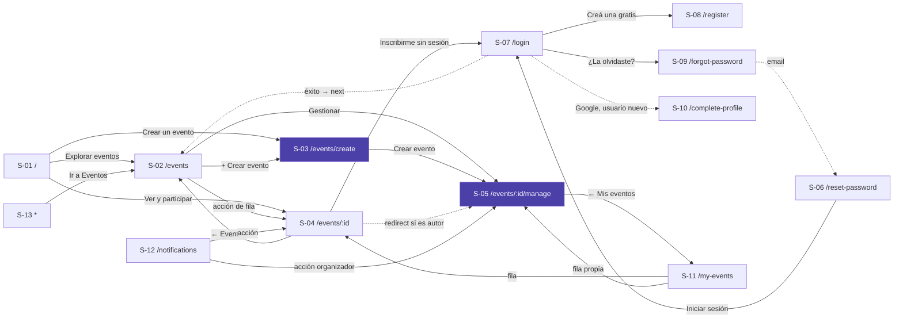
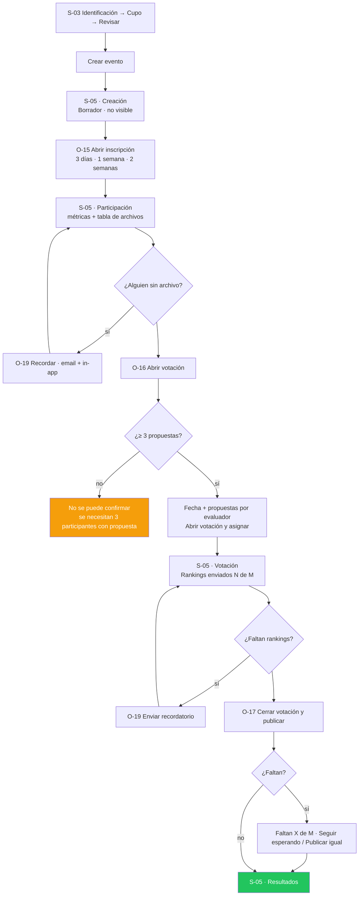

# Story Plan: S-016 (web) - Gestión del organizador

## Status

**Status:** Completed

## Story Reference

- **Story:** [S-016](../stories/S-016.gestion-del-organizador.md)
- **Service:** web
- **Summary:** Reescribe `ManageEventPage` (S-05) sobre el lenguaje visual nuevo: encabezado oscuro con
  estado y rol, línea de etapas con cierre editable, métricas (`StatTile`), tabla de participantes en
  variante de organizador (email, archivo, inscripción / voto), "Próximo paso" único por etapa con sus
  consecuencias, configuración aplicada, pausa y error por bloque. Cada transición se ejecuta desde su
  diálogo (`OpenRegistrationDialog` O-15, `OpenVotingDialog` O-16, `PublishResultsDialog` O-17), y se
  suman `ReminderDialog` (O-19) y `EditDeadlineDialog` (O-07). Abrir la votación es **una sola llamada**
  (`PATCH /stage` con `voting_config`). Las reglas viven en `src/domain/` (`stages`, `dates`, `voting`,
  `manage`). Se borran `StageAdvanceModal`, `VotingConfigurationPanel`, `EditDeadlineModal`,
  `EventTimeline`, `LinkButton` y `validateStageAdvance`.

### Prerrequisito de api (decisión de planificación)

> `GET /api/v1/events/{event_id}/voting-config` **está documentado en `docs/apis/api.yaml`** (agregado
> el 2026-10-09 con `/product-change-technical-definition`, changelog
> `docs/changelog/2026-10-09-api-get-voting-config.md`) y `api` figura en "Servicios Afectados" de
> S-016. **Falta implementarlo en la api**: el handler `DistributedVoteHandler.GetVotingConfiguration`
> existe pero todavía no tiene ruta en `api/cmd/api/main.go`. Al planificar, la usuaria decidió sumar
> este cambio para que la gestión muestre la "Configuración aplicada" en Votación (CA-8) y en
> Resultados (CA-15).

Contrato (de `api.yaml`):

```
GET /api/v1/events/{event_id}/voting-config        (JWT; RequireEventOwner, como el preview)
200 { "data": { "id": "uuid", "event_id": "uuid", "attachments_per_evaluator": 2,
                "quality_good_threshold": 0.6, "quality_bad_threshold": 0.3,
                "adjustment_magnitude": 3, "min_evaluations_per_file": 2,
                "created_at": "2026-10-05T13:00:00Z" } }          (sin updated_at)
400 { "error": "...", "code": "MISSING_EVENT_ID" | "INVALID_EVENT_ID" }
401 / 403 del middleware (para un no-admin, evento inexistente → 404 forma B NOT_FOUND)
404 { "error": "...", "code": "CONFIG_NOT_FOUND" }   (la votación todavía no se abrió)
500 { "error": "...", "code": "CONFIG_LOOKUP_ERROR" }
```

El código de `web` se puede implementar y testear antes con el servicio mockeado; la integración real
de Task 9 depende de la implementación en api (`/service-planify-story S-016 api`).

### Hallazgos del código que condicionan el plan

Relevados al planificar (no están en la documentación de la story, o la contradicen):

1. **No había fuente de la configuración aplicada en Votación** (resuelto con el endpoint del Prerrequisito).
   `GET /distributed-results?include_metrics=true` trae `configuration`, pero solo cuando el ranking ya
   está guardado (Resultados); en Votación responde `404 RESULTS_NOT_CALCULATED`. Con el endpoint
   nuevo, la gestión usa **una sola fuente** en Votación y Resultados (D-3).
2. **`participant_voting_status` solo trae a quien tiene asignación.** `participantVotingStatus(assignments)`
   (`distributed_vote_handler.go:1051`) arma `{participant_id: is_completed}` por asignación. Un
   inscrito sin propuesta **no figura** → columna VOTO "No participa". Pendientes de voto = entradas en
   `false`. "Rankings enviados N de M" = `completed_assignments` de `total_assignments`.
3. **`DateQuickPicker` descarta en silencio una fecha anterior a `min`** (`handleDate`: `if (!next ||
   isBlocked(next)) return;`). Si los diálogos le pasan `min`, el rechazo de CA-12 ("si elige el 8 oct,
   el diálogo lo rechaza indicando…") nunca se ve. Los diálogos **no pasan `min`** y validan con
   `domain/dates.ts`, que es lo que muestra el mensaje en `error` (D-6).
4. **`NumberStepper` solo acepta enteros al tipear** (`Number.isInteger(parsed)`). Los umbrales (0,6 /
   0,3) necesitan decimales: Task 4 lo extiende para pasos no enteros (D-7).
5. **`EventResults` (S-015) no recalcula**, pero S-016 (Flujo, "Publicar con faltantes" paso 3) pide
   el fallback `POST …/distributed-results/recalculate` en la gestión. Se agrega la prop opcional
   `recalculateIfMissing` (por defecto `false`: el detalle público no cambia; el test de S-015 que
   verifica que no recalcula sigue valiendo).
6. **Código que queda sin uso además de lo que nombra CA-20:** `EventTimeline` (`components/event-timeline/`),
   `LinkButton` + `link-button/styles.css` (solo los importa `ManageEventPage`),
   `EventService.getEventParticipants` (solo la gestión; se usa `getParticipants`),
   `DistributedVotingService.createVotingConfig` y `generateAssignments` (deprecados, S-006) y los
   endpoints `VOTING_CONFIG` / `GENERATE_ASSIGNMENTS` de `API_CONFIG` y `ApiConfig`. `Modal` **ya se
   borró en S-015**. Tests que cambian: `styles/tokens.test.ts` TS-6 (lee `StageAdvanceModal.css`),
   `auth-modal-removed.test.ts` TS-59 (afirma que `LinkButton` existe), `services/api.test.ts`
   (`getEventParticipants`), `domain/stages.test.ts` (`validateStageAdvance`).
7. **`EventService.updateEventStage` arma un `Event` parcial** a mano y descarta `voting`. Se reescribe
   para aceptar `voting_config` y devolver `{ stage, voting? }` (Task 2). `updateEstimatedEndDate` tiene
   `console.log` (prohibido por la convención): se quitan.
8. **El aviso "Evento creado" de S-014** llega por `location.state.notice === 'eventCreated'` y se
   limpia con `navigate(pathname, { replace: true, state: null })`. Se conserva en la página nueva
   (texto `manageEvent.created`).
9. **`ParticipantsTable` (S-015) es solo pública** (nombre + inscripción, "nunca muestra el email").
   La story pide la variante de organizador en el mismo componente (Task 4, D-8).
10. **Copy.** Los screen.md están en voseo ("Organizás", "Abrí", "Probá", "Compartí", "Elegí",
    "reanudalo", "No tenés"); se implementa el texto del "Catálogo nuevo" en español neutro (como D-8
    de S-015). Los avisos de éxito de CA-2 y CA-4 usan **el texto de la story** ("Se abrió la
    inscripción. Comparte el enlace para sumar participantes." / "Se abrió la votación. Se asignaron las
    propuestas."). O-07 pasa a "Los participantes reciben un email y una notificación con la nueva
    fecha." (ajuste de copy de la story).
11. **Carpetas fuera de lint.** `package.json` (script `lint` y override de `react/jsx-no-literals`) y
    `static-rules.test.ts` (`ROOTS`) listan carpetas una por una: se agregan `src/pages/manage-event` y
    las 5 carpetas de diálogos nuevas (Task 10).

### Decisiones tomadas al planificar

Aprobadas por la usuaria al planificar (D-1 a D-5 de la propuesta, más las dos preguntas).

- **D-1 · Pausar con confirmación, reanudar directo.** "Pausar evento" abre un `Dialog variant="alert"`
  con el copy del screen.md ("¿Pausar el evento?" · "Mientras esté pausado nadie puede inscribirse,
  subir propuestas ni votar." · "Cancelar" / "Pausar evento"). "Reanudar evento" llama directo a
  `PATCH /pause` (el screen.md no define copy de confirmación para reanudar). Sin aviso de éxito: el
  cambio se ve en el "Aviso pausado" y en el botón (CA-14).
- **D-2 · Compartir.** Creación: sin botón (no es público). Participación: "Copiar enlace de
  invitación" copia `shareUrl(origin, id)` con `navigator.clipboard.writeText` y muestra "✓ Copiado"
  durante `COPY_FEEDBACK_MS` (2 s); si la copia falla o no hay `clipboard`, abre `ShareDialog`.
  Votación y Resultados: "Compartir" abre `ShareDialog`. Mismo comportamiento para la acción del
  `EmptyState` "Copiar enlace de invitación".
- **D-3 · Configuración aplicada** (decisión de la usuaria: "Sumar un cambio de api"). En Votación y
  Resultados la página pide `DistributedVotingService.getVotingConfig(eventId)` →
  `GET /api/v1/events/{event_id}/voting-config` (Prerrequisito). "recomendados" si
  `quality_good_threshold`, `quality_bad_threshold`, `adjustment_magnitude` coinciden con
  `DEFAULT_THRESHOLDS` y `min_evaluations_per_file === recommendedMinEvaluations(attachments_per_evaluator)`;
  si no, "personalizados". Falla → `Callout tone="error"` "No pudimos cargar la configuración aplicada."
  con "Reintentar" en ese bloque (no deshabilita acciones: no se usa para decidir). `404
  CONFIG_NOT_FOUND` → el bloque no se muestra (no se inventa).
- **D-4 · Errores por bloque** (CA-16). Participantes o propuestas fallan → en la columna 8/12
  `Callout tone="error"` "No pudimos cargar los participantes." + "Reintentar" (reintenta los dos), sin
  tabla ni `EmptyState`; métricas que dependen de eso muestran "—". Estadísticas fallan (Votación) →
  `Callout` "No pudimos cargar las estadísticas de votación." + "Reintentar" en el lugar de la métrica
  de rankings, y la columna VOTO muestra "—". Con **cualquiera** de los tres errores, el botón de
  próximo paso y el de recordatorio quedan `disabled` hasta que la recarga funcione.
- **D-5 · Qué se pide por etapa.** Creación: solo el evento. Participación: participantes + propuestas.
  Votación: participantes + propuestas + estadísticas + configuración. Resultados: configuración +
  `EventResults` (que pide sus resultados). Cancelado: solo el evento.
- **D-6 · Fechas.** Los diálogos usan `DateQuickPicker` sin `min` (hallazgo 3). Abrir inscripción /
  votación: `variant="fromToday"`, presets `+3/+7/+14` sobre hoy, valor inicial hoy + 7, validación
  `validateNewDeadline(value, today)` → `'not_after_today'` si `value <= today`. Posponer:
  `variant="postpone"`, presets sobre el cierre actual, valor inicial cierre actual + 7,
  `validatePostpone(value, current)` → `'not_postponed'` si `value <= current`. La fecha se muestra
  como fin del día con `formatDateLong` ("lunes, 12 de octubre de 2026"). La api valida igual
  (`INVALID_ESTIMATED_DATE`, `CANNOT_ADVANCE_DEADLINE`).
- **D-7 · Campos avanzados de O-16 con `NumberStepper`.** Evaluaciones mínimas: `1…min(20, m)` paso 1
  (inicial `recommendedMinEvaluations(m)`, se reajusta al cambiar `m` mientras no se haya tocado).
  Peso del ajuste: `1…10` paso 1 (inicial `defaults.adjustment_magnitude`). Umbrales: `0…1` paso
  `0.05` (iniciales `defaults.quality_good_threshold` / `quality_bad_threshold`). `NumberStepper` se
  extiende para decimales (hallazgo 4). "Ajustes avanzados" = `<details>` nativo (gap aceptado).
- **D-8 · Descarga en la tabla** (decisión de la usuaria: "Mantener descarga"). En ARCHIVO, "✓
  {original_name}" es un `Button variant="tertiary" size="sm"` que llama
  `AttachmentService.downloadAttachment(id, original_name)`; si falla, `Callout tone="error"` "No
  pudimos descargar «{name}». Intenta de nuevo." arriba de la tabla. Sin propuesta: `StatusPill
  tone="warning"` "Falta archivo".
- **D-9 · Recordatorio.** N sale de `pendingFiles` / `pendingVotes` (`domain/manage.ts`). Botón solo
  con N > 0 y sin error de bloque visible; `disabled` si el evento está pausado. Tras enviar: botón
  `disabled` con "Recordatorio enviado" hasta recargar la página (estado local `reminderSent`, no se
  persiste). Aviso: "Recordatorio enviado a {count} participante(s)." con `recipients_count` de la
  respuesta.
- **D-10 · Aviso de éxito.** Un único `Callout tone="success"` arriba de la línea de etapas, dentro de
  un contenedor `role="status"` (región live), que se oculta a los `SUCCESS_NOTICE_MS` (5 s) o con el
  siguiente aviso. Tras cada diálogo exitoso: cerrar el diálogo, recargar la gestión (evento + bloques
  de la nueva etapa) y mover el foco al título del próximo paso cuando cambió la etapa.
- **D-11 · Permisos.** La ruta ya está en `RequireAuth` (sin sesión → `/login?next=%2Fevents%2F{id}%2Fmanage`).
  `event.creator_id !== user.id` (incluye `admin` no autor) → solo h1 "No tienes permiso para gestionar
  este evento" + `EmptyState` "Solo quien creó el evento puede gestionarlo." con "Ir a Eventos"; no se
  piden los bloques. `404` / `400 INVALID_EVENT_ID` / `null` → `<NotFoundPage />`. Otro error de carga
  del evento → `Callout` "No pudimos cargar el evento." + "Reintentar" + "Ir a Eventos".
- **D-12 · Cancelado.** Píldora "Cancelado", sin próximo paso, sin pausa, sin recordatorio, sin
  "Editar datos"; tabla de participantes visible si la etapa la muestra (solo lectura).
- **D-13 · Ubicación del código.**
  `src/domain/manage.ts` (+ test) reexportado en `src/domain/index.ts`;
  `src/pages/manage-event/ManageEventPage.{tsx,css,test.tsx}` (reescritos, prefijo `mep-`);
  `src/components/events/open-registration-dialog/OpenRegistrationDialog.{tsx,css,test.tsx}` (`ev-open-registration`);
  `src/components/events/open-voting-dialog/OpenVotingDialog.{tsx,css,test.tsx}` (`ev-open-voting`);
  `src/components/events/publish-results-dialog/PublishResultsDialog.{tsx,css,test.tsx}` (`ev-publish-results`);
  `src/components/events/reminder-dialog/ReminderDialog.{tsx,css,test.tsx}` (`ev-reminder`);
  `src/components/events/edit-deadline-dialog/EditDeadlineDialog.{tsx,css,test.tsx}` (`ev-edit-deadline`).

---

## Architectural Context

### Tech Stack

```
react 19.1.1            react-dom 19.1.1
react-router-dom 7.9.4  @react-oauth/google 0.13.4
react-scripts 5.0.1     typescript 4.9.5 (strict: true)
@testing-library/react 16.3.0     @testing-library/jest-dom 6.6.4
@testing-library/user-event 13.5.0  @testing-library/dom 10.4.1
```

Create React App, **no Next.js**: SPA client-side pura, sin SSR (ADR-006). Sin dependencias nuevas.

### Service Architecture (convenciones del servicio, estado real tras S-010 … S-015)

**Estructura** (`project-structure`): organización por tipo técnico.

```
src/
├── App.tsx                 # AppRoutes — /events/:eventId/manage ya está en RequireAuth (sin cambios)
├── components/ui/          # primitivos del DS — prefijo ui-
│   ├── number-stepper/     # MODIFICADO: decimales (Task 4)
│   └── icons/Icons.tsx     # MODIFICADO: + EditIcon, BellIcon (Task 4)
├── components/layout/      # chrome global — prefijo ly-
├── components/events/      # compuestos de dominio — prefijo ev-
│   ├── event-hero/ stage-timeline/ next-step-card/ progress-checklist/   # S-010 (se reutilizan)
│   ├── share-dialog/ participants-dialog/                                # S-015 (se reutilizan)
│   ├── participants-table/        # MODIFICADO: variante organizador (Task 4)
│   ├── edit-event-dialog/         # S-014 (se reutiliza)
│   ├── open-registration-dialog/  # NUEVO (O-15)
│   ├── open-voting-dialog/        # NUEVO (O-16)
│   ├── publish-results-dialog/    # NUEVO (O-17)
│   ├── reminder-dialog/           # NUEVO (O-19)
│   └── edit-deadline-dialog/      # NUEVO (O-07)
├── components/voting/event-results/   # MODIFICADO: recalculateIfMissing (Task 4)
├── components/{stage-advance-modal/, voting-configuration-panel/, event-timeline/, link-button/}  # SE BORRAN
├── pages/manage-event/     # REESCRITA: ManageEventPage — prefijo mep-
├── context/AuthContext.tsx # useAuth: user, isAuthenticated, loading
├── domain/                 # lógica pura + index.ts — NUEVO: manage.ts; cambian stages, dates, voting
├── i18n/                   # I18nProvider, useT, catálogos es/en, errores por code
├── services/api.ts         # EventService, AttachmentService, DistributedVotingService, …
├── config/api.ts           # apiRequest, ApiError, getErrorCode, API_CONFIG.ENDPOINTS
├── styles/tokens.css       # ÚNICA fuente de tokens del DS v2.0.0
└── test-utils/             # renderWithProviders, sampleUser, eventFixtures
```

- Carpeta `kebab-case`, componente `PascalCase`, **un componente por carpeta con su CSS al lado**.
- `export default` para el componente; tipos y helpers con export nombrado.
- Props tipadas en una `interface` arriba; `React.FC<Props>`.
- **Nada de `any`** en código nuevo; **nada de `console.log`** (solo `console.error` para errores reales).

**Routing** (`routing`, `src/App.tsx`) — sin cambios:

```tsx
<Route path="/events/:eventId/manage" element={<RequireAuth><ManageEventPage /></RequireAuth>} />
<Route path="/events/:eventId" element={<EventDetailPage />} />   {/* el autor es redirigido a /manage */}
```

- `RequireAuth` espera `loading === false` y, sin sesión, navega a `loginPathFor(pathname)` =
  `/login?next=${encodeURIComponent(path)}`; el login vuelve a `next` (S-011/S-012).
- "No encontrada" = `src/pages/not-found/NotFoundPage.tsx` (sin props), se renderiza en el lugar.
- Volver de la gestión = "← Mis eventos" → `/my-events` (elimina el loop S-04 ↔ S-05).

**Auth** (`auth`): `useAuth()` → `{ user: User | null, isAuthenticated, loading, … }`;
`User { id, name, email, role, joinedEventIDs, createdEventIDs }`. El `401` se maneja globalmente
(ADR-008): **no agregar manejo de 401 en páginas**. En tests: `jest.mock('…/context/AuthContext')` +
`renderWithProviders(ui, { auth })`.

**Obtención de datos** (`data-fetching`): `apiRequest` → servicios de `src/services/api.ts` →
componente con `loading` / `error` / dato; `setLoading(false)` en `finally`. Sin caché: cada montaje
pide de nuevo. Los bloques dependientes se piden después del evento y **en paralelo** entre sí
(`Promise.allSettled`), cada uno con su propio estado `loading | ready | error` (D-4, D-5).

**Formularios** (`forms`): controlados, botón con `loading` mientras envía (sin doble envío),
validación local antes de llamar (fechas y umbrales con `domain/`), la api como garantía final.

**Errores** (`error-handling`, DA-6): `apiRequest` lanza `ApiError { status, code?, details }`. El
texto del servidor **nunca** se muestra: `scopedMessageKeyForError(err, CODES, fallback)`. Errores de
carga → `Callout tone="error"` en el bloque con "Reintentar". Errores de acción → `Callout
tone="error"` **dentro del diálogo**, que queda abierto y conserva lo elegido (CA-18).

**Estilos** (`styling` + ADR-007 enmendado): CSS plano por componente, **solo tokens de
`src/styles/tokens.css`** (sin hex, sin `rgba()`, sin medidas que tengan token), **mobile-first**,
único corte `@media (min-width: 768px)`, nunca `max-width` en `@media`, clases con prefijo del
componente.

**Testing** (`testing`): `.test.tsx` al lado; consultas por rol/label/texto; `userEvent` v13
(síncrono); `findBy*` para lo asíncrono; `jest.mock('…/services/api')` (automock) y
`jest.mock('…/context/AuthContext')`; `jest.useFakeTimers()` para los 2 s de "Copiado" y los 5 s del
aviso. No sacar el `moduleNameMapper` de `package.json`.

```bash
cd web && CI=true npm test          # una corrida
cd web && npm run typecheck && npm run lint
```

### Relevant ADRs

Los ADRs del producto no tienen sección "Implementation Rules"; se copian la decisión y las reglas
que de ella se derivan.

- **ADR-006: Create React App en lugar de Next.js** — *Decisión:* "Create React App (`react-scripts`
  5.0.1) con react-router-dom 7.9.4. SPA client-side pura: sin SSR, sin file-based routing, sin Server
  Components. Todo el render ocurre en el navegador."
- **ADR-007: CSS plano con variables (enmienda REQ-003)** — reglas verbatim de la enmienda:
  - "**Una sola fuente de tokens:** `web/src/styles/tokens.css`, con los tokens del DS `web` v2.0.0."
  - "**Sin hex literales** en los componentes nuevos."
  - "**Lenguaje visual nuevo:** de glassmorphism oscuro a 'bandas oscuras + contenido claro'."
  - "**Breakpoints como escala nombrada** (`--bp-mobile: 768px` documentado; en `@media` se usa el
    literal) y **mobile-first** en los componentes nuevos."
  - "**Componentes en vez de sistemas de clases:** `web/src/components/ui/` con los primitivos del DS
    (`Button`, `TextField`, `Dialog`, `DataTable`, …) y compuestos de dominio en
    `web/src/components/{dominio}/`."
  - "**Prefijo de clase por componente** para evitar colisiones."
- **ADR-008: Manejo global de expiración de sesión por CustomEvent** — *Decisión:* "Ante un `401`,
  `apiRequest` limpia la sesión de `localStorage` y emite un `CustomEvent` llamado `auth:logout`.
  `AuthContext` registra un listener en `window` y, al recibirlo, actualiza su estado para desloguear
  al usuario sin recargar la página." → La gestión no maneja 401.
- **ADR-001: Votación distribuida con Modified Borda Count** — la consecuencia que el diálogo O-17
  explica: quien no completa su asignación queda con calidad `Q_i = 0` y su propia propuesta baja `n`
  posiciones (`adjustment_magnitude`).
- **ADR-009: Notificaciones persistidas con polling** — los recordatorios y el cambio de cierre
  generan notificaciones in-app (`file_reminder`, `vote_reminder`, `deadline_changed`) además del
  email; por eso O-19 y O-07 dicen "email y notificación".
- **ADR-010: i18n propio sobre `Intl`** — *Decisión (verbatim):*
  - "`I18nProvider` (Context) y `useT()`."
  - "Catálogos `es.ts` y `en.ts`; **el tipo de `en` se deriva de `es`**, así una clave faltante no compila."
  - "Interpolación simple (`{name}`) y plurales con `Intl.PluralRules`."
  - "Errores de la api traducidos por `code` (`errors.<code>`), con fallback genérico; nunca se muestra `err.message`."
  - "Verificación: lint contra texto embebido en JSX en las carpetas nuevas y un test que rechaza formas de voseo en el catálogo `es`."
- **REQ-003 DA-4 (verbatim)** — "Abrir la votación es una sola operación atómica en el backend. …
  Orquestarlo en el cliente con tres llamadas puede dejar el evento en `voting` sin configuración … Se
  extiende `PATCH /stage` con `voting_config` y el handler valida **todo antes de escribir** … También
  resuelve el resto de D-05: la regla vive solo en el backend y en un único módulo del front." → una
  sola llamada desde `OpenVotingDialog`; la web deja de usar `POST /voting-config` y
  `POST /generate-assignments`.
- **REQ-003 DA-5 (verbatim)** — "Reglas de dominio del front en `src/domain/`, sin duplicar las del
  backend. … El front define nombres/orden/siguiente etapa, validación de archivo …, formato de fechas
  y escala de puntaje. **No recalcula** el `m` recomendado ni el máximo: los pide a
  `GET /voting-config/preview`, que usa la misma función que valida (`VotingService`)."
- **REQ-003 DA-6 (verbatim)** — "`ApiError` conserva `code` y la web traduce por `code` … Los
  componentes muestran `t('errors.' + code)` con fallback genérico; nunca `err.message` … Elimina los
  `err.message.includes(...)`."
- **REQ-003 DA-8 (verbatim, lo aplicable)** — "`Dialog` reemplaza las tres implementaciones de overlay
  (`Modal`, `stage-modal-*`, `share-menu`) con `role="dialog"`, `aria-modal`, foco atrapado y cierre por
  Escape" · "Se eliminan los componentes reemplazados y el código muerto".
- **REQ-003 DA-9 (verbatim)** — "`/events/:eventId/manage` | Gestión (2a–2f) | `RequireAuth` + autor
  (si no, "sin permiso", AC 32)".
- **REQ-003 L-1 / L-2 / L-5 / L-10 / L-11** — publicar con rankings faltantes con aviso; decir la
  consecuencia de no subir archivo antes de abrir la votación; un solo diálogo para abrir la votación;
  fechas sin hora mostradas como fin del día; copy neutro.

### API Context

`apiRequest` agrega `Authorization: Bearer` si hay token. Formas de error de la api: `ApiError
{error, code, details?}` (handlers), `MiddlewareError {error: CODE, message}` (auth y permisos:
`UNAUTHORIZED`, `FORBIDDEN`, `NOT_FOUND`) y `LegacyError {error}` (votación distribuida); `ApiError`
del front normaliza las dos primeras a `code`. Todos los endpoints de abajo existen en
`docs/apis/api.yaml`.

#### `GET /api/v1/events/{event_id}` — detalle (auth opcional)

`200 { data: EventDetail }`. `EventDetail` = `EventListItem` + `organizer` + `attachment_count`.
Campos usados: `id`, `name`, `description`, `stage`, `author_id`, `max_participants` (nullable),
`participant_ids`, `participants_count`, `participation_estimated_end_date`,
`voting_estimated_end_date` (`date`, nullable), `is_paused`, `is_cancelled`, `created_at`,
`organizer` ("Si el evento no define organizador, cae al nombre del autor"). `400 MISSING_EVENT_ID |
INVALID_EVENT_ID`; `404 EVENT_NOT_FOUND` (también Creación ajena). El front lo mapea con `toEvent` a
`Event` (`title`, `creator_id` = `author_id`, …).

#### `PATCH /api/v1/events/{event_id}/stage` — avanzar etapa (JWT, autor o admin)

Body:
```json
{
  "stage": "participation | voting | results",
  "estimated_end_date": "YYYY-MM-DD (obligatoria si stage es participation o voting)",
  "voting_config": {
    "attachments_per_evaluator": "integer 1..50 (req)",
    "quality_good_threshold": "number 0..1 (default 0.6)",
    "quality_bad_threshold": "number 0..1 (default 0.3)",
    "adjustment_magnitude": "integer 1..10 (default 3)",
    "min_evaluations_per_file": "integer 1..20 (default min(3, attachments_per_evaluator))"
  }
}
```
`voting_config` obligatorio si `stage = voting`. `200 { data: { id, name, description, start_date,
end_date, stage, participation_estimated_end_date, voting_estimated_end_date, author_id, updated_at },
message, code: "STAGE_UPDATED", transition: { from, to }, voting?: { configuration:
VotingConfiguration, assignments_count, total_attachments } }` (`voting` solo cuando `stage = voting`).
Errores: `400` `MISSING_EVENT_ID`, `INVALID_EVENT_ID`, `INVALID_PAYLOAD`, `INVALID_STAGE`,
`INVALID_TRANSITION` (+ `current_stage`, `requested_stage`), `MISSING_ESTIMATED_DATE`,
`INVALID_DATE_FORMAT`, `INVALID_ESTIMATED_DATE`, `INSUFFICIENT_ATTACHMENTS` (+ `current_count`,
`required_minimum: 3`), `MISSING_VOTING_CONFIG`, `INVALID_THRESHOLDS`, `M_EXCEEDS_EVALUABLE`,
`MATH_CONSTRAINT_VIOLATION`; `401`/`403` middleware; `404 EVENT_NOT_FOUND`; `500`
`PARTICIPANTS_ERROR`, `ATTACHMENTS_ERROR`, `DB_UPDATE_ERROR`, `RETRIEVAL_ERROR`, `VOTING_SETUP_ERROR`.
Pasar a `results` calcula y guarda el ranking aun con faltantes; si el cálculo falla, la etapa cambia
igual.

#### `GET /api/v1/events/{event_id}/voting-config/preview` — reparto (JWT, `RequireEventOwner`)

`200 { data: { participants_count, participants_with_proposal, can_open_voting, min_m, max_m,
recommended_m, defaults: { quality_good_threshold: 0.6, quality_bad_threshold: 0.3,
adjustment_magnitude: 3 } } }` — `participants_count` = inscriptos; `participants_with_proposal` =
`k`; `can_open_voting` = `k >= 3`; `max_m` = `k − 1`. "El `min_evaluations_per_file` recomendado es
`min(3, m)`." `401`, `403`, `404 EVENT_NOT_FOUND`. Ya tipado en `src/domain/voting.ts` como
`VotingConfigPreview`.

#### `GET /api/v1/events/{event_id}/voting-config` — configuración aplicada (JWT, `RequireEventOwner`, S-016)

Ver "Prerrequisito de api". `200 { data: VotingConfiguration }` (sin `updated_at`); `400
MISSING_EVENT_ID | INVALID_EVENT_ID`; `404 CONFIG_NOT_FOUND`; `500 CONFIG_LOOKUP_ERROR`. `VotingConfiguration` (schema de api.yaml): `id`, `event_id`,
`attachments_per_evaluator` ("Parámetro m"), `quality_good_threshold`, `quality_bad_threshold`,
`adjustment_magnitude` ("Parámetro n"), `min_evaluations_per_file`, `created_at`, `updated_at`.

#### `PATCH /api/v1/events/{event_id}/estimated-end-date` — posponer (JWT)

Body `{ "stage": "participation | voting", "estimated_end_date": "YYYY-MM-DD" }`. `200 { message,
data: { event_id, stage, estimated_end_date, previous_date }, code: "ESTIMATED_DATE_UPDATED" }`
(`previous_date` "Cadena vacía si no había fecha previa (no null)"). `400` `INVALID_EVENT_ID`,
`INVALID_PAYLOAD`, `INVALID_STAGE`, `INVALID_DATE_FORMAT`, `INVALID_ESTIMATED_DATE`,
`CANNOT_ADVANCE_DEADLINE` ("solo se puede posponer … nunca adelantarlo"; `details`
`{current_date, requested_date}`), `INVALID_STAGE_FOR_EDIT`; `404 EVENT_NOT_FOUND`; `500
UPDATE_ERROR`. Efecto (S-009): email + notificación `deadline_changed`.

#### `PATCH /api/v1/events/{event_id}/pause` — pausar / reanudar (JWT)

Sin body; **toggle** de `is_paused`. `200 { data: { id, name, stage, is_paused }, message, code:
"EVENT_PAUSED" | "EVENT_RESUMED" }`. `400 INVALID_EVENT_ID`; `404 EVENT_NOT_FOUND`; `409
EVENT_CANCELLED`; `500 UPDATE_ERROR`.

#### `POST /api/v1/events/{event_id}/reminders` — recordatorio (JWT, `RequireEventOwner`)

Body `{ "type": "file | vote" }`. `file` solo en `participation` (destinatarios = inscriptos sin
propuesta); `vote` solo en `voting` (asignaciones sin completar). `200 { data: { type,
recipients_count }, message, code: "REMINDER_SENT" }`. `400 INVALID_PAYLOAD`; `401`; `403`; `404
EVENT_NOT_FOUND`; `409` `INVALID_EVENT_STAGE` (+ `current_stage`), `NO_PENDING_RECIPIENTS`,
`EVENT_PAUSED_OR_CANCELLED`; `500 RETRIEVAL_ERROR`.

#### `GET /api/v1/events/{event_id}/participants` — participantes (JWT)

`200 { data: { event: { id, name, stage }, participants: [{ id, name, email, role: creator |
participant, created_at }] }, count }`. ⚠️ "Devuelve `email` a cualquier usuario autenticado; la web
solo lo muestra al organizador." Se usa `EventService.getParticipants` (filtra `role ===
'participant'`, conserva `created_at`).

#### `GET /api/v1/events/{event_id}/attachments` — propuestas (JWT)

"El autor del evento y un `admin` reciben todas las propuestas". `200 { data: [{ id, event_id,
participant_id, original_name, file_size, mime_type, description?, uploaded_at, url }], count }`. Un
evento inexistente devuelve `200 { data: [] }`. Descarga: `GET /api/v1/attachments/{attachment_id}/download`
(JWT) vía `AttachmentService.downloadAttachment(id, filename)`.

#### `GET /api/v1/events/{event_id}/voting-statistics` — avance (público)

`200 { data: { event_id, total_votes, total_assignments, completed_assignments, completion_rate
("Fracción entre 0 y 1"), attachments_with_votes, unique_voters, average_quality_score,
participants_with_good_quality, participants_with_bad_quality, participant_voting_status: { "<uuid>":
boolean } } }` ("UUID del participante → si ya votó"; solo participantes con asignación, hallazgo 2).
Errores en `LegacyError` (`400`, `500`) o `404 EVENT_NOT_FOUND`.

#### `GET /api/v1/events/{event_id}/distributed-results` — resultados (público, solo lectura)

`200 { data: { id, event_id, global_ranking, adjusted_ranking, participant_qualities,
total_participants, total_votes, attachments_per_evaluator, calculated_at, updated_at } }`; `404`
forma B `{ error: "RESULTS_NOT_CALCULATED", message }` si no hay ranking guardado. Fallback (sesión):
`POST /api/v1/events/{event_id}/distributed-results/recalculate` — "Recalcula el MBC … y hace upsert
… lo llama el frontend como fallback si un evento llegó a `results` sin ranking guardado. La respuesta
tiene el mismo shape que el GET". ⚠️ Muta estado.

#### Servicios (Task 2)

| Servicio | Cambio |
|---|---|
| `EventService.updateEventStage(eventId, stage, estimatedEndDate?, votingConfig?)` | Reescrito. Body `{ stage, estimated_end_date?, voting_config? }` (solo las claves presentes). Devuelve `StageUpdateResult = { stage: EventStage; voting?: { configuration: VotingConfiguration; assignments_count: number; total_attachments: number } }` (de `data.stage` y `voting`). Sin `try/catch` que solo loguea. |
| `EventService.updateEstimatedEndDate(eventId, stage, date)` | Igual contrato; se quitan los `console.log`. |
| `EventService.sendReminder(eventId, type: ReminderType)` | **Nuevo.** `POST API_CONFIG.ENDPOINTS.EVENT_REMINDERS(eventId)` con `{ type }` → `{ type, recipients_count }` de `data`. |
| `EventService.getEventParticipants` | **Se borra** (la gestión usa `getParticipants`). |
| `DistributedVotingService.getVotingConfigPreview(eventId)` | **Nuevo.** `GET VOTING_CONFIG_PREVIEW(eventId)` → `data` como `VotingConfigPreview`. |
| `DistributedVotingService.getVotingConfig(eventId)` | **Nuevo** (S-016, pendiente en api). `GET VOTING_CONFIG(eventId)` → `data` como `VotingConfiguration`; `CONFIG_NOT_FOUND` → `null`. |
| `DistributedVotingService.createVotingConfig`, `generateAssignments` | **Se borran** (deprecados S-006). |
| `API_CONFIG.ENDPOINTS` / `ApiConfig` | + `VOTING_CONFIG_PREVIEW: (id) => /api/v1/events/${id}/voting-config/preview`, + `EVENT_REMINDERS: (id) => /api/v1/events/${id}/reminders`; `VOTING_CONFIG` queda (ahora para el GET); − `GENERATE_ASSIGNMENTS`. |
| Tipos (`src/types/index.ts`) | + `ReminderType = 'file' \| 'vote'`, `ReminderResult { type: ReminderType; recipients_count: number }`, `VotingConfigInput` (`attachments_per_evaluator` req + los 4 opcionales), `StageUpdateResult`. `VotingStatistics` + `event_id?`, `attachments_with_votes?`, `unique_voters?` (los devuelve la api). |

### Dominio — `src/domain/` (Task 1)

Lógica pura, sin React, reexportada en `src/domain/index.ts`.

**`stages.ts`** (cambia):
```ts
export type TransitionDialog = 'openRegistration' | 'openVoting' | 'publishResults';
/** Diálogo que ejecuta el paso siguiente de cada etapa; null en Resultados. */
export const transitionDialog = (stage: EventStage): TransitionDialog | null;
// creation → 'openRegistration' · participation → 'openVoting' · voting → 'publishResults' · results → null
```
Se conservan `STAGE_ORDER`, `MIN_PROPOSALS_TO_VOTE`, `stageIndex`, `getNextStage`, `stageNameKey`,
`stageStatus`. **Se borran** `StageAdvanceIssue`, `StageAdvanceInput`, `validateStageAdvance` y
`requiresEstimatedEndDate` (y sus tests): la regla "todos votaron" desaparece y el resto la valida la
api y los diálogos.

**`dates.ts`** (agrega):
```ts
export const DURATION_PRESETS = [3, 7, 14] as const;      // "3 días · 1 semana · 2 semanas" / "+3 días · …"
export const DEFAULT_DURATION_DAYS = 7;
export type DeadlineIssue = 'not_after_today' | 'not_postponed';
export const validateNewDeadline = (date: string, today: string): DeadlineIssue | null; // date <= today → 'not_after_today'
export const validatePostpone = (date: string, current: string): DeadlineIssue | null;  // date <= current → 'not_postponed'
```
(comparación de strings `YYYY-MM-DD`, las fechas ya están en calendario local).

**`voting.ts`** (agrega; `validateThresholds`, `DEFAULT_THRESHOLDS`, `recommendedMinEvaluations`,
`VotingConfigPreview` ya existen):
```ts
export const ADJUSTMENT_MIN = 1, ADJUSTMENT_MAX = 10, MIN_EVALUATIONS_MAX = 20, THRESHOLD_STEP = 0.05;
export interface VotingConfigDraft { attachments_per_evaluator: number; min_evaluations_per_file: number;
  adjustment_magnitude: number; quality_good_threshold: number; quality_bad_threshold: number; }
export const initialVotingDraft = (p: VotingConfigPreview): VotingConfigDraft;
// m = recommended_m; min_evaluations_per_file = recommendedMinEvaluations(m); resto de p.defaults
export type VotingDraftIssue = ThresholdIssue | 'adjustment_out_of_range';
export const validateVotingDraft = (d: VotingConfigDraft): VotingDraftIssue | null;
export const isRecommendedConfig = (c: Pick<VotingConfiguration, 'attachments_per_evaluator' |
  'min_evaluations_per_file' | 'adjustment_magnitude' | 'quality_good_threshold' | 'quality_bad_threshold'>): boolean;
// umbrales y peso == DEFAULT_THRESHOLDS (comparados en centésimos) y min_evaluations === recommendedMinEvaluations(m)
```
"Evaluaciones por archivo" del resumen de O-16 = `m` (cada uno de los `k` evaluadores recibe `m`
propuestas de las `k`: `k·m / k`).

**`manage.ts`** (nuevo):
```ts
export type ManageStage = 'creation' | 'participation' | 'voting' | 'results' | 'cancelled';
export const manageStage = (e: Pick<Event, 'stage' | 'is_cancelled'>): ManageStage;   // is_cancelled manda
export const canPause = (e: Pick<Event, 'stage' | 'is_cancelled'>): boolean;          // no cancelado y stage !== 'results'
export const pendingFiles = (participants: EventParticipant[], attachments: Pick<Attachment, 'participant_id'>[]): EventParticipant[];
export const pendingVotes = (participants: EventParticipant[], status: Record<string, boolean> | undefined): EventParticipant[];
// status[p.id] === false (los que no figuran = "No participa", no son pendientes)
export type VoteCell = 'sent' | 'pending' | 'notParticipating';
export const voteCell = (participantId: string, status: Record<string, boolean> | undefined): VoteCell;
export interface VotingProgress { sent: number; total: number; missing: number; complete: boolean; }
export const votingProgress = (s: Pick<VotingStatistics, 'completed_assignments' | 'total_assignments'>): VotingProgress;
// complete = total > 0 && sent === total
export type ManagePillKey = 'manage.pill.draft' | 'manage.pill.open' | 'manage.pill.openCloses' | 'manage.pill.closesToday'
  | 'manage.pill.voting' | 'manage.pill.votingCloses' | 'manage.pill.results' | 'manage.pill.paused' | 'manage.pill.cancelled';
export const managePill = (e: Event, now?: Date): { key: ManagePillKey; params?: { count: number } };
// cancelado > pausado > etapa; con cierre: daysUntilClose ≥ 1 → openCloses/votingCloses {count}; 0 → closesToday (con el prefijo de la etapa); sin cierre o vencido → open/voting
export const reminderType = (stage: EventStage): ReminderType | null;   // participation → 'file' · voting → 'vote' · resto null
export const REMINDER_PREVIEW_LIMIT = 5;                                // "hasta 5; luego y {n} más"
```

### Catálogo nuevo (fuente de verdad del texto, hallazgo 10)

Namespace nuevo `manage` en `src/i18n/catalogs/es.ts` y `en.ts` (después de `manageEvent`); se
**conservan** `manageEvent.created` y `manageEvent.updated` (S-014) y se borra `manageEvent.editData`
(pasa a `manage.editData`). Español neutro. Las claves `plural(...)` usan `count`. Los eyebrows en
mayúsculas del screen.md se guardan en minúscula de oración (CSS los pasa a mayúsculas).

| Clave | es | en |
|---|---|---|
| `manage.back` | ← Mis eventos | ← My events |
| `manage.role` | Organizas este evento | You organize this event |
| `manage.meta` | {organizer} · creado el {date} | {organizer} · created on {date} |
| `manage.editData` | Editar datos | Edit details |
| `manage.copyInvite` | Copiar enlace de invitación | Copy invitation link |
| `manage.copied` | ✓ Copiado | ✓ Copied |
| `manage.share` | Compartir | Share |
| `manage.loading` | Cargando gestión… | Loading management… |
| `manage.loadError` | No pudimos cargar el evento. | We couldn't load the event. |
| `manage.goToEvents` | Ir a Eventos | Go to Events |
| `manage.forbidden.title` | No tienes permiso para gestionar este evento | You don't have permission to manage this event |
| `manage.forbidden.text` | Solo quien creó el evento puede gestionarlo. | Only the person who created the event can manage it. |
| `manage.pill.draft` | Borrador · no visible | Draft · not visible |
| `manage.pill.open` | Inscripción abierta | Registration open |
| `manage.pill.openCloses` | plural: `Inscripción abierta · cierra en {count} día` / `… {count} días` | plural: `Registration open · closes in {count} day` / `… {count} days` |
| `manage.pill.openClosesToday` | Inscripción abierta · cierra hoy | Registration open · closes today |
| `manage.pill.voting` | Votación en curso | Voting in progress |
| `manage.pill.votingCloses` | plural: `Votación en curso · cierra en {count} día` / `… {count} días` | plural: `Voting in progress · closes in {count} day` / `… {count} days` |
| `manage.pill.votingClosesToday` | Votación en curso · cierra hoy | Voting in progress · closes today |
| `manage.pill.results` | Finalizado · resultados publicados | Finished · results published |
| `manage.pill.paused` | Pausado | Paused |
| `manage.pill.cancelled` | Cancelado | Cancelled |
| `manage.timeline.creationNow` | Configuras el evento | You set up the event |
| `manage.timeline.noDeadline` | Sin fecha de cierre | No closing date |
| `manage.timeline.closes` | Cierra el {date} | Closes on {date} |
| `manage.timeline.files` | plural: `{count} archivo recibido` / `{count} archivos recibidos` | plural: `{count} file received` / `{count} files received` |
| `manage.timeline.published` | Publicados | Published |
| `manage.timeline.edit` | editar | edit |
| `manage.metrics.registered` | Inscriptos | Registered |
| `manage.metrics.registeredA11y` | Inscriptos: {count} de {max} | Registered: {count} of {max} |
| `manage.metrics.files` | Archivos recibidos | Files received |
| `manage.metrics.filesA11y` | Archivos recibidos: {count} de {total} | Files received: {count} of {total} |
| `manage.metrics.rankings` | Rankings enviados | Rankings sent |
| `manage.metrics.rankingsValue` | {sent} de {total} | {sent} of {total} |
| `manage.metrics.rankingsA11y` | Rankings enviados: {sent} de {total} | Rankings sent: {sent} of {total} |
| `manage.metrics.deadline` | Cierre | Closing |
| `manage.metrics.days` | plural: `{count} día` / `{count} días` | plural: `{count} day` / `{count} days` |
| `manage.metrics.closesToday` | Cierra hoy | Closes today |
| `manage.metrics.noDeadline` | Sin definir | Not set |
| `manage.participants.title` | Participantes | Participants |
| `manage.participants.caption` | Participantes del evento | Event participants |
| `manage.participants.name` | Nombre | Name |
| `manage.participants.email` | Email | Email |
| `manage.participants.file` | Archivo | File |
| `manage.participants.registeredAt` | Inscripción | Registered |
| `manage.participants.vote` | Voto | Vote |
| `manage.participants.fileMissing` | Falta archivo | File missing |
| `manage.participants.download` | Descargar {name} | Download {name} |
| `manage.participants.voteSent` | ✓ Enviado | ✓ Sent |
| `manage.participants.votePending` | Pendiente | Pending |
| `manage.participants.voteNotParticipating` | No participa | Not participating |
| `manage.participants.error` | No pudimos cargar los participantes. | We couldn't load the participants. |
| `manage.participants.statsError` | No pudimos cargar las estadísticas de votación. | We couldn't load the voting statistics. |
| `manage.participants.downloadError` | No pudimos descargar «{name}». Intenta de nuevo. | We couldn't download "{name}". Try again. |
| `manage.empty.title` | Todavía no hay inscriptos | No one has registered yet |
| `manage.empty.creation` | Cuando abras la inscripción podrás compartir el enlace. | Once you open registration you'll be able to share the link. |
| `manage.empty.participation` | Comparte el enlace de invitación para sumar participantes. | Share the invitation link to bring in participants. |
| `manage.reminder.file` | plural: `Recordar a quienes no subieron archivo ({count})` (one y other iguales) | plural: `Remind those who haven't uploaded a file ({count})` |
| `manage.reminder.vote` | plural: `Enviar recordatorio a {count} pendiente` / `… {count} pendientes` | plural: `Send a reminder to {count} pending person` / `… {count} pending people` |
| `manage.reminder.sent` | Recordatorio enviado | Reminder sent |
| `manage.nextStep.eyebrow` | Próximo paso | Next step |
| `manage.nextStep.creation.title` | Abre la inscripción | Open registration |
| `manage.nextStep.creation.text` | Mientras esté en creación, nadie puede ver ni sumarse al evento. Revisa que esté todo listo: | While it's in setup, no one can see or join the event. Check that everything is ready: |
| `manage.nextStep.creation.action` | Abrir inscripción → | Open registration → |
| `manage.nextStep.checklist.details` | Nombre y descripción | Name and description |
| `manage.nextStep.checklist.capacity` | Cupo: {count} participantes | Capacity: {count} participants |
| `manage.nextStep.checklist.deadline` | Fecha de cierre de inscripción (la defines al abrir) | Registration closing date (you set it when opening) |
| `manage.nextStep.participation.title` | Pasar a votación | Move to voting |
| `manage.nextStep.participation.text` | Se cierra la inscripción y cada participante con propuesta recibe propuestas de otros para evaluar. | Registration closes and every participant with a proposal receives others' proposals to review. |
| `manage.nextStep.participation.action` | Configurar y abrir votación → | Set up and open voting → |
| `manage.nextStep.voting.title` | Publicar resultados | Publish results |
| `manage.nextStep.voting.text` | Recomendado cuando todos hayan votado o al llegar el cierre ({date}). | Recommended once everyone has voted or when the closing date arrives ({date}). |
| `manage.nextStep.voting.textNoDate` | Recomendado cuando todos hayan votado o al llegar el cierre. | Recommended once everyone has voted or when the closing date arrives. |
| `manage.nextStep.voting.action` | Cerrar votación y publicar | Close voting and publish |
| `manage.consequence.missingFiles` | plural: `{count} participante todavía no subió su archivo y no va a evaluar ni ser evaluado.` / `{count} participantes todavía no subieron su archivo y no van a evaluar ni ser evaluados.` | plural: `{count} participant hasn't uploaded their file yet and won't review or be reviewed.` / `{count} participants haven't uploaded their file yet and won't review or be reviewed.` |
| `manage.consequence.minimum` | Se necesitan al menos 3 participantes con propuesta para abrir la votación. Hoy hay {count}. | At least 3 participants with a proposal are needed to open voting. Right now there are {count}. |
| `manage.consequence.missingRankings` | Faltan {missing} de {total} rankings. | {missing} of {total} rankings are missing. |
| `manage.config.title` | Configuración aplicada | Applied settings |
| `manage.config.text` | plural (`count` = m): `{count} propuesta por evaluador · mínimo {min} evaluaciones por archivo · ajustes de calidad {quality}` / `{count} propuestas por evaluador · …` | plural: `{count} proposal per reviewer · at least {min} reviews per file · {quality} quality settings` / `{count} proposals per reviewer · …` |
| `manage.config.recommended` | recomendados | recommended |
| `manage.config.custom` | personalizados | custom |
| `manage.config.error` | No pudimos cargar la configuración aplicada. | We couldn't load the applied settings. |
| `manage.summary.title` | Resumen | Summary |
| `manage.summary.participants` | Participantes | Participants |
| `manage.summary.participantsValue` | 0 / {max} | 0 / {max} |
| `manage.summary.files` | Archivos | Files |
| `manage.summary.deadline` | Cierre inscripción | Registration closes |
| `manage.summary.notSet` | Sin definir | Not set |
| `manage.after.title` | Después | Next |
| `manage.after.text` | Los participantes se inscriben y suben su archivo hasta la fecha de cierre que definas. | Participants register and upload their file until the closing date you set. |
| `manage.pause.action` | Pausar evento | Pause event |
| `manage.pause.resume` | Reanudar evento | Resume event |
| `manage.pause.confirmTitle` | ¿Pausar el evento? | Pause the event? |
| `manage.pause.confirmText` | Mientras esté pausado nadie puede inscribirse, subir propuestas ni votar. | While it's paused, no one can register, upload proposals or vote. |
| `manage.pause.cancel` | Cancelar | Cancel |
| `manage.pause.error` | No pudimos cambiar el estado del evento. Intenta de nuevo. | We couldn't change the event's status. Try again. |
| `manage.pausedNotice` | El evento está pausado. Los participantes no pueden inscribirse, subir propuestas ni votar hasta que lo reanudes. | The event is paused. Participants can't register, upload proposals or vote until you resume it. |
| `manage.success.registrationOpened` | Se abrió la inscripción. Comparte el enlace para sumar participantes. | Registration is open. Share the link to bring in participants. |
| `manage.success.votingOpened` | Se abrió la votación. Se asignaron las propuestas. | Voting is open. Proposals have been assigned. |
| `manage.success.resultsPublished` | Resultados publicados. | Results published. |
| `manage.success.reminderSent` | plural: `Recordatorio enviado a {count} participante.` / `… a {count} participantes.` | plural: `Reminder sent to {count} participant.` / `… to {count} participants.` |
| `manage.success.deadlineUpdated` | Cierre actualizado. | Closing date updated. |
| `manage.dialog.close` | Cerrar | Close |
| `manage.dialog.cancel` | Cancelar | Cancel |
| `manage.dialog.presets.3` | 3 días | 3 days |
| `manage.dialog.presets.7` | 1 semana | 1 week |
| `manage.dialog.presets.14` | 2 semanas | 2 weeks |
| `manage.dialog.postponePresets.3` | +3 días | +3 days |
| `manage.dialog.postponePresets.7` | +1 semana | +1 week |
| `manage.dialog.postponePresets.14` | +2 semanas | +2 weeks |
| `manage.dialog.change` | Cambiar | Change |
| `manage.dialog.dateNotAfterToday` | Elige una fecha posterior a hoy. | Choose a date after today. |
| `manage.openRegistration.eyebrow` | Creación → Participación | Setup → Participation |
| `manage.openRegistration.title` | Abrir inscripción | Open registration |
| `manage.openRegistration.text` | El evento pasa a ser público. Las personas van a poder inscribirse y subir su archivo. | The event becomes public. People will be able to register and upload their file. |
| `manage.openRegistration.dateLabel` | ¿Hasta cuándo se pueden inscribir? | Until when can people register? |
| `manage.openRegistration.help` | Se muestra a los participantes. Puedes posponerla después. | Participants will see it. You can postpone it later. |
| `manage.openRegistration.error` | No pudimos abrir la inscripción. Intenta de nuevo. | We couldn't open registration. Try again. |
| `manage.openRegistration.confirm` | Abrir inscripción | Open registration |
| `manage.openRegistration.loading` | Abriendo… | Opening… |
| `manage.openVoting.eyebrow` | Participación → Votación | Participation → Voting |
| `manage.openVoting.title` | Abrir votación | Open voting |
| `manage.openVoting.text` | Se cierra la inscripción y el sistema reparte las propuestas entre los participantes que subieron la suya. Nadie evalúa su propio archivo. | Registration closes and the system distributes the proposals among the participants who uploaded theirs. No one reviews their own file. |
| `manage.openVoting.proposals` | Propuestas | Proposals |
| `manage.openVoting.reviewers` | Evaluadores | Reviewers |
| `manage.openVoting.perFile` | Evaluaciones por archivo | Reviews per file |
| `manage.openVoting.leftOut` | plural: `{count} inscripto no subió su propuesta: no va a evaluar ni ser evaluado.` / `{count} inscriptos no subieron su propuesta: no van a evaluar ni ser evaluados.` | plural: `{count} registered person didn't upload a proposal: they won't review or be reviewed.` / `{count} registered people didn't upload a proposal: they won't review or be reviewed.` |
| `manage.openVoting.minimum` | Se necesitan al menos 3 participantes con propuesta para abrir la votación. Hoy hay {count}. | At least 3 participants with a proposal are needed to open voting. Right now there are {count}. |
| `manage.openVoting.dateLabel` | Cierre de la votación | Voting closes |
| `manage.openVoting.perReviewer` | Propuestas por evaluador | Proposals per reviewer |
| `manage.openVoting.perReviewerHelp` | Recomendado: {recommended} · máximo {max} | Recommended: {recommended} · maximum {max} |
| `manage.openVoting.decrement` | Una propuesta menos por evaluador | One fewer proposal per reviewer |
| `manage.openVoting.increment` | Una propuesta más por evaluador | One more proposal per reviewer |
| `manage.openVoting.advanced` | Ajustes avanzados de calidad | Advanced quality settings |
| `manage.openVoting.advancedHint` | Valores recomendados · funcionan bien para la mayoría de los eventos | Recommended values · they work well for most events |
| `manage.openVoting.minEvaluations` | Evaluaciones mínimas por archivo | Minimum reviews per file |
| `manage.openVoting.adjustment` | Peso del ajuste por calidad | Quality adjustment weight |
| `manage.openVoting.adjustmentUnit` | posiciones | positions |
| `manage.openVoting.adjustmentHelp` | Cuántas posiciones sube o baja la propuesta de cada evaluador según su coherencia. | How many positions each reviewer's proposal moves up or down depending on their consistency. |
| `manage.openVoting.adjustmentRange` | Elige un valor entre 1 y 10. | Choose a value between 1 and 10. |
| `manage.openVoting.goodThreshold` | Umbral de evaluador confiable | Reliable reviewer threshold |
| `manage.openVoting.goodThresholdHelp` | Por encima, la propuesta de ese evaluador sube posiciones. | Above it, that reviewer's proposal moves up. |
| `manage.openVoting.badThreshold` | Umbral de evaluador poco confiable | Unreliable reviewer threshold |
| `manage.openVoting.badThresholdHelp` | Por debajo, la propuesta de ese evaluador baja posiciones. | Below it, that reviewer's proposal moves down. |
| `manage.openVoting.thresholdError` | El umbral confiable tiene que superar al poco confiable por al menos 0,1. | The reliable threshold must exceed the unreliable one by at least 0.1. |
| `manage.openVoting.stepperDecrement` | Bajar {label} | Decrease {label} |
| `manage.openVoting.stepperIncrement` | Subir {label} | Increase {label} |
| `manage.openVoting.irreversible` | No se puede volver a Participación ni rehacer el reparto. | You can't go back to Participation or redo the distribution. |
| `manage.openVoting.error` | No pudimos abrir la votación. El evento sigue en Participación; intenta de nuevo. | We couldn't open voting. The event is still in Participation; try again. |
| `manage.openVoting.previewLoading` | Calculando el reparto… | Calculating the distribution… |
| `manage.openVoting.previewError` | No pudimos calcular el reparto. | We couldn't calculate the distribution. |
| `manage.openVoting.confirm` | Abrir votación y asignar | Open voting and assign |
| `manage.openVoting.loading` | Abriendo votación… | Opening voting… |
| `manage.publish.eyebrow` | Votación → Resultados | Voting → Results |
| `manage.publish.title` | ¿Cerrar votación y publicar? | Close voting and publish? |
| `manage.publish.text` | Se calcula el ranking final y queda visible para todos. Nadie podrá votar después. | The final ranking is calculated and becomes visible to everyone. No one will be able to vote afterwards. |
| `manage.publish.missingTitle` | Faltan {missing} de {total} rankings | {missing} of {total} rankings are missing |
| `manage.publish.missingText` | Con pocos votos el resultado es menos confiable. Quien no envió su ranking queda con calidad 0 y su propuesta baja posiciones. | With few votes the result is less reliable. Anyone who didn't send their ranking gets a quality of 0 and their proposal moves down. |
| `manage.publish.error` | No pudimos publicar los resultados. Intenta de nuevo. | We couldn't publish the results. Try again. |
| `manage.publish.wait` | Seguir esperando | Keep waiting |
| `manage.publish.confirmAnyway` | Publicar igual | Publish anyway |
| `manage.publish.confirm` | Publicar resultados | Publish results |
| `manage.publish.loading` | Publicando… | Publishing… |
| `manage.reminderDialog.fileTitle` | Recordar que falta el archivo | Remind them the file is missing |
| `manage.reminderDialog.voteTitle` | Recordar que falta el ranking | Remind them the ranking is missing |
| `manage.reminderDialog.text` | plural: `{count} participante va a recibir un email y una notificación en la app con el cierre de la etapa.` / `{count} participantes van a recibir …` | plural: `{count} participant will get an email and an in-app notification with the stage's closing date.` / `{count} participants will get …` |
| `manage.reminderDialog.more` | plural: `y {count} más` (one y other iguales) | plural: `and {count} more` |
| `manage.reminderDialog.none` | Ya no hay pendientes. | There's no one pending anymore. |
| `manage.reminderDialog.error` | No pudimos enviar el recordatorio. Intenta de nuevo. | We couldn't send the reminder. Try again. |
| `manage.reminderDialog.paused` | El evento está pausado; reanúdalo para enviar recordatorios. | The event is paused; resume it to send reminders. |
| `manage.reminderDialog.confirm` | Enviar recordatorio | Send reminder |
| `manage.reminderDialog.loading` | Enviando… | Sending… |
| `manage.deadline.eyebrowParticipation` | Participación | Participation |
| `manage.deadline.eyebrowVoting` | Votación | Voting |
| `manage.deadline.title` | Posponer el cierre | Postpone the closing date |
| `manage.deadline.current` | Cierre actual: {date} | Current closing date: {date} |
| `manage.deadline.label` | Nuevo cierre | New closing date |
| `manage.deadline.help` | El cierre solo se puede posponer. Los participantes reciben un email y una notificación con la nueva fecha. | The closing date can only be postponed. Participants get an email and a notification with the new date. |
| `manage.deadline.notPostponed` | El cierre solo se puede posponer. Elige una fecha posterior al {date}. | The closing date can only be postponed. Choose a date after {date}. |
| `manage.deadline.error` | No pudimos cambiar el cierre. Intenta de nuevo. | We couldn't change the closing date. Try again. |
| `manage.deadline.confirm` | Posponer cierre | Postpone closing date |
| `manage.deadline.loading` | Guardando… | Saving… |

Claves existentes que se reutilizan: `common.retry` ("Reintentar"), `stages.{stage}.name`,
`events.timeline.now` / `completed` / `pending` / `stepOf` ("Etapa {number} de 4"),
`manageEvent.created`, `manageEvent.updated` ("Datos actualizados."), `results.*` (vía `EventResults`),
`share.*` (vía `ShareDialog`), `errors.<code>`.

**Códigos admitidos por diálogo** (`scopedMessageKeyForError(err, CODES, fallback)`):

| Diálogo | `CODES` | Fallback |
|---|---|---|
| O-15 | `INVALID_ESTIMATED_DATE`, `INVALID_TRANSITION`, `EVENT_NOT_FOUND`, `FORBIDDEN` | `manage.openRegistration.error` |
| O-16 | `INSUFFICIENT_ATTACHMENTS`, `M_EXCEEDS_EVALUABLE`, `INVALID_THRESHOLDS`, `MATH_CONSTRAINT_VIOLATION`, `INVALID_ESTIMATED_DATE`, `INVALID_TRANSITION`, `MISSING_VOTING_CONFIG`, `FORBIDDEN` | `manage.openVoting.error` (también para `VOTING_SETUP_ERROR`, CA-18) |
| O-17 | `INVALID_TRANSITION`, `FORBIDDEN` | `manage.publish.error` |
| O-19 | `NO_PENDING_RECIPIENTS`, `INVALID_EVENT_STAGE`, `FORBIDDEN` | `manage.reminderDialog.error`; `EVENT_PAUSED_OR_CANCELLED` → `manage.reminderDialog.paused` |
| O-07 | `CANNOT_ADVANCE_DEADLINE`, `INVALID_ESTIMATED_DATE`, `INVALID_STAGE_FOR_EDIT`, `FORBIDDEN` | `manage.deadline.error` |
| Pausa | `EVENT_CANCELLED`, `FORBIDDEN` | `manage.pause.error` |

Red (`TypeError`) → `errors.network` en todos.

### Database Context

Ninguno: la story no toca base de datos.

### Flow Context

#### `avance-de-etapa-del-evento` (`docs/flows/avance-de-etapa-del-evento.md`)

Cambios planificados para S-016 (verbatim):

| Paso | Cambio | Story |
|---|---|---|
| 1 | La validación de `ManageEventPage` pasa a un único módulo `web/src/domain/stages.ts`. Se elimina "todos votaron". Cierra D-05 (`EventDetailPage` ya dejó de avanzar etapas en S-015) | S-016 |
| 2 | El modal pasa a `Dialog` + `DateQuickPicker` (atajos 3 días / 1 semana / 2 semanas). Para `voting` el diálogo incluye la configuración (`GET /api/v1/events/{event_id}/voting-config/preview`) | S-016 |
| Acciones | "Posponer deadline" también se valida en el cliente (cierra D-06) | S-016 |

Tabla de transiciones resultante (verbatim):

| Transición | Precondición |
|---|---|
| `creation → participation` | `estimated_end_date` requerida. El evento pasa a ser visible (hasta ahí, 404 para quien no es el autor — S-008) |
| `participation → voting` | `estimated_end_date` + `voting_config` · **≥ 3 participantes con propuesta** |
| `voting → results` | Confirmación explícita en el diálogo, aun con rankings faltantes |

**Paso 3 (verbatim, lo contractual):** "Método: PATCH · Endpoint: `/api/v1/events/{event_id}/stage` ·
Auth: JWT Bearer — **solo el autor del evento o un admin**".

```json
{
  "stage":              "enum — req: creation | participation | voting | results",
  "estimated_end_date": "string (date, YYYY-MM-DD) — obligatoria si stage es participation o voting",
  "voting_config": {
    "attachments_per_evaluator": "integer — req, 1..50",
    "quality_good_threshold":    "number — opt, 0..1, default 0.6",
    "quality_bad_threshold":     "number — opt, 0..1, default 0.3",
    "adjustment_magnitude":      "integer — opt, 1..10, default 3",
    "min_evaluations_per_file":  "integer — opt, 1..20, default min(3, attachments_per_evaluator)"
  }
}
```

"**Response (éxito) — 200:** envelope `data` con el evento actualizado, `message`, `code:
STAGE_UPDATED` y `transition: { from, to }`. Cuando `stage = voting` suma
`voting: { configuration, assignments_count, total_attachments }`."

"**Pasar a `voting`** se valida completo antes de escribir, en este orden: 1. **Al menos 3
participantes con propuesta** → `400 INSUFFICIENT_ATTACHMENTS` con `current_count` y
`required_minimum: 3`. … 2. `voting_config` presente → `400 MISSING_VOTING_CONFIG`. 3. Reglas de la
configuración …: `400 INVALID_THRESHOLDS`, `400 M_EXCEEDS_EVALUABLE` o `400 MATH_CONSTRAINT_VIOLATION`
… Un cuerpo mal formado o con `attachments_per_evaluator` fuera de 1..50 responde `400
INVALID_PAYLOAD`." "**Escritura atómica.** … Si algo falla, rollback completo, `500
VOTING_SETUP_ERROR` y el evento sigue en `participation`." "Pasar a `results` calcula y guarda el
ranking …, también cuando faltan rankings … Si el cálculo falla, la etapa cambia igual y el error solo
se loguea."

**Acciones independientes de la etapa (verbatim):**

| Acción | Endpoint | Efecto |
|---|---|---|
| Pausar / reanudar | `PATCH /api/v1/events/{event_id}/pause` | Con el evento pausado no se puede registrar ni subir propuestas |
| Posponer deadline | `PATCH /api/v1/events/{event_id}/estimated-end-date` | **Solo posponer, no adelantar** — regla activa en el backend. ⚠️ El cliente no la valida (D-06) |

Lo que S-016 cambia en el flujo: el Paso 1 (validaciones en `ManageEventPage`: "Sin participantes",
"Participantes insuficientes", "Votación incompleta") **desaparece**; el Paso 2 pasa a O-15 / O-16 /
O-17; "Posponer deadline" se valida en el cliente (D-06 cerrada); la confirmación de pausa deja de ser
`window.confirm` (D-1); y la gestión **sí** muestra un aviso de éxito tras cada transición (antes:
"`ManageEventPage` no muestra ningún mensaje de éxito").

#### `configuracion-y-generacion-de-asignaciones` (`docs/flows/configuracion-y-generacion-de-asignaciones.md`)

Cambio planificado (verbatim): "| 1 | El `web` deja de calcular el `m` recomendado y usa
`GET /api/v1/events/{event_id}/voting-config/preview` (la api ya lo expone). Se elimina la fórmula del
front (cierra D-09) | S-016 |".

Secuencia (verbatim, inicio):
```
O->>WEB: abre la gestión del evento en etapa participation
WEB->>API: GET /api/v1/events/{event_id}/voting-config/preview
API-->>WEB: { participants_with_proposal, can_open_voting, min_m, max_m, recommended_m, defaults }
WEB-->>O: precarga m con el recomendado (editable)
```
"Ocurre **dentro de la propia apertura de la votación**: `PATCH /api/v1/events/{event_id}/stage` con
`stage: "voting"` y `voting_config` avanza la etapa, guarda la configuración y genera las asignaciones
en una única transacción. Solo evalúan (y solo son evaluados) los participantes que subieron una
propuesta."

#### `recordatorio-manual` (`docs/flows/recordatorio-manual.md`)

Pasos de la web (verbatim):

> **Paso 1: Calcular pendientes en la web** — "`web/src/domain/manage.ts`: en `participation`,
> inscriptos sin propuesta; en `voting`, participantes con `participant_voting_status = false` de
> `GET …/voting-statistics`. El botón no se muestra con N = 0."
>
> **Paso 2: Enviar el recordatorio** — "POST `/api/v1/events/{event_id}/reminders` · Auth: JWT Bearer
> — solo el autor (`RequireEventOwner`) · Body: `{ "type": "enum — req: file | vote" }` · Response 200:
> `{ "data": { "type": "file | vote", "recipients_count": "integer" }, "message": "string", "code":
> "REMINDER_SENT" }`". Reglas: "`file` solo en `participation` → destinatarios = inscriptos sin
> propuesta. `vote` solo en `voting` → destinatarios = asignaciones con `is_completed = false`. Evento
> pausado o cancelado → `409 EVENT_PAUSED_OR_CANCELLED`."

Manejo de errores (verbatim):

| Paso | Condición | Respuesta | Qué ve el organizador |
|---|---|---|---|
| 2 | `type` inválido | `400 INVALID_PAYLOAD` | Mensaje traducido en el diálogo |
| 2 | Etapa no corresponde al tipo | `409 INVALID_EVENT_STAGE` | Idem |
| 2 | Sin pendientes | `409 NO_PENDING_RECIPIENTS` | Idem |
| 2 | Pausado o cancelado | `409 EVENT_PAUSED_OR_CANCELLED` | Idem (el botón ya está deshabilitado si está pausado) |
| 2 | No es el autor | 403 | — |
| 3 | Falla email o notificación | — (log) | Nada; el aviso de éxito ya se mostró (best effort) |

"Sin registro del último envío: no hay límite de frecuencia más allá del botón deshabilitado en la web
(fuera de alcance)."

Al terminar (Task 10) se incorporan estos cambios a los pasos de los tres flujos y se quitan de
"Cambios planificados".

### Integration Points

- Sin servicios externos, colas ni otros servicios internos: solo la api por `apiRequest`.
- **Dependencia de api nueva:** `GET /api/v1/events/{event_id}/voting-config` (Prerrequisito, pendiente de
  implementar en api).
- **Navegador:** `navigator.clipboard.writeText(url)` para "Copiar enlace de invitación" (puede
  rechazar o no existir → se abre `ShareDialog`, D-2).

### Code Conventions

- Archivos y prefijos de D-13. Solo tokens en CSS; mobile-first; corte único `@media (min-width: 768px)`.
- Todo el texto visible por `t('manage.…' | 'manageEvent.…' | 'events.timeline.…' | 'stages.…' |
  'common.…' | 'errors.…')`; las carpetas nuevas entran en `react/jsx-no-literals` (Task 10).
- Lógica pura en `src/domain/{stages,dates,voting,manage}.ts`, reexportada en `src/domain/index.ts`.
- Los diálogos reciben datos y callbacks, usan `useT()` y llaman ellos mismos al servicio de su acción
  (como `EditEventDialog`); avisan el éxito con `onDone(result)` y la página recarga.

### Reusable Code

**Componentes de dominio** — se reutilizan:

- **EventHero** (`src/components/events/event-hero/EventHero.tsx`) — banda oscura.
  Props: `back?: { label, to }` (Link), `pills?: ReactNode` (típicamente `StatusPill tone="onBand"`),
  `title` (h1), `meta?: ReactNode`, `actions?: ReactNode` (típicamente `Button variant="onBand"`).
- **StageTimeline** (`src/components/events/stage-timeline/StageTimeline.tsx`) — `current`,
  `stageLabels: Record<EventStage, string>`, `subtitles?: Partial<Record<EventStage, ReactNode>>`,
  `nowLabel`, `completedLabel`, `pendingLabel`, `stepOfLabel` ("Etapa N de 4"), `variant: 'full' |
  'compact'`, `onEditDeadline?: (stage) => void`, `editLabel?`, `summaryDetail?: ReactNode`. En mobile
  (base) muestra solo el resumen "`{etapa} · {ahora} · {stepOf}`" + `summaryDetail`; desde 768px, las 4
  etapas en fila con `aria-current="step"` y "editar" en la actual si hay `onEditDeadline`.
- **NextStepCard** (`src/components/events/next-step-card/NextStepCard.tsx`) — `eyebrow`, `title`
  (h2), `description`, `checklist?: { label, done }[]` + `doneLabel` / `pendingLabel`, `consequence?`
  (warning ligado al botón con `aria-describedby`), `primaryAction?: { label, onClick, disabled?,
  loading?, loadingLabel? }`, `primaryVariant: 'primary' | 'secondary'`, `secondaryAction?`,
  `children`.
- **ShareDialog** (`src/components/events/share-dialog/ShareDialog.tsx`, S-015) — `open`, `eventId`,
  `eventName`, `stage`, `onClose`.
- **ParticipantsTable** (`src/components/events/participants-table/ParticipantsTable.tsx`, S-015) —
  `rows: EventParticipant[]`, `caption`, `loading?`. **Task 4 agrega** la variante de organizador.
- **EditEventDialog** (`src/components/events/edit-event-dialog/EditEventDialog.tsx`, S-014) —
  `open`, `event`, `onClose`, `onSaved(updated: Event)`.
- **EventResults** (`src/components/voting/event-results/EventResults.tsx`, S-015) — `eventId`,
  `currentUserId`, `onLoaded?`. Carga / error con Reintentar / sin resultados; arma `Podium` +
  `RankingList` + nota. **Task 4 agrega** `recalculateIfMissing?: boolean`.
- **NotFoundPage** (`src/pages/not-found/NotFoundPage.tsx`) — se renderiza en el lugar.

**Primitivos del DS** (re-exportados en `src/components/ui/index.ts`):

- **Button** — `variant: 'primary'|'secondary'|'tertiary'|'onBand'|'icon'`, `size: 'sm'|'md'|'lg'`,
  `loading`, `loadingLabel`, `disabled`, `fullWidth`, `iconStart`, `type`, `onClick`, `aria-*`; `forwardRef`.
- **Dialog** — `open`, `onClose`, `variant: 'default'|'alert'`, `size: 'sm'` (480px) `|'md'` (560px)
  (mobile: pantalla completa, acciones abajo), `eyebrow?`, `title`, `busy` (no cierra con Escape,
  backdrop ni ×), `actions`, `closeLabel`, `describedBy`, `initialFocusRef`, `children`. Portal, foco
  atrapado, resto `inert`, el foco vuelve al disparador.
- **DateQuickPicker** — `variant: 'fromToday'|'postpone'`, `value` (ISO), `min?`, `today?` (inyectable),
  `presets?: { days, label }[]`, `locale`, `label`, `help?`, `error?`, `changeLabel`, `disabled?`,
  `onChange(iso)`. Valor en `formatDateLong` con `aria-live="polite"`; presets como `radiogroup`;
  "Cambiar" abre `<input type="date">`. En `postpone` la base de los presets es el valor al montar.
- **NumberStepper** — `value`, `min`, `max`, `step?`, `recommended?`, `recommendedLabel?`, `unit?`,
  `label`, `help?`, `error?`, `rangeError?`, `decrementLabel`, `incrementLabel`, `disabled?`,
  `onChange(n)`. "−" / "+" deshabilitados en los extremos; flechas ↑↓. **Task 4 agrega** decimales.
- **StatTile** — `label`, `value`, `total?`, `unit?`, `progress?` (barra; requiere `total`),
  `variant: 'default'|'compact'`, `loading?`, `accessibleText?`.
- **ProgressBar** — `value`, `max`, `tone: 'action'|'success'|'warning'`, `size`, `label?`, `valueText?`.
- **DataTable** — `columns: { key, header, render?, align? }[]`, `rows`, `rowKey`, `rowAction?`,
  `actionHeader?`, `highlightRow?`, `caption`, `captionHidden`, `loading`, `skeletonRows`. Apila con
  `data-label` en mobile.
- **Callout** — `tone: 'info'|'warning'|'error'|'success'`, `title?`, `id?`, `action?: { label,
  onClick, busy? }`, `children`. `tone="error"` ⇒ `role="alert"`.
- **Card**, **StatusPill** (`tone: 'success'|'warning'|'action'|'neutral'|'onBand'`, `icon`),
  **EmptyState** (`variant`, `icon?`, `title`, `headingLevel?`, `description?`, `action?: { label,
  onClick?, href? }`).
- **Icons** — `CloseIcon`, `MinusIcon`, `PlusIcon`, `CheckIcon`, `ShareIcon`, `LinkIcon`, `MailIcon`,
  `DotIcon`, … **Task 4 agrega** `EditIcon` y `BellIcon` (monocromos, `currentColor`, `aria-hidden`).
- **visually-hidden** — clase `ui-visually-hidden`.

**Utils:**

- **domain/dates**: `daysUntilClose(date, now)`, `formatDate`, `formatDateLong`, `addDays(date, n)`,
  `todayISO(now)`, `isClosed`.
- **domain/events**: `currentDeadline(e)` (cierre de la etapa actual).
- **domain/eventDetail**: `capacityOf(e)` (`max_participants ?? 20`), `shareUrl(origin, id)`,
  `COPY_FEEDBACK_MS` (2000), `SUCCESS_NOTICE_MS` (5000).
- **domain/eventForm**: `canEditEvent(stage)` (Creación o Participación).
- **domain/voting**: `DEFAULT_THRESHOLDS`, `validateThresholds`, `recommendedMinEvaluations`,
  `VotingConfigPreview`.
- **domain/redirect**: `loginPathFor(path)`.
- **i18n**: `useT()` → `{ t, locale, fmt }` (`fmt.date`, `fmt.dateLong`, `fmt.number`); `plural()`;
  `scopedMessageKeyForError(err, codes, fallback)`.
- **ApiError / getErrorCode** (`src/config/api.ts`): en tests,
  `new ApiError({ status: 500, body: { error: 'x', code: 'VOTING_SETUP_ERROR' } })`.

**Patrones a imitar:** diálogo con estado interno, error dentro y foco en
`src/components/events/edit-event-dialog/EditEventDialog.tsx`; página con carga, `NotFoundPage`,
`EventHero`, `StageTimeline` y aviso de éxito en región live en
`src/pages/event-detail/EventDetailPage.tsx`; tabla sobre `DataTable` en
`src/components/events/events-table/EventsTable.tsx`.

**Test utils:** `renderWithProviders(ui, { locale?, auth?, route? })` (I18nProvider + MemoryRouter +
`<LocationDisplay />` con `data-testid="location"`); `sampleUser` (`id: 'u-1'`, `name: 'Ana Pérez'`,
`email: 'ana@example.com'`). Para la página: `<Routes><Route path="/events/:eventId/manage"
element={<ManageEventPage />} /></Routes>` con `route: '/events/e-1/manage'`.

**Estilos:** `src/styles/tokens.css` — semánticos: `--bg-canvas`, `--bg-surface`,
`--bg-surface-subtle`, `--bg-band`, `--text-primary`, `--text-secondary`, `--text-muted`,
`--text-inverse`, `--text-action`, `--border-default`, `--space-stack-*`, `--space-inline-*`,
`--space-padding-*`, `--type-heading-l|m|s`, `--type-body`, `--type-ui`, `--type-caption`,
`--type-eyebrow`, `--type-tracking-wide`, `--radius-surface`, `--radius-pill`. Lista completa en
"Design System Context".

### Wireframes / Screens

**Superficie:** `web` · **Plataforma:** `web` · **Viewports de la superficie:** `desktop` (≥ 768px,
frame 1200px; diálogos de 480px y O-16 de 560px) y `mobile` (base, frame 400px; CA-19 verifica a
375px). Cada pantalla tiene que cumplir los dos layouts. **Breakpoint** (DS `grid.md`):
`bp.desktop = 768px`, siempre `@media (min-width: 768px)`.

**Pantallas que toca la story:**

| Pantalla | Ruta | Archivo en el servicio |
|---|---|---|
| S-05 Gestión | `/events/:eventId/manage` | `src/pages/manage-event/ManageEventPage.tsx` (reescrita) |
| O-15 Abrir inscripción | sobre S-05 | `src/components/events/open-registration-dialog/OpenRegistrationDialog.tsx` (nuevo) |
| O-16 Abrir votación | sobre S-05 | `src/components/events/open-voting-dialog/OpenVotingDialog.tsx` (nuevo) |
| O-17 Publicar resultados | sobre S-05 | `src/components/events/publish-results-dialog/PublishResultsDialog.tsx` (nuevo) |
| O-19 Confirmar recordatorio | sobre S-05 | `src/components/events/reminder-dialog/ReminderDialog.tsx` (nuevo) |
| O-07 Editar cierre | sobre S-05 | `src/components/events/edit-deadline-dialog/EditDeadlineDialog.tsx` (nuevo) |
| O-18 Editar datos | sobre S-05 | ya implementado en S-014 (`EditEventDialog`), solo se reubica el botón |
| O-14 Compartir | sobre S-05 | ya implementado en S-015 (`ShareDialog`) |

> El microcopy de los screen.md está en voseo; el texto que se implementa es el de "Catálogo nuevo"
> (hallazgo 10). Lo que sigue se copia verbatim como especificación de estructura, layout, estados e
> interacciones.

#### Contexto de navegación de la superficie (product-map, verbatim)

###### El contenido de S-05 depende de la etapa

| Etapa | Próximo paso destacado | Acción secundaria |
|---|---|---|
| `creation` | Abrir inscripción (O-15) con checklist | Editar datos, Pausar |
| `participation` | Pasar a votación (O-16) con consecuencias | Recordar (N), Editar datos, Pausar |
| `voting` | Publicar resultados (O-17), como contorno | Enviar recordatorio a N pendientes, Pausar |
| `results` | — (resultados como en S-04) | Compartir |

##### Navegación

###### Mapa de navegación



Violeta = pantallas del organizador. La campana (O-13) y el menú de usuario están en todas las
pantallas con sesión y no se dibujan para no saturar el diagrama.

###### La acción de cada fila del listado

En S-02 y S-11 cada fila muestra **una sola acción**, resuelta por rol y etapa:

| Condición | Texto | Variante |
|---|---|---|
| Es el autor | `Gestionar` | contorno |
| `participation` + no inscripto | `Participar` (sin sesión: + "Requiere cuenta") | primaria |
| `participation` + inscripto sin propuesta | `Subir archivo` | primaria |
| `participation` + con propuesta | `Ver evento` | contorno |
| `voting` + con asignación sin enviar | `Votar` | primaria |
| `voting` + otro caso | `Ver evento` | contorno |
| `results` | `Ver resultados` | contorno |

`[fuente: REQ-003 RF 13 — 1c, 1h]`


##### Inventario de Overlays

| # | Overlay | Tipo | Trigger | Propósito |
|---|---|---|---|---|
| O-07 | Editar cierre | modal | S-05 · "editar" en la línea de etapas | Posponer la fecha de cierre de la etapa actual con atajos. Solo posponer (RF 28) |
| O-14 | Compartir | modal | S-04 / S-05 · "Compartir" | Copiar el enlace con confirmación + redes (1j) |
| O-15 | Abrir inscripción | modal | S-05 · próximo paso en Creación | Fecha de cierre de inscripción con atajos (2b) |
| O-16 | Abrir votación | modal | S-05 · próximo paso en Participación | Resumen del reparto, cierre, propuestas por evaluador y ajustes avanzados en un solo paso (2d) |
| O-17 | Publicar resultados | modal | S-05 · "Cerrar votación y publicar" | Aviso de rankings faltantes e irreversibilidad (2f) |
| O-18 | Editar datos del evento | modal | S-05 · "Editar datos" | Nombre, descripción, organizador y cupo en Creación y Participación (RF 17) |
| O-19 | Confirmar recordatorio | modal | S-05 · "Recordar (N)" / "Enviar recordatorio a N pendientes" | Confirmar el envío de email + notificación a los pendientes (RF 27) |

**En mobile** los modales ocupan el ancho completo con las acciones fijas abajo (comportamiento del
componente Dialog del DS). O-13 no existe en mobile: la campana navega a S-12.

#### Flujo de usuario relevante (user-flows, verbatim)

###### UF-03 — Conducir el evento de principio a fin

**Audiencia:** organizador · **Resuelve:** JTBD-01, JTBD-02 y JTBD-03 (abrir, conducir, publicar)
**Pantallas:** S-03 → S-05 → O-15, O-16, O-17, O-18, O-19, O-07 · **Flujos técnicos:**
[`avance-de-etapa`](../../../flows/avance-de-etapa-del-evento.md),
[`configuracion-y-generacion-de-asignaciones`](../../../flows/configuracion-y-generacion-de-asignaciones.md)
**Trigger:** "+ Crear evento" en S-02 o "Crear un evento" en S-01.



**Pasos (happy path):**
1. Crea el evento en 3 pasos con vista previa; queda en Creación, invisible para los demás.
2. Abre la inscripción eligiendo un atajo de duración; el evento pasa a ser público.
3. Sigue inscriptos y archivos; recuerda a quien falta.
4. Abre la votación en un solo diálogo; se asignan propuestas solo a quienes subieron archivo.
5. Sigue "Rankings enviados N de M"; recuerda a los pendientes.
6. Publica (con aviso si faltan rankings); ve el resultado como lo ve cualquiera.

**Acciones laterales:** "Editar datos" (O-18) en Creación y Participación; "editar" el cierre (O-07, solo posponer); "Pausar evento".

###### Caminos no felices

| Situación | Qué ve el organizador |
|---|---|
| Menos de 3 participantes con propuesta | En O-16: "Se necesitan al menos 3 participantes con propuesta para abrir la votación." y confirmar deshabilitado |
| Propuestas por evaluador al máximo | El "+" se deshabilita y se lee "máximo N" |
| Umbrales inválidos | En O-16: "El umbral confiable tiene que superar al poco confiable por al menos 0,1." |
| Cierre anterior al actual | En O-07: "El cierre solo se puede posponer." |
| Cupo menor a los inscriptos | En O-18: "El cupo no puede ser menor a los N inscriptos." |
| Sin pendientes | El botón de recordatorio no se muestra |
| Falla una carga de la gestión | En ese bloque: "No pudimos cargar los participantes." + "Reintentar"; avanzar queda deshabilitado (REQ-001) |
| No es el autor | "No tenés permiso para gestionar este evento." + "Ir a Eventos" |
| Sin sesión | `/login?next=…` y vuelta a la gestión |

**Estado final:** evento en Resultados con ranking calculado y público.
**Criterio de éxito:** cada etapa tiene un único paso destacado y sus consecuencias se leen antes de confirmar (AC 16–24, 35–39).


#### S-05 · `manage-event.md` (verbatim)

#### Pantalla: Gestión del evento (S-05)

##### Identidad

- **Audiencia primaria:** [organizador](../../../audiences/organizador/research-context.md)
- **JTBD / Propósito:** saber cómo va el evento y dar el siguiente paso sabiendo qué consecuencias tiene: abrir la inscripción, abrir la votación, publicar, recordar a los pendientes. Cubre JTBD-01, 02 y 03 del organizador y REQ-003 RF 17, 22–29 (diseños 2a, 2c, 2e, más la gestión en Resultados).
- **Viewports:**
  - **desktop** — encabezado oscuro; métricas en fila; debajo, tabla de participantes (8/12) y columna con el próximo paso y el resumen (4/12).
  - **mobile** — el próximo paso va primero, después las métricas en grilla de 2, la tabla apilada y las acciones secundarias al final.
- **Acceso:** con sesión y autor del evento. Sin sesión → `/login?next=…`; otro usuario → estado "sin permiso" (AC 32).

##### Entrada y salida

**Entradas:**
- S-03 · "Crear evento" (éxito). S-02 / S-11 · "Gestionar". Redirect desde S-04. O-13 / S-12 · acción de una notificación de organizador.

**Salidas user-driven:**
- A S-11 · "← Mis eventos".
- A O-15, O-16, O-17 · botón del próximo paso según etapa.
- A O-07 · "editar" en la línea de etapas. A O-18 · "Editar datos". A O-19 · recordatorio. A O-14 · "Compartir".

**Salidas automáticas:**
- A S-07 sin sesión. A S-13 si el evento no existe.

##### Estructura

| # | Nombre | Tipo | Variant/Level/State | Categoría | Viewports | Visibilidad | Propósito |
|---|--------|------|---------------------|-----------|-----------|-------------|-----------|
| 1 | header | header | — | layout | ambos | — | AppHeader |
| 2 | Volver | link | — | navigation | ambos | hidden_in_states: permiso denegado | ← Mis eventos |
| 3 | Estado del evento | badge | — | content | ambos | hidden_in_states: permiso denegado | StatusPill: etapa / visibilidad / cierre |
| 4 | Rol | badge | — | content | ambos | hidden_in_states: permiso denegado | "Organizás este evento" |
| 5 | Título del evento | heading | h1 | content | ambos | — | Nombre (en permiso denegado: título del aviso) |
| 6 | Meta del evento | label | — | content | ambos | hidden_in_states: permiso denegado | Organizador · creado el |
| 7 | Botón editar datos | button | secondary | input | ambos | visible_only_in_states: default, participación | Abre O-18 |
| 8 | Botón compartir | button | secondary | input | ambos | hidden_in_states: default, permiso denegado | Abre O-14 |
| 9 | Línea de etapas | progress-bar | — | feedback | ambos | hidden_in_states: permiso denegado · viewport_overrides: mobile→solo etapa actual | StageTimeline con cierre editable |
| 10 | Métrica inscriptos | card | — | content | ambos | hidden_in_states: default, permiso denegado | StatTile "Inscriptos" |
| 11 | Métrica archivos | card | — | content | ambos | visible_only_in_states: participación | StatTile "Archivos recibidos" |
| 12 | Métrica rankings | card | — | content | ambos | visible_only_in_states: votación | StatTile "Rankings enviados" + barra |
| 13 | Métrica cierre | card | — | content | ambos | visible_only_in_states: participación, votación | StatTile días al cierre |
| 14 | Título participantes | heading | h2 | content | ambos | hidden_in_states: permiso denegado | "Participantes" |
| 15 | Botón recordar | button | secondary | input | ambos | visible_only_in_states: participación, votación, pausado, error de sistema / sin conexión · oculto si no hay pendientes | Abre O-19 |
| 16 | Tabla de participantes | table | — | content | ambos | hidden_in_states: default, empty, permiso denegado, error de sistema / sin conexión · viewport_overrides: mobile→filas apiladas | ParticipantsTable |
| 17 | Sin inscriptos | empty-state | — | feedback | ambos | visible_only_in_states: default, empty | Todavía no hay inscriptos |
| 18 | Error de bloque | alert | error | feedback | ambos | visible_only_in_states: error de sistema / sin conexión | Error con reintento (REQ-001) |
| 19 | Eyebrow próximo paso | label | — | content | ambos | hidden_in_states: resultados, permiso denegado | "PRÓXIMO PASO" |
| 20 | Título próximo paso | heading | h2 | content | ambos | hidden_in_states: resultados, permiso denegado | Acción de la etapa |
| 21 | Texto próximo paso | paragraph | body | content | ambos | hidden_in_states: resultados, permiso denegado | Qué pasa al ejecutarla |
| 22 | Checklist de creación | list | — | content | ambos | visible_only_in_states: default | Qué está listo |
| 23 | Consecuencias | alert | warning | feedback | ambos | visible_only_in_states: participación, votación | Quién queda afuera / cuántos faltan |
| 24 | Botón próximo paso | button | primary | input | ambos | hidden_in_states: resultados, permiso denegado · state_overrides: votación→secondary; error de sistema / sin conexión→disabled | Abre O-15 / O-16 / O-17 |
| 25 | Configuración aplicada | alert | info | feedback | ambos | visible_only_in_states: votación, resultados | Parámetros de la votación |
| 26 | Resumen | list | — | content | ambos | visible_only_in_states: default | Participantes · archivos · cierre |
| 27 | Después | alert | info | feedback | ambos | visible_only_in_states: default | Qué pasa en Participación |
| 28 | Podio | card-list | — | content | ambos | visible_only_in_states: resultados | Top 3, igual que S-04 |
| 29 | Ranking completo | table | — | content | ambos | visible_only_in_states: resultados | Lista completa, igual que S-04 |
| 30 | Botón pausar | button | tertiary | input | ambos | visible_only_in_states: default, participación, votación, pausado · state_overrides: pausado→"Reanudar evento" | Acción secundaria |
| 34 | Aviso de éxito | toast | success | feedback | ambos | visible_only_in_states: success | Confirmación tras un diálogo |
| 31 | Aviso pausado | alert | warning | feedback | ambos | visible_only_in_states: pausado | El evento está pausado |
| 32 | Aviso sin permiso | empty-state | — | feedback | ambos | visible_only_in_states: permiso denegado | No es el autor |
| 33 | footer | footer | — | layout | ambos | — | Pie |

##### Layout por viewport

###### desktop · 1200px
- Volver
- row `hero`
  - col 8/12: Estado del evento, Rol, Título del evento, Meta del evento
  - col 2/12: Botón editar datos
  - col 2/12: Botón compartir
- Aviso de éxito
- Línea de etapas
- Aviso pausado
- row `metricas`
  - col 3/12: Métrica inscriptos
  - col 3/12: Métrica archivos
  - col 3/12: Métrica rankings
  - col 3/12: Métrica cierre
- row `cuerpo`
  - col 8/12: Título participantes, Botón recordar, Tabla de participantes, Sin inscriptos, Error de bloque, Podio, Ranking completo
  - col 4/12: Eyebrow próximo paso, Título próximo paso, Texto próximo paso, Checklist de creación, Consecuencias, Botón próximo paso, Configuración aplicada, Resumen, Después, Botón pausar
- Aviso sin permiso

###### mobile · 400px
- Volver
- Estado del evento
- Rol
- Título del evento
- Meta del evento
- Aviso de éxito
- Línea de etapas
- Aviso pausado
- Eyebrow próximo paso
- Título próximo paso
- Texto próximo paso
- Checklist de creación
- Consecuencias
- Botón próximo paso
- row `metricas-1`
  - col 6/12: Métrica inscriptos
  - col 6/12: Métrica archivos
- row `metricas-2`
  - col 6/12: Métrica rankings
  - col 6/12: Métrica cierre
- Título participantes
- Botón recordar
- Tabla de participantes
- Sin inscriptos
- Error de bloque
- Podio
- Ranking completo
- Configuración aplicada
- Resumen
- Después
- Botón editar datos
- Botón compartir
- Botón pausar
- Aviso sin permiso

##### Contenido

###### header
- Texto/label: "TELESCOPIO | Inicio · Eventos · Cómo funciona | campana · menú de usuario"

###### Volver
- Texto/label: "← Mis eventos"

###### Estado del evento
- Texto/label: creación "Borrador · no visible" · participación "Inscripción abierta · cierra en {n} días" · votación "Votación en curso · cierra en {n} días" · resultados "Finalizado · resultados publicados" · pausado "Pausado"

###### Rol
- Texto/label: "Organizás este evento"

###### Título del evento
- Texto/label: nombre del evento (permiso denegado: "No tenés permiso para gestionar este evento")

###### Meta del evento
- Texto/label: "{organizador} · creado el {fecha}"

###### Botón editar datos
- Texto/label: "Editar datos"
- Icono: edit

###### Botón compartir
- Texto/label: participación "Copiar enlace de invitación" · votación y resultados "Compartir"
- Icono: share

###### Línea de etapas
- Texto/label: "Creación · {fecha o 'ahora — Configurás el evento'} | Participación · {'Sin fecha de cierre' / 'ahora — Cierra {fecha} · editar' / '{n} archivos recibidos'} | Votación · {'—' / 'ahora — Cierra {fecha} · editar'} | Resultados · {'—' / 'Publicados'}"
- Annotation: "editar" solo en la etapa actual (Participación o Votación); abre O-07.

###### Métrica inscriptos
- Texto/label: "Inscriptos · {n} / {cupo}"

###### Métrica archivos
- Texto/label: "Archivos recibidos · {n} / {inscriptos}"

###### Métrica rankings
- Texto/label: "Rankings enviados · {n} de {m}" + barra de progreso

###### Métrica cierre
- Texto/label: "Cierre · {n} días" (último día: "Cierra hoy")

###### Título participantes
- Texto/label: "Participantes"

###### Botón recordar
- Texto/label: participación "Recordar a quienes no subieron archivo ({n})" · votación "Enviar recordatorio a {n} pendientes"
- Icono: bell
- Annotation: no se muestra con 0 pendientes (AC 47). Tras enviar queda deshabilitado con "Recordatorio enviado" hasta recargar.

###### Tabla de participantes
- Texto/label: participación: columnas "NOMBRE · EMAIL · ARCHIVO · INSCRIPCIÓN" (archivo: "✓ {nombre de archivo}" o "Falta archivo") · votación: "NOMBRE · EMAIL · ARCHIVO · VOTO" (voto: "✓ Enviado" / "Pendiente" / "No participa" para quien no subió propuesta)
- Annotation: en mobile cada fila se apila con su etiqueta.

###### Sin inscriptos
- Texto/label: "Todavía no hay inscriptos" · creación: "Cuando abras la inscripción vas a poder compartir el enlace." · participación: "Compartí el enlace de invitación para sumar participantes." + "Copiar enlace de invitación"

###### Error de bloque
- Texto/label: "No pudimos cargar los participantes." / "No pudimos cargar las estadísticas de votación." · acción "Reintentar"

###### Eyebrow próximo paso
- Texto/label: "PRÓXIMO PASO"

###### Título próximo paso
- Texto/label: creación "Abrí la inscripción" · participación "Pasar a votación" · votación "Publicar resultados"

###### Texto próximo paso
- Texto/label: creación "Mientras esté en creación, nadie puede ver ni sumarse al evento. Revisá que esté todo listo:" · participación "Se cierra la inscripción y cada participante con propuesta recibe propuestas de otros para evaluar." · votación "Recomendado cuando todos hayan votado o al llegar el cierre ({fecha})."

###### Checklist de creación
- Texto/label: "✓ Nombre y descripción · ✓ Cupo: {n} participantes · ○ Fecha de cierre de inscripción (la definís al abrir)"

###### Consecuencias
- Texto/label: participación "{n} participante(s) todavía no subió su archivo y no va a evaluar ni ser evaluado." (con menos de 3 propuestas: "Se necesitan al menos 3 participantes con propuesta para abrir la votación. Hoy hay {n}.") · votación "Faltan {n} de {m} rankings."
- Annotation: plurales con el catálogo i18n.

###### Botón próximo paso
- Texto/label: creación "Abrir inscripción →" · participación "Configurar y abrir votación →" · votación "Cerrar votación y publicar"
- Annotation: en votación es de contorno mientras falten rankings, para no invitar a cerrar antes de tiempo (2e). Con datos sin verificar (error de bloque) queda deshabilitado.

###### Configuración aplicada
- Texto/label: "Configuración aplicada — {m} propuestas por evaluador · mínimo {k} evaluaciones por archivo · ajustes de calidad {recomendados / personalizados}"

###### Resumen
- Texto/label: "Resumen — Participantes 0 / {cupo} · Archivos 0 · Cierre inscripción: Sin definir"

###### Después
- Texto/label: "Después — Los participantes se inscriben y suben su archivo hasta la fecha de cierre que definas."

###### Podio
- Texto/label: igual que S-04: posiciones 1–3 con "{puntaje} pts"

###### Ranking completo
- Texto/label: "POSICIÓN · PARTICIPANTE · PROPUESTA · PUNTAJE"

###### Botón pausar
- Texto/label: "Pausar evento" (pausado: "Reanudar evento")
- Annotation: abre un Dialog de confirmación: "¿Pausar el evento? — Mientras esté pausado nadie puede inscribirse, subir propuestas ni votar." · "Cancelar" / "Pausar evento".

###### Aviso de éxito
- Texto/label: el mensaje de success de la acción (ver Estados → success)
- Annotation: se cierra solo a los 5 s.

###### Aviso pausado
- Texto/label: "El evento está pausado. Los participantes no pueden inscribirse, subir propuestas ni votar hasta que lo reanudes."

###### Aviso sin permiso
- Texto/label: "Solo quien creó el evento puede gestionarlo." · acción "Ir a Eventos"

###### footer
- Texto/label: "Telescopio · evaluación distribuida entre pares"

##### Estados

###### default
- Aplica: Sí — etapa Creación (2a).
- Mensaje: —
- Cambios: Checklist de creación, Resumen, Después y Sin inscriptos visibles; métricas y tabla ocultas.

###### participación
- parent_state: default
- Aplica: Sí (2c)
- Mensaje: —
- Cambios: Métricas inscriptos / archivos / cierre, Tabla de participantes, Botón recordar y Consecuencias visibles. Con menos de 3 propuestas, Botón próximo paso sigue habilitado: O-16 explica el bloqueo.

###### votación
- parent_state: default
- Aplica: Sí (2e)
- Mensaje: —
- Cambios: Métrica rankings y Configuración aplicada visibles; Botón próximo paso variant=secondary mientras falten rankings, primary cuando están todos; Botón editar datos oculto (AC 46).

###### resultados
- parent_state: default
- Aplica: Sí
- Mensaje: —
- Cambios: Podio y Ranking completo visibles; Tabla de participantes oculta; sin próximo paso; Botón pausar oculto.

###### pausado
- parent_state: default
- Aplica: Sí
- Mensaje: "El evento está pausado."
- Cambios: Aviso pausado visible; Botón próximo paso y Botón recordar variant=disabled; Botón pausar content="Reanudar evento".

###### empty
- Aplica: Sí — Participación sin inscriptos.
- Mensaje: "Todavía no hay inscriptos"
- Cambios: Tabla de participantes oculta; Sin inscriptos visible con "Copiar enlace de invitación".

###### loading
- Aplica: Sí
- Mensaje: "Cargando gestión…"
- Cambios: encabezado, métricas y tabla como skeleton. Por acción: "Abriendo…", "Publicando…", "Enviando recordatorio…".

###### error de validación
- Aplica: No — las validaciones viven en los diálogos O-07, O-15–O-19.

###### error de sistema / sin conexión
- Aplica: Sí (AC 50, REQ-001)
- Mensaje: "No pudimos cargar los participantes."
- Cambios: Error de bloque en el bloque que falló, con "Reintentar"; Tabla de participantes oculta (nunca vacía ni con datos inventados); Botón próximo paso y Botón recordar variant=disabled hasta que la recarga funcione.

###### success
- Aplica: Sí
- Mensaje: "Inscripción abierta. Compartí el enlace para sumar participantes." · "Votación abierta. Se asignaron las propuestas." · "Resultados publicados." · "Recordatorio enviado a {n} participantes." · "Datos actualizados." · "Cierre actualizado."
- Cambios: Aviso de éxito visible arriba de la línea de etapas; la pantalla pasa al estado de la nueva etapa.

###### not found
- Aplica: Sí — evento inexistente → S-13.

###### permiso denegado
- parent_state: default
- Aplica: Sí (AC 32)
- Mensaje: "No tenés permiso para gestionar este evento"
- Cambios: solo Título del evento y Aviso sin permiso visibles.

###### estado terminal / readonly
- Aplica: Sí — Resultados es terminal (sin acciones de avance); evento cancelado: Estado del evento "Cancelado" y sin acciones.

##### Interacciones

**Eventos:**
- Botón próximo paso · on click → creación: O-15 · participación: O-16 · votación: O-17.
- "editar" en Línea de etapas · on click → O-07.
- Botón editar datos · on click → O-18.
- Botón recordar · on click → O-19.
- Botón compartir · on click → O-14 (en participación copia el enlace directamente con "✓ Copiado").
- Botón pausar · on click → Dialog de confirmación → pausa / reanuda.
- "Reintentar" · on click → vuelve a pedir el bloque.

**Validaciones:** ninguna en la pantalla; viven en los diálogos.

**Feedback:** tras cada diálogo exitoso, aviso de success y recarga de la gestión. Ya no hay acción para volver de Votación a Participación (AC 39).

##### Accesibilidad

- **Orden de foco:** header → Volver → Botón editar datos → Botón compartir → Línea de etapas ("editar") → Botón próximo paso → Botón recordar → Tabla de participantes → Botón pausar.
- **Landmarks y jerarquía:** header / main / aside (próximo paso y resumen) / footer. h1 = Título del evento; h2 = Título participantes, Título próximo paso.
- **Foco y teclado:** O-07, O-14–O-19 atrapan el foco y lo devuelven al disparador. Tras un cambio de etapa el foco va al Título próximo paso de la nueva etapa.
- **Propio de esta composición:** en desktop el próximo paso está a la derecha pero en el DOM va antes de la tabla, para que el orden de lectura coincida con la importancia. Los avisos de success se anuncian en región live.

##### Decisiones y descartes

**Decisiones tomadas:**
- Reescrita por REQ-003 sobre 2a, 2c y 2e: el título es el nombre del evento y el avance es el paso destacado, no un botón más (2a).
- "Organizás este evento" en vez de "Sos organizadora": copy neutro (L-11).
- Las reglas de avance viven solo acá (cierra D-05); S-04 ya no avanza etapas.
- Publicar con rankings faltantes se permite con aviso (L-1); el botón es de contorno mientras falten.
- La consecuencia de no subir archivo se dice antes de abrir la votación (L-2, AC 18).
- Error por bloque con reintento y avance deshabilitado: REQ-001 (AC 50).
- "← Mis eventos" reemplaza a "Back to Event Details": elimina el loop de la v1.0.
- Gestión en Resultados reutiliza Podio y Ranking completo de S-04 (no hay diseño propio).
- Mobile pone el próximo paso primero: es lo que se viene a hacer; las métricas en grilla de 2 entran a 400px.

**Alternativas descartadas:**
- "Ver página pública" (2a, 2c, 2e): con el redirect actual el autor no puede ver S-04; queda como pregunta abierta en el product-map.
- Botón de cancelar evento: sigue fuera de alcance (C-16).

**Preguntas abiertas:**
- ¿Cómo ve el autor su evento como lo ven los demás? (ver product-map).

#### O-15 · `open-registration-dialog.md` (verbatim)

#### Overlay: Abrir inscripción (O-15)

##### Identidad

- **Audiencia primaria:** [organizador](../../../audiences/organizador/research-context.md)
- **JTBD / Propósito:** hacer público el evento y fijar hasta cuándo se pueden inscribir. Cubre REQ-003 RF 23, AC 17 (diseño 2b).
- **Viewports:**
  - **desktop** — diálogo de 480px centrado.
  - **mobile** — diálogo a pantalla completa con las acciones fijas abajo.

##### Entrada y salida

**Entradas:** S-05 en Creación · "Abrir inscripción →".

**Salidas user-driven:** a S-05 · "Cancelar", × o Escape.

**Salidas automáticas:** a S-05 en Participación con "Inscripción abierta. Compartí el enlace para sumar participantes."

##### Estructura

| # | Nombre | Tipo | Variant/Level/State | Categoría | Viewports | Visibilidad | Propósito |
|---|--------|------|---------------------|-----------|-----------|-------------|-----------|
| 1 | Eyebrow transición | label | — | content | ambos | — | "CREACIÓN → PARTICIPACIÓN" |
| 2 | Título | heading | h2 | content | ambos | — | "Abrir inscripción" |
| 3 | Botón cerrar | button | tertiary | input | ambos | — | × |
| 4 | Explicación | paragraph | body | content | ambos | — | Qué pasa |
| 5 | Campo cierre | date-picker | default | input | ambos | — | DateQuickPicker |
| 6 | Ayuda cierre | paragraph | caption | content | ambos | — | Se puede cambiar |
| 7 | Error de apertura | alert | error | feedback | ambos | visible_only_in_states: error de sistema / sin conexión | Falla |
| 8 | Botón cancelar | button | secondary | input | ambos | — | Cerrar |
| 9 | Botón confirmar | button | primary | input | ambos | state_overrides: loading→disabled; error de validación→disabled | Abrir inscripción |

##### Layout por viewport

###### desktop · 480px
- row `cabecera`
  - col 11/12: Eyebrow transición, Título
  - col 1/12: Botón cerrar
- Explicación
- Campo cierre
- Ayuda cierre
- Error de apertura
- row `acciones`
  - col 6/12: Botón cancelar
  - col 6/12: Botón confirmar

###### mobile · 400px
- row `cabecera`
  - col 10/12: Eyebrow transición, Título
  - col 2/12: Botón cerrar
- Explicación
- Campo cierre
- Ayuda cierre
- Error de apertura
- row `acciones`
  - col 5/12: Botón cancelar
  - col 7/12: Botón confirmar

##### Contenido

###### Eyebrow transición
- Texto/label: "CREACIÓN → PARTICIPACIÓN"

###### Título
- Texto/label: "Abrir inscripción"

###### Botón cerrar
- Texto/label: "×"
- Icono: close

###### Explicación
- Texto/label: "El evento pasa a ser público. Las personas van a poder inscribirse y subir su archivo."

###### Campo cierre
- Texto/label: "¿Hasta cuándo se pueden inscribir? *" · valor "{día de la semana} {d} de {mes} de {año}" · "Cambiar" · atajos "3 días · 1 semana · 2 semanas"
- Annotation: la fecha se muestra como fin del día; sin hora (L-10). Valor inicial: 1 semana.

###### Ayuda cierre
- Texto/label: "Se muestra a los participantes. Podés posponerla después."

###### Error de apertura
- Texto/label: "No pudimos abrir la inscripción. Probá de nuevo."

###### Botón cancelar
- Texto/label: "Cancelar"

###### Botón confirmar
- Texto/label: "Abrir inscripción"

##### Estados

###### default
- Aplica: Sí
- Mensaje: —
- Cambios: ninguno.

###### empty
- Aplica: No.

###### loading
- Aplica: Sí
- Mensaje: "Abriendo…"
- Cambios: Botón confirmar y Botón cancelar disabled.

###### error de validación
- Aplica: Sí
- Mensaje: "Elegí una fecha posterior a hoy."
- Cambios: Campo cierre state=error; Botón confirmar disabled.

###### error de sistema / sin conexión
- Aplica: Sí
- Mensaje: "No pudimos abrir la inscripción. Probá de nuevo."
- Cambios: Error de apertura visible.

###### success
- Aplica: No — cierra y S-05 muestra el aviso.

###### not found
- Aplica: No.

###### estado terminal / readonly
- Aplica: No.

##### Interacciones

**Eventos:**
- Atajos · on click → hoy + 3 / 7 / 14 días.
- "Cambiar" · on click → abre el calendario.
- Botón confirmar · on click → avanza a Participación con la fecha.
- Botón cancelar / Botón cerrar / Escape → cierra sin cambios.

**Validaciones:**
- Campo cierre · fecha no posterior a hoy → "Elegí una fecha posterior a hoy."

**Feedback:** cierra y S-05 muestra el aviso de éxito.

##### Accesibilidad

- **Orden de foco:** Botón cerrar → atajos → "Cambiar" → Botón cancelar → Botón confirmar.
- **Landmarks y jerarquía:** diálogo con `aria-labelledby` = Título (h2).
- **Foco y teclado:** atrapa el foco; foco inicial en el atajo seleccionado; Escape cierra y devuelve el foco.
- **Propio de esta composición:** el cambio de fecha por atajo se anuncia ("Cierre: {fecha}").

##### Decisiones y descartes

**Decisiones tomadas:**
- Título con la acción y botón con el mismo verbo (2b), en vez de "Advance to…" / "Confirm".
- Atajos de duración (2b): el caso común es "dentro de una semana".
- Sin hora: el modelo guarda fecha (L-10).
- "Podés posponerla" en vez de "modificarla": el cierre solo se pospone (RF 28).

**Alternativas descartadas:** ninguna.

**Preguntas abiertas:** ninguna.

#### O-16 · `open-voting-dialog.md` (verbatim)

#### Overlay: Abrir votación (O-16)

##### Identidad

- **Audiencia primaria:** [organizador](../../../audiences/organizador/research-context.md)
- **JTBD / Propósito:** cerrar la inscripción y repartir las propuestas en un solo paso, entendiendo el reparto y sabiendo que no se puede deshacer. Cubre REQ-003 RF 24, 25, AC 19, 35, 36, 37, 39 (diseño 2d, DA-4).
- **Viewports:**
  - **desktop** — diálogo de 560px centrado sobre la gestión oscurecida.
  - **mobile** — diálogo a pantalla completa con las acciones fijas abajo.

##### Entrada y salida

**Entradas:**
- S-05 en Participación · "Configurar y abrir votación →".

**Salidas user-driven:**
- A S-05 (Participación) · "Cancelar", × o Escape.

**Salidas automáticas:**
- A S-05 en Votación tras confirmar, con el aviso "Votación abierta. Se asignaron las propuestas."

##### Estructura

| # | Nombre | Tipo | Variant/Level/State | Categoría | Viewports | Visibilidad | Propósito |
|---|--------|------|---------------------|-----------|-----------|-------------|-----------|
| 1 | Eyebrow transición | label | — | content | ambos | — | "PARTICIPACIÓN → VOTACIÓN" |
| 2 | Título | heading | h2 | content | ambos | — | "Abrir votación" |
| 3 | Botón cerrar | button | tertiary | input | ambos | — | × |
| 4 | Explicación | paragraph | body | content | ambos | — | Qué pasa |
| 5 | Resumen propuestas | card | — | content | ambos | — | StatTile propuestas |
| 6 | Resumen evaluadores | card | — | content | ambos | — | StatTile evaluadores |
| 7 | Resumen evaluaciones | card | — | content | ambos | hidden_in_states: empty | StatTile evaluaciones por archivo |
| 8 | Aviso quedan afuera | alert | warning | feedback | ambos | oculto si todos subieron propuesta | Inscriptos sin propuesta |
| 9 | Aviso mínimo | alert | error | feedback | ambos | visible_only_in_states: empty | Menos de 3 propuestas |
| 10 | Campo cierre | date-picker | default | input | ambos | hidden_in_states: empty | DateQuickPicker |
| 11 | Selector por evaluador | text-input | default | input | ambos | hidden_in_states: empty | NumberStepper |
| 12 | Ayuda por evaluador | paragraph | caption | content | ambos | hidden_in_states: empty | Recomendado y máximo |
| 13 | Ajustes avanzados | section | — | input | ambos | hidden_in_states: empty | Collapsible, cerrado por defecto |
| 14 | Campo evaluaciones mínimas | text-input | default | input | ambos | visible_only_in_states: avanzados abiertos, error de validación | Evaluaciones mínimas por archivo |
| 15 | Campo peso del ajuste | text-input | default | input | ambos | visible_only_in_states: avanzados abiertos, error de validación | Posiciones que sube o baja |
| 16 | Campo umbral confiable | text-input | default | input | ambos | visible_only_in_states: avanzados abiertos, error de validación | Umbral de evaluador confiable |
| 17 | Campo umbral poco confiable | text-input | default | input | ambos | visible_only_in_states: avanzados abiertos, error de validación | Umbral de evaluador poco confiable |
| 18 | Aviso irreversible | alert | warning | feedback | ambos | hidden_in_states: empty | No se puede volver |
| 19 | Error de apertura | alert | error | feedback | ambos | visible_only_in_states: error de sistema / sin conexión | Falla |
| 20 | Botón cancelar | button | secondary | input | ambos | — | Cerrar |
| 21 | Botón confirmar | button | primary | input | ambos | state_overrides: empty→disabled; error de validación→disabled; loading→disabled | Abrir votación y asignar |

##### Layout por viewport

###### desktop · 560px
- row `cabecera`
  - col 11/12: Eyebrow transición, Título
  - col 1/12: Botón cerrar
- Explicación
- row `resumen`
  - col 4/12: Resumen propuestas
  - col 4/12: Resumen evaluadores
  - col 4/12: Resumen evaluaciones
- Aviso quedan afuera
- Aviso mínimo
- row `campos`
  - col 6/12: Campo cierre
  - col 6/12: Selector por evaluador, Ayuda por evaluador
- Ajustes avanzados
- row `avanzados-1`
  - col 6/12: Campo evaluaciones mínimas
  - col 6/12: Campo peso del ajuste
- row `avanzados-2`
  - col 6/12: Campo umbral confiable
  - col 6/12: Campo umbral poco confiable
- Aviso irreversible
- Error de apertura
- row `acciones`
  - col 6/12: Botón cancelar
  - col 6/12: Botón confirmar

###### mobile · 400px
- row `cabecera`
  - col 10/12: Eyebrow transición, Título
  - col 2/12: Botón cerrar
- Explicación
- row `resumen`
  - col 4/12: Resumen propuestas
  - col 4/12: Resumen evaluadores
  - col 4/12: Resumen evaluaciones
- Aviso quedan afuera
- Aviso mínimo
- Campo cierre
- Selector por evaluador
- Ayuda por evaluador
- Ajustes avanzados
- Campo evaluaciones mínimas
- Campo peso del ajuste
- Campo umbral confiable
- Campo umbral poco confiable
- Aviso irreversible
- Error de apertura
- row `acciones`
  - col 5/12: Botón cancelar
  - col 7/12: Botón confirmar

##### Contenido

###### Eyebrow transición
- Texto/label: "PARTICIPACIÓN → VOTACIÓN"

###### Título
- Texto/label: "Abrir votación"

###### Botón cerrar
- Texto/label: "×"
- Icono: close

###### Explicación
- Texto/label: "Se cierra la inscripción y el sistema reparte las propuestas entre los participantes que subieron la suya. Nadie evalúa su propio archivo."

###### Resumen propuestas
- Texto/label: "{k} propuestas"

###### Resumen evaluadores
- Texto/label: "{k} evaluadores"

###### Resumen evaluaciones
- Texto/label: "{m} evaluaciones por archivo"
- Annotation: se recalcula al mover el Selector por evaluador.

###### Aviso quedan afuera
- Texto/label: "{n} inscripto(s) no subió su propuesta: no va a evaluar ni ser evaluado."

###### Aviso mínimo
- Texto/label: "Se necesitan al menos 3 participantes con propuesta para abrir la votación. Hoy hay {k}."

###### Campo cierre
- Texto/label: "Cierre de la votación *" · valor "{día} {fecha}" · atajos "3 días · 1 semana · 2 semanas" · "Cambiar"
- Annotation: la fecha se muestra como fin del día (L-10). Valor inicial: 1 semana.

###### Selector por evaluador
- Texto/label: "Propuestas por evaluador" · "− {m} +"
- Annotation: inicia en el recomendado de `GET /voting-config/preview`; "+" se deshabilita en el máximo, "−" en el mínimo (AC 36).

###### Ayuda por evaluador
- Texto/label: "Recomendado: {recomendado} · máximo {máximo}"

###### Ajustes avanzados
- Texto/label: "Ajustes avanzados de calidad — Valores recomendados · funcionan bien para la mayoría de los eventos" · "Mostrar" / "Ocultar"

###### Campo evaluaciones mínimas
- Texto/label: "Evaluaciones mínimas por archivo" · valor inicial "min(3, propuestas por evaluador)"

###### Campo peso del ajuste
- Texto/label: "Peso del ajuste por calidad" · "{n} posiciones" (1–10, recomendado 3) · ayuda "Cuántas posiciones sube o baja la propuesta de cada evaluador según su coherencia."

###### Campo umbral confiable
- Texto/label: "Umbral de evaluador confiable" · "0,6" · ayuda "Por encima, la propuesta de ese evaluador sube posiciones."

###### Campo umbral poco confiable
- Texto/label: "Umbral de evaluador poco confiable" · "0,3" · ayuda "Por debajo, la propuesta de ese evaluador baja posiciones."

###### Aviso irreversible
- Texto/label: "No se puede volver a Participación ni rehacer el reparto."

###### Error de apertura
- Texto/label: "No pudimos abrir la votación. El evento sigue en Participación; probá de nuevo."

###### Botón cancelar
- Texto/label: "Cancelar"

###### Botón confirmar
- Texto/label: "Abrir votación y asignar"

##### Estados

###### default
- Aplica: Sí
- Mensaje: —
- Cambios: Ajustes avanzados cerrado.

###### avanzados abiertos
- parent_state: default
- Aplica: Sí
- Mensaje: —
- Cambios: Campo evaluaciones mínimas, Campo peso del ajuste, Campo umbral confiable y Campo umbral poco confiable visibles con los valores recomendados.

###### empty
- Aplica: Sí — menos de 3 participantes con propuesta (AC 35).
- Mensaje: "Se necesitan al menos 3 participantes con propuesta para abrir la votación."
- Cambios: Aviso mínimo visible; campos ocultos; Botón confirmar variant=disabled.

###### loading
- Aplica: Sí
- Mensaje: "Calculando el reparto…" (al abrir) · "Abriendo votación…" (al confirmar)
- Cambios: resumen como skeleton; al confirmar, Botón confirmar y Botón cancelar disabled.

###### error de validación
- Aplica: Sí (AC 37)
- Mensaje: "El umbral confiable tiene que superar al poco confiable por al menos 0,1."
- Cambios: Campo umbral confiable y Campo umbral poco confiable state=error; Botón confirmar variant=disabled. Elegir una fecha pasada: Campo cierre state=error "Elegí una fecha posterior a hoy."

###### error de sistema / sin conexión
- Aplica: Sí
- Mensaje: "No pudimos abrir la votación. El evento sigue en Participación; probá de nuevo."
- Cambios: Error de apertura visible; los valores elegidos se conservan. Si falla el preview: "No pudimos calcular el reparto." + "Reintentar" y confirmar deshabilitado.

###### success
- Aplica: No — cierra el diálogo y S-05 muestra el aviso.

###### not found
- Aplica: No.

###### estado terminal / readonly
- Aplica: No.

##### Interacciones

**Eventos:**
- Atajos de Campo cierre · on click → fijan la fecha a hoy + 3 / 7 / 14 días.
- "−" / "+" de Selector por evaluador · on click → cambia `m` y recalcula evaluaciones por archivo.
- Ajustes avanzados · on click → muestra / oculta.
- Botón confirmar · on click → abre la votación con la configuración en una sola operación.
- Botón cancelar, Botón cerrar, Escape · → cierra sin cambios.

**Validaciones:**
- Campo cierre · fecha no posterior a hoy → "Elegí una fecha posterior a hoy."
- Selector por evaluador · fuera de [mínimo, máximo] → no se permite (botones deshabilitados).
- Umbrales · confiable ≤ poco confiable o diferencia < 0,1 → "El umbral confiable tiene que superar al poco confiable por al menos 0,1."
- Campo peso del ajuste · fuera de 1–10 → "Elegí un valor entre 1 y 10."

**Feedback:** éxito → cierra y S-05 pasa a Votación con aviso. Error del backend → mensaje por `code` (DA-6).

##### Accesibilidad

- **Orden de foco:** Botón cerrar → Campo cierre (atajos) → Selector por evaluador → Ajustes avanzados → campos avanzados → Botón cancelar → Botón confirmar.
- **Landmarks y jerarquía:** diálogo con `aria-labelledby` = Título. Título es h2 (la página ya tiene h1).
- **Foco y teclado:** atrapa el foco; foco inicial en Campo cierre; Escape cierra; al cerrar el foco vuelve al botón que lo abrió.
- **Propio de esta composición:** el recálculo de "evaluaciones por archivo" se anuncia en región live.

##### Decisiones y descartes

**Decisiones tomadas:**
- Un solo diálogo que avanza, configura y asigna (REQ-003 L-5, DA-4): la v1.0 tenía dos pasos y podía dejar el evento en Votación sin configuración.
- Recomendado y máximo vienen del backend (DA-5); el front no recalcula `m`.
- Ajustes técnicos plegados con valores recomendados (2d).
- Copy de los umbrales corregido al modelo (L-6): habla de la propuesta del evaluador, no del peso del voto.
- Con menos de 3 propuestas el diálogo se abre igual y explica el bloqueo: decir por qué es mejor que un botón deshabilitado sin motivo.

**Alternativas descartadas:**
- "Por encima, su voto pesa más" (texto del diseño): describe un mecanismo que no existe.

**Preguntas abiertas:** ninguna.

#### O-17 · `publish-results-dialog.md` (verbatim)

#### Overlay: Publicar resultados (O-17)

##### Identidad

- **Audiencia primaria:** [organizador](../../../audiences/organizador/research-context.md)
- **JTBD / Propósito:** decidir con información si cerrar la votación ahora o esperar, sabiendo cuántos rankings faltan y que no se puede volver atrás. Cubre JTBD-03 del organizador y REQ-003 RF 26, AC 21 (diseño 2f, L-1).
- **Viewports:**
  - **desktop** — diálogo de 480px centrado.
  - **mobile** — diálogo a pantalla completa con las acciones fijas abajo, apiladas.

##### Entrada y salida

**Entradas:** S-05 en Votación · "Cerrar votación y publicar".

**Salidas user-driven:** a S-05 · "Seguir esperando", × o Escape.

**Salidas automáticas:** a S-05 en Resultados con "Resultados publicados."

##### Estructura

| # | Nombre | Tipo | Variant/Level/State | Categoría | Viewports | Visibilidad | Propósito |
|---|--------|------|---------------------|-----------|-----------|-------------|-----------|
| 1 | Eyebrow transición | label | — | content | ambos | — | "VOTACIÓN → RESULTADOS" |
| 2 | Título | heading | h2 | content | ambos | — | Pregunta |
| 3 | Botón cerrar | button | tertiary | input | ambos | — | × |
| 4 | Explicación | paragraph | body | content | ambos | — | Qué es irreversible |
| 5 | Aviso faltantes | alert | warning | feedback | ambos | oculto si no faltan rankings | Cuántos faltan |
| 6 | Error de publicación | alert | error | feedback | ambos | visible_only_in_states: error de sistema / sin conexión | Falla |
| 7 | Botón esperar | button | secondary | input | ambos | — | Seguir esperando |
| 8 | Botón publicar | button | primary | input | ambos | state_overrides: loading→disabled | Publicar |

##### Layout por viewport

###### desktop · 480px
- row `cabecera`
  - col 11/12: Eyebrow transición, Título
  - col 1/12: Botón cerrar
- Explicación
- Aviso faltantes
- Error de publicación
- row `acciones`
  - col 6/12: Botón esperar
  - col 6/12: Botón publicar

###### mobile · 400px
- row `cabecera`
  - col 10/12: Eyebrow transición, Título
  - col 2/12: Botón cerrar
- Explicación
- Aviso faltantes
- Error de publicación
- Botón publicar
- Botón esperar

##### Contenido

###### Eyebrow transición
- Texto/label: "VOTACIÓN → RESULTADOS"

###### Título
- Texto/label: "¿Cerrar votación y publicar?"

###### Botón cerrar
- Texto/label: "×"
- Icono: close

###### Explicación
- Texto/label: "Se calcula el ranking final y queda visible para todos. Nadie podrá votar después."

###### Aviso faltantes
- Texto/label: "Faltan {n} de {m} rankings — Con pocos votos el resultado es menos confiable. Quien no envió su ranking queda con calidad 0 y su propuesta baja posiciones."
- Annotation: el cierre automático está fuera de alcance; no se promete que "la votación cierra sola".

###### Error de publicación
- Texto/label: "No pudimos publicar los resultados. Probá de nuevo."

###### Botón esperar
- Texto/label: "Seguir esperando"

###### Botón publicar
- Texto/label: con faltantes "Publicar igual" · sin faltantes "Publicar resultados"

##### Estados

###### default
- Aplica: Sí — faltan rankings.
- Mensaje: "Faltan {n} de {m} rankings"
- Cambios: Aviso faltantes visible; Botón publicar = "Publicar igual".

###### empty
- Aplica: No.

###### loading
- Aplica: Sí
- Mensaje: "Publicando…"
- Cambios: Botón publicar y Botón esperar disabled.

###### error de validación
- Aplica: No.

###### error de sistema / sin conexión
- Aplica: Sí
- Mensaje: "No pudimos publicar los resultados. Probá de nuevo."
- Cambios: Error de publicación visible.

###### success
- Aplica: No — cierra y S-05 muestra el aviso.

###### todos votaron
- parent_state: default
- Aplica: Sí
- Mensaje: —
- Cambios: Aviso faltantes oculto; Botón publicar = "Publicar resultados".

###### not found
- Aplica: No.

###### estado terminal / readonly
- Aplica: No.

##### Interacciones

**Eventos:**
- Botón publicar · on click → avanza a Resultados.
- Botón esperar / Botón cerrar / Escape → cierra sin cambios.

**Validaciones:** ninguna.

**Feedback:** cierra y S-05 muestra "Resultados publicados." con el podio.

##### Accesibilidad

- **Orden de foco:** Botón cerrar → Botón esperar → Botón publicar.
- **Landmarks y jerarquía:** `role="alertdialog"` con `aria-labelledby` = Título y `aria-describedby` = Explicación + Aviso faltantes.
- **Foco y teclado:** foco inicial en Botón esperar (la opción segura); Escape cierra.
- **Propio de esta composición:** en mobile la acción principal va arriba para quedar al alcance del pulgar, pero el foco inicial sigue en la opción segura.

##### Decisiones y descartes

**Decisiones tomadas:**
- Se permite publicar con rankings faltantes, con aviso (REQ-003 L-1, RF 26).
- "Seguir esperando" con el mismo peso visual que publicar (2f): la decisión tiene que ser informada.
- El aviso explica la consecuencia real para quien no votó (Q_i = 0, ADR-001).

**Alternativas descartadas:**
- "La votación cierra sola el {fecha}" (diseño 2f): el cierre automático está fuera de alcance.

**Preguntas abiertas:** ninguna.

#### O-19 · `reminder-dialog.md` (verbatim)

#### Overlay: Confirmar recordatorio (O-19)

##### Identidad

- **Audiencia primaria:** [organizador](../../../audiences/organizador/research-context.md)
- **JTBD / Propósito:** avisar a quienes faltan (archivo o ranking) sabiendo a cuántos les llega y por qué canal. Cubre REQ-003 RF 27, AC 22, 47.
- **Viewports:**
  - **desktop** — diálogo de 480px centrado.
  - **mobile** — diálogo a pantalla completa con las acciones fijas abajo.

##### Entrada y salida

**Entradas:** S-05 · "Recordar a quienes no subieron archivo ({n})" (Participación) o "Enviar recordatorio a {n} pendientes" (Votación).

**Salidas user-driven:** a S-05 · "Cancelar", × o Escape.

**Salidas automáticas:** a S-05 con "Recordatorio enviado a {n} participantes."

##### Estructura

| # | Nombre | Tipo | Variant/Level/State | Categoría | Viewports | Visibilidad | Propósito |
|---|--------|------|---------------------|-----------|-----------|-------------|-----------|
| 1 | Título | heading | h2 | content | ambos | — | Qué se envía |
| 2 | Botón cerrar | button | tertiary | input | ambos | — | × |
| 3 | Explicación | paragraph | body | content | ambos | — | Canal y destinatarios |
| 4 | Destinatarios | list | — | content | ambos | — | Nombres de los pendientes |
| 5 | Error de envío | alert | error | feedback | ambos | visible_only_in_states: error de sistema / sin conexión | Falla |
| 6 | Botón cancelar | button | secondary | input | ambos | — | Cerrar |
| 7 | Botón enviar | button | primary | input | ambos | state_overrides: loading→disabled | Enviar |

##### Layout por viewport

###### desktop · 480px
- row `cabecera`
  - col 11/12: Título
  - col 1/12: Botón cerrar
- Explicación
- Destinatarios
- Error de envío
- row `acciones`
  - col 6/12: Botón cancelar
  - col 6/12: Botón enviar

###### mobile · 400px
- row `cabecera`
  - col 10/12: Título
  - col 2/12: Botón cerrar
- Explicación
- Destinatarios
- Error de envío
- row `acciones`
  - col 5/12: Botón cancelar
  - col 7/12: Botón enviar

##### Contenido

###### Título
- Texto/label: Participación "Recordar que falta el archivo" · Votación "Recordar que falta el ranking"

###### Botón cerrar
- Texto/label: "×"
- Icono: close

###### Explicación
- Texto/label: "{n} participante(s) van a recibir un email y una notificación en la app con el cierre de la etapa."

###### Destinatarios
- Texto/label: lista con el nombre de cada pendiente (hasta 5; luego "y {n} más")

###### Error de envío
- Texto/label: "No pudimos enviar el recordatorio. Probá de nuevo."

###### Botón cancelar
- Texto/label: "Cancelar"

###### Botón enviar
- Texto/label: "Enviar recordatorio"

##### Estados

###### default
- Aplica: Sí
- Mensaje: —
- Cambios: ninguno.

###### empty
- Aplica: No — sin pendientes el disparador no se muestra (AC 47). Si los pendientes llegan a 0 mientras el diálogo está abierto: "Ya no hay pendientes." y Botón enviar disabled.

###### loading
- Aplica: Sí
- Mensaje: "Enviando…"
- Cambios: Botón enviar y Botón cancelar disabled.

###### error de validación
- Aplica: No.

###### error de sistema / sin conexión
- Aplica: Sí
- Mensaje: "No pudimos enviar el recordatorio. Probá de nuevo."
- Cambios: Error de envío visible. Evento pausado: "El evento está pausado; reanudalo para enviar recordatorios."

###### success
- Aplica: No — cierra y S-05 muestra el aviso.

###### not found
- Aplica: No.

###### estado terminal / readonly
- Aplica: No.

##### Interacciones

**Eventos:**
- Botón enviar · on click → envía email + notificación a los pendientes.
- Botón cancelar / Botón cerrar / Escape → cierra.

**Validaciones:** ninguna.

**Feedback:** en S-05 el disparador queda deshabilitado con "Recordatorio enviado" hasta recargar (mitigación de frecuencia del REQ).

##### Accesibilidad

- **Orden de foco:** Botón cerrar → Botón cancelar → Botón enviar.
- **Landmarks y jerarquía:** diálogo con `aria-labelledby` = Título (h2).
- **Foco y teclado:** foco inicial en Botón enviar; Escape cierra.
- **Propio de esta composición:** ninguno.

##### Decisiones y descartes

**Decisiones tomadas:**
- Nuevo por REQ-003 (RF 27): el diseño (2c, 2e) solo muestra el botón; la confirmación evita envíos accidentales de emails.
- Se nombran los destinatarios: el organizador ve a quién le escribe.
- Un solo diálogo para archivo y ranking, con título por etapa (RF 5).

**Alternativas descartadas:**
- Mensaje personalizado del organizador: no lo pide el REQ.

**Preguntas abiertas:** ninguna.

#### O-07 · `edit-deadline-dialog.md` (verbatim)

#### Overlay: Editar cierre (O-07)

##### Identidad

- **Audiencia primaria:** [organizador](../../../audiences/organizador/research-context.md)
- **JTBD / Propósito:** dar más tiempo a la etapa actual. Cubre C-14 y REQ-003 RF 28, AC 24, 38. Reutiliza el componente de fecha de 2b.
- **Viewports:**
  - **desktop** — diálogo de 480px centrado.
  - **mobile** — diálogo a pantalla completa con las acciones fijas abajo.

##### Entrada y salida

**Entradas:** S-05 · "editar" junto al cierre de la etapa actual en la línea de etapas.

**Salidas user-driven:** a S-05 · "Cancelar", × o Escape.

**Salidas automáticas:** a S-05 con "Cierre actualizado."

##### Estructura

| # | Nombre | Tipo | Variant/Level/State | Categoría | Viewports | Visibilidad | Propósito |
|---|--------|------|---------------------|-----------|-----------|-------------|-----------|
| 1 | Eyebrow etapa | label | — | content | ambos | — | Etapa cuyo cierre cambia |
| 2 | Título | heading | h2 | content | ambos | — | "Posponer el cierre" |
| 3 | Botón cerrar | button | tertiary | input | ambos | — | × |
| 4 | Cierre actual | label | — | content | ambos | — | Fecha vigente |
| 5 | Campo nuevo cierre | date-picker | default | input | ambos | — | DateQuickPicker desde el cierre actual |
| 6 | Ayuda | paragraph | caption | content | ambos | — | Regla y aviso a participantes |
| 7 | Error de guardado | alert | error | feedback | ambos | visible_only_in_states: error de sistema / sin conexión | Falla |
| 8 | Botón cancelar | button | secondary | input | ambos | — | Cerrar |
| 9 | Botón guardar | button | primary | input | ambos | state_overrides: loading→disabled; error de validación→disabled | Guardar |

##### Layout por viewport

###### desktop · 480px
- row `cabecera`
  - col 11/12: Eyebrow etapa, Título
  - col 1/12: Botón cerrar
- Cierre actual
- Campo nuevo cierre
- Ayuda
- Error de guardado
- row `acciones`
  - col 6/12: Botón cancelar
  - col 6/12: Botón guardar

###### mobile · 400px
- row `cabecera`
  - col 10/12: Eyebrow etapa, Título
  - col 2/12: Botón cerrar
- Cierre actual
- Campo nuevo cierre
- Ayuda
- Error de guardado
- row `acciones`
  - col 5/12: Botón cancelar
  - col 7/12: Botón guardar

##### Contenido

###### Eyebrow etapa
- Texto/label: "PARTICIPACIÓN" / "VOTACIÓN"

###### Título
- Texto/label: "Posponer el cierre"

###### Botón cerrar
- Texto/label: "×"
- Icono: close

###### Cierre actual
- Texto/label: "Cierre actual: {fecha}"

###### Campo nuevo cierre
- Texto/label: "Nuevo cierre *" · atajos "+3 días · +1 semana · +2 semanas" · "Cambiar"
- Annotation: los atajos suman sobre el cierre actual; el calendario no permite fechas anteriores.

###### Ayuda
- Texto/label: "El cierre solo se puede posponer. Los participantes reciben un email con la nueva fecha."

###### Error de guardado
- Texto/label: "No pudimos cambiar el cierre. Probá de nuevo."

###### Botón cancelar
- Texto/label: "Cancelar"

###### Botón guardar
- Texto/label: "Posponer cierre"

##### Estados

###### default
- Aplica: Sí
- Mensaje: —
- Cambios: ninguno.

###### empty
- Aplica: No.

###### loading
- Aplica: Sí
- Mensaje: "Guardando…"
- Cambios: Botón guardar y Botón cancelar disabled.

###### error de validación
- Aplica: Sí (AC 38)
- Mensaje: "El cierre solo se puede posponer. Elegí una fecha posterior al {cierre actual}."
- Cambios: Campo nuevo cierre state=error; Botón guardar disabled.

###### error de sistema / sin conexión
- Aplica: Sí
- Mensaje: "No pudimos cambiar el cierre. Probá de nuevo."
- Cambios: Error de guardado visible.

###### success
- Aplica: No — cierra y S-05 muestra "Cierre actualizado."

###### not found
- Aplica: No.

###### estado terminal / readonly
- Aplica: No.

##### Interacciones

**Eventos:**
- Atajos · on click → cierre actual + 3 / 7 / 14 días.
- Botón guardar · on click → pospone.
- Botón cancelar / Botón cerrar / Escape → cierra sin cambios.

**Validaciones:**
- Campo nuevo cierre · fecha ≤ cierre actual → "El cierre solo se puede posponer. Elegí una fecha posterior al {cierre actual}."

**Feedback:** S-05 actualiza la línea de etapas y la métrica de cierre.

##### Accesibilidad

- **Orden de foco:** Botón cerrar → atajos → "Cambiar" → Botón cancelar → Botón guardar.
- **Landmarks y jerarquía:** diálogo con `aria-labelledby` = Título (h2).
- **Foco y teclado:** atrapa el foco; Escape cierra y devuelve el foco a "editar".
- **Propio de esta composición:** ninguno.

##### Decisiones y descartes

**Decisiones tomadas:**
- Reescrito por REQ-003: pasa al Dialog con el mismo selector de fecha que O-15 (RF 5).
- Se abre desde la línea de etapas, donde se lee la fecha (2c).
- La regla "solo posponer" se valida también en el cliente (cierra D-06).
- La ayuda menciona el email: hoy el cambio de cierre ya lo envía (REQ-003, punto abierto 1).

**Alternativas descartadas:** ninguna.

**Preguntas abiertas:** ninguna.

### Design System Context — `web`

**Versión fijada:** DS `web` v2.0.0 (`docs/design-system/web/README.md`, 2026-10-02). **Accent color de la superficie:** `color.brand.primary` de `foundations/color.md` (copiado abajo). Los screen.md no traen `accent_color`.

#### `foundations/color.md` (verbatim)


#### Color

> **v2.0.0 — lenguaje visual del rediseño (REQ-003, DA-7).** Los valores salen del archivo de diseño
> `documentation/Telescopio Rediseño Vistas.html` (pantallas 1a–2g), contados sobre los estilos de
> sus 19 pantallas. `[fuente: diseño REQ-003]`
>
> Reemplaza la paleta glassmorphism de la v1.0 (relevada del código). Ver la migración en el
> `CHANGELOG.md`.

##### El lenguaje visual

**Bandas oscuras + contenido claro.** El negro se usa **solo** para identidad y navegación: el
header, el encabezado de evento (EventHero) y el panel de marca de auth. Todo el contenido vive
sobre fondo claro, en superficies blancas con borde fino. Cada pantalla tiene **un único** paso
destacado en el color de acción. `[fuente: diseño — nota "Sistema" del Turno 1]`

##### Paleta (primitivos)

###### Marca

| Token | Hex | Uso |
|---|---|---|
| `color.violet.700` | **`#4B3FA8`** | **Color de acción.** Botón primario, links y acciones sobre fondo claro |
| `color.violet.500` | `#6E5BF2` | Acento: etapa "ahora", indicador de no leída, foco, acciones sobre banda oscura |
| `color.violet.200` | `#CFC9F7` | Texto secundario sobre banda oscura |
| `color.violet.100` | `#EAE7F9` | Fondo suave de acción (chips de etiqueta, anillo de foco) |
| `color.violet.50` | `#F8F7FF` | Fondo de ítem no leído |
| `color.cyan.400` | `#35D6F2` | Señal sobre banda oscura: contador de la campana, números destacados, logo |

###### Neutros

| Token | Hex | Uso |
|---|---|---|
| `color.black` | `#000000` | Bandas de navegación y encabezado |
| `color.ink.900` | `#0B1020` | Texto principal sobre claro |
| `color.ink.800` | `#141A2E` | Superficie elevada dentro de una banda oscura |
| `color.gray.700` | `#39414D` | Texto de énfasis medio |
| `color.gray.600` | `#575E6B` | Texto secundario |
| `color.gray.500` | `#6E7687` | Texto atenuado, metadatos |
| `color.gray.400` | `#8892A8` | Texto deshabilitado, placeholders |
| `color.gray.300` | `#D3D9E2` | Borde fuerte, controles deshabilitados |
| `color.gray.200` | `#E1E5EC` | Borde por defecto, divisores |
| `color.gray.150` | `#E8ECF2` | Fondo de chip neutro |
| `color.gray.100` | `#F1F3F6` | Fondo de página (canvas) |
| `color.gray.50` | `#FAFBFC` | Superficie sutil (filas alternas, tarjetas de podio) |
| `color.white` | `#FFFFFF` | Superficie |

###### Estado

| Token | Hex | Uso |
|---|---|---|
| `color.green.600` | `#1F9D62` | Éxito sólido ("✓ Copiado", etapa completada) |
| `color.green.700` | `#16744A` | Texto de éxito sobre fondo suave |
| `color.green.100` | `#E1F1E8` | Fondo de éxito ("Inscripción abierta", "✓ Enviado") |
| `color.amber.500` | `#E9A227` | Advertencia sólida |
| `color.amber.700` | `#8A6212` | Texto de advertencia sobre fondo suave |
| `color.amber.100` | `#F7EDD6` | Fondo de advertencia ("Falta archivo", "Pendiente") |
| `color.red.700` | `#B8381F` | Error (texto y borde) |

> ⚠️ **El diseño no define un fondo suave de error.** Se usa `#B8381F` como texto y borde sobre
> blanco. Si hace falta un fondo, se pide al diseño; no se inventa (regla 13).

##### Tokens semánticos de color

Los componentes consumen **estos**, nunca los primitivos. Detalle completo en
[`tokens/semantic.md`](../tokens/semantic.md).

| Token | Valor | Uso |
|---|---|---|
| `bg.canvas` | `color.gray.100` | Fondo de página |
| `bg.surface` | `color.white` | Tarjetas, diálogos, tablas |
| `bg.surface.subtle` | `color.gray.50` | Superficie secundaria |
| `bg.band` | `color.black` | Header, EventHero, panel de marca |
| `bg.band.raised` | `color.ink.800` | Superficie dentro de una banda |
| `bg.action.primary` | `color.violet.700` | Botón primario |
| `bg.action.subtle` | `color.violet.100` | Fondo suave de acción |
| `bg.accent` | `color.violet.500` | Acento ("ahora", no leída) |
| `bg.unread` | `color.violet.50` | Ítem no leído |
| `bg.success` / `bg.success.subtle` | `color.green.600` / `color.green.100` | Éxito |
| `bg.warning` / `bg.warning.subtle` | `color.amber.500` / `color.amber.100` | Advertencia |
| `bg.neutral.subtle` | `color.gray.150` | Chip neutro |
| `bg.disabled` | `color.gray.200` | Control deshabilitado |
| `text.primary` | `color.ink.900` | Texto principal |
| `text.secondary` | `color.gray.600` | Texto secundario |
| `text.muted` | `color.gray.500` | Metadatos |
| `text.disabled` | `color.gray.400` | Deshabilitado |
| `text.inverse` | `color.white` | Texto sobre banda |
| `text.inverse.secondary` | `color.violet.200` | Texto secundario sobre banda |
| `text.signal` | `color.cyan.400` | Señal sobre banda |
| `text.action` | `color.violet.700` | Links y botón secundario |
| `text.success` / `text.warning` / `text.error` | `color.green.700` / `color.amber.700` / `color.red.700` | Estado |
| `border.default` | `color.gray.200` | Bordes |
| `border.strong` | `color.gray.300` | Bordes de controles |
| `border.focus` | `color.violet.500` | Foco |
| `border.error` | `color.red.700` | Campo inválido |

`color.brand.primary` = **`#4B3FA8`** (`color.violet.700`). Es el valor que lee el generador de
wireframes.

##### Guidelines

**Do:**
- Usar el negro solo en bandas de identidad y navegación (header, EventHero, auth).
- Un solo elemento en `bg.action.primary` por pantalla: el paso destacado.
- Comunicar estado con texto además de color ("✓ Enviado", "Pendiente").
- Usar `text.inverse.secondary` y `text.signal` para jerarquía dentro de una banda.

**Don't:**
- No escribir hex literales en componentes (deuda #1 de la v1.0, RF 7).
- No poner contenido largo sobre `bg.band`: la banda es identidad, no lectura.
- No usar `bg.accent` como botón primario sobre fondo claro: el primario es `bg.action.primary`.
- No usar el cian sobre fondo claro (contraste insuficiente).

##### Accesibilidad

Contrastes calculados sobre los pares que el diseño usa:

| Par | Ratio | WCAG AA texto normal (4.5:1) |
|---|---|---|
| `text.primary` sobre `bg.surface` | 18.9:1 | ✓ |
| `text.secondary` sobre `bg.surface` | 6.5:1 | ✓ |
| `text.muted` sobre `bg.surface` | 4.56:1 | ✓ (justo) |
| `text.muted` sobre `bg.canvas` | 4.1:1 | ✗ — en el canvas usar `text.secondary` |
| blanco sobre `bg.action.primary` | 8.2:1 | ✓ |
| blanco sobre `bg.accent` | 4.7:1 | ✓ |
| blanco sobre `bg.success` | 3.5:1 | ✗ — **el "✓ Copiado" del diseño no cumple**; usar texto `font.weight.bold` ≥ 18.66px o `text.success` sobre `bg.success.subtle` |
| `text.success` sobre `bg.success.subtle` | 4.9:1 | ✓ |
| `text.warning` sobre `bg.warning.subtle` | 4.7:1 | ✓ |
| `text.error` sobre `bg.surface` | 5.8:1 | ✓ |
| `text.inverse.secondary` sobre `bg.band` | 13.4:1 | ✓ |
| `text.signal` sobre `bg.band` | 12.1:1 | ✓ |
| `text.disabled` sobre `bg.surface` | 3.1:1 | ✗ — aceptable solo en controles deshabilitados (WCAG los exime) |

**Objetivo:** WCAG 2.1 AA (REQ-003 FG-4). Ratios calculados con la fórmula de luminancia relativa
de WCAG 2.1.

##### Historial

- 2026-09-18 v1.0.0 — Sembrado desde `web/src/styles/global.css` y `web/src/index.css` por
  `/product-consolidate-services` (glassmorphism oscuro, marca `#6a5acd`).
- 2026-10-02 v2.0.0 — **Breaking.** Paleta del rediseño de REQ-003: bandas oscuras + contenido
  claro, acción `#4B3FA8`, acento `#6E5BF2`, señal `#35D6F2`. Se eliminan los tokens glass y los
  fondos degradados.

#### `foundations/typography.md` (verbatim)


#### Tipografía

> **v2.0.0 — tipografía del rediseño (REQ-003).** Familias, tamaños, pesos e interlineados contados
> sobre `documentation/Telescopio Rediseño Vistas.html`. `[fuente: diseño REQ-003]`

##### Familias

| Token | Valor | Uso |
|---|---|---|
| `font.family.base` | `'Plus Jakarta Sans', system-ui, sans-serif` | Toda la interfaz |
| `font.family.mono` | `'JetBrains Mono', monospace` | Eyebrows ("TU PRÓXIMO PASO"), metadatos, números de etapa, tipo de archivo |

**Cambio respecto de la v1.0:** el producto pasa de fuentes de sistema a dos fuentes web. Las dos
están en Google Fonts con licencia OFL; el bundle del diseño trae los subsets woff2. Cargar con
`font-display: swap` y solo los pesos de abajo.

##### Escala de tamaños

| Token | Tamaño | Uso |
|---|---|---|
| `font.size.2xs` | 12px | Eyebrows, etiquetas de tabla, contadores |
| `font.size.xs` | 13px | Metadatos, ayudas de campo, captions |
| `font.size.sm` | 14px | Texto de botones, celdas de tabla, chips |
| `font.size.md` | 15px | **Cuerpo** (el tamaño más usado del diseño) |
| `font.size.lg` | 16px | Cuerpo destacado, inputs |
| `font.size.xl` | 18px | Títulos de tarjeta (h3) |
| `font.size.2xl` | 20px | Títulos de sección (h2), "Tu próximo paso" |
| `font.size.3xl` | 28px | Títulos de diálogo grandes, métricas |
| `font.size.4xl` | 36px | h1 de pantalla en desktop |
| `font.size.5xl` | 44px | h1 de la landing y del EventHero en desktop |

En mobile, h1 baja un paso de la escala (`5xl → 3xl`, `4xl → 3xl`). Los demás tamaños no cambian.

##### Pesos

| Token | Valor | Uso |
|---|---|---|
| `font.weight.regular` | 400 | Cuerpo largo (descripciones) |
| `font.weight.medium` | 500 | Ítems leídos, texto de apoyo |
| `font.weight.semibold` | 600 | Botones, etiquetas, cuerpo de UI |
| `font.weight.bold` | 700 | Títulos h2/h3, ítems no leídos |
| `font.weight.extrabold` | 800 | h1, métricas grandes |

##### Interlineado y espaciado de letras

| Token | Valor | Uso |
|---|---|---|
| `font.leading.tight` | 1 | Métricas, números de podio |
| `font.leading.snug` | 1.35 | Títulos |
| `font.leading.normal` | 1.55 | Cuerpo de UI |
| `font.leading.relaxed` | 1.6 | Párrafos largos |
| `font.tracking.tight` | -0.02em | h1 y h2 |
| `font.tracking.wide` | 0.12em | Eyebrows en mono y mayúsculas |

##### Tokens semánticos

| Token | Composición | Uso |
|---|---|---|
| `text.display` | `5xl` / `extrabold` / `tight` tracking | h1 de landing y EventHero |
| `text.heading.l` | `4xl` / `extrabold` / `tight` tracking | h1 de pantalla |
| `text.heading.m` | `2xl` / `bold` | h2 |
| `text.heading.s` | `xl` / `bold` | h3 |
| `text.body` | `md` / `regular` / `normal` | Cuerpo |
| `text.ui` | `sm` / `semibold` | Botones, tabs, chips |
| `text.caption` | `xs` / `medium` | Metadatos, ayudas |
| `text.eyebrow` | mono / `2xs` / `semibold` / `wide` tracking / mayúsculas | "TU PRÓXIMO PASO", "CÓMO FUNCIONA" |
| `text.metric` | `3xl` / `extrabold` / `tight` leading | StatTile |

##### Guidelines

**Do:**
- Un solo h1 por pantalla y secuencia `h1 → h2 → h3` sin saltos.
- Usar `text.eyebrow` para rotular secciones, nunca como título.
- Usar mono solo para datos y rótulos cortos.

**Don't:**
- No escribir tamaños literales (deuda de la v1.0).
- No usar mono para párrafos.
- No usar `extrabold` fuera de h1 y métricas.

##### Accesibilidad

- Tamaños en `rem` (base 16px) en la implementación, para respetar el zoom del navegador.
- Mínimo 12px solo en eyebrows en mayúsculas con tracking; el texto de lectura nunca baja de 13px.
- Verificar a 200% de zoom sin pérdida de contenido (AC 3).

##### Historial

- 2026-09-18 v1.0.0 — Sembrado desde `web/src/styles/global.css` (fuentes de sistema, 7 pasos).
- 2026-10-02 v2.0.0 — **Breaking.** Tipografía del rediseño de REQ-003: Plus Jakarta Sans + JetBrains
  Mono, escala de 10 pasos, tokens de peso, interlineado y tracking.

#### `foundations/spacing.md` (verbatim)


#### Espaciado

> **Sembrado desde el código existente** (`web`). `[fuente: código-existente]`

##### Escala

Base de **4px** (0.25rem), con progresión aproximadamente duplicada.

| Token | Variable CSS | Valor | Equivalente |
|---|---|---|---|
| `space.xs` | `--spacing-xs` | `0.25rem` | 4px |
| `space.sm` | `--spacing-sm` | `0.5rem` | 8px |
| `space.ms` | `--spacing-ms` | `0.75rem` | 12px — **nuevo en v2.0.0**: gap más usado del rediseño |
| `space.md` | `--spacing-md` | `1rem` | 16px |
| `space.lg` | `--spacing-lg` | `1.5rem` | 24px |
| `space.lx` | `--spacing-lx` | `1.75rem` | 28px — **nuevo en v2.0.0**: padding de superficies principales del rediseño |
| `space.xl` | `--spacing-xl` | `2rem` | 32px |
| `space.2xl` | `--spacing-2xl` | `3rem` | 48px |
| `space.3xl` | `--spacing-3xl` | — | ⚠️ solo en `global.css` |

**Es una escala coherente y bien adoptada** — de las fundaciones sembradas, la que está en mejor
estado.

##### Radio de borde

| Token | Variable CSS | Valor |
|---|---|---|
| `radius.xs` | `--radius-xs` | `6px` — etiquetas chicas sobre banda (eyebrow de etapa) |
| `radius.sm` | `--radius-sm` | `8px` — controles chicos sobre banda (ES/EN, menú) |
| `radius.md` | `--radius-md` | `10px` — **botones** |
| `radius.lg` | `--radius-lg` | `12px` — inputs, tarjetas internas, ítems de lista |
| `radius.xl` | `--radius-xl` | `14px` — bloques sobre canvas (franja "Cómo participar", zona de carga) |
| `radius.2xl` | `--radius-2xl` | `18px` — **superficies principales**: tarjetas de sección, diálogos, tablas |
| `radius.full` | `--radius-full` | `999px` — pills, chips, avatares |

##### Sombra

Las sombras viven en [`elevation.md`](./elevation.md) desde la v2.0.0.

##### Transición

| Token | Variable CSS | Valor |
|---|---|---|
| `motion.fast` | `--transition-fast` | `150ms ease` |
| `motion.base` | `--transition-base` | `200ms ease` |
| `motion.slow` | `--transition-slow` | `300ms ease` |

Ver también [`motion.md`](./motion.md).

##### Z-index

| Token | Variable CSS |
|---|---|
| `z.dropdown` | `--z-dropdown` |
| `z.fixed` | `--z-fixed` |
| `z.modal` | `--z-modal` |

⚠️ Solo en `global.css`. Son **tres niveles para todo el producto**, lo que es suficiente hoy pero
no contempla, por ejemplo, un toast por encima de un modal.

##### Guidelines

**Do:**
- Usar la escala para todo padding, margin y gap.
- `--radius-2xl` para superficies principales, `--radius-md` para botones, `--radius-full` para pills y chips.
- Usar los tokens de z-index en vez de números literales.

**Don't:**
- No escribir valores de espaciado en `px` o `rem` literales.
- No inventar niveles de z-index intermedios.

##### Deuda conocida

1. ⚠️ **Hay padding en `px` literales en las media queries.** `ManageEventPage.css` usa `1rem` y
   `1.5rem` directos; `CreateEventPage.css` usa `20px`, `10px`, `30px`, `40px`. Los valores
   coinciden aproximadamente con la escala, pero no la referencian.
2. ⚠️ **`--spacing-3xl`, las sombras de botón y los z-index solo existen en `global.css`.**
3. **No hay tokens de tamaño de control** (altura de botón, de input). Cada componente los define.

##### Historial

- 2026-09-18 v1.0.0 — Sembrado desde `web/src/styles/global.css` por `/product-consolidate-services`.
- 2026-10-02 v2.0.0 — **Breaking.** Escala de radios del rediseño de REQ-003 (6/8/10/12/14/18/999px; `radius.lg` deja de ser el de la tarjeta glass). Se agregan `space.ms` (12px) y `space.lx` (28px), los dos valores del rediseño que la escala no tenía; el resto se mantiene.

#### `foundations/grid.md` (verbatim)


#### Grid (web)

> **v2.0.0 — mobile-first (REQ-003, DA-7).** La v1.0 relevó un CSS desktop-first con cuatro cortes
> literales. El rediseño conserva el **único corte estructural real (768px)** y cambia la dirección:
> los componentes nuevos se escriben mobile-first. `[fuente: diseño REQ-003 + DA-7]`
>
> **Fuente única de los valores de breakpoint.** La leen `/service-planify-story`,
> `/service-implement-story` y `/product-ux-wireframes`.

##### Viewports de UX ↔ breakpoints

| Viewport UX | Ancho del frame | Aplica |
|---|---|---|
| `mobile` | 400px | hasta 767px — **regla base** |
| `desktop` | 1200px | desde 768px (`@media (min-width: 768px)`) |

Tablet se comporta como desktop desde 768px.

##### Breakpoints

| Token | Valor | Tipo | Qué hace |
|---|---|---|---|
| `bp.desktop` | `768px` | **Estructural** | Columnas laterales, tablas en vez de filas apiladas, diálogos centrados en vez de pantalla completa |

**Un solo breakpoint.** `@media` no acepta variables CSS, así que el valor se escribe literal, pero
siempre `768px` y siempre `min-width` (DA-7). Los cortes de 1024px, 600px y 480px de la v1.0 **no se
usan en componentes nuevos** y desaparecen a medida que se reescriben las pantallas.

##### Contenedor

| Token | Valor | Uso |
|---|---|---|
| `container.max` | `1200px` | Ancho máximo del contenido (el diseño: frame de 1440px con 120px de margen) |
| `container.gutter.mobile` | `16px` | Margen lateral en mobile |
| `container.gutter.desktop` | `32px` | Margen lateral en desktop hasta llegar a `container.max` |
| `grid.columns` | 12 | Grilla de desktop |
| `grid.gap` | `space.lg` (24px) | Separación entre columnas |

###### Composiciones de desktop recurrentes

| Composición | Columnas | Pantallas |
|---|---|---|
| Contenido + lateral | 8/12 + 4/12 | Detalle, Gestión |
| Hero a dos columnas | 7/12 + 5/12 | Inicio, Crear evento |
| Auth dividido | 5/12 + 7/12 | Login y derivadas |
| Columna centrada | 8/12 centrada | Notificaciones |

En mobile todas se apilan en una columna.

##### Guidelines

**Do:**
- Escribir la regla base para mobile y agregar desktop con `@media (min-width: 768px)`.
- Apilar tablas como filas con etiqueta por valor en mobile (DataTable, AC 3).
- Verificar cada pantalla a 375px sin scroll horizontal (AC 3).

**Don't:**
- No agregar breakpoints nuevos.
- No ocultar información con `display:none` en mobile (el defecto de `EventTimeline` en la v1.0):
  reacomodar, no esconder.
- No usar `max-width` en componentes nuevos.

##### Accesibilidad

- Usable a 200% de zoom sin scroll horizontal.
- Áreas táctiles de al menos 44×44px en mobile.

##### Historial

- 2026-09-18 v1.0.0 — Sembrado desde el código existente de `web` (desktop-first, cortes 1024/768/600/480).
- 2026-10-02 v2.0.0 — **Breaking.** Mobile-first con un único breakpoint `768px` (`min-width`),
  contenedor de 1200px y composiciones del rediseño de REQ-003.

#### `tokens/semantic.md` (verbatim)


#### Tokens — Semantic (alias)

> Tier 2. Mapean primitivos a roles. **Los componentes consumen estos, nunca los primitivos.**

##### Color

###### Background
| Token | Valor | Uso |
|---|---|---|
| `bg.canvas` | `color.gray.100` | Fondo de página |
| `bg.surface` | `color.white` | Tarjetas, diálogos, tablas, inputs |
| `bg.surface.subtle` | `color.gray.50` | Superficie secundaria, filas alternas |
| `bg.band` | `color.black` | Header, EventHero, panel de marca |
| `bg.band.raised` | `color.ink.800` | Superficie dentro de una banda |
| `bg.action.primary` | `color.violet.700` | Botón primario |
| `bg.action.primary.hover` | **Pendiente** — el diseño no define hover | Hover de botón primario |
| `bg.action.subtle` | `color.violet.100` | Chip de acción, etiqueta "Votación" |
| `bg.accent` | `color.violet.500` | Etapa "ahora", punto de no leída, botón sobre banda |
| `bg.unread` | `color.violet.50` | Ítem no leído |
| `bg.success` | `color.green.600` | Éxito sólido |
| `bg.success.subtle` | `color.green.100` | Éxito suave |
| `bg.warning` | `color.amber.500` | Advertencia sólida |
| `bg.warning.subtle` | `color.amber.100` | Advertencia suave |
| `bg.neutral.subtle` | `color.gray.150` | Chip neutro ("Finalizado") |
| `bg.disabled` | `color.gray.200` | Control deshabilitado |
| `bg.backdrop` | `rgba(11,16,32,.55)` | Detrás de un diálogo |

###### Text
| Token | Valor | Uso |
|---|---|---|
| `text.primary` | `color.ink.900` | Texto principal |
| `text.secondary` | `color.gray.600` | Texto secundario |
| `text.muted` | `color.gray.500` | Metadatos (solo sobre `bg.surface`) |
| `text.disabled` | `color.gray.400` | Deshabilitado, placeholder |
| `text.inverse` | `color.white` | Sobre banda o acción |
| `text.inverse.secondary` | `color.violet.200` | Secundario sobre banda |
| `text.signal` | `color.cyan.400` | Señal sobre banda |
| `text.action` | `color.violet.700` | Links, botón secundario |
| `text.success` | `color.green.700` | Éxito |
| `text.warning` | `color.amber.700` | Advertencia |
| `text.error` | `color.red.700` | Error |

###### Border
| Token | Valor | Uso |
|---|---|---|
| `border.default` | `color.gray.200` | Superficies, divisores |
| `border.strong` | `color.gray.300` | Controles (inputs, botón secundario) |
| `border.focus` | `color.violet.500` | Foco |
| `border.error` | `color.red.700` | Inválido |
| `border.inverse` | `rgba(255,255,255,.12)` | Controles sobre banda |

##### Forma y elevación
| Token | Valor | Uso |
|---|---|---|
| `radius.control` | `radius.md` | Botones |
| `radius.field` | `radius.lg` | Inputs, ítems |
| `radius.surface` | `radius.2xl` | Tarjetas de sección, diálogos, tablas |
| `radius.area` | `radius.xl` | Bloques sobre canvas, zona de carga |
| `radius.pill` | `radius.full` | Pills, chips |
| `shadow.raised` | `shadow.1` | Paso destacado |
| `shadow.popover` | `shadow.2` | Popovers, menús |
| `shadow.dialog` | `shadow.3` | Diálogos |
| `shadow.toast` | `shadow.4` | Toasts |
| `focus.ring` | `0 0 0 4px color.violet.100` | Anillo de foco |

##### Spacing

| Token | Valor | Uso |
|---|---|---|
| `space.inline.sm` | `space.sm` (8px) | Gap entre ícono y texto |
| `space.inline.md` | `space.ms` (12px) | Gap entre controles |
| `space.stack.sm` | `space.sm` (8px) | Gap entre líneas relacionadas |
| `space.stack.md` | `space.md` (16px) | Gap entre bloques |
| `space.stack.lg` | `space.lx` (28px) | Gap entre secciones |
| `space.padding.compact` | `space.md` (16px) | Padding de filas y tarjetas chicas |
| `space.padding.default` | `space.lg` (24px) | Padding de tarjetas |
| `space.padding.spacious` | `space.lx` (28px) | Padding de superficies principales y diálogos |

##### Typography

Ver [`typography.md`](../foundations/typography.md) → Tokens semánticos (`text.display`,
`text.heading.l/m/s`, `text.body`, `text.ui`, `text.caption`, `text.eyebrow`, `text.metric`).

##### Reglas

- Componentes consumen semánticos, nunca primitivos.
- Cambiar el mapeo de un semántico = MAJOR. Agregar uno = MINOR.

##### Historial

- 2026-09-18 v0.1.0 — Placeholder inicial.
- 2026-10-02 v2.0.0 — **Breaking.** Mapeo al rediseño de REQ-003; nuevos roles `bg.band`,
  `bg.accent`, `bg.unread`, `text.inverse.secondary`, `text.signal`, `radius.*`, `shadow.*`.

#### Componente `dialog` (spec completa, verbatim)


#### Dialog

> **Reemplaza a `modal` (v1.0).** Es el único overlay modal del producto: reemplaza a `Modal`,
> `stage-modal-*` y `share-menu` (DA-8).

##### Propósito

Pide una decisión o un dato acotado sin salir de la pantalla.

**Cuándo usar:** transiciones de etapa (O-15, O-16, O-17), editar cierre o datos, confirmar un recordatorio o una pausa, compartir, ver participantes.

**Cuándo NO usar:** flujos de más de un paso o largos → página (por eso auth pasó a páginas); avisos que no piden decisión → [callout](./callout.md) o toast; menús → [menu](./menu.md).

##### Anatomía

1. **Backdrop** — `bg.backdrop`; click afuera cierra (salvo `alertdialog`).
2. **Container** — `bg.surface`, `radius.surface`, `shadow.dialog`.
3. **Eyebrow (opcional)** — transición de etapa en `text.eyebrow` ("CREACIÓN → PARTICIPACIÓN").
4. **Título** — h2, describe la acción.
5. **Botón cerrar** — `Button variant="icon"` "×".
6. **Body** — contenido.
7. **Acciones** — secondary + primary.

##### Variants

| Variant | Propósito | Ejemplo |
|---|---|---|
| default | Formulario o contenido | Abrir inscripción, Editar datos |
| alert | Decisión irreversible; `role="alertdialog"`, sin cierre por click afuera | Publicar resultados |

##### Sizes

| Size | Ancho desktop | Uso |
|---|---|---|
| sm | 480px | Confirmaciones, fecha |
| md | 560px | Formularios, abrir votación, participantes |

**Mobile:** pantalla completa, acciones fijas abajo.

##### States

| State | Descripción |
|---|---|
| open / closed | Entrada con opacidad + desplazamiento corto (`motion`), solo opacidad con `prefers-reduced-motion` |
| busy | Acción en curso: acciones deshabilitadas, no se cierra con Escape |
| error | [callout](./callout.md) de error dentro del body; los datos se conservan |

##### Spacing & sizing rules

Padding `space.padding.spacious` (desktop) / `space.padding.compact` (mobile) · gap entre secciones `space.stack.md` · alto máximo 90vh con scroll en el body, cabecera y acciones fijas.

##### Accesibilidad

- **ARIA:** `role="dialog"` (o `alertdialog`), `aria-modal="true"`, `aria-labelledby` = título, `aria-describedby` cuando hay explicación.
- **Teclado:** Escape cierra (salvo busy); Tab circula dentro.
- **Foco:** atrapado; foco inicial en el primer control (o en la opción segura en `alert`); al cerrar vuelve al disparador.
- **Screen reader:** el resto de la página queda `inert`.

##### Guidelines de contenido

Título = la acción ("Abrir inscripción"), no "Advance to…" · el botón primario repite el verbo · las consecuencias irreversibles se dicen en el body, antes de los botones.

##### Do's & don'ts

**Do:** un diálogo por decisión · decir qué no se puede deshacer · conservar lo cargado ante un error.

**Don't:** diálogos encadenados · usar un diálogo para un aviso informativo · cerrar con click afuera un `alert`.

##### API

| Prop | Tipo | Default | Descripción |
|---|---|---|---|
| open | boolean | — | Visible |
| onClose | function | — | Cierre (×, Escape, backdrop) |
| variant | `default \| alert` | `default` | Rol |
| size | `sm \| md` | `sm` | Ancho desktop |
| eyebrow | string | — | Transición |
| title | string | — | Título |
| busy | boolean | false | Acción en curso |
| actions | ReactNode | — | Botones |

**Slots:** children = body. **Eventos:** `onClose`.

##### Componentes y patterns relacionados

[button](./button.md) · [callout](./callout.md) · [date-quick-picker](./date-quick-picker.md) · [number-stepper](./number-stepper.md)

##### Historial

- 2026-09-18 v1.0.0 — Relevado como `modal` desde `Modal.tsx` (sin `role`, foco ni Escape).
- 2026-10-02 v2.0.0 — **Breaking.** Renombrado a `dialog` y especificado para REQ-003: accesibilidad completa, eyebrow de transición, variant `alert`, pantalla completa en mobile.

#### Componente `data-table` (spec completa, verbatim)


#### DataTable

##### Propósito

Lista de registros con columnas, estados por celda y **una sola acción por fila**. En mobile se
apila: cada fila es un bloque con la etiqueta de cada valor (AC 3).

**Cuándo usar:** eventos (S-02, S-11), participantes de la gestión (S-05), participantes públicos (O-08), ranking completo (S-04).

**Cuándo NO usar:** 1–3 elementos con mucho texto → [card](./card.md); listas de notificaciones → NotificationItem (dominio).

##### Anatomía

1. **Container** — `bg.surface`, `border.default`, `radius.surface`.
2. **Cabecera** — `text.eyebrow` en mono ("EVENTO", "ETAPA").
3. **Fila** — divisor `border.default`; alterna opcional `bg.surface.subtle`.
4. **Celda** — texto, [status-pill](./status-pill.md), [progress-bar](./progress-bar.md) o acción.
5. **Acción de fila** — [button](./button.md) sm, última columna.
6. **Fila apilada (mobile)** — etiqueta + valor por celda, acción a ancho completo al final.

##### Variants

| Variant | Uso |
|---|---|
| default | Tablas de datos |
| highlighted-row | Fila resaltada ("Vos" en el ranking): `bg.unread` |

##### Sizes

Fila de 56px (desktop) con padding `space.md`; en mobile el bloque apilado tiene padding `space.padding.compact`.

##### States

| State | Comportamiento |
|---|---|
| default | Filas |
| loading | Skeleton de N filas (el contenedor no colapsa) |
| empty | Se reemplaza por [empty-state](./empty-state.md) — lo decide la pantalla |
| error | Se reemplaza por [callout](./callout.md) error con "Reintentar"; **nunca** filas vacías ni inventadas (REQ-001) |
| row hover | `bg.surface.subtle` si la fila es navegable |

##### Spacing & sizing rules

Columna de acción alineada a la derecha, ancho al contenido · texto largo en dos líneas máximo con elipsis y título completo accesible · sin scroll horizontal en mobile (se apila).

##### Accesibilidad

- `<table>` semántica con `<caption>` (puede ser visualmente oculto) y `<th scope="col">`.
- En mobile se mantiene la semántica de tabla con CSS (`display:block` + `data-label` visible), no se reemplaza por divs.
- La acción de fila tiene nombre único ("Gestionar Evento 1").

##### Guidelines de contenido

Cabeceras de 1–2 palabras · fechas con el formato del dominio (`src/domain/dates`) · "—" para vacío, nunca "Not specified" ni datos inventados.

##### Do's & don'ts

**Do:** una acción por fila resuelta por rol y etapa · etiqueta visible en cada valor apilado.

**Don't:** varias acciones por fila · ocultar columnas en mobile (apilar, no ocultar) · paginar en el cliente lo que el servidor ya pagina.

##### API

| Prop | Tipo | Default | Descripción |
|---|---|---|---|
| columns | `{key, header, render?, align?}[]` | — | Columnas |
| rows | `T[]` | — | Datos |
| rowKey | `(row) => string` | — | Clave |
| rowAction | `(row) => {label, onClick, variant}` | — | Acción única |
| highlightRow | `(row) => boolean` | — | Fila resaltada |
| caption | string | — | Caption accesible |
| loading | boolean | false | Skeleton |

##### Componentes y patterns relacionados

[status-pill](./status-pill.md) · [progress-bar](./progress-bar.md) · [empty-state](./empty-state.md) · [callout](./callout.md)

##### Historial

- 2026-10-02 v2.0.0 — Creado para REQ-003. Unifica la tabla de `Events` y la de participantes de `ManageEventPage`.

#### Componente `card` (spec completa, verbatim)


#### Card (superficie)

> **Reemplaza a `glass-card` (v1.0).** El glassmorphism deja de existir: la superficie base pasa a
> ser blanca sobre canvas claro.

##### Propósito

Agrupa contenido relacionado sobre el canvas.

**Cuándo usar:** secciones de una pantalla ("Tu próximo paso", "Detalles", "Tu progreso"), tarjetas de evento y de pendientes, la franja "¿Querés…?" (variant `feature`).

**Cuándo NO usar:** métricas → [stat-tile](./stat-tile.md); avisos → [callout](./callout.md); listas tabulares → [data-table](./data-table.md).

##### Anatomía

1. **Container** — `bg.surface`, borde `border.default`, `radius.surface`.
2. **Eyebrow (opcional)** — `text.eyebrow`.
3. **Título (opcional)** — h2/h3.
4. **Body.**
5. **Acciones (opcional).**

##### Variants

| Variant | Uso | Tokens |
|---|---|---|
| default | Sección | `bg.surface` + `border.default` |
| subtle | Superficie secundaria (podio 2° y 3°, fila de detalle) | `bg.surface.subtle` |
| raised | **El** paso destacado ("Tu próximo paso") | `bg.surface` + `shadow.raised` |
| feature | Franja CtaBanner ("¿Querés evaluar propuestas…?") con acción | `bg.band` + `text.inverse` |
| interactive | Tarjeta clickeable (evento, pendiente) | default + borde `border.strong` en hover/focus |

##### Sizes

| Size | Padding | Uso |
|---|---|---|
| compact | `space.padding.compact` | Pendientes, ítems |
| default | `space.padding.default` | Secciones laterales |
| spacious | `space.padding.spacious` | Secciones principales |

##### States

default · hover/focus (solo `interactive`: `border.strong` + `focus.ring`).

##### Spacing & sizing rules

Gap interno `space.stack.md` · entre cards `space.stack.md` (mobile) / `space.lg` (desktop).

##### Accesibilidad

- `interactive`: el área clickeable es un único `<a>` o `<button>` (no anidar controles).
- Si tiene título, usar el nivel correcto de heading; `section` con `aria-labelledby`.

##### Guidelines de contenido

Título corto; eyebrow en mayúsculas desde el catálogo ("TU PRÓXIMO PASO").

##### Do's & don'ts

**Do:** un solo `raised` por pantalla · `feature` solo para invitaciones a una acción.

**Don't:** anidar cards con borde dentro de cards con borde · usar `feature` para contenido de lectura.

##### API

| Prop | Tipo | Default | Descripción |
|---|---|---|---|
| variant | `default \| subtle \| raised \| feature \| interactive` | `default` | Variant |
| padding | `compact \| default \| spacious` | `default` | Padding |
| as | `section \| article \| a \| button` | `section` | Elemento |
| eyebrow / title | string | — | Encabezado |

##### Componentes y patterns relacionados

[stat-tile](./stat-tile.md) · [callout](./callout.md) · [empty-state](./empty-state.md)

##### Historial

- 2026-09-18 v1.0.0 — Relevado como `glass-card` (patrón glass repetido a mano).
- 2026-10-02 v2.0.0 — **Breaking.** Renombrado a `card`; superficie clara del rediseño de REQ-003 con variants default / subtle / raised / feature / interactive.

#### Componente `callout` (spec completa, verbatim)


#### Callout

##### Propósito

Aviso dentro del flujo de la pantalla. Cubre `InfoCallout` ("Después", "Consejo", "¿Cómo cuenta tu
voto?"), los avisos de consecuencias y el `ErrorBlock` con reintento (REQ-001).

**Cuándo usar:** explicar qué sigue, advertir una consecuencia antes de actuar, informar un error de un bloque con salida.

**Cuándo NO usar:** confirmación efímera de una acción → toast; pedir una decisión → [dialog](./dialog.md); estado de una entidad → [status-pill](./status-pill.md).

##### Anatomía

1. **Container** — `radius.field`, borde izquierdo o fondo según tono.
2. **Ícono** — por tono.
3. **Título (opcional)** — `text.ui` o eyebrow ("DESPUÉS").
4. **Texto.**
5. **Acción (opcional)** — "Reintentar", "Limpiar filtros" (button tertiary).

##### Variants

| Tono | Uso | Tokens |
|---|---|---|
| info | Después, Consejo, ¿Cómo cuenta tu voto? | `bg.surface.subtle` + `border.default`, ícono `text.action` |
| warning | Consecuencias ("1 participante… no va a evaluar"), pausado, faltan rankings | `bg.warning.subtle` + `text.warning` |
| error | Error de bloque o de acción, con reintento | `bg.surface` + `border.error` + `text.error` |
| success | Confirmación persistente ("Recibimos tu propuesta") | `bg.success.subtle` + `text.success` |

##### Sizes

Un tamaño; padding `space.md`.

##### States

default · con acción · busy (la acción muestra carga al reintentar).

##### Spacing & sizing rules

Gap ícono–texto `space.ms` · margen con el bloque al que refiere `space.sm` (va pegado a lo que explica).

##### Accesibilidad

- `error`: `role="alert"` (resuelve la falta de `role="alert"` de la v1.0).
- `warning` de consecuencia: estático, asociado al botón que advierte con `aria-describedby`.
- `info`: sin rol.
- Ícono con `aria-hidden`; el tono se dice en texto si el título no lo hace.

##### Guidelines de contenido

Una idea por callout · errores: qué pasó + qué hacer ("No pudimos cargar los participantes." + "Reintentar") · nunca el texto técnico del backend (`UNAUTHORIZED`, RF 8).

##### Do's & don'ts

**Do:** ubicar el error en el bloque que falló · deshabilitar el avance mientras un bloque esté en error (REQ-001).

**Don't:** reemplazar un error por un estado vacío · apilar varios callouts del mismo tono.

##### API

| Prop | Tipo | Default | Descripción |
|---|---|---|---|
| tone | `info \| warning \| error \| success` | `info` | Tono |
| title | string | — | Título |
| children | ReactNode | — | Texto |
| action | `{label, onClick, busy?}` | — | Acción |

##### Componentes y patterns relacionados

[card](./card.md) · [dialog](./dialog.md) · [data-table](./data-table.md) · [empty-state](./empty-state.md)

##### Historial

- 2026-10-02 v2.0.0 — Creado para REQ-003. Absorbe `InfoCallout` y `ErrorBlock`.

#### Componente `button` (spec completa, verbatim)


#### Button

##### Propósito

Dispara una acción. Es el componente `Button` de `src/components/ui/button/` (DA-8): reemplaza el
sistema de clases `.btn-*` de la v1.0.

**Cuándo usar:** acciones que cambian estado (inscribirme, enviar, abrir votación), el paso destacado de cada pantalla, acciones de diálogos.

**Cuándo NO usar:** navegación entre pantallas sin acción → link (`<a>` con `text.action`); acción solo icónica sin texto → `variant="icon"` con `aria-label`.

##### Anatomía

1. **Container** — rectángulo con `radius.control`.
2. **Label** — verbo + objeto ("Enviar propuesta").
3. **Icono (opcional)** — antes o después del label (→ en pasos que avanzan).
4. **Indicador de carga** — reemplaza al icono en `loading`.

##### Variants

| Variant | Propósito | Tokens | Ejemplo |
|---|---|---|---|
| primary | **El** paso destacado; uno por pantalla | `button.primary.*` | "Abrir inscripción →" |
| secondary | Acción alternativa (contorno) | `button.secondary.*` | "Cancelar", "Cerrar votación y publicar" mientras falten votos |
| tertiary | Acción discreta, estilo texto | `button.tertiary.*` | "Pausar evento", "Marcar todo como leído" |
| on-band | Acción sobre `bg.band` | `button.onBand.*` | "Compartir" en EventHero |
| icon | Solo ícono (cerrar, ↑ ↓) | `button.icon.*` | "×" de un diálogo |

`destructive` no existe: el producto no tiene acciones destructivas con tratamiento propio (cancelar evento está fuera de alcance).

##### Sizes

| Size | Alto | Padding | Uso |
|---|---|---|---|
| sm | 36px | `space.ms` horizontal | Acciones de fila de tabla, chips de acción |
| md | 40px | 18px horizontal | Default |
| lg | 46px | `space.lg` horizontal | Paso destacado, CTA de landing; default en mobile para el paso destacado |

En mobile, el botón del paso destacado ocupa el ancho completo.

##### States

| State | Descripción | Tokens |
|---|---|---|
| default | Base | `button.{variant}.bg/fg/border` |
| hover | Puntero encima | `button.primary.bg.hover` — **Pendiente** (el diseño no lo define) |
| focus | Teclado | `focus.ring` + `border.focus` |
| active | Presionado | Pendiente, junto con hover |
| disabled | No interactivo | `bg.disabled` + `text.disabled` |
| loading | Acción en curso | label de carga ("Enviando…") + indicador; no clickeable |

##### Spacing & sizing rules

- Gap ícono–label: `space.inline.sm`.
- Entre botones de un grupo: `space.inline.md`; en diálogos, el primario a la derecha (desktop) o arriba (mobile, en alertdialog).
- Ancho mínimo 88px; el label no se corta: si no entra, el botón crece.

##### Accesibilidad

- **ARIA:** `<button>` nativo. `aria-busy="true"` en loading. `variant="icon"` exige `aria-label` traducido.
- **Teclado:** Enter y Espacio activan.
- **Foco:** anillo `focus.ring` siempre visible.
- **Screen reader:** en loading se anuncia el label de carga.
- Área táctil ≥ 44×44px en mobile (sm sube a 44px de alto en mobile).

##### Guidelines de contenido

- Verbo en infinitivo o imperativo + objeto, sentence case: "Abrir votación y asignar".
- El botón de confirmación repite el verbo del título del diálogo, nunca "Confirmar" / "OK" (2b).
- Máximo ~30 caracteres; los textos vienen del catálogo i18n.

##### Do's & don'ts

**Do:** un solo primary por pantalla (el paso destacado) · secondary para la opción segura de un diálogo con el mismo peso visual (2f) · mostrar el label de carga.

**Don't:** dos primary juntos · deshabilitar sin explicar por qué (mostrar el motivo cerca) · usar tertiary para la acción principal · usar emojis como ícono.

##### API

| Prop | Tipo | Default | Descripción |
|---|---|---|---|
| variant | `primary \| secondary \| tertiary \| onBand \| icon` | `primary` | Variant |
| size | `sm \| md \| lg` | `md` | Tamaño |
| loading | boolean | false | Estado de carga |
| loadingLabel | string | — | Label en loading |
| disabled | boolean | false | Deshabilitado |
| iconStart / iconEnd | ReactNode | — | Íconos |
| fullWidth | boolean | false | Ancho completo |
| type | `button \| submit` | `button` | Tipo nativo |
| onClick | function | — | Acción |

**Slots:** children = label. **Eventos:** `onClick`.

##### Componentes y patterns relacionados

[dialog](./dialog.md) · [card](./card.md) · [menu](./menu.md)

##### Historial

- 2026-09-18 v1.0.0 — Relevado del sistema de clases `.btn-*` de `global.css`.
- 2026-10-02 v2.0.0 — **Breaking.** Especificado como componente del rediseño de REQ-003: variants primary / secondary / tertiary / onBand / icon, sizes sm/md/lg, estado loading.

#### Componente `status-pill` (spec completa, verbatim)


#### StatusPill

> **Reemplaza a `status-badge` (v1.0).**

##### Propósito

Comunica en pocas palabras el estado de un evento o de la situación personal del usuario.

**Cuándo usar:** etapa en listados y encabezados ("Inscripción abierta · cierra en 3 días"), estado de archivo o voto en tablas ("✓ Enviado", "Pendiente"), rol ("Organizás este evento"), visibilidad ("Borrador · no visible").

**Cuándo NO usar:** contadores → texto o el contador de la campana; filtros → [filter-tabs](./filter-tabs.md); avisos con explicación → [callout](./callout.md).

##### Anatomía

1. **Container** — `radius.pill`.
2. **Punto o ícono (opcional)** — "●" en "Inscripción abierta", "✓" en completado.
3. **Label** — `text.ui` en tamaño `2xs`–`sm`.

##### Variants

| Variant | Uso | Tokens |
|---|---|---|
| success | Inscripción abierta, ✓ Enviado, ✓ archivo | `bg.success.subtle` + `text.success` |
| warning | Falta archivo, Pendiente, Pausado | `bg.warning.subtle` + `text.warning` |
| action | Votación, Te toca votar | `bg.action.subtle` + `text.action` |
| neutral | Finalizado, No participa, Borrador | `bg.neutral.subtle` + `text.secondary` |
| on-band | Sobre `bg.band` (EventHero, rol) | `bg.band.raised` + `text.inverse` (texto clave en `text.signal`) |

Nombres de etapa **únicos** en todo el producto, del catálogo i18n: Creación · Participación (pill: "Inscripción abierta") · Votación · Resultados (pill: "Finalizado"). Resuelve el "Completed" vs "Results" de la v1.0.

##### Sizes

| Size | Alto | Uso |
|---|---|---|
| sm | 22px | Celdas de tabla |
| md | 28px | Encabezados, tarjetas |

##### States

Estático: no es interactivo.

##### Spacing & sizing rules

Padding `4px 10px` (sm) / `5px 11px` (md) del diseño · gap punto–label `space.xs` · nunca se corta: hace wrap en mobile.

##### Accesibilidad

- Texto real, nunca solo color.
- Íconos decorativos con `aria-hidden`.
- No usar `role="status"`: es contenido estático.

##### Guidelines de contenido

Máximo ~40 caracteres · etapa + dato clave separados por " · " · copy neutro de género ("Inscripto").

##### Do's & don'ts

**Do:** una sola pill de estado por entidad · combinar etapa y plazo en la misma pill.

**Don't:** usar la pill como botón · inventar variants por color.

##### API

| Prop | Tipo | Default | Descripción |
|---|---|---|---|
| tone | `success \| warning \| action \| neutral \| onBand` | `neutral` | Variant |
| size | `sm \| md` | `md` | Tamaño |
| icon | `dot \| check \| none` | `none` | Indicador |
| children | string | — | Label |

##### Componentes y patterns relacionados

[data-table](./data-table.md) · [card](./card.md)

##### Historial

- 2026-09-18 v1.0.0 — Relevado como `status-badge` (CSS duplicado por archivo).
- 2026-10-02 v2.0.0 — **Breaking.** Renombrado a `status-pill` con los tonos del rediseño de REQ-003 y nombres de etapa únicos.

#### Componente `text-field` (spec completa, verbatim)


#### TextField

##### Propósito

Campo de texto con etiqueta, ayuda y error. Cubre tres roles con una sola API: línea simple,
**multilínea con contador** (descripción, comentario) y **búsqueda** (con ícono).

**Cuándo usar:** formularios (crear evento, editar datos, auth), comentario de la propuesta, búsqueda del listado.

**Cuándo NO usar:** números acotados → [number-stepper](./number-stepper.md); fechas → [date-quick-picker](./date-quick-picker.md); elegir entre opciones → [filter-tabs](./filter-tabs.md) o [menu](./menu.md).

##### Anatomía

1. **Label** — `text.ui`, con "*" si es obligatorio o "(opcional)".
2. **Field** — `bg.surface`, `border.strong`, `radius.field`.
3. **Ícono inicial (opcional)** — búsqueda.
4. **Acción final (opcional)** — "Mostrar" / "Ocultar" en contraseña, limpiar en búsqueda.
5. **Contador (multilínea)** — "{n} / {max}".
6. **Ayuda** — `text.caption` / `text.muted`.
7. **Mensaje de error** — `text.error`, reemplaza a la ayuda.

##### Variants

| Variant | Propósito | Ejemplo |
|---|---|---|
| text | Línea simple (text, email, password) | Nombre del evento, Email |
| multiline | Texto largo con contador y alto mínimo de 4 líneas | Descripción (2000), Comentario (1000) |
| search | Ícono de búsqueda, sin label visible (label accesible), botón limpiar | "Buscar por nombre u organizador" |

##### Sizes

| Size | Alto | Uso |
|---|---|---|
| md | 44px | Formularios en diálogos, búsqueda |
| lg | 52px | Formularios de página (auth, crear evento) |

##### States

| State | Tokens |
|---|---|
| default | `border.strong` |
| focus | `border.focus` + `focus.ring` |
| filled | igual a default |
| error | `border.error` + mensaje `text.error` |
| disabled | `bg.disabled` + `text.disabled` |
| read-only | `bg.surface.subtle`, sin borde fuerte (enlace de compartir) |

##### Spacing & sizing rules

Label–field `space.sm` · field–ayuda `space.xs` · entre campos `space.stack.md` · padding horizontal `space.md`.

##### Accesibilidad

- `<label for>` siempre (resuelve el input de archivo sin label de la v1.0); en `search`, label visualmente oculto.
- Ayuda y error en `aria-describedby`; `aria-invalid="true"` en error.
- El contador se anuncia solo al acercarse al límite (`aria-live="polite"` al 90%).
- "Mostrar" contraseña: `aria-pressed`.

##### Guidelines de contenido

Label sustantivo corto · placeholder solo como ejemplo ("Ej. Club de Fotografía"), nunca reemplaza al label · errores que dicen cómo resolver ("Usá al menos 8 caracteres.").

##### Do's & don'ts

**Do:** validar al salir del campo y al enviar · conservar el valor ante un error del servidor.

**Don't:** validar mientras se escribe la primera vez · usar el placeholder como label · cortar el texto pegado sin avisar (el contador bloquea y avisa).

##### API

| Prop | Tipo | Default | Descripción |
|---|---|---|---|
| variant | `text \| multiline \| search` | `text` | Variant |
| type | `text \| email \| password` | `text` | Tipo nativo (text) |
| label | string | — | Etiqueta |
| required | boolean | false | "*" |
| optional | boolean | false | "(opcional)" |
| help | string | — | Ayuda |
| error | string | — | Error |
| maxLength | number | — | Límite (muestra contador en multiline) |
| size | `md \| lg` | `md` | Alto |
| value / onChange | — | — | Controlado |

**Eventos:** `onChange`, `onBlur`, `onClear` (search).

##### Componentes y patterns relacionados

[number-stepper](./number-stepper.md) · [date-quick-picker](./date-quick-picker.md) · [dialog](./dialog.md)

##### Historial

- 2026-10-02 v2.0.0 — Creado para REQ-003. Absorbe `TextArea` con contador y `SearchInput` como variants (resolución "Reemplazar" de la revisión UX).

#### Componente `empty-state` (spec completa, verbatim)


#### EmptyState

##### Propósito

Dice que no hay datos **porque no los hay** (no por un error) y ofrece la acción siguiente.

**Cuándo usar:** sin inscriptos, sin resultados de búsqueda, sin notificaciones, Mis eventos vacío, 404.

**Cuándo NO usar:** falla de carga → [callout](./callout.md) error (REQ-001: un error no se muestra como vacío).

##### Anatomía

1. **Ícono** — `text.muted`, 32px.
2. **Título** — `text.heading.s` (h1 en la 404).
3. **Texto** — `text.secondary`.
4. **Acción (opcional)** — button secondary (primary en la 404).

##### Variants

| Variant | Uso |
|---|---|
| inline | Dentro de una tabla o card |
| page | Pantalla completa (404) |

##### Sizes

inline: padding `space.lg`; page: padding `space.2xl`.

##### States

Estático.

##### Spacing & sizing rules

Centrado; ancho máximo del texto 420px; gap `space.sm` (ícono–título), `space.md` (texto–acción).

##### Accesibilidad

Título con el nivel de heading que corresponda en la pantalla; ícono `aria-hidden`.

##### Guidelines de contenido

Qué falta + qué hacer: "Todavía no hay inscriptos" + "Compartí el enlace de invitación…".

##### Do's & don'ts

**Do:** ofrecer siempre una salida.

**Don't:** usarlo para errores · ilustraciones grandes que empujan la acción fuera de pantalla en mobile.

##### API

| Prop | Tipo | Default | Descripción |
|---|---|---|---|
| variant | `inline \| page` | `inline` | Variant |
| icon | IconName | — | Ícono |
| title | string | — | Título |
| description | string | — | Texto |
| action | `{label, onClick \| href}` | — | Acción |

##### Componentes y patterns relacionados

[callout](./callout.md) · [data-table](./data-table.md) · [card](./card.md)

##### Historial

- 2026-10-02 v2.0.0 — Creado para REQ-003.

#### Componente `stat-tile` (spec completa, verbatim)

#### StatTile

##### Propósito

Muestra una métrica clave como número grande con su etiqueta ("Inscriptos 4 / 20").

**Cuándo usar:** métricas de la gestión (inscriptos, archivos recibidos, rankings enviados, días al cierre), resumen del reparto en Abrir votación, resumen de resultados.

**Cuándo NO usar:** listas de datos → [data-table](./data-table.md); más de 4 métricas juntas (no se distingue la importante).

##### Anatomía

1. **Container** — [card](./card.md) default, padding `space.padding.default`.
2. **Etiqueta** — `text.eyebrow` o `text.caption`.
3. **Valor** — `text.metric`.
4. **Total / unidad (opcional)** — "/ 20", "días", en `text.secondary`.
5. **Barra (opcional)** — [progress-bar](./progress-bar.md) md.

##### Variants

| Variant | Uso |
|---|---|
| default | Métrica |
| compact | Resumen dentro de un diálogo (valor `font.size.2xl`) |

##### Sizes

default: valor 28px · compact: valor 20px.

##### States

default · loading (valor en skeleton) · error (el bloque padre muestra el [callout](./callout.md); el tile no inventa un 0).

##### Spacing & sizing rules

Mínimo 140px de ancho en desktop. En mobile se acomodan de a 2 por fila (y en `compact` se permite 3, con texto corto). Gap etiqueta–valor `space.xs`.

##### Accesibilidad

Etiqueta y valor en un mismo elemento de lectura ("Inscriptos: 4 de 20"); el formato visual "4 / 20" va con texto accesible completo.

##### Guidelines de contenido

Etiqueta de 1–3 palabras · valores formateados según idioma (`Intl.NumberFormat`).

##### Do's & don'ts

**Do:** mostrar el total cuando existe.

**Don't:** mostrar "0" mientras carga o si falló la carga (REQ-001).

##### API

| Prop | Tipo | Default | Descripción |
|---|---|---|---|
| label | string | — | Etiqueta |
| value | number \| string | — | Valor |
| total | number | — | Total opcional |
| unit | string | — | Unidad |
| progress | boolean | false | Muestra barra (requiere total) |
| variant | `default \| compact` | `default` | Variant |
| loading | boolean | false | Skeleton |

##### Componentes y patterns relacionados

[progress-bar](./progress-bar.md) · [card](./card.md)

##### Historial

- 2026-10-02 v2.0.0 — Creado para REQ-003 (2a, 2c, 2e, 2d).

#### Componente `progress-bar` (spec completa, verbatim)

#### ProgressBar

##### Propósito

Muestra cuánto de un total está cubierto. Es la `CapacityBar` de REQ-003 y la barra de "Rankings enviados".

**Cuándo usar:** cupo ocupado ("13 de 20 lugares"), rankings enviados ("1 de 4"), paso del wizard en mobile.

**Cuándo NO usar:** carga indeterminada → skeleton; etapas del evento → StageTimeline (dominio).

##### Anatomía

1. **Track** — `bg.disabled`, `radius.pill`.
2. **Fill** — color por tono.
3. **Label (opcional)** — "{n} / {total}" o "{n} de {total} lugares ocupados".

##### Variants

| Tono | Uso | Fill |
|---|---|---|
| action | Cupo, rankings | `bg.accent` |
| success | Completo | `bg.success` |
| warning | Cupo completo | `bg.warning` |

##### Sizes

| Size | Alto | Uso |
|---|---|---|
| sm | 4px | Celdas de tabla |
| md | 8px | Tarjetas, StatTile |

##### States

default · complete (100%: tono success, salvo cupo completo que es warning).

##### Spacing & sizing rules

Label arriba o a la derecha con gap `space.sm`; ancho al contenedor.

##### Accesibilidad

`role="progressbar"` con `aria-valuenow`, `aria-valuemin="0"`, `aria-valuemax` y `aria-valuetext` traducido ("13 de 20 lugares ocupados"). El label visible repite el valor (no depender del color).

##### Guidelines de contenido

Siempre el número además de la barra.

##### Do's & don'ts

**Do:** mostrar el total real (nunca porcentajes inventados).

**Don't:** animar en loop · usarla como indicador de carga.

##### API

| Prop | Tipo | Default | Descripción |
|---|---|---|---|
| value | number | — | Actual |
| max | number | — | Total |
| tone | `action \| success \| warning` | `action` | Tono |
| size | `sm \| md` | `md` | Alto |
| label | string | — | Texto visible |
| valueText | string | — | Texto accesible |

##### Componentes y patterns relacionados

[stat-tile](./stat-tile.md) · [data-table](./data-table.md)

##### Historial

- 2026-10-02 v2.0.0 — Creado para REQ-003 (CapacityBar + rankings enviados).

#### Componente `date-quick-picker` (spec completa, verbatim)

#### DateQuickPicker

##### Propósito

Elige una fecha de cierre con atajos de duración y, si hace falta, un calendario.

**Cuándo usar:** abrir inscripción (O-15), abrir votación (O-16), posponer el cierre (O-07).

**Cuándo NO usar:** fechas sin relación con "hoy" o con un cierre actual; rangos.

##### Anatomía

1. **Label** — "¿Hasta cuándo se pueden inscribir? *".
2. **Valor** — fecha en lenguaje natural ("jueves 1 de octubre de 2026"), según idioma.
3. **Botón "Cambiar"** — abre el calendario nativo (`<input type="date">`).
4. **Atajos** — chips "3 días · 1 semana · 2 semanas" (o "+3 días…" relativos al cierre actual).
5. **Ayuda / error.**

##### Variants

| Variant | Base de los atajos | Uso |
|---|---|---|
| from-today | hoy | O-15, O-16 |
| postpone | cierre actual; el mínimo es cierre actual + 1 día | O-07 |

##### Sizes

Un tamaño; chips de 36px.

##### States

| State | Comportamiento |
|---|---|
| default | Atajo inicial seleccionado (1 semana) |
| custom | Fecha elegida en el calendario; ningún atajo seleccionado |
| error | `border.error` + mensaje ("El cierre solo se puede posponer…") |
| disabled | Diálogo busy |

##### Spacing & sizing rules

Valor y "Cambiar" en una fila; atajos debajo con gap `space.sm`.

##### Accesibilidad

Atajos como grupo de radio (`role="radiogroup"`) con flechas; el valor elegido se anuncia en región live; el calendario es el nativo (accesible por defecto).

##### Guidelines de contenido

La fecha se muestra como fin del día, **sin hora** (L-10) · formato con `Intl.DateTimeFormat` del idioma activo.

##### Do's & don'ts

**Do:** validar en el cliente las mismas reglas que el backend (posterior a hoy; solo posponer).

**Don't:** mostrar "23:59" (el modelo guarda fecha) · permitir fechas pasadas.

##### API

| Prop | Tipo | Default | Descripción |
|---|---|---|---|
| variant | `fromToday \| postpone` | `fromToday` | Base |
| value | string (ISO date) | — | Fecha |
| min | string (ISO date) | — | Mínimo |
| presets | number[] (días) | `[3, 7, 14]` | Atajos |
| label / help / error | string | — | Textos |
| onChange | function | — | Cambio |

##### Componentes y patterns relacionados

[dialog](./dialog.md) · [text-field](./text-field.md)

##### Historial

- 2026-10-02 v2.0.0 — Creado para REQ-003 (2b, 2d, editar cierre).

#### Componente `number-stepper` (spec completa, verbatim)

#### NumberStepper

##### Propósito

Elige un entero dentro de un rango con − / +, mostrando el recomendado y el máximo.

**Cuándo usar:** cupo (S-03, O-18), propuestas por evaluador y ajustes avanzados (O-16).

**Cuándo NO usar:** rangos amplios donde escribir es más rápido (>100 pasos) → [text-field](./text-field.md) numérico.

##### Anatomía

1. **Label.**
2. **Botón −** — `Button variant="icon"`.
3. **Valor** — editable por teclado.
4. **Botón +.**
5. **Ayuda** — "Recomendado: 3 · máximo 3" / "Entre 1 y 100".

##### Variants

| Variant | Uso |
|---|---|
| default | Entero |
| with-unit | Con unidad ("3 posiciones") |

##### Sizes

md: 44px de alto; botones de 44×44px (táctil).

##### States

| State | Comportamiento |
|---|---|
| default | Ambos botones activos |
| at-min / at-max | El botón correspondiente se deshabilita (AC 36: no permite superar el máximo) |
| error | Valor tipeado fuera de rango: `border.error` + mensaje |
| disabled | Todo deshabilitado |

##### Spacing & sizing rules

Valor de ancho fijo (3 dígitos) · gap `space.sm`.

##### Accesibilidad

Valor como `<input type="number">` con `role="spinbutton"`, `aria-valuemin/max/now`; flechas ↑ ↓ cambian el valor; botones con `aria-label` traducido ("Disminuir", "Aumentar") y `aria-controls` al input.

##### Guidelines de contenido

La ayuda dice el recomendado y el límite; los límites vienen del backend cuando existen (`GET /voting-config/preview`, DA-5).

##### Do's & don'ts

**Do:** iniciar en el recomendado.

**Don't:** calcular en el front límites que define el backend.

##### API

| Prop | Tipo | Default | Descripción |
|---|---|---|---|
| value | number | — | Valor |
| min / max | number | — | Límites |
| step | number | 1 | Paso |
| recommended | number | — | Recomendado (en la ayuda) |
| unit | string | — | Unidad |
| label / help / error | string | — | Textos |
| onChange | function | — | Cambio |

##### Componentes y patterns relacionados

[text-field](./text-field.md) · [dialog](./dialog.md)

##### Historial

- 2026-10-02 v2.0.0 — Creado para REQ-003 (2d, cupo).

#### `guidelines/accessibility.md` (verbatim)


#### Accesibilidad

> **Placeholder inicial** — Reemplazar con specs reales del producto.

##### Propósito

Reglas transversales de accesibilidad. Aplican a todos los componentes y
pantallas. Cualquier excepción debe documentarse explícitamente.

##### Cumplimiento target

**WCAG 2.2 — Nivel AA** (mínimo).

Algunos criterios apuntar a **AAA** cuando es viable (contraste de texto largo,
keyboard navigation).

##### Áreas clave

###### Color y contraste
- Texto body (≥16pt): contraste ≥4.5:1.
- Texto grande (≥18pt o ≥14pt bold): contraste ≥3:1.
- Componentes interactivos (bordes, iconos): contraste ≥3:1.
- NO comunicar estado solo con color.

###### Teclado
- Todo elemento interactivo es accesible vía teclado.
- Foco visible (outline o equivalente, contraste ≥3:1).
- Orden de tab lógico (top → bottom, left → right en LTR).
- ESC cierra modales / popovers.
- Enter / Space activan controles.
- Sin keyboard traps.

###### Screen readers
- Cada componente declara su rol ARIA correcto.
- Iconos puramente decorativos: `aria-hidden="true"`.
- Iconos funcionales: `aria-label` descriptivo.
- Imágenes con contenido: `alt` real (no "image" o "photo").
- Live regions para feedback dinámico (`aria-live="polite"` o `assertive`).

###### Forms
- Cada input tiene un `<label>` asociado.
- Errores anunciados al screen reader (`aria-invalid`, `aria-describedby`).
- Helper text accesible vía `aria-describedby`.
- Required fields marcados con `aria-required="true"`.

###### Motion
- Respetar `prefers-reduced-motion: reduce`.
- No flashing >3 veces/segundo.
- Animaciones >5s deben ser pausables.

###### Targets táctiles
- Mínimo 44×44px (Apple) o 48×48px (Material).
- Spacing entre targets ≥8px.

###### Internacionalización
- Soportar texto en otros idiomas (longitud variable).
- Soportar RTL si aplica al locale del producto.
- Foco lógico se invierte en RTL (right → left).

##### Testing

- **Automatizado**: axe-core, Lighthouse, eslint-plugin-jsx-a11y.
- **Manual**: navegación 100% con teclado, screen reader real (VoiceOver, NVDA, TalkBack).
- **Audit**: incluir a11y en code review checklist.

##### Historial

- 2026-09-18 v0.1.0 — Placeholder inicial.

#### `guidelines/content.md` (verbatim)


#### Content

> **Placeholder inicial** — Reemplazar con guías reales del producto.

##### Propósito

Reglas transversales de microcopy. Complementa `foundations/voice-tone.md`
con tácticas concretas por contexto.

##### Buttons y CTAs

- Verb-first: "Guardar", "Enviar", "Cancelar".
- 1-3 palabras ideal, máximo 5.
- Sentence case ("Guardar pedido"), no Title Case ("Guardar Pedido").
- ❌ "Click aquí" (no informa qué hace).
- ❌ "Submit" (técnico, no humano).

##### Labels de inputs

- Cortos, descriptivos: "Email", no "Tu dirección de correo electrónico".
- Indicador de opcional/required explícito (preferir marcar lo opcional).
- Helper text bajo el input para contexto extra.

##### Mensajes de error

- Empático, no culpabilizante.
- ✓ "El email no es válido. Probá con otro."
- ✗ "Error: invalid email format."
- Accionable: decir qué hacer para resolver.

##### Mensajes de éxito

- Confirmatorios, no celebratorios excesivos.
- ✓ "Pedido guardado."
- ✗ "¡¡¡Felicitaciones!!! Tu pedido fue guardado con éxito 🎉"

##### Empty states

- 3 partes: ilustración o icono + heading + paragraph + CTA.
- Heading: indica el estado ("Sin pedidos aún").
- Paragraph: explica + sugiere acción.
- CTA: dispara la acción sugerida.

##### Loading

- ≤300ms: sin loader (usuario no percibe).
- 300ms - 1s: loader inline + label opcional.
- >1s: loader con mensaje contextual ("Cargando pedidos…").
- Skeletons cuando se conoce el layout final.

##### Notificaciones

- Asunto en 1 línea, ≤50 chars.
- Body en 1-3 líneas.
- CTA único si requiere acción.

##### Historial

- 2026-09-18 v0.1.0 — Placeholder inicial.

#### `guidelines/i18n.md` (verbatim)


#### Internacionalización (i18n)

> **Placeholder inicial** — Reemplazar con specs reales del producto.

##### Propósito

Reglas transversales de internacionalización. Aplican a microcopy, fechas,
números, monedas, layout (LTR/RTL).

##### Idiomas soportados

| Locale | Estado | Notas |
|--------|--------|-------|
| es-AR | Default | Voseo, formato fecha DD/MM/YYYY |
| es-ES | Soportado | Tuteo, formato fecha DD/MM/YYYY |
| en-US | Soportado | Formato fecha MM/DD/YYYY |

Ajustar al locale real del producto.

##### Microcopy

- Diseñar para variación de longitud (alemán = +30% típico).
- Evitar metáforas culturales / referencias locales.
- Pluralización via ICU MessageFormat:
  ```
  {count, plural, =0{Sin pedidos} =1{1 pedido} other{# pedidos}}
  ```

##### Fechas y horarios

- Mostrar fechas según locale (formato + idioma).
- Timezones explícitas si el producto cruza zonas.
- Relativo > absoluto cuando aplica ("hace 2 horas" vs "5/8/2026 14:00").

##### Números y monedas

- Separador decimal y de miles según locale (`1.234,56` vs `1,234.56`).
- Moneda con símbolo + código (`$ 1.234 ARS`).
- Porcentajes con `Intl.NumberFormat`.

##### Layout

- Soportar RTL (árabe, hebreo) si aplica.
- Iconos direccionales se invierten en RTL.
- Foco lógico se invierte en RTL.

##### Historial

- 2026-09-18 v0.1.0 — Placeholder inicial.

#### DS Gaps — `web`

**Aceptados** (revisión UX de REQ-003, resolución "Dejar anotado"):

| Bloque | Resolución registrada |
|---|---|
| Ajustes avanzados (O-16) | "Ajustes avanzados — section — Dejar anotado — uso único (O-16), `<details>` nativo" — aceptado. `<details>` + `<summary>` con "Ajustes avanzados de calidad" y la ayuda "Valores recomendados · …"; cerrado por defecto. |
| Encabezado, línea de etapas, próximo paso, podio, ranking | "Compuestos de dominio (EventHero, StageTimeline, NextStepCard, ProgressChecklist, PendingCard, SortableRankList, Podium/RankingList, NotificationItem, AppHeader, AuthLayout) — section / list — Dejar anotado — viven en `components/{dominio}` (DA-8), se arman con primitivos del DS y los especifican los screen.md" — aceptado. |

**Ya resueltos en DS v2.0.0** (revisión UX de REQ-003): métricas (`StatTile`), barra de rankings
(`ProgressBar`), fecha con atajos (`DateQuickPicker`), selector − / + (`NumberStepper`), tabla
(`DataTable` apilada), avisos, consecuencias, configuración aplicada y error por bloque (`Callout`),
sin inscriptos y sin permiso (`EmptyState`), diálogos (`Dialog`), estado (`StatusPill`). Todos existen
en `src/components/ui/`.

**Nuevos** (aparecieron al planificar; se resuelven inline):

| Bloque | Tipo en el screen.md | Resolución en este plan |
|---|---|---|
| Íconos "edit" y "bell" (Botón editar datos, Botón recordar) | `Icono: edit` / `Icono: bell` | `iconography.md` es placeholder y `Icons.tsx` no los tiene. Se agregan `EditIcon` (lápiz) y `BellIcon` (campana) a `Icons.tsx`: SVG 24px, trazo `currentColor`, `aria-hidden` (mismo estilo que `ShareIcon`). |
| Aviso de éxito (S-05) | `toast` | No hay componente Toast en el DS. `Callout tone="success"` dentro de un contenedor `role="status"` arriba de la línea de etapas, que se oculta a los 5 s (D-10), igual que el aviso de S-015. |
| Checklist de creación y Resumen (S-05) | `list` | Checklist = `NextStepCard.checklist` (S-010). Resumen = `Card variant="subtle"` con `<dl>` (`dt`/`dd`), título h3 "Resumen". |
| Destinatarios (O-19) | `list` | `<ul>` simple con los nombres (`--type-body`), máximo 5 + "y {n} más". |
| Valores decimales (umbrales, O-16) | `text-input` | `NumberStepper` no acepta decimales tipeados (hallazgo 4); se extiende (D-7). |
| Carga de la gestión | estado `loading` ("skeleton") | No hay Skeleton. Bloques con `--bg-surface-subtle` y `aria-hidden`, más "Cargando gestión…" en `role="status"` (`ui-visually-hidden`); `StatTile loading` y `DataTable loading` para los bloques. |

---

## UI Preview

La pantalla se reescribe entera: todos los bloques son nuevos (`+===+`); se marcan con `+---+` los
compuestos que se **reutilizan sin cambios** (`EventHero`, `StageTimeline`, `ShareDialog`,
`EventResults`). Fracciones de la grilla de 12 columnas según "Layout por viewport" del screen.md.

**Leyenda:** `+---+` existente (sin cambios) · `+===+` NUEVO · `<- NUEVO` / `<- MODIFICADO` indican el
cambio · `(8/12)` fracción de la grilla · `~ … ~` aviso (`Callout`) · `[ … ]` botón.

### S-05 Creación — desktop · 1200px

```
+------------------------------------------------------------------------------------+
| EventHero (banda oscura)                                                           |
| ← Mis eventos                                                                      |
| [Borrador · no visible] [Organizas este evento]                       (8/12)       |
| Concurso de logos (h1)                              [✎ Editar datos 2/12]          |
| Club de Diseño · creado el 1 oct 2026               (sin Compartir: no es público) |
+------------------------------------------------------------------------------------+
| StageTimeline: Creación (ahora — Configuras el evento) · Participación (Sin fecha  |
|                de cierre) · Votación (—) · Resultados (—)                          |
+====================================================+===============================+
| (8/12)                                             | (4/12)                        |  <- NUEVO
| Participantes (h2)                                 | PRÓXIMO PASO                  |
| +================================================+ | Abre la inscripción (h2)      |
| | EmptyState: Todavía no hay inscriptos           | | Mientras esté en creación,… |
| | Cuando abras la inscripción podrás compartir    | | ✓ Nombre y descripción       |
| | el enlace.                                      | | ✓ Cupo: 20 participantes     |
| +================================================+ | ○ Fecha de cierre de inscr…  |
|                                                    | [Abrir inscripción →]        |
|                                                    | Resumen: Participantes 0 / 20 |
|                                                    |  · Archivos 0 · Cierre        |
|                                                    |  inscripción: Sin definir     |
|                                                    | ~ Después — Los participantes |
|                                                    |   se inscriben y suben … ~    |
|                                                    | [Pausar evento] (tertiary)    |
+====================================================+===============================+
```
Sin métricas en Creación (estado `default`: "métricas y tabla ocultas").

### S-05 Participación (4 inscriptos, 3 archivos) — desktop · 1200px

```
+------------------------------------------------------------------------------------+
| ← Mis eventos                                                                      |
| [Inscripción abierta · cierra en 5 días] [Organizas este evento]        (8/12)     |
| Concurso de logos (h1)                 [✎ Editar datos 2/12] [🔗 Copiar enlace 2/12]|
| Club de Diseño · creado el 1 oct 2026                                              |
+------------------------------------------------------------------------------------+
| ~ Se abrió la inscripción. Comparte el enlace para sumar participantes. ~ (live)   |
| Creación ✓ · Participación (ahora — Cierra el 10 oct 2026 · editar) · Votación · … |
+====================+====================+====================+=====================+
| Inscriptos   (3/12)| Archivos recibidos | (rankings: oculto) | Cierre       (3/12) |
| 4 / 20  ▓▓░░░░     | 3 / 4        (3/12)|                    | 5 días              |
+====================+====================+====================+=====================+
| (8/12)                                             | (4/12)                        |
| Participantes (h2)   [🔔 Recordar a quienes no     | PRÓXIMO PASO                  |
|                       subieron archivo (1)]        | Pasar a votación (h2)         |
| NOMBRE      EMAIL           ARCHIVO      INSCRIPCIÓN| Se cierra la inscripción y …|
| Bruno Ríos  bruno@x.com     ✓ sol.png    2 oct 2026| ~⚠ 1 participante todavía   |
| Carla Méndez carla@x.com    ✓ luna.pdf   2 oct 2026|   no subió su archivo y no  |
| Diego Sosa  diego@x.com     ✓ mar.jpg    3 oct 2026|   va a evaluar ni ser       |
| Eva Torres  eva@x.com       [Falta archivo] 4 oct  |   evaluado. ~               |
|                                                    | [Configurar y abrir votación→]|
|                                                    | [Pausar evento]               |
+====================================================+===============================+
```

### S-05 Participación — mobile · 400px

```
+-------------------------------------+
| ← Mis eventos                       |
| [Inscripción abierta · cierra en 5 días]
| [Organizas este evento]             |
| Concurso de logos (h1)              |
| Club de Diseño · creado el 1 oct    |
+-------------------------------------+
| ~ aviso de éxito (live) ~           |
| Participación · Ahora · Etapa 2 de 4|
|  · Cierra el 10 oct 2026 · editar   |  <- summaryDetail (CA-19)
+=====================================+
| PRÓXIMO PASO                        |
| Pasar a votación                    |
| Se cierra la inscripción y …        |
| ~⚠ 1 participante todavía no … ~    |
| [Configurar y abrir votación →]     |
+==================+==================+
| Inscriptos (6/12)| Archivos  (6/12) |
| 4 / 20           | 3 / 4            |
+==================+==================+
| Cierre    (6/12) |                  |
| 5 días           |                  |
+==================+==================+
| Participantes (h2)                  |
| [🔔 Recordar a quienes no subieron  |
|    archivo (1)]                     |
| +=================================+ |
| | NOMBRE      Bruno Ríos          | |  <- filas apiladas con etiqueta
| | EMAIL       bruno@x.com         | |
| | ARCHIVO     ✓ sol.png           | |
| | INSCRIPCIÓN 2 oct 2026          | |
| +=================================+ |
| | NOMBRE      Eva Torres  …       | |
| +=================================+ |
| [✎ Editar datos]                    |
| [🔗 Copiar enlace de invitación]    |
| [Pausar evento]                     |
+-------------------------------------+
```

### S-05 Votación (1 de 4 rankings) — desktop · 1200px

```
+------------------------------------------------------------------------------------+
| ← Mis eventos                                                                      |
| [Votación en curso · cierra en 7 días] [Organizas este evento]                     |
| Concurso de logos (h1)                       (sin Editar datos)  [⤴ Compartir 2/12] |
+------------------------------------------------------------------------------------+
| Creación ✓ · Participación ✓ 4 archivos recibidos · Votación (ahora — Cierra el    |
|  12 oct 2026 · editar) · Resultados —                                              |
+====================+====================+====================+=====================+
| Inscriptos   (3/12)| (archivos: oculto) | Rankings enviados  | Cierre       (3/12) |
| 5 / 20             |                    | 1 de 4 ▓░░░  (3/12)| 7 días              |
+====================+====================+====================+=====================+
| (8/12)                                             | (4/12)                        |
| Participantes (h2)  [🔔 Enviar recordatorio a 3    | PRÓXIMO PASO                  |
|                      pendientes]                   | Publicar resultados (h2)      |
| NOMBRE      EMAIL        ARCHIVO      VOTO         | Recomendado cuando todos hayan|
| Bruno Ríos  bruno@…      ✓ sol.png    ✓ Enviado    |  votado o al llegar el cierre |
| Carla Méndez carla@…     ✓ luna.pdf   Pendiente    |  (12 oct 2026).               |
| Diego Sosa  diego@…      ✓ mar.jpg    Pendiente    | ~⚠ Faltan 3 de 4 rankings. ~  |
| Eva Torres  eva@…        ✓ cielo.gif  Pendiente    | [Cerrar votación y publicar]  |
| Fede Gil    fede@…       Falta archivo No participa|   (secondary = contorno)      |
|                                                    | ~ℹ Configuración aplicada —   |
|                                                    |   2 propuestas por evaluador ·|
|                                                    |   mínimo 2 evaluaciones por   |
|                                                    |   archivo · ajustes de calidad|
|                                                    |   recomendados ~              |
|                                                    | [Pausar evento]               |
+====================================================+===============================+
```
Con 4 de 4: el botón pasa a `primary` y no hay consecuencia ni botón de recordatorio.

### S-05 Votación — mobile · 400px

```
+-------------------------------------+
| ← Mis eventos                       |
| [Votación en curso · cierra en 7 días]
| [Organizas este evento]             |
| Concurso de logos                   |
| Votación · Ahora · Etapa 3 de 4     |
|  · Cierra el 12 oct 2026 · editar   |
| PRÓXIMO PASO · Publicar resultados  |
| ~⚠ Faltan 3 de 4 rankings. ~        |
| [Cerrar votación y publicar]        |
+==================+==================+
| Inscriptos 5 / 20| Rankings 1 de 4 ▓░|
+==================+==================+
| Cierre 7 días    |                  |
+==================+==================+
| Participantes [🔔 Enviar recordatorio a 3 pendientes]
| (filas apiladas: NOMBRE · EMAIL · ARCHIVO · VOTO)
| ~ℹ Configuración aplicada — … ~     |
| [⤴ Compartir]                       |
| [Pausar evento]                     |
+-------------------------------------+
```

### S-05 Pausado (Participación) — desktop · 1200px (cambia respecto de Participación)

```
| [Pausado] [Organizas este evento] …                                                 |
| StageTimeline …                                                                     |
| ~⚠ El evento está pausado. Los participantes no pueden inscribirse, subir          |
|    propuestas ni votar hasta que lo reanudes. ~                       <- NUEVO      |
| métricas …                                                                          |
| [🔔 Recordar … (1)] disabled          | [Configurar y abrir votación →] disabled    |
|                                       | [Reanudar evento]                <- MODIFICADO |
```

### S-05 Resultados — desktop · 1200px

```
+------------------------------------------------------------------------------------+
| ← Mis eventos                                                                      |
| [Finalizado · resultados publicados] [Organizas este evento]                       |
| Concurso de logos (h1)                                         [⤴ Compartir 2/12]  |
+------------------------------------------------------------------------------------+
| ~ Resultados publicados. ~ (live, tras O-17)                                       |
| Creación ✓ · Participación ✓ · Votación ✓ · Resultados (ahora — Publicados)        |
+====================+===============================================================+
| Inscriptos 5 / 20  |   (resto de métricas ocultas)                                 |
+====================+===============================================================+
| (8/12)                                             | (4/12)                        |
| +------------------------------------------------+ | ~ℹ Configuración aplicada — … |
| | EventResults (S-015): Podio 1–3 "{puntaje} pts" | |   ~                         |
| | + Ranking completo desde la 4.ª + nota          | | (sin próximo paso,          |
| +------------------------------------------------+ |  sin pausa)                   |
+====================================================+===============================+
```

### S-05 Resultados — mobile · 400px

```
+-------------------------------------+
| [Finalizado · resultados publicados]|
| Concurso de logos                   |
| Resultados · Ahora · Etapa 4 de 4   |
| Inscriptos 5 / 20                   |
| Podio (3 cards apiladas)            |
| Ranking completo (filas apiladas)   |
| ~ℹ Configuración aplicada — … ~     |
| [⤴ Compartir]                       |
+-------------------------------------+
```

### S-05 Sin permiso — desktop · 1200px / mobile · 400px

```
+--------------------------------------------------+
| No tienes permiso para gestionar este evento (h1)|
| EmptyState: Solo quien creó el evento puede      |
|             gestionarlo.   [Ir a Eventos]        |
+--------------------------------------------------+
```
(mismo contenido apilado en mobile; sin "← Mis eventos", sin píldoras ni datos).

### S-05 Error de bloque (Participación) — desktop · 1200px

```
| (8/12)                                             | (4/12)                        |
| Participantes (h2)                                 | PRÓXIMO PASO                  |
| ~✕ No pudimos cargar los participantes.            | Pasar a votación              |
|    [Reintentar] ~                                  | [Configurar y abrir votación→]|
| (sin tabla, sin EmptyState, sin Recordar)          |   disabled                    |
Métricas Inscriptos / Archivos: "—"
```

### O-15 Abrir inscripción — desktop · 480px

```
+==============================================+
| CREACIÓN → PARTICIPACIÓN              (11/12)| [×] (1/12)
| Abrir inscripción (h2)                       |
| El evento pasa a ser público. Las personas   |
| van a poder inscribirse y subir su archivo.  |
| ¿Hasta cuándo se pueden inscribir? *         |
| lunes, 12 de octubre de 2026      [Cambiar]  |
| ( 3 días ) (•1 semana ) ( 2 semanas )        |
| Se muestra a los participantes. Puedes       |
| posponerla después.                          |
| ~✕ No pudimos abrir la inscripción. … ~      |  (solo si falla)
| [Cancelar 6/12]        [Abrir inscripción 6/12]|
+==============================================+
```

### O-15 Abrir inscripción — mobile · 400px (pantalla completa)

```
+-------------------------------------+
| CREACIÓN → PARTICIPACIÓN (10/12) [×]|
| Abrir inscripción                   |
| El evento pasa a ser público. …     |
| ¿Hasta cuándo se pueden inscribir? *|
| lunes, 12 de octubre de 2026        |
| [Cambiar]                           |
| (3 días)(•1 semana)(2 semanas)      |
| Se muestra a los participantes. …   |
|                                     |
| [Cancelar 5/12][Abrir inscripción 7/12] (fijas abajo)
+-------------------------------------+
```

### O-16 Abrir votación — desktop · 560px

```
+=======================================================+
| PARTICIPACIÓN → VOTACIÓN                       (11/12)| [×]
| Abrir votación (h2)                                   |
| Se cierra la inscripción y el sistema reparte las     |
| propuestas entre los participantes que subieron la    |
| suya. Nadie evalúa su propio archivo.                 |
| +--------------+ +--------------+ +----------------+  |
| | Propuestas   | | Evaluadores  | | Evaluaciones   |  |  StatTile ×3 (4/12 c/u)
| | 3     (4/12) | | 3     (4/12) | | por archivo 2  |  |  (live al cambiar m)
| +--------------+ +--------------+ +----------------+  |
| ~⚠ 1 inscripto no subió su propuesta: no va a        |
|    evaluar ni ser evaluado. ~                         |
| Cierre de la votación *  (6/12) | Propuestas por      |
| lunes, 12 de octubre…  [Cambiar]| evaluador (6/12)    |
| (3 días)(•1 semana)(2 semanas)  | [−]  2  [+ disabled]|
|                                 | Recomendado: 2 ·    |
|                                 | máximo 2            |
| ▸ Ajustes avanzados de calidad — Valores recomendados |  <details> cerrado
|   · funcionan bien para la mayoría de los eventos     |
|   (abierto:) Evaluaciones mínimas [−] 2 [+] (6/12) |  |
|              Peso del ajuste [−] 3 [+] posiciones    |
|              Umbral confiable [−] 0,6 [+]  (6/12) |  |
|              Umbral poco confiable [−] 0,3 [+]      |
| ~⚠ No se puede volver a Participación ni rehacer el  |
|    reparto. ~                                         |
| ~✕ No pudimos abrir la votación. El evento sigue en   |
|    Participación; intenta de nuevo. ~  (solo si falla)|
| [Cancelar 6/12]        [Abrir votación y asignar 6/12]|
+=======================================================+
```

### O-16 Abrir votación, menos de 3 propuestas — desktop · 560px

```
+=======================================================+
| PARTICIPACIÓN → VOTACIÓN                              | [×]
| Abrir votación                                        |
| Se cierra la inscripción y …                          |
| [Propuestas 2] [Evaluadores 2]  (sin "por archivo")   |
| ~✕ Se necesitan al menos 3 participantes con          |
|    propuesta para abrir la votación. Hoy hay 2. ~     |
| (sin campos, sin ajustes, sin aviso irreversible)     |
| [Cancelar]           [Abrir votación y asignar] disabled|
+=======================================================+
```

### O-16 Abrir votación — mobile · 400px (pantalla completa)

```
+-------------------------------------+
| PARTICIPACIÓN → VOTACIÓN (10/12) [×]|
| Abrir votación                      |
| Se cierra la inscripción y …        |
| [Prop. 3][Eval. 3][Por arch. 2]     |  (4/12 c/u)
| ~⚠ 1 inscripto no subió … ~         |
| Cierre de la votación *             |
| lunes, 12 de octubre de 2026 [Cambiar]
| (3 días)(•1 semana)(2 semanas)      |
| Propuestas por evaluador            |
| [−] 2 [+]                           |
| Recomendado: 2 · máximo 2           |
| ▸ Ajustes avanzados de calidad      |
|   (campos apilados al abrir)        |
| ~⚠ No se puede volver … ~           |
| [Cancelar 5/12][Abrir votación y asignar 7/12]
+-------------------------------------+
```

### O-17 Publicar resultados — desktop · 480px

```
+==============================================+
| VOTACIÓN → RESULTADOS                        | [×]
| ¿Cerrar votación y publicar? (h2)            |
| Se calcula el ranking final y queda visible  |
| para todos. Nadie podrá votar después.       |
| ~⚠ Faltan 3 de 4 rankings                    |
|    Con pocos votos el resultado es menos     |
|    confiable. Quien no envió su ranking queda|
|    con calidad 0 y su propuesta baja         |
|    posiciones. ~                             |
| [Seguir esperando 6/12] [Publicar igual 6/12]|  foco inicial: Seguir esperando
+==============================================+
```
Sin faltantes: sin aviso y "Publicar resultados".

### O-17 Publicar resultados — mobile · 400px

```
+-------------------------------------+
| VOTACIÓN → RESULTADOS          [×]  |
| ¿Cerrar votación y publicar?        |
| Se calcula el ranking final …       |
| ~⚠ Faltan 3 de 4 rankings … ~       |
| [Publicar igual]       (ancho total)|  acciones apiladas: principal arriba
| [Seguir esperando]     (ancho total)|
+-------------------------------------+
```

### O-19 Confirmar recordatorio — desktop · 480px (mobile: pantalla completa, acciones 5/12 + 7/12)

```
+==============================================+
| Recordar que falta el archivo (h2)    (11/12)| [×]
| 1 participante va a recibir un email y una   |
| notificación en la app con el cierre de la   |
| etapa.                                       |
| • Eva Torres                                 |
| ~✕ No pudimos enviar el recordatorio. … ~    |  (solo si falla)
| [Cancelar 6/12]       [Enviar recordatorio 6/12]| foco inicial: Enviar
+==============================================+
```

### O-07 Posponer el cierre — desktop · 480px (mobile: pantalla completa, acciones 5/12 + 7/12)

```
+==============================================+
| PARTICIPACIÓN                         (11/12)| [×]
| Posponer el cierre (h2)                      |
| Cierre actual: 10 oct 2026                   |
| Nuevo cierre *                               |
| sábado, 17 de octubre de 2026     [Cambiar]  |
| (+3 días)(•+1 semana)(+2 semanas)            |
| El cierre solo se puede posponer. Los        |
| participantes reciben un email y una         |
| notificación con la nueva fecha.             |
|  (con 8 oct:) ✕ El cierre solo se puede      |
|  posponer. Elige una fecha posterior al      |
|  10 oct 2026.                                |
| [Cancelar 6/12]         [Posponer cierre 6/12]|
+==============================================+
```

---

## Acceptance Criteria Coverage

| AC# | Descripción | Task(s) |
|---|---|---|
| CA-1 | Gestión en Creación: encabezado, "Borrador · no visible", rol, Editar datos, línea de etapas, checklist, resumen, Después, "Abrir inscripción" destacado, Pausar secundaria | 1, 3, 8, 9 |
| CA-2 | Abrir inscripción con "1 semana": eyebrow, fecha en lenguaje natural, una llamada, aviso, fecha no posterior a hoy rechazada | 1, 2, 3, 5, 9 |
| CA-3 | Participación: "Inscriptos 4 / 20", "Archivos recibidos 3 / 4", días al cierre, tabla con archivo, consecuencia | 1, 4, 8, 9 |
| CA-4 | Abrir votación en un solo paso: resumen, avanzados plegados, irreversible, una llamada con `voting_config`, aviso | 1, 2, 3, 4, 6, 9 |
| CA-5 | Menos de 3 propuestas: mensaje y confirmar deshabilitado | 1, 6 |
| CA-6 | "+" deshabilitado en el máximo, "Recomendado: N · máximo 2" del preview | 2, 6 |
| CA-7 | Umbrales inválidos: no confirma, motivo junto a los campos | 1, 4, 6 |
| CA-8 | Votación: "Rankings enviados 1 de 4" con barra, tabla con voto, configuración aplicada, botón de contorno → principal; sin volver a Participación ni Editar datos | 1, 2, 4, 8, 9 |
| CA-9 | Publicar con faltantes: "Faltan 3 de 4 rankings", "Publicar igual" / "Seguir esperando", "Publicar resultados" sin faltantes, ranking visible | 1, 3, 4, 7, 9 |
| CA-10 | Recordatorio: lista de pendientes, email + notificación, aviso, botón deshabilitado hasta recargar; ídem voto | 1, 2, 7, 8, 9 |
| CA-11 | Sin pendientes no hay botón de recordatorio | 1, 8 |
| CA-12 | Posponer: "+1 semana" 10 → 17 oct, "Cierre actualizado.", 8 oct rechazado en el cliente | 1, 2, 5, 9 |
| CA-13 | Editar datos abre `EditEventDialog`, "Datos actualizados." | 8, 9 |
| CA-14 | Pausar con confirmación: aviso, paso siguiente y recordatorio deshabilitados, "Reanudar evento" | 1, 9 |
| CA-15 | Resultados: podio y ranking (S-015), configuración aplicada, sin avance ni pausa | 4, 9 |
| CA-16 | Error por bloque con Reintentar; acciones de avance y recordatorio deshabilitadas | 8, 9 |
| CA-17 | Sin permiso: "No tienes permiso…" + Ir a Eventos; sin sesión → login con `next` | 8 |
| CA-18 | Errores de diálogos traducidos por `code`, el diálogo queda abierto | 3, 5, 6, 7 |
| CA-19 | Mobile 375 px: sin scroll horizontal, etapa actual con cierre, métricas en 2 columnas, tabla apilada | 4, 8, 10 |
| CA-20 | Reescritura, borrado de lo legado, reglas en `domain/stages.ts`, botón de S-014 reubicado, texto del catálogo es/en | 1, 2, 3, 8, 10 |

---

## Test Scenarios

Fecha fija: `now = new Date(2026, 9, 5, 10, 0)` (lunes 5 de octubre de 2026, hora local; en la página
con `jest.useFakeTimers().setSystemTime(now)`; en los diálogos con la prop `today="2026-10-05"` del
`DateQuickPicker` y/o el reloj falso). Usuario: `organizer = { ...sampleUser, id: 'u-9', name:
'Club de Diseño' }`. Idioma `es` salvo que se indique. Texto esperado = catálogo de este plan.

**Fixtures** (en los tests):

```ts
const base: Event = {
  id: 'e-1', title: 'Concurso de logos', description: 'Diseña el logo del club.', date: '2026-10-01',
  organizer: 'Club de Diseño', stage: 'participation', max_participants: 20, creator_id: 'u-9',
  participant_ids: ['u-2', 'u-3', 'u-4', 'u-5'], is_paused: false, is_cancelled: false,
  created_at: '2026-10-01T09:00:00Z', participation_estimated_end_date: '2026-10-10', voting_estimated_end_date: null,
};
const creation: Event = { ...base, stage: 'creation', participant_ids: [], participation_estimated_end_date: null };
const voting: Event = { ...base, stage: 'voting', participant_ids: ['u-2','u-3','u-4','u-5','u-6'], voting_estimated_end_date: '2026-10-12' };
const results: Event = { ...voting, stage: 'results' };
const p = (id: string, name: string, day: number): EventParticipant =>
  ({ id, name, email: `${name.split(' ')[0].toLowerCase()}@x.com`, role: 'participant', created_at: `2026-10-0${day}T10:00:00Z` });
const participants = [p('u-2','Bruno Ríos',2), p('u-3','Carla Méndez',2), p('u-4','Diego Sosa',3), p('u-5','Eva Torres',4)];
const att = (id: string, pid: string, name: string): Attachment => ({ id, event_id: 'e-1', participant_id: pid,
  original_name: name, stored_name: '', file_size: 1000, mime_type: 'image/png', uploaded_at: '2026-10-03T12:00:00Z' });
const attachments = [att('a-2','u-2','sol.png'), att('a-3','u-3','luna.pdf'), att('a-4','u-4','mar.jpg')];
const stats: VotingStatistics = { total_assignments: 4, completed_assignments: 1, total_votes: 2, completion_rate: 0.25,
  average_quality_score: 0, participants_with_good_quality: 0, participants_with_bad_quality: 0,
  participant_voting_status: { 'u-2': true, 'u-3': false, 'u-4': false, 'u-5': false } };   // u-6 sin asignación
const preview: VotingConfigPreview = { participants_count: 4, participants_with_proposal: 3, can_open_voting: true,
  min_m: 1, max_m: 2, recommended_m: 2, defaults: { quality_good_threshold: 0.6, quality_bad_threshold: 0.3, adjustment_magnitude: 3 } };
const config: VotingConfiguration = { id: 'vc-1', event_id: 'e-1', attachments_per_evaluator: 2, quality_good_threshold: 0.6,
  quality_bad_threshold: 0.3, adjustment_magnitude: 3, min_evaluations_per_file: 2 };
```

### Dominio (`src/domain/{stages,dates,voting,manage}.test.ts`)

| ID | Escenario | Input | Output Esperado | AC |
|----|-----------|-------|-----------------|-----|
| TS-1 | Diálogo de cada transición | `transitionDialog('creation' \| 'participation' \| 'voting' \| 'results')` | `'openRegistration'`, `'openVoting'`, `'publishResults'`, `null` | CA-1, CA-4, CA-9, CA-15 |
| TS-2 | Regla vieja eliminada | `import * as stages from './stages'` | `stages` no tiene `validateStageAdvance` ni `requiresEstimatedEndDate`; `MIN_PROPOSALS_TO_VOTE === 3` | CA-20 |
| TS-3 | Fecha nueva posterior a hoy | `validateNewDeadline('2026-10-05','2026-10-05')`; `('2026-10-04','2026-10-05')`; `('2026-10-06','2026-10-05')` | `'not_after_today'`; `'not_after_today'`; `null` | CA-2 |
| TS-4 | Solo posponer | `validatePostpone('2026-10-08','2026-10-10')`; `('2026-10-10','2026-10-10')`; `('2026-10-17','2026-10-10')` | `'not_postponed'`; `'not_postponed'`; `null` | CA-12 |
| TS-5 | Presets | `DURATION_PRESETS`; `addDays('2026-10-05', DEFAULT_DURATION_DAYS)`; `addDays('2026-10-10', 7)` | `[3, 7, 14]`; `'2026-10-12'`; `'2026-10-17'` | CA-2, CA-12 |
| TS-6 | Borrador inicial desde el preview | `initialVotingDraft(preview)`; con `{ ...preview, recommended_m: 5, max_m: 7 }` | `{ attachments_per_evaluator: 2, min_evaluations_per_file: 2, adjustment_magnitude: 3, quality_good_threshold: 0.6, quality_bad_threshold: 0.3 }`; `min_evaluations_per_file: 3` | CA-4 |
| TS-7 | Validación del borrador | `validateVotingDraft({ ...d, quality_good_threshold: 0.3, quality_bad_threshold: 0.6 })`; `(… 0.6 / 0.55)`; `(… 0.7 / 0.6)`; `(… adjustment_magnitude: 11)`; `(d)` con `d = initialVotingDraft(preview)` | `'not_greater'`; `'gap_too_small'`; `null`; `'adjustment_out_of_range'`; `null` | CA-7 |
| TS-8 | Recomendados vs personalizados | `isRecommendedConfig(config)`; `({ ...config, quality_good_threshold: 0.7 })`; `({ ...config, min_evaluations_per_file: 1 })`; `({ ...config, attachments_per_evaluator: 5, min_evaluations_per_file: 3 })` | `true`; `false`; `false`; `true` | CA-8, CA-15 |
| TS-9 | Pendientes de archivo | `pendingFiles(participants, attachments)`; `pendingFiles(participants, [])`; `pendingFiles([], attachments)` | `[Eva Torres]` (ids `['u-5']`); 4; `[]` | CA-3, CA-10, CA-11 |
| TS-10 | Pendientes de voto y celda | `pendingVotes([...participants, p('u-6','Fede Gil',4)], stats.participant_voting_status)`; `voteCell('u-2', s)`, `voteCell('u-3', s)`, `voteCell('u-6', s)`, `voteCell('u-2', undefined)` | ids `['u-3','u-4','u-5']`; `'sent'`, `'pending'`, `'notParticipating'`, `'notParticipating'` | CA-8, CA-10, CA-11 |
| TS-11 | Progreso de rankings | `votingProgress({ completed_assignments: 1, total_assignments: 4 })`; `({4,4})`; `({0,0})` | `{ sent: 1, total: 4, missing: 3, complete: false }`; `{ sent: 4, total: 4, missing: 0, complete: true }`; `{ sent: 0, total: 0, missing: 0, complete: false }` | CA-8, CA-9 |
| TS-12 | Estado de pantalla y pausa | `manageStage({ stage: 'voting', is_cancelled: true })`; `manageStage(base)`; `canPause(results)`; `canPause({ ...base, is_cancelled: true })`; `canPause(creation)` | `'cancelled'`; `'participation'`; `false`; `false`; `true` | CA-14, CA-15 |
| TS-13 | Píldora | `managePill(creation, now)`; `managePill(base, now)` (cierre 10 oct); `managePill({ ...base, participation_estimated_end_date: '2026-10-05' }, now)`; `managePill({ ...base, participation_estimated_end_date: null }, now)`; `managePill(voting, now)`; `managePill(results, now)`; `managePill({ ...base, is_paused: true }, now)`; `managePill({ ...base, is_cancelled: true, is_paused: true }, now)` | `{ key: 'manage.pill.draft' }`; `{ key: 'manage.pill.openCloses', params: { count: 5 } }`; `{ key: 'manage.pill.openClosesToday' }`; `{ key: 'manage.pill.open' }`; `{ key: 'manage.pill.votingCloses', params: { count: 7 } }`; `{ key: 'manage.pill.results' }`; `{ key: 'manage.pill.paused' }`; `{ key: 'manage.pill.cancelled' }` | CA-1, CA-3, CA-8, CA-14 |
| TS-14 | Tipo de recordatorio | `reminderType('participation' \| 'voting' \| 'creation' \| 'results')` | `'file'`, `'vote'`, `null`, `null` | CA-10 |

### Servicios (`src/services/api.test.ts`, `fetch` mockeado)

| ID | Escenario | Input | Output Esperado | AC |
|----|-----------|-------|-----------------|-----|
| TS-15 | Abrir inscripción | `EventService.updateEventStage('e-1', 'participation', '2026-10-12')`; respuesta `200 { data: { id: 'e-1', stage: 'participation', participation_estimated_end_date: '2026-10-12', … }, code: 'STAGE_UPDATED', transition: { from: 'creation', to: 'participation' } }` | `fetch` con `PATCH …/api/v1/events/e-1/stage`, body exacto `{"stage":"participation","estimated_end_date":"2026-10-12"}` (sin `voting_config`); resuelve `{ stage: 'participation' }` | CA-2 |
| TS-16 | Abrir votación en una llamada | `updateEventStage('e-1', 'voting', '2026-10-12', { attachments_per_evaluator: 2, min_evaluations_per_file: 2, adjustment_magnitude: 3, quality_good_threshold: 0.6, quality_bad_threshold: 0.3 })`; respuesta `200 { data: { stage: 'voting', … }, voting: { configuration: { …config }, assignments_count: 3, total_attachments: 3 } }` | un solo `fetch` `PATCH …/stage` con body `{ stage: 'voting', estimated_end_date: '2026-10-12', voting_config: { attachments_per_evaluator: 2, min_evaluations_per_file: 2, adjustment_magnitude: 3, quality_good_threshold: 0.6, quality_bad_threshold: 0.3 } }`; resuelve `{ stage: 'voting', voting: { configuration: config, assignments_count: 3, total_attachments: 3 } }` | CA-4 |
| TS-17 | Publicar | `updateEventStage('e-1', 'results')` | body `{"stage":"results"}` | CA-9 |
| TS-18 | Error con code | `updateEventStage(…'voting'…)` con respuesta `500 { error: 'x', code: 'VOTING_SETUP_ERROR' }` | rechaza con `ApiError` `{ status: 500, code: 'VOTING_SETUP_ERROR' }` | CA-18 |
| TS-19 | Preview | `DistributedVotingService.getVotingConfigPreview('e-1')`; respuesta `200 { data: preview }` | `GET …/api/v1/events/e-1/voting-config/preview`; resuelve `preview` | CA-4, CA-6 |
| TS-20 | Configuración aplicada | `getVotingConfig('e-1')` con `200 { data: config }`; con `404 { error: 'x', code: 'CONFIG_NOT_FOUND' }`; con `500 { error: 'x', code: 'CONFIG_LOOKUP_ERROR' }` | `GET …/api/v1/events/e-1/voting-config` → `config`; `null`; rechaza `ApiError` | CA-8, CA-15 |
| TS-21 | Recordatorio | `EventService.sendReminder('e-1', 'file')`; respuesta `200 { data: { type: 'file', recipients_count: 1 }, message: 'x', code: 'REMINDER_SENT' }` | `POST …/api/v1/events/e-1/reminders` body `{"type":"file"}`; resuelve `{ type: 'file', recipients_count: 1 }` | CA-10 |
| TS-22 | Deprecados fuera | `EventService`, `DistributedVotingService`, `API_CONFIG.ENDPOINTS` | sin `getEventParticipants`, `createVotingConfig`, `generateAssignments`, `GENERATE_ASSIGNMENTS`; `API_CONFIG.ENDPOINTS.EVENT_REMINDERS('e-1') === '/api/v1/events/e-1/reminders'`; `VOTING_CONFIG_PREVIEW('e-1') === '/api/v1/events/e-1/voting-config/preview'` | CA-20 |

### Componentes ajustados (Task 4)

| ID | Escenario | Input | Output Esperado | AC |
|----|-----------|-------|-----------------|-----|
| TS-23 | Tabla organizador en Participación | `<ParticipantsTable variant="organizer" stage="participation" rows={participants} attachments={attachments} caption="Participantes del evento" onDownload={fn} />` | encabezados "Nombre", "Email", "Archivo", "Inscripción"; fila Bruno: "bruno@x.com", botón "✓ sol.png" (nombre accesible "Descargar sol.png"), "2 oct 2026"; fila Eva: "Falta archivo" | CA-3 |
| TS-24 | Descarga | click en "✓ sol.png" | `onDownload` con `attachments[0]` | CA-3 |
| TS-25 | Tabla organizador en Votación | `stage="voting"`, `rows=[...participants, p('u-6','Fede Gil',4)]`, `votingStatus={stats.participant_voting_status}` | columna "Voto" en lugar de "Inscripción"; Bruno "✓ Enviado", Carla "Pendiente", Fede "No participa"; con `voteUnavailable` (error de estadísticas) → "—" en Voto para todos | CA-8, CA-16 |
| TS-26 | Variante pública intacta | `<ParticipantsTable rows={participants} caption="x" />` | sin columna Email ni Archivo (los tests de S-015 siguen pasando) | CA-20 |
| TS-27 | NumberStepper con decimales | `value={0.6} min={0} max={1} step={0.05}`: click "+"; tipear `0.75`; tipear `1.2` | `onChange(0.65)` (redondeado a centésimos, no `0.6500000001`); `onChange(0.75)`; `rangeError` visible y sin `onChange` | CA-7 |
| TS-28 | NumberStepper entero sin cambios | `value={2} min={1} max={2}` | "+" deshabilitado; tipear `1.5` → `rangeError` (los tests de S-010 siguen pasando) | CA-6 |
| TS-29 | Resultados con fallback | `<EventResults eventId="e-1" currentUserId={null} recalculateIfMissing />` con `getDistributedResults` rechazando `new ApiError({ status: 404, body: { error: 'RESULTS_NOT_CALCULATED', message: 'x' } })` y `recalculateDistributedResults` resolviendo resultados de 3 | llama una vez a `recalculateDistributedResults('e-1')` y muestra el podio; sin la prop: no recalcula y muestra "Los resultados todavía no están disponibles." | CA-9, CA-15 |

### Diálogos

| ID | Escenario | Input | Output Esperado | AC |
|----|-----------|-------|-----------------|-----|
| TS-30 | O-15 por defecto | `<OpenRegistrationDialog open event={creation} today="2026-10-05" onClose onDone />` | `role="dialog"` con nombre "Abrir inscripción"; eyebrow "Creación → Participación"; "lunes, 12 de octubre de 2026"; radio "1 semana" `aria-checked="true"`; "Se muestra a los participantes. Puedes posponerla después." | CA-2 |
| TS-31 | O-15 confirma | click "2 semanas", click "Abrir inscripción" | `EventService.updateEventStage('e-1', 'participation', '2026-10-19')` una vez; durante la llamada botones `disabled` y "Abriendo…"; al resolver `onDone()` | CA-2 |
| TS-32 | O-15 fecha no posterior a hoy | "Cambiar" → `<input type="date">` = `2026-10-05` | "Elige una fecha posterior a hoy." en el campo; "Abrir inscripción" `disabled`; sin llamada | CA-2 |
| TS-33 | O-15 error | `updateEventStage` rechaza `new ApiError({ status: 500, body: { error: 'x', code: 'DB_UPDATE_ERROR' } })` | `role="alert"` "No pudimos abrir la inscripción. Intenta de nuevo."; el diálogo sigue abierto con la fecha elegida; `onDone` no se llama | CA-18 |
| TS-34 | O-16 carga del preview | `<OpenVotingDialog open event={base} participantsCount={4} today="2026-10-05" … />`, preview pendiente | "Calculando el reparto…" (`role="status"`); "Abrir votación y asignar" `disabled` | CA-4 |
| TS-35 | O-16 resumen | preview resuelto | `StatTile` "Propuestas" 3, "Evaluadores" 3, "Evaluaciones por archivo" 2; aviso "1 inscripto no subió su propuesta: no va a evaluar ni ser evaluado."; "Cierre de la votación" con "lunes, 12 de octubre de 2026"; stepper "Propuestas por evaluador" = 2; "Recomendado: 2 · máximo 2"; `<details>` cerrado (sin "Umbral de evaluador confiable" visible); "No se puede volver a Participación ni rehacer el reparto." | CA-4 |
| TS-36 | O-16 sin quedar afuera | preview `{ ...preview, participants_count: 3 }` | sin el aviso "…no subió su propuesta…" | CA-4 |
| TS-37 | O-16 tope de m | preview con `max_m: 2`, valor 2 | "Una propuesta más por evaluador" `disabled`; click "Una propuesta menos…" → 1 y "Evaluaciones por archivo" = 1 (anunciado en región live) | CA-6 |
| TS-38 | O-16 menos de 3 propuestas | preview `{ ...preview, participants_with_proposal: 2, can_open_voting: false, max_m: 1, recommended_m: 1 }` (5 inscriptos) | `role="alert"` "Se necesitan al menos 3 participantes con propuesta para abrir la votación. Hoy hay 2."; sin "Cierre de la votación", sin stepper, sin "Ajustes avanzados", sin "Evaluaciones por archivo"; "Abrir votación y asignar" `disabled` | CA-5 |
| TS-39 | O-16 umbrales inválidos | abrir "Ajustes avanzados", umbral confiable → 0,3 y poco confiable → 0,6 (bajando/subiendo con los steppers) | "El umbral confiable tiene que superar al poco confiable por al menos 0,1." junto a los campos (los dos con `aria-invalid="true"`); confirmar `disabled`; con 0,6 / 0,55: mismo mensaje | CA-7 |
| TS-40 | O-16 confirma en una llamada | defaults, click "Abrir votación y asignar" | `EventService.updateEventStage` llamado **una vez** con `('e-1', 'voting', '2026-10-12', { attachments_per_evaluator: 2, min_evaluations_per_file: 2, adjustment_magnitude: 3, quality_good_threshold: 0.6, quality_bad_threshold: 0.3 })`; "Abriendo votación…"; `onDone()`; nunca `createVotingConfig` ni `generateAssignments` (no existen) | CA-4 |
| TS-41 | O-16 error de apertura | `updateEventStage` rechaza `500 { code: 'VOTING_SETUP_ERROR' }`; otra vez con `400 { code: 'M_EXCEEDS_EVALUABLE' }` | "No pudimos abrir la votación. El evento sigue en Participación; intenta de nuevo."; "La cantidad de propuestas a evaluar supera las que hay disponibles. Reduce ese número."; diálogo abierto, valores conservados (stepper sigue en 2) | CA-18 |
| TS-42 | O-16 falla el preview | `getVotingConfigPreview` rechaza `TypeError('Failed to fetch')`, luego resuelve | "No pudimos calcular el reparto." + "Reintentar", confirmar `disabled`; click "Reintentar" → resumen visible | CA-16 |
| TS-43 | O-17 con faltantes | `<PublishResultsDialog open eventId="e-1" progress={{ sent: 1, total: 4, missing: 3, complete: false }} … />` | `role="alertdialog"` "¿Cerrar votación y publicar?"; eyebrow "Votación → Resultados"; "Faltan 3 de 4 rankings" + "Con pocos votos…"; botones "Seguir esperando" (con el foco inicial) y "Publicar igual" | CA-9 |
| TS-44 | O-17 seguir esperando | click "Seguir esperando" / Escape | `onClose()`; `updateEventStage` no se llama | CA-9 |
| TS-45 | O-17 publicar igual | click "Publicar igual" | `updateEventStage('e-1', 'results')` una vez; "Publicando…"; `onDone()` | CA-9 |
| TS-46 | O-17 sin faltantes | `progress={{ sent: 4, total: 4, missing: 0, complete: true }}` | sin aviso de faltantes; botón "Publicar resultados" | CA-9 |
| TS-47 | O-17 error | rechaza `500 { code: 'DB_UPDATE_ERROR' }` | "No pudimos publicar los resultados. Intenta de nuevo."; diálogo abierto | CA-18 |
| TS-48 | O-19 archivo | `<ReminderDialog open eventId="e-1" type="file" recipients={[p('u-5','Eva Torres',4)]} … />` | título "Recordar que falta el archivo"; "1 participante va a recibir un email y una notificación en la app con el cierre de la etapa."; lista con "Eva Torres"; foco inicial en "Enviar recordatorio" | CA-10 |
| TS-49 | O-19 voto con más de 5 | `type="vote"`, 7 destinatarios `p('u-10'…)`…`p('u-16'…)` | título "Recordar que falta el ranking"; "7 participantes van a recibir…"; 5 nombres + "y 2 más" | CA-10 |
| TS-50 | O-19 envía | click "Enviar recordatorio"; `sendReminder` resuelve `{ type: 'file', recipients_count: 1 }` | `EventService.sendReminder('e-1', 'file')`; "Enviando…"; `onDone({ type: 'file', recipients_count: 1 })` | CA-10 |
| TS-51 | O-19 errores | rechaza `409 { code: 'EVENT_PAUSED_OR_CANCELLED' }`; luego `409 { code: 'NO_PENDING_RECIPIENTS' }` | "El evento está pausado; reanúdalo para enviar recordatorios."; "No hay participantes pendientes a quienes enviar el recordatorio."; diálogo abierto | CA-18 |
| TS-52 | O-19 sin destinatarios | `recipients={[]}` | "Ya no hay pendientes."; "Enviar recordatorio" `disabled` | CA-11 |
| TS-53 | O-07 posponer +1 semana | `<EditDeadlineDialog open eventId="e-1" stage="participation" currentDate="2026-10-10" … />`; click "+1 semana", click "Posponer cierre" | eyebrow "Participación"; "Cierre actual: 10 oct 2026"; valor inicial "sábado, 17 de octubre de 2026"; `EventService.updateEstimatedEndDate('e-1', 'participation', '2026-10-17')`; "Guardando…"; `onDone()` | CA-12 |
| TS-54 | O-07 rechaza adelantar | "Cambiar" → `2026-10-08` | "El cierre solo se puede posponer. Elige una fecha posterior al 10 oct 2026."; "Posponer cierre" `disabled`; sin llamada | CA-12 |
| TS-55 | O-07 error de api | rechaza `400 { code: 'CANNOT_ADVANCE_DEADLINE' }` | "Solo puedes posponer la fecha estimada de cierre, no adelantarla."; diálogo abierto | CA-12, CA-18 |
| TS-56 | O-07 ayuda con notificación | render | "El cierre solo se puede posponer. Los participantes reciben un email y una notificación con la nueva fecha." | CA-12 |
| TS-57 | Diálogos: Escape y foco | en cada diálogo, Escape | `onClose()`; con `busy` (llamada en curso) Escape no cierra | CA-18 |

### Página (`src/pages/manage-event/ManageEventPage.test.tsx`)

Montaje: `renderWithProviders(<Routes><Route path="/events/:eventId/manage" element={<ManageEventPage />} /></Routes>, { route: '/events/e-1/manage', auth: { user: organizer, isAuthenticated: true, loading: false } })`.
Servicios automockeados; por defecto `getEventById → base`, `getParticipants → participants`,
`getEventAttachments → attachments`, `getVotingStatistics → stats`, `getVotingConfig → config`.

| ID | Escenario | Input | Output Esperado | AC |
|----|-----------|-------|-----------------|-----|
| TS-58 | Creación | `getEventById → creation` | h1 "Concurso de logos"; "Borrador · no visible"; "Organizas este evento"; "Club de Diseño · creado el 1 oct 2026"; "Editar datos"; sin "Compartir" ni "Copiar enlace…"; línea de etapas con Creación actual ("Configuras el evento") y Participación "Sin fecha de cierre"; eyebrow "Próximo paso", h2 "Abre la inscripción", checklist ("Nombre y descripción", "Cupo: 20 participantes", "Fecha de cierre de inscripción (la defines al abrir)"); botón "Abrir inscripción →" `primary`; Resumen "Participantes 0 / 20 · Archivos 0 · Cierre inscripción Sin definir"; "Después"; "Todavía no hay inscriptos" + "Cuando abras la inscripción podrás compartir el enlace."; "Pausar evento" `tertiary`; **sin** `StatTile`; `getParticipants`/`getEventAttachments` no se llaman | CA-1 |
| TS-59 | Abrir inscripción de punta a punta | Creación → click "Abrir inscripción →" → "1 semana" → "Abrir inscripción"; `updateEventStage` resuelve; segundo `getEventById → { ...base, participation_estimated_end_date: '2026-10-12' }` | diálogo cerrado; `role="status"` con "Se abrió la inscripción. Comparte el enlace para sumar participantes."; píldora "Inscripción abierta · cierra en 7 días"; foco en h2 "Pasar a votación"; el aviso desaparece a los 5000 ms | CA-2 |
| TS-60 | Participación | `base` (4 inscriptos, 3 archivos) | "Inscripción abierta · cierra en 5 días"; `StatTile` "Inscriptos" "4 / 20", "Archivos recibidos" "3 / 4", "Cierre" "5 días"; sin "Rankings enviados"; tabla con 4 filas y "Falta archivo" en Eva; consecuencia "1 participante todavía no subió su archivo y no va a evaluar ni ser evaluado."; "Configurar y abrir votación →" habilitado; "Recordar a quienes no subieron archivo (1)"; "Editar datos" y "Copiar enlace de invitación" | CA-3 |
| TS-61 | Participación con menos de 3 propuestas | `getEventAttachments → attachments.slice(0, 2)` | consecuencia "Se necesitan al menos 3 participantes con propuesta para abrir la votación. Hoy hay 2."; el botón de próximo paso **sigue habilitado** (O-16 explica el bloqueo) | CA-5 |
| TS-62 | Abrir votación de punta a punta | Participación → "Configurar y abrir votación →" → confirmar con defaults; `updateEventStage` resuelve `{ stage: 'voting', voting: {…} }`; recarga → `voting` | `getVotingConfigPreview('e-1')`; una sola llamada `updateEventStage('e-1','voting','2026-10-12',{…})`; aviso "Se abrió la votación. Se asignaron las propuestas."; "Rankings enviados" visible | CA-4 |
| TS-63 | Votación | `getEventById → voting`, `getParticipants → [...participants, p('u-6','Fede Gil',4)]`, `getEventAttachments → [...attachments, att('a-5','u-5','cielo.gif')]` | "Votación en curso · cierra en 7 días"; `StatTile` "Rankings enviados" "1 de 4" con `progressbar` (`aria-valuenow="1"`, `aria-valuemax="4"`); sin "Archivos recibidos"; columna "Voto": Bruno "✓ Enviado", Carla "Pendiente", Fede "No participa"; "Configuración aplicada — 2 propuestas por evaluador · mínimo 2 evaluaciones por archivo · ajustes de calidad recomendados"; "Cerrar votación y publicar" con clase de `secondary`; consecuencia "Faltan 3 de 4 rankings."; **sin** "Editar datos"; ningún botón con "Participación" como destino; "Enviar recordatorio a 3 pendientes" | CA-8 |
| TS-64 | Votación completa | `getVotingStatistics → { ...stats, completed_assignments: 4, participant_voting_status: { 'u-2': true, 'u-3': true, 'u-4': true, 'u-5': true } }` | "Rankings enviados" "4 de 4"; "Cerrar votación y publicar" `primary`; sin consecuencia; sin botón de recordatorio | CA-8, CA-11 |
| TS-65 | Configuración personalizada / sin configuración / error | `getVotingConfig → { ...config, quality_good_threshold: 0.7 }`; `→ null`; rechaza `TypeError` | "… ajustes de calidad personalizados"; bloque ausente; "No pudimos cargar la configuración aplicada." + "Reintentar" (el próximo paso sigue habilitado) | CA-8 |
| TS-66 | Publicar con faltantes de punta a punta | Votación → "Cerrar votación y publicar" → "Publicar igual"; recarga → `results`; `getDistributedResults` resuelve resultados de 3 | `updateEventStage('e-1','results')`; aviso "Resultados publicados."; podio visible; "Seguir esperando" en otra corrida no llama nada | CA-9 |
| TS-67 | Recordatorio de archivo de punta a punta | Participación → "Recordar a quienes no subieron archivo (1)" → "Enviar recordatorio"; `sendReminder` → `{ type: 'file', recipients_count: 1 }` | diálogo listó "Eva Torres"; aviso "Recordatorio enviado a 1 participante."; el botón queda `disabled` con "Recordatorio enviado" (no se vuelve a pedir nada) | CA-10 |
| TS-68 | Recordatorio de voto | Votación → "Enviar recordatorio a 3 pendientes" → enviar; `→ { type: 'vote', recipients_count: 3 }` | `sendReminder('e-1','vote')`; diálogo listó Carla, Diego, Eva; "Recordatorio enviado a 3 participantes." | CA-10 |
| TS-69 | Sin pendientes de archivo | `getEventAttachments → [...attachments, att('a-5','u-5','cielo.gif')]` | sin botón "Recordar…"; sin consecuencia | CA-11 |
| TS-70 | Posponer de punta a punta | Participación → "editar" en la línea de etapas → "+1 semana" → "Posponer cierre"; recarga con cierre `'2026-10-17'` | `updateEstimatedEndDate('e-1','participation','2026-10-17')`; aviso "Cierre actualizado."; "Cierre" "12 días" | CA-12 |
| TS-71 | Editar datos | Participación → "Editar datos" → (diálogo de S-014) guardar | `EditEventDialog` abierto (`role="dialog"` "Editar datos"); tras `onSaved` aviso "Datos actualizados." | CA-13 |
| TS-72 | Pausar | Participación → "Pausar evento" → diálogo "¿Pausar el evento?" → "Pausar evento"; `pauseEvent` resuelve; recarga `{ ...base, is_paused: true }` | `EventService.pauseEvent('e-1')`; píldora "Pausado"; "El evento está pausado. Los participantes no pueden inscribirse, subir propuestas ni votar hasta que lo reanudes."; "Configurar y abrir votación →" y "Recordar…" `disabled`; botón "Reanudar evento" | CA-14 |
| TS-73 | Reanudar | `getEventById → { ...base, is_paused: true }`, click "Reanudar evento" | `pauseEvent('e-1')` sin diálogo de confirmación; recarga | CA-14 |
| TS-74 | Resultados | `getEventById → results`, `getDistributedResults` resuelve resultados de 3 | "Finalizado · resultados publicados"; podio con 3 puestos; "Configuración aplicada — …"; sin "Próximo paso", sin "Pausar evento", sin "Recordar", sin tabla de participantes; "Compartir" | CA-15 |
| TS-75 | Error de participantes | `getParticipants` rechaza `TypeError('Failed to fetch')` y luego resuelve | `role="alert"` "No pudimos cargar los participantes." + "Reintentar"; sin tabla y sin "Todavía no hay inscriptos"; `StatTile` "Inscriptos" "—"; "Configurar y abrir votación →" `disabled`; sin "Recordar…"; click "Reintentar" → tabla visible y botón habilitado | CA-16 |
| TS-76 | Error de estadísticas | Votación, `getVotingStatistics` rechaza | "No pudimos cargar las estadísticas de votación." + "Reintentar"; columna Voto "—"; "Cerrar votación y publicar" y recordatorio `disabled` | CA-16 |
| TS-77 | Sin permiso | `getEventById → { ...base, creator_id: 'u-77' }` | h1 "No tienes permiso para gestionar este evento"; "Solo quien creó el evento puede gestionarlo."; enlace/botón "Ir a Eventos" → `/events`; no se llaman `getParticipants`, `getEventAttachments`, `getVotingStatistics` | CA-17 |
| TS-78 | Sin sesión | ruta real `AppRoutes` en `/events/e-1/manage` con `auth: { user: null, isAuthenticated: false, loading: false }` | `location` = `/login?next=%2Fevents%2Fe-1%2Fmanage` | CA-17 |
| TS-79 | Evento inexistente | `getEventById` rechaza `ApiError 404 { code: 'EVENT_NOT_FOUND' }`; otra vez `→ null` | `NotFoundPage` ("No encontramos esta página") | CA-17 |
| TS-80 | Carga del evento falla | `getEventById` rechaza `TypeError` | "No pudimos cargar el evento." + "Reintentar" + "Ir a Eventos" | CA-16 |
| TS-81 | Cancelado | `{ ...base, is_cancelled: true }` | píldora "Cancelado"; sin próximo paso, sin pausa, sin recordatorio, sin "Editar datos" | CA-14 |
| TS-82 | Copiar enlace en Participación | click "Copiar enlace de invitación" con `navigator.clipboard.writeText` mockeado; otra vez con `writeText` rechazando | `writeText('http://localhost/events/e-1')`; "✓ Copiado" por 2000 ms; al fallar se abre `ShareDialog` (`role="dialog"` "Concurso de logos") | — (D-2) |
| TS-83 | Aviso "Evento creado" (S-014) | ruta con `state: { notice: 'eventCreated' }` | "Evento creado. Cuando esté listo, abre la inscripción." en `role="status"` | CA-20 |
| TS-84 | Inglés | `locale: 'en'`, Participación | "You organize this event", "Registered", "Files received", "Set up and open voting →", "Remind those who haven't uploaded a file (1)" | CA-20 |

### Responsive, reemplazo y verificación

| ID | Escenario | Input | Output Esperado | AC |
|----|-----------|-------|-----------------|-----|
| TS-85 | mobile · presencia | Participación renderizada (jsdom = base mobile) | `StageTimeline` con el resumen de la etapa actual y `summaryDetail` "Cierra el 10 oct 2026"; en el DOM el bloque "Próximo paso" va **antes** de la tabla de participantes (orden de lectura del screen.md) | CA-19 |
| TS-86 | mobile · arreglo (CSS) | `ManageEventPage.css` | regla base: `.mep-metrics { grid-template-columns: repeat(2, minmax(0, 1fr)) }`; dentro de `@media (min-width: 768px)`: `repeat(4, …)` y `.mep-body` 12 columnas con `span 8` / `span 4`; sin `max-width` en `@media`; sin hex | CA-19 |
| TS-87 | mobile manual a 375 px | DevTools 375 px: Participación, Votación, O-16 abierto | sin scroll horizontal; tabla apilada con etiquetas; métricas en 2 columnas; diálogos a pantalla completa con acciones abajo | CA-19 |
| TS-88 | Código borrado | `deadcode.test.ts` | no existen `components/stage-advance-modal`, `components/voting-configuration-panel`, `components/event-timeline`, `components/link-button`; `ManageEventPage.tsx` no contiene `StageAdvance` + `Modal`, `VotingConfiguration` + `Panel`, `EditDeadline` + `Modal`, `window.confirm`, `err` + `.message`, `console` + `.log`; `services/api.ts` no contiene `generate` + `Assignments`, `createVoting` + `Config`, `getEvent` + `Participants` | CA-20 |
| TS-89 | Reglas en un solo módulo | `grep -r "validateStageAdvance\|getNextStage" src --include=*.tsx` | sin definiciones locales de reglas de avance fuera de `src/domain/` | CA-20 |
| TS-90 | Catálogo y lint | `catalog.test.ts`, `neutral-spanish.test.ts`, `lint.test.ts`, `npm run lint`, `npm run typecheck` | `en` tiene todas las claves `manage.*`; sin voseo; sin literales JSX en `src/pages/manage-event` y las 5 carpetas de diálogos | CA-20 |

---

## Tasks

### Task 1: Dominio — `stages`, `dates`, `voting` y `manage.ts`

**Status:** Completed

#### Description
Dejar todas las reglas de la gestión en `src/domain/` (DA-5, CA-20): qué diálogo ejecuta cada
transición, atajos y validaciones de fecha ("posterior a hoy", "solo posponer"), borrador y validación
de la configuración de votación, "recomendados / personalizados", pendientes de archivo y voto,
progreso de rankings y píldora de estado. Se elimina la regla "todos votaron" y `validateStageAdvance`.

#### Acceptance Criteria
1. `stages.ts`: `TransitionDialog` y `transitionDialog(stage)`; se borran `StageAdvanceIssue`,
   `StageAdvanceInput`, `validateStageAdvance`, `requiresEstimatedEndDate` y sus tests.
2. `dates.ts`: `DURATION_PRESETS = [3, 7, 14]`, `DEFAULT_DURATION_DAYS = 7`, `DeadlineIssue`,
   `validateNewDeadline(date, today)`, `validatePostpone(date, current)`.
3. `voting.ts`: constantes `ADJUSTMENT_MIN/MAX`, `MIN_EVALUATIONS_MAX`, `THRESHOLD_STEP`;
   `VotingConfigDraft`, `initialVotingDraft(preview)`, `VotingDraftIssue`, `validateVotingDraft(draft)`
   (usa `validateThresholds`), `isRecommendedConfig(config)` (comparación en centésimos).
4. `manage.ts` (nuevo) con las firmas de "Dominio — `src/domain/`": `manageStage`, `canPause`,
   `pendingFiles`, `pendingVotes`, `voteCell`, `votingProgress`, `managePill`, `reminderType`,
   `REMINDER_PREVIEW_LIMIT`; reexportado en `src/domain/index.ts`.
5. Funciones puras, sin `Date` implícito salvo el default `now = new Date()`; sin React ni servicios.

#### Technical Details

**Architectural Context References:** "Dominio — `src/domain/`"; ADR DA-5; hallazgo 2
(`participant_voting_status`); D-6, D-7, D-3 ("recomendados"); Reusable Code (`daysUntilClose`,
`addDays`, `todayISO`, `validateThresholds`, `DEFAULT_THRESHOLDS`, `recommendedMinEvaluations`).

**Files to Create/Modify:**
- `src/domain/stages.ts`, `src/domain/stages.test.ts`
- `src/domain/dates.ts`, `src/domain/dates.test.ts`
- `src/domain/voting.ts`, `src/domain/voting.test.ts`
- `src/domain/manage.ts` (nuevo), `src/domain/manage.test.ts` (nuevo)
- `src/domain/index.ts`

**Implementation Notes:**
- `managePill`: prioridad `is_cancelled` > `is_paused` > etapa. Cierre = `currentDeadline(e)`;
  `daysUntilClose ≥ 1` → `…Closes` con `count`; `=== 0` → `…ClosesToday`; `null` o negativo → sin
  cierre (`open` / `voting`). Creación → `draft`; Resultados → `results`.
- `pendingFiles` compara `participant_id` de las propuestas contra `participants[].id`; ignora
  propuestas de ids que no están en la lista.
- `isRecommendedConfig`: `Math.round(x * 100)` para umbrales; peso exacto; `min_evaluations_per_file
  === recommendedMinEvaluations(attachments_per_evaluator)`.
- `validateVotingDraft`: primero `validateThresholds(good, bad)`, después el peso en `1…10`.

**Dependencies:** `src/types` (`Event`, `EventParticipant`, `Attachment`, `VotingStatistics`,
`VotingConfiguration`, `ReminderType` — este último lo crea Task 2: si Task 1 va primero, definir
`ReminderType` en `src/types/index.ts` en esta tarea).

#### Testing Requirements
**Unit Tests:** TS-1 a TS-14.
**Integration Tests:** —
**Manual Testing:** —

#### Task Dependencies
**Blocked by:** None
**Blocks:** Task 4, 5, 6, 7, 8, 9
**Can run in parallel with:** Task 2, Task 3

---

### Task 2: Servicios y tipos

**Status:** Completed

#### Description
Ajustar `src/services/api.ts`, `src/config/api.ts` y `src/types/index.ts` a los contratos que consume
la gestión: abrir la votación en una sola llamada con `voting_config`, vista previa del reparto,
configuración aplicada (endpoint nuevo, Prerrequisito), recordatorios; y borrar los métodos
deprecados que quedan sin uso (CA-20, hallazgos 6 y 7).

#### Acceptance Criteria
1. `updateEventStage(eventId, stage, estimatedEndDate?, votingConfig?)` envía solo las claves
   presentes y devuelve `StageUpdateResult` (`{ stage, voting? }`); un solo `PATCH`.
2. `getVotingConfigPreview(eventId)` → `VotingConfigPreview`; `getVotingConfig(eventId)` →
   `VotingConfiguration | null` (`null` solo para `CONFIG_NOT_FOUND`; el resto relanza).
3. `sendReminder(eventId, type)` → `ReminderResult`.
4. Se borran `getEventParticipants`, `createVotingConfig`, `generateAssignments`,
   `GENERATE_ASSIGNMENTS` (en `API_CONFIG` y `ApiConfig`) y sus tests; se agregan
   `VOTING_CONFIG_PREVIEW` y `EVENT_REMINDERS`.
5. `updateEstimatedEndDate` sin `console.log`; los métodos tocados no envuelven en `try/catch` que
   solo loguea (dejar que `ApiError` suba).
6. Tipos nuevos en `src/types/index.ts`: `ReminderType`, `ReminderResult`, `VotingConfigInput`,
   `StageUpdateResult`; `VotingStatistics` con los opcionales que devuelve la api.

#### Technical Details

**Architectural Context References:** API Context (stage, preview, voting-config,
reminders, estimated-end-date); tabla "Servicios (Task 2)"; Prerrequisito de api; ADR DA-4, DA-6.

**Files to Create/Modify:**
- `src/services/api.ts`
- `src/services/api.test.ts`
- `src/config/api.ts`
- `src/types/index.ts`

**Implementation Notes:**
- Body de `PATCH /stage`: `{ stage, ...(estimatedEndDate && { estimated_end_date }), ...(votingConfig && { voting_config: votingConfig }) }`.
- `getVotingConfig`: `try { … } catch (err) { if (getErrorCode(err) === 'CONFIG_NOT_FOUND') return null; throw err; }`
  (mismo patrón que `getParticipantAssignment` con `NO_ASSIGNMENT`).
- `VotingConfigPreview` ya vive en `src/domain/voting.ts`: importarlo desde ahí (no duplicar el tipo).

**Dependencies:** `apiRequest`, `getErrorCode`, `API_CONFIG`.

#### Testing Requirements
**Unit Tests:** TS-15 a TS-22.
**Integration Tests:** —
**Manual Testing:** con la api local (y el endpoint del Prerrequisito ya ruteado), abrir la votación
y ver en DevTools un único `PATCH /stage`.

#### Task Dependencies
**Blocked by:** None
**Blocks:** Task 4, 5, 6, 7, 8, 9
**Can run in parallel with:** Task 1, Task 3

---

### Task 3: Catálogo `manage` (es / en)

**Status:** Completed

#### Description
Agregar el namespace `manage` con todo el texto de la gestión y sus diálogos en español neutro y en
inglés (CA-20, ADR-010), según la tabla "Catálogo nuevo".

#### Acceptance Criteria
1. Todas las claves de la tabla existen en `es.ts` y `en.ts` (el tipo de `en` se deriva de `es`: una
   clave faltante no compila).
2. Plurales con `plural({ one, other })` y `count` donde la tabla dice "plural".
3. Se borra `manageEvent.editData`; quedan `manageEvent.created` y `manageEvent.updated`.
4. `neutral-spanish.test.ts` y `catalog.test.ts` pasan (sin voseo: "Abre", "Comparte", "Elige",
   "Intenta", "Puedes", "reanúdalo", "defines", "Configuras", "Organizas", "No tienes").

#### Technical Details

**Architectural Context References:** "Catálogo nuevo"; hallazgo 10; ADR-010.

**Files to Create/Modify:**
- `src/i18n/catalogs/es.ts`
- `src/i18n/catalogs/en.ts`

**Implementation Notes:**
- `manage.config.text` usa `count` (= m) para el plural y además `{min}` y `{quality}`; `quality` se
  arma con `t('manage.config.recommended' | 'manage.config.custom')`.
- Los eyebrows ("Próximo paso", "Creación → Participación", …) se guardan en minúscula de oración; el
  CSS de `Dialog` / `NextStepCard` los pasa a mayúsculas.

**Dependencies:** `plural` de `src/i18n/types`.

#### Testing Requirements
**Unit Tests:** los tests de catálogo existentes (TS-90).
**Integration Tests:** —
**Manual Testing:** cambiar el idioma en el header y revisar la gestión.

#### Task Dependencies
**Blocked by:** None
**Blocks:** Task 4, 5, 6, 7, 8, 9
**Can run in parallel with:** Task 1, Task 2

---

### Task 4: Ajustes a componentes existentes e íconos

**Status:** Completed

#### Description
Extender lo que ya existe para cubrir la gestión sin duplicarlo: variante de organizador de
`ParticipantsTable` (CA-3, CA-8), decimales en `NumberStepper` (CA-7), fallback de recálculo en
`EventResults` (CA-9, CA-15) e íconos `EditIcon` / `BellIcon`.

#### Acceptance Criteria
1. `ParticipantsTable` acepta `variant?: 'public' | 'organizer'` (default `'public'`, sin cambios de
   comportamiento) y, en `organizer`: `stage: 'participation' | 'voting' | 'results' | 'creation'`,
   `attachments: Attachment[]`, `votingStatus?: Record<string, boolean>`, `voteUnavailable?: boolean`,
   `onDownload?: (a: Attachment) => void`. Columnas: Nombre · Email · Archivo · (Inscripción en
   Participación | Voto en Votación). Archivo: `Button variant="tertiary" size="sm"` "✓ {original_name}"
   con `aria-label` `manage.participants.download` o `StatusPill tone="warning"` "Falta archivo". Voto:
   "✓ Enviado" (`StatusPill tone="success"`) / "Pendiente" (`warning`) / "No participa" (`neutral`) por
   `voteCell`; "—" si `voteUnavailable`. Apilado en mobile con etiquetas (lo hace `DataTable`).
2. `NumberStepper` con `step` no entero: `move` redondea a la precisión del paso
   (`Math.round(v / step) * step` y redondeo a 2 decimales); al tipear acepta números no enteros dentro
   de `[min, max]`; con `step` entero sigue rechazando decimales (tests de S-010 intactos).
3. `EventResults` acepta `recalculateIfMissing?: boolean`; con `true` y `RESULTS_NOT_CALCULATED` llama
   **una vez** a `DistributedVotingService.recalculateDistributedResults(eventId)` y usa su respuesta;
   si el recálculo falla → estado `error` con Reintentar. Sin la prop, comportamiento de S-015.
4. `Icons.tsx`: `EditIcon` y `BellIcon` (24px, `stroke="currentColor"`, `aria-hidden` por defecto).

#### Technical Details

**Architectural Context References:** Reusable Code (`ParticipantsTable`, `NumberStepper`,
`EventResults`, `DataTable`, `StatusPill`, `Button`, `Icons`); DS `data-table`, `number-stepper`,
`status-pill`; hallazgos 4, 5, 9; D-7, D-8; DS Gaps "Nuevos" (íconos).

**Files to Create/Modify:**
- `src/components/events/participants-table/ParticipantsTable.tsx`, `.css`, `.test.tsx`
- `src/components/ui/number-stepper/NumberStepper.tsx`, `NumberStepper.test.tsx`
- `src/components/voting/event-results/EventResults.tsx`, `EventResults.test.tsx`
- `src/components/ui/icons/Icons.tsx`

**Implementation Notes:**
- `ParticipantsTable` busca la propuesta con un `Map` por `participant_id` armado una vez por render.
- El valor de `NumberStepper` se muestra con `String(value)`; para los umbrales la página/diálogo pasa
  ya el número redondeado. No formatear con coma dentro del `<input type="number">` (el navegador lo
  localiza).
- En `EventResults`, el `catch` de `RESULTS_NOT_CALCULATED` con `recalculateIfMissing` encadena el
  `POST`; evitar el doble recálculo si el efecto se re-ejecuta (bandera por `eventId`/`attempt`).

**Dependencies:** Task 1 (`voteCell`), Task 2 (tipos), Task 3 (textos).

#### Testing Requirements
**Unit Tests:** TS-23 a TS-29.
**Integration Tests:** —
**Manual Testing:** tabla de organizador a 375 px (apilada con etiquetas).

#### Task Dependencies
**Blocked by:** Task 1, 2, 3
**Blocks:** Task 6, 8, 9
**Can run in parallel with:** Task 5, Task 7

---

### Task 5: `OpenRegistrationDialog` (O-15) y `EditDeadlineDialog` (O-07)

**Status:** Completed

#### Description
Los dos diálogos de fecha: abrir la inscripción (Creación → Participación, CA-2) y posponer el cierre
de la etapa actual (CA-12, cierra D-06). Ambos con `Dialog` + `DateQuickPicker`, validación en el
cliente con `domain/dates.ts`, error de la api dentro del diálogo (CA-18).

#### Acceptance Criteria
1. `OpenRegistrationDialog` props: `open`, `eventId`, `today?` (ISO, para tests), `onClose`,
   `onDone()`. `Dialog size="sm"`, eyebrow `manage.openRegistration.eyebrow`, título, explicación,
   `DateQuickPicker variant="fromToday"` con presets `DURATION_PRESETS` (`manage.dialog.presets.*`),
   valor inicial hoy + 7, ayuda, error de validación `manage.dialog.dateNotAfterToday`, error de api
   (`Callout tone="error"`), acciones "Cancelar" / "Abrir inscripción".
2. Confirmar → `EventService.updateEventStage(eventId, 'participation', date)`; `busy` y
   `loadingLabel` "Abriendo…" durante la llamada; éxito → `onDone()`; error → mensaje por `code`
   (tabla "Códigos admitidos") y el diálogo sigue abierto con la fecha.
3. `EditDeadlineDialog` props: `open`, `eventId`, `stage: 'participation' | 'voting'`,
   `currentDate: string` (ISO), `onClose`, `onDone()`. Eyebrow por etapa, "Posponer el cierre",
   "Cierre actual: {date}", `DateQuickPicker variant="postpone"` con `manage.dialog.postponePresets.*`,
   valor inicial cierre + 7, ayuda (texto con "email y una notificación"), error
   `manage.deadline.notPostponed` con `{date}` = cierre actual formateado.
4. Confirmar → `EventService.updateEstimatedEndDate(eventId, stage, date)`; "Guardando…"; mismos
   criterios de error.
5. Ninguno de los dos pasa `min` al `DateQuickPicker` (hallazgo 3); el botón de confirmar queda
   `disabled` mientras haya error de validación.
6. Al abrir, el estado interno se reinicia (fecha inicial, sin errores).

#### Technical Details

**Architectural Context References:** Wireframes O-15 y O-07 (verbatim); DS `dialog`,
`date-quick-picker`, `callout`, `button`; D-6; hallazgo 3; "Códigos admitidos por diálogo"; patrón de
`EditEventDialog`.

**Files to Create/Modify:**
- `src/components/events/open-registration-dialog/OpenRegistrationDialog.tsx`, `.css`, `.test.tsx`
- `src/components/events/edit-deadline-dialog/EditDeadlineDialog.tsx`, `.css`, `.test.tsx`

**Implementation Notes:**
- `today` por defecto `todayISO()`; los tests pasan `today="2026-10-05"` y usan reloj falso.
- Foco inicial: el atajo seleccionado (O-15) — `DateQuickPicker` ya pone `tabIndex` en el seleccionado;
  pasar `initialFocusRef` si hace falta. El Dialog devuelve el foco al disparador.
- CSS mínimo (prefijos `ev-open-registration`, `ev-edit-deadline`): espaciado entre bloques con
  `--space-stack-*`.

**Dependencies:** Task 1, 2, 3.

#### Testing Requirements
**Unit Tests:** TS-30 a TS-33, TS-53 a TS-57.
**Integration Tests:** TS-59, TS-70 (en la página).
**Manual Testing:** teclado: Tab por los atajos, flechas, Escape devuelve el foco a "editar".

#### Task Dependencies
**Blocked by:** Task 1, 2, 3
**Blocks:** Task 9
**Can run in parallel with:** Task 4, 6, 7, 8

---

### Task 6: `OpenVotingDialog` (O-16)

**Status:** Completed

#### Description
El diálogo que cierra la inscripción, configura y asigna **en una sola llamada** (CA-4 a CA-7, DA-4):
pide la vista previa del reparto, muestra el resumen, quién queda afuera, el cierre, propuestas por
evaluador con el recomendado y el máximo de la api, ajustes avanzados plegados y el aviso de
irreversibilidad.

#### Acceptance Criteria
1. Props: `open`, `eventId`, `today?`, `onClose`, `onDone()`. `Dialog size="md"` (560px), eyebrow
   `manage.openVoting.eyebrow`.
2. Al abrir: `DistributedVotingService.getVotingConfigPreview(eventId)`; mientras carga, "Calculando el
   reparto…" (`role="status"`) y confirmar `disabled`; si falla, `Callout tone="error"`
   "No pudimos calcular el reparto." + "Reintentar" y confirmar `disabled`.
3. Resumen: 3 `StatTile variant="compact"` (Propuestas = `participants_with_proposal`, Evaluadores =
   `participants_with_proposal`, Evaluaciones por archivo = `m` actual, en región live). Aviso
   `manage.openVoting.leftOut` con `count = participants_count − participants_with_proposal` solo si
   `> 0`.
4. `can_open_voting === false` → `Callout tone="error"` `manage.openVoting.minimum` (`count` =
   `participants_with_proposal`); se ocultan campos, ajustes, "Evaluaciones por archivo" y aviso
   irreversible; confirmar `disabled` (CA-5).
5. Campos: `DateQuickPicker variant="fromToday"` (hoy + 7, validación `validateNewDeadline`);
   `NumberStepper` "Propuestas por evaluador" con `min_m…max_m`, valor `recommended_m`, ayuda
   `manage.openVoting.perReviewerHelp` (CA-6); `<details>` "Ajustes avanzados de calidad" con los 4
   `NumberStepper` de D-7, cerrado por defecto.
6. Validación con `validateVotingDraft`: `not_greater` / `gap_too_small` → `thresholdError` como
   `error` de los dos campos de umbral; `adjustment_out_of_range` → `adjustmentRange`; con error,
   confirmar `disabled` (CA-7). Si el usuario no tocó "Evaluaciones mínimas", al cambiar `m` se ajusta a
   `recommendedMinEvaluations(m)`; si lo tocó, se acota a `≤ m`.
7. Confirmar → **una** llamada `EventService.updateEventStage(eventId, 'voting', date,
   { attachments_per_evaluator, min_evaluations_per_file, adjustment_magnitude,
   quality_good_threshold, quality_bad_threshold })`; "Abriendo votación…"; éxito → `onDone()`; error
   → `Callout` con el mensaje por `code` (fallback `manage.openVoting.error`, también para
   `VOTING_SETUP_ERROR`), valores conservados.

#### Technical Details

**Architectural Context References:** Wireframe O-16 (verbatim); API Context (preview, stage); Flow
Context (configuración y asignaciones, avance de etapa Paso 3); DS `dialog`, `stat-tile`,
`number-stepper`, `date-quick-picker`, `callout`; DS Gaps aceptados (`<details>`); D-6, D-7; ADR DA-4,
DA-5.

**Files to Create/Modify:**
- `src/components/events/open-voting-dialog/OpenVotingDialog.tsx`, `.css`, `.test.tsx`

**Implementation Notes:**
- Estado: `preview: { status: 'loading' | 'error' | 'ready'; data? }`, `date`, `draft:
  VotingConfigDraft`, `minTouched`, `submitting`, `submitError`.
- Layout: desktop `campos` en 2 columnas (6/12) y `avanzados-1/2` en 2 columnas; mobile apilado
  (`@media (min-width: 768px)` para pasar a 2 columnas). `resumen` en 3 columnas en ambos viewports.
- Labels de los botones de cada stepper avanzado: `manage.openVoting.stepperDecrement` /
  `stepperIncrement` con `{label}`.
- Foco inicial en el campo de cierre (screen.md).

**Dependencies:** Task 1, 2, 3, 4 (`NumberStepper` con decimales).

#### Testing Requirements
**Unit Tests:** TS-34 a TS-42, TS-57.
**Integration Tests:** TS-62 (en la página).
**Manual Testing:** a 375 px el diálogo ocupa la pantalla y las acciones quedan abajo; lector de
pantalla anuncia "Evaluaciones por archivo" al mover el stepper.

#### Task Dependencies
**Blocked by:** Task 1, 2, 3, 4
**Blocks:** Task 9
**Can run in parallel with:** Task 5, 7, 8

---

### Task 7: `PublishResultsDialog` (O-17) y `ReminderDialog` (O-19)

**Status:** Completed

#### Description
Confirmar la publicación con información de faltantes e irreversibilidad (CA-9, L-1) y confirmar el
recordatorio a los pendientes nombrándolos (CA-10, CA-11).

#### Acceptance Criteria
1. `PublishResultsDialog` props: `open`, `eventId`, `progress: VotingProgress`, `onClose`, `onDone()`.
   `Dialog variant="alert" size="sm"`, eyebrow, título, explicación (`describedBy` = explicación +
   aviso), `Callout tone="warning"` con `missingTitle` / `missingText` solo si `missing > 0`, botones
   "Seguir esperando" (foco inicial por `initialFocusRef`) y "Publicar igual" / "Publicar resultados".
   En mobile las acciones se apilan con la principal arriba.
2. Publicar → `EventService.updateEventStage(eventId, 'results')`; "Publicando…"; éxito → `onDone()`;
   error → `manage.publish.error` (o el del `code`).
3. `ReminderDialog` props: `open`, `eventId`, `type: ReminderType`, `recipients: EventParticipant[]`,
   `onClose`, `onDone(result: ReminderResult)`. Título por tipo, explicación plural con `count =
   recipients.length`, `<ul>` con hasta `REMINDER_PREVIEW_LIMIT` nombres + "y {n} más", foco inicial en
   "Enviar recordatorio".
4. Enviar → `EventService.sendReminder(eventId, type)`; "Enviando…"; éxito → `onDone(result)`; errores
   por la tabla de códigos (`EVENT_PAUSED_OR_CANCELLED` → `manage.reminderDialog.paused`).
5. `recipients.length === 0` → "Ya no hay pendientes." y "Enviar recordatorio" `disabled`.

#### Technical Details

**Architectural Context References:** Wireframes O-17 y O-19 (verbatim); API Context (stage,
reminders); Flow Context (recordatorio-manual); ADR-001 (consecuencia de no votar); DS `dialog`,
`callout`, `button`; "Códigos admitidos por diálogo".

**Files to Create/Modify:**
- `src/components/events/publish-results-dialog/PublishResultsDialog.tsx`, `.css`, `.test.tsx`
- `src/components/events/reminder-dialog/ReminderDialog.tsx`, `.css`, `.test.tsx`

**Implementation Notes:**
- El orden visual mobile de O-17 (principal arriba) se logra con CSS (`flex-direction:
  column-reverse` en la base y `row` desde 768px), sin cambiar el orden del DOM: el foco inicial sigue
  en la opción segura.

**Dependencies:** Task 1, 2, 3.

#### Testing Requirements
**Unit Tests:** TS-43 a TS-52, TS-57.
**Integration Tests:** TS-66, TS-67, TS-68 (en la página).
**Manual Testing:** con lector de pantalla, O-17 se anuncia como `alertdialog` con la explicación y
los faltantes.

#### Task Dependencies
**Blocked by:** Task 1, 2, 3
**Blocks:** Task 9
**Can run in parallel with:** Task 4, 5, 6, 8

---

### Task 8: `ManageEventPage` (1/2) — permisos, carga, encabezado, métricas y tabla

**Status:** Completed

#### Description
Reescribir la página desde cero (JSX y CSS viejos se borran): carga del evento y de los bloques por
etapa, permisos, No encontrada, encabezado con estado y rol, botones Editar datos / Compartir, línea de
etapas con cierre editable, métricas, tabla de participantes de organizador con descarga, estados
vacíos, error por bloque y el layout de dos viewports (CA-1, CA-3, CA-8, CA-11, CA-13, CA-16, CA-17,
CA-19). Task 9 completa el próximo paso y los diálogos.

#### Acceptance Criteria
1. Lee `eventId` con `useParams`; espera `auth.loading === false`; `getEventById`. `404`/`400`/`null`
   → `<NotFoundPage />`; otro error → `Callout` `manage.loadError` + "Reintentar" + `Link`
   "Ir a Eventos"; `creator_id !== user.id` → h1 `manage.forbidden.title` + `EmptyState`
   (`manage.forbidden.text`, acción "Ir a Eventos" → `/events`), sin pedir bloques (D-11).
2. Bloques por etapa según D-5, en paralelo, cada uno con `loading | ready | error` y su reintento
   (participantes y propuestas se reintentan juntos).
3. `EventHero`: `back` "← Mis eventos" → `/my-events`; píldoras `managePill` (`StatusPill
   tone="onBand"`) + `manage.role`; título; meta `manage.meta` (`organizer`, `fmt.date(created_at)`);
   acciones: "Editar datos" (`EditIcon`) solo si `canEditEvent(stage)` y no cancelado → abre
   `EditEventDialog`; Compartir según D-2 (`ShareIcon`/`LinkIcon`).
4. `StageTimeline variant="full"` con `stages.*`, subtítulos del screen.md (`manage.timeline.*`; la
   etapa actual con "Cierra el {date}" o "Sin fecha de cierre"; Participación pasada con
   `manage.timeline.files` (`count` = propuestas) cuando hay datos; Resultados "Publicados"),
   `onEditDeadline` solo en Participación/Votación con cierre y no cancelado/pausado → abre
   `EditDeadlineDialog` (Task 9), `summaryDetail` = cierre.
5. Métricas (`StatTile`): Inscriptos `{n} / {cupo}` con barra (Participación, Votación, Resultados);
   Archivos recibidos `{propuestas} / {inscriptos}` (Participación); Rankings enviados
   `manage.metrics.rankingsValue` + `ProgressBar` (Votación); Cierre en días o "Cierra hoy" / "Sin
   definir" (Participación, Votación). "—" si el bloque del que dependen falló; `loading` mientras carga.
6. Columna principal: h2 "Participantes", botón de recordatorio (Task 9 lo conecta), `ParticipantsTable
   variant="organizer"` con descarga (D-8) y error de descarga arriba de la tabla; `EmptyState`
   "Todavía no hay inscriptos" (Creación con texto de creación; Participación con texto y acción
   "Copiar enlace de invitación"); error de bloque (D-4) en lugar de la tabla. En Resultados la columna
   principal es `EventResults` (Task 9).
7. Layout: DOM en orden mobile (encabezado → aviso → línea de etapas → aviso pausado → próximo paso →
   métricas → participantes → config/resumen/después → editar/compartir/pausar en mobile). Desde 768px:
   métricas en 4 columnas (`span 3`), cuerpo en 12 columnas con participantes `span 8` y aside
   (`<aside>` con próximo paso, config, resumen, después, pausar) `span 4`; en mobile métricas en 2
   columnas (CA-19). Sin scroll horizontal a 375 px.
8. Estado de carga: "Cargando gestión…" en `role="status"` + skeletons (`StatTile loading`,
   `DataTable loading`).
9. Sin texto literal en JSX, sin `err.message`, sin `console.log`, sin `window.confirm`, sin
   `getNextStage` / reglas locales; `ManageEventPage.css` reescrito con prefijo `mep-`, solo tokens,
   mobile-first.

#### Technical Details

**Architectural Context References:** Wireframe S-05 (verbatim: estructura, layout por viewport,
contenido, estados, accesibilidad); product-map (S-05 por etapa, navegación); API Context (detalle,
participants, attachments, voting-statistics, voting-config); hallazgos 1, 2, 8, 9; D-2, D-4, D-5,
D-8, D-11, D-12; Reusable Code (`EventHero`, `StageTimeline`, `StatTile`, `ProgressBar`,
`ParticipantsTable`, `EmptyState`, `Callout`, `NotFoundPage`, `EditEventDialog`, `ShareDialog`); DS
`grid`, `stat-tile`, `progress-bar`, `data-table`, `empty-state`.

**Files to Create/Modify:**
- `src/pages/manage-event/ManageEventPage.tsx` (reescrito)
- `src/pages/manage-event/ManageEventPage.css` (reescrito, prefijo `mep-`)
- `src/pages/manage-event/ManageEventPage.test.tsx` (reescrito)

**Implementation Notes:**
- Estado sugerido: `event`, `loadStatus: 'loading' | 'ready' | 'notFound' | 'forbidden' | 'error'`,
  `participants`, `attachments`, `stats`, `config` (cada uno `{ status, data? }`), `notice`,
  `openDialog: 'openRegistration' | 'openVoting' | 'publishResults' | 'reminder' | 'deadline' |
  'edit' | 'share' | 'pause' | null`, `reminderSent`, `copied`.
- `reload()` = vuelve a pedir el evento y los bloques de su etapa (lo usa Task 9 tras cada diálogo).
- Conservar el aviso `manageEvent.created` de S-014 (hallazgo 8).
- Landmarks: `main` lo pone `AppLayout`; `<aside aria-label={t('manage.nextStep.eyebrow')}>`.
- Orden de foco del screen.md: Volver → Editar datos → Compartir → "editar" de la línea → Próximo
  paso → Recordar → Tabla → Pausar.

**Dependencies:** Task 1, 2, 3, 4.

#### Testing Requirements
**Unit Tests:** TS-58 (parte de estructura), TS-60, TS-61, TS-63, TS-64, TS-65, TS-69, TS-75 a TS-81,
TS-83, TS-84, TS-85, TS-86.
**Integration Tests:** TS-78 (con `AppRoutes`).
**Manual Testing:** TS-87.

#### Task Dependencies
**Blocked by:** Task 1, 2, 3, 4
**Blocks:** Task 9
**Can run in parallel with:** Task 5, 6, 7

---

### Task 9: `ManageEventPage` (2/2) — próximo paso, diálogos, pausa, avisos y Resultados

**Status:** Completed

#### Description
Completar la columna de acción y conectar los diálogos: "Próximo paso" por etapa con checklist,
consecuencias y variante del botón; configuración aplicada; resumen y "Después"; recordatorio; pausa
con confirmación y reanudar; avisos de éxito en región live; Resultados con `EventResults` (CA-1, CA-2,
CA-4, CA-8 a CA-15, CA-18).

#### Acceptance Criteria
1. `NextStepCard` (no en Resultados ni cancelado), eyebrow `manage.nextStep.eyebrow`:
   - Creación: título/texto/checklist (`details` y `capacity` hechos, `deadline` pendiente), botón
     "Abrir inscripción →" (`primary`) → `OpenRegistrationDialog`.
   - Participación: título/texto, `consequence` = `missingFiles` (si `pendingFiles > 0` y hay ≥ 3
     propuestas) o `minimum` (si hay < 3 propuestas; botón sigue habilitado), botón "Configurar y abrir
     votación →" → `OpenVotingDialog`.
   - Votación: texto con el cierre (o `textNoDate`), `consequence` = `missingRankings` si falta alguno,
     botón "Cerrar votación y publicar" `primaryVariant = progress.complete ? 'primary' : 'secondary'`
     → `PublishResultsDialog` con `votingProgress(stats)`.
   - Botón `disabled` si `is_paused` o hay un error de bloque (D-4).
2. Creación: `Card variant="subtle"` "Resumen" (`<dl>`) y `Callout tone="info"` "Después".
3. Configuración aplicada (Votación y Resultados): `Callout tone="info"` título `manage.config.title`
   y texto `manage.config.text` con `isRecommendedConfig`; `null` → no se muestra; error → `Callout`
   de error con "Reintentar" (D-3).
4. Recordatorio: botón (`Button variant="secondary"`, `BellIcon`) con `manage.reminder.file|vote` y
   `count` = pendientes; visible solo con N > 0 y sin error de bloque; `disabled` si pausado;
   `reminderSent` → `disabled` con "Recordatorio enviado"; abre `ReminderDialog` con los pendientes.
5. Pausa (`canPause`): "Pausar evento" (`tertiary`) → `Dialog variant="alert"` de confirmación →
   `EventService.pauseEvent(eventId)` → `reload()`; error en el diálogo (`manage.pause.error`).
   Pausado: `Callout tone="warning"` `manage.pausedNotice` debajo de la línea de etapas y botón
   "Reanudar evento" que llama directo (D-1).
6. Tras `onDone` de cada diálogo: cerrar, `reload()`, aviso (`registrationOpened`, `votingOpened`,
   `resultsPublished`, `reminderSent` con `recipients_count`, `deadlineUpdated`; `manageEvent.updated`
   desde `EditEventDialog.onSaved`) en `role="status"` que se oculta a los `SUCCESS_NOTICE_MS`; si
   cambió la etapa, foco al h2 del próximo paso (o al h1 en Resultados).
7. Resultados: columna principal `<EventResults eventId currentUserId={null} recalculateIfMissing />`;
   aside con configuración aplicada; sin próximo paso, sin pausa, sin recordatorio; tabla oculta.
8. Cancelado (D-12): sin próximo paso, pausa, recordatorio ni editar.

#### Technical Details

**Architectural Context References:** Wireframe S-05 (contenido, estados `default`, `participación`,
`votación`, `resultados`, `pausado`, `success`); Wireframes O-15 a O-19 y O-07; product-map ("El
contenido de S-05 depende de la etapa"); user-flow UF-03; Flow Context (los tres flujos); D-1, D-3,
D-9, D-10, D-12; Reusable Code (`NextStepCard`, `Callout`, `Card`, `Dialog`, `EventResults`,
`domain/manage`).

**Files to Create/Modify:**
- `src/pages/manage-event/ManageEventPage.tsx`
- `src/pages/manage-event/ManageEventPage.css`
- `src/pages/manage-event/ManageEventPage.test.tsx`

**Implementation Notes:**
- `transitionDialog(event.stage)` decide qué diálogo abre el botón; la página no conoce reglas de
  transición.
- El timer del aviso se limpia al desmontar y al mostrar otro aviso.
- `reminderSent` vive en el estado de la página: un `reload()` posterior a otra acción **no** lo
  reinicia (solo recargar la pestaña), como dice el screen.md.
- Integración real de "Configuración aplicada" depende del Prerrequisito de api; los tests mockean
  `getVotingConfig`.

**Dependencies:** Task 5, 6, 7, 8.

#### Testing Requirements
**Unit Tests:** TS-58 (próximo paso), TS-59, TS-62, TS-66 a TS-68, TS-70 a TS-74, TS-82.
**Integration Tests:** recorrido Creación → Participación → Votación → Resultados con los servicios
mockeados encadenando `getEventById` (TS-59, TS-62, TS-66).
**Manual Testing:** con la api local y el Prerrequisito: abrir inscripción, subir 3 propuestas desde
otras cuentas, abrir votación (un solo `PATCH`), recordar, publicar con faltantes; revisar emails /
notificaciones del lado participante.

#### Task Dependencies
**Blocked by:** Task 5, 6, 7, 8
**Blocks:** Task 10
**Can run in parallel with:** N/A

---

### Task 10: Reemplazo, limpieza y verificación final

**Status:** Completed

#### Description
Borrar lo que la gestión nueva reemplaza, ajustar los tests que lo referenciaban, incluir las carpetas
nuevas en lint y reglas estáticas, actualizar los flujos y correr la verificación completa (CA-19,
CA-20).

#### Acceptance Criteria
1. Se borran `src/components/stage-advance-modal/`, `src/components/voting-configuration-panel/`,
   `src/components/event-timeline/` y `src/components/link-button/`.
2. `styles/tokens.test.ts`: TS-6 (fallbacks de `StageAdvanceModal.css`) se elimina;
   `auth-modal-removed.test.ts` TS-59: `LinkButton` ya **no** existe; `deadcode.test.ts` suma los
   componentes borrados y las palabras de TS-88.
3. `package.json` (script `lint` y override `react/jsx-no-literals`) y
   `components/ui/__tests__/static-rules.test.ts` (`ROOTS`) incluyen `src/pages/manage-event` y
   `open-registration-dialog`, `open-voting-dialog`, `publish-results-dialog`, `reminder-dialog`,
   `edit-deadline-dialog`.
4. `docs/flows/avance-de-etapa-del-evento.md`, `configuracion-y-generacion-de-asignaciones.md` y
   `recordatorio-manual.md`: los cambios de "Cambios planificados" de S-016 pasan a los pasos y se
   quitan de la tabla; D-05, D-06 y D-09 quedan como cerradas; "Recordatorio manual" pasa a Active en
   `web`.
5. `CI=true npm test`, `npm run typecheck` y `npm run lint` pasan sin warnings.

#### Technical Details

**Architectural Context References:** hallazgos 6, 11; Flow Context; Code Conventions.

**Files to Create/Modify:**
- Borrar: `src/components/stage-advance-modal/StageAdvanceModal.{tsx,css}`,
  `src/components/voting-configuration-panel/VotingConfigurationPanel.{tsx,css}`,
  `src/components/event-timeline/EventTimeline.{tsx,css}`,
  `src/components/link-button/LinkButton.tsx`, `src/components/link-button/styles.css`
- `src/deadcode.test.ts`, `src/auth-modal-removed.test.ts`, `src/styles/tokens.test.ts`
- `package.json`
- `src/components/ui/__tests__/static-rules.test.ts`
- `../docs/flows/avance-de-etapa-del-evento.md`, `../docs/flows/configuracion-y-generacion-de-asignaciones.md`,
  `../docs/flows/recordatorio-manual.md` (raíz del monorepo)

**Implementation Notes:**
- En `deadcode.test.ts` armar las rutas por partes (como hoy) para que el test no cuente como
  referencia al código borrado.
- Antes de borrar, `grep -r` de cada nombre para confirmar que no queda ningún import.

**Dependencies:** Task 9.

#### Testing Requirements
**Unit Tests:** TS-88 a TS-90.
**Integration Tests:** suite completa.
**Manual Testing:** TS-87 (375 px) y recorrido con teclado de la gestión y los 6 diálogos.

#### Task Dependencies
**Blocked by:** Task 9
**Blocks:** None
**Can run in parallel with:** N/A
