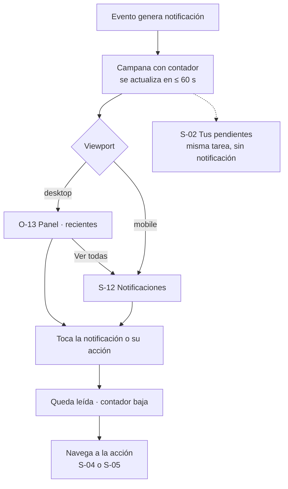

# Story Plan: S-018 (web) - Campana, panel y página de notificaciones

## Estado

**Status:** Completed

## Referencia de la Story

- **Story:** [S-018](../stories/S-018.campana-panel-y-pagina-de-notificaciones.md)
- **Servicio:** web
- **Resumen:** el usuario con sesión ve en la barra global una campana con la cantidad de avisos sin
  leer (polling de `GET /notifications/unread-count`), en desktop la abre en un panel con las 10 más
  recientes y en mobile navega a la página `/notifications` con el historial de 90 días. Tocar una
  notificación la marca leída y lleva a la acción; "Marcar todo como leído" deja el contador en 0.
  Los textos se componen en la web con `type` + `data` + evento vigente (`domain/notifications.ts`).

## Decisiones tomadas al planificar

Aprobadas por el usuario al revisar la propuesta (2026-10-09). Son vinculantes para la implementación.

- **D-1 — Foco del panel: no modal, sin trampa de foco.** Prevalece `notification-panel.md` sobre la
  frase "el panel atrapa el foco" de CA-12. El panel es `role="dialog"` **sin** `aria-modal`, con
  `aria-labelledby` = su título. Al abrir, el foco va al primer ítem (o al primer enfocable si no hay
  ítems). Tab recorre el panel y, si el foco sale del panel (y no va a la campana), el panel se cierra.
  Escape cierra y devuelve el foco a la campana. Clic afuera o en la campana también cierra.
- **D-2 — Textos que el screen.md no define** (español neutro; inglés en el catálogo `en`):
  - `event_paused` → "Se pausó «{event}»" · "El organizador pausó el evento por ahora." · "Ver evento".
  - `deadline_changed` → "Cambió el cierre de «{event}»" · `data.stage = "participation"`: "La
    inscripción ahora cierra el {date}." / `"voting"`: "La votación ahora cierra el {date}." · "Ver evento".
  - `ranking_submitted` con `data.replaced = true` → "Actualizaste tu ranking en «{event}»" (mismo
    cuerpo y acción que el envío inicial).
  - `participant_registered` → **sin cuerpo**: "Van {inscriptos} de {cupo}." del screen.md no se
    puede componer (el payload solo trae `count`; el evento solo `id`, `name`, `stage`).
- **D-3 — Español neutro.** El microcopy de `notifications.md` / `notification-panel.md` está en voseo
  ("podés", "tenés", "Probá", "No tenés notificaciones…"). El catálogo `es` usa la forma neutra de la
  story y del ADR-010 ("puedes", "tienes", "Prueba de nuevo"). El estado vacío usa **un solo texto** en
  panel y página, el de CA-10: "Estás al día. Te avisaremos aquí cuando pase algo en tus eventos."
- **D-4 — Dato faltante = sin cuerpo.** Si el cuerpo de un tipo necesita un dato que no vino (por
  ejemplo `deadline: null` en un recordatorio, que es posible porque la api usa `formatDatePtr`, o
  `assigned_count` ausente con `can_vote: true`), `describe` devuelve `bodyKey: null` y el ítem se
  muestra sin cuerpo. No se inventa un texto alternativo. Un `type` desconocido devuelve `null` y el
  ítem no se muestra.
- **D-5 — Etiqueta e ícono por tipo** (la iconografía del DS es un placeholder):

  | Etiqueta (`tagKey`) | es / en | Ícono | Tipos |
  |---|---|---|---|
  | `notifications.tags.registration` | Inscripción / Registration | `UsersIcon` (nuevo) | `stage_changed` participation, `participant_registered`, `registration_confirmed`, `file_reminder`, `deadline_changed` con `stage: "participation"` |
  | `notifications.tags.voting` | Votación / Voting | `CheckIcon` | `stage_changed` voting, `ranking_submitted`, `vote_reminder`, `deadline_changed` con `stage: "voting"` |
  | `notifications.tags.results` | Resultados / Results | `TrophyIcon` (nuevo) | `stage_changed` results |
  | `notifications.tags.myEvents` | Mis eventos / My events | `BellIcon` | `event_cancelled`, `event_paused` |

  Se agregan a `components/ui/icons/Icons.tsx` `UsersIcon`, `TrophyIcon` y `ArrowRightIcon` (para "Ver
  todas las notificaciones"), sobre `BaseIcon`, con el mismo estilo de trazo que los existentes.
- **D-6 — `isActionable`** (acción primaria si todavía hay algo que hacer; de contorno si no):
  `true` solo si el evento **sigue** en la etapa de la acción:
  - `stage_changed` participation, `registration_confirmed`, `file_reminder` → `event.stage === "participation"`.
  - `stage_changed` voting con `can_vote: true`, `vote_reminder` → `event.stage === "voting"`.
  - Todo lo demás → `false`.
- **D-7 — Volver** en `/notifications`: `navigate(-1)` si hay historial dentro de la app
  (`location.key !== 'default'`); si se entró directo, `navigate('/events')`.
- **D-8 — Entrada en el menú de usuario.** El product-map pide "Notificaciones" en el menú de usuario
  (`Mis eventos`, `Idioma`, `Notificaciones`, `Cerrar sesión`). Se agrega el ítem `notifications`
  después de `my-events`.
- **D-9 — Sincronía del contador.** Además de lo que pide DA-10, el Context expone
  `syncUnreadCount(n)` para que panel y página actualicen el contador con el `unread_count` que ya
  trae el listado (evita un pedido extra).
- **D-10 — Panel vs. página según el viewport.** Se decide **al hacer clic** con
  `window.matchMedia('(min-width: 768px)').matches` (el mismo corte que el CSS). No hay hook de media
  query en el código: se usa `matchMedia` directo y en los tests se mockea.

## Contexto Arquitectónico

### Stack tecnológico

```
react 19.1.1            react-dom 19.1.1
react-router-dom 7.9.4  @react-oauth/google 0.13.4
react-scripts 5.0.1     typescript 4.9.5 (strict: true)
@testing-library/react 16.3.0     @testing-library/jest-dom 6.6.4
@testing-library/user-event 13.5.0  @testing-library/dom 10.4.1
```

**Create React App, no Next.js.** Todo corre en el navegador. Sin librería de estado, sin caché de
datos, sin Tailwind ni CSS-in-JS: CSS plano por componente, tokens como variables CSS en
`src/styles/tokens.css` (DS `web` v2.0.0). i18n propio sobre `Intl` (ADR-010): `useT()` →
`{ t, locale, setLocale, fmt }`, catálogos tipados `src/i18n/catalogs/es.ts` y `en.ts`.

Raíz del servicio: `web/`. Todas las rutas de archivos de este plan son relativas a `web/`.

### Arquitectura del servicio

**Estructura relevante** (organización por tipo técnico, no por dominio):

```
src/
├── App.tsx                       # AppRoutes: rutas dentro de <AppLayout />, RequireAuth en las protegidas
├── routes.test.tsx               # tests de rutas (renderizan AppRoutes)
├── components/
│   ├── ui/{kebab}/Component.tsx (+ .css)      # primitivos del DS (Button, Callout, EmptyState, …)
│   ├── ui/icons/Icons.tsx                     # íconos SVG (BaseIcon) → suma UsersIcon, TrophyIcon, ArrowRightIcon
│   ├── ui/focus.ts                            # getFocusableElements(container)
│   ├── ui/__tests__/static-rules.test.ts      # prefijos de clase, sin hex, tokens de spacing/radius
│   ├── layout/app-header/AppHeader.tsx        # tiene el slot reservado [data-slot="notifications"]
│   ├── layout/app-layout/AppLayout.tsx        # chrome global: AppHeader + <main id="main"> + footer
│   ├── layout/user-menu/UserMenu.tsx          # menú de usuario (suma "Notificaciones")
│   ├── layout/require-auth/RequireAuth.tsx    # guard → /login?next=<ruta>
│   └── notifications/                         # NUEVO: notification-bell, notification-item, notification-panel
├── context/AuthContext.tsx                    # sesión (useAuth)
├── context/NotificationsContext.tsx           # NUEVO (DA-10)
├── pages/notifications/NotificationsPage.tsx  # NUEVO (S-12)
├── domain/*.ts (+ .test.ts), domain/index.ts  # reglas puras re-exportadas → suma notifications.ts
├── i18n/ (catalogs/es.ts, catalogs/en.ts, errors.ts, neutral-spanish.test.ts, lint.test.ts, catalog.test.ts)
├── services/api.ts                            # servicios por dominio → suma NotificationService
├── config/api.ts                              # API_CONFIG.ENDPOINTS, apiRequest, ApiError
├── test-utils/renderWithProviders.tsx         # I18nProvider + MemoryRouter + useAuth mockeado + LocationDisplay
└── types/index.ts                             # tipos compartidos → suma AppNotification & co.
```

**Convenciones de estructura (`project-structure`):**
- Carpeta en `kebab-case`, archivo del componente en `PascalCase`; un componente por carpeta con su
  CSS al lado, mismo nombre. Test `.test.tsx` al lado.
- Componentes de función con `interface …Props` arriba, `React.FC<Props>`, **`export default`** para
  el componente; tipos y helpers con export nombrado.
- Nada de `any` en código nuevo. Tipos compartidos en `src/types/index.ts`.
- **No dejar `console.log`** en código nuevo; `console.error` solo para errores reales.
- Configuración desde `API_CONFIG.BASE_URL` / `RUNTIME_CONFIG`, nunca URL fija ni `process.env`.

**Obtención de datos (`data-fetching`):**
- Tres capas: `config/api.ts` (cliente `apiRequest<T>(endpoint, options)`, JWT de `localStorage` como
  `Bearer`, 401 global → `auth:logout`), `services/api.ts` (método por endpoint, desenvuelve envelopes
  y devuelve tipos limpios), componente (estado `loading` / `error` / dato).
- **Nunca `fetch` directo desde un componente.** Endpoint nuevo: constante en `config/api.ts`
  (`API_CONFIG.ENDPOINTS`) y método en el servicio del dominio.
- Siempre las tres: `loading`, `error` y el dato. `setError` limpio al empezar; `setLoading(false)` en
  `finally`.
- Patrón de servicio existente:
  ```ts
  async sendReminder(eventId: string, type: ReminderType): Promise<ReminderResult> {
    const response = await apiRequest<{ data: ReminderResult }>(
      API_CONFIG.ENDPOINTS.EVENT_REMINDERS(eventId),
      { method: "POST", body: JSON.stringify({ type }) }
    );
    return { type: response.data.type, recipients_count: response.data.recipients_count };
  },
  ```

**Manejo de errores (`error-handling` + estado actual):**
- `apiRequest` lanza `ApiError` con `status`, `code?` y `details`. `getErrorCode(err)` lee el código.
- **Nunca se muestra `err.message`**: los textos de error de esta story son claves propias
  (`notifications.loadError`, `notifications.markAllError`).
- **No manejar 401 en componentes** (es global: `auth:logout`).
- Errores en `Callout tone="error"` (`role="alert"`), con `action` "Reintentar" (`common.retry`).

**Estado (`state-management`):** `useState` local por defecto. Context nuevo solo con razón concreta:
`NotificationsContext` la tiene (DA-10: campana, panel y página, en ramas distintas del árbol,
comparten contador y "marcar leída"). Seguir el estilo de `AuthContext`: provider + hook
`useNotifications()` que **lanza** si se usa fuera del provider.

**Routing (`routing`):** `react-router-dom` 7, rutas en `AppRoutes` (`src/App.tsx`). `<Link>` para
navegación de usuario; `useNavigate()` para la imperativa. Las rutas con sesión van envueltas en
`<RequireAuth>`, que espera `loading` y redirige a `loginPathFor(ruta)` = `/login?next=<encoded>`.

**Testing (`testing`):**
- Jest de CRA + Testing Library. `CI=true npm test` desde `web/` (o `make test` desde la raíz).
- Consultar por lo que ve el usuario (`getByRole`, `getByLabelText`, `getByText`), no por clases.
- `userEvent` antes que `fireEvent`; `findBy*` para lo asíncrono.
- Mockear `src/services/api.ts` con `jest.mock('../../services/api')`, no `fetch` (los tests de la
  capa de servicios en `services/api.test.ts` mockean `apiRequest`/`fetch` como ya lo hacen ahí).
- `renderWithProviders(ui, { auth, route, locale })` de `src/test-utils/renderWithProviders.tsx`
  (requiere `jest.mock('.../context/AuthContext')`) y `LocationDisplay` (`data-testid="location"`).
- `beforeEach(() => localStorage.clear())`. Timers del polling con `jest.useFakeTimers()`.
- No sacar el `moduleNameMapper` de `package.json` (react-router 7).
- **Ojo:** al montar `NotificationsProvider` en `AppLayout`, todo test que renderice `AppRoutes` o
  `AppLayout` con sesión (`routes.test.tsx`, `AppHeader.test.tsx`, …) llama a
  `NotificationService.unreadCount`: esos tests tienen que mockearlo (`mockResolvedValue(0)`).

**Estilado (`styling` + DS v2.0.0, prevalece el DS):**
- CSS plano por componente; clases prefijadas: **`nt-`** para `components/notifications/*` y
  `pages/notifications`. El test `static-rules.test.ts` exige prefijo conocido y solo recorre las
  carpetas de `ROOTS`: sumar `components/notifications` y `pages/notifications` a `ROOTS` y `nt-` a
  los prefijos válidos.
- Tokens solo de `src/styles/tokens.css` (semánticos / de componente; `--ref-*` no se consumen). Sin
  hex ni `rgb()` en código nuevo.
- **Mobile-first**: regla base mobile, `@media (min-width: 768px)` para desktop. Único corte. No usar
  `max-width` en componentes nuevos. Áreas táctiles ≥ 44×44px en mobile, sin scroll horizontal a 375px.
- Motion: preferir no animar o respetar `prefers-reduced-motion: reduce`.

**Lint de textos (ADR-010):** `react/jsx-no-literals` se aplica por carpeta. Cada story de pantalla
suma sus carpetas al `override` de `eslintConfig` (`package.json` → `files`) **y** al script `lint`:
agregar `src/components/notifications/**/*.tsx` y `src/pages/notifications/**/*.tsx` (y
`src/components/notifications src/pages/notifications src/context/NotificationsContext.tsx` al script).

### ADRs relevantes

- **ADR-009 — Notificaciones persistidas con polling.** Decisión (verbatim):
  1. **La api inserta la notificación en la tabla `notifications`** en el mismo handler que dispara
     el email (o la acción equivalente), después de la operación principal. Es best effort, como
     los emails: si la inserción falla se loguea y la respuesta no cambia.
  2. **La web consulta por polling** `GET /api/v1/notifications/unread-count`: al montar, cada 60 s
     con la pestaña visible, al volver el foco y después de cada navegación. El panel y la página
     piden el listado al abrirse.
  3. **Se guarda `type` + `data`, no texto.** `data` lleva solo los valores que el texto necesita y
     que no se pueden leer del evento vigente (cierre, cantidad asignada, puesto, conteo). La api
     devuelve además el evento vigente (`id`, `name`, `stage`) y la web compone título, cuerpo y
     acción con el catálogo de i18n.
  4. **Retención de 90 días** por filtro en las consultas, más un borrado de las viejas del
     destinatario al listar. Sin scheduler.
- **ADR-010 — i18n propio sobre `Intl`.** Decisión (verbatim):
  - `I18nProvider` (Context) y `useT()`.
  - Catálogos `es.ts` y `en.ts`; **el tipo de `en` se deriva de `es`**, así una clave faltante no
    compila.
  - Interpolación simple (`{name}`) y plurales con `Intl.PluralRules`.
  - Fechas con `Intl.DateTimeFormat` / `Intl.RelativeTimeFormat` y números con `Intl.NumberFormat`
    (los helpers de `web/src/domain/` reciben el idioma).
  - Idioma inicial de `navigator.language` (`es*` → español; si no, inglés), persistido en
    `localStorage` con `useLocalStorage`; `<html lang>` se actualiza al cambiar.
  - Errores de la api traducidos por `code` (`errors.<code>`), con fallback genérico; nunca se
    muestra `err.message`.
  - Verificación: lint contra texto embebido en JSX en las carpetas nuevas y un test que rechaza
    formas de voseo en el catálogo `es`.

  Aplicación: plurales con `plural({ one, other })` (de `src/i18n/types`); los tests
  `i18n/catalog.test.ts`, `i18n/neutral-spanish.test.ts` y `i18n/lint.test.ts` deben seguir pasando.
- **Decisiones de arquitectura de la story (REQ-003):**
  - **DA-1 (ADR-009):** polling de `GET /notifications/unread-count` al montar, cada 60 s con la
    pestaña visible (`document.visibilityState`), al volver el foco y después de cada navegación.
  - **DA-2 (ADR-009):** la web compone los textos con `type` + `data` + `event` vigente.
  - **DA-10 — `NotificationsContext`:** la campana, el panel y la página comparten contador y "marcar
    leída". Expone `unreadCount`, `refresh()`, `markRead(id)`, `markAllRead()` y encapsula el
    polling. Solo se monta con sesión (convención `state-management`: segundo Context con razón
    concreta). (+ `syncUnreadCount(n)`, ver D-9.)

### Contexto de API

Sin endpoints nuevos: se consumen los de S-009. Todos requieren JWT (`bearerAuth`) y filtran por el
usuario del JWT; la web nunca pide notificaciones de otro usuario. `401` se maneja globalmente.

#### `GET /api/v1/notifications`

- **Query:** `limit` (integer, 1..50, default 20), `before` (string date-time; cursor por `created_at`,
  exclusivo; se envía **tal cual** el `next_cursor` recibido). Un `limit` o `before` inválidos →
  `400 INVALID_PAYLOAD` (no se recortan en silencio).
- **Orden:** `created_at DESC, id DESC`, solo últimos 90 días (y borra las más viejas del usuario).
- **200:**
  ```json
  {
    "data": [{
      "id": "uuid",
      "type": "notification_type",
      "data": "object",
      "event": { "id": "uuid", "name": "string — nombre vigente", "stage": "Stage" },
      "read_at": "date-time | null",
      "created_at": "date-time"
    }],
    "unread_count": "integer",
    "next_cursor": "date-time | null"
  }
  ```
  `next_cursor` = `created_at` del último ítem, UTC con microsegundos (`2026-09-30T08:15:30.000123Z`);
  `null` en la última página.
- **Errores:** `400 INVALID_PAYLOAD`, `401`, `500 RETRIEVAL_ERROR`.

#### `GET /api/v1/notifications/unread-count`

- **200:** `{ "data": { "unread_count": integer } }` · `401` · `500 RETRIEVAL_ERROR`.

#### `PATCH /api/v1/notifications/{notification_id}/read`

- Idempotente (repetir devuelve el mismo `read_at`).
- **200:** `{ "data": { "id": uuid, "read_at": date-time }, "code": "NOTIFICATION_READ" }`.
- **404 `NOTIFICATION_NOT_FOUND`:** ajena, inexistente, con más de 90 días o id mal formado.
- `401` · `500 DB_UPDATE_ERROR`.

#### `POST /api/v1/notifications/read-all`

- **200:** `{ "data": { "updated": integer }, "code": "NOTIFICATIONS_READ" }` · `401` · `500 DB_UPDATE_ERROR`.

#### Esquemas

```yaml
NotificationType:
  type: string
  enum: [stage_changed, event_cancelled, event_paused, deadline_changed, participant_registered,
         registration_confirmed, ranking_submitted, file_reminder, vote_reminder]

Notification:
  # `data` por tipo: stage_changed → {stage, deadline?} + en voting {can_vote, assigned_count?}
  # + en results {result_position?, result_total?}; deadline_changed → {stage, new_date};
  # participant_registered → {count}; ranking_submitted → {replaced};
  # file_reminder / vote_reminder → {deadline}; el resto → {}.
  properties:
    id: { type: string, format: uuid }
    type: { $ref: NotificationType }
    data: { type: object, additionalProperties: true }
    event:
      properties:
        id: { type: string, format: uuid }
        name: { type: string }
        stage: { $ref: Stage }        # enum [creation, participation, voting, results]
    read_at: { type: string, format: date-time, nullable: true }
    created_at: { type: string, format: date-time }
```

**Formatos verificados en el código de la api** (`api/internal/handlers/event_handler.go`):
- `deadline` (en `stage_changed` participation / voting) = `estimated_end_date` del request, string
  `YYYY-MM-DD`.
- `deadline` (en `file_reminder` / `vote_reminder`) = `formatDatePtr(...)` → `"YYYY-MM-DD"` **o `null`**.
- `new_date` (en `deadline_changed`) = `YYYY-MM-DD`; `stage` = `"participation"` | `"voting"`.
- `stage_changed` en `voting`: `can_vote: true` + `assigned_count: n` si el destinatario tiene
  asignación; si no, `can_vote: false`.
- `stage_changed` en `results`: `result_position` + `result_total` solo si el destinatario está en el
  ranking ajustado.
- `participant_registered`: `{ count }` agregado mientras no se lea.
- `ranking_submitted`: `{ replaced: boolean }`.

Errores ya traducidos en el catálogo: `errors.NOTIFICATION_NOT_FOUND` ("No encontramos esta
notificación."). No se usa en esta story (un 404 al marcar leída se ignora y se navega igual).

### Contexto de Base de Datos

Sin cambios ni acceso directo (frontend). La tabla `notifications` vive en la api (S-009).

### Contexto de Flujo

**Flujo `notificaciones-in-app`** — la web es el **Consumidor**. Esta story implementa los pasos 2, 3 y
4 del lado de `web` (el paso 1, emisión, ya está en la api).

```
loop cada 60 s con la pestaña visible, al volver el foco y al navegar
    WEB->>API: GET /api/v1/notifications/unread-count
    API-->>WEB: 200 { data: { unread_count } }
end
U->>WEB: toca la campana
WEB->>API: GET /api/v1/notifications?limit=10
API-->>WEB: 200 { data[], unread_count, next_cursor }
U->>WEB: toca una notificación
WEB->>API: PATCH /api/v1/notifications/{notification_id}/read
API-->>WEB: 200 { data: { id, read_at } }
WEB-->>U: navega a la acción
```

- **Paso 2 — Contador por polling** (`web` `NotificationsContext` → `api`): `GET
  /api/v1/notifications/unread-count`, JWT Bearer, `200 { "data": { "unread_count": "integer" } }`. Se
  consulta al montar, cada 60 s con `document.visibilityState === "visible"`, al volver el foco y
  después de cada navegación.
- **Paso 3 — Listado** (`web` panel o página → `api`): `GET /api/v1/notifications`, query `limit`
  (1..50, default 20) y `before` (cursor exclusivo, se envía tal cual). La web compone título, cuerpo
  y acción con `type` + `data` + `event` en el idioma del usuario (`web/src/domain/notifications.ts`).
  En mobile la campana navega a `/notifications`.
- **Paso 4 — Marcar como leídas:** `PATCH /api/v1/notifications/{notification_id}/read` →
  `200 { data: { id, read_at }, code: NOTIFICATION_READ }` (idempotente; ajena / inexistente / vencida
  / id mal formado → `404 NOTIFICATION_NOT_FOUND`); `POST /api/v1/notifications/read-all` →
  `200 { data: { updated }, code: NOTIFICATIONS_READ }`.

**Manejo de errores del flujo (lado web):**

| Paso | Condición | Respuesta | Qué ve el usuario |
|---|---|---|---|
| 2 | Falla el polling | — | El contador conserva el último valor; reintenta en el próximo ciclo |
| 3 | Falla el listado | `500 RETRIEVAL_ERROR` | "No pudimos cargar tus notificaciones." con "Reintentar" |
| 4 | Notificación ajena o inexistente | 404 | Igual navega; el contador se corrige en el próximo polling |

### Puntos de Integración

Solo la api propia (endpoints de arriba) vía `apiRequest`. Sin servicios externos, colas ni WebSocket.

### Convenciones de código

- Tipos: `AppNotification` (no `Notification`, que choca con el `Notification` global del DOM),
  `NotificationType`, `NotificationPage`, `NotificationDescription`.
- Servicio: `NotificationService` (objeto literal como `EventService`) en `services/api.ts`.
- Constantes de endpoint en `API_CONFIG.ENDPOINTS`: `NOTIFICATIONS`, `NOTIFICATIONS_UNREAD_COUNT`,
  `NOTIFICATION_READ(id)`, `NOTIFICATIONS_READ_ALL`.
- Constantes de dominio: `NOTIFICATIONS_POLL_MS = 60_000`, `PANEL_LIMIT = 10`, `PAGE_LIMIT = 20`
  (en `domain/notifications.ts`).
- Claves del catálogo bajo `notifications.*` (ver Task 2).

### Código reutilizable

**Componentes** (`src/components/ui/index.ts` re-exporta los primitivos):
- **Button** (`components/ui/button/Button.tsx`) — `variant` primary / secondary / tertiary / onBand /
  icon (`icon` exige `aria-label`), `size` sm / md / lg, `loading` + `loadingLabel`, `iconStart` /
  `iconEnd`, `fullWidth`. `<Button variant="tertiary" iconStart={<BellIcon width={16} height={16} />}>…</Button>`.
- **Callout** (`components/ui/callout/Callout.tsx`) — `tone` info / warning / error / success; `error`
  es `role="alert"`; `action: { label, onClick, busy? }`; `id` para `aria-describedby`.
- **EmptyState** (`components/ui/empty-state/EmptyState.tsx`) — props `variant` (`inline` | `page`),
  `icon` (ReactNode), `title`, `headingLevel` (1..4), `description?`, `action?: { label, onClick?, href? }`.
- **Icons** (`components/ui/icons/Icons.tsx`) — `BellIcon`, `CheckIcon`, `DotIcon`, `CloseIcon`,
  `ArrowUpIcon`, … sobre `BaseIcon` (stroke). Se suman `UsersIcon`, `TrophyIcon`, `ArrowRightIcon`.
- **AppHeader / AppLayout** (`components/layout/{app-header,app-layout}/`) — `AppHeader` no muestra
  nada en `ly-header__actions` mientras `loading`; con sesión renderiza
  `<span data-slot="notifications" className="ly-header__slot--notifications" />` + `<UserMenu />`
  (el slot ya tiene `min-width/min-height: 44px`). `AppLayout` = `AppHeader` + `<main id="main">` con
  `<Outlet />` + footer (`footer.tagline`).
- **UserMenu** (`components/layout/user-menu/UserMenu.tsx`) — `Menu` con ítems `{ id, label, onSelect, selected? }`.
- **Menu** (`components/ui/menu/Menu.tsx`) — referencia de cierre por `mousedown` en `document` fuera
  del contenedor y Escape: reutilizar el mismo patrón en el panel.
- **RequireAuth** (`components/layout/require-auth/RequireAuth.tsx`) — `<RequireAuth><Page /></RequireAuth>`.
- **getFocusableElements** (`components/ui/focus.ts`) — `getFocusableElements(container): HTMLElement[]`.

**Utils:**
- **domain/dates** — `formatDate(date: 'YYYY-MM-DD', locale)` (`Intl.DateTimeFormat` día / mes corto /
  año, en calendario local) y `formatRelative(when, locale, now?)` (`Intl.RelativeTimeFormat`
  `numeric: 'auto'`: "ahora", "hace 2 horas", "ayer"…); en componentes, `fmt.relative(when, now?)` de
  `useT()`.
- **domain/redirect** — `loginPathFor(path)` → `/login?next=${encodeURIComponent(path)}`.
- **i18n** — `useT()`, `plural({ one, other })`, `translate`, `messageKeyForError(err)`.
- **ApiError / getErrorCode** (`config/api.ts`).

**Hooks:** `useT` (`src/i18n`), `useAuth` (`src/context/AuthContext`), `useNavigate` / `useLocation`.

**Test utils:** `renderWithProviders`, `buildAuth`, `sampleUser` (`{ id: 'u-1', name: 'Ana Pérez', … }`),
`LocationDisplay` (`data-testid="location"`).

### Wireframes / Pantallas

**Superficie:** `web` — plataforma `web`, viewports `mobile` (base) y `desktop` (≥ 768px).
**Pantallas que toca la story:** S-12 Notificaciones (`notifications`, `/notifications`) y O-13 Panel de
notificaciones (`notification-panel`, popover, **solo desktop**). Además, el chrome global (campana en
`AppHeader`, ítem en el menú de usuario).

**Breakpoint:** único corte 768px (`@media (min-width: 768px)`), mobile-first.

#### Chrome global (product-map, "Estructura de Navegación")

| Elemento | Sin sesión | Con sesión | Destino |
|---|---|---|---|
| Logo `TELESCOPIO` | ✓ | ✓ | `/` |
| `Inicio` | ✓ | ✓ | `/` |
| `Eventos` | ✓ | ✓ | `/events` |
| `Cómo funciona` | ✓ | ✓ | `/#como-funciona` (sección de S-01) |
| Selector de idioma `ES / EN` | ✓ en la barra | dentro del menú de usuario | cambia el idioma sin recargar |
| `Iniciar sesión` / `Crear cuenta` | ✓ | — | S-07 / S-08 |
| Campana con contador | — | ✓ | desktop: abre O-13 · mobile: navega a S-12 |
| Menú de usuario (iniciales + nombre) | — | ✓ | `Mis eventos`, `Idioma`, `Notificaciones`, `Cerrar sesión` |

En `mobile` las entradas de navegación (`Inicio`, `Eventos`, `Cómo funciona`) pasan a un menú
desplegable; la campana y el avatar quedan visibles en la barra.

Rutas: `/events/create`, `/my-events`, `/notifications` → con sesión; sin acceso →
`/login?next=<ruta>` (AC 33).

**Inventario de overlays (filtrado):** O-13 · Panel de notificaciones · popover (solo desktop) ·
header · campana · Notificaciones recientes con acción directa y "Marcar todo como leído". O-13 no
existe en mobile: la campana navega a S-12. Elevación: `elevation.2` / `shadow.popover` ("Popovers y
menús (panel de notificaciones, menú de usuario)").

#### S-12 Notificaciones (`notifications.md`, v1.0, diseñada)

- **Ruta:** `/notifications` · **Audiencia:** participante, organizador · **Viewports:** desktop, mobile.
- **Viewports:** desktop — listado en una columna centrada (8/12): sin la columna de preferencias no
  hay nada que poner al lado. mobile — listado a ancho completo; en mobile esta pantalla reemplaza al
  panel O-13: la campana navega acá.
- **Acceso:** con sesión (`RequireAuth`).
- **Entradas:** O-13 · "Ver todas las notificaciones". Campana del header en mobile. Menú de usuario ·
  "Notificaciones". **Salidas:** a S-04 o S-05 · tocar una notificación o su acción; "← Volver" →
  pantalla anterior; a S-07 sin sesión.

**Estructura:**

| # | Nombre | Tipo | Variant/Level/State | Categoría | Viewports | Visibilidad | Propósito |
|---|--------|------|---------------------|-----------|-----------|-------------|-----------|
| 1 | header | header | — | layout | ambos | — | AppHeader con la campana |
| 2 | Volver | link | — | navigation | ambos | — | ← Volver |
| 3 | Eyebrow no leídas | label | — | content | ambos | — | "N SIN LEER" / "ESTÁS AL DÍA" |
| 4 | Título | heading | h1 | content | ambos | — | "Notificaciones" |
| 5 | Bajada | paragraph | body | content | ambos | — | Qué hay y cuánto se guarda |
| 6 | Botón marcar todo | button | secondary | input | ambos | hidden_in_states: empty, loading · state_overrides: sin no leídas→disabled | Marcar todo como leído |
| 7 | Lista de notificaciones | list | — | content | ambos | hidden_in_states: empty, error de sistema / sin conexión | NotificationItem × N |
| 8 | Botón cargar más | button | secondary | input | ambos | hidden_in_states: empty, error de sistema / sin conexión · oculto si no hay más | Paginación por cursor |
| 9 | Sin notificaciones | empty-state | — | feedback | ambos | visible_only_in_states: empty | No hay avisos |
| 10 | Error de carga | alert | error | feedback | ambos | visible_only_in_states: error de sistema / sin conexión | Falla |
| 11 | footer | footer | — | layout | ambos | — | Pie |

**Layout por viewport:**

##### desktop · 1200px
- row `cabecera`
  - col 2/12: Volver
  - col 6/12: Eyebrow no leídas, Título, Bajada
  - col 2/12: Botón marcar todo
  - col 2/12: (vacío)
- row `lista`
  - col 2/12: (vacío)
  - col 8/12: Lista de notificaciones, Botón cargar más, Sin notificaciones, Error de carga
  - col 2/12: (vacío)

##### mobile · 400px
- Volver
- Eyebrow no leídas
- Título
- Bajada
- Botón marcar todo
- Lista de notificaciones
- Botón cargar más
- Sin notificaciones
- Error de carga

**Contenido** (microcopy en neutro según D-3; entre corchetes, el original del screen.md cuando difiere):
- Volver: "← Volver"
- Eyebrow: "{n} SIN LEER" · sin no leídas: "ESTÁS AL DÍA"
- Título: "Notificaciones"
- Bajada: "Todo lo que pasa en los eventos donde participas u organizas. Se guardan durante 90 días."
  [original: "participás u organizás"]
- Botón marcar todo: "Marcar todo como leído"
- Lista: cada ítem: ícono por tipo · título · cuerpo · etiqueta de tipo ("Votación", "Resultados",
  "Inscripción", "Mis eventos") · tiempo relativo · acción. Annotation: de la más reciente a la más
  antigua, sin filtros ni grupos (AC 31). No leídas con punto y en negrita. La acción es primaria si
  todavía requiere hacer algo, de contorno si no (D-6). El nombre del evento es el vigente (DA-2).
- Textos por tipo: ver Task 2 (tabla completa es / en).
- Botón cargar más: "Cargar más" (cargando: "Cargando…")
- Sin notificaciones (D-3): "Estás al día. Te avisaremos aquí cuando pase algo en tus eventos." —
  ícono bell. [original: "No tenés notificaciones. Te avisamos acá cuando pase algo en tus eventos."]
- Error de carga: "No pudimos cargar tus notificaciones." · acción "Reintentar"
- footer: "Telescopio · evaluación distribuida entre pares" (ya existe: `footer.tagline`)

**Estados:**
- **default** — ninguno.
- **empty** — Lista, Botón cargar más y Botón marcar todo ocultos; Sin notificaciones visible; Eyebrow
  "ESTÁS AL DÍA".
- **loading** — Mensaje "Cargando notificaciones…" (texto para lectores). Lista como skeleton de 5
  ítems. "Cargar más" muestra "Cargando…".
- **error de sistema / sin conexión** — "No pudimos cargar tus notificaciones." con "Reintentar". Si
  falla "Marcar todo como leído": "No pudimos marcar las notificaciones. Prueba de nuevo." y los ítems
  quedan como estaban. [original: "Probá de nuevo."]
- **success** — "Marcar todo como leído": todos los ítems pasan a leídos, el contador de la campana a 0
  y Eyebrow a "ESTÁS AL DÍA".
- error de validación, not found, terminal: no aplican.

**Interacciones:**
- Ítem o su acción · on click → marca leída (contador −1) y navega según el tipo: votar / subir
  archivo / ver evento / ver ranking → `/events/{id}`; ver inscriptos → `/events/{id}/manage`.
- Botón marcar todo · on click → marca todas como leídas.
- Botón cargar más · on click → pide la página siguiente (`before`).
- Feedback: el ítem cambia de no leído a leído antes de navegar; el contador de la campana se actualiza.

**Accesibilidad:**
- Orden de foco: header → Volver → Botón marcar todo → ítems de la lista (la acción de cada uno) →
  Botón cargar más.
- Landmarks: header / main / footer. h1 = Título.
- Al cargar más, el foco va al primer ítem nuevo.
- Cada ítem no leído expone "No leída" como texto para lectores de pantalla (no solo el punto); el
  cambio de contador se anuncia.

**Decisiones y descartes:** listado único sin filtros ni grupos por día (AC 31); columna central en
desktop (estirar la lista a 1200px empeoraba la lectura); en mobile reemplaza al panel O-13; retención
de 90 días dicha en la bajada (AC 49); textos compuestos en el front (DA-2). Descartados: preferencias
de email por tipo y recordatorio 24 h; filtros por tipo y grupos HOY / AYER.

#### O-13 Panel de notificaciones (`notification-panel.md`, v1.0, diseñada)

- **Overlay** popover, **solo desktop**, 400px de ancho, anclado a la campana del header en cualquier
  pantalla con sesión. En mobile no existe: la campana navega a S-12.
- **Salidas:** a S-04 / S-05 tocando una notificación o su acción; a S-12 con "Ver todas las
  notificaciones"; cierra con Escape, click afuera o la campana.

**Estructura:**

| # | Nombre | Tipo | Variant/Level/State | Categoría | Viewports | Visibilidad | Propósito |
|---|--------|------|---------------------|-----------|-----------|-------------|-----------|
| 1 | Título | heading | h2 | content | desktop | — | "Notificaciones" |
| 2 | Contador | badge | — | content | desktop | hidden_in_states: empty | "N nuevas" |
| 3 | Botón marcar todo | button | tertiary | input | desktop | hidden_in_states: empty, loading | Marcar todo como leído |
| 4 | Lista reciente | list | — | content | desktop | hidden_in_states: empty, error de sistema / sin conexión | Últimas 10 (NotificationItem) |
| 5 | Sin notificaciones | empty-state | — | feedback | desktop | visible_only_in_states: empty | Nada nuevo |
| 6 | Error de carga | alert | error | feedback | desktop | visible_only_in_states: error de sistema / sin conexión | Falla |
| 7 | Link ver todas | link | — | navigation | desktop | — | Ir a S-12 |

**Layout por viewport:**

##### desktop · 400px
- row `cabecera`
  - col 5/12: Título
  - col 3/12: Contador
  - col 4/12: Botón marcar todo
- Lista reciente
- Sin notificaciones
- Error de carga
- Link ver todas

**Contenido:**
- Título: "Notificaciones"
- Contador: "{n} nueva" / "{n} nuevas" (plural)
- Botón marcar todo: "Marcar todo como leído"
- Lista reciente: cada ítem: ícono por tipo · título · cuerpo · "{acción} →" · "· {tiempo relativo}".
  Los textos por tipo son los de S-12. No leídas con punto y en negrita; al tocar una queda leída y el
  contador baja (AC 30).
- Sin notificaciones (D-3): "Estás al día. Te avisaremos aquí cuando pase algo en tus eventos." — ícono
  bell. [original: "Estás al día. Te avisamos acá…"]
- Error de carga: "No pudimos cargar tus notificaciones." · acción "Reintentar"
- Link ver todas: "Ver todas las notificaciones" — ícono arrow-right

**Estados:**
- **empty** — Lista reciente, Contador y Botón marcar todo ocultos; Sin notificaciones visible.
- **loading** — Mensaje "Cargando…"; Lista reciente como skeleton de 3 ítems.
- **error de sistema / sin conexión** — Error de carga visible con "Reintentar".
- **success** — tras "Marcar todo como leído": todos los ítems leídos, Contador oculto, campana sin
  número.

**Interacciones:**
- Ítem · on click → marca leída, cierra el panel y navega a la acción.
- Botón marcar todo · on click → todas leídas; **el panel queda abierto**.
- Link ver todas · on click → `/notifications`.
- Escape / click afuera / campana → cierra.
- Feedback: el contador de la campana baja en el momento.

**Accesibilidad** (con D-1):
- Orden de foco: Botón marcar todo → ítems → Link ver todas.
- Popover con `role="dialog"` **no modal** y `aria-labelledby` = Título; la campana tiene
  `aria-expanded` y su nombre incluye el contador ("Notificaciones, 2 sin leer").
- Al abrir, el foco va al primer ítem; Escape cierra y devuelve el foco a la campana. No atrapa el foco.
- El cambio del contador se anuncia en región live.

**Decisiones:** solo desktop (en mobile la campana va a S-12); últimas 10 (el historial está en S-12);
el contador se actualiza por polling cada 60 s y el panel pide la lista al abrirse. Descartado:
bottom-sheet en mobile.

#### UF-05 — Enterarse de lo que me toca (`user-flows.md`)

**Audiencia:** participante y organizador · **Pantallas:** O-13 (desktop), S-12, S-02 ("Tus
pendientes") · **Flujo técnico:** `notificaciones-in-app` · **Trigger:** pasa algo en un evento del
usuario: cambio de etapa, cancelación, inscripción, ranking enviado o recordatorio.



**Happy path:** 1) La campana muestra el contador de no leídas. 2) Abre el panel (desktop) o la página
(mobile); las no leídas se ven con punto y en negrita. 3) Toca una: queda leída, el contador baja y
navega a la acción ("Ir a votar", "Subir archivo", "Ver inscriptos"). 4) "Marcar todo como leído" deja
el contador en 0.

| Situación | Qué ve el usuario |
|---|---|
| Sin notificaciones | "Estás al día. Te avisaremos aquí cuando pase algo en tus eventos." (D-3) |
| Falla la carga | "No pudimos cargar tus notificaciones." + "Reintentar" |
| Notificación de más de 90 días | No aparece |
| El evento de la notificación ya avanzó | La acción lleva al evento en su etapa actual |

**Estado final:** el usuario llegó a la pantalla donde tiene que actuar y la notificación quedó leída.
**Criterio de éxito:** desde cualquier pantalla con sesión, una tarea pendiente está a dos toques.

**Cross-surface flows:** no aplica (una sola superficie).

### Contexto de Design System — superficie `web`

- **Versión fijada:** `web` **v2.0.0** (2026-10-02). Viewports `mobile` (base) y `desktop` (≥ 768px),
  mobile-first.
- **Accent de la superficie:** `color.brand.primary` = `#4B3FA8` (`color.violet.700`) → `--bg-action-primary`.

**Paleta relevante (primitivos, solo como referencia; consumir los semánticos):**

| Token | Hex | Uso |
|---|---|---|
| `color.violet.700` | `#4B3FA8` | Color de acción: botón primario, links |
| `color.violet.500` | `#6E5BF2` | Acento: **indicador de no leída**, foco, acciones sobre banda |
| `color.violet.200` | `#CFC9F7` | Texto secundario sobre banda oscura |
| `color.violet.100` | `#EAE7F9` | Fondo suave de acción (chips de etiqueta, anillo de foco) |
| `color.violet.50` | `#F8F7FF` | **Fondo de ítem no leído** |
| `color.cyan.400` | `#35D6F2` | Señal sobre banda oscura: **contador de la campana**, números destacados, logo |

Lenguaje visual: bandas oscuras (header) + contenido claro; un único paso destacado por pantalla en
el color de acción.

**Tokens semánticos (consumir estos; nombres CSS en `tokens.css`):**

| Grupo | Variables CSS |
|---|---|
| Background | `--bg-canvas` (página), `--bg-surface` (tarjetas, **panel**, ítems), `--bg-surface-subtle`, `--bg-band` (header), `--bg-band-raised`, `--bg-action-primary`, `--bg-action-subtle` (**chip de etiqueta "Votación"**), `--bg-accent` (**punto de no leída**), `--bg-unread` (**ítem no leído**), `--bg-success(-subtle)`, `--bg-warning(-subtle)`, `--bg-neutral-subtle`, `--bg-disabled`, `--bg-backdrop` |
| Text | `--text-primary`, `--text-secondary`, `--text-muted` (metadatos, tiempo relativo; solo sobre `bg.surface`), `--text-disabled`, `--text-inverse`, `--text-inverse-secondary`, `--text-signal` (**contador de la campana sobre la banda**), `--text-action` (links, "Ver todas"), `--text-success`, `--text-warning`, `--text-error` |
| Border | `--border-default` (superficies, divisores entre ítems), `--border-strong`, `--border-focus`, `--border-error`, `--border-inverse` (controles sobre banda) |
| Forma | `--radius-control` (botones), `--radius-field` (inputs, **ítems**), `--radius-surface` (tarjetas, diálogos), `--radius-area`, `--radius-pill` (chips, **badge del contador**) |
| Elevación | `--shadow-raised`, `--shadow-popover` (**panel**), `--shadow-dialog`, `--shadow-toast`, `--focus-ring` |
| Spacing | `--space-inline-sm` (8px, ícono–texto), `--space-inline-md` (12px), `--space-stack-sm` (8px), `--space-stack-md` (16px), `--space-stack-lg` (28px), `--space-padding-compact` (16px, filas), `--space-padding-default` (24px), `--space-padding-spacious` (28px) |
| Tipografía | `--type-display`, `--type-heading-l` (h1 de pantalla), `--type-heading-m` (h2), `--type-heading-s` (h3), `--type-body`, `--type-ui` (botones, chips), `--type-caption` (metadatos), `--type-eyebrow` (mono, mayúsculas: "2 SIN LEER"), `--type-metric`, `--type-tracking-tight/wide` |

Reglas: componentes consumen semánticos, nunca primitivos (`--ref-*`); sin hex literales.

**Grid:** "Columna centrada · 8/12 centrada · Notificaciones". Un breakpoint 768px `min-width`;
verificar a 375px sin scroll horizontal; áreas táctiles ≥ 44×44px en mobile.

**Iconografía** (`foundations/iconography.md`, v0.1.0 placeholder): sizes `icon.sm` 16px (inline en
texto), `icon.md` 20px (default: botones), `icon.lg` 24px (headers, navegación → **campana**),
`icon.xl` 32px (empty states). Nombres singulares kebab-case (`bell`, `arrow-right`). Íconos solo
como refuerzo semántico; no mezclar outlined + filled; decorativos `aria-hidden="true"`; funcionales
con `aria-label`; contraste ≥ 3:1.

#### Componente: Button (spec v2.0.0)

- **Variants:** primary (**el** paso destacado; uno por pantalla) · secondary (contorno) · tertiary
  (discreta, estilo texto — **ejemplo del DS: "Marcar todo como leído"**) · on-band (sobre `bg.band`) ·
  icon (solo ícono; exige `aria-label`).
- **Sizes:** sm 36px (acciones de fila; sube a 44px de alto en mobile) · md 40px (default) · lg 46px.
- **States:** default · focus (`focus.ring` + `border.focus`) · disabled (`bg.disabled` +
  `text.disabled`) · loading (label de carga + indicador; no clickeable, `aria-busy`).
- **Spacing:** gap ícono–label `space.inline.sm`; entre botones `space.inline.md`; ancho mínimo 88px.
- **A11y:** `<button>` nativo; Enter y Espacio activan; anillo de foco siempre visible; área táctil
  ≥ 44×44px en mobile.
- **Contenido:** verbo + objeto, sentence case, máx. ~30 caracteres, del catálogo.
- **Do:** un solo primary por pantalla. **Don't:** dos primary juntos; deshabilitar sin explicar;
  emojis como ícono.
- **API:** `variant`, `size`, `loading`, `loadingLabel`, `disabled`, `iconStart` / `iconEnd`,
  `fullWidth`, `type`, `onClick`.
- **En esta story:** acción del ítem en la página → `primary` si `isActionable`, `secondary` si no
  (sm). En el panel, la acción es texto "{acción} →" (el ítem entero es el botón). "Marcar todo" →
  `secondary` en la página, `tertiary` en el panel. "Cargar más" → `secondary`.

#### Componente: Callout (spec v2.0.0)

- **Propósito:** aviso dentro del flujo; cubre el ErrorBlock con reintento. Cuándo NO: falla → no usar
  EmptyState; decisión → dialog.
- **Variants:** error (`bg.surface` + `border.error` + `text.error`), info, warning, success.
- **Sizes:** uno; padding `space.md`. **States:** default · con acción · busy (al reintentar).
- **A11y:** `error` → `role="alert"`; ícono `aria-hidden`.
- **Contenido:** errores = qué pasó + qué hacer ("No pudimos cargar … " + "Reintentar"); nunca texto
  técnico del backend.
- **Don't:** reemplazar un error por un estado vacío; apilar varios callouts del mismo tono.
- **API:** `tone`, `title`, `children`, `action { label, onClick, busy? }`, `id`.

#### Componente: EmptyState (spec v2.0.0)

- **Propósito:** no hay datos **porque no los hay** (no por error). Uso listado: "sin notificaciones".
- **Anatomía:** ícono (`text.muted`, 32px) · título (`text.heading.s`) · texto (`text.secondary`) ·
  acción opcional (secondary).
- **Variants:** inline (dentro de una tabla o card; padding `space.lg`) · page (padding `space.2xl`).
- **Spacing:** centrado; texto máx. 420px; gap `space.sm` ícono–título, `space.md` texto–acción.
- **A11y:** título con el nivel de heading que corresponda; ícono `aria-hidden`.
- **Don't:** usarlo para errores.
- **API:** `variant`, `icon`, `title`, `description`, `action`.
- **En esta story:** `variant="inline"`, ícono `BellIcon`, título = texto de CA-10, sin acción (en el
  panel, `headingLevel={3}`; en la página, `headingLevel={2}`).

#### Guía de contenido — Notificaciones (`guidelines/content.md`)

- Asunto en 1 línea, ≤ 50 chars.
- Body en 1-3 líneas.
- CTA único si requiere acción.

#### Guía de accesibilidad (`guidelines/accessibility.md`, v0.1.0 placeholder)

Objetivo **WCAG 2.2 AA**. Contraste texto ≥ 4.5:1 (grande ≥ 3:1), componentes interactivos ≥ 3:1;
**no comunicar estado solo con color** (por eso "No leída" en texto, además del punto). Teclado: todo
interactivo accesible, foco visible, orden lógico, **ESC cierra modales / popovers**, Enter / Space
activan, sin keyboard traps. Screen readers: rol ARIA correcto, íconos decorativos `aria-hidden`,
funcionales con `aria-label`; **live regions para feedback dinámico (`aria-live="polite"`)**. Motion:
respetar `prefers-reduced-motion`. Targets táctiles ≥ 44×44px, spacing entre targets ≥ 8px. i18n:
soportar longitud variable de texto.

#### DS Gaps para `web`

**Aceptados** (REQ-003 → Revisión UX → Design System, resolución "Dejar anotado"):
- **NotificationItem** y **AppHeader** (dentro de "Compuestos de dominio (… NotificationItem,
  AppHeader …)", tipo section / list) — *razón registrada:* "viven en `components/{dominio}` (DA-8),
  se arman con primitivos del DS y los especifican los screen.md". `NotificationItem`,
  `NotificationBell` y `NotificationPanel` se implementan en `components/notifications/` con `Button`,
  íconos y tokens; la especificación es la de los screen.md copiada arriba. No es un hallazgo: es una
  decisión tomada.

**Nuevos:**
- **Popover** (bloque O-13, `overlay_type: popover`): el DS no tiene un componente popover (`dialog` es
  solo modal y `menu` es un menú de acciones). Se resuelve **inline** en `NotificationPanel`, igual que
  `Menu` (posicionado bajo el trigger, cierre por `mousedown` afuera y Escape), con `--shadow-popover`
  y `--radius-surface`. Si aparece un segundo popover, conviene llevarlo al DS con
  `/product-design-system-update`.
- **Badge del contador** (bloque "Contador", tipo badge, y número de la campana): no hay componente
  badge; `status-pill` es para estados de entidad. Se resuelve inline con `--radius-pill`,
  `--type-caption` y, en la campana, `--text-signal` sobre `--bg-band`.

---

## UI Preview

Superficie `web`: dos viewports, `mobile` (base) y `desktop` (≥ 768px). El panel O-13 solo existe en
desktop; en mobile la campana navega a S-12.

### desktop · 1200px — AppHeader con campana

```
+------------------------------------------------------------------------------------+
| TELESCOPIO   Inicio  Eventos  Cómo funciona                +=====+  [AP Ana Pérez v] |
|                                                             | 🔔 2 |  <- NUEVO        |
|                                                             +=====+  (abre O-13)     |
+------------------------------------------------------------------------------------+
```

### mobile · 375px — AppHeader con campana

```
+-------------------------------------+
| [≡] TELESCOPIO      +=====+ [AP v]  |
|                     | 🔔 2 |         |  <- NUEVO (navega a /notifications)
|                     +=====+         |
+-------------------------------------+
```

### desktop · 400px — O-13 Panel de notificaciones (popover bajo la campana)

```
+======================================================+  <- NUEVO
| Notificaciones 5/12  | 2 nuevas 3/12 | Marcar todo   |
|                      |               | como leído 4/12|
+------------------------------------------------------+
| ● [ic] Ya puedes votar en «Cúmulos 2026»             |  <- no leída (negrita, bg.unread)
|        Te asignamos 3 propuestas para ordenar.       |
|        Tienes tiempo hasta el 20 oct 2026.           |
|        Ir a votar → · hace 2 horas                   |
|------------------------------------------------------|
| ● [ic] 5 personas se inscribieron en «Andes»         |
|        Ver inscriptos → · ayer                       |
|------------------------------------------------------|
|   [ic] Enviaste tu ranking en «Cúmulos 2026»         |  <- leída
|        Lo puedes modificar hasta que cierre…         |
|        Ver mi ranking → · hace 3 días                |
|   … (hasta 10)                                       |
+------------------------------------------------------+
| Ver todas las notificaciones →                       |
+======================================================+
```

### desktop · 1200px — S-12 Notificaciones

```
+------------------------------------------------------------------------------------+
| [AppHeader con campana]                                                            |
+------------------------------------------------------------------------------------+
| ← Volver   | 2 SIN LEER                                    | [Marcar todo  ] |      |
|   2/12     | Notificaciones (h1)                     6/12  | [como leído   ] | 2/12 |
|            | Todo lo que pasa en los eventos donde…        |      2/12       |      |
|            +================== lista 8/12 =====================+                    |
|    2/12    | ● [ic] Ya puedes votar en «Cúmulos 2026»          |       2/12         |
|            |        Te asignamos 3 propuestas…                 |                    |
|            |        Votación · hace 2 horas    [ Ir a votar ]  | <- primary         |
|            |---------------------------------------------------|                    |
|            |   [ic] Se canceló «Andes»                         |                    |
|            |        El organizador canceló el evento.          |                    |
|            |        Mis eventos · ayer        [ Ver evento ]   | <- contorno        |
|            |   …                                               |                    |
|            |                 [ Cargar más ]                    |                    |
|            +===================================================+                    |
+------------------------------------------------------------------------------------+
| Telescopio · evaluación distribuida entre pares                                    |
+------------------------------------------------------------------------------------+
```

### mobile · 375px — S-12 Notificaciones

```
+-------------------------------------+
| [≡] TELESCOPIO        🔔 2  [AP v]   |
+-------------------------------------+
| ← Volver                            |
| 2 SIN LEER                          |
| Notificaciones                      |
| Todo lo que pasa en los eventos…    |
| [ Marcar todo como leído ]          |
| +=================================+ |  <- NUEVO
| | ● [ic] Ya puedes votar en «…»   | |
| |   Te asignamos 3 propuestas…    | |
| |   Votación · hace 2 horas       | |
| |   [ Ir a votar ]                | |
| +---------------------------------+ |
| |   [ic] Se canceló «Andes»       | |
| |   Mis eventos · ayer            | |
| |   [ Ver evento ]                | |
| +=================================+ |
| [ Cargar más ]                      |
+-------------------------------------+
| Telescopio · evaluación distribuida |
+-------------------------------------+
```

**Leyenda:**
- `+-+` Elemento existente (sin cambios)
- `+=+` Elemento NUEVO
- `<- NUEVO` / `<- MODIFICADO` indica cambios
- `●` punto de no leída (`--bg-accent`) · `[ic]` ícono por etiqueta (D-5)

---

## Cobertura de Criterios de Aceptación

| AC# | Descripción | Task(s) |
|-----|-------------|---------|
| CA-1 | Campana con contador; sin no leídas sin número; sin sesión no existe | T3, T4 |
| CA-2 | Polling: 60 s visible, foco, navegación; oculta no consulta | T3 |
| CA-3 | Panel desktop: título, "{n} nuevas", marcar todo, 10 recientes, ver todas; ítems con ícono, título, cuerpo, acción, tiempo; no leídas con punto y negrita; cierre por Escape / clic afuera / campana | T4, T5 |
| CA-4 | Tocar una notificación: leída, contador −1, cierra panel, navega | T3, T5, T6 |
| CA-5 | Marcar todo como leído (panel o página); panel sigue abierto | T3, T5, T6 |
| CA-6 | Página `/notifications`: listado único 90 días, "{n} sin leer" / "Estás al día", marcar todo, cargar más | T1, T6 |
| CA-7 | Mobile 375px: la campana navega a `/notifications`, sin scroll horizontal | T4, T6 |
| CA-8 | Textos por tipo en `es` (neutro) y `en` | T2 |
| CA-9 | Destino de cada acción (`/events/{id}` o `/events/{id}/manage`) | T2, T5, T6 |
| CA-10 | Vacío y error con "Reintentar"; nunca datos inventados | T1, T5, T6 |
| CA-11 | `/notifications` sin sesión → `/login?next=/notifications` | T6 |
| CA-12 | Accesibilidad: `aria-label` con cantidad, `aria-expanded`, `aria-controls`, foco y Escape (D-1), anuncio del contador | T3, T4, T5 |

---

## Test Scenarios

Fixture común (`n1`):

```ts
const n1: AppNotification = {
  id: 'n-1', type: 'stage_changed',
  data: { stage: 'voting', can_vote: true, assigned_count: 3, deadline: '2026-10-20' },
  event: { id: 'e-1', name: 'Cúmulos 2026', stage: 'voting' },
  read_at: null, created_at: '2026-10-09T10:00:00Z',
};
// `now` fijo en los tests de UI: 2026-10-09T12:00:00Z → tiempo relativo "hace 2 horas"
```

| ID | Escenario | Input | Output Esperado | AC |
|----|-----------|-------|-----------------|-----|
| TS-1 | Listar (panel) | `NotificationService.list({ limit: 10 })`; la api responde `200 { data: [n1], unread_count: 2, next_cursor: null }` | Request `GET /api/v1/notifications?limit=10`; resuelve `{ notifications: [n1], unread_count: 2, next_cursor: null }` | CA-3 |
| TS-2 | Listar con cursor | `NotificationService.list({ limit: 20, before: '2026-09-30T08:15:30.000123Z' })` | Request `GET /api/v1/notifications?limit=20&before=2026-09-30T08%3A15%3A30.000123Z` (cursor tal cual, codificado con `encodeURIComponent`) | CA-6 |
| TS-3 | Contador | `NotificationService.unreadCount()`; api `200 { data: { unread_count: 2 } }` | Request `GET /api/v1/notifications/unread-count`; resuelve `2` | CA-1 |
| TS-4 | Marcar una | `NotificationService.markRead('n-1')`; api `200 { data: { id: 'n-1', read_at: '2026-10-09T12:00:00Z' }, code: 'NOTIFICATION_READ' }` | Request `PATCH /api/v1/notifications/n-1/read`; resuelve `{ id: 'n-1', read_at: '2026-10-09T12:00:00Z' }` | CA-4 |
| TS-5 | Marcar todas | `NotificationService.markAllRead()`; api `200 { data: { updated: 3 }, code: 'NOTIFICATIONS_READ' }` | Request `POST /api/v1/notifications/read-all`; resuelve `{ updated: 3 }` | CA-5 |
| TS-6 | Error del listado | `NotificationService.list({ limit: 10 })`; api `500 { error: 'Failed to retrieve notifications', code: 'RETRIEVAL_ERROR' }` | Rechaza con `ApiError` `status: 500`, `code: 'RETRIEVAL_ERROR'`; nunca devuelve una lista | CA-10 |
| TS-7 | Participación abierta | `describe({ ...n1, data: { stage: 'participation', deadline: '2026-10-20' }, event: { id: 'e-1', name: 'Cúmulos 2026', stage: 'participation' } }, 'es')` + `t` | Título "«Cúmulos 2026» abrió la inscripción" · cuerpo "Ya puedes inscribirte y subir tu propuesta." · acción "Ver evento" · `route: '/events/e-1'` · etiqueta "Inscripción" · `isActionable: true` | CA-8, CA-9 |
| TS-8 | Votación con asignación | `describe(n1, 'es')` | "Ya puedes votar en «Cúmulos 2026»" · "Te asignamos 3 propuestas para ordenar. Tienes tiempo hasta el {formatDate('2026-10-20','es')}." · "Ir a votar" · `/events/e-1` · "Votación" · `isActionable: true` | CA-8, CA-9 |
| TS-9 | Votación sin propuesta | `describe({ ...n1, data: { stage: 'voting', can_vote: false, deadline: '2026-10-20' } }, 'es')` | "Empezó la votación en «Cúmulos 2026»" · "No participas porque no subiste una propuesta." · "Ver evento" · `/events/e-1` · `isActionable: false` | CA-8 |
| TS-10 | Resultados con puesto | `data: { stage: 'results', result_position: 2, result_total: 12 }`, `event.stage: 'results'` | "Se publicaron los resultados de «Cúmulos 2026»" · "Quedaste en el puesto 2 de 12." · "Ver ranking" · `/events/e-1` · "Resultados" · `isActionable: false` | CA-8, CA-9 |
| TS-11 | Resultados sin puesto | `data: { stage: 'results' }` | Cuerpo "Mira el ranking final."; resto igual a TS-10 | CA-8 |
| TS-12 | Cancelado | `type: 'event_cancelled', data: {}` | "Se canceló «Cúmulos 2026»" · "El organizador canceló el evento." · "Ver evento" · `/events/e-1` · "Mis eventos" | CA-8 |
| TS-13 | Pausado (D-2) | `type: 'event_paused', data: {}` | "Se pausó «Cúmulos 2026»" · "El organizador pausó el evento por ahora." · "Ver evento" · `/events/e-1` · "Mis eventos" | CA-8 |
| TS-14 | Cambio de cierre (D-2) | `type: 'deadline_changed', data: { stage: 'voting', new_date: '2026-10-25' }` y `{ stage: 'participation', new_date: '2026-10-25' }` | "Cambió el cierre de «Cúmulos 2026»" · "La votación ahora cierra el {formatDate('2026-10-25','es')}." / "La inscripción ahora cierra el …" · "Ver evento" · etiqueta "Votación" / "Inscripción" | CA-8 |
| TS-15 | Inscripciones (plural) | `type: 'participant_registered', data: { count: 1 }` y `{ count: 5 }` | "1 persona se inscribió en «Cúmulos 2026»" / "5 personas se inscribieron en «Cúmulos 2026»" · sin cuerpo (`bodyKey: null`, D-2) · "Ver inscriptos" · `route: '/events/e-1/manage'` · "Inscripción" | CA-8, CA-9 |
| TS-16 | Inscripción confirmada | `type: 'registration_confirmed', data: {}`, `event.stage: 'participation'` | "Te inscribiste en «Cúmulos 2026»" · "Ya puedes subir tu propuesta." · "Subir archivo" · `/events/e-1` · `isActionable: true` | CA-8, CA-9 |
| TS-17 | Ranking enviado / reemplazado | `type: 'ranking_submitted', data: { replaced: false }` y `{ replaced: true }` | "Enviaste tu ranking en «Cúmulos 2026»" / "Actualizaste tu ranking en «Cúmulos 2026»" · "Lo puedes modificar hasta que cierre la votación." · "Ver mi ranking" · `/events/e-1` · "Votación" | CA-8 |
| TS-18 | Recordatorio de archivo | `type: 'file_reminder', data: { deadline: '2026-10-20' }`, `event.stage: 'participation'` | "Falta tu archivo en «Cúmulos 2026»" · "La inscripción cierra el {formatDate('2026-10-20','es')}." · "Subir archivo" · `/events/e-1` · `isActionable: true` | CA-8 |
| TS-19 | Recordatorio de voto | `type: 'vote_reminder', data: { deadline: '2026-10-20' }`, `event.stage: 'voting'` | "Falta tu ranking en «Cúmulos 2026»" · "La votación cierra el …" · "Ir a votar" · `/events/e-1` · `isActionable: true` | CA-8 |
| TS-20 | Dato faltante (D-4) | `file_reminder` con `data: { deadline: null }`; `stage_changed` voting con `data: { stage: 'voting', can_vote: true }` (sin `assigned_count`) | `bodyKey: null`, título y acción presentes; no lanza | CA-10 |
| TS-21 | Tipo desconocido (D-4) | `describe({ ...n1, type: 'unknown_type' as NotificationType }, 'es')` | Devuelve `null`; el ítem no se renderiza | CA-10 |
| TS-22 | Acción ya no vigente (D-6) | `describe(n1 con event.stage: 'results', 'es')` | `isActionable: false` (la acción se muestra de contorno); `route` sigue siendo `/events/e-1` | CA-9 |
| TS-23 | Inglés | TS-15 y TS-8 con `'en'` | "5 people registered for «Cúmulos 2026»" (1: "1 person registered for …") · "Voting is open for «Cúmulos 2026»"-equivalente definido en `en` · `catalog.test.ts` pasa (mismas claves) | CA-8 |
| TS-24 | Español neutro | `neutral-spanish.test.ts` sobre el catálogo `es` con `notifications.*` | 0 formas de voseo ni marcas de género | CA-8 |
| TS-25 | Montaje con sesión | `renderWithProviders(<AppRoutes />, { route: '/events', auth: { user: sampleUser } })`; `unreadCount` → `2` | `unreadCount` llamado 1 vez; botón campana con nombre accesible "Notificaciones, 2 sin leer" y texto visible "2" | CA-1, CA-12 |
| TS-26 | Sin no leídas | `unreadCount` → `0` | Campana sin número; nombre accesible "Notificaciones" | CA-1 |
| TS-27 | Sin sesión | `renderWithProviders(<AppRoutes />, { route: '/events', auth: { user: null } })` | No hay botón "Notificaciones"; `unreadCount` no se llama | CA-1 |
| TS-28 | Polling cada 60 s | `jest.useFakeTimers()`; `document.visibilityState = 'visible'`; `advanceTimersByTime(60000)` | 2.ª llamada a `unreadCount`; con `120000`, 3.ª | CA-2 |
| TS-29 | Pestaña oculta | `visibilityState = 'hidden'`; `advanceTimersByTime(60000)`; luego `visibilityState = 'visible'` + `document.dispatchEvent(new Event('visibilitychange'))` | Sin llamada nueva mientras está oculta; 1 llamada al volver a visible | CA-2 |
| TS-30 | Foco y navegación | `window.dispatchEvent(new Event('focus'))`; navegar de `/events` a `/my-events` (clic en un `<Link>`) | 1 llamada a `unreadCount` en cada caso; montaje + navegación no duplican la llamada inicial | CA-2 |
| TS-31 | Falla el polling | 1.ª `unreadCount` → `2`; 2.ª rechaza `ApiError` 500 | La campana sigue mostrando "2"; no aparece ningún error | CA-2 |
| TS-32 | Anuncio del contador | `unreadCount` 1.ª → `2`, 2.ª → `3` | La región `aria-live="polite"` contiene "3 notificaciones sin leer"; tras la 1.ª carga está vacía | CA-12 |
| TS-33 | Abrir el panel (desktop) | `matchMedia('(min-width: 768px)').matches = true`; clic en la campana; `list` → `{ notifications: [n1, n2], unread_count: 2, next_cursor: null }` | `list({ limit: 10 })`; campana `aria-expanded="true"` y `aria-controls` = id del panel; `role="dialog"` sin `aria-modal`, nombre "Notificaciones"; se ven "2 nuevas", "Marcar todo como leído", 2 ítems y el link "Ver todas las notificaciones"; el foco está en el primer ítem | CA-3, CA-12 |
| TS-34 | Ítem no leído | ítem `n1` (`read_at: null`) en el panel | Texto "No leída" accesible, punto `aria-hidden`, título en negrita, ícono `aria-hidden`, "Ir a votar →", "hace 2 horas" | CA-3 |
| TS-35 | Tocar no leída | Panel con 2 no leídas; clic en `n1` | `markRead('n-1')`; la campana muestra "1"; el panel se cierra; `location` = `/events/e-1` | CA-4 |
| TS-36 | Falla marcar leída | `markRead` rechaza `ApiError` 404 `NOTIFICATION_NOT_FOUND` | Igual navega a `/events/e-1`; el contador quedó en "1" (se corrige en el próximo polling); sin mensaje de error | CA-4 |
| TS-37 | Tocar leída | clic en un ítem con `read_at: '2026-10-08T09:00:00Z'` | `markRead` no se llama; navega a su ruta | CA-4 |
| TS-38 | Marcar todo (panel) | clic en "Marcar todo como leído"; `markAllRead` → `{ updated: 2 }` | Ningún ítem dice "No leída"; "2 nuevas" desaparece; la campana sin número ("Notificaciones"); **el panel sigue abierto** | CA-5 |
| TS-39 | Falla marcar todo (panel) | `markAllRead` rechaza `ApiError` 500 `DB_UPDATE_ERROR` | `role="alert"` con "No pudimos marcar las notificaciones. Prueba de nuevo."; los ítems siguen "No leída"; la campana sigue en "2" | CA-5 |
| TS-40 | Cerrar el panel | (a) Escape; (b) `mousedown` en `document.body`; (c) clic en la campana; (d) Tab desde el último elemento del panel hacia afuera | En los 4 casos el diálogo desaparece y `aria-expanded="false"`; en (a) el foco vuelve a la campana | CA-3, CA-12 |
| TS-41 | Carga y error del panel | `list` pendiente; después rechaza `ApiError` 500 `RETRIEVAL_ERROR`; clic en "Reintentar" → resuelve `[n1]` | Mientras carga: 3 ítems skeleton y "Cargando…" accesible; luego `role="alert"` "No pudimos cargar tus notificaciones." + "Reintentar"; 2.ª llamada a `list({ limit: 10 })` y se ve `n1` | CA-10 |
| TS-42 | Panel vacío | `list` → `{ notifications: [], unread_count: 0, next_cursor: null }` | "Estás al día. Te avisaremos aquí cuando pase algo en tus eventos."; sin "nuevas" ni "Marcar todo como leído"; el link "Ver todas" sigue | CA-10 |
| TS-43 | Ver todas | clic en "Ver todas las notificaciones" | Panel cerrado; `location` = `/notifications` | CA-6 |
| TS-44 | Inscriptos desde el panel | clic en ítem `participant_registered` (`event.id: 'e-1'`) | `location` = `/events/e-1/manage` | CA-9 |
| TS-45 | Campana en mobile | `matchMedia('(min-width: 768px)').matches = false`; clic en la campana | `location` = `/notifications`; no se renderiza el panel; la campana no tiene `aria-expanded` | CA-7 |
| TS-46 | Página sin sesión | `renderWithProviders(<AppRoutes />, { route: '/notifications', auth: { user: null } })` | `location` = `/login?next=%2Fnotifications` | CA-11 |
| TS-47 | Página con datos | `/notifications` con sesión; `list({ limit: 20 })` → `{ notifications: [n1, n2], unread_count: 2, next_cursor: '2026-09-30T08:15:30.000123Z' }` | h1 "Notificaciones", eyebrow "2 SIN LEER", bajada "Todo lo que pasa en los eventos donde participas u organizas. Se guardan durante 90 días.", ítems en el orden de la api, botón "Cargar más" | CA-6 |
| TS-48 | Cargar más | clic en "Cargar más"; `list({ limit: 20, before: '2026-09-30T08:15:30.000123Z' })` → `{ notifications: [n3], unread_count: 2, next_cursor: null }` | `n3` agregado al final; el foco está en el primer ítem nuevo (`n3`); "Cargar más" ya no está | CA-6 |
| TS-49 | Falla cargar más | 2.ª llamada rechaza `ApiError` 500 | Los ítems cargados siguen; `role="alert"` "No pudimos cargar tus notificaciones." + "Reintentar" repite `before: '2026-09-30T08:15:30.000123Z'` | CA-10 |
| TS-50 | Página vacía | `list` → `{ notifications: [], unread_count: 0, next_cursor: null }` | "Estás al día. Te avisaremos aquí cuando pase algo en tus eventos."; eyebrow "ESTÁS AL DÍA"; sin "Marcar todo como leído" ni "Cargar más" | CA-6, CA-10 |
| TS-51 | Página con error | `list` rechaza `ApiError` 500 `RETRIEVAL_ERROR` | `role="alert"` "No pudimos cargar tus notificaciones." + "Reintentar"; ningún ítem | CA-10 |
| TS-52 | Marcar todo (página) | clic en "Marcar todo como leído"; `markAllRead` → `{ updated: 2 }` | Eyebrow "ESTÁS AL DÍA"; ningún "No leída"; campana sin número; botón deshabilitado | CA-5 |
| TS-53 | Sin no leídas en la página | `list` → 2 ítems con `read_at` y `unread_count: 0` | Botón "Marcar todo como leído" visible y deshabilitado; eyebrow "ESTÁS AL DÍA" | CA-6 |
| TS-54 | Tocar en la página | clic en la acción "Ir a votar" de `n1` | `markRead('n-1')`; `location` = `/events/e-1` | CA-4, CA-9 |
| TS-55 | Acción primaria / contorno (página) | `n1` (`isActionable: true`) y `event_cancelled` | "Ir a votar" con clase de variante primary; "Ver evento" con secondary (solo un primary por ítem) | CA-3 |
| TS-56 | Volver (D-7) | (a) entrada directa a `/notifications` (`location.key === 'default'`); (b) navegar `/events` → `/notifications` | (a) clic en "← Volver" → `location` = `/events`; (b) → `/events` por `navigate(-1)` | — |
| TS-57 | Página en inglés | locale `en` | h1 "Notifications", eyebrow "2 UNREAD", botón "Mark all as read", "Load more" | CA-8 |
| TS-58 | Menú de usuario (D-8) | abrir el menú de usuario → ítem "Notificaciones" | `location` = `/notifications` | — |
| TS-59 | Responsive · presencia | desktop (`matchMedia` true) vs mobile (false), clic en la campana | Desktop: aparece `role="dialog"` "Notificaciones" (TS-33). Mobile: no hay diálogo y navega (TS-45) | CA-7 |
| TS-60 | Responsive · disposición (verificación manual en navegador) | `/notifications` a 1200px y 375px; panel a 1200px | 1200px: lista en columna centrada 8/12 con "Volver" 2/12 y "Marcar todo" 2/12 en la cabecera; panel de 400px anclado a la campana con `--shadow-popover`. 375px: todo apilado, sin scroll horizontal, campana y acciones ≥ 44×44px | CA-7 |

---

## Tareas

### Task 1: Tipos, endpoints y `NotificationService`

**Status:** Completed

#### Descripción

Capa de datos de las notificaciones: tipos compartidos, constantes de endpoint y un servicio que
desenvuelve los envelopes de S-009 y devuelve tipos limpios. Es la base de todo lo demás (CA-1 a
CA-6, CA-10).

#### Criterios de Aceptación

1. `src/types/index.ts` exporta:
   ```ts
   export type NotificationType =
     | 'stage_changed' | 'event_cancelled' | 'event_paused' | 'deadline_changed'
     | 'participant_registered' | 'registration_confirmed' | 'ranking_submitted'
     | 'file_reminder' | 'vote_reminder';
   export interface AppNotification {
     id: string;
     type: NotificationType;
     data: Record<string, unknown>;
     event: { id: string; name: string; stage: EventStage };
     read_at: string | null;
     created_at: string;
   }
   export interface NotificationPage {
     notifications: AppNotification[];
     unread_count: number;
     next_cursor: string | null;
   }
   ```
   (`EventStage` es el tipo de etapa ya existente en `types/index.ts`.)
2. `API_CONFIG.ENDPOINTS` suma `NOTIFICATIONS: '/api/v1/notifications'`,
   `NOTIFICATIONS_UNREAD_COUNT: '/api/v1/notifications/unread-count'`,
   `NOTIFICATION_READ: (id: string) => \`/api/v1/notifications/${id}/read\``,
   `NOTIFICATIONS_READ_ALL: '/api/v1/notifications/read-all'` (y su tipo en `ApiConfig`).
3. `NotificationService` en `src/services/api.ts`:
   - `list({ limit, before }: { limit: number; before?: string | null }): Promise<NotificationPage>` —
     arma la query con `URLSearchParams` (`before` solo si viene; se codifica, se envía tal cual).
   - `unreadCount(): Promise<number>` → `response.data.unread_count`.
   - `markRead(id: string): Promise<{ id: string; read_at: string }>` → `PATCH`.
   - `markAllRead(): Promise<{ updated: number }>` → `POST`.
4. Ningún método captura el error para devolver un valor por defecto: los fallos se propagan como
   `ApiError` (REQ-001: nunca datos inventados).
5. Sin `any`; sin `console.log`.

#### Detalles Técnicos

**Referencias al Contexto Arquitectónico:**
- Contexto de API (los 4 endpoints y el esquema `Notification`).
- `data-fetching`: constante en `config/api.ts` + método en el servicio; patrón de `sendReminder`.
- `error-handling`: `ApiError` se propaga.

**Archivos a crear/modificar:**
- `src/types/index.ts`
- `src/config/api.ts`
- `src/services/api.ts`
- `src/services/api.test.ts` (o `src/services/notifications.test.ts` si conviene separarlo)

**Notas de implementación:**
- El nombre `AppNotification` evita el choque con el `Notification` global del DOM.
- `before` viaja con `encodeURIComponent` (lo hace `URLSearchParams`): `+` y `:` del RFC3339 tienen
  que llegar intactos.

#### Requisitos de Testing

**Unit:** TS-1 a TS-6 (mockeando `apiRequest`/`fetch` como ya hace `services/api.test.ts`).

#### Dependencias de la Tarea

**Blocked by:** Ninguna
**Blocks:** Task 2, Task 3
**Can run in parallel with:** N/A

---

### Task 2: Reglas `domain/notifications.ts` y catálogo `notifications.*`

**Status:** Completed

#### Descripción

Función pura que, para cada notificación, decide qué textos, parámetros, ruta, etiqueta, ícono y
prominencia de acción corresponden (DA-2), más todas las claves del catálogo en español neutro e
inglés. Cubre CA-8 y CA-9; es lo que hace que panel y página muestren lo mismo.

#### Criterios de Aceptación

1. `src/domain/notifications.ts` (re-exportado desde `domain/index.ts`) exporta:
   ```ts
   export type NotificationTag = 'registration' | 'voting' | 'results' | 'myEvents';
   export interface NotificationDescription {
     titleKey: TranslationKey;
     bodyKey: TranslationKey | null;
     params: Record<string, string | number>;   // event, date, count, m, position, total…
     actionKey: TranslationKey;
     route: string;                             // '/events/{id}' | '/events/{id}/manage'
     tagKey: TranslationKey;                    // notifications.tags.<tag>
     tag: NotificationTag;                      // para elegir el ícono en la UI
     isActionable: boolean;
   }
   export const describe = (n: AppNotification, locale: Locale): NotificationDescription | null;
   export const NOTIFICATIONS_POLL_MS = 60_000;
   export const PANEL_LIMIT = 10;
   export const PAGE_LIMIT = 20;
   ```
   `params.event` = `n.event.name`; las fechas (`deadline`, `new_date`) van ya formateadas con
   `formatDate(date, locale)` en `params.date`.
2. Reglas por tipo (rutas: `/events/{event.id}` salvo `participant_registered` →
   `/events/{event.id}/manage`; etiqueta e `isActionable` según D-5 / D-6; `bodyKey: null` si falta
   el dato que el cuerpo necesita, D-4; tipo desconocido → `null`).
3. Catálogo `es` (`src/i18n/catalogs/es.ts`, bloque `notifications`), en español neutro:

   | Clave | es |
   |---|---|
   | `notifications.title` | Notificaciones |
   | `notifications.bell` | Notificaciones |
   | `notifications.bellWithCount` | plural: one "Notificaciones, {count} sin leer" / other "Notificaciones, {count} sin leer" |
   | `notifications.announce` | plural: one "{count} notificación sin leer" / other "{count} notificaciones sin leer" |
   | `notifications.newCount` | plural: one "{count} nueva" / other "{count} nuevas" |
   | `notifications.unreadEyebrow` | {count} SIN LEER |
   | `notifications.upToDateEyebrow` | ESTÁS AL DÍA |
   | `notifications.intro` | Todo lo que pasa en los eventos donde participas u organizas. Se guardan durante 90 días. |
   | `notifications.markAll` | Marcar todo como leído |
   | `notifications.markAllError` | No pudimos marcar las notificaciones. Prueba de nuevo. |
   | `notifications.viewAll` | Ver todas las notificaciones |
   | `notifications.loadMore` | Cargar más |
   | `notifications.loadingMore` | Cargando… |
   | `notifications.loading` | Cargando notificaciones… |
   | `notifications.loadError` | No pudimos cargar tus notificaciones. |
   | `notifications.empty` | Estás al día. Te avisaremos aquí cuando pase algo en tus eventos. |
   | `notifications.unread` | No leída |
   | `notifications.back` | ← Volver |
   | `notifications.tags.registration` / `voting` / `results` / `myEvents` | Inscripción / Votación / Resultados / Mis eventos |
   | `notifications.actions.viewEvent` | Ver evento |
   | `notifications.actions.vote` | Ir a votar |
   | `notifications.actions.viewRanking` | Ver ranking |
   | `notifications.actions.viewRegistrations` | Ver inscriptos |
   | `notifications.actions.uploadFile` | Subir archivo |
   | `notifications.actions.viewMyRanking` | Ver mi ranking |
   | `notifications.types.participationOpened.title` / `.body` | «{event}» abrió la inscripción / Ya puedes inscribirte y subir tu propuesta. |
   | `notifications.types.votingAssigned.title` / `.body` | Ya puedes votar en «{event}» / Te asignamos {m} propuestas para ordenar. Tienes tiempo hasta el {date}. (`m` con plural: one "Te asignamos 1 propuesta para ordenar. …") |
   | `notifications.types.votingNoProposal.title` / `.body` | Empezó la votación en «{event}» / No participas porque no subiste una propuesta. |
   | `notifications.types.results.title` | Se publicaron los resultados de «{event}» |
   | `notifications.types.results.bodyPosition` / `.bodyNoPosition` | Quedaste en el puesto {position} de {total}. / Mira el ranking final. |
   | `notifications.types.cancelled.title` / `.body` | Se canceló «{event}» / El organizador canceló el evento. |
   | `notifications.types.paused.title` / `.body` | Se pausó «{event}» / El organizador pausó el evento por ahora. |
   | `notifications.types.deadlineChanged.title` | Cambió el cierre de «{event}» |
   | `notifications.types.deadlineChanged.bodyParticipation` / `.bodyVoting` | La inscripción ahora cierra el {date}. / La votación ahora cierra el {date}. |
   | `notifications.types.registered.title` | plural: one "{count} persona se inscribió en «{event}»" / other "{count} personas se inscribieron en «{event}»" |
   | `notifications.types.registrationConfirmed.title` / `.body` | Te inscribiste en «{event}» / Ya puedes subir tu propuesta. |
   | `notifications.types.rankingSubmitted.title` / `.titleReplaced` / `.body` | Enviaste tu ranking en «{event}» / Actualizaste tu ranking en «{event}» / Lo puedes modificar hasta que cierre la votación. |
   | `notifications.types.fileReminder.title` / `.body` | Falta tu archivo en «{event}» / La inscripción cierra el {date}. |
   | `notifications.types.voteReminder.title` / `.body` | Falta tu ranking en «{event}» / La votación cierra el {date}. |
   | `nav.notifications` | Notificaciones (ítem del menú de usuario) |

   Los nombres exactos de las claves pueden ajustarse, pero los textos `es` son estos.
4. Catálogo `en` con las mismas claves (traducción equivalente; por ejemplo "Notifications",
   "Notifications, {count} unread", "{count} new", "{count} UNREAD", "YOU'RE ALL CAUGHT UP", "Mark all
   as read", "View all notifications", "Load more", "You're all caught up. We'll let you know here when
   something happens in your events.", "We couldn't load your notifications.", "Unread", "← Back",
   "Voting is open in «{event}»", "{count} people registered for «{event}»" / "1 person registered for
   «{event}»", "Go vote", "View registrations", …). `catalog.test.ts` y el typecheck de `en` pasan.
5. `neutral-spanish.test.ts` pasa con las claves nuevas.

#### Detalles Técnicos

**Referencias al Contexto Arquitectónico:**
- ADR-009 (punto 3) y DA-2: textos compuestos con `type` + `data` + `event`.
- ADR-010: catálogo tipado, `plural`, helpers de `domain/` reciben el idioma.
- Decisiones D-2 a D-6. Formatos de `data` verificados en el Contexto de API.
- Reutilizable: `formatDate` (`domain/dates`), `plural` (`i18n/types`).

**Archivos a crear/modificar:**
- `src/domain/notifications.ts` (nuevo) + `src/domain/notifications.test.ts`
- `src/domain/index.ts`
- `src/i18n/catalogs/es.ts`, `src/i18n/catalogs/en.ts`

**Notas de implementación:**
- `describe` lee `data` como `Record<string, unknown>`: validar tipos en runtime (`typeof … ===
  'number'`, `typeof … === 'string'`) antes de usar un valor; si no cumple, se trata como faltante (D-4).
- `stage_changed` se resuelve por `data.stage`: `participation` → participationOpened; `voting` +
  `can_vote === true` → votingAssigned (requiere `assigned_count` numérico y `deadline` string para
  el cuerpo); `voting` + `can_vote !== true` → votingNoProposal; `results` → results (con
  `result_position` y `result_total` numéricos → bodyPosition, si no → bodyNoPosition). Otro `stage`
  → `null`.
- El cuerpo de `votingAssigned` usa `plural` sobre `count = assigned_count` (parámetro `m` en el texto
  de la story = `{count}` en el catálogo).

#### Requisitos de Testing

**Unit:** TS-7 a TS-24 (en `domain/notifications.test.ts` resolviendo los textos con `translate` de
`i18n/translate` para afirmar el texto final en `es` y `en`).

#### Dependencias de la Tarea

**Blocked by:** Task 1 (tipos)
**Blocks:** Task 4
**Can run in parallel with:** Task 3

---

### Task 3: `NotificationsContext` (contador, polling y marcado)

**Status:** Completed

#### Descripción

Context compartido por campana, panel y página (DA-10): mantiene `unreadCount`, encapsula el polling
de ADR-009 y las operaciones de marcado. Se monta solo con sesión. Cubre CA-1, CA-2, CA-4, CA-5 y el
anuncio del contador de CA-12.

#### Criterios de Aceptación

1. `src/context/NotificationsContext.tsx` exporta `NotificationsProvider` y `useNotifications()`, que
   **lanza** fuera del provider. Valor:
   ```ts
   interface NotificationsContextValue {
     unreadCount: number;
     refresh(): Promise<void>;
     markRead(id: string): Promise<void>;   // optimista: −1 (mín. 0), luego PATCH; error → se ignora
     markAllRead(): Promise<void>;          // POST; éxito → 0; error → relanza (la UI muestra el Callout)
     syncUnreadCount(n: number): void;      // D-9
   }
   ```
2. Polling: `refresh()` al montar (1 vez), cada `NOTIFICATIONS_POLL_MS` (60 000) **solo si**
   `document.visibilityState === 'visible'`, en `visibilitychange` cuando pasa a visible, en el
   `focus` de `window` y en cada cambio de `useLocation().pathname` (sin duplicar la llamada del montaje).
3. Si `unreadCount()` falla, se conserva el valor anterior y no se muestra nada.
4. Región `aria-live="polite"` (visualmente oculta) que anuncia `notifications.announce` cuando el
   contador cambia después de la primera carga.
5. `AppLayout` envuelve su contenido en `NotificationsProvider` **solo si** `useAuth().user` existe;
   sin sesión no se monta y no hay pedidos. El intervalo y los listeners se limpian al desmontar
   (logout).
6. Tests que renderizan `AppRoutes` / `AppLayout` con sesión (`routes.test.tsx`,
   `AppHeader.test.tsx`, etc.) mockean `NotificationService.unreadCount` y siguen pasando.

#### Detalles Técnicos

**Referencias al Contexto Arquitectónico:**
- ADR-009 punto 2 y DA-1 / DA-10; Contexto de Flujo, paso 2 y tabla de errores.
- `state-management`: Context con razón concreta, estilo `AuthContext` (hook que lanza).
- `auth`: el 401 lo maneja `apiRequest` (dispara `auth:logout`, el usuario pasa a `null` y el
  provider se desmonta).

**Archivos a crear/modificar:**
- `src/context/NotificationsContext.tsx` (nuevo) + `src/context/NotificationsContext.test.tsx`
- `src/components/layout/app-layout/AppLayout.tsx`
- `src/routes.test.tsx`, `src/components/layout/app-header/AppHeader.test.tsx` (mock del servicio)

**Notas de implementación:**
- El provider vive **dentro** del router (está en `AppLayout`), así que puede usar `useLocation`.
- Usar un `ref` para saber si ya hubo primera carga (el anuncio no se dispara al montar).
- No refrescar en paralelo si hay un pedido en vuelo (ignorar el tick).

#### Requisitos de Testing

**Unit / integración:** TS-25 a TS-32 (fake timers, `Object.defineProperty(document,
'visibilityState', …)`).

#### Dependencias de la Tarea

**Blocked by:** Task 1
**Blocks:** Task 4
**Can run in parallel with:** Task 2

---

### Task 4: `NotificationItem`, `NotificationBell` e integración en el header y el menú de usuario

**Status:** Completed

#### Descripción

El ítem que comparten panel y página, la campana con contador en el slot reservado de `AppHeader` y
el ítem "Notificaciones" del menú de usuario. La campana decide panel (desktop) o página (mobile).
Cubre CA-1, CA-3 (ítem), CA-7 y la parte de la campana de CA-12.

#### Criterios de Aceptación

1. `components/notifications/notification-item/NotificationItem.tsx`:
   - Props: `notification: AppNotification`, `variant: 'panel' | 'page'`, `onActivate(n, description)`,
     `now?: Date` (para tests).
   - Usa `describe(n, locale)`; si devuelve `null` no renderiza nada.
   - Muestra ícono por `tag` (D-5, `aria-hidden`), título, cuerpo (si `bodyKey`), etiqueta, tiempo
     relativo (`fmt.relative(n.created_at, now)`, en `<time dateTime={created_at}>`) y acción.
   - No leída (`read_at === null`): punto (`--bg-accent`, `aria-hidden`), título en negrita, fondo
     `--bg-unread` y texto visualmente oculto `notifications.unread`.
   - `panel`: el ítem entero es un `<button>` (texto de acción "{acción} →" dentro).
   - `page`: la acción es un `Button` size sm, `primary` si `isActionable`, `secondary` si no (D-6).
2. `components/notifications/notification-bell/NotificationBell.tsx`:
   - `Button` (variant `icon`, sobre banda) con `BellIcon` (24px) y el contador visible
     (`--text-signal`, `--radius-pill`) solo si `unreadCount > 0`.
   - `aria-label`: `notifications.bellWithCount` si hay no leídas, `notifications.bell` si no.
   - Clic: si `matchMedia('(min-width: 768px)').matches` alterna el panel (`aria-expanded`,
     `aria-controls` = id del panel); si no, `navigate('/notifications')` (sin `aria-expanded`). D-10.
   - Expone un `ref` al botón para que el panel devuelva el foco.
3. `AppHeader` reemplaza el `<span data-slot="notifications" …/>` por `<NotificationBell />` (mantiene
   la clase `ly-header__slot--notifications` del contenedor para el área táctil de 44px).
4. `UserMenu` suma `{ id: 'notifications', label: t('nav.notifications'), onSelect: () =>
   navigate('/notifications') }` después de `my-events` (D-8).
5. `Icons.tsx` suma `UsersIcon`, `TrophyIcon` y `ArrowRightIcon` (sobre `BaseIcon`, mismo trazo).
6. CSS con prefijo `nt-`, solo tokens, mobile-first. `components/notifications` agregado a `ROOTS` de
   `static-rules.test.ts`, a `eslintConfig.overrides[].files` y al script `lint`.

#### Detalles Técnicos

**Referencias al Contexto Arquitectónico:**
- Wireframes: chrome global, contenido de la lista (S-12 / O-13), accesibilidad.
- DS: Button, iconografía, tokens `--bg-unread`, `--bg-accent`, `--text-signal`, `--radius-pill`,
  `--text-muted`, `--type-caption`.
- Reutilizable: `Button`, `BellIcon`, `CheckIcon`, `useT().fmt.relative`, `useNotifications`.
- Decisiones D-5, D-6, D-8, D-10.

**Archivos a crear/modificar:**
- `src/components/notifications/notification-item/NotificationItem.tsx` (+ `.css`, `.test.tsx`)
- `src/components/notifications/notification-bell/NotificationBell.tsx` (+ `.css`, `.test.tsx`)
- `src/components/layout/app-header/AppHeader.tsx` (+ `.test.tsx`)
- `src/components/layout/user-menu/UserMenu.tsx`
- `src/components/ui/icons/Icons.tsx`
- `src/components/ui/__tests__/static-rules.test.ts`, `package.json` (eslint override + script `lint`)

**Notas de implementación:**
- Mockear `window.matchMedia` en los tests (jsdom no lo implementa): helper local
  `mockMatchMedia(matches: boolean)`.
- El panel se renderiza desde la campana (o un wrapper `NotificationsMenu`) para compartir el estado
  abierto / cerrado; el panel en sí es la Task 5.

#### Requisitos de Testing

**Unit:** TS-25, TS-26, TS-27 (presencia de la campana), TS-34 (ítem), TS-45, TS-55, TS-58, TS-59.

**Manual:** la campana en la banda negra con contador cian; a 375px junto al avatar, ≥ 44×44px.

#### Dependencias de la Tarea

**Blocked by:** Task 2, Task 3
**Blocks:** Task 5, Task 6
**Can run in parallel with:** N/A

---

### Task 5: `NotificationPanel` (O-13, solo desktop)

**Status:** Completed

#### Descripción

Popover no modal anclado a la campana con las 10 notificaciones más recientes, "Marcar todo como
leído" y "Ver todas las notificaciones". Cubre CA-3, CA-4, CA-5, CA-10 y CA-12 (con D-1).

#### Criterios de Aceptación

1. `components/notifications/notification-panel/NotificationPanel.tsx`, props `id`, `open`,
   `onClose(reason: 'escape' | 'outside' | 'navigate' | 'blur')`, `bellRef`.
2. Al abrirse: `NotificationService.list({ limit: PANEL_LIMIT })`; `syncUnreadCount(unread_count)`.
   Loading: 3 skeletons + "Cargando…" accesible. Error: `Callout tone="error"`
   `notifications.loadError` con acción `common.retry` (reintenta). Vacío: `EmptyState` inline
   (`BellIcon`, `notifications.empty`, `headingLevel={3}`), sin contador ni "Marcar todo".
3. Cabecera: h2 `notifications.title` (id para `aria-labelledby`), contador `notifications.newCount`
   (oculto si `unreadCount === 0`) y `Button variant="tertiary"` "Marcar todo como leído" (oculto en
   loading y vacío).
4. Ítem: `NotificationItem variant="panel"`; al activarlo: si `read_at === null` → `markRead(id)` (sin
   esperar el resultado para navegar) y el ítem pasa a leído; `onClose('navigate')`;
   `navigate(description.route)`.
5. "Marcar todo": `await markAllRead()`; éxito → todos los ítems con `read_at` local, el panel sigue
   abierto; error → `Callout tone="error"` `notifications.markAllError`, ítems sin cambios.
6. "Ver todas las notificaciones" (`<Link to="/notifications">` con `ArrowRightIcon`) → cierra el panel.
7. Contenedor `role="dialog"` **sin** `aria-modal`, `aria-labelledby` = título. Al abrir, foco al
   primer ítem (o al primer enfocable con `getFocusableElements`). Escape → cierra y devuelve el foco a
   la campana. `mousedown` fuera del panel y de la campana → cierra. `focusout` hacia un elemento fuera
   del panel y de la campana → cierra. No atrapa el foco (D-1).
8. Estilos: ancho 400px, `--bg-surface`, `--shadow-popover`, `--radius-surface`, posicionado bajo la
   campana alineado a la derecha; lista con scroll propio si excede el alto disponible; solo se
   renderiza en desktop (la campana nunca lo abre en mobile).

#### Detalles Técnicos

**Referencias al Contexto Arquitectónico:**
- Wireframes: O-13 completo (estructura, layout 5/12 · 3/12 · 4/12, contenido, estados, interacciones,
  accesibilidad). Decisión D-1.
- DS: Button tertiary, Callout error, EmptyState inline; DS Gap nuevo "Popover" (inline, patrón de
  `Menu`).
- Contexto de Flujo, pasos 3 y 4; tabla de errores (404 al marcar → igual navega).

**Archivos a crear/modificar:**
- `src/components/notifications/notification-panel/NotificationPanel.tsx` (+ `.css`, `.test.tsx`)
- `src/components/notifications/notification-bell/NotificationBell.tsx` (montar el panel)

**Notas de implementación:**
- Seguir el patrón de cierre de `components/ui/menu/Menu.tsx` (`document.addEventListener('mousedown',
  …)` mientras está abierto, limpieza al cerrar).
- Si el usuario cierra el panel mientras el listado está en vuelo, ignorar la respuesta.

#### Requisitos de Testing

**Unit / integración:** TS-33, TS-35 a TS-44.

**Manual:** abrir el panel en 1200px, recorrerlo con Tab y Escape, verificar sombra y anclaje.

#### Dependencias de la Tarea

**Blocked by:** Task 4
**Blocks:** Ninguna
**Can run in parallel with:** Task 6

---

### Task 6: Página `/notifications` (S-12) y ruta protegida

**Status:** Completed

#### Descripción

Página con el historial de 90 días, paginado por cursor, "Marcar todo como leído", estados vacío y de
error, protegida por sesión. En mobile es el destino de la campana. Cubre CA-4 a CA-7, CA-9 a CA-11.

#### Criterios de Aceptación

1. `src/pages/notifications/NotificationsPage.tsx` registrada en `AppRoutes` dentro de `<AppLayout />`:
   `<Route path="/notifications" element={<RequireAuth><NotificationsPage /></RequireAuth>} />`.
2. Carga inicial `list({ limit: PAGE_LIMIT })` + `syncUnreadCount`. Loading: 5 skeletons y
   `notifications.loading` accesible. Error: `Callout` error + "Reintentar". Vacío: `EmptyState`
   inline (`headingLevel={2}`), sin "Marcar todo" ni "Cargar más".
3. Cabecera: link "← Volver" (D-7), eyebrow `notifications.unreadEyebrow` (`{count}` =
   `unreadCount` del Context) o `notifications.upToDateEyebrow` si es 0, h1 `notifications.title`,
   bajada `notifications.intro`, `Button variant="secondary"` "Marcar todo como leído" (deshabilitado
   si `unreadCount === 0`; oculto en loading y vacío).
4. Lista de `NotificationItem variant="page"` en el orden recibido. Activar la acción: `markRead` si
   no leída + `navigate(route)`.
5. "Cargar más" visible mientras `next_cursor !== null`: `list({ limit: PAGE_LIMIT, before:
   next_cursor })`, agrega al final, foco al primer ítem nuevo; en curso muestra
   `notifications.loadingMore` (`loading` del Button). Si falla: conserva la lista y muestra el Callout
   de error con "Reintentar" que repite el mismo `before`.
6. "Marcar todo": éxito → ítems leídos, eyebrow "ESTÁS AL DÍA", contador 0; error → Callout
   `notifications.markAllError`.
7. Layout: mobile apilado a ancho completo; `@media (min-width: 768px)` → grilla de 12 columnas con
   cabecera 2/12 · 6/12 · 2/12 · 2/12 y lista 8/12 centrada. Sin scroll horizontal a 375px.
8. `src/pages/notifications` agregado a `ROOTS` de `static-rules.test.ts`, al override de
   `jsx-no-literals` y al script `lint`. `routes.test.tsx` suma `/notifications` sin sesión (TS-46).

#### Detalles Técnicos

**Referencias al Contexto Arquitectónico:**
- Wireframes: S-12 completo (estructura, layout por viewport, contenido, estados, accesibilidad).
- `routing` / `RequireAuth` / `loginPathFor`. `data-fetching`: `loading` / `error` / dato.
- DS: Button secondary, Callout, EmptyState; `--type-eyebrow`, `--type-heading-l`; grid 8/12 centrada.
- Decisiones D-3, D-7.

**Archivos a crear/modificar:**
- `src/pages/notifications/NotificationsPage.tsx` (+ `.css`, `.test.tsx`)
- `src/App.tsx`, `src/routes.test.tsx`
- `src/components/ui/__tests__/static-rules.test.ts`, `package.json`

**Notas de implementación:**
- Estado de pantalla con `useReducer` si pasa de ~6 `useState` (lista, cursor, loading, loadingMore,
  error, errorMore, markAllError).
- Foco al primer ítem nuevo: guardar el índice previo a agregar y enfocar el primer elemento enfocable
  de ese ítem tras el render.

#### Requisitos de Testing

**Unit / integración:** TS-46 a TS-57.

**Manual:** TS-60 (1200px y 375px en el navegador; zoom 200%).

#### Dependencias de la Tarea

**Blocked by:** Task 4
**Blocks:** Ninguna
**Can run in parallel with:** Task 5
