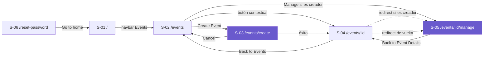

# Product Map — `web`

> **Inventario transcripto del código existente**, no un diseño propuesto. Las rutas son las que
> están declaradas en `App.tsx:177-184`; los bloques y el microcopy salen del relevamiento por
> pantalla en `docs/analysis/ux/web/`.
>
> Lo que falta en estas pantallas está en [`gaps-as-is.md`](../../gaps-as-is.md), no acá.

**Plataforma:** `web` · **Viewports:** `desktop` (base), `mobile` (≤768px)

---

## Inventario de Pantallas

| # | Pantalla | Ruta | Audiencia primaria | Viewports | Capability | Fuente |
|---|---|---|---|---|---|---|
| S-01 | Home (landing) | `/` | participante | `desktop`, `mobile` | — | `[fuente: código-existente]` |
| S-02 | Listado de eventos | `/events` | participante | `desktop`, `mobile` | C-11, C-24 | `[fuente: código-existente]` |
| S-03 | Crear evento | `/events/create` | **organizador** | `desktop`, `mobile` | C-10 | `[fuente: código-existente]` |
| S-04 | Detalle del evento | `/events/:eventId` | participante | `desktop`, `mobile` | C-12, C-18, C-19, C-27, C-30, C-35 | `[fuente: código-existente]` |
| S-05 | Gestión del evento | `/events/:eventId/manage` | **organizador** | `desktop`, `mobile` | C-13, C-14, C-15, C-20, C-21, C-25, C-26, C-34 | `[fuente: código-existente]` |
| S-06 | Definir nueva contraseña | `/reset-password` | participante | único (sin media queries) | C-06 | `[fuente: código-existente]` |

**Seis pantallas.** Dos son del organizador, cuatro del participante.

### Observaciones del inventario

**S-01 no cubre ninguna capability.** La landing tiene tres secciones con **texto placeholder
autorreferencial** ("This is the WHY section where we explain...") y no hace nada: sin fetch, sin
controles, sin guard. No traza a ningún requerimiento porque no implementa ninguno.

**S-04 concentra seis capabilities.** Es la pantalla más densa del producto: su "zona de acción"
(`edp-action`) es **un único contenedor cuyo contenido cambia por completo según la etapa del
evento y el rol de quien mira**. Puede mostrar el registro, la carga de propuesta, el panel de
ranking, el de resultados o un aviso de espera.

**S-06 es la única sin media queries propias.** Un solo layout para todos los anchos.

---

## Arquitectura de Información

### Una URL, dos destinos según quién mire

`/events/:eventId` **no lleva siempre a la misma pantalla.** `EventDetailPageWrapper` hace un fetch
del evento al montar y, si `event.creator_id === user.id`, redirige a `/events/:eventId/manage` con
`replace: true`.

```
/events/:eventId
   │
   ├── usuario ≠ creador ──> S-04 Detalle del evento
   └── usuario = creador  ──> redirect a S-05 Gestión del evento
```

**Consecuencias verificadas:**
- El organizador **nunca ve S-04**. El participante nunca ve S-05.
- El participante ve un **parpadeo de carga** (`<p>Loading...</p>` con estilos inline) antes del
  contenido, porque la decisión requiere una llamada a la API.
- El botón "← Back to Event Details" de S-05 navega a `/events/{id}`, que **redirige al organizador
  de vuelta a S-05**: un loop de navegación.

`[fuente: código-existente — App.tsx:70-119; ManageEventPage.tsx:298-300]`

### El contenido de S-04 depende de la etapa

La zona de acción de S-04 resuelve, en un solo contenedor, ocho situaciones mutuamente excluyentes:

| Etapa | Rol / condición | Qué se muestra |
|---|---|---|
| `creation` | no organizador | Aviso: el evento está en preparación |
| `participation` | no registrado | Bloque de registro |
| `participation` | registrado, sin entregar | Bloque de carga de propuesta |
| `participation` | ya entregó | Confirmación de entrega recibida |
| cualquiera | evento pausado | Aviso de pausa; acciones bloqueadas |
| `voting` | sin configurar | Panel de configuración de votación |
| `voting` | configurada, con asignación | Panel de ranking |
| `results` | — | Panel de resultados |

`[fuente: código-existente — EventDetailPage.tsx:284-420]`

---

## Navegación

### Chrome global

Presente en **las 6 rutas**: `<nav className="navbar">` renderizada por `AppContent` por encima de
`<Routes>`.

| Elemento | Destino | Estado |
|---|---|---|
| Logo `TELESCOPIO` | `/` | Funciona |
| `About` | `/` | ⚠️ **Debería ir al ancla `#why`** de la landing |
| `See Demo` | `/` | ⚠️ **Debería ir al ancla `#demo`** |
| `Events` | `/events` | Funciona |
| Bloque de sesión | abre el modal de auth / muestra al usuario | Funciona |

Las tres secciones de la landing **definen** `id="why"`, `id="how"` e `id="demo"`, pero **ningún
link apunta a esas anclas**. `[fuente: código-existente — App.tsx:26,36,46,157-158]`

### Mapa de navegación



Violeta = pantallas del organizador. Las líneas punteadas entre S-04 y S-05 son el loop descrito
arriba.

**No hay ruta 404:** una URL desconocida renderiza la navbar sobre un área de contenido vacía.

**No hay rutas protegidas:** ninguna ruta está envuelta en un guard. `/events/create` y
`/events/:eventId/manage` son alcanzables por URL sin sesión; el control se hace dentro de cada
pantalla (S-03 redirige en silencio, S-05 muestra un mensaje de permiso).

`[fuente: código-existente — App.tsx:177-184]`

### El botón contextual del listado

En S-02, cada fila de evento muestra **un solo botón**, resuelto por rol y etapa:

| Condición | Texto |
|---|---|
| Es el creador | `Manage` |
| `participation` + registrado | `Upload File` |
| `participation` + no registrado | `Participate` |
| `voting` + registrado | `Vote` |
| `results` + registrado | `See Results` |
| Fallback | `View Event` |

Es el mecanismo principal de orientación del producto: le dice al usuario qué le toca hacer ahora
en cada evento. `[fuente: código-existente — Events.tsx:269-338]`

---

## Inventario de Overlays y Paneles

No son rutas: se montan sobre las pantallas.

| # | Overlay / Panel | Se monta en | Propósito |
|---|---|---|---|
| O-01 | `Modal` (contenedor genérico) | 4 usos | Overlay base del producto |
| O-02 | Auth (login / registro) | navbar, S-02, S-04 | Iniciar sesión o registrarse |
| O-03 | `UsernameModal` | tras Google OAuth | Completar el nombre si el usuario es nuevo |
| O-04 | `ForgotPasswordForm` | dentro de O-02 | Solicitar el link de recuperación |
| O-05 | `StageAdvanceModal` | S-04, S-05 | Confirmar el avance de etapa y fijar deadline |
| O-06 | Modal de confirmación de subida | S-04 | Confirmar el archivo antes de subirlo |
| O-07 | Modal de edición de deadline | S-05 | Posponer el deadline de la etapa |
| O-08 | Modal de participantes | S-04 | Ver quiénes se registraron |
| O-09 | `VotingConfigurationPanel` | S-04, S-05 | Configurar los parámetros del algoritmo (embebido) |
| O-10 | `VotingResultsPanel` | S-04, S-05 y una tercera | Mostrar el ranking (embebido) |
| O-11 | `EventTimeline` | S-04, S-05 | Stepper de 4 etapas (embebido) |
| O-12 | `RankingVotePanel` | S-04 | Ordenar las propuestas asignadas (embebido) |

**O-09 a O-12 son paneles embebidos**, no overlays: se renderizan dentro del flujo de la pantalla.
Se listan acá porque concentran funcionalidad propia y aparecen en más de una pantalla.

⚠️ **Ningún overlay tiene `role="dialog"`, `aria-modal`, gestión de foco ni cierre por Escape.**
La confirmación de pausa de S-05 usa además **`window.confirm` nativo**, el único diálogo no-React
del producto.

---

## Cobertura de Capabilities

Cruce entre las capabilities del PRD y las pantallas que las implementan.

| Capability | Pantalla | Notas |
|---|---|---|
| C-01 a C-08 (identidad) | O-02, O-03, O-04, S-06 | Todo el flujo de auth vive en overlays, salvo el reset |
| C-09 (consultar usuario) | — | Sin pantalla propia |
| C-10 (crear evento) | S-03 | ⚠️ **Sin campo de fecha**: se autogenera hoy+1día |
| C-11, C-24 (listar) | S-02 | Con tres tabs de filtrado client-side |
| C-12 (ver detalle) | S-04 | |
| C-13 (avanzar etapa) | S-05, S-04 | ⚠️ **Valida en S-05, no valida en S-04** |
| C-14 (posponer deadline) | S-05, O-07 | |
| C-15 (pausar) | S-05 | Con `window.confirm` nativo |
| C-16 (cancelar) | — | **Sin pantalla.** El backend lo expone; la interfaz no |
| C-17 (compartir) | S-04 | ⚠️ Puede fallar en silencio |
| C-18 (registrarse al evento) | S-04 | |
| C-19 (subir propuesta) | S-04, O-06 | |
| C-20 (listar participantes) | S-05, O-08 | ⚠️ Datos inventados ante fallo de API |
| C-21 (listar propuestas) | S-05 | Solo como contador |
| C-22 (consultar propuesta propia) | S-04 | Para saber si ya entregó |
| C-23 (descargar propuesta) | O-12 | ⚠️ **El enlace apunta a `localhost` hardcodeado** |
| C-25 (configurar votación) | O-09 | Con el `m` recomendado precargado |
| C-26 (generar asignaciones) | O-09 | Irreversible |
| C-27 (consultar asignación) | O-12 | |
| C-28, C-29 (borradores) | O-12 | |
| C-30 (enviar ranking) | O-12 | Irreversible |
| C-31, C-34 (resultados, estadísticas) | O-10, S-05 | |
| C-32, C-33 (calidad, incentivos) | — | **Sin representación en la interfaz.** El participante nunca ve su `Q_i` |
| C-35 (ver resultados) | O-10 | ⚠️ Muestra `global_rank` y `adjusted_rank` sin declarar cuál manda |
| C-36 a C-38 (emails) | — | Fuera de la interfaz |

### Capabilities sin pantalla

- **C-16 (cancelar evento)** — El backend lo expone (`PATCH /cancel`) y dispara emails, pero
  **no hay ningún control en la interfaz** para ejecutarlo. La UI solo *muestra* el badge
  `CANCELLED` si el evento ya lo está.
- **C-32 y C-33 (calidad del evaluador e incentivos)** — Se calculan y persisten, y **nunca se
  muestran**. El participante no ve su `Q_i` ni sabe que existe, lo que es coherente con el pain
  P-03 de esa audiencia: el incentivo no puede operar si no se comunica.

---

## Fuente

Todo el inventario proviene de `docs/analysis/ux/web/`:
[`index.md`](../../../analysis/ux/web/index.md) y los seis documentos de
`screens/`. Las capabilities son las de [`requirements.md`](../../../prd/requirements.md).
