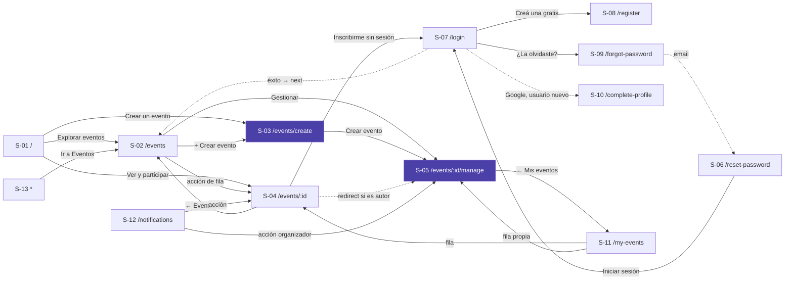

# Product Map — `web`

> **Versión 2.0 — rediseño de REQ-003.** La versión 1.0 transcribía el código existente (as-is).
> Esta versión describe el rediseño de `documentation/Telescopio Rediseño Vistas.html` (pantallas
> `1a`–`2g`) con las decisiones de [REQ-003](../../../requests/REQ-003.rediseno-de-vistas-notificaciones-y-multilenguaje.md):
> pantallas de auth como páginas, Mis eventos, notificaciones in-app, 404, multilenguaje es/en y
> responsive en todas las pantallas.
>
> El historial as-is queda en git y los defectos relevados en [`gaps-as-is.md`](../../gaps-as-is.md).

**Plataforma:** `web` · **Viewports:** `desktop` (> 768px), `mobile` (≤ 768px)

**Lenguaje visual:** bandas oscuras solo para navegación y encabezados; contenido sobre fondos
claros; un único paso siguiente destacado por pantalla. `[fuente: REQ-003 RF 1]`

---

## Inventario de Pantallas

| # | Pantalla | Ruta | Audiencia primaria | Viewports | Capability / Requerimiento | Fuente |
|---|---|---|---|---|---|---|
| S-01 | Inicio | `/` | participante | `desktop`, `mobile` | REQ-003 RF 12 | `[fuente: REQ-003 — 1a]` |
| S-02 | Eventos | `/events` | participante | `desktop`, `mobile` | C-11, C-24 · REQ-003 RF 13, 14 | `[fuente: REQ-003 — 1c, 1h]` |
| S-03 | Crear evento | `/events/create` | **organizador** | `desktop`, `mobile` | C-10 · REQ-003 RF 16 | `[fuente: REQ-003 — 1d, L-4]` |
| S-04 | Detalle del evento | `/events/:eventId` | participante | `desktop`, `mobile` | C-12, C-17–C-19, C-23, C-27–C-30, C-35 · REQ-003 RF 18–21, 30–32 | `[fuente: REQ-003 — 1e, 1f, 1i, 2g]` |
| S-05 | Gestión del evento | `/events/:eventId/manage` | **organizador** | `desktop`, `mobile` | C-13–C-15, C-20, C-21, C-25, C-26, C-34 · REQ-003 RF 17, 22–29 | `[fuente: REQ-003 — 2a, 2c, 2e]` |
| S-06 | Definir nueva contraseña | `/reset-password` | participante | `desktop`, `mobile` | C-06 · REQ-003 RF 10 | `[fuente: REQ-003 — derivada de 1b]` |
| S-07 | Iniciar sesión | `/login` | participante | `desktop`, `mobile` | C-02, C-03 · REQ-003 RF 10 | `[fuente: REQ-003 — 1b]` |
| S-08 | Crear cuenta | `/register` | participante | `desktop`, `mobile` | C-01 · REQ-003 RF 10 | `[fuente: REQ-003 — derivada de 1b]` |
| S-09 | Recuperar contraseña | `/forgot-password` | participante | `desktop`, `mobile` | C-05 · REQ-003 RF 10 | `[fuente: REQ-003 — derivada de 1b]` |
| S-10 | Completar perfil | `/complete-profile` | participante | `desktop`, `mobile` | C-03 · REQ-003 RF 10 | `[fuente: REQ-003 — derivada de 1b]` |
| S-11 | Mis eventos | `/my-events` | organizador, participante | `desktop`, `mobile` | REQ-003 RF 15 | `[fuente: REQ-003 — "← Mis eventos" de 2a, no diseñada]` |
| S-12 | Notificaciones | `/notifications` | organizador, participante | `desktop`, `mobile` | REQ-003 RF 33–35 | `[fuente: REQ-003 — 1l]` |
| S-13 | Página no encontrada | `*` | participante | `desktop`, `mobile` | REQ-003 RF 11, AC 34 | `[fuente: REQ-003 — DA-9]` |

**Trece pantallas.** Dos son exclusivas del organizador (S-03, S-05), dos son compartidas (S-11,
S-12) y el resto son del recorrido del participante y del visitante.

**Pantallas explícitamente excluidas:**
- **1g "Evento finalizado pidiendo login"** del diseño: contradice REQ-002 (resultados públicos). Prevalece 1i, que vive en S-04 (REQ-003 L-7).
- **Preferencias de email por tipo** (columna lateral de 1l): fuera de alcance (REQ-003, agregados).

---

## Chrome global

Presente en todas las pantallas salvo las de auth (S-06 a S-10), que usan el layout dividido sin
barra de navegación.

| Elemento | Sin sesión | Con sesión | Destino |
|---|---|---|---|
| Logo `TELESCOPIO` | ✓ | ✓ | `/` |
| `Inicio` | ✓ | ✓ | `/` |
| `Eventos` | ✓ | ✓ | `/events` |
| `Cómo funciona` | ✓ | ✓ | `/#como-funciona` (sección de S-01) |
| Selector de idioma `ES / EN` | ✓ en la barra | dentro del menú de usuario | cambia el idioma sin recargar |
| `Iniciar sesión` / `Crear cuenta` | ✓ | — | S-07 / S-08 |
| Campana con contador | — | ✓ | desktop: abre O-13 · mobile: navega a S-12 |
| Menú de usuario (iniciales + nombre) | — | ✓ | `Mis eventos`, `Idioma`, `Notificaciones`, `Cerrar sesión` |

En `mobile` las entradas de navegación (`Inicio`, `Eventos`, `Cómo funciona`) pasan a un menú
desplegable; la campana y el avatar quedan visibles en la barra. `[fuente: REQ-003 RF 9, AC 6]`

---

## Arquitectura de Información

### Rutas y acceso

| Ruta | Acceso | Sin acceso |
|---|---|---|
| `/`, `/events`, `/events/:id`, `/login`, `/register`, `/forgot-password`, `/reset-password`, `*` | Público | — |
| `/complete-profile` | Flujo Google | redirige a `/` |
| `/events/create`, `/my-events`, `/notifications` | Con sesión | `/login?next=<ruta>` (AC 33) |
| `/events/:id/manage` | Con sesión + autor | sin sesión → `/login?next=…`; no autor → estado "sin permiso" en S-05 (AC 32) |

### Una URL, dos destinos (se mantiene)

`/events/:eventId` sigue redirigiendo al autor a `/events/:eventId/manage`. Lo que cambia es que
S-05 ya **no** tiene un botón de vuelta a S-04: "← Mis eventos" lleva a S-11. Se elimina el loop de
navegación de la v1.0.

> ⚠️ **Pregunta abierta.** El diseño (2a, 2c, 2e) muestra "Ver página pública", pero con el redirect
> actual el autor nunca puede ver S-04. Hasta que se decida cómo saltear el redirect, S-05 no
> muestra esa acción; "Compartir" (O-14) cubre la necesidad de pasar el enlace.

### Un evento en Creación no existe para los demás

Un evento en etapa `creation` no aparece en S-02 y, si alguien que no es su autor lo abre por URL,
ve S-13 (mismo estado que un evento inexistente). Su autor lo ve en S-11 con la etiqueta
"Borrador · no visible". `[fuente: REQ-003 RF 14, AC 34]`

### El contenido de S-04 depende de la etapa y del rol

El bloque "Tu próximo paso" de S-04 es el único lugar que cambia; el resto de la pantalla
(encabezado, línea de etapas, detalles) es estable.

| Etapa | Rol / condición | "Tu próximo paso" |
|---|---|---|
| `participation` | sin sesión o no inscripto | Inscribite para participar |
| `participation` | inscripto sin propuesta | Subí tu propuesta (zona de carga) |
| `participation` | inscripto con propuesta | Tu propuesta está enviada (reemplazar) |
| `participation` | cupo completo | El cupo está completo |
| cualquiera | evento pausado | El evento está pausado |
| `voting` | con asignación | Ordená las N propuestas (lista ordenable) |
| `voting` | sin propuesta | No participás de esta votación |
| `voting` | ranking enviado | Tu ranking está enviado (modificable) |
| `results` | cualquiera, también sin sesión | Ranking final (podio + lista) |

### El contenido de S-05 depende de la etapa

| Etapa | Próximo paso destacado | Acción secundaria |
|---|---|---|
| `creation` | Abrir inscripción (O-15) con checklist | Editar datos, Pausar |
| `participation` | Pasar a votación (O-16) con consecuencias | Recordar (N), Editar datos, Pausar |
| `voting` | Publicar resultados (O-17), como contorno | Enviar recordatorio a N pendientes, Pausar |
| `results` | — (resultados como en S-04) | Compartir |

---

## Navegación

### Mapa de navegación

```mermaid
graph LR
    Inicio["S-01 /"]
    Eventos["S-02 /events"]
    Crear["S-03 /events/create"]
    Detalle["S-04 /events/:id"]
    Gestion["S-05 /events/:id/manage"]
    Reset["S-06 /reset-password"]
    Login["S-07 /login"]
    Registro["S-08 /register"]
    Olvido["S-09 /forgot-password"]
    Perfil["S-10 /complete-profile"]
    Mis["S-11 /my-events"]
    Notif["S-12 /notifications"]
    NF["S-13 *"]

    Inicio -->|Explorar eventos| Eventos
    Inicio -->|Crear un evento| Crear
    Inicio -->|Ver y participar| Detalle
    Eventos -->|acción de fila| Detalle
    Eventos -->|Gestionar| Gestion
    Eventos -->|+ Crear evento| Crear
    Crear -->|Crear evento| Gestion
    Detalle -->|← Eventos| Eventos
    Detalle -.->|redirect si es autor| Gestion
    Detalle -->|Inscribirme sin sesión| Login
    Gestion -->|← Mis eventos| Mis
    Mis -->|fila| Detalle
    Mis -->|fila propia| Gestion
    Login -->|Creá una gratis| Registro
    Login -->|¿La olvidaste?| Olvido
    Login -.->|Google, usuario nuevo| Perfil
    Login -.->|éxito → next| Eventos
    Olvido -.->|email| Reset
    Reset -->|Iniciar sesión| Login
    Notif -->|acción| Detalle
    Notif -->|acción organizador| Gestion
    NF -->|Ir a Eventos| Eventos

    style Gestion fill:#4B3FA8,color:#fff
    style Crear fill:#4B3FA8,color:#fff
```

Violeta = pantallas del organizador. La campana (O-13) y el menú de usuario están en todas las
pantallas con sesión y no se dibujan para no saturar el diagrama.

### La acción de cada fila del listado

En S-02 y S-11 cada fila muestra **una sola acción**, resuelta por rol y etapa:

| Condición | Texto | Variante |
|---|---|---|
| Es el autor | `Gestionar` | contorno |
| `participation` + no inscripto | `Participar` (sin sesión: + "Requiere cuenta") | primaria |
| `participation` + inscripto sin propuesta | `Subir archivo` | primaria |
| `participation` + con propuesta | `Ver evento` | contorno |
| `voting` + con asignación sin enviar | `Votar` | primaria |
| `voting` + otro caso | `Ver evento` | contorno |
| `results` | `Ver resultados` | contorno |

`[fuente: REQ-003 RF 13 — 1c, 1h]`

---

## Inventario de Overlays

| # | Overlay | Tipo | Trigger | Propósito |
|---|---|---|---|---|
| O-07 | Editar cierre | modal | S-05 · "editar" en la línea de etapas | Posponer la fecha de cierre de la etapa actual con atajos. Solo posponer (RF 28) |
| O-08 | Participantes | modal | S-04 · "ver" en Detalles | Tabla de participantes del evento (nombre, fecha de inscripción) |
| O-13 | Panel de notificaciones | popover (solo desktop) | header · campana | Notificaciones recientes con acción directa y "Marcar todo como leído" (1k) |
| O-14 | Compartir | modal | S-04 / S-05 · "Compartir" | Copiar el enlace con confirmación + redes (1j) |
| O-15 | Abrir inscripción | modal | S-05 · próximo paso en Creación | Fecha de cierre de inscripción con atajos (2b) |
| O-16 | Abrir votación | modal | S-05 · próximo paso en Participación | Resumen del reparto, cierre, propuestas por evaluador y ajustes avanzados en un solo paso (2d) |
| O-17 | Publicar resultados | modal | S-05 · "Cerrar votación y publicar" | Aviso de rankings faltantes e irreversibilidad (2f) |
| O-18 | Editar datos del evento | modal | S-05 · "Editar datos" | Nombre, descripción, organizador y cupo en Creación y Participación (RF 17) |
| O-19 | Confirmar recordatorio | modal | S-05 · "Recordar (N)" / "Enviar recordatorio a N pendientes" | Confirmar el envío de email + notificación a los pendientes (RF 27) |

**En mobile** los modales ocupan el ancho completo con las acciones fijas abajo (comportamiento del
componente Dialog del DS). O-13 no existe en mobile: la campana navega a S-12.

**Overlays de la v1.0 eliminados:**
- O-01 Modal genérico — lo reemplaza el componente Dialog del DS; es un componente, no un overlay del producto.
- O-02 Auth, O-03 Completar nombre, O-04 Recuperar contraseña — pasan a ser las páginas S-07 a S-10 (REQ-003 RF 10).
- O-05 Avance de etapa — se divide en O-15, O-16 y O-17, uno por transición.
- O-06 Confirmar subida — la confirmación pasa a la zona de carga de S-04 (1f).
- O-09 Configuración de votación — se une a O-16 (REQ-003 L-5, DA-4).
- O-10 Resultados, O-11 Línea de etapas, O-12 Ranking — eran paneles embebidos; pasan a ser componentes de dominio (`Podium` + `RankingList`, `StageTimeline`, `SortableRankList`) descritos dentro de S-04 y S-05.

---

## Cobertura de Capabilities

| Capability | Pantalla | Notas |
|---|---|---|
| C-01 a C-08 (identidad) | S-06 a S-10 | Todo el flujo de auth en páginas |
| C-09 (consultar usuario) | — | Sin pantalla propia |
| C-10 (crear evento) | S-03 | Wizard de 3 pasos; fechas y reglas se definen al avanzar de etapa |
| C-11, C-24 (listar) | S-02, S-11 | Filtros con conteo, búsqueda, eventos en Creación ocultos |
| C-12 (ver detalle) | S-04 | |
| C-13 (avanzar etapa) | S-05, O-15, O-16, O-17 | **Solo desde S-05**: S-04 ya no ofrece avanzar (cierra D-05) |
| C-14 (posponer cierre) | S-05, O-07 | Solo posponer, validado también en el cliente |
| C-15 (pausar) | S-05 | Acción secundaria con confirmación en Dialog |
| C-16 (cancelar) | — | Sigue sin pantalla (fuera de alcance de REQ-003) |
| C-17 (compartir) | O-14 | Con aviso si la copia falla |
| C-18 (registrarse) | S-04 | |
| C-19 (subir propuesta) | S-04 | Confirmación en la zona de carga; reemplazable hasta el cierre |
| C-20 (listar participantes) | S-05, O-08 | Con estado de archivo y de voto en S-05 |
| C-23 (descargar propuesta) | S-04 | "Ver archivo" en la lista de ranking (cierra D-15) |
| C-25, C-26 (configurar, generar) | O-16 | Una sola operación al abrir la votación |
| C-27 a C-30 (asignación, borrador, ranking) | S-04 | Ranking reenviable mientras dure la votación |
| C-31, C-34, C-35 (resultados, estadísticas) | S-04, S-05 | Puntaje en escala 0–10 con un decimal |
| C-32, C-33 (calidad, incentivos) | S-04 | Solo como explicación del mecanismo ("¿Cómo cuenta tu voto?"); el `Q_i` individual sigue sin mostrarse |
| Notificaciones in-app (REQ-003) | O-13, S-12 | |
| Recordatorio manual (REQ-003) | S-05, O-19 | |
| Editar evento (REQ-003) | O-18 | |

---

## Fuente

- Diseño: `documentation/Telescopio Rediseño Vistas.html` (pantallas 1a–1l, 2a–2g).
- Decisiones: [REQ-003](../../../requests/REQ-003.rediseno-de-vistas-notificaciones-y-multilenguaje.md), secciones "Relevamiento de pantallas", "Discrepancias de lógica y agregados", "Diseño Técnico" (DA-1 a DA-10).
- Capabilities: [`requirements.md`](../../../prd/requirements.md).
