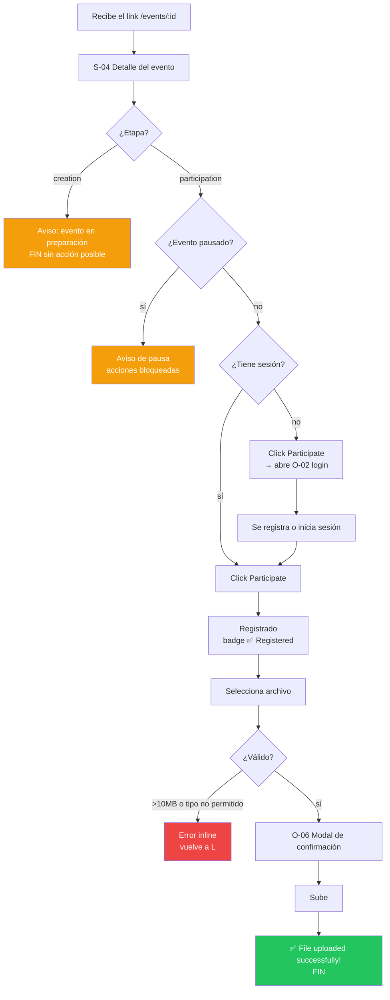
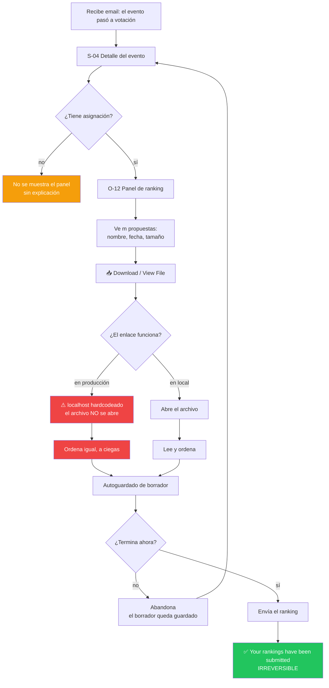
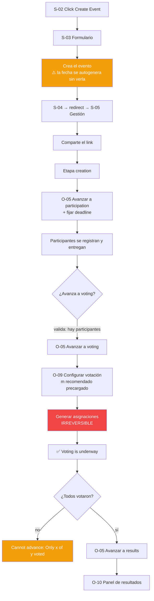
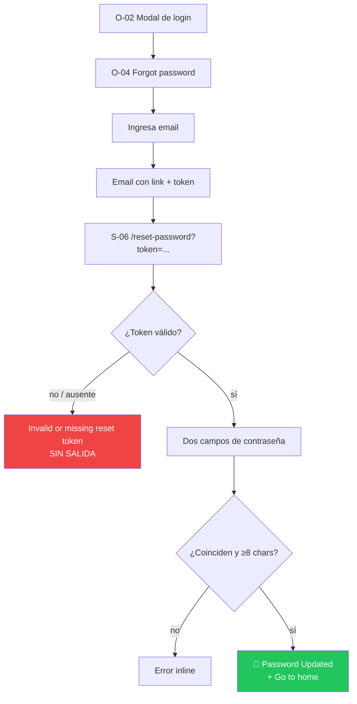

# User Flows — `web`

> **Flujos transcriptos del código existente**, inferidos de la navegación relevada cruzada con los
> flujos técnicos de [`docs/flows/`](../../../flows/). Describen lo que el usuario recorre hoy, no
> un diseño propuesto.
>
> Se documentan **4 flujos críticos**, no todos los posibles (Regla 7). Cada uno nombra el JTBD que
> resuelve y cubre los caminos no felices.

---

## UF-01 — Del link compartible a la propuesta entregada

**Audiencia:** participante · **Resuelve:** JTBD-01 (entregar antes de que cierre)
**Pantallas:** S-04, O-02 · **Flujo técnico:** [`registro-y-carga-de-propuesta`](../../../flows/registro-y-carga-de-propuesta.md)

Es el flujo de incorporación del producto. Empieza fuera del sistema: alguien comparte una URL.

### Caminos no felices

| Situación | Qué ve el usuario | Estado |
|---|---|---|
| Etapa `creation` | `🔭 This event is being set up. Come back when it opens for participation.` | Bien resuelto |
| Evento pausado | `⏸ Registration and file submissions are not available while the event is paused.` | Bien resuelto |
| Cupo completo | Mensaje crudo de la API | Aceptable |
| Archivo >10 MB | `File cannot exceed 10MB` | Bien resuelto |
| Tipo no permitido | `File type not allowed. Use: JPEG, PNG, GIF, WebP, PDF, TXT, DOC, DOCX` | Bien resuelto |
| Ya entregó | `✅ Submission received` — no se ofrece subir otra | Bien resuelto |
| Falla la carga del evento | Pantalla completa de error con dos vías de recuperación | Bien resuelto |

**Observación:** es el flujo mejor cubierto del producto. Los estados de bloqueo están todos
contemplados y explicados.

⚠️ **Salvo uno:** el mensaje de error dice `10MB` y la línea de requisitos dice `Max 10 MB`.
Inconsistencia menor de microcopy.

---

## UF-02 — Evaluar las propuestas asignadas

**Audiencia:** participante · **Resuelve:** JTBD-02 (cumplir con la evaluación)
**Pantallas:** S-04 → O-12 · **Flujo técnico:** [`evaluacion-y-envio-de-ranking`](../../../flows/evaluacion-y-envio-de-ranking.md)

### El problema central de este flujo

⚠️ **El enlace de descarga tiene `http://localhost:8080` hardcodeado**
(`RankingVotePanel.tsx:242`), ignorando `REACT_APP_API_URL`. En cualquier despliegue real **el
evaluador no puede abrir las propuestas** y termina ordenándolas por nombre de archivo, fecha y
tamaño — los únicos datos que la tarjeta muestra.

**Un ranking emitido sin leer las propuestas no mide calidad**, y el `Q_i` derivado de él tampoco.
Es el defecto de mayor impacto sobre el valor del producto.

### Caminos no felices

| Situación | Qué ve el usuario | Estado |
|---|---|---|
| Sin asignación | El panel simplemente no aparece | ⚠️ **Sin explicación.** No se distingue "no te tocó" de "todavía no se generaron" |
| Enlace de descarga roto | Un link que no lleva a ningún lado | ⚠️ **Falla en silencio** |
| Abandona a mitad | El borrador se guarda solo | Bien resuelto |
| Rangos inválidos | Mensaje crudo del backend | Aceptable |
| Ya votó | No admite reenvío | Correcto, pero **irreversible sin advertencia previa** |

**Lo mejor resuelto:** el autoguardado con debounce del borrador. Abandonar no cuesta nada.

**Lo peor resuelto:** el envío es irreversible y **no hay ninguna confirmación previa** que lo
advierta. Contrasta con la subida de archivo (UF-01), que sí pide confirmación en un modal para una
acción menos definitiva.

---

## UF-03 — Conducir el evento de principio a fin

**Audiencia:** organizador · **Resuelve:** JTBD-01 y JTBD-02 (abrir y conducir)
**Pantallas:** S-03 → S-05 → O-05, O-09 · **Flujos técnicos:**
[`avance-de-etapa`](../../../flows/avance-de-etapa-del-evento.md),
[`configuracion-y-generacion-de-asignaciones`](../../../flows/configuracion-y-generacion-de-asignaciones.md)

### Caminos no felices

| Situación | Qué ve el organizador | Estado |
|---|---|---|
| Sin participantes al avanzar | `Cannot advance: No participants registered yet.` | Bien resuelto **solo desde S-05** |
| Votación incompleta | `Cannot advance: Only {x} of {y} participants have voted.` | Bien resuelto **solo desde S-05** |
| No es el creador | `You do not have permission to manage this event.` | **El único estado de permiso explícito del producto** |
| Sin sesión | Redirige a `/events` **sin ningún mensaje** | ⚠️ Deficiente |
| `m` fuera de rango | Mensaje crudo del backend | Aceptable |
| Umbrales inválidos | **Error 500 genérico** (CHECK de base) | ⚠️ Malo |
| Falla una carga secundaria | **Nada: se ven datos falsos o vacíos** | ⚠️ **Crítico** |

### Los tres problemas de este flujo

1. **Las validaciones de avance dependen de la pantalla.** Desde S-05 se valida; **desde S-04 el
   mismo avance no valida nada**. Un organizador que llegue por el camino equivocado puede cerrar
   la votación con evaluaciones pendientes — y quien no completó recibe `Q_i = 0` y su propuesta
   baja `n` posiciones.

2. **No hay confirmación de éxito en toda S-05.** Tras avanzar de etapa, pausar o cambiar un
   deadline, **el único feedback es que los datos se recargan**. S-04 sí muestra
   `Stage updated to: {etapa}`.

3. **Generar asignaciones es irreversible y no lo advierte.** No hay endpoint para rehacerlas. Si
   la configuración estaba mal, no hay camino de vuelta.

### Una capability sin flujo

**C-16 (cancelar evento) no tiene ningún control en la interfaz.** Verificado: los únicos botones
"Cancel" del frontend cierran formularios y modales. El backend expone `PATCH /cancel` y dispara
emails de cancelación, pero **el organizador no tiene forma de ejecutarlo**. La UI solo muestra el
badge `CANCELLED` si el evento ya lo está — un estado al que no se puede llegar desde el producto.

---

## UF-04 — Recuperar el acceso

**Audiencia:** participante · **Resuelve:** habilitador de todos los JTBD
**Pantallas:** O-02 → O-04 → email → S-06

**Por qué este flujo es crítico y no obvio:** el registro a un evento **crea el usuario sin
contraseña** (`password_hash` nulo). Para esas personas —que entraron por un link compartible— este
flujo **no es "recuperar" una contraseña: es la única forma de obtener una**. Y la interfaz no lo
explica en ningún lado.

### Caminos no felices

| Situación | Qué ve el usuario | Estado |
|---|---|---|
| Token ausente o inválido | `Invalid or missing reset token.` | ⚠️ **Sin salida**: la tarjeta no ofrece ningún botón ni link |
| Token expirado (>1h) | `Something went wrong. The link may have expired.` | Aceptable, pero sin acción para volver a pedirlo |
| Contraseñas no coinciden | `Passwords do not match.` | Bien resuelto |
| Menos de 8 caracteres | `Password must be at least 8 characters.` | Bien resuelto |

⚠️ **El estado de token inválido es un callejón sin salida.** El usuario queda en una pantalla con
un mensaje de error y **ninguna forma de pedir un link nuevo** ni de volver al inicio.

---

## Flujos deliberadamente no documentados

Por la Regla 7 (no rellenar), estos existen pero no son críticos:

- **Explorar el listado y filtrar por tabs** — Navegación, sin decisión relevante.
- **Login con Google** — Variante de autenticación de UF-04.
- **Ver resultados** — Es una pantalla terminal de lectura, sin ramificación. Su problema no es de
  flujo sino de definición: no está decidido cuál ranking es el oficial.
- **Compartir el evento** — Una acción de un click. Su defecto (puede fallar en silencio) está en
  el reporte de gaps.
