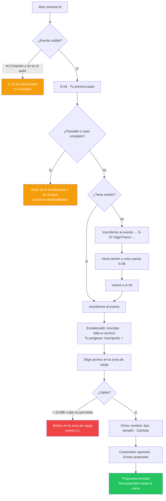
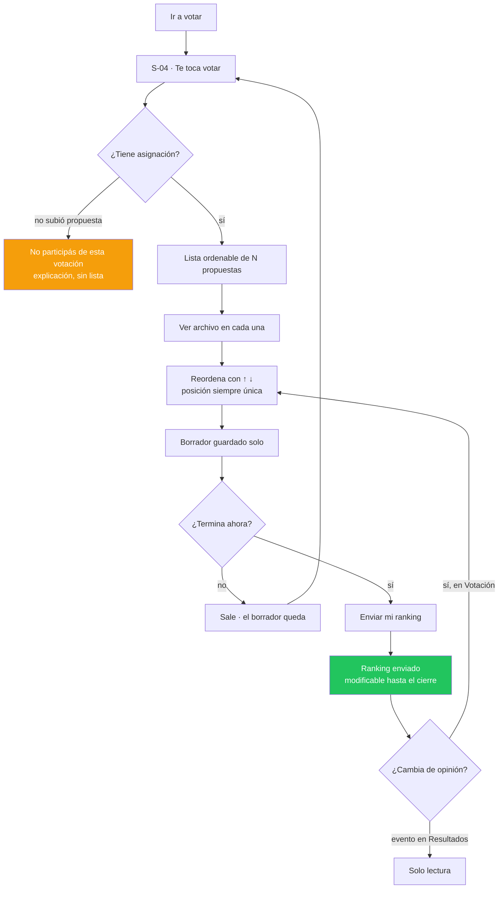
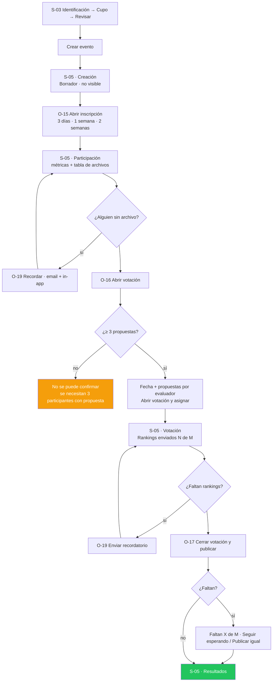
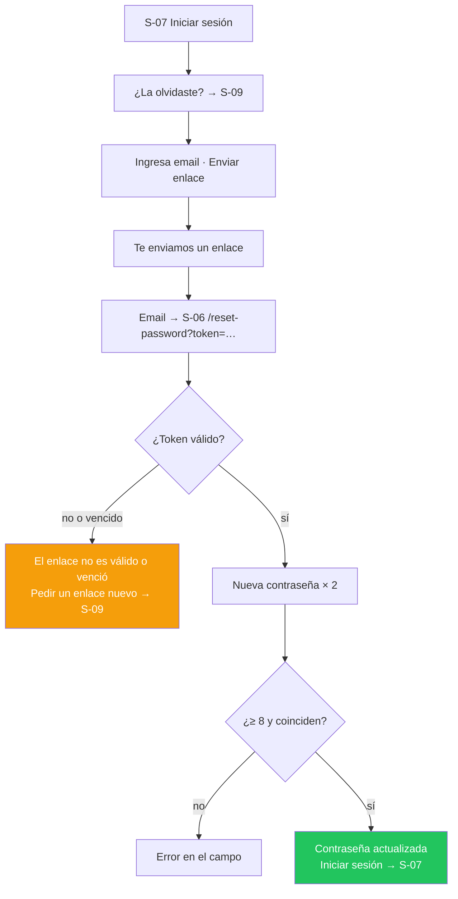
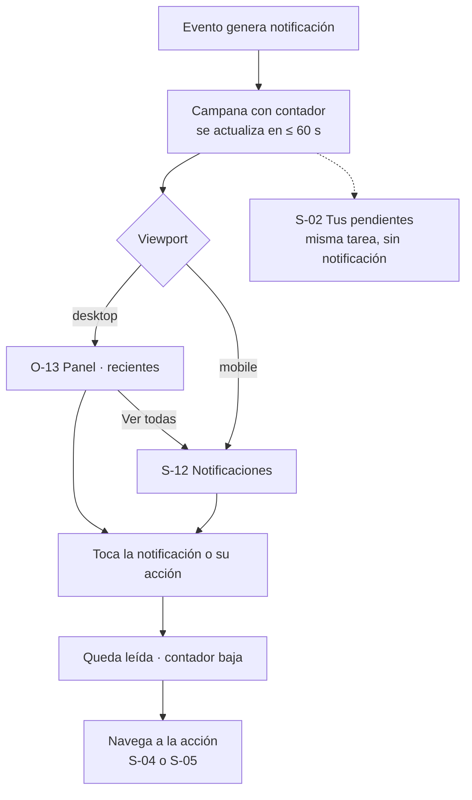

# User Flows — `web`

> **Versión 2.0 — rediseño de REQ-003.** La versión 1.0 transcribía los flujos del código
> existente; su historial queda en git. Estos flujos describen el recorrido rediseñado y cubren los
> caminos no felices que el rediseño resuelve.
>
> Se documentan **5 flujos críticos** (máximo de la Regla 7). Cada uno nombra el JTBD que resuelve.

---

## UF-01 — Del link compartible a la propuesta entregada

**Audiencia:** participante · **Resuelve:** JTBD-01 (entregar antes de que cierre)
**Pantallas:** S-04, S-07, S-08 · **Flujo técnico:** [`registro-y-carga-de-propuesta`](../../../flows/registro-y-carga-de-propuesta.md)
**Trigger:** alguien comparte la URL `/events/:id` o el usuario elige "Participar" en S-02.

```mermaid
graph TD
    A[Abre /events/:id] --> B{¿Evento visible?}
    B -->|en Creación y no es el autor| NF[S-13 No encontrado<br/>Ir a Eventos]
    B -->|sí| C[S-04 · Tu próximo paso]
    C --> D{¿Pausado o cupo completo?}
    D -->|sí| E[Aviso en el encabezado y en el paso<br/>acciones deshabilitadas]
    D -->|no| F{¿Tiene sesión?}
    F -->|no| G[Inscribirme al evento → S-07 /login?next=…]
    G --> H[Inicia sesión o crea cuenta S-08]
    H --> I[Vuelve a S-04]
    F -->|sí| J[Inscribirme al evento]
    I --> J
    J --> K[Encabezado: Inscripto · falta tu archivo<br/>Tu progreso: Inscripción ✓]
    K --> L[Elige archivo en la zona de carga]
    L --> M{¿Válido?}
    M -->|> 10 MB o tipo no permitido| N[Motivo en la zona de carga<br/>vuelve a L]
    M -->|sí| O[Ficha: nombre, tipo, tamaño · Cambiar]
    O --> P[Comentario opcional · Enviar propuesta]
    P --> Q[Propuesta enviada<br/>Reemplazable hasta el cierre]

    style NF fill:#f59e0b,color:#fff
    style E fill:#f59e0b,color:#fff
    style N fill:#ef4444,color:#fff
    style Q fill:#22c55e,color:#fff
```

**Pasos (happy path):**
1. Abre el enlace y ve el encabezado con la etapa y el cierre, la línea de etapas con "ahora" y el bloque "Tu próximo paso" con requisitos (formatos, 10 MB, fecha de cierre).
2. Toca "Inscribirme al evento". Sin sesión pasa por S-07 y vuelve al mismo evento.
3. Elige el archivo: la zona de carga muestra nombre, tipo y tamaño antes de enviar.
4. Envía; "Tu progreso" marca la propuesta como enviada.

### Caminos no felices

| Situación | Qué ve el usuario |
|---|---|
| Evento en Creación (no es el autor) | S-13: "No encontramos esta página" + "Ir a Eventos" |
| Evento pausado | Encabezado "Evento pausado"; "Por ahora no se puede inscribir ni subir propuestas." |
| Cupo completo | "El cupo está completo. No quedan lugares en este evento." |
| Archivo > 10 MB | En la zona de carga: "El archivo supera los 10 MB." |
| Tipo no permitido | En la zona de carga: "Ese formato no está permitido. Usá JPG, PNG, GIF, WebP, PDF, TXT, DOC o DOCX." |
| Falla el envío | "No pudimos enviar tu propuesta. Probá de nuevo." — el archivo elegido se conserva |
| Ya entregó | "Tu propuesta está enviada" + "Reemplazar archivo" hasta el cierre |

**Estado final:** participante inscripto con propuesta enviada, reemplazable hasta el cierre de Participación.
**Criterio de éxito:** la entrega se completa sin salir de S-04 y sin perder el evento al pasar por el login (AC 12, 13, 33).

---

## UF-02 — Evaluar las propuestas asignadas

**Audiencia:** participante · **Resuelve:** JTBD-02 (cumplir con la evaluación)
**Pantallas:** S-04 · **Flujo técnico:** [`evaluacion-y-envio-de-ranking`](../../../flows/evaluacion-y-envio-de-ranking.md)
**Trigger:** notificación "Ya podés votar en «Evento»" (email o O-13/S-12) o acción "Votar" en S-02.

```mermaid
graph TD
    A[Ir a votar] --> B[S-04 · Te toca votar]
    B --> C{¿Tiene asignación?}
    C -->|no subió propuesta| D[No participás de esta votación<br/>explicación, sin lista]
    C -->|sí| E[Lista ordenable de N propuestas]
    E --> F[Ver archivo en cada una]
    F --> G[Reordena con ↑ ↓<br/>posición siempre única]
    G --> H[Borrador guardado solo]
    H --> I{¿Termina ahora?}
    I -->|no| J[Sale · el borrador queda]
    J --> B
    I -->|sí| K[Enviar mi ranking]
    K --> L[Ranking enviado<br/>modificable hasta el cierre]
    L --> M{¿Cambia de opinión?}
    M -->|sí, en Votación| G
    M -->|evento en Resultados| N[Solo lectura]

    style D fill:#f59e0b,color:#fff
    style L fill:#22c55e,color:#fff
```

**Pasos (happy path):**
1. Entra desde la notificación; "Tu próximo paso" dice "Ordená las N propuestas".
2. Abre cada archivo con "Ver archivo" (descarga autenticada).
3. Ordena con ↑ ↓; cada cambio guarda el borrador.
4. Envía; el paso pasa a "Tu ranking está enviado" con "Modificar ranking".

### Caminos no felices

| Situación | Qué ve el usuario |
|---|---|
| Inscripto sin propuesta | "No participás de esta votación porque no subiste una propuesta." |
| Falla la descarga | "No pudimos abrir el archivo. Probá de nuevo." |
| Falla el guardado del borrador | "No pudimos guardar el borrador. Tus cambios siguen en pantalla." |
| Falla el envío | "No pudimos enviar tu ranking. Probá de nuevo." — el orden se conserva |
| Evento pasa a Resultados | La lista queda en solo lectura, sin acciones (AC 40) |

**Estado final:** ranking enviado; reemplazable mientras el evento siga en Votación.
**Criterio de éxito:** el evaluador abre las propuestas antes de ordenar y nunca puede repetir una posición (AC 25, 26).

---

## UF-03 — Conducir el evento de principio a fin

**Audiencia:** organizador · **Resuelve:** JTBD-01, JTBD-02 y JTBD-03 (abrir, conducir, publicar)
**Pantallas:** S-03 → S-05 → O-15, O-16, O-17, O-18, O-19, O-07 · **Flujos técnicos:**
[`avance-de-etapa`](../../../flows/avance-de-etapa-del-evento.md),
[`configuracion-y-generacion-de-asignaciones`](../../../flows/configuracion-y-generacion-de-asignaciones.md)
**Trigger:** "+ Crear evento" en S-02 o "Crear un evento" en S-01.

```mermaid
graph TD
    A[S-03 Identificación → Cupo → Revisar] --> B[Crear evento]
    B --> C[S-05 · Creación<br/>Borrador · no visible]
    C --> D[O-15 Abrir inscripción<br/>3 días · 1 semana · 2 semanas]
    D --> E[S-05 · Participación<br/>métricas + tabla de archivos]
    E --> F{¿Alguien sin archivo?}
    F -->|sí| G[O-19 Recordar · email + in-app]
    G --> E
    F --> H[O-16 Abrir votación]
    H --> I{¿≥ 3 propuestas?}
    I -->|no| J[No se puede confirmar<br/>se necesitan 3 participantes con propuesta]
    I -->|sí| K[Fecha + propuestas por evaluador<br/>Abrir votación y asignar]
    K --> L[S-05 · Votación<br/>Rankings enviados N de M]
    L --> M{¿Faltan rankings?}
    M -->|sí| N[O-19 Enviar recordatorio]
    N --> L
    M --> O[O-17 Cerrar votación y publicar]
    O --> P{¿Faltan?}
    P -->|sí| Q[Faltan X de M · Seguir esperando / Publicar igual]
    Q --> R[S-05 · Resultados]
    P -->|no| R

    style J fill:#f59e0b,color:#fff
    style R fill:#22c55e,color:#fff
```

**Pasos (happy path):**
1. Crea el evento en 3 pasos con vista previa; queda en Creación, invisible para los demás.
2. Abre la inscripción eligiendo un atajo de duración; el evento pasa a ser público.
3. Sigue inscriptos y archivos; recuerda a quien falta.
4. Abre la votación en un solo diálogo; se asignan propuestas solo a quienes subieron archivo.
5. Sigue "Rankings enviados N de M"; recuerda a los pendientes.
6. Publica (con aviso si faltan rankings); ve el resultado como lo ve cualquiera.

**Acciones laterales:** "Editar datos" (O-18) en Creación y Participación; "editar" el cierre (O-07, solo posponer); "Pausar evento".

### Caminos no felices

| Situación | Qué ve el organizador |
|---|---|
| Menos de 3 participantes con propuesta | En O-16: "Se necesitan al menos 3 participantes con propuesta para abrir la votación." y confirmar deshabilitado |
| Propuestas por evaluador al máximo | El "+" se deshabilita y se lee "máximo N" |
| Umbrales inválidos | En O-16: "El umbral confiable tiene que superar al poco confiable por al menos 0,1." |
| Cierre anterior al actual | En O-07: "El cierre solo se puede posponer." |
| Cupo menor a los inscriptos | En O-18: "El cupo no puede ser menor a los N inscriptos." |
| Sin pendientes | El botón de recordatorio no se muestra |
| Falla una carga de la gestión | En ese bloque: "No pudimos cargar los participantes." + "Reintentar"; avanzar queda deshabilitado (REQ-001) |
| No es el autor | "No tenés permiso para gestionar este evento." + "Ir a Eventos" |
| Sin sesión | `/login?next=…` y vuelta a la gestión |

**Estado final:** evento en Resultados con ranking calculado y público.
**Criterio de éxito:** cada etapa tiene un único paso destacado y sus consecuencias se leen antes de confirmar (AC 16–24, 35–39).

---

## UF-04 — Recuperar (u obtener) el acceso

**Audiencia:** participante · **Resuelve:** habilitador de todos los JTBD
**Pantallas:** S-07 → S-09 → email → S-06 → S-07

```mermaid
graph TD
    A[S-07 Iniciar sesión] --> B[¿La olvidaste? → S-09]
    B --> C[Ingresa email · Enviar enlace]
    C --> D[Te enviamos un enlace]
    D --> E[Email → S-06 /reset-password?token=…]
    E --> F{¿Token válido?}
    F -->|no o vencido| G[El enlace no es válido o venció<br/>Pedir un enlace nuevo → S-09]
    F -->|sí| H[Nueva contraseña × 2]
    H --> I{¿≥ 8 y coinciden?}
    I -->|no| J[Error en el campo]
    I -->|sí| K[Contraseña actualizada<br/>Iniciar sesión → S-07]

    style G fill:#f59e0b,color:#fff
    style K fill:#22c55e,color:#fff
```

**Por qué es crítico:** quien se inscribió por un link puede no tener contraseña; para esa persona
este flujo es la forma de obtenerla. S-09 lo dice explícitamente.

### Caminos no felices

| Situación | Qué ve el usuario |
|---|---|
| Token ausente, inválido o vencido | "El enlace no es válido o venció." + "Pedir un enlace nuevo" (ya no es un callejón sin salida) |
| Contraseñas distintas | "Las contraseñas no coinciden." |
| Menos de 8 caracteres | "Usá al menos 8 caracteres." |
| Email inexistente en S-09 | El mismo mensaje de éxito (no revela si la cuenta existe) |

**Estado final:** contraseña definida y sesión iniciada.

---

## UF-05 — Enterarse de lo que me toca

**Audiencia:** participante y organizador · **Resuelve:** participante JTBD-01/02/03 y organizador JTBD-02 (saber a tiempo qué hacer)
**Pantallas:** O-13 (desktop), S-12, S-02 ("Tus pendientes") · **Flujo técnico:** `notificaciones-in-app` (nuevo en REQ-003)
**Trigger:** pasa algo en un evento del usuario: cambio de etapa, cancelación, inscripción, ranking enviado o recordatorio.

```mermaid
graph TD
    A[Evento genera notificación] --> B[Campana con contador<br/>se actualiza en ≤ 60 s]
    B --> C{Viewport}
    C -->|desktop| D[O-13 Panel · recientes]
    C -->|mobile| E[S-12 Notificaciones]
    D --> F[Toca la notificación o su acción]
    E --> F
    F --> G[Queda leída · contador baja]
    G --> H[Navega a la acción<br/>S-04 o S-05]
    D -->|Ver todas| E
    B -.-> I[S-02 Tus pendientes<br/>misma tarea, sin notificación]
```

**Pasos (happy path):**
1. La campana muestra el contador de no leídas.
2. Abre el panel (desktop) o la página (mobile); las no leídas se ven con punto y en negrita.
3. Toca una: queda leída, el contador baja y navega a la acción ("Ir a votar", "Subir archivo", "Ver inscriptos").
4. "Marcar todo como leído" deja el contador en 0.

### Caminos no felices

| Situación | Qué ve el usuario |
|---|---|
| Sin notificaciones | "No tenés notificaciones. Te avisamos acá cuando pase algo en tus eventos." |
| Falla la carga | "No pudimos cargar tus notificaciones." + "Reintentar" |
| Notificación de más de 90 días | No aparece |
| El evento de la notificación ya avanzó | La acción lleva al evento en su etapa actual |

**Estado final:** el usuario llegó a la pantalla donde tiene que actuar y la notificación quedó leída.
**Criterio de éxito:** desde cualquier pantalla con sesión, una tarea pendiente está a dos toques (AC 28–31).

---

## Flujos deliberadamente no documentados

- **Explorar y filtrar el listado** — navegación sin decisión relevante; el comportamiento está en S-02.
- **Compartir el evento** — una acción de un toque (O-14).
- **Ver resultados** — pantalla de lectura sin ramificación; vive en S-04.
- **Cambiar el idioma** — un control del chrome global sin flujo propio.
